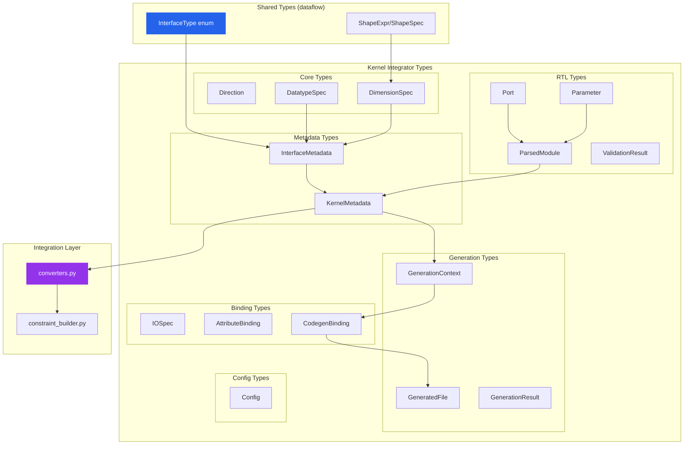

# Kernel Integrator Architecture

**Version**: 4.0  
**Status**: Production Ready  
**Last Updated**: 2025-08-05

## Overview

Converts SystemVerilog RTL modules into FINN-compatible Python operators with a clean, modular type system designed to eliminate circular dependencies and improve maintainability.

**Input**: SystemVerilog RTL with pragma annotations  
**Output**: 
- `*_hw_custom_op.py` - FINN operator class
- `*_rtl.py` - RTL compilation backend
- `*_wrapper.v` - SystemVerilog wrapper
- `generation_metadata.json` - Build information
- `generation_summary.txt` - Human-readable summary

## System Architecture


## Type System Architecture

The kernel integrator uses a modular type system that eliminates circular dependencies and provides clear separation of concerns:



### Type Modules

**Core Types** (`types/core.py`):
- `Direction`: Enum for port directions (INPUT, OUTPUT, INOUT)
- `DatatypeSpec`: Datatype specifications with width, signedness, and constraints
- `DimensionSpec`: Dimension specifications supporting both concrete and symbolic shapes

**RTL Types** (`types/rtl.py`):
- `Port`: RTL port representation with name, direction, and width
- `Parameter`: RTL parameter with name and optional value
- `ParsedModule`: Complete parsed RTL module structure
- `ValidationError/ValidationResult`: Parsing validation results

**Metadata Types** (`types/metadata.py`):
- `InterfaceMetadata`: Complete interface specification including type, dimensions, datatypes
- `KernelMetadata`: Full kernel specification with interfaces, parameters, and pragmas

**Generation Types** (`types/generation.py`):
- `GeneratedFile`: Individual generated file with content and metadata
- `GenerationContext`: Context for template rendering
- `GenerationResult`: Collection of all generated artifacts

**Binding Types** (`types/binding.py`):
- `IOSpec`: Input/output specification for interfaces
- `AttributeBinding`: Node attribute to RTL parameter binding
- `CodegenBinding`: Complete codegen binding specification

**Config Types** (`types/config.py`):
- `Config`: CLI and generation configuration

### Integration Layer

The integration layer provides bidirectional conversion between kernel integrator types and dataflow types:

**Converters** (`converters.py`):
- `metadata_to_kernel_definition()`: Convert KernelMetadata to dataflow KernelDefinition
- `kernel_definition_to_metadata()`: Convert back from KernelDefinition to KernelMetadata
- Preserves all metadata for perfect round-trip conversion

**Constraint Builder** (`constraint_builder.py`):
- Builds dimension and parameter constraints for dataflow integration
- Creates relationships between parameters and interfaces

## Key Components

### RTL Parser
Extracts module structure and pragma annotations from SystemVerilog files. Uses tree-sitter for robust parsing with automatic interface detection and parameter linking.

**Interface Detection**:
- **AXI-Stream**: Recognized by `_TDATA`, `_TVALID`, `_TREADY` suffixes
- **AXI-Lite**: Complete read/write channel patterns (`_AWADDR`, `_AWVALID`, etc.)
- **Global Control**: `_clk`, `_rst_n` suffixes

**Automatic Parameter Linking** (naming conventions):
- `{interface}_WIDTH` → Interface bit width
- `{interface}_SIGNED` → Signedness flag
- `{interface}_BDIM` → Block dimensions (or indexed: `_BDIM0`, `_BDIM1`, etc.)
- `{interface}_SDIM` → Stream dimensions (inputs/weights only)

**Internal Datatype Detection**:
Parameters with datatype suffixes but no matching interface create internal datatypes:
- `THRESH_WIDTH`, `THRESH_SIGNED` → Internal datatype "THRESH"
- `ACC_WIDTH`, `ACC_SIGNED`, `ACC_BIAS` → Internal datatype "ACC"

**Compiler Name Generation**:
- Inputs: `input0`, `input1`, ...
- Outputs: `output0`, `output1`, ...
- Weights: `weight0`, `weight1`, ...
- Config: `config0`, `config1`, ...
- Control: `global`

For comprehensive documentation, see the [RTL Parser README](rtl_parser/README.md).

### Pragma System

RTL annotations that define kernel semantics:

```systemverilog
// @brainsmith DATATYPE <interface> <type> <min_bits> <max_bits>
// @brainsmith DATATYPE_PARAM <interface> <property> <rtl_param>
// @brainsmith BDIM <interface> <param> [SHAPE=<shape>] [RINDEX=<idx>]
// @brainsmith SDIM <interface> <param>
// @brainsmith WEIGHT <interface>
// @brainsmith ALIAS <rtl_param> <python_name>
// @brainsmith DERIVED_PARAMETER <param> <python_expression>
// @brainsmith RELATIONSHIP <source> <target> <type> [args...]
// @brainsmith AXILITE_PARAM <parameter> <interface>
// @brainsmith TOP_MODULE <module_name>
```

See the [RTL Parser Pragma Guide](rtl_parser/PRAGMA_GUIDE.md) for detailed usage examples and best practices.

## Data Flow


## Parameter Binding Architecture

RTL parameters get their values from four different sources, determined by pragma annotations:

### 1. Node Attributes (NODEATTR)
User-configurable parameters exposed in FINN. These become part of the operator's interface.
- **Example**: `PE` (processing elements) parameter
- **Generated code**: `self.get_nodeattr("PE")`
- **Use for**: Algorithm parameters, parallelism factors, user-tunable settings

### 2. Datatype Properties (INTERFACE_DATATYPE)
Extracted from FINN DataType objects associated with interfaces.
- **Example**: `INPUT_WIDTH` from input interface datatype
- **Generated code**: `DataType[self.get_nodeattr("inputDataType")].bitwidth()`
- **Use for**: Bit widths, signed/unsigned flags, quantization parameters

### 3. Derived Parameters (DERIVED)
Calculated from other parameters using Python expressions.
- **Example**: `MEM_DEPTH = TOTAL_WEIGHTS // PE`
- **Generated code**: Direct Python expression in template
- **Use for**: Computed values, dependent parameters, convenience calculations

### 4. Internal Datatypes (INTERNAL_DATATYPE)
Fixed architectural parameters not exposed to users.
- **Example**: `ACC_WIDTH` for accumulator precision
- **Generated code**: `DataType["INT32"].bitwidth()`
- **Use for**: Internal precision, architectural constants, non-configurable datatypes

The binding system resolves all parameters at code generation time, producing explicit assignments in the generated files with no runtime lookups.

## Generated Artifacts

### 1. HWCustomOp (`*_hw_custom_op.py`)
FINN operator class defining node attributes, kernel definition, shape inference, and datatype propagation.

### 2. RTL Backend (`*_rtl.py`)
FINN compilation backend for parameter mapping, template substitution, and build configuration.

### 3. RTL Wrapper (`*_wrapper.v`)
SystemVerilog wrapper standardizing interfaces and enabling FINN parameter substitution.

### 4. Generation Metadata
JSON and text summaries with timestamps, metrics, and validation results.

## Usage Patterns

### Basic Generation
```bash
./smithy exec "python -m brainsmith.tools.kernel_integrator mykernel.sv"
```

### With Custom Output
```bash
./smithy exec "python -m brainsmith.tools.kernel_integrator mykernel.sv -o /custom/path"
```

### Multi-Module Files
```bash
./smithy exec "python -m brainsmith.tools.kernel_integrator complex.sv -m specific_module"
```

## Extension Points

### Adding a New Generator

1. Create a new generator class in `generators/`:
```python
class MyGenerator(GeneratorBase):
    name = "my_output"
    template_file = "my_template.j2"
    output_pattern = "{kernel_name}_my_output.ext"
```

2. Add template to `templates/my_template.j2`

3. The system automatically discovers and uses it

### Adding a New Pragma

1. Create pragma class in `rtl_parser/pragmas/`:
```python
class MyPragma(BasePragma):
    def apply_to_metadata(self, metadata, visitor):
        # Process pragma data
```

2. Register in pragma parser

3. Use in RTL: `// @brainsmith MYPRAGMA args...`

## Performance Characteristics

- **Parsing**: 10-20ms for typical kernels
- **Generation**: 40-60ms for all artifacts  
- **Total**: ~75ms end-to-end
- **Scaling**: Linear with kernel complexity

## Common Workflows

### RTL Designer Workflow


### FINN Integration

Generated files integrate directly with FINN's compilation flow. Multi-stage validation ensures correctness at parsing, building, generation, and output stages with detailed error messages.

## Type System Benefits

The modular type system introduced in v4.0 provides several key benefits:

### 1. No Circular Dependencies
- Clean separation between dataflow and kernel integrator types
- Shared types live in dataflow, avoiding import cycles
- Each type module has clear, single-purpose responsibilities

### 2. Better Maintainability
- Types organized by functional area (RTL, metadata, generation, etc.)
- Easy to find and modify type definitions
- Clear import hierarchy prevents tangled dependencies

### 3. Improved Testing
- Each type module can be tested in isolation
- Mock objects easier to create without complex dependencies
- Type validation happens at the appropriate layer

### 4. Extensibility
- New types can be added without affecting existing code
- Integration layer allows for future dataflow API changes
- Clean interfaces between components

### 5. Type Safety
- Proper use of TypedDict and dataclasses throughout
- TYPE_CHECKING guards prevent runtime import issues
- Strong typing catches errors during development

## Migration Guide

For code using the previous type system:

### Import Changes
```python
# Old
from brainsmith.tools.kernel_integrator.data import InterfaceType, KernelMetadata

# New
from brainsmith.core.dataflow.types import InterfaceType
from brainsmith.tools.kernel_integrator.types.metadata import KernelMetadata
```

### API Changes
- `InterfaceMetadata` now uses `interface_type` instead of `type`
- `KernelMetadata.interfaces` is now a list, not a dict
- Shape specifications use tuples: `(1, 784)` instead of `Shape([1, 784])`

### New Integration Layer
```python
# Convert to dataflow types
from brainsmith.tools.kernel_integrator.converters import metadata_to_kernel_definition
kernel_def = metadata_to_kernel_definition(kernel_metadata)

# Convert back if needed
from brainsmith.tools.kernel_integrator.converters import kernel_definition_to_metadata
metadata = kernel_definition_to_metadata(kernel_def, source_file)
```

## Future Directions

- **Multi-language Support**: VHDL, Chisel generation
- **Streaming Analysis**: Automatic SDIM optimization
- **Incremental Generation**: Only regenerate changed files
- **IDE Integration**: Real-time pragma validation
- **Template Library**: Common patterns and examples
- **Enhanced Type Validation**: Runtime type checking with better error messages
- **Type Serialization**: Efficient storage and transmission of type information