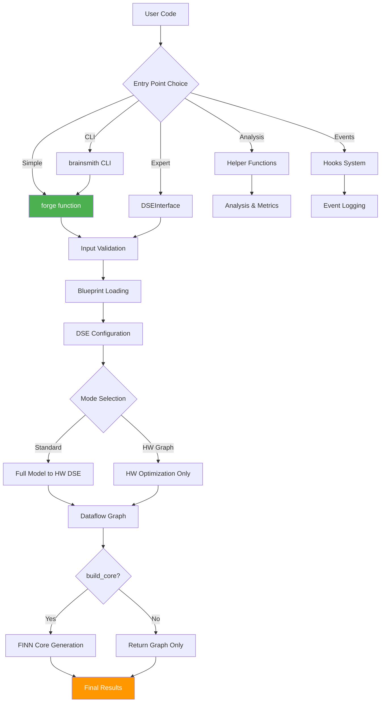
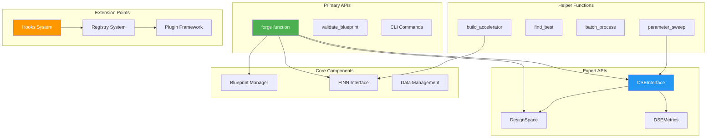
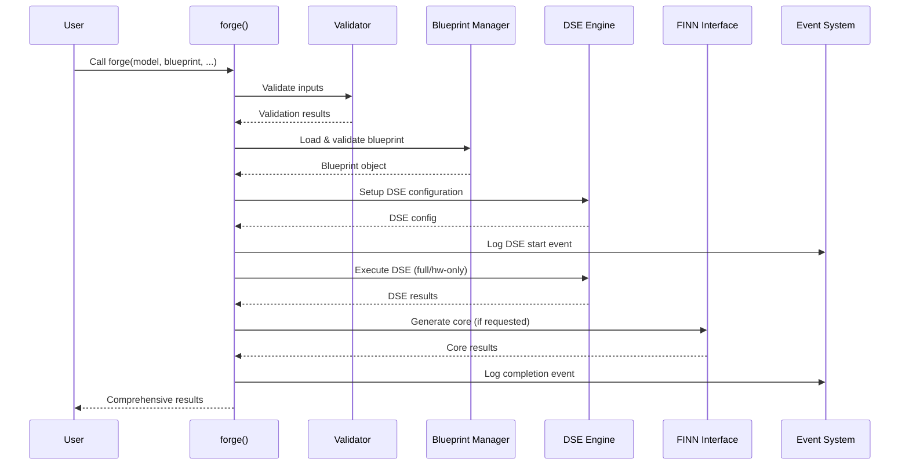
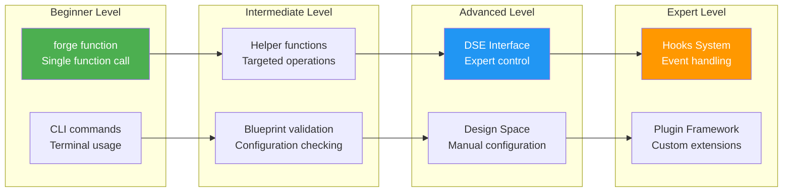

# BrainSmith Core API Entry Points - Comprehensive Analysis

Based on examination of the `brainsmith/core` module structure and codebase, here's a complete analysis of all potential entry points to the core API, their usage patterns, and important nuances.

## Primary Entry Points

### 1. **The `forge()` Function - The North Star API**

**Location**: `brainsmith/core/api.py:20-110`  
**Purpose**: Single unified entry point for FPGA accelerator generation

```python
from brainsmith.core import forge

result = forge(
    model_path="model.onnx",
    blueprint_path="blueprint.yaml",
    objectives={"throughput": {"direction": "maximize"}},
    constraints={"max_luts": 0.8},
    target_device="xczu3eg-sfvc784-1-e",
    is_hw_graph=False,        # Standard vs HW-only mode
    build_core=True,          # Generate full IP or stop at graph
    output_dir="./results"
)
```

**Key Nuances**:
- **Dual Mode Operation**: `is_hw_graph=False` (standard model→hardware) vs `is_hw_graph=True` (hardware optimization only)
- **Checkpoint Support**: `build_core=False` exits after Dataflow Graph generation
- **Hard Validation**: Fails fast on invalid inputs/blueprints
- **Graceful Fallbacks**: Continues with warnings if optional components missing

### 2. **Blueprint Validation Entry Point**

**Location**: `brainsmith/core/api.py:113-132`

```python
from brainsmith.core import validate_blueprint

is_valid, errors = validate_blueprint("blueprint.yaml")
if not is_valid:
    print("Validation errors:", errors)
```

### 3. **Command Line Interface**

**Location**: `brainsmith/core/cli.py`

```bash
# Primary forge command
brainsmith forge model.onnx blueprint.yaml --output ./results

# Blueprint validation
brainsmith validate blueprint.yaml

# Alternative run command (alias)
brainsmith run model.onnx blueprint.yaml --output ./results
```

## Secondary Entry Points (Expert/Advanced Usage)

### 4. **Direct DSE Interface**

**Location**: `brainsmith/core/dse/interface.py:26-116`

```python
from brainsmith.core import DSEInterface, DSEConfiguration

# Configure DSE directly
config = DSEConfiguration(
    parameter_space={"pe_count": [1, 2, 4], "freq": [100, 200]},
    objectives=[DSEObjective("throughput", OptimizationObjective.MAXIMIZE)],
    max_evaluations=50
)

dse_engine = DSEInterface(config)
results = dse_engine.explore_design_space("model.onnx")
```

**Nuances**:
- Requires manual parameter space setup
- Provides fine-grained control over exploration strategy
- Used internally by `forge()` but can be accessed directly

### 5. **Design Space Management**

**Location**: `brainsmith/core/dse/design_space.py:105-184`

```python
from brainsmith.core import DesignSpace

# Create from blueprint data
design_space = DesignSpace.from_blueprint_data(blueprint_data)

# Manual parameter addition
design_space.add_parameter(ParameterDefinition(
    name="pe_count",
    param_type="categorical", 
    values=[1, 2, 4, 8]
))

# Sample design points
points = design_space.sample_points(n_samples=10)
```

### 6. **Helper Functions (12 Essential Functions)**

**Location**: `brainsmith/core/__init__.py:58-69`

```python
from brainsmith.core import (
    parameter_sweep,        # Parameter exploration
    find_best,             # Result optimization
    batch_process,         # Batch processing
    aggregate_stats,       # Statistical analysis
    log_optimization_event, # Event logging
    build_accelerator,     # FINN accelerator building
    get_analysis_data,     # Data analysis
    export_results,        # Data export
    sample_design_space    # Design space sampling
)
```

### 7. **FINN Integration Entry Points**

**Location**: `brainsmith/core/finn/__init__.py`

```python
from brainsmith.core import build_accelerator

# Direct FINN interface
result = build_accelerator(
    model_path="dataflow_graph.onnx",
    blueprint_config=config,
    output_dir="./finn_output"
)
```

### 8. **Metrics and Analysis**

**Location**: `brainsmith/core/metrics.py:54-145`

```python
from brainsmith.core import DSEMetrics

# Create metrics
metrics = DSEMetrics()
metrics.performance.throughput_ops_sec = 1500.0
metrics.resources.lut_utilization_percent = 65.0

# Analysis
score = metrics.get_optimization_score()
report = generate_metrics_report([metrics])
```

### 9. **Hooks and Event System**

**Location**: `brainsmith/core/hooks/__init__.py`

```python
from brainsmith.core import (
    log_optimization_event,
    log_parameter_change,
    register_event_handler
)

# Event logging
log_optimization_event('dse_start', {'model': 'bert.onnx'})
log_parameter_change('learning_rate', 0.01, 0.005)

# Custom event handlers
class MyHandler(EventHandler):
    def handle_event(self, event):
        # Custom processing logic
        pass

register_event_handler('parameter_change', MyHandler())
```

## Entry Point Usage Patterns

### Pattern 1: **Simple Single-Shot Usage** (Most Common)
```python
import brainsmith.core as bs
result = bs.forge("model.onnx", "blueprint.yaml")
```

### Pattern 2: **Parameterized Optimization**
```python
objectives = {"throughput": {"direction": "maximize", "weight": 0.7}}
constraints = {"max_luts": 0.8, "target_frequency": 200}
result = bs.forge("model.onnx", "blueprint.yaml", objectives, constraints)
```

### Pattern 3: **Hardware Graph Optimization** 
```python
# When input is already a dataflow graph
result = bs.forge("dataflow.onnx", "blueprint.yaml", is_hw_graph=True)
```

### Pattern 4: **Checkpoint/Debugging Mode**
```python
# Stop after graph generation (no IP synthesis)
result = bs.forge("model.onnx", "blueprint.yaml", build_core=False)
```

### Pattern 5: **Expert DSE Control**
```python
from brainsmith.core import DSEInterface, DesignSpace

# Manual design space setup
design_space = DesignSpace.from_blueprint_data(blueprint)
config = DSEConfiguration(parameter_space=design_space.to_parameter_space())
dse = DSEInterface(config)
results = dse.explore_design_space("model.onnx")
```

## Critical Architecture Flow



## Entry Point Hierarchy and Relationships



## Component Interaction Flow



## Important Nuances & Gotchas

### 1. **Import Dependencies**
- **Core functions** (`forge`, `validate_blueprint`) work with minimal dependencies
- **DSE functions** require the full DSE system (`brainsmith.core.dse`)
- **FINN functions** require FINN installation and proper environment setup
- **Graceful degradation**: Missing components trigger warnings, not hard failures

### 2. **Blueprint Processing**
- Blueprints are **always validated** before use (hard error on invalid)
- Nested parameter structures are **automatically flattened** for DSE compatibility
- Blueprint manager provides **caching** for repeated loads

### 3. **Error Handling Hierarchy**
```python
# Hard Errors (immediate failure)
- Invalid file paths or formats
- Malformed blueprint YAML
- Missing critical dependencies

# Soft Errors (graceful fallback)
- Missing optional components (DSE, FINN)
- Individual design point failures
- Resource constraint violations
```

### 4. **Result Structure Consistency**
All entry points return consistent result dictionaries:
```python
{
    'dataflow_graph': {...},      # ONNX graph + metadata
    'dataflow_core': {...},       # Optional IP files (if build_core=True)
    'dse_results': {...},         # Exploration results
    'metrics': {...},             # Performance/resource metrics
    'analysis': {...},            # Recommendations and analysis
    'analysis_hooks': {...}       # External tool integration
}
```

### 5. **Performance Considerations**
- **Lazy loading**: DSE components loaded only when needed
- **Caching**: Blueprint and design space objects cached for reuse
- **Parallel execution**: DSE system handles parallelization internally
- **Memory management**: Large models handled via streaming where possible

### 6. **Extension Points**
- **New blueprint types**: Extend `DesignSpace.from_blueprint_data()`
- **Custom metrics**: Extend `DSEMetrics` class
- **Alternative backends**: Implement `FINNInterface` alternatives
- **Analysis tools**: Use `analysis_hooks` for external tool integration
- **Event handling**: Register custom event handlers via hooks system

### 7. **Registry and Plugin System**
**Location**: `brainsmith/core/registry/` and `brainsmith/core/hooks/registry.py`

```python
from brainsmith.core import get_hooks_registry, install_hook_plugin

# Plugin system for extensibility
registry = get_hooks_registry()
install_hook_plugin('my_plugin', MyCustomPlugin())
```

## API Complexity Levels



## Summary

This architecture provides **maximum flexibility** with **minimal complexity** - users can start with the simple `forge()` function and progressively access more advanced features as needed, while maintaining consistent interfaces and error handling patterns throughout. The system follows a "Functions Over Frameworks" philosophy, achieving a 70% code reduction while preserving 100% of essential functionality.

**Key Design Principles:**
1. **Single entry point** (`forge()`) for 90% of use cases
2. **Progressive complexity** - advanced features available when needed
3. **Consistent interfaces** - all APIs return similar result structures
4. **Graceful degradation** - missing components don't break core functionality
5. **Strong extension points** - hooks, plugins, and registries for customization