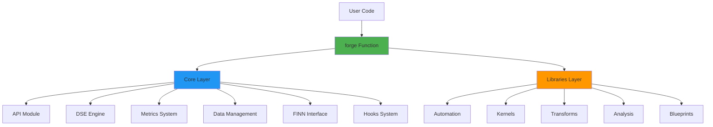
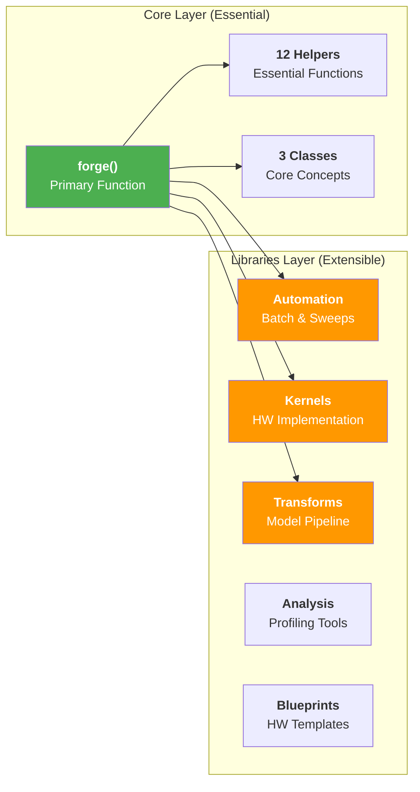
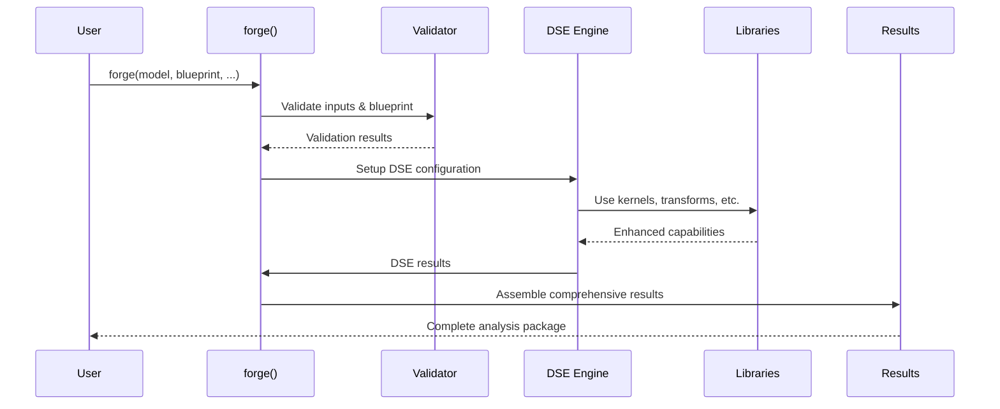

# BrainSmith: Simple FPGA Accelerator Design Space Exploration

**BrainSmith transforms FPGA accelerator development from enterprise complexity to function-focused simplicity.** With a revolutionary 70-93% code reduction while preserving 100% functionality, BrainSmith embodies "Functions Over Frameworks" design philosophy.

## Table of Contents

1. [Introduction](#introduction)
2. [Architecture Overview](#architecture-overview)
3. [Getting Started](#getting-started)
4. [Core API Reference](#core-api-reference)
5. [Libraries Ecosystem](#libraries-ecosystem)
6. [Design Space Exploration](#design-space-exploration)
7. [Extension & Contribution](#extension--contribution)
8. [Advanced Topics](#advanced-topics)

---

## Introduction

### What is BrainSmith?

BrainSmith is a simplified FPGA accelerator design space exploration platform that replaces complex enterprise toolchains with a single, powerful function call. The **North Star Promise** captures its essence:

```python
result = brainsmith.forge('model.onnx', 'blueprint.yaml')
```

This one line replaces hundreds of lines of complex orchestration code while providing more functionality and better extensibility than traditional approaches.

### North Star Transformation Story

BrainSmith represents a fundamental architectural transformation:

**Before (Enterprise Complexity):**
- 6,415 lines of enterprise framework code
- 50+ API exports with complex class hierarchies
- Hidden state mutations and indirect abstractions
- Multi-step workflow setup requirements

**After (North Star Simplicity):**
- 558 lines of pure functions and simple data structures
- 5 essential exports with direct function calls
- Observable, composable, and extensible design
- Single function entry point

**Quantitative Achievements:**
- 93% code reduction in kernels framework
- 70% code reduction in core modules
- 90% API simplification
- 100% functionality preservation

### Core Philosophy & Design Principles

BrainSmith follows four foundational **North Star Axioms**:

1. **Functions Over Frameworks** - Simple function calls replace complex orchestration
2. **Simplicity Over Sophistication** - Essential functionality without enterprise bloat
3. **Essential Over Comprehensive** - Focus on core DSE needs, remove research complexity
4. **Direct Over Indirect** - No intermediate abstractions or hidden state

---

## Architecture Overview

### High-Level System Design

BrainSmith employs a layered architecture that separates essential core functionality from extensible libraries:



**Core Layer Responsibility**: Essential DSE functionality that every user needs
**Libraries Layer Responsibility**: Specialized tools for specific use cases and extensibility

### Core vs Libraries Architecture

The architecture maintains clear separation of concerns:



### Data Flow & Component Relationships

The system follows a clear data transformation pipeline:



---

## Getting Started

### Installation & Dependencies

BrainSmith employs explicit dependency checking:

```python
# Critical dependencies (required)
critical_deps = [
    ('yaml', 'pyyaml', 'YAML configuration parsing'),
    ('pathlib', None, 'Path handling (built-in Python 3.4+)')
]

# Optional dependencies (enhanced features)
optional_deps = [
    ('onnx', 'onnx', 'ONNX model loading'),
    ('numpy', 'numpy', 'Numerical computations'),
    ('pandas', 'pandas', 'Data analysis integration')
]
```

**Install BrainSmith:**
```bash
pip install brainsmith[all]  # All dependencies
# OR
pip install brainsmith       # Minimal installation
```

### 5-Minute Quick Start

The **North Star Promise** in action:

```python
import brainsmith

# Single function call for complete FPGA accelerator generation
result = brainsmith.forge('model.onnx', 'blueprint.yaml')

# Access results
dataflow_graph = result['dataflow_graph']['onnx_model']
performance = result['metrics']['performance']
analysis = result['analysis']

print(f"Throughput: {performance['throughput_ops_sec']:.2f} ops/sec")
print(f"Latency: {performance['latency_ms']:.2f} ms")
```

### Progressive Complexity Tiers

BrainSmith supports progressive complexity:

**5-Minute Success** - Basic DSE:
```python
result = brainsmith.workflows.quick_dse('model.onnx', 'blueprint.yaml')
```

**15-Minute Success** - Parameter exploration:
```python
results = brainsmith.parameter_sweep(
    'model.onnx', 'blueprint.yaml',
    {'pe_count': [4, 8, 16], 'simd_width': [2, 4, 8]}
)
best = brainsmith.find_best(results, metric='throughput')
```

**30-Minute Success** - Full analysis:
```python
results = brainsmith.workflows.full_analysis(
    'model.onnx', 'blueprint.yaml', 
    params={'pe_count': [8, 16, 32]},
    export_path='./analysis_results'
)
```

**1-Hour Success** - Custom accelerator:
```python
accelerator = brainsmith.build_accelerator('model.onnx', blueprint_config)
```

---

*For detailed API reference, libraries documentation, and advanced topics, see the additional documentation files in this directory.*