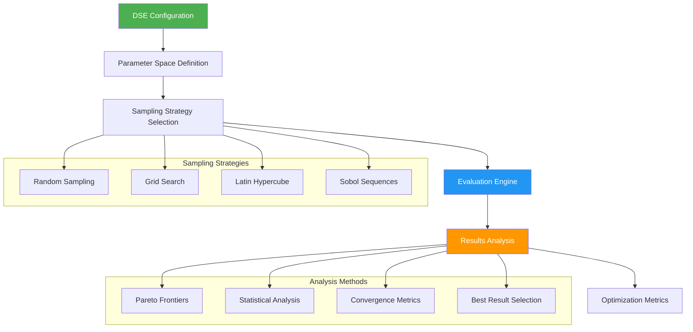

# Design Space Exploration (DSE) in BrainSmith

BrainSmith's DSE system provides comprehensive design space exploration capabilities with sophisticated optimization strategies while maintaining the North Star principle of simplicity.

## DSE Architecture Overview

The DSE system follows a clean, modular architecture as implemented in `brainsmith/core/dse/`:



## Core DSE Components

### DSEInterface - Main Exploration Engine

The primary interface for design space exploration:

```python
from brainsmith.core.dse import DSEInterface, DSEConfiguration

# Configure exploration
config = DSEConfiguration(
    objectives=[
        DSEObjective("throughput", OptimizationObjective.MAXIMIZE, weight=0.7),
        DSEObjective("power", OptimizationObjective.MINIMIZE, weight=0.3)
    ],
    parameter_space={
        'pe_count': [4, 8, 16, 32, 64],
        'simd_width': [2, 4, 8, 16],
        'memory_mode': ['internal', 'external']
    },
    max_evaluations=100,
    sampling_strategy=SamplingStrategy.LATIN_HYPERCUBE
)

# Execute exploration
dse = DSEInterface(config)
results = dse.explore_design_space('model.onnx')
```

### Parameter Space Definition

Define exploration spaces using simple data structures:

```python
from brainsmith.core.dse.types import ParameterDefinition

# Define individual parameters
pe_param = ParameterDefinition(
    name="pe_count",
    param_type="integer",
    min_value=1,
    max_value=64,
    default_value=16,
    description="Number of processing elements"
)

# Define parameter space as dictionary
parameter_space = {
    'pe_count': [4, 8, 16, 32, 64],           # Discrete values
    'simd_width': list(range(2, 33, 2)),      # Generated range
    'memory_mode': ['internal', 'external'],   # Categorical choices
    'clock_freq': [100, 150, 200, 250, 300]   # Frequency options
}
```

### Design Space Management

The DesignSpace class provides sophisticated parameter management:

```python
from brainsmith.core.dse.design_space import DesignSpace

# Create design space
space = DesignSpace("conv_optimization")

# Add parameters with validation
space.add_parameter(ParameterDefinition(
    name="pe_count",
    param_type="integer",
    min_value=1,
    max_value=64,
    step=1,
    default_value=8
))

space.add_parameter(ParameterDefinition(
    name="optimization_target",
    param_type="categorical",
    choices=["throughput", "latency", "area", "balanced"],
    default_value="balanced"
))

# Sample design points
sample_points = space.sample_points(n_samples=50, strategy="latin_hypercube")

# Validate design space
is_valid, errors = space.validate()
if not is_valid:
    print("Validation errors:", errors)
```

## Sampling Strategies

### Random Sampling
Simple random sampling for quick exploration:

```python
config = DSEConfiguration(
    sampling_strategy=SamplingStrategy.RANDOM,
    max_evaluations=50,
    random_seed=42  # For reproducibility
)
```

### Grid Search
Systematic exploration of parameter combinations:

```python
# Grid search automatically applied when parameter_space has discrete values
parameter_space = {
    'pe_count': [8, 16, 32],
    'simd_width': [4, 8, 16],
    'memory_mode': ['internal', 'external']
}
# Generates 3 × 3 × 2 = 18 combinations
```

### Latin Hypercube Sampling
Efficient space-filling design for continuous parameters:

```python
config = DSEConfiguration(
    sampling_strategy=SamplingStrategy.LATIN_HYPERCUBE,
    max_evaluations=100,
    random_seed=42
)
```

### Sobol Sequences
Low-discrepancy sequences for uniform coverage:

```python
config = DSEConfiguration(
    sampling_strategy=SamplingStrategy.SOBOL,
    max_evaluations=128  # Powers of 2 recommended for Sobol
)
```

## Optimization Objectives

### Single Objective Optimization

```python
# Maximize throughput
throughput_objective = DSEObjective(
    name="performance.throughput_ops_sec",
    direction=OptimizationObjective.MAXIMIZE,
    weight=1.0,
    target_value=1000000  # Target 1M ops/sec
)

config = DSEConfiguration(objectives=[throughput_objective])
```

### Multi-Objective Optimization

```python
# Balance throughput and power
objectives = [
    DSEObjective("performance.throughput_ops_sec", OptimizationObjective.MAXIMIZE, weight=0.6),
    DSEObjective("resources.estimated_power_w", OptimizationObjective.MINIMIZE, weight=0.4),
    DSEObjective("resources.lut_utilization_percent", OptimizationObjective.MINIMIZE, weight=0.2)
]

config = DSEConfiguration(objectives=objectives)
```

### Objective Metrics Access

Access nested metrics in results:

```python
# Metrics are accessed using dot notation
"performance.throughput_ops_sec"     # Performance metrics
"performance.latency_ms"             # Latency metrics
"resources.lut_utilization_percent"  # Resource utilization
"resources.dsp_utilization_percent"  # DSP usage
"resources.estimated_power_w"        # Power consumption
```

## Evaluation and Results

### Parallel Evaluation
DSE supports parallel evaluation of design points:

```python
config = DSEConfiguration(
    max_parallel=4,              # 4 parallel evaluations
    timeout_seconds=3600,        # 1 hour timeout per evaluation
    continue_on_failure=True     # Continue if some evaluations fail
)
```

### Results Analysis

```python
# Execute DSE and analyze results
results = dse.explore_design_space('model.onnx')

# Access results
print(f"Total evaluations: {results.total_evaluations}")
print(f"Successful: {results.successful_evaluations}")
print(f"Success rate: {results.get_success_rate():.1%}")

# Get best result
best = results.best_result
if best:
    print(f"Best throughput: {best.get_objective_value('performance.throughput_ops_sec')}")
```

### Statistical Analysis

```python
from brainsmith.core.metrics import analyze_dse_results

# Generate comprehensive analysis
analysis = analyze_dse_results(results.results)

print(f"Total runs: {analysis['total_runs']}")
print(f"Success rate: {analysis['success_rate']:.1%}")

# Access summary statistics
if 'summary' in analysis:
    for metric, stats in analysis['summary'].items():
        print(f"{metric}: mean={stats['mean']:.2f}, std={stats['std']:.2f}")
```

## Pareto Frontier Analysis

### Single vs Multi-Objective

```python
# Single objective: returns best result
if len(objectives) == 1:
    best_results = [results.best_result]
else:
    # Multi-objective: compute Pareto frontier
    pareto_points = dse.get_pareto_frontier(results.results)
```

### Advanced Pareto Analysis

```python
from brainsmith.core.metrics import get_pareto_frontier, calculate_hypervolume

# Custom Pareto analysis
pareto_frontier = get_pareto_frontier(
    metrics_list,
    objectives=['throughput', 'resource_efficiency', 'latency']
)

# Quality metric: hypervolume indicator
hypervolume = calculate_hypervolume(
    pareto_frontier,
    reference_point={'throughput': 0.0, 'resource_efficiency': 0.0}
)

print(f"Solution quality (hypervolume): {hypervolume:.3f}")
```

### Pareto Visualization Data

```python
# Extract data for plotting Pareto frontier
pareto_data = []
for point in pareto_frontier:
    pareto_data.append({
        'throughput': point.performance.throughput_ops_sec,
        'power': point.resources.estimated_power_w,
        'lut_util': point.resources.lut_utilization_percent,
        'parameters': point.configuration
    })

# Export for external visualization
import json
with open('pareto_frontier.json', 'w') as f:
    json.dump(pareto_data, f, indent=2, default=str)
```

## Advanced DSE Features

### Constraint Handling

```python
# Hard constraints (evaluation fails if violated)
hard_constraints = {
    'max_lut_util': 0.85,        # Max 85% LUT utilization
    'max_dsp_util': 0.90,        # Max 90% DSP utilization
    'max_power_w': 25.0,         # Max 25W power consumption
    'min_frequency_mhz': 100     # Min 100MHz frequency
}

# Soft constraints (penalty in objective function)
soft_constraints = {
    'target_lut_util': 0.70,     # Prefer 70% LUT utilization
    'target_power_w': 15.0,      # Prefer 15W power consumption
    'penalty_weight': 0.1        # Penalty weight for violations
}

config = DSEConfiguration(
    constraints={**hard_constraints, **soft_constraints}
)
```

### Convergence Monitoring

```python
# Monitor optimization convergence
statistics = dse.get_statistics()

print(f"Best objective value: {statistics.best_objective_value}")
print(f"Convergence rate: {statistics.convergence_rate}")
print(f"Space coverage: {statistics.space_coverage:.1%}")

# Access objective history for plotting
objective_history = statistics.objective_history
```

### Early Stopping

```python
# Stop early if convergence achieved
config = DSEConfiguration(
    max_evaluations=1000,
    convergence_threshold=0.01,  # Stop if improvement < 1%
    convergence_window=20,       # Over last 20 evaluations
    min_evaluations=50          # Minimum evaluations before stopping
)
```

## Integration with Core API

### DSE within forge()

DSE is automatically integrated into the core forge() function:

```python
# DSE automatically configured based on blueprint
result = brainsmith.forge(
    'model.onnx', 'blueprint.yaml',
    objectives={'throughput': {'direction': 'maximize'}},
    constraints={'max_luts': 0.8}
)

# Access DSE results
dse_results = result['dse_results']
best_config = dse_results['best_configuration']
pareto_points = dse_results['pareto_frontier']
```

### Parameter Sweep Integration

```python
# Parameter sweeps use DSE engine internally
from brainsmith.libraries.automation import parameter_sweep

results = parameter_sweep(
    'model.onnx', 'blueprint.yaml',
    {'pe_count': [8, 16, 32], 'simd_width': [4, 8, 16]}
)

# Each result contains DSE metadata
for result in results:
    sweep_params = result['sweep_info']['parameters']
    dse_score = result['metrics']['optimization_score']
```

## Performance Optimization

### Efficient Sampling

```python
# Optimize sampling for large parameter spaces
def optimize_sampling_strategy(param_space, max_evaluations):
    param_count = len(param_space)
    total_combinations = 1
    for values in param_space.values():
        total_combinations *= len(values)
    
    if total_combinations <= max_evaluations:
        return SamplingStrategy.GRID  # Use grid if feasible
    elif param_count <= 5:
        return SamplingStrategy.LATIN_HYPERCUBE  # LHS for medium spaces
    else:
        return SamplingStrategy.SOBOL  # Sobol for high-dimensional spaces

strategy = optimize_sampling_strategy(parameter_space, 100)
```

### Caching and Memoization

```python
# Enable result caching for repeated evaluations
config = DSEConfiguration(
    enable_caching=True,
    cache_size=1000,
    hash_precision=6  # Floating point precision for caching
)
```

### Parallel Scaling

```python
import multiprocessing

# Scale parallelism based on available resources
max_workers = min(multiprocessing.cpu_count(), 8)  # Max 8 workers

config = DSEConfiguration(
    max_parallel=max_workers,
    batch_size=max_workers * 2,  # 2x batching for efficiency
    memory_limit_gb=16          # Memory limit for parallel workers
)
```

## DSE Utilities and Helpers

### Quick DSE Functions

```python
from brainsmith.core.dse import run_simple_dse, quick_parameter_sweep

# Simple DSE with minimal configuration
results = run_simple_dse(
    'model.onnx', 'blueprint.yaml',
    parameter_space={'pe_count': [8, 16, 32]},
    objectives=[DSEObjective("throughput", OptimizationObjective.MAXIMIZE)]
)

# Quick parameter sweep
sweep_results = quick_parameter_sweep(
    'model.onnx', 'blueprint.yaml',
    {'pe_count': [4, 8, 16], 'simd_width': [2, 4, 8]}
)
```

### Result Filtering and Selection

```python
from brainsmith.core.dse import find_best_throughput, find_best_efficiency

# Find best by specific metrics
best_throughput = find_best_throughput(results.results)
best_efficiency = find_best_efficiency(results.results)

# Custom filtering
successful_results = [r for r in results.results if r.build_success]
high_throughput = [r for r in successful_results 
                   if r.get_objective_value('performance.throughput_ops_sec') > 500000]
```

## Reporting and Visualization

### Comprehensive Reports

```python
from brainsmith.core.metrics import generate_metrics_report

# Generate detailed analysis report
report = generate_metrics_report(results.results)
print(report)

# Save report to file
with open('dse_analysis_report.txt', 'w') as f:
    f.write(report)
```

### Export for External Tools

```python
# Export results to pandas DataFrame
import pandas as pd

results_data = []
for result in results.results:
    if result.build_success:
        results_data.append({
            'pe_count': result.parameters.get('pe_count'),
            'simd_width': result.parameters.get('simd_width'),
            'throughput': result.get_objective_value('performance.throughput_ops_sec'),
            'latency': result.get_objective_value('performance.latency_ms'),
            'lut_util': result.get_objective_value('resources.lut_utilization_percent'),
            'optimization_score': result.metrics.get_optimization_score()
        })

df = pd.DataFrame(results_data)
df.to_csv('dse_results.csv', index=False)
```

## Best Practices

### Parameter Space Design

1. **Start Small**: Begin with 2-3 key parameters
2. **Use Domain Knowledge**: Leverage expert knowledge for parameter ranges
3. **Consider Interactions**: Include parameters that interact significantly
4. **Validate Bounds**: Ensure parameter ranges are realistic and achievable

### Sampling Strategy Selection

1. **Grid Search**: Use for small, discrete parameter spaces (< 100 combinations)
2. **Latin Hypercube**: Good for medium spaces with continuous parameters
3. **Sobol**: Best for high-dimensional spaces (> 10 parameters)
4. **Random**: Use for quick exploration or irregular parameter distributions

### Multi-Objective Optimization

1. **Weight Selection**: Choose weights based on application priorities
2. **Objective Scaling**: Normalize objectives to similar ranges
3. **Pareto Analysis**: Always examine the Pareto frontier for trade-offs
4. **Validation**: Validate Pareto solutions with domain experts

### Performance Tips

1. **Parallel Evaluation**: Use parallelism for independent evaluations
2. **Early Stopping**: Implement convergence criteria for large searches
3. **Caching**: Enable caching for repeated parameter combinations
4. **Batch Processing**: Group similar evaluations for efficiency

The DSE system in BrainSmith provides professional-grade optimization capabilities while maintaining the simplicity and directness that characterizes the entire platform. Whether optimizing for single objectives or exploring complex multi-objective trade-offs, the system provides the tools needed for effective FPGA accelerator design space exploration.