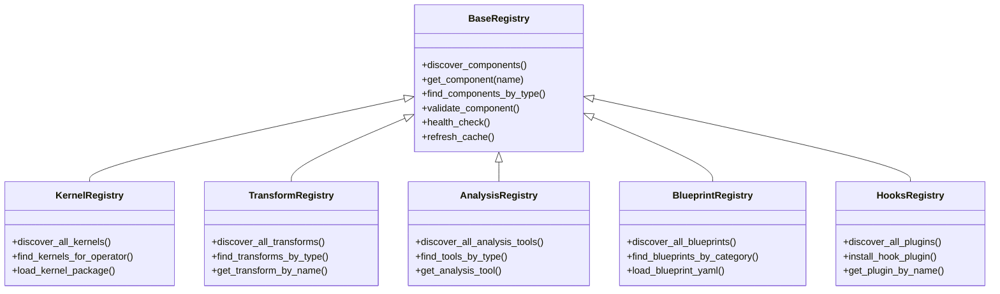

# BrainSmith Extension & Advanced Topics

This document covers advanced BrainSmith topics including the extension system architecture, contribution workflows, FINN integration, event systems, and performance optimization strategies.

## Extension System Architecture

BrainSmith provides a unified registry-based extension system that enables zero-barrier contributions across all components.

### Unified Registry Infrastructure

All registries inherit from a common base as implemented in `brainsmith/core/registry/base.py`:



### Standardized Discovery Pattern

All registries follow the same discovery pattern:

```python
# Universal discovery interface
from brainsmith.libraries.{module} import discover_all_{components}

# Examples across all libraries
kernels = brainsmith.libraries.kernels.discover_all_kernels()
transforms = brainsmith.libraries.transforms.discover_all_transforms()
analysis_tools = brainsmith.libraries.analysis.discover_all_analysis_tools()
blueprints = brainsmith.libraries.blueprints.discover_all_blueprints()
plugins = brainsmith.core.hooks.discover_all_plugins()
```

### Component Validation

All components are validated using the same interface:

```python
# Standardized validation across all registries
def validate_component(component_name: str) -> Tuple[bool, List[str]]:
    registry = get_registry()
    is_valid, errors = registry.validate_component(component_name)
    
    if not is_valid:
        print("Validation errors:")
        for error in errors:
            print(f"  • {error}")
    
    return is_valid, errors
```

### Health Monitoring

Monitor system health across all registries:

```python
# Health check for all registries
def system_health_check():
    registries = [
        ('kernels', brainsmith.libraries.kernels.get_kernel_registry()),
        ('transforms', brainsmith.libraries.transforms.get_transform_registry()),
        ('analysis', brainsmith.libraries.analysis.get_analysis_registry()),
        ('blueprints', brainsmith.libraries.blueprints.get_blueprint_library_registry()),
        ('hooks', brainsmith.core.hooks.get_hooks_registry())
    ]
    
    for name, registry in registries:
        health = registry.health_check()
        print(f"{name}: {health['status']} - {health['total_components']} components")
```

## Contribution Workflows

### Zero-Barrier Kernel Contribution

Add custom kernels with no registration required:

**1. Create Kernel Package Structure:**
```bash
mkdir my_custom_kernel/
cd my_custom_kernel/
```

**2. Create kernel.yaml Manifest:**
```yaml
name: "my_custom_kernel"
operator_type: "Convolution"
backend: "HLS"
version: "1.0.0"
author: "Your Name"
license: "MIT"
description: "Custom optimized convolution kernel"

parameters:
  pe_range: [1, 32]
  simd_range: [2, 16]
  supported_datatypes: ["int8", "int16"]
  memory_modes: ["internal", "external"]

files:
  hls_source: "conv_kernel.cpp"
  header: "conv_kernel.hpp"
  python_backend: "conv_backend.py"
  rtl_backend: "conv_rtl_backend.py"
  testbench: "test_conv.py"

performance:
  optimization_target: "throughput"
  estimated_throughput: 2000000
  estimated_latency: 50
  resource_usage:
    lut_base: 1500
    dsp_base: 8
    bram_base: 2

validation:
  verified: true
  test_coverage: 0.95
```

**3. Implement Kernel Files:**
```cpp
// conv_kernel.cpp - HLS implementation
#include "conv_kernel.hpp"

void conv_kernel(
    hls::stream<ap_uint<8>>& in_stream,
    hls::stream<ap_uint<8>>& out_stream,
    const int PE,
    const int SIMD
) {
#pragma HLS INTERFACE axis port=in_stream
#pragma HLS INTERFACE axis port=out_stream
#pragma HLS INTERFACE s_axilite port=PE
#pragma HLS INTERFACE s_axilite port=SIMD

    // Kernel implementation here
    for (int i = 0; i < PE; i++) {
#pragma HLS UNROLL
        for (int j = 0; j < SIMD; j++) {
#pragma HLS PIPELINE II=1
            // Processing logic
        }
    }
}
```

**4. Automatic Discovery:**
```python
# No registration needed - automatic discovery!
from brainsmith.libraries.kernels import discover_all_kernels

kernels = discover_all_kernels()
assert 'my_custom_kernel' in kernels

# Use immediately
from brainsmith.libraries.kernels import select_optimal_kernel, KernelRequirements

requirements = KernelRequirements(
    operator_type="Convolution",
    datatype="int8"
)
selection = select_optimal_kernel(requirements)
```

### Transform Step Contribution

Add custom transformation steps to the pipeline:

**1. Create Transform Function:**
```python
# custom_transforms.py
def my_optimization_step(model, cfg):
    """
    Custom optimization transformation step.
    
    Category: optimization
    Dependencies: [cleanup]
    Description: Apply custom optimization patterns to model
    """
    # Implementation here
    optimized_model = apply_custom_optimization(model, cfg)
    return optimized_model

def my_validation_step(model, cfg):
    """
    Custom validation step.
    
    Category: validation  
    Dependencies: [my_optimization]
    Description: Validate custom optimization results
    """
    # Validation logic
    if not validate_optimization(model):
        raise ValueError("Custom optimization validation failed")
    return model
```

**2. Automatic Discovery:**
```python
# Steps automatically discovered through naming convention
from brainsmith.libraries.transforms.steps import discover_all_steps

steps = discover_all_steps()
# my_optimization_step discovered as 'my_optimization'
# my_validation_step discovered as 'my_validation'

# Use in pipeline
from brainsmith.libraries.transforms.steps import get_step

opt_step = get_step('my_optimization')
val_step = get_step('my_validation')

model = opt_step(model, config)
model = val_step(model, config)
```

**3. Pipeline Validation:**
```python
from brainsmith.libraries.transforms.steps import validate_step_sequence

# Validate step dependencies
step_sequence = ['cleanup', 'my_optimization', 'my_validation', 'streamlining']
errors = validate_step_sequence(step_sequence)

if errors:
    print("Pipeline validation errors:")
    for error in errors:
        print(f"  • {error}")
```

### Analysis Tool Contribution

Add custom analysis and profiling tools:

**1. Create Analysis Tool:**
```python
# custom_analysis.py
class CustomProfiler:
    """Custom profiling tool for specific analysis needs."""
    
    def __init__(self):
        self.analysis_type = "profiling"
        self.name = "custom_profiler"
        self.description = "Custom profiling analysis"
    
    def profile_model(self, model_config, hardware_config):
        """Perform custom profiling analysis."""
        # Analysis implementation
        results = perform_custom_analysis(model_config, hardware_config)
        return results
    
    def generate_report(self, results, output_path=None):
        """Generate analysis report."""
        report = create_custom_report(results)
        if output_path:
            with open(output_path, 'w') as f:
                f.write(report)
        return report

def custom_analysis_function(model_data, analysis_params):
    """Standalone analysis function."""
    # Analysis logic here
    return analysis_results
```

**2. Tool Registration:**
```python
# tools/__init__.py
from .custom_analysis import CustomProfiler, custom_analysis_function

__all__ = ['CustomProfiler', 'custom_analysis_function']
```

**3. Automatic Discovery:**
```python
from brainsmith.libraries.analysis import discover_all_analysis_tools

tools = discover_all_analysis_tools()
# CustomProfiler automatically discovered

# Use the tool
profiler = CustomProfiler()
results = profiler.profile_model(model_config, hw_config)
```

### Blueprint Contribution

Add custom blueprint templates:

**1. Create Blueprint YAML:**
```yaml
# libraries/blueprints/custom/high_throughput_cnn.yaml
name: "High Throughput CNN Accelerator"
version: "1.0.0"
description: "Ultra-high throughput CNN accelerator for inference"
model_type: "CNN"
target_platform: "Zynq UltraScale+"
author: "Your Name"

parameters:
  pe_count:
    type: "integer"
    range: [16, 128]
    default: 64
    description: "Number of processing elements"
  
  simd_width:
    type: "integer"
    range: [8, 64]
    default: 32
    description: "SIMD width for vector operations"
  
  memory_hierarchy:
    type: "categorical"
    values: ["distributed", "centralized", "hybrid"]
    default: "hybrid"
    description: "Memory hierarchy configuration"

targets:
  throughput:
    direction: "maximize"
    priority: "high"
    target_value: 5000000
    weight: 0.8
  
  power:
    direction: "minimize"
    priority: "medium"
    target_value: 20.0
    weight: 0.2

constraints:
  max_lut_util: 0.90
  max_dsp_util: 0.95
  max_bram_util: 0.85
  min_frequency_mhz: 250
```

**2. Automatic Discovery:**
```python
from brainsmith.libraries.blueprints import discover_all_blueprints

blueprints = discover_all_blueprints()
# high_throughput_cnn automatically discovered

# Use the blueprint
blueprint = get_blueprint_by_name("high_throughput_cnn")
result = brainsmith.forge("model.onnx", blueprint.file_path)
```

## Event System & Hooks Architecture

BrainSmith provides an extensible event system for monitoring and extending optimization processes.

### Event System Overview


### Core Event Types

The system provides several built-in event types:

```python
from brainsmith.core.hooks.types import EventTypes

# Built-in event types
EventTypes.PARAMETER_CHANGE     # Parameter modifications
EventTypes.PERFORMANCE_METRIC   # Performance measurements
EventTypes.STRATEGY_DECISION    # Optimization strategy choices
EventTypes.DSE_EVENT           # Design space exploration events
EventTypes.OPTIMIZATION_START   # Optimization process start
EventTypes.OPTIMIZATION_END     # Optimization process completion
```

### Basic Event Usage

```python
from brainsmith.core.hooks import (
    log_optimization_event, log_parameter_change, log_performance_metric
)

# Log parameter changes
log_parameter_change('pe_count', old_value=8, new_value=16)

# Log performance metrics
log_performance_metric('throughput', 1500000.0, context={'pe_count': 16})

# Log optimization events
log_optimization_event('dse_completed', {
    'total_evaluations': 100,
    'successful_evaluations': 85,
    'best_throughput': 2000000.0
})
```

### Custom Event Handlers

Create sophisticated event processing:

```python
from brainsmith.core.hooks.types import EventHandler, OptimizationEvent

class PerformanceTracker(EventHandler):
    """Track performance metrics over time."""
    
    def __init__(self):
        self.metrics_history = []
        self.best_performance = 0.0
    
    def handle_event(self, event: OptimizationEvent) -> None:
        if event.event_type == 'performance_metric':
            metric_value = event.data.get('value', 0.0)
            self.metrics_history.append({
                'timestamp': event.timestamp,
                'metric': event.data.get('metric'),
                'value': metric_value,
                'context': event.data.get('context', {})
            })
            
            if metric_value > self.best_performance:
                self.best_performance = metric_value
                print(f"New best performance: {metric_value}")
    
    def should_handle(self, event: OptimizationEvent) -> bool:
        return event.event_type == 'performance_metric'
    
    def get_statistics(self):
        if not self.metrics_history:
            return {}
        
        values = [m['value'] for m in self.metrics_history]
        return {
            'count': len(values),
            'mean': sum(values) / len(values),
            'max': max(values),
            'min': min(values),
            'best': self.best_performance
        }

# Register the handler
tracker = PerformanceTracker()
brainsmith.register_event_handler('performance_metric', tracker)
```

### Advanced Event Processing

```python
class MLAnalysisHandler(EventHandler):
    """Machine learning-based analysis of optimization events."""
    
    def __init__(self):
        self.parameter_history = []
        self.performance_history = []
        self.model = None
    
    def handle_event(self, event: OptimizationEvent):
        if event.event_type == 'parameter_change':
            self.parameter_history.append({
                'parameter': event.data.get('parameter'),
                'old_value': event.data.get('old_value'),
                'new_value': event.data.get('new_value'),
                'timestamp': event.timestamp
            })
        
        elif event.event_type == 'performance_metric':
            self.performance_history.append({
                'metric': event.data.get('metric'),
                'value': event.data.get('value'),
                'context': event.data.get('context', {}),
                'timestamp': event.timestamp
            })
            
            # Trigger ML analysis periodically
            if len(self.performance_history) % 10 == 0:
                self.analyze_trends()
    
    def analyze_trends(self):
        """Analyze parameter-performance relationships."""
        # ML analysis implementation
        correlations = self.compute_correlations()
        predictions = self.predict_next_best_parameters()
        
        # Log insights as custom events
        brainsmith.log_optimization_event('ml_analysis', {
            'correlations': correlations,
            'predictions': predictions,
            'confidence': self.get_prediction_confidence()
        })

# Register advanced handler
ml_handler = MLAnalysisHandler()
brainsmith.register_global_handler(ml_handler)
```

### Custom Event Types

Create domain-specific event types:

```python
from brainsmith.core.hooks import create_custom_event_type

# Create custom event types
create_custom_event_type('model_validation')
create_custom_event_type('resource_constraint_violation')
create_custom_event_type('convergence_detected')

# Use custom events
brainsmith.log_optimization_event('model_validation', {
    'accuracy': 0.95,
    'model_size_mb': 12.5,
    'validation_time_ms': 150
})

brainsmith.log_optimization_event('resource_constraint_violation', {
    'constraint_type': 'lut_utilization',
    'limit': 0.85,
    'actual': 0.92,
    'severity': 'high'
})
```

## FINN Integration & 4-Hooks Preparation

BrainSmith provides clean FINN integration with preparation for future 4-hooks interface evolution.

### Current FINN Interface

```python
from brainsmith.core.finn import FINNInterface, build_accelerator

# Simple function interface
result = build_accelerator(
    model_path="model.onnx",
    blueprint_config=blueprint_config,
    output_dir="./finn_build"
)

# Check result
if result.success:
    print(f"Build completed: {result.output_dir}")
    print(f"Build time: {result.build_time_seconds:.1f}s")
else:
    print(f"Build failed: {result.error_message}")
```

### Advanced FINN Configuration

```python
from brainsmith.core.finn import FINNInterface, FINNConfig

# Advanced configuration
finn_config = FINNConfig(
    target_device="xczu3eg-sbva484-1-e",
    target_frequency_mhz=200,
    synthesis_tool="vivado",
    enable_rtlsim=True,
    enable_cppsim=False,
    optimization_level=2
)

finn_interface = FINNInterface(finn_config)
result = finn_interface.build_accelerator(
    "model.onnx", blueprint_config, "./custom_output"
)
```

### 4-Hooks Preparation

BrainSmith is prepared for the upcoming FINN 4-hooks interface:

```python
from brainsmith.core.finn import prepare_4hooks_config

# Prepare design point for 4-hooks interface
design_point = {
    'preprocessing': {
        'cleanup_level': 'advanced',
        'input_normalization': True
    },
    'transforms': {
        'streamlining': True,
        'folding_optimization': True
    },
    'hw_optimization': {
        'pe_optimization': True,
        'memory_optimization': True
    },
    'generation': {
        'rtl_generation': True,
        'driver_generation': True
    }
}

# Convert to 4-hooks format
hooks_config = prepare_4hooks_config(design_point)

# Future compatibility structure
future_config = {
    'preprocessing_hook': hooks_config['preprocessing'],
    'transformation_hook': hooks_config['transformation'],
    'optimization_hook': hooks_config['optimization'],
    'generation_hook': hooks_config['generation']
}
```

### DataflowBuildConfig Integration

Seamless integration with existing FINN workflows:

```python
# Convert BrainSmith config to FINN DataflowBuildConfig
def create_dataflow_config(brainsmith_result):
    finn_config = brainsmith_result['dataflow_core']
    
    # Extract configuration
    return {
        'folding_config_file': finn_config.get('folding_config'),
        'synth_clk_period_ns': 1000.0 / finn_config.get('target_freq_mhz', 200),
        'board': finn_config.get('target_device', 'Pynq-Z1'),
        'shell_flow_type': finn_config.get('shell_type', 'vivado_zynq'),
        'generate_outputs': finn_config.get('outputs', ['bitfile', 'driver'])
    }
```

## Data Management & Export

Comprehensive data lifecycle management for DSE results and analysis.

### Data Collection

```python
from brainsmith.core.data import collect_dse_metrics, DataManager

# Collect comprehensive metrics
metrics = collect_dse_metrics(dse_results)

# Advanced data management
manager = DataManager()
processed_data = manager.process_batch_results(batch_results)
```

### Export Formats

```python
from brainsmith.core.data import export_metrics

# Export to multiple formats
export_metrics(metrics, 'results.csv', format='csv')
export_metrics(metrics, 'results.json', format='json') 
export_metrics(metrics, 'results.xlsx', format='excel')
export_metrics(metrics, 'results.h5', format='hdf5')

# Custom export with filtering
filtered_metrics = manager.filter_data(
    metrics, 
    criteria={'build_success': True, 'min_throughput': 500000}
)
export_metrics(filtered_metrics, 'successful_results.csv')
```

### Data Analysis Integration

```python
# Pandas integration
import pandas as pd

df = manager.to_dataframe(metrics)
summary = df.groupby('pe_count').agg({
    'throughput_ops_sec': ['mean', 'std', 'max'],
    'lut_utilization_percent': ['mean', 'std'],
    'build_success': 'sum'
})

# Matplotlib visualization
import matplotlib.pyplot as plt

plt.figure(figsize=(10, 6))
plt.scatter(df['pe_count'], df['throughput_ops_sec'], alpha=0.6)
plt.xlabel('PE Count')
plt.ylabel('Throughput (ops/sec)')
plt.title('PE Count vs Throughput')
plt.savefig('pe_vs_throughput.png')
```

## Performance Optimization

### Caching Strategies

```python
# Enable comprehensive caching
from brainsmith.core.data import DataManager

manager = DataManager(
    enable_caching=True,
    cache_size_mb=512,
    cache_persistence=True,
    cache_directory='./brainsmith_cache'
)

# Cache DSE results
manager.cache_dse_results(results, cache_key='model_v1_cnn')

# Retrieve cached results
cached_results = manager.get_cached_results('model_v1_cnn')
```

### Parallel Processing

```python
# Optimize parallel execution
import multiprocessing

optimal_workers = min(multiprocessing.cpu_count(), 8)

# Configure parallel DSE
config = DSEConfiguration(
    max_parallel=optimal_workers,
    batch_size=optimal_workers * 2,
    memory_limit_gb=16,
    enable_gpu_acceleration=True  # If available
)

# Parallel parameter sweeps
results = parameter_sweep(
    'model.onnx', 'blueprint.yaml',
    parameters,
    max_workers=optimal_workers
)
```

### Memory Management

```python
# Memory-efficient processing
class MemoryEfficientDSE:
    def __init__(self, memory_limit_gb=8):
        self.memory_limit = memory_limit_gb * 1024**3
        self.current_usage = 0
    
    def process_batch(self, design_points, batch_size=None):
        if batch_size is None:
            batch_size = self.estimate_batch_size()
        
        results = []
        for i in range(0, len(design_points), batch_size):
            batch = design_points[i:i+batch_size]
            batch_results = self.process_design_points(batch)
            results.extend(batch_results)
            
            # Memory cleanup
            self.cleanup_intermediate_results()
        
        return results
    
    def estimate_batch_size(self):
        # Estimate based on available memory
        avg_point_size = 10 * 1024 * 1024  # 10MB per design point
        return max(1, self.memory_limit // (4 * avg_point_size))
```

## Best Practices Summary

### Extension Development

1. **Follow Conventions**: Use established naming and structure patterns
2. **Comprehensive Documentation**: Include clear descriptions and examples
3. **Validation**: Implement proper validation and error handling
4. **Testing**: Include thorough tests for contributed components
5. **Performance**: Consider performance implications of extensions

### Event System Usage

1. **Selective Handling**: Filter events appropriately in handlers
2. **Avoid Blocking**: Keep event processing fast and non-blocking
3. **Error Handling**: Handle exceptions gracefully in event handlers
4. **Resource Management**: Clean up resources in handler cleanup methods

### Performance Optimization

1. **Profile First**: Identify actual bottlenecks before optimizing
2. **Cache Wisely**: Cache expensive computations but manage memory
3. **Parallel Processing**: Use parallelism for independent operations
4. **Memory Efficiency**: Process large datasets in batches

### FINN Integration

1. **Version Compatibility**: Ensure FINN version compatibility
2. **Configuration Validation**: Validate FINN configurations before building
3. **Resource Management**: Monitor build resource usage
4. **Error Recovery**: Implement robust error handling for build failures

This comprehensive extension and advanced topics guide provides the foundation for extending BrainSmith while maintaining its core principles of simplicity, observability, and composability.