# 🏗️ Modern BERT Demo Architecture

**A comprehensive guide to the modern BrainSmith BERT transformer accelerator demo, showcasing the blueprint-driven toolchain.**

---

## 🎯 Demo Overview

The modern BERT demo demonstrates **end-to-end transformer acceleration** using BrainSmith's new blueprint-driven architecture. It converts BERT models from PyTorch/Brevitas quantization through ONNX to optimized FPGA accelerators with attention mechanism specializations.

### Key Innovation: Legacy → Modern Conversion

| Aspect | Legacy Implementation | Modern Implementation |
|--------|----------------------|----------------------|
| **API** | [`hw_compiler.forge('bert', model, args)`](demos/bert/end2end_bert.py:186) | [`brainsmith.forge(model_path, blueprint_path)`](demos/bert_new/end2end_bert.py:185) |
| **Configuration** | Scattered JSON + hardcoded args | Structured YAML blueprint system |
| **Output** | `BSMITH_BUILD_DIR` environment variable | Clean [`output_dir`](demos/bert_new/end2end_bert.py:192) parameter |
| **CLI** | Complex legacy arguments | Modern grouped interface |

---

## 🔧 System Architecture


---

## 📁 File Structure & Components

### Core Files

```
demos/bert_new/
├── end2end_bert.py           # Main demo orchestrator
├── test_modern_bert.py       # Validation test suite  
├── README.md                 # Quick start guide
├── Makefile                  # Build automation
└── gen_initial_folding.py    # Legacy reference (deprecated)
```

### Blueprint Integration

```
brainsmith/libraries/blueprints/transformers/
└── bert_accelerator.yaml     # Complete BERT blueprint specification
```

---

## 🚀 Execution Flow

### 1. Model Generation Phase


### 2. Blueprint Resolution Phase


### 3. Forge Execution Phase


---

## 🎛️ CLI Interface Design

### Modern Argument Groups

```bash
# Essential Parameters
python end2end_bert.py \
    --output-dir ./bert_results \
    --blueprint bert_accelerator

# BERT Model Configuration  
python end2end_bert.py \
    --output-dir ./bert_custom \
    --hidden-size 512 \
    --num-layers 6 \
    --num-heads 16 \
    --sequence-length 256 \
    --bitwidth 8

# Optimization Configuration
python end2end_bert.py \
    --output-dir ./bert_optimized \
    --target-fps 5000 \
    --clock-period 3.33 \
    --board "Versal_VCK190"

# Advanced Options (DSE)
python end2end_bert.py \
    --output-dir ./bert_dse \
    --enable-dse \
    --max-evaluations 100
```

### Argument Processing Pipeline


---

## 📋 Blueprint Specification

### Parameter Hierarchy

The [`bert_accelerator.yaml`](brainsmith/libraries/blueprints/transformers/bert_accelerator.yaml:1) blueprint defines a comprehensive parameter space:

```yaml
parameters:
  bert_config:                    # Model architecture
    hidden_size: [256, 384, 512, 768]
    num_layers: [1, 3, 6, 12]
    num_attention_heads: [8, 12, 16]
    
  folding_factors:                # FINN optimization
    mvau_pe: [4, 8, 16, 32]       # Processing elements
    mvau_simd: [12, 24, 48]       # SIMD width
    ff_pe_multiplier: [1, 2]      # Feed-forward scaling
    
  optimization:                   # Performance targets
    target_fps: [1000, 3000, 5000]
    clock_period_ns: [3.33, 5.0, 10.0]
```

### Folding Factor Generation

The blueprint automatically maps BERT layer structure to FINN folding parameters:

```mermaid
graph TB
    subgraph "BERT Layer Analysis"
        A1[Layer 0-N: Attention] --> A2[6 MVAU ops per layer]
        A1 --> A3[Feed-forward layers 4-5]
        A3 --> A4[2x parallelism boost]
    end
    
    subgraph "Folding Mapping"
        A2 --> B1[mvau_pe × mvau_simd]
        A4 --> B2[ff_pe_multiplier × ff_simd_multiplier]
        B1 --> B3[Base folding factors]
        B2 --> B4[Enhanced FF folding]
    end
    
    subgraph "FINN Configuration"
        B3 --> C1[folding_config.json]
        B4 --> C1
        C1 --> C2[Auto-generated per build]
    end
```



---

## 🔄 Modern API Usage

### Core API Transformation

**Legacy Pattern:**
```python
# Old: Scattered configuration
from brainsmith.core.hw_compiler import forge
result = forge('bert', model, {
    'folding_config_file': 'configs/l_3_n_12_z_384_i_1536.json',
    'target_fps': 3000,
    'build_dir': os.environ['BSMITH_BUILD_DIR']
})
```

**Modern Pattern:**
```python
# New: Structured approach
import brainsmith

result = brainsmith.forge(
    model_path="./bert_output/bert_model.onnx",
    blueprint_path=brainsmith.libraries.blueprints.get_blueprint('bert_accelerator'),
    objectives={'throughput': {'direction': 'maximize', 'target': 3000}},
    constraints={'target_frequency': 200.0, 'max_power': 25.0},
    output_dir="./bert_output"
)
```

### Result Handling


---

## 🧪 Testing & Validation

### Test Suite Coverage

The [`test_modern_bert.py`](demos/bert_new/test_modern_bert.py:1) provides comprehensive validation:

1. **Blueprint Loading** - YAML parsing and structure validation
2. **CLI Interface** - Argument parsing and help system
3. **Import Structure** - Dependency resolution
4. **Function Architecture** - API conversion verification

### Running Tests

```bash
# Full test suite
python demos/bert_new/test_modern_bert.py

# Expected output:
# 🧪 BERT Demo Conversion - Test Suite
# ✅ Blueprint loading: PASS
# ✅ CLI interface: PASS  
# ✅ Import structure: PASS
# ✅ Function structure: PASS
# 🎉 All tests passed!
```

---

## 📊 Performance & Optimization

### Design Space Exploration

When DSE is enabled, the demo explores parameter combinations:


### Resource Utilization Targets

| Resource | Target Utilization | Constraint |
|----------|-------------------|------------|
| LUT | < 80% | Hard constraint |
| DSP | < 70% | Optimization target |
| BRAM | < 60% | Memory efficiency |
| URAM | < 50% | High-bandwidth buffers |

---

## 🚀 Quick Start Guide

### Basic Usage

```bash
# 1. Generate basic BERT accelerator
python demos/bert_new/end2end_bert.py --output-dir ./my_bert

# 2. Custom BERT configuration
python demos/bert_new/end2end_bert.py \
    --output-dir ./large_bert \
    --hidden-size 768 \
    --num-layers 12 \
    --target-fps 5000

# 3. With design space exploration
python demos/bert_new/end2end_bert.py \
    --output-dir ./optimized_bert \
    --enable-dse \
    --max-evaluations 50
```

### Expected Output Structure

```
./my_bert/
├── bert_model.onnx              # Generated BERT model
├── bert_metadata.json           # Build metadata
├── accelerator.zip              # FPGA accelerator core  
├── performance_report.json      # Metrics and timing
└── resource_utilization.json    # FPGA resource usage
```

### Integration with Existing Workflows

The demo integrates seamlessly with existing FINN and BrainSmith workflows:

- **FINN Models**: Direct ONNX compatibility
- **Vivado Flows**: Generated cores work with standard Vivado projects  
- **Deployment**: Accelerator cores ready for Zynq/Versal integration

---

## 🔮 Advanced Features

### Custom Blueprint Development

Users can extend the blueprint for specialized BERT variants:

```yaml
# Custom blueprint example
name: "bert_large_accelerator"
extends: "bert_accelerator"
parameters:
  bert_config:
    hidden_size: [1024, 2048]    # Large model support
    num_layers: [24, 48]         # Deep architectures
```

### Multi-Board Targeting

The demo supports various FPGA platforms:

```bash
# Versal targeting
python end2end_bert.py --board "Versal_VCK190" --output-dir ./versal_bert

# Zynq UltraScale targeting  
python end2end_bert.py --board "V80" --output-dir ./zu_bert
```

---

**The modern BERT demo serves as both a practical accelerator generator and a comprehensive example of BrainSmith's blueprint-driven architecture, demonstrating clean API design, structured configuration, and professional-grade toolchain integration.**