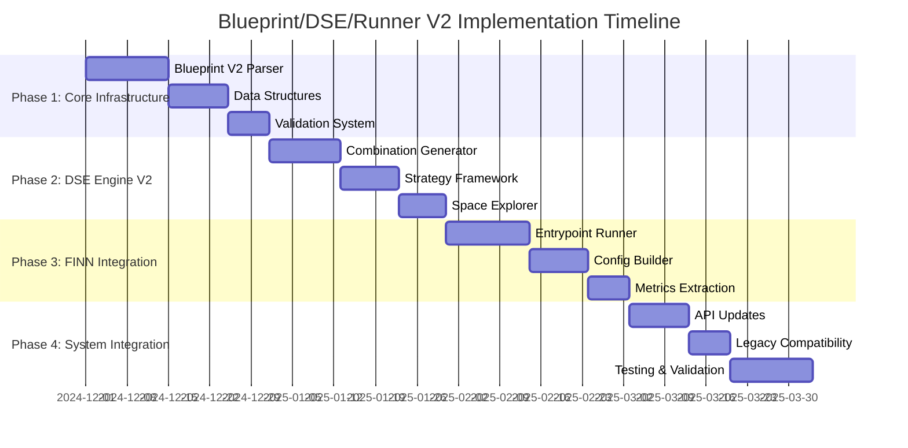

# Detailed Implementation Plan: Blueprint/DSE/Runner System V2

## Overview

This implementation plan transforms the current Brainsmith system to support the 6-entrypoint FINN architecture with design space exploration. The plan is structured in phases to minimize risk and enable incremental testing.

## Implementation Timeline

---

## Phase 1: Core Infrastructure (3 weeks)

### Step 1.1: Blueprint V2 Data Structures
**Duration**: 5 days  
**Files**: `brainsmith/core/blueprint_v2.py`

#### Tasks:
- [ ] Create `DesignSpaceDefinition` dataclass
- [ ] Create `NodeDesignSpace` dataclass with canonical_ops and hw_kernels
- [ ] Create `TransformDesignSpace` dataclass with model_topology, hw_kernel, hw_graph
- [ ] Create `ComponentSpace` dataclass with available components and exploration rules
- [ ] Create `ExplorationRules` dataclass (required, optional, mutually_exclusive, dependencies)
- [ ] Create `DSEStrategies` dataclass for strategy configuration
- [ ] Create `Objective` and `Constraint` dataclasses
- [ ] Add type hints and docstrings for all classes
- [ ] Write unit tests for data structure validation
- [ ] Test serialization/deserialization to/from YAML

### Step 1.2: Blueprint V2 Parser
**Duration**: 7 days  
**Files**: `brainsmith/core/blueprint_v2.py`

#### Tasks:
- [ ] Implement `load_blueprint_v2()` function
- [ ] Create YAML parser for nodes section (canonical_ops, hw_kernels)
- [ ] Create YAML parser for transforms section (model_topology, hw_kernel, hw_graph)
- [ ] Create YAML parser for dse_strategies section
- [ ] Create YAML parser for objectives and constraints sections
- [ ] Implement blueprint inheritance (`base_blueprint` support)
- [ ] Add blueprint version detection (`_is_blueprint_v2()`)
- [ ] Create blueprint validation function
- [ ] Handle configuration_files section (folding_override, platform_config)
- [ ] Write comprehensive unit tests for parser
- [ ] Test with complex blueprint examples
- [ ] Test inheritance scenarios

### Step 1.3: Blueprint Validation System
**Duration**: 2 days  
**Files**: `brainsmith/core/blueprint_v2.py`

#### Tasks:
- [ ] Implement component availability validation against registries
- [ ] Validate exploration rules (no conflicts in mutually_exclusive)
- [ ] Validate dependencies (no circular dependencies)
- [ ] Validate strategy configurations
- [ ] Validate objective/constraint definitions
- [ ] Create detailed error messages with suggestions
- [ ] Write validation unit tests
- [ ] Test validation with invalid blueprint examples

---

## Phase 2: DSE Engine V2 (4 weeks)

### Step 2.1: Component Combination Generator
**Duration**: 5 days  
**Files**: `brainsmith/core/dse_v2/combination_generator.py`

#### Tasks:
- [ ] Create `ComponentCombination` dataclass
- [ ] Implement `generate_node_combinations()` for canonical_ops and hw_kernels
- [ ] Implement `generate_transform_combinations()` for all transform types
- [ ] Handle required components (always included)
- [ ] Handle optional components (generate with/without variants)
- [ ] Handle mutually_exclusive groups (only one from each group)
- [ ] Handle dependencies (ensure dependent components are included)
- [ ] Implement combination validation
- [ ] Create combination deduplication logic
- [ ] Write unit tests for combination generation
- [ ] Test with complex blueprint scenarios
- [ ] Performance test with large design spaces

### Step 2.2: DSE Strategy Framework
**Duration**: 8 days  
**Files**: `brainsmith/core/dse_v2/strategy_executor.py`, `brainsmith/core/dse_v2/strategies/`

#### Tasks:
- [ ] Create `StrategyExecutor` base class
- [ ] Implement `HierarchicalExplorationStrategy` class
  - [ ] Phase 1: Kernel selection exploration
  - [ ] Phase 2: Transform selection exploration
  - [ ] Phase 3: Fine-tuning best combinations
- [ ] Implement `AdaptiveExplorationStrategy` class
  - [ ] Performance trend analysis
  - [ ] Promising region identification
  - [ ] Dynamic combination selection
- [ ] Implement `ParetoGuidedStrategy` class
  - [ ] Multi-objective optimization
  - [ ] Pareto frontier maintenance
  - [ ] Guided sampling toward frontier
- [ ] Create strategy configuration parser
- [ ] Implement strategy selection logic
- [ ] Add strategy composition support (chaining strategies)
- [ ] Write unit tests for each strategy
- [ ] Integration tests with combination generator
- [ ] Performance benchmarks for strategies

### Step 2.3: Design Space Explorer
**Duration**: 6 days  
**Files**: `brainsmith/core/dse_v2/space_explorer.py`

#### Tasks:
- [ ] Create `DesignSpaceExplorer` main class
- [ ] Implement `explore_design_space()` main method
- [ ] Integrate combination generator with strategy executor
- [ ] Add progress tracking and logging
- [ ] Implement result collection and analysis
- [ ] Create Pareto frontier analysis
- [ ] Add early termination conditions
- [ ] Implement result caching for repeated runs
- [ ] Create exploration summary generation
- [ ] Write unit tests for explorer
- [ ] Integration tests with strategies
- [ ] End-to-end tests with blueprint examples

### Step 2.4: DSE Results Analysis
**Duration**: 3 days  
**Files**: `brainsmith/core/dse_v2/results_analyzer.py`

#### Tasks:
- [ ] Create `DSEResultsV2` dataclass
- [ ] Implement multi-objective analysis
- [ ] Create Pareto frontier calculation
- [ ] Implement performance trend analysis
- [ ] Add statistical analysis (convergence, variance)
- [ ] Create result visualization data structures
- [ ] Implement best result selection logic
- [ ] Add result export functionality
- [ ] Write unit tests for analysis functions
- [ ] Test with large result sets

---

## Phase 3: FINN Integration V2 (4 weeks)

### Step 3.1: FINN Configuration Builder
**Duration**: 6 days  
**Files**: `brainsmith/core/finn_v2/config_builder.py`

#### Tasks:
- [ ] Create `FINNConfig` dataclass for 6-entrypoint configuration
- [ ] Implement `combination_to_finn_config()` function
- [ ] Map canonical_ops to Entrypoint 1 FINN steps
- [ ] Map model_topology transforms to Entrypoint 2 FINN steps
- [ ] Map hw_kernels to Entrypoint 3 FINN steps
- [ ] Map kernel specializations to Entrypoint 4 FINN steps
- [ ] Map hw_kernel transforms to Entrypoint 5 FINN steps
- [ ] Map hw_graph transforms to Entrypoint 6 FINN steps
- [ ] Integrate external configuration files (folding_override, platform_config)
- [ ] Add FINN step dependency resolution
- [ ] Handle conditional steps based on component choices
- [ ] Write unit tests for config building
- [ ] Test with various component combinations
- [ ] Validate generated FINN configurations

### Step 3.2: Entrypoint FINN Runner
**Duration**: 8 days  
**Files**: `brainsmith/core/finn_v2/entrypoint_runner.py`

#### Tasks:
- [ ] Create `EntrypointFINNRunner` class
- [ ] Implement `execute_finn_run()` method
- [ ] Create `_build_finn_steps()` from entrypoint configuration
- [ ] Implement `_create_dataflow_build_config()` integration
- [ ] Add error handling and recovery for FINN execution
- [ ] Implement timeout and resource management
- [ ] Create result validation and metrics extraction
- [ ] Add logging and progress tracking per entrypoint
- [ ] Handle FINN build failures gracefully
- [ ] Implement result caching for identical configurations
- [ ] Write unit tests for runner (with FINN mocking)
- [ ] Integration tests with real FINN (if available)
- [ ] Performance tests for runner execution
- [ ] Test error scenarios and edge cases

### Step 3.3: Metrics Extraction System
**Duration**: 4 days  
**Files**: `brainsmith/core/finn_v2/metrics_extractor.py`

#### Tasks:
- [ ] Create `FINNResult` dataclass
- [ ] Implement per-entrypoint metrics extraction
- [ ] Extract performance metrics (throughput, latency, frequency)
- [ ] Extract resource utilization metrics (LUT, DSP, BRAM usage)
- [ ] Extract power consumption estimates
- [ ] Add build time and success rate tracking
- [ ] Create metrics aggregation across entrypoints
- [ ] Implement metrics comparison functions
- [ ] Add metrics validation and sanity checks
- [ ] Write unit tests for metrics extraction
- [ ] Test with various FINN result formats
- [ ] Validate metrics accuracy

### Step 3.4: FINN Interface Integration
**Duration**: 4 days  
**Files**: `brainsmith/core/finn_v2/interface.py`

#### Tasks:
- [ ] Create unified FINN interface for V2 system
- [ ] Implement batch execution for multiple design points
- [ ] Add parallel execution support for independent runs
- [ ] Create resource management for concurrent FINN runs
- [ ] Implement result aggregation and comparison
- [ ] Add execution scheduling and prioritization
- [ ] Create execution monitoring and progress reporting
- [ ] Write integration tests with DSE engine
- [ ] Test batch execution scenarios
- [ ] Performance test parallel execution

---

## Phase 4: System Integration (3 weeks)

### Step 4.1: API Updates
**Duration**: 5 days  
**Files**: `brainsmith/core/api.py`

#### Tasks:
- [ ] Implement `_forge_v2()` function for Blueprint V2
- [ ] Update `forge()` to detect and route blueprint versions
- [ ] Integrate DesignSpaceExplorer with forge workflow
- [ ] Add V2-specific result formatting
- [ ] Update error handling for V2 system
- [ ] Implement backward compatibility mode
- [ ] Add V2-specific logging and progress tracking
- [ ] Create V2 result validation
- [ ] Update docstrings and type hints
- [ ] Write unit tests for updated API
- [ ] Integration tests with V2 system
- [ ] Test V1/V2 routing logic

### Step 4.2: Legacy Compatibility Bridge
**Duration**: 3 days  
**Files**: `brainsmith/core/compatibility.py`

#### Tasks:
- [ ] Create V1 to V2 blueprint converter
- [ ] Implement V2 to V1 result format converter
- [ ] Add compatibility warnings and migration hints
- [ ] Create blueprint migration tool
- [ ] Test conversion with existing blueprints
- [ ] Validate converted blueprint functionality
- [ ] Document migration process

### Step 4.3: Example Blueprints V2
**Duration**: 4 days  
**Files**: `brainsmith/libraries/blueprints_v2/`

#### Tasks:
- [ ] Create `transformer_base.yaml` base blueprint
- [ ] Create `bert_accelerator_v2.yaml` with full design space
- [ ] Create `gpt_accelerator_v2.yaml` example
- [ ] Create `cnn_base.yaml` base blueprint
- [ ] Create `resnet_accelerator_v2.yaml` example
- [ ] Create `lstm_accelerator_v2.yaml` example
- [ ] Add blueprint documentation and comments
- [ ] Test all example blueprints with V2 system
- [ ] Validate design space exploration results

### Step 4.4: Documentation and Testing
**Duration**: 8 days  
**Files**: Various documentation and test files

#### Tasks:
- [ ] Update main README.md with V2 system overview
- [ ] Create Blueprint V2 authoring guide
- [ ] Document DSE strategy configuration
- [ ] Create migration guide from V1 to V2
- [ ] Write API reference documentation
- [ ] Create example usage tutorials
- [ ] Write comprehensive integration tests
- [ ] Create performance benchmark tests
- [ ] Test with large design spaces
- [ ] Validate end-to-end workflows
- [ ] Create regression test suite
- [ ] Document troubleshooting guide
- [ ] Review and update all docstrings
- [ ] Create development setup guide

---

## Phase 5: Validation and Optimization (2 weeks)

### Step 5.1: End-to-End Validation
**Duration**: 5 days

#### Tasks:
- [ ] Run BERT accelerator blueprint through complete pipeline
- [ ] Validate design space exploration results
- [ ] Compare V2 results with V1 baseline (where applicable)
- [ ] Test with different DSE strategies
- [ ] Validate Pareto frontier analysis
- [ ] Test error handling and edge cases
- [ ] Validate metrics accuracy
- [ ] Test with large design spaces (>100 combinations)

### Step 5.2: Performance Optimization
**Duration**: 4 days

#### Tasks:
- [ ] Profile DSE engine performance
- [ ] Optimize combination generation algorithms
- [ ] Implement result caching optimizations
- [ ] Optimize FINN runner execution
- [ ] Add parallel processing where beneficial
- [ ] Optimize memory usage for large design spaces
- [ ] Benchmark against V1 system performance

### Step 5.3: User Acceptance Testing
**Duration**: 5 days

#### Tasks:
- [ ] Create user acceptance test scenarios
- [ ] Test blueprint authoring workflow
- [ ] Validate user interface simplicity
- [ ] Test common use cases (BERT, CNN, RNN)
- [ ] Gather feedback on blueprint format
- [ ] Test error messages and user guidance
- [ ] Validate documentation completeness

---

## Testing Strategy

### Unit Tests (Ongoing)
- [ ] Blueprint parser and validation
- [ ] Combination generator logic
- [ ] DSE strategy implementations
- [ ] FINN configuration builder
- [ ] Metrics extraction functions
- [ ] API function behavior

### Integration Tests (Phase 4)
- [ ] Blueprint V2 → DSE Engine → FINN Runner pipeline
- [ ] Multi-strategy exploration workflows
- [ ] Large design space exploration
- [ ] Error handling and recovery scenarios
- [ ] V1/V2 compatibility testing

### Performance Tests (Phase 5)
- [ ] Large design space scalability
- [ ] Memory usage with complex blueprints
- [ ] Parallel execution efficiency
- [ ] FINN runner throughput
- [ ] End-to-end pipeline performance

### Acceptance Tests (Phase 5)
- [ ] Complete BERT accelerator workflow
- [ ] CNN accelerator workflow
- [ ] Blueprint inheritance scenarios
- [ ] Multi-objective optimization results
- [ ] User experience validation

---

## Risk Mitigation

### Technical Risks
- **Risk**: FINN interface changes affecting 6-entrypoint mapping
  - **Mitigation**: Abstract FINN interface with version detection
  - **Owner**: FINN Integration Team
  
- **Risk**: Large design spaces causing memory/performance issues
  - **Mitigation**: Implement streaming and caching optimizations
  - **Owner**: DSE Engine Team

- **Risk**: Blueprint V2 format proving insufficient for complex scenarios
  - **Mitigation**: Design extensible format with versioning support
  - **Owner**: Blueprint Design Team

### Project Risks
- **Risk**: Timeline overrun due to complexity
  - **Mitigation**: Prioritize core functionality, defer advanced features
  - **Owner**: Project Manager

- **Risk**: Breaking existing V1 workflows
  - **Mitigation**: Maintain compatibility bridge and migration tools
  - **Owner**: API Team

---

## Success Criteria

### Phase 1 Success Criteria
- [ ] Blueprint V2 format fully defined and parseable
- [ ] All data structures implemented with validation
- [ ] Blueprint inheritance working correctly
- [ ] Comprehensive unit test coverage (>90%)

### Phase 2 Success Criteria
- [ ] Design space exploration generates valid combinations
- [ ] All three DSE strategies implemented and tested
- [ ] Performance acceptable for design spaces up to 1000 combinations
- [ ] Integration tests passing with blueprint examples

### Phase 3 Success Criteria
- [ ] FINN runs execute successfully with generated configurations
- [ ] All 6 entrypoints properly mapped and executed
- [ ] Metrics extraction working for performance analysis
- [ ] Error handling robust for FINN failures

### Phase 4 Success Criteria
- [ ] forge() function seamlessly handles V1 and V2 blueprints
- [ ] Example blueprints work end-to-end
- [ ] Documentation complete and tested
- [ ] Legacy compatibility maintained

### Phase 5 Success Criteria
- [ ] Complete BERT workflow demonstrates clear improvement over V1
- [ ] Performance meets or exceeds V1 system
- [ ] User acceptance criteria met
- [ ] System ready for production deployment

---

## Deliverables

### Code Deliverables
- [ ] Blueprint V2 parser and data structures
- [ ] DSE Engine V2 with multiple strategies
- [ ] FINN Runner V2 with 6-entrypoint support
- [ ] Updated forge() API with V1/V2 support
- [ ] Comprehensive test suite
- [ ] Example Blueprint V2 files

### Documentation Deliverables
- [ ] Blueprint V2 Authoring Guide
- [ ] DSE Strategy Configuration Guide
- [ ] V1 to V2 Migration Guide
- [ ] API Reference Documentation
- [ ] Development Setup Guide
- [ ] Troubleshooting Guide

### Validation Deliverables
- [ ] Performance benchmark results
- [ ] User acceptance test results
- [ ] Comparison analysis (V1 vs V2)
- [ ] Scalability analysis report

This implementation plan provides a structured approach to delivering the Blueprint/DSE/Runner V2 system while maintaining system stability and user workflows.