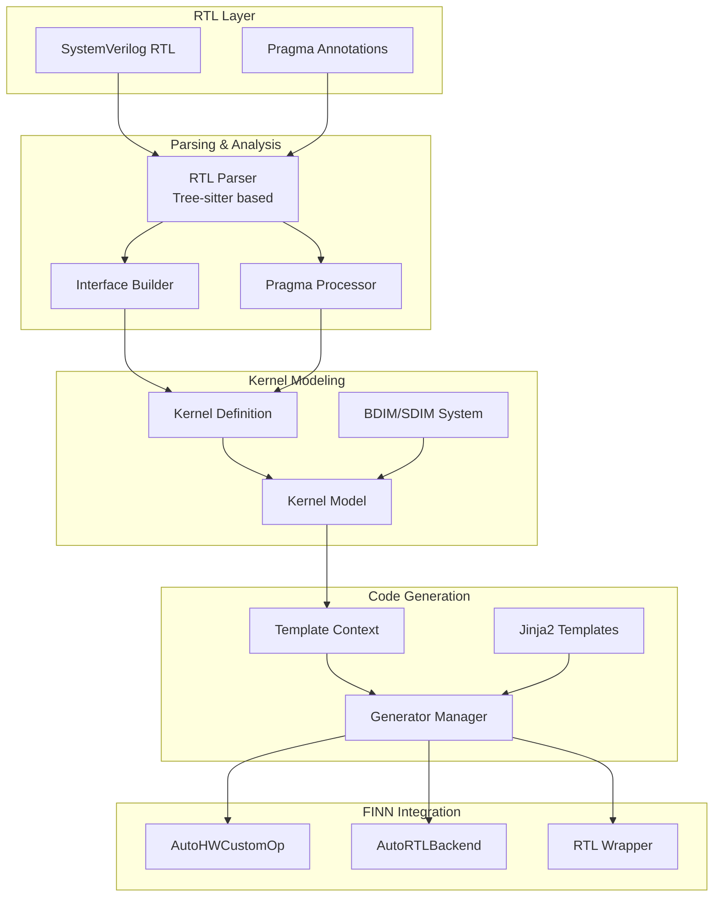
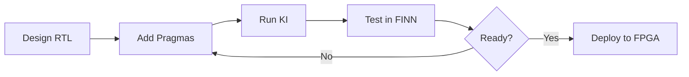

# Brainsmith Architecture Overview

## Executive Summary

Brainsmith is an advanced framework for integrating SystemVerilog RTL kernels into the FINN neural network compiler. It automates the generation of FINN-compatible Python operators from hardware descriptions, enabling rapid development of FPGA-accelerated AI workloads.

## System Architecture



## Core Components

### 1. Kernel Integrator (KI)

The main orchestrator that converts SystemVerilog RTL modules into FINN-compatible operators.

**Key Features:**
- Automated RTL analysis and metadata extraction
- Template-based code generation
- Extensible generator system
- Complete FINN integration pipeline

**Workflow:**
```bash
python -m brainsmith.tools.kernel_integrator mykernel.sv -o output/
```

### 2. RTL Parser

A sophisticated parser using tree-sitter for robust SystemVerilog analysis.

**Capabilities:**
- AST-based parsing (no regex)
- Automatic interface detection (AXI-Stream, AXI-Lite, etc.)
- Parameter extraction and linking
- Pragma processing

**Interface Detection:**
- **AXI-Stream**: `_TDATA`, `_TVALID`, `_TREADY` patterns
- **AXI-Lite**: Complete read/write channel patterns
- **Global Control**: `_clk`, `_rst_n` patterns

### 3. Pragma System

RTL annotations that provide semantic information:

```systemverilog
// @brainsmith DATATYPE input0 UINT 8 32
// @brainsmith BDIM input0 [TILE_H, TILE_W] SHAPE=[H, W]
// @brainsmith ALIAS PE parallelism_factor
// @brainsmith DERIVED_PARAMETER MEM_DEPTH self.calc_memory_depth()
```

**Pragma Types:**
- `DATATYPE`: Constrain interface datatypes
- `BDIM/SDIM`: Define block/stream dimensions
- `WEIGHT`: Mark weight interfaces
- `ALIAS`: User-friendly parameter names
- `DERIVED_PARAMETER`: Computed parameters
- `RELATIONSHIP`: Inter-interface constraints

### 4. Kernel Modeling System

#### Interface-Wise Dataflow Model

Kernels are modeled through their interfaces rather than internal implementation:

```
┌─────────────────────────┐
│    Hardware Kernel      │
├─── Input Interfaces ────┤ ← Streaming data
├─── Weight Interfaces ───┤ ← Parameters
├─── Output Interfaces ───┤ → Results
└─────────────────────────┘
```

#### Three-Tier Data Hierarchy

1. **Tensor Level**: Complete data structure
   ```python
   tensor_dims=(256, 256)  # Full matrix
   ```

2. **Block Level**: Unit of computation
   ```python
   block_dims=(16, 16)  # Process 16×16 tiles
   ```

3. **Stream Level**: Data per clock cycle
   ```python
   stream_dims=(4, 4)  # Transfer 4×4 elements/cycle
   ```

#### BDIM/SDIM Architecture

- **BDIM (Block Dimensions)**: Define the tiling strategy for computation
- **SDIM (Stream Dimensions)**: Define the parallelism within each tile

**Relationships:**
- `Tensor = N × Blocks`
- `Block = M × Streams`
- Stream width = `datatype_bits × product(SDIM)`

### 5. Code Generation System

#### Template-Based Generation

Jinja2 templates generate three key artifacts:

1. **HWCustomOp** (`*_hw_custom_op.py`)
   - Inherits from `AutoHWCustomOp`
   - Defines node attributes
   - Implements kernel-specific logic

2. **RTLBackend** (`*_rtl.py`)
   - Inherits from `AutoRTLBackend`
   - Maps parameters to RTL
   - Handles template substitution

3. **RTL Wrapper** (`*_wrapper.v`)
   - SystemVerilog wrapper
   - FINN parameter placeholders
   - Interface standardization

#### Parameter Binding Architecture

Parameters are bound from four sources:

1. **Node Attributes**: User-configurable (`self.get_nodeattr("PE")`)
2. **Datatype Properties**: From interface types (`DataType[...].bitwidth()`)
3. **Derived Parameters**: Computed values (`MEM_DEPTH = WEIGHTS // PE`)
4. **Internal Datatypes**: Fixed architectural parameters

### 6. FINN Integration

#### AutoHWCustomOp Base Class

Provides automatic implementation of FINN requirements:
- Shape inference and propagation
- Stream width calculation
- Folded shape computation
- Resource estimation

#### Multiple Inheritance Pattern

```python
class Thresholding_rtl(Thresholding, RTLBackend):
    # Combines functional definition with RTL backend
```

#### Execution Modes

1. **CPPSim**: Fast C++ simulation
2. **RTLSim**: Cycle-accurate Vivado simulation via PyXSI

## Key Concepts

### 1. Automatic Parameter Linking

Naming conventions enable automatic parameter detection:
- `{interface}_WIDTH` → Bit width
- `{interface}_SIGNED` → Signedness
- `{interface}_BDIM` → Block dimensions
- `{interface}_SDIM` → Stream dimensions

### 2. Interface Type Hierarchy

| Type | Purpose | BDIM | SDIM | Datatype |
|------|---------|------|------|----------|
| INPUT | Activation data | ✓ | ✓ | ✓ |
| OUTPUT | Results | ✓ | ✗ | ✓ |
| WEIGHT | Parameters | ✓ | ✓ | ✓ |
| CONFIG | Control registers | ✗ | ✗ | ✓ |
| CONTROL | Clock/reset | ✗ | ✗ | ✗ |

### 3. Compiler Name Generation

Standardized naming for FINN compatibility:
- Inputs: `input0`, `input1`, ...
- Outputs: `output0`, `output1`, ...
- Weights: `weight0`, `weight1`, ...
- Config: `config0`, `config1`, ...

## Performance Characteristics

- **Parsing**: 10-20ms for typical kernels
- **Generation**: 40-60ms for all artifacts
- **Total**: ~75ms end-to-end
- **Scaling**: Linear with kernel complexity

## Development Workflow



## Extension Points

### Adding New Generators

```python
class MyGenerator(GeneratorBase):
    name = "my_output"
    template_file = "my_template.j2"
    output_pattern = "{kernel_name}_my_output.ext"
```

### Adding New Pragmas

```python
class MyPragma(BasePragma):
    def apply_to_metadata(self, metadata, visitor):
        # Process pragma data
```

## Best Practices

1. **Use Pragmas Liberally**: They document intent and enable automation
2. **Follow Naming Conventions**: Enables automatic parameter detection
3. **Design for Streaming**: Think in terms of blocks and streams
4. **Validate Early**: Use built-in validation at each stage
5. **Leverage Templates**: Customize generation through template modification

## Future Directions

- **Multi-language Support**: VHDL, Chisel generation
- **Advanced Optimization**: Automatic SDIM/BDIM tuning
- **IDE Integration**: Real-time pragma validation
- **Performance Modeling**: Accurate pre-synthesis estimates
