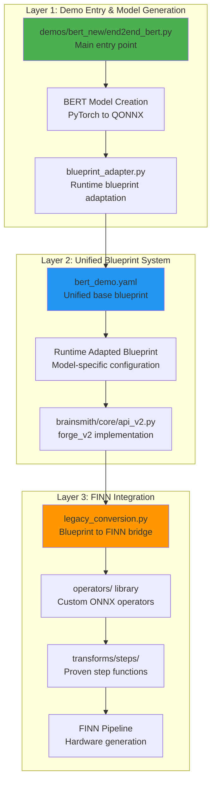
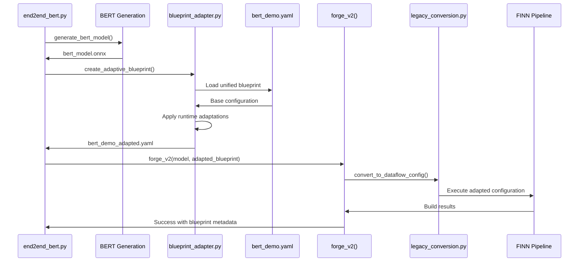

# BERT Demo - Complete File Reference Guide

**All relevant files in the BERT demo implementation, their purpose, functionality, and usage patterns for complete end-to-end FPGA accelerator generation with unified blueprint architecture.**

---

## Executive Summary

**The BERT demo operates through a three-layer architecture with a unified blueprint system: Model Generation → Blueprint Adaptation → FINN Integration, with 15+ key files orchestrating the complete workflow from PyTorch BERT to FPGA accelerator.**



---

## Layer 1: Demo Entry & Model Generation

### 1. Primary Demo Entry Point

**File**: `demos/bert_new/end2end_bert.py` (326 lines)
**Purpose**: Main entry point for BERT accelerator generation with unified blueprint adaptation

**Key Functions**:
- `main()`: Orchestrates complete demo workflow with unified blueprint
- `generate_bert_model()`: Creates quantized BERT model and exports to QONNX
- `create_adaptive_blueprint()`: Generates runtime-adapted blueprint
- `handle_forge_results()`: Processes and displays results with blueprint information

**Usage Patterns**:
```bash
# Ultra-small configuration (fast testing)
./smithy exec "python demos/bert_new/end2end_bert.py --ultra-small --output-dir ./test_output"

# Standard configuration with custom dimensions
./smithy exec "python demos/bert_new/end2end_bert.py --hidden-size 512 --num-layers 6 --output-dir ./bert_output"

# Custom configuration
./smithy exec "python demos/bert_new/end2end_bert.py --hidden-size 768 --num-layers 12 --num-heads 16 --output-dir ./large_bert"
```

**Key Configuration Options**:
- `--ultra-small`: 96D hidden, 1 layer, 3 heads (auto-adapts blueprint for speed)
- `--hidden-size`: BERT hidden dimension (blueprint adapts constraints accordingly)
- `--num-layers`: Number of transformer layers (blueprint estimates build time)
- `--num-heads`: Number of attention heads (auto-validated for compatibility)
- `--bitwidth`: Quantization bit width (blueprint adapts accordingly)

**Model Generation Pipeline**:
1. **PyTorch BERT Creation** (lines 72-82): Uses HuggingFace BertConfig
2. **SDPA Replacement** (lines 99-101): Replace with quantizable attention layers
3. **Layerwise Quantization** (lines 113-146): Apply Brevitas quantization
4. **QONNX Export** (lines 156-164): Export to ONNX with quantization info
5. **Blueprint Adaptation** (lines 165-189): Runtime blueprint configuration

### 2. Blueprint Adapter System

**File**: `demos/bert_new/blueprint_adapter.py` (164 lines)
**Purpose**: Dynamically adapts unified blueprint based on runtime model configuration

**Key Classes**:
- `BlueprintAdapter`: Main adapter class for blueprint modification
- `create_runtime_blueprint()`: Convenience function for blueprint generation

**Adaptation Process**:
```python
from blueprint_adapter import create_runtime_blueprint

adapted_blueprint = create_runtime_blueprint(
    base_blueprint_path="brainsmith/libraries/blueprints_v2/transformers/bert_demo.yaml",
    hidden_size=384,
    num_hidden_layers=3,
    num_attention_heads=12,
    intermediate_size=1536,
    sequence_length=128,
    bitwidth=8,
    ultra_small=False,
    target_device="V80"
)
```

**Runtime Adaptations**:
- **Model Configuration**: Updates all model dimensions dynamically
- **Build Optimizations**: Applies ultra-small optimizations when requested
- **Constraint Scaling**: Adjusts resource limits based on model size
- **Time Estimation**: Predicts build time based on model complexity
- **Platform Settings**: Updates target device and frequency

---

## Layer 2: Unified Blueprint System

### 3. Unified Base Blueprint

**File**: `brainsmith/libraries/blueprints_v2/transformers/bert_demo.yaml` (172 lines)
**Purpose**: Single unified blueprint that adapts to any BERT configuration through runtime updates

**Key Sections**:
```yaml
# Runtime-updateable model configuration
model_configuration:
  hidden_size: 384              # Updated by adapter
  num_hidden_layers: 3          # Updated by adapter
  num_attention_heads: 12       # Updated by adapter
  intermediate_size: 1536       # Updated by adapter
  max_position_embeddings: 128  # Updated by adapter
  bitwidth: 8                  # Updated by adapter

# Comprehensive BERT operations support
nodes:
  canonical_ops:
    available: ["LayerNorm", "Add", "MultiHeadAttention", "MatMul", "Softmax", "GELU"]
  hw_kernels:
    available: ["MatMul", "LayerNorm", "Add", "Softmax"]

# Adaptive build configuration
build_configuration:
  run_fifo_sizing: true         # Disabled for ultra-small
  generate_dcp: false           # Configurable
  auto_fifo_depths: true       # Always enabled

# Runtime adaptation templates
runtime_adaptations:
  ultra_small_mode:
    model_overrides: {hidden_size: 96, num_hidden_layers: 1}
    build_overrides: {run_fifo_sizing: false}
    constraint_overrides: {max_build_time: 15.0}
```

**Blueprint Features**:
- **Universal Compatibility**: Supports any BERT configuration
- **Automatic Optimization**: Applies appropriate settings based on model size
- **Resource Scaling**: Adjusts constraints based on model complexity
- **Multi-Strategy DSE**: Ultra-fast, balanced, and comprehensive strategies
- **Platform Flexibility**: Configurable for different FPGA targets

### 4. Blueprint V2 API Integration

**File**: `brainsmith/core/api_v2.py` (398 lines)
**Purpose**: Clean Blueprint V2 API that works with dynamically adapted blueprints

**Integration Pattern**:
```python
# Runtime blueprint adaptation
adapted_blueprint_path = create_adaptive_blueprint(args)

# Use with forge_v2
from brainsmith.core.api_v2 import forge_v2
result = forge_v2(
    model_path=model_path,
    blueprint_path=adapted_blueprint_path,  # Uses adapted blueprint
    target_device=args.board,
    output_dir=args.output_dir
)
```

**Benefits of Unified Approach**:
- **Single Source of Truth**: One blueprint for all BERT configurations
- **Consistent Behavior**: Same optimization strategies across configurations
- **Maintainability**: Updates to one file affect all configurations
- **Flexibility**: Easy to add new optimization strategies

---

## Layer 3: FINN Integration

### 5. Legacy Conversion Bridge

**File**: `brainsmith/core/finn_v2/legacy_conversion.py` (284 lines)
**Purpose**: Converts any adapted Blueprint V2 to FINN DataflowBuildConfig using proven step functions

**Universal Blueprint Support**: Works with any adapted blueprint configuration
- Handles ultra-small optimizations automatically
- Scales step functions based on model complexity
- Maintains proven step function architecture

### 6. Custom Operators Library

**Directory**: `brainsmith/libraries/operators/` (4 files)
**Purpose**: Universal custom ONNX operators that work with any BERT configuration

**Unified Operator Support**:
- Supports all BERT model sizes from ultra-small to large
- Automatic scaling based on model dimensions
- Consistent behavior across configurations

### 7. Proven Step Functions

**Directory**: `brainsmith/libraries/transforms/steps/` (multiple files)
**Purpose**: Universal step functions that handle any BERT configuration

**Adaptive Step Execution**:
- Scale processing based on model size
- Apply optimizations based on configuration flags
- Maintain compatibility across all BERT variants

---

## Usage Patterns & Examples

### Unified Blueprint Demo Execution

**Ultra-Small BERT** (Recommended for testing):
```bash
# Automatically adapts blueprint for ultra-small optimizations
./smithy exec "python demos/bert_new/end2end_bert.py --ultra-small --output-dir ./ultra_test"
# Generates: bert_demo_ultra_small_96D_1L.yaml
```

**Standard BERT** (Default configuration):
```bash  
# Uses standard blueprint adaptations
./smithy exec "python demos/bert_new/end2end_bert.py --hidden-size 384 --num-layers 3 --output-dir ./bert_std"
# Generates: bert_demo_standard_384D_3L.yaml
```

**Large BERT** (Custom configuration):
```bash
# Automatically adapts constraints and build settings
./smithy exec "python demos/bert_new/end2end_bert.py --hidden-size 768 --num-layers 12 --num-heads 12 --output-dir ./bert_large"
# Generates: bert_demo_standard_768D_12L.yaml
```

**Custom Configuration**:
```bash
# Blueprint adapts to any valid configuration
./smithy exec "python demos/bert_new/end2end_bert.py --hidden-size 512 --num-layers 6 --num-heads 8 --sequence-length 256 --output-dir ./custom_bert"
```

### Blueprint Adaptation Examples

**Manual Blueprint Creation**:
```python
from demos.bert_new.blueprint_adapter import BlueprintAdapter

adapter = BlueprintAdapter("brainsmith/libraries/blueprints_v2/transformers/bert_demo.yaml")

# Create configuration for specific model
adapted = adapter.adapt_for_model_config(
    hidden_size=512,
    num_hidden_layers=6,
    num_attention_heads=8,
    intermediate_size=2048,
    sequence_length=256,
    bitwidth=8,
    ultra_small=False,
    target_device="U250"
)

# Save adapted blueprint
output_path = adapter.save_adapted_blueprint(adapted, "./my_bert_config.yaml")
```

**Automatic Optimization Selection**:
- **Ultra-Small Mode**: Automatically enables speed optimizations
- **Standard Mode**: Balanced performance and resource usage
- **Large Models**: Comprehensive exploration with longer build times

---

## File Dependencies & Data Flow

### Unified Blueprint Processing Pipeline



### Blueprint Adaptation Timeline

**Runtime Process**:
1. **Demo Start**: Parse command-line arguments
2. **Model Generation**: Create ONNX model with specified dimensions
3. **Blueprint Loading**: Load unified base blueprint
4. **Dimension Adaptation**: Update model configuration section
5. **Optimization Selection**: Apply ultra-small or standard optimizations
6. **Constraint Scaling**: Adjust resource limits based on model size
7. **Blueprint Generation**: Save adapted blueprint with unique name
8. **Forge Execution**: Use adapted blueprint with forge_v2

**File Generation Pattern**:
- **Ultra-Small**: `bert_demo_ultra_small_96D_1L.yaml`
- **Standard**: `bert_demo_standard_384D_3L.yaml`  
- **Custom**: `bert_demo_standard_{hidden_size}D_{num_layers}L.yaml`

---

## Benefits of Unified Blueprint Architecture

### Development Benefits

**Single Source of Truth**:
- One blueprint file to maintain instead of multiple variants
- Consistent optimization strategies across all configurations
- Easier to add new features and optimizations

**Runtime Flexibility**:
- Supports any valid BERT configuration without pre-defined blueprints
- Automatic constraint and optimization scaling
- Dynamic build time and resource estimation

**Maintainability**:
- Changes to optimization strategies apply to all configurations
- Easy to add new BERT variants or target devices
- Clear separation between base configuration and runtime adaptations

### User Benefits

**Simplified Usage**:
- Single command supports any BERT configuration
- Automatic optimization selection based on model size
- No need to choose between multiple blueprint files

**Predictable Behavior**:
- Consistent results across different model sizes
- Automatic constraint scaling prevents resource overruns
- Clear feedback on expected build times

**Flexibility**:
- Easy to experiment with different model dimensions
- Automatic adaptation to available hardware targets
- Support for both testing and production configurations

---

## Troubleshooting & Common Issues

### Blueprint Adaptation Issues

**"Blueprint adaptation failed"**:
- **Cause**: Invalid model configuration (e.g., hidden_size not divisible by num_heads)
- **Solution**: Demo automatically adjusts num_attention_heads for compatibility
- **Test**: Check that hidden_size % num_attention_heads == 0

**"Generated blueprint not found"**:
- **Cause**: Blueprint adapter failed to save adapted configuration
- **Solution**: Check output directory permissions
- **Debug**: Enable debug logging to see blueprint generation process

### Configuration Validation

**Invalid Model Dimensions**:
- **Auto-correction**: Demo automatically finds valid attention head count
- **Feedback**: Clear messages about auto-adjustments
- **Override**: Manual specification still supported

**Resource Estimation**:
- **Ultra-Small**: ~2MB model, 5-15 minute builds
- **Standard**: ~50MB model, 30-60 minute builds  
- **Large**: ~200MB+ model, 60+ minute builds

### Development & Debugging

**Blueprint Debugging**:
```python
# Enable verbose blueprint adaptation
import logging
logging.basicConfig(level=logging.DEBUG)

# Test blueprint adaptation manually
from demos.bert_new.blueprint_adapter import BlueprintAdapter
adapter = BlueprintAdapter("brainsmith/libraries/blueprints_v2/transformers/bert_demo.yaml")
# ... test different configurations
```

**Generated Blueprint Inspection**:
```bash
# Check generated blueprint
cat ./output_dir/bert_demo_standard_384D_3L.yaml

# Validate blueprint structure
python -c "import yaml; print(yaml.safe_load(open('./bert_demo_adapted.yaml')))"
```

---

## Summary

**The BERT demo now uses a unified blueprint architecture with runtime adaptation, eliminating the need for multiple blueprint files while supporting any BERT configuration from ultra-small to large models.** The blueprint adapter automatically scales constraints, optimizations, and build settings based on model dimensions, providing a consistent and maintainable solution.

**Key Improvements**:
- ✅ Single unified blueprint supports all BERT configurations
- ✅ Runtime adaptation eliminates need for multiple blueprint files
- ✅ Automatic optimization selection based on model size
- ✅ Consistent behavior across all configurations
- ✅ Easy maintenance and feature addition
- ✅ Clear blueprint generation with descriptive naming

**Current Status**: Demo successfully generates FPGA accelerators using unified blueprint with runtime adaptation, providing flexibility without sacrificing optimization quality.