# DataflowModel Mathematical Framework for FPGA Accelerators

## Executive Summary

The DataflowModel provides a mathematically rigorous framework for modeling FPGA accelerator kernels through interface-wise abstractions. This document details the mathematical relationships, performance implications, and graph-level behaviors that enable systematic design space exploration and optimization of dataflow accelerators.

## 1. Mathematical Foundations

### 1.1 Core Variables and Relationships

The DataflowModel defines kernel behavior through four fundamental variable categories:

#### **Dimensional Variables**
- **tensor_dims** (T): Complete tensor shape `[T₀, T₁, ..., Tₙ]`
- **block_dims** (B): Processing chunk shape `[B₀, B₁, ..., Bₘ]` 
- **stream_dims** (S): Hardware parallelism `[S₀, S₁, ..., Sₖ]`

#### **Parallelism Parameters**
- **iPar**: Input parallelism (scalar value that tiles into stream_dims via kernel-specific strategy)
- **wPar**: Weight parallelism (scalar value controlling weight streaming rate)

#### **Temporal Variables**
- **cII**: Calculation Initiation Interval (cycles between calculations)
- **eII**: Execution Initiation Interval (cycles between executions)
- **L**: Inference Latency (total cycles for complete operation)

#### **Constraint Relationships**
```
Mathematical Axioms:
∀i: Tᵢ % Bᵢ = 0  (tensor chunking constraint)
∀j: Bⱼ % Sⱼ = 0  (streaming constraint)
iPar ≤ ∏(B)      (parallelism bound - total block elements)
wPar ≤ ∏(Tᵂ/Bᵂ)  (weight parallelism bound)
∏(S) = iPar      (tiling constraint - total parallelism preserved)
Sⱼ ≤ Bⱼ          (dimension constraint - can't exceed block size)
```

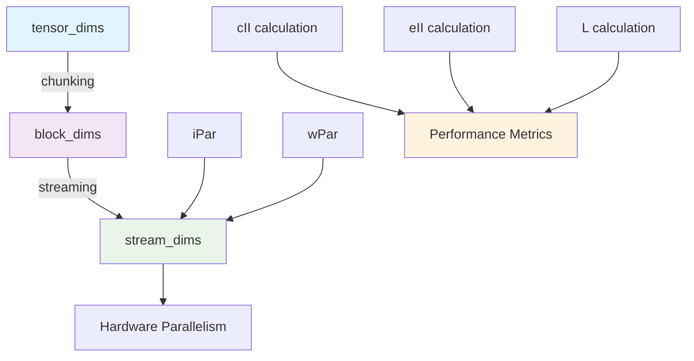

### 1.2 Core Mathematical Model

#### **Calculation Initiation Interval (cII)**
```
cII = ∏ᵢ (Bᵢ / Sᵢ)
```
**Physical meaning**: Clock cycles required to process one block of data through the interface.

**Impact**: 
- Higher cII → Lower throughput per calculation
- cII = 1 represents optimal streaming (one element per cycle)
- cII determines the fundamental timing granularity

#### **Execution Initiation Interval (eII)**
```
eII = cII × max_weights(∏(Tᵂ / wPar))
```
**Physical meaning**: Clock cycles between consecutive input block processing starts.

**Impact**:
- Incorporates weight loading constraints
- Bottleneck analysis: weight-bound vs compute-bound kernels
- Determines pipeline depth requirements

#### **Inference Latency (L)**
```
L = max_inputs(eII × ∏(Tᴵ / Bᴵ))
```
**Physical meaning**: Total clock cycles to process complete input tensor.

**Impact**:
- End-to-end performance metric
- Memory bandwidth requirements
- Graph-level scheduling constraints

## 2. Interface-Wise Behavior Analysis

### 2.1 INPUT Interface Dynamics

**Scalar Parallelism with Multi-Dimensional Tiling**:
```
iPar = scalar parallelism value
stream_dims = tiling_strategy(iPar, block_dims)
cII_input = ∏(B_input[i] / S_input[i])

Constraints:
∏(stream_dims) = iPar    (total parallelism preserved)
stream_dims[i] ≤ block_dims[i]  (per-dimension limits)
```

**Tiling Strategy Examples**:
- **Row-major tiling**: Fill dimensions left-to-right
- **Column-major tiling**: Fill dimensions right-to-left  
- **Custom patterns**: Kernel-specific optimizations

**Performance Implications**:
- **iPar = 1**: Sequential processing, stream_dims = [1, 1, ...]
- **iPar = ∏(B)**: Fully parallel, stream_dims = block_dims
- **iPar ∈ [1, ∏(B)]**: Partial parallelism with kernel-defined tiling

**Example**: BERT attention input with block_dims = [1, 8, 96]
```
iPar = 8   → stream_dims = [1, 8, 1]  (row-major: fill sequence dim first)
iPar = 16  → stream_dims = [1, 8, 2]  (tiles into feature dimension)
iPar = 96  → stream_dims = [1, 8, 12] (more feature parallelism)
iPar = 768 → stream_dims = [1, 8, 96] (fully parallel block processing)

cII calculation for iPar=16:
cII = (1/1) × (8/8) × (96/2) = 1 × 1 × 48 = 48 cycles per block
```

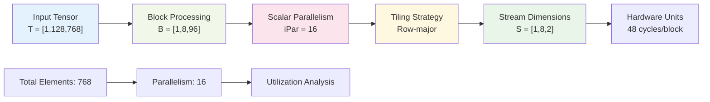

### 2.2 WEIGHT Interface Dynamics

**Scalar Weight Parallelism with Tiling**:
```
wPar = scalar weight parallelism value
weight_stream_dims = weight_tiling_strategy(wPar, weight_block_dims)
weight_cycles = ∏(T_weight[i] / weight_stream_dims[i])
eII = cII_input × weight_cycles

Constraints:
∏(weight_stream_dims) = wPar    (total weight parallelism preserved)
weight_stream_dims[i] ≤ weight_block_dims[i]  (per-dimension limits)
```

**Weight Tiling Strategies**:
- **Row-parallel**: Parallelize across output channels first
- **Column-parallel**: Parallelize across input channels first
- **Block-parallel**: 2D tiling for matrix operations
- **Custom patterns**: Operation-specific optimizations

**Performance Implications**:
- **wPar = 1**: Sequential weight access, memory-bound
- **wPar >> 1**: Parallel weight streaming, may become compute-bound
- **Tiling efficiency**: Memory access pattern affects bandwidth utilization

**Example**: Matrix multiplication with weight tensor [768, 768] and block_dims [96, 96]
```
wPar = 16 with row-parallel tiling:
→ weight_stream_dims = [16, 1]    # 16 output channels in parallel
→ weight_cycles = (768/16) × (768/1) = 48 × 768 = 36,864 cycles

wPar = 16 with column-parallel tiling:  
→ weight_stream_dims = [1, 16]    # 16 input channels in parallel
→ weight_cycles = (768/1) × (768/16) = 768 × 48 = 36,864 cycles

wPar = 64 with 2D block tiling:
→ weight_stream_dims = [8, 8]     # 8×8 = 64 parallel weight elements
→ weight_cycles = (768/8) × (768/8) = 96 × 96 = 9,216 cycles
```

### 2.3 OUTPUT Interface Dynamics

**Derived Stream Dimensions from Bottleneck Input**:
```
bottleneck_iPar = scalar parallelism of limiting input interface
output_iPar_equivalent = bottleneck_iPar × scaling_factor
output_stream_dims = output_tiling_strategy(output_iPar_equivalent, output_block_dims)

where scaling_factor accounts for:
- Block size ratios: ∏(B_output) / ∏(B_bottleneck_input)  
- Computational expansion/reduction in the kernel
```

**Output Rate Analysis**:
```
effective_output_parallelism = ∏(output_stream_dims)
output_rate = effective_output_parallelism / cII_bottleneck
elements_per_second = output_rate × clock_frequency
```

**Tiling Strategy Inheritance**:
- Output tiling typically **inherits** from bottleneck input pattern
- Scaling applied proportionally across dimensions
- Kernel may define custom output tiling for optimization

**Backpressure Considerations**:
- Output interface must match bottleneck input effective rate
- Multi-dimensional tiling affects buffer organization
- Buffer sizing: `cII × ∏(output_stream_dims) × bitwidth`

**Example**: Attention output with bottleneck input iPar=16 → stream_dims=[1,8,2]
```
Input block_dims = [1, 8, 96], iPar = 16 → input_stream_dims = [1, 8, 2]
Output block_dims = [1, 8, 64], same computational pattern

Scaling factor = (1×8×64) / (1×8×96) = 64/96 = 2/3
Output equivalent iPar = 16 × (2/3) = 10.67 ≈ 10

Row-major tiling: output_stream_dims = [1, 8, 1] (total parallelism = 8)
Alternative tiling: output_stream_dims = [1, 5, 2] (total parallelism = 10)
```

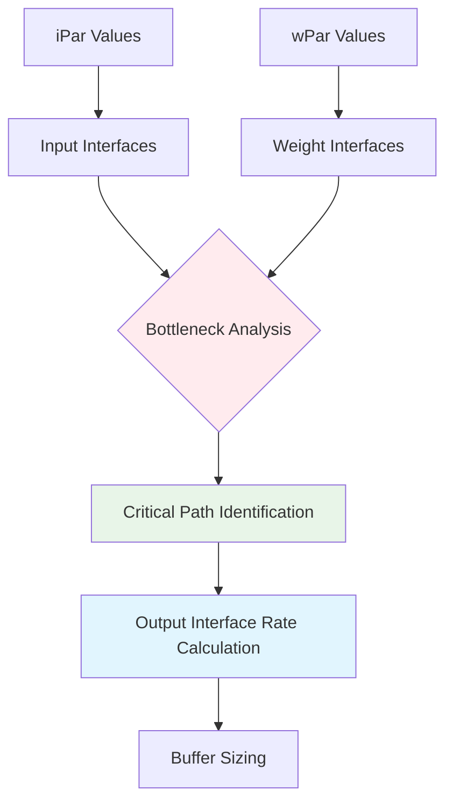

## 3. Kernel Classification and Behavior Patterns

### 3.1 Compute-Bound Kernels

**Characteristics**:
```
cII >> weight_loading_cycles
Performance ∝ iPar
Resource usage ∝ iPar × complexity
```

**Examples**: Convolution, Matrix Multiplication, Activation Functions

**Optimization Strategy**:
```
Maximize iPar subject to:
- Resource constraints: iPar × DSP_per_element ≤ DSP_available
- Memory bandwidth: iPar × bitwidth ≤ bandwidth
- Routing constraints: fanout limitations
```

### 3.2 Memory-Bound Kernels

**Characteristics**:
```
weight_loading_cycles >> cII
Performance ∝ wPar
Memory pressure ∝ weight_tensor_size
```

**Examples**: Large fully-connected layers, Embedding lookups

**Optimization Strategy**:
```
Maximize wPar subject to:
- Memory bandwidth: wPar × weight_bitwidth ≤ memory_bandwidth
- Weight storage: local_memory_size ≥ active_weight_set
- Weight distribution: parallel access patterns
```

### 3.3 Streaming Kernels

**Characteristics**:
```
cII ≈ 1 (ideal streaming)
Minimal weight dependencies
Performance ∝ clock_frequency
```

**Examples**: Normalization, Pooling, Element-wise operations

**Optimization Strategy**:
```
Minimize cII → 1:
- Optimal block_dims sizing
- Pipeline depth optimization
- Minimize control logic overhead
```

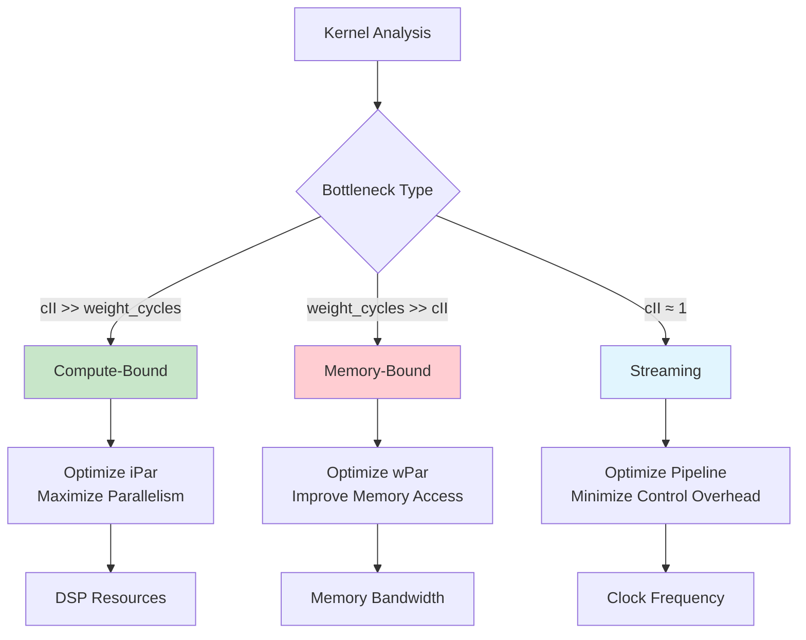

## 4. Graph-Level Interactions and Constraints

### 4.1 Pipeline Composition Rules

**Interface Matching Constraint**:
```
For connection: Kernel_A.output → Kernel_B.input
S_A_output ≥ S_B_input (bandwidth matching)
rate_A ≥ rate_B (throughput matching)
```

**Buffer Sizing Requirements**:
```
buffer_size = max(cII_A, cII_B) × max(S_A_output, S_B_input) × bitwidth
```

**Example Pipeline**: `Attention → LayerNorm → MLP`
```
Attention: eII_A = 100, S_output = 8, rate = 8/100 = 0.08 elements/cycle
LayerNorm: cII_B = 1, S_input = 8, rate = 8/1 = 8.0 elements/cycle
Buffer needed: 100 × 8 × bitwidth (LayerNorm waits for Attention)
```

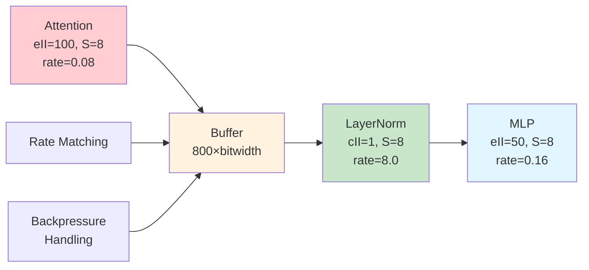

### 4.2 Resource Sharing and Conflicts

**DSP Usage Model**:
```
DSP_kernel = iPar × DSP_per_calculation
DSP_total = Σ DSP_kernel ≤ DSP_available
```

**Memory Bandwidth Allocation**:
```
BW_kernel = (S_input × input_BW + S_weight × weight_BW + S_output × output_BW)
BW_total = Σ BW_kernel ≤ BW_available
```

**Temporal Resource Sharing**:
```
If eII_A ≠ eII_B: time-multiplexed resource sharing possible
Sharing_factor = lcm(eII_A, eII_B) / max(eII_A, eII_B)
```

### 4.3 Graph-Level Performance Analysis

**Critical Path Identification**:
```
For each path P in graph:
L_path = Σ(L_kernel + buffer_delays)
L_critical = max(L_path)
```

**Throughput Bottleneck Analysis**:
```
Throughput_graph = min_kernel(throughput_kernel)
where throughput_kernel = clock_freq / eII_kernel
```

**Example Graph Analysis**:
```
BERT Layer: Attention || MLP → Add → LayerNorm
Attention: L = 1000, throughput = 100MHz/100 = 1MHz
MLP: L = 500, throughput = 100MHz/50 = 2MHz  
Add: L = 1, throughput = 100MHz/1 = 100MHz
LayerNorm: L = 10, throughput = 100MHz/10 = 10MHz

Critical path: Attention (1000 cycles)
Graph throughput: min(1MHz, 2MHz, 100MHz, 10MHz) = 1MHz
```

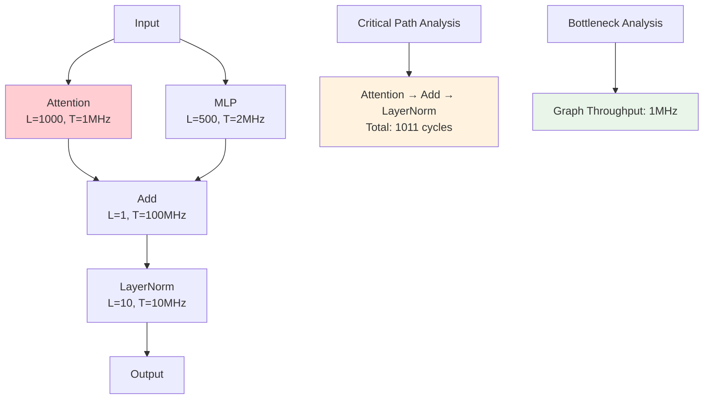

## 5. Design Space Exploration Framework

### 5.1 Multi-Objective Optimization

**Objective Functions**:
```
Minimize: L (latency)
Minimize: Resource_usage
Maximize: Throughput = clock_freq / eII
Minimize: Power ∝ Resource_usage × clock_freq²
```

**Constraint System**:
```
Resource constraints: Σ resources_i ≤ available
Performance constraints: throughput ≥ target
Power constraints: power ≤ budget
Interface constraints: bandwidth matching
```

### 5.2 Parallelism Parameter Search Space

**iPar Search Space (Scalar with Tiling Constraints)**:
```
For each INPUT interface i with block_dims B_i:
Valid iPar values must satisfy tiling constraints:
- iPar ≤ ∏(B_i)  (cannot exceed total block elements)
- iPar must allow valid stream_dims where ∏(stream_dims) = iPar
- stream_dims[j] ≤ B_i[j] for all dimensions j
- Practical constraint: iPar should be efficiently tileable

Example for block_dims = [8, 96]:
Valid iPar ∈ {1, 2, 4, 6, 8, 12, 16, 24, 32, 48, 64, 96, ..., 768}
Invalid iPar like 7, 11 create inefficient tiling patterns
```

**wPar Search Space (Scalar with Weight Tiling)**:
```
For each WEIGHT interface j with tensor_dims T_j and block_dims B_j:
Valid wPar values must satisfy:
- wPar ≤ ∏(B_j)  (cannot exceed weight block elements)
- Weight tiling strategy must be implementable
- Memory bandwidth constraints: wPar × weight_bitwidth ≤ bandwidth

Example for weight block_dims = [96, 96]:
Valid wPar ∈ {1, 2, 3, 4, 6, 8, 12, 16, 24, 32, 48, 64, 96, ..., 9216}
Preferred values align with memory word boundaries
```

**Joint Optimization with Tiling Awareness**:
```
Search space: (iPar_1, iPar_2, ..., wPar_1, wPar_2, ...)
Constraints:
- Resource limits: Σ(hardware_resources(iPar_i, wPar_j)) ≤ available
- Tiling efficiency: Prefer values that tile cleanly
- Memory alignment: Consider cache line and memory word sizes

Complexity: O(|valid_iPar_combinations| × |valid_wPar_combinations|)
Tiling reduces search space by eliminating invalid configurations
```

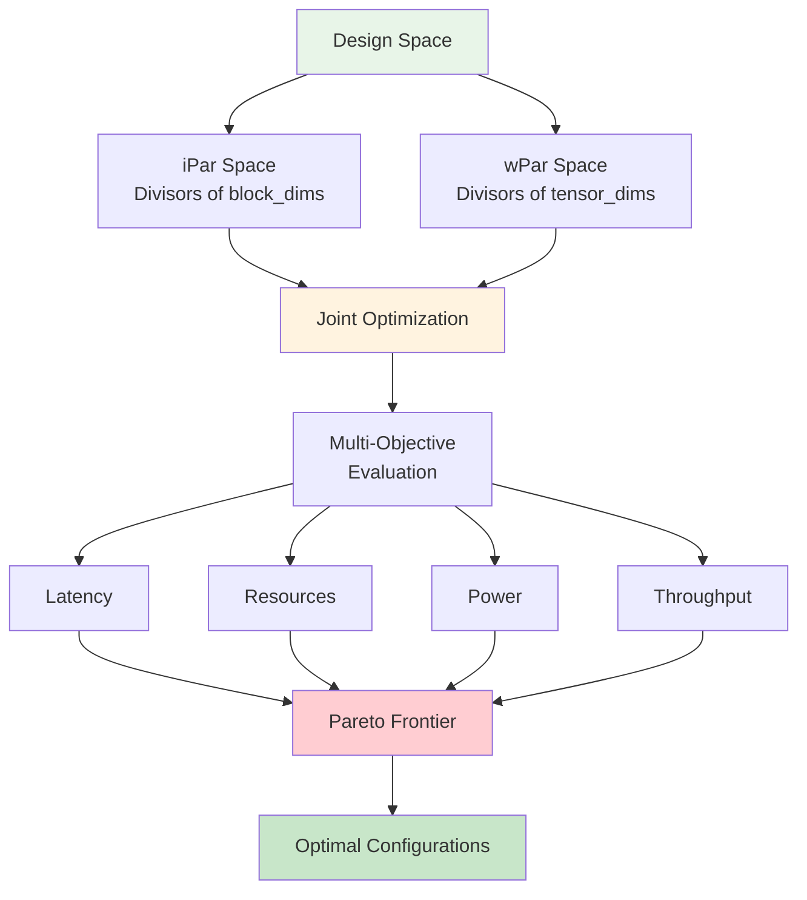

### 5.3 Sensitivity Analysis

**Performance Sensitivity**:
```
∂L/∂iPar = -eII × (∏(T_input) / B_input[0]) × (cII / iPar²)
∂L/∂wPar = -cII × (∏(T_input) / B_input) × (∏(T_weight) / wPar²)
```

**Resource Sensitivity**:
```
∂Resources/∂iPar ≈ constant (linear scaling)
∂Resources/∂wPar ≈ weight_storage_factor
```

**Insight**: iPar improvements show quadratic latency benefits but linear resource costs, making iPar optimization typically more effective than wPar optimization.

## 6. Implementation Implications

### 6.1 Hardware Generation Requirements

**Interface Signal Generation**:
```
For AXI-Stream interfaces:
TDATA_width = S × element_bitwidth
Buffer_depth = cII × S (minimum)
Flow_control = ready/valid handshaking
```

**Control Logic Complexity**:
```
Counter_bits = log₂(max(cII, eII))
State_machine_states = ⌈log₂(eII)⌉
Address_generation = function(B, S, T)
```

### 6.2 Memory Subsystem Design

**On-chip Memory Requirements**:
```
Input_buffers = cII × S_input × bitwidth
Weight_storage = active_weight_set × bitwidth  
Output_buffers = max(producer_rate, consumer_rate) × bitwidth
```

**Memory Access Patterns**:
```
Sequential: stride = 1, burst-friendly
Strided: stride = S, requires interleaving
Random: weight access patterns, cache-unfriendly
```

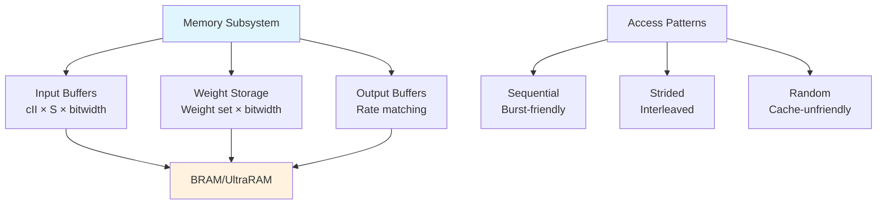

### 6.3 Verification and Validation

**Functional Verification**:
```
Interface protocol compliance (AXI4-Stream)
Data integrity through pipeline
Timing constraint satisfaction
Backpressure handling correctness
```

**Performance Verification**:
```
Measured_cII = actual_cycle_count / block_count
Measured_eII = execution_start_intervals  
Measured_L = total_inference_cycles
Assert: |Measured - Calculated| < tolerance
```

## 7. Case Study: BERT Attention Layer

### 7.1 Interface Specification

**Query Interface**:
```
tensor_dims = [1, 128, 768]    # batch=1, seq_len=128, hidden=768
block_dims = [1, 8, 96]        # process 8 tokens, 96 features per block
stream_dims = [1, 1, 8]        # 8-way parallelism
iPar = 8
```

**Key/Value Interfaces**:
```
tensor_dims = [1, 128, 768]    # same as query
block_dims = [1, 8, 96]        # aligned processing
stream_dims = [1, 1, 8]        # matched parallelism
```

**Weight Interfaces** (Q, K, V projection matrices):
```
tensor_dims = [768, 768]       # input_dim × output_dim
block_dims = [96, 96]          # tile size
stream_dims = [8, 8]           # wPar = 8 for each dimension
```

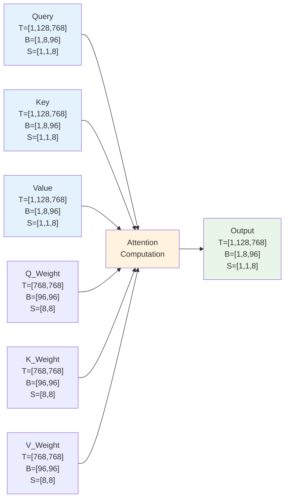

### 7.2 Performance Analysis

**Calculation Timing**:
```
cII_query = (8/1) × (96/8) = 96 cycles per block
num_blocks = (1×128×768) / (1×8×96) = 128 blocks
```

**Weight Loading Analysis**:
```
weight_elements_per_calc = 96 × 96 = 9,216
weight_cycles = 9,216 / (8×8) = 144 cycles
eII = max(96, 144) = 144 cycles
```

**Total Inference Latency**:
```
L = 144 × 128 = 18,432 cycles
At 200MHz: 92.16μs per attention layer
```

### 7.3 Optimization Opportunities

**iPar Scaling with Tiling Analysis**:
```
block_dims = [1, 8, 96] allows various tiling strategies:

iPar = 8   → stream_dims = [1, 8, 1],  cII = (1/1)×(8/8)×(96/1) = 96 cycles
iPar = 16  → stream_dims = [1, 8, 2],  cII = (1/1)×(8/8)×(96/2) = 48 cycles  
iPar = 32  → stream_dims = [1, 8, 4],  cII = (1/1)×(8/8)×(96/4) = 24 cycles
iPar = 96  → stream_dims = [1, 8, 12], cII = (1/1)×(8/8)×(96/12) = 8 cycles
iPar = 768 → stream_dims = [1, 8, 96], cII = (1/1)×(8/8)×(96/96) = 1 cycle

Resource scaling: iPar = 32 requires 4× feature-dimension DSPs
Tiling efficiency: All values tile cleanly due to divisibility
```

**wPar Tuning with Weight Tiling**:
```
Weight tensor [768, 768], block_dims [96, 96]:

wPar = 16 with row-parallel [16, 1]:
→ weight_cycles = (768/16) × (768/1) = 48 × 768 = 36,864 cycles

wPar = 64 with block-parallel [8, 8]:  
→ weight_cycles = (768/8) × (768/8) = 96 × 96 = 9,216 cycles

wPar = 256 with block-parallel [16, 16]:
→ weight_cycles = (768/16) × (768/16) = 48 × 48 = 2,304 cycles

Memory bandwidth: wPar = 64 may be optimal bandwidth/resource balance
```

**Block Size Optimization with Tiling Constraints**:
```
Alternative block sizes for tensor [1, 128, 768]:

block_dims = [1, 16, 48]: total = 768, allows iPar up to 768
→ Tiling options more flexible, but fewer total blocks (128)

block_dims = [1, 4, 192]: total = 768, allows iPar up to 768  
→ Different aspect ratio affects memory access patterns

block_dims = [1, 32, 24]: total = 768, allows iPar up to 768
→ Larger sequence chunks, smaller feature chunks

Choice depends on: memory hierarchy, computation pattern, downstream kernels
```

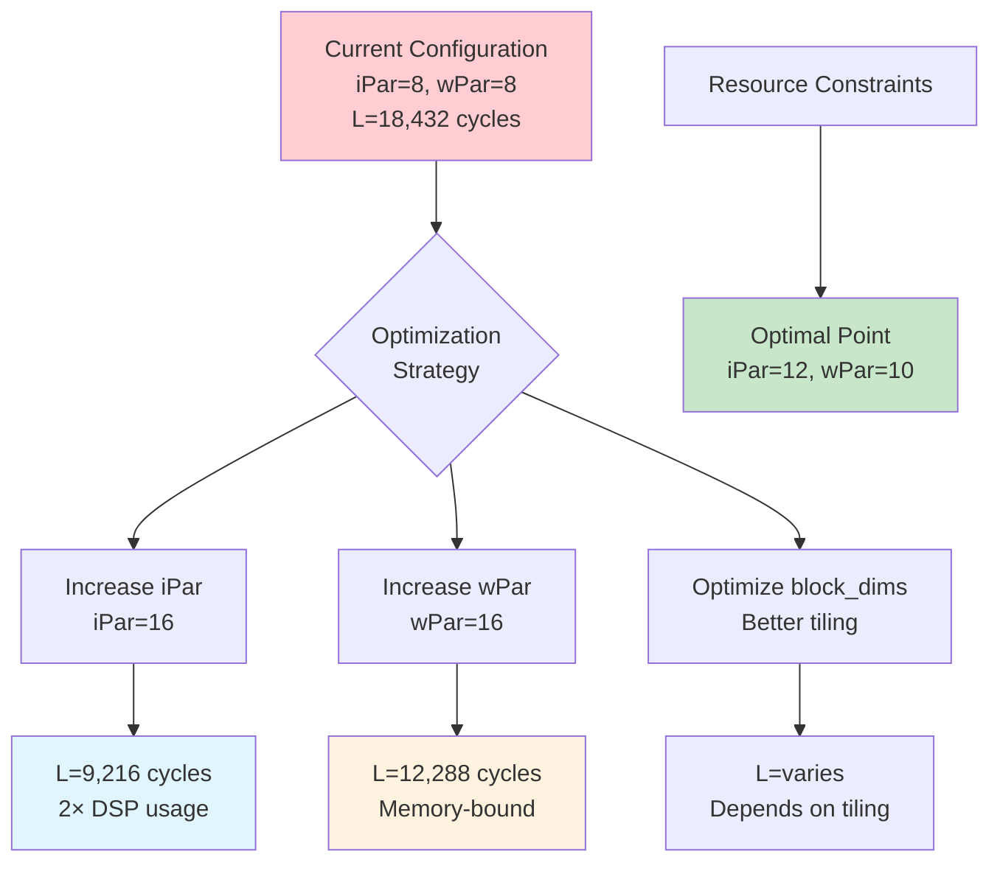

## 8. Conclusion and Future Extensions

### 8.1 Framework Strengths

1. **Mathematical Rigor**: Precise performance modeling enables accurate predictions
2. **Interface Abstraction**: Hardware complexity hidden behind clean mathematical model
3. **Composability**: Graph-level behavior emerges from kernel-level specifications
4. **Optimization Framework**: Systematic design space exploration with quantified trade-offs

### 8.2 Extension Opportunities

**Dynamic Reconfiguration**:
```
Time-varying parallelism: iPar(t), wPar(t)
Adaptive optimization: performance feedback loops
Multi-context switching: parameter sets for different workloads
```

**Heterogeneous Acceleration**:
```
Mixed-precision datatypes: per-interface bit-width optimization
Approximate computing: accuracy vs. performance trade-offs
Specialized function units: domain-specific optimizations
```

**Advanced Memory Hierarchies**:
```
Multi-level caching: L1/L2/L3 weight storage
Compression: runtime weight decompression
Sparsity exploitation: dynamic weight skipping
```

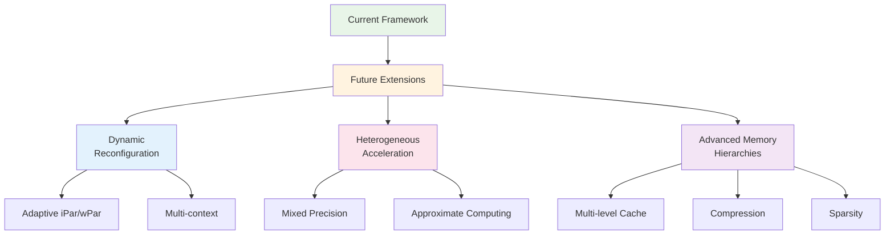

This mathematical framework provides the foundation for systematic FPGA accelerator design, enabling automated generation of high-performance, resource-efficient implementations from high-level model specifications.