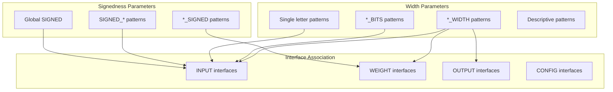
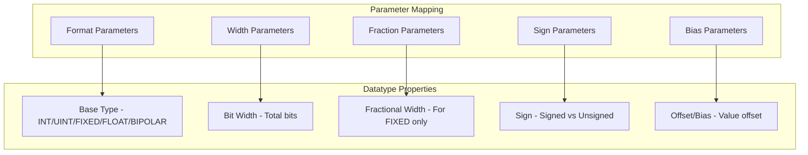
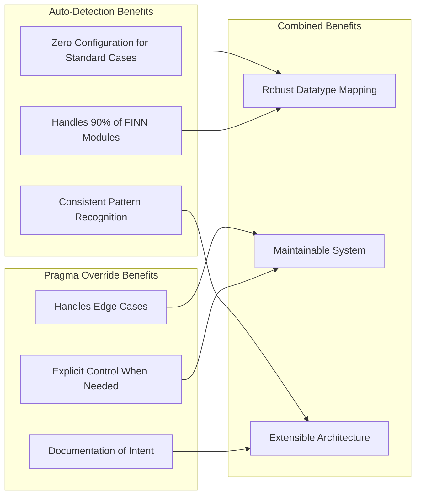

# Datatype Parameter Mapping Strategy

## Problem Statement

RTL modules use various parameter names to control precision for different interfaces, but we need to automatically map these to QONNX datatype specifications. Two key challenges:

1. **Parameter Name Variation**: Different modules use different naming conventions
2. **Interface Association**: Parameters may apply to specific interfaces or globally

## Analysis of Existing Patterns

### MVU Module Parameters
```systemverilog
module mvu_vvu_axi #(
    int unsigned ACTIVATION_WIDTH,  // Input interface precision
    int unsigned WEIGHT_WIDTH,      // Weight interface precision  
    int unsigned ACCU_WIDTH,        // Output interface precision
    bit SIGNED_ACTIVATIONS = 0,     // Input signedness
    bit NARROW_WEIGHTS = 0,         // Weight format flag
    // ...
)
```

### Thresholding Module Parameters
```systemverilog
module thresholding_axi #(
    int unsigned N,     // Output precision
    int unsigned WI,    // Input precision  
    int unsigned WT,    // Threshold precision
    bit SIGNED = 1,     // Input signedness
    bit FPARG = 0,      // Floating-point flag
    // ...
)
```

## Proposed Auto-Detection Scheme

### 1. Parameter Name Pattern Matching



### Auto-Detection Naming Scheme

#### Width Parameters
```python
WIDTH_PATTERNS = {
    # Input interface patterns
    'input': [
        'ACTIVATION_WIDTH', 'INPUT_WIDTH', 'IN_WIDTH', 'IWIDTH', 'IW', 'WI',
        'ACTIVATION_BITS', 'INPUT_BITS', 'IN_BITS', 'IBITS',
        'DATA_WIDTH', 'DWIDTH'  # Generic fallbacks
    ],
    
    # Weight interface patterns  
    'weight': [
        'WEIGHT_WIDTH', 'W_WIDTH', 'WWIDTH', 'WW', 'WT',
        'WEIGHT_BITS', 'W_BITS', 'WBITS',
        'PARAM_WIDTH', 'THRESHOLD_WIDTH'
    ],
    
    # Output interface patterns
    'output': [
        'OUTPUT_WIDTH', 'OUT_WIDTH', 'OWIDTH', 'OW', 'N',
        'OUTPUT_BITS', 'OUT_BITS', 'OBITS',
        'ACCU_WIDTH', 'ACCUMULATOR_WIDTH', 'RESULT_WIDTH'
    ],
    
    # Config interface patterns
    'config': [
        'CONFIG_WIDTH', 'CFG_WIDTH', 'ADDR_WIDTH', 'REG_WIDTH'
    ]
}
```

#### Signedness Parameters
```python
SIGNEDNESS_PATTERNS = {
    # Input signedness
    'input': [
        'SIGNED_ACTIVATIONS', 'SIGNED_INPUT', 'SIGNED_IN',
        'ACTIVATION_SIGNED', 'INPUT_SIGNED', 'IN_SIGNED',
        'SIGNED'  # Global fallback
    ],
    
    # Weight signedness
    'weight': [
        'SIGNED_WEIGHTS', 'SIGNED_W', 'WEIGHT_SIGNED', 'W_SIGNED'
    ],
    
    # Output signedness
    'output': [
        'SIGNED_OUTPUT', 'SIGNED_OUT', 'OUTPUT_SIGNED', 'OUT_SIGNED'
    ]
}
```

#### Format/Type Parameters
```python
FORMAT_PATTERNS = {
    # Floating-point indicators
    'floating_point': [
        'FPARG', 'FP_INPUT', 'FLOAT_INPUT', 'FLOATING_POINT',
        'USE_FLOAT', 'ENABLE_FP'
    ],
    
    # Fixed-point indicators
    'fixed_point': [
        'NARROW_WEIGHTS', 'FIXED_WEIGHTS', 'QUANTIZED',
        'FRAC_BITS', 'FRACTIONAL_WIDTH'
    ],
    
    # Binary/bipolar indicators
    'binary': [
        'BINARY_WEIGHTS', 'BIPOLAR_WEIGHTS', 'BNN_MODE'
    ]
}
```

### 2. Pragma-Based Override System

For cases where auto-detection fails or needs customization:

```systemverilog
// @brainsmith DATATYPE_PARAM <interface_name> <param_name> <property>

// Examples:
// @brainsmith DATATYPE_PARAM s_axis_input ACTIVATION_WIDTH width
// @brainsmith DATATYPE_PARAM s_axis_input SIGNED_ACTIVATIONS signed  
// @brainsmith DATATYPE_PARAM s_axis_weights WEIGHT_WIDTH width
// @brainsmith DATATYPE_PARAM s_axis_weights NARROW_WEIGHTS format
// @brainsmith DATATYPE_PARAM m_axis_output ACCU_WIDTH width
// @brainsmith DATATYPE_PARAM m_axis_output BIAS offset
```

## Complete Datatype Specification Requirements

### QONNX Datatype Components



### Required Parameter Types

```python
DATATYPE_PARAMETER_TYPES = {
    'width': {
        'description': 'Total bit width of the datatype',
        'required': True,
        'type': 'int',
        'validation': lambda x: x > 0
    },
    
    'signed': {
        'description': 'Whether the datatype is signed',
        'required': False,
        'type': 'bool',
        'default': True
    },
    
    'format': {
        'description': 'Base datatype format',
        'required': False,
        'type': 'enum',
        'values': ['INT', 'UINT', 'FIXED', 'FLOAT', 'BIPOLAR'],
        'default': 'INT'  # or 'UINT' based on signed parameter
    },
    
    'fractional_width': {
        'description': 'Fractional bits for FIXED point',
        'required': False,
        'type': 'int',
        'default': 0,
        'applies_to': ['FIXED']
    },
    
    'bias': {
        'description': 'Value offset/bias',
        'required': False, 
        'type': 'int',
        'default': 0
    },
    
    'scale': {
        'description': 'Scaling factor',
        'required': False,
        'type': 'float', 
        'default': 1.0
    }
}
```

## Implementation Strategy

### 1. Enhanced Parameter Analysis

```python
class DatatypeParameterAnalyzer:
    def __init__(self, parameters: List[Parameter], interfaces: List[InterfaceMetadata]):
        self.parameters = parameters
        self.interfaces = interfaces
        self.mappings = {}
    
    def analyze_automatic_mappings(self) -> Dict[str, DatatypeParameterMapping]:
        """Auto-detect parameter to interface mappings"""
        mappings = {}
        
        for interface in self.interfaces:
            if interface.interface_type == InterfaceType.CONTROL:
                continue
                
            interface_mapping = self._analyze_interface_parameters(interface)
            if interface_mapping:
                mappings[interface.name] = interface_mapping
                
        return mappings
    
    def _analyze_interface_parameters(self, interface: InterfaceMetadata) -> Optional[DatatypeParameterMapping]:
        """Analyze parameters for a specific interface"""
        interface_type = interface.interface_type.value.lower()
        
        # Find width parameter
        width_param = self._find_parameter_by_patterns(
            WIDTH_PATTERNS.get(interface_type, [])
        )
        
        # Find signedness parameter  
        signed_param = self._find_parameter_by_patterns(
            SIGNEDNESS_PATTERNS.get(interface_type, [])
        )
        
        # Find format parameters
        format_indicators = self._find_format_indicators()
        
        if width_param:
            return DatatypeParameterMapping(
                interface_name=interface.name,
                width_parameter=width_param.name,
                signed_parameter=signed_param.name if signed_param else None,
                format_indicators=format_indicators,
                bias_parameter=self._find_bias_parameter(),
                fractional_width_parameter=self._find_fractional_parameter()
            )
        
        return None
```

### 2. Pragma System Extension

```python
@dataclass
class DatatypeParamPragma(Pragma):
    interface_name: str
    parameter_name: str  
    property_type: str  # 'width', 'signed', 'format', 'bias', 'fractional_width'
    
    @classmethod
    def parse(cls, pragma_text: str) -> 'DatatypeParamPragma':
        # Parse: @brainsmith DATATYPE_PARAM s_axis_input ACTIVATION_WIDTH width
        parts = pragma_text.split()
        if len(parts) != 5 or parts[1] != "DATATYPE_PARAM":
            raise ValueError(f"Invalid DATATYPE_PARAM pragma: {pragma_text}")
            
        return cls(
            interface_name=parts[2],
            parameter_name=parts[3], 
            property_type=parts[4]
        )
    
    def apply_to_interface(self, interface: InterfaceMetadata, parameters: List[Parameter]):
        """Apply datatype parameter mapping to interface"""
        param = next((p for p in parameters if p.name == self.parameter_name), None)
        if not param:
            raise ValueError(f"Parameter {self.parameter_name} not found")
            
        # Store mapping in interface metadata
        if not hasattr(interface, 'datatype_parameter_mappings'):
            interface.datatype_parameter_mappings = {}
            
        interface.datatype_parameter_mappings[self.property_type] = param.name
```

### 3. Datatype Constraint Generation

```python
def generate_datatype_constraints(
    interface: InterfaceMetadata, 
    parameter_mappings: DatatypeParameterMapping
) -> List[DatatypeConstraintGroup]:
    """Generate QONNX datatype constraints from parameter mappings"""
    
    constraints = []
    
    # Base integer types
    if parameter_mappings.signed_parameter:
        # Signed integer
        constraints.append(DatatypeConstraintGroup(
            base_type="INT",
            min_width=1,
            max_width=parameter_mappings.get_max_width(),
            parameter_dependencies={
                'width': parameter_mappings.width_parameter,
                'signed': parameter_mappings.signed_parameter
            }
        ))
        
        # Unsigned integer (when signed=False)
        constraints.append(DatatypeConstraintGroup(
            base_type="UINT", 
            min_width=1,
            max_width=parameter_mappings.get_max_width(),
            parameter_dependencies={
                'width': parameter_mappings.width_parameter,
                'signed': parameter_mappings.signed_parameter
            }
        ))
    else:
        # Default to signed integer
        constraints.append(DatatypeConstraintGroup(
            base_type="INT",
            min_width=1, 
            max_width=parameter_mappings.get_max_width()
        ))
    
    # Fixed-point support
    if parameter_mappings.fractional_width_parameter:
        constraints.append(DatatypeConstraintGroup(
            base_type="FIXED",
            min_width=1,
            max_width=parameter_mappings.get_max_width(),
            parameter_dependencies={
                'width': parameter_mappings.width_parameter,
                'fractional_width': parameter_mappings.fractional_width_parameter
            }
        ))
    
    # Floating-point support  
    if parameter_mappings.has_float_indicators():
        constraints.append(DatatypeConstraintGroup(
            base_type="FLOAT",
            min_width=16,  # Half precision minimum
            max_width=64,  # Double precision maximum
            parameter_dependencies={
                'width': parameter_mappings.width_parameter
            }
        ))
    
    # Bipolar support
    if parameter_mappings.has_bipolar_indicators():
        constraints.append(DatatypeConstraintGroup(
            base_type="BIPOLAR", 
            min_width=1,
            max_width=1  # Always 1-bit
        ))
    
    return constraints
```

## Example Usage

### Auto-Detection Success Case

```systemverilog
module matrix_mult #(
    int unsigned ACTIVATION_WIDTH = 8,  // Auto-detected: input interface width
    int unsigned WEIGHT_WIDTH = 4,      // Auto-detected: weight interface width  
    int unsigned ACCU_WIDTH = 32,       // Auto-detected: output interface width
    bit SIGNED_ACTIVATIONS = 1,         // Auto-detected: input signedness
    int unsigned PE = 4,
    int unsigned SIMD = 8
)(
    // Standard AXI interfaces...
);
```

**Generated Constraints:**
```python
# s_axis_input interface
DatatypeConstraintGroup("INT", 1, 32, {'width': 'ACTIVATION_WIDTH', 'signed': 'SIGNED_ACTIVATIONS'})
DatatypeConstraintGroup("UINT", 1, 32, {'width': 'ACTIVATION_WIDTH', 'signed': 'SIGNED_ACTIVATIONS'})

# s_axis_weights interface  
DatatypeConstraintGroup("INT", 1, 16, {'width': 'WEIGHT_WIDTH'})

# m_axis_output interface
DatatypeConstraintGroup("INT", 1, 64, {'width': 'ACCU_WIDTH'})
```

### Pragma Override Case

```systemverilog
// @brainsmith DATATYPE_PARAM s_axis_input WI width
// @brainsmith DATATYPE_PARAM s_axis_input SIGNED signed
// @brainsmith DATATYPE_PARAM s_axis_weights WT width  
// @brainsmith DATATYPE_PARAM m_axis_output N width
module thresholding_axi #(
    int unsigned N,      // Output width (non-standard name)
    int unsigned WI,     // Input width (non-standard name)
    int unsigned WT,     // Weight width (non-standard name)
    bit SIGNED = 1,      // Global signed flag
    // ...
);
```

## Benefits of This Approach



## Implementation Priority

1. **Phase 1**: Implement auto-detection for common patterns (ACTIVATION_WIDTH, WEIGHT_WIDTH, etc.)
2. **Phase 2**: Add pragma system for custom mappings
3. **Phase 3**: Extend to support advanced datatypes (FIXED, FLOAT, BIPOLAR)
4. **Phase 4**: Add validation and constraint optimization

This approach provides a robust foundation for automatic datatype parameter mapping while maintaining flexibility for edge cases through the pragma system.