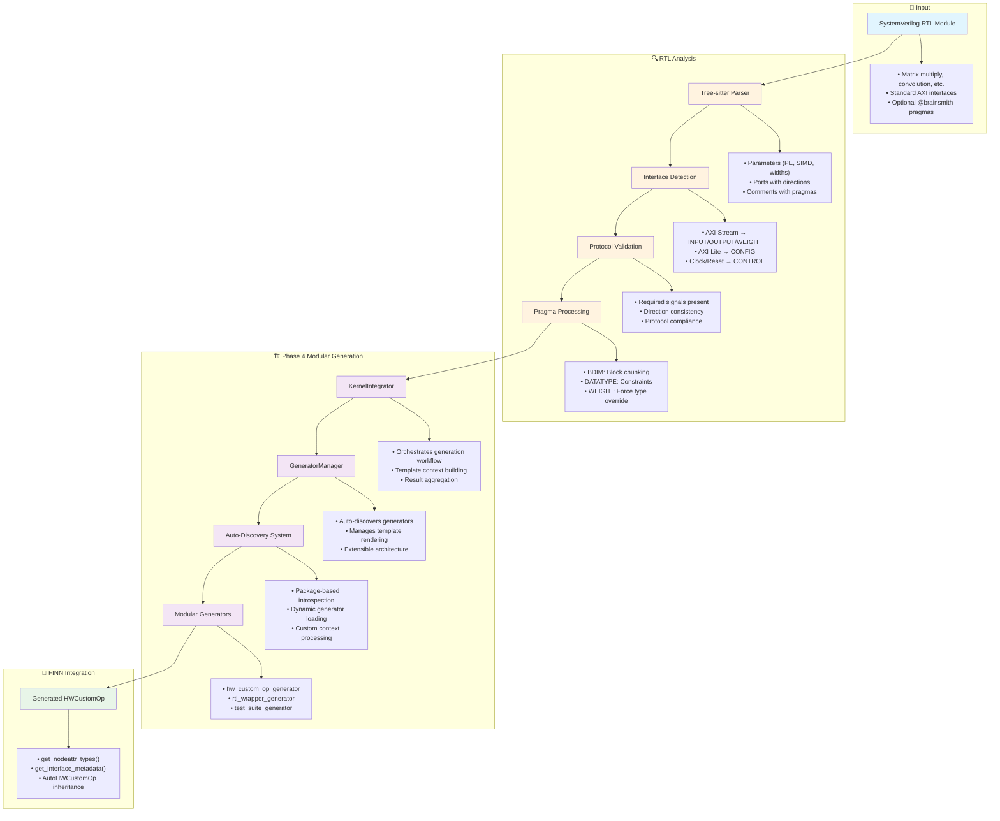
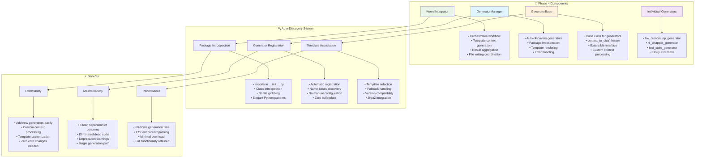
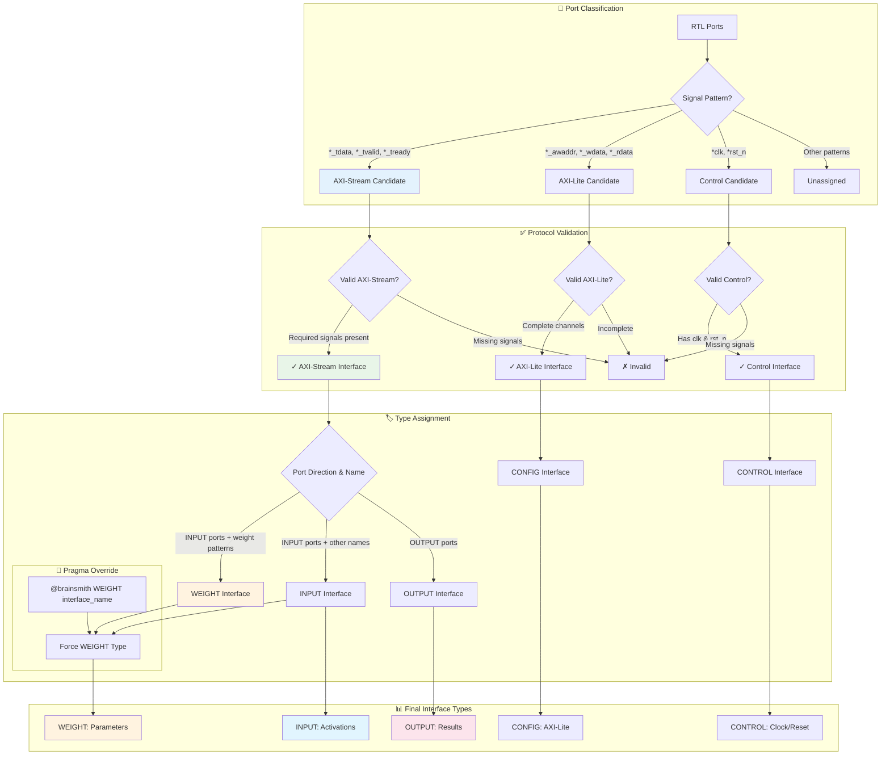
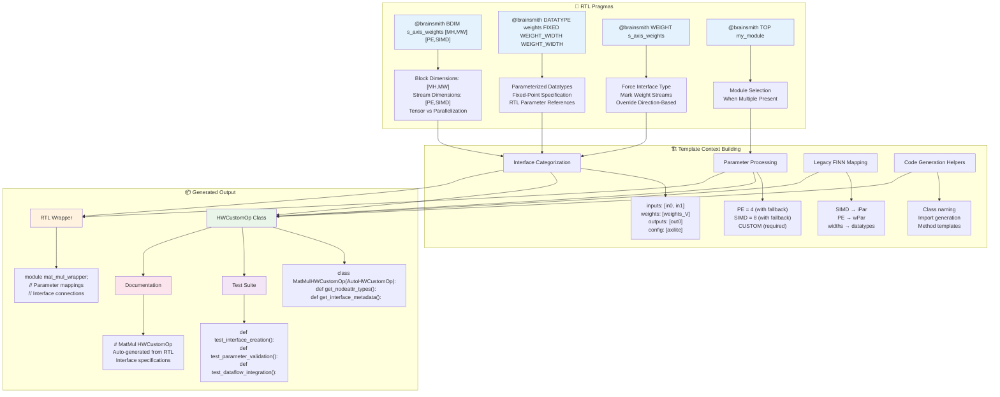
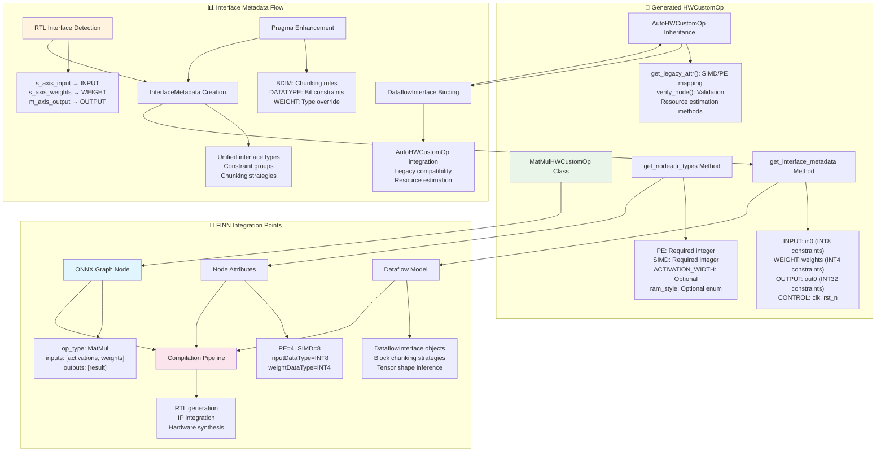
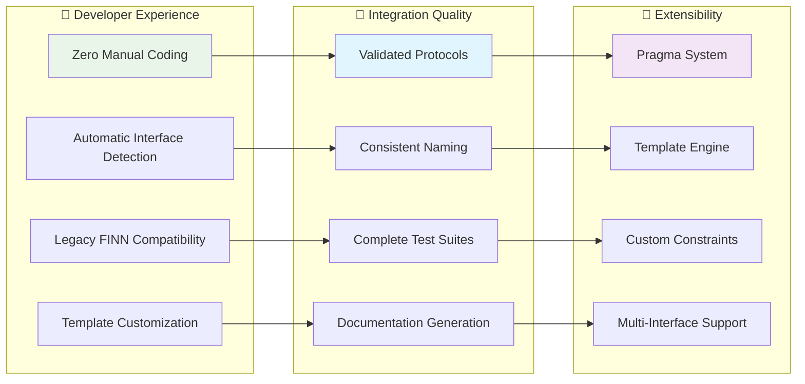

# Hardware Kernel Generator (HKG) - Design Document

## Overview

The Hardware Kernel Generator (HKG) Phase 4 is a modular system that transforms SystemVerilog RTL modules into FINN-compatible HWCustomOp classes with automatic interface detection, datatype constraints, and extensible template-based code generation.

**Latest Updates (Phase 4):**
- ✅ Modular generator architecture with auto-discovery
- ✅ Extensible generator system (hw_custom_op, rtl_wrapper, test_suite)
- ✅ KernelIntegrator orchestration replacing UnifiedGenerator
- ✅ Complete dead code cleanup and deprecation warnings
- ✅ Comprehensive @brainsmith pragma support across all hw_kernels

## Complete HKG Workflow



## Phase 4 Modular Architecture



## Interface Detection & Type Assignment



## Pragma System & Template Generation



## FINN Integration Architecture



## Key Benefits for FINN Users



## Usage Summary

1. **Input**: SystemVerilog RTL module with @brainsmith pragmas
2. **Command**: `./smithy exec "python -m brainsmith.tools.hw_kernel_gen my_module.sv -o output_dir/ --debug"`
3. **Output**: Complete FINN-compatible HWCustomOp package
4. **Integration**: Drop into FINN compilation pipeline

**Phase 4 Examples:**

```bash
# FMPadding with complete pragmas
./smithy exec "python -m brainsmith.tools.hw_kernel_gen brainsmith/hw_kernels/fmpadding/fmpadding_axi.sv -o output/"

# MVU/VVU matrix operations
./smithy exec "python -m brainsmith.tools.hw_kernel_gen brainsmith/hw_kernels/mvu/mvu_vvu_axi.sv -o output/"

# Thresholding/activation functions  
./smithy exec "python -m brainsmith.tools.hw_kernel_gen brainsmith/hw_kernels/thresholding/thresholding_axi.sv -o output/"
```

**Key Phase 4 Features:**
- 🚀 **Modular Architecture**: Extensible generator system with auto-discovery
- 🔍 **Enhanced Pragmas**: Block vs stream dimensions, parameterized datatypes
- 🏷️ **Smart Interface Detection**: AXI-Stream typing with weight stream support
- 📝 **Comprehensive Pragmas**: All hw_kernels updated with proper @brainsmith annotations
- 🎯 **FINN Ready**: AutoHWCustomOp inheritance with validated interfaces
- ⚡ **Performance**: 60-65ms generation time with complete functionality
- 🧹 **Clean Codebase**: Dead code eliminated, deprecation warnings for legacy components
- 📦 **Complete Package**: Python class, RTL wrapper, comprehensive test suites

**Supported RTL Kernels:**
- ✅ Matrix Vector Units (MVU/VVU) with weight streams
- ✅ Feature Map Padding with channel processing
- ✅ Thresholding/Activation functions with PE parallelization
- ✅ Memory streaming with parameterized datatypes
- ✅ FIFO/Queue modules with width parameters