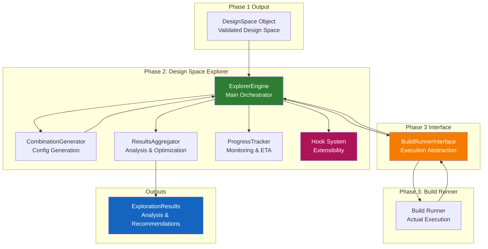
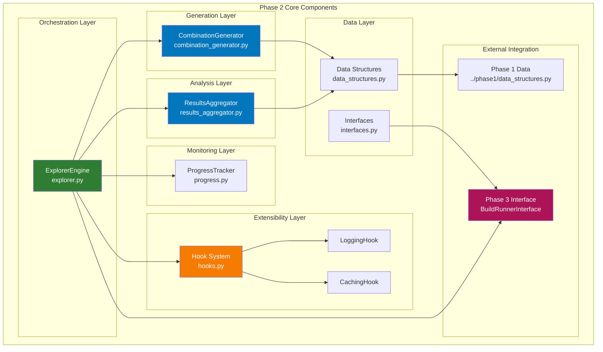
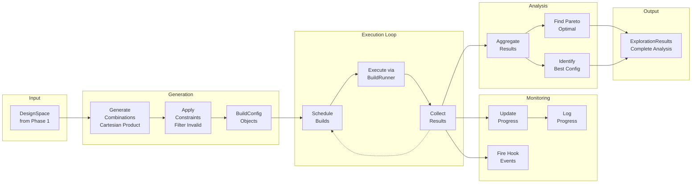
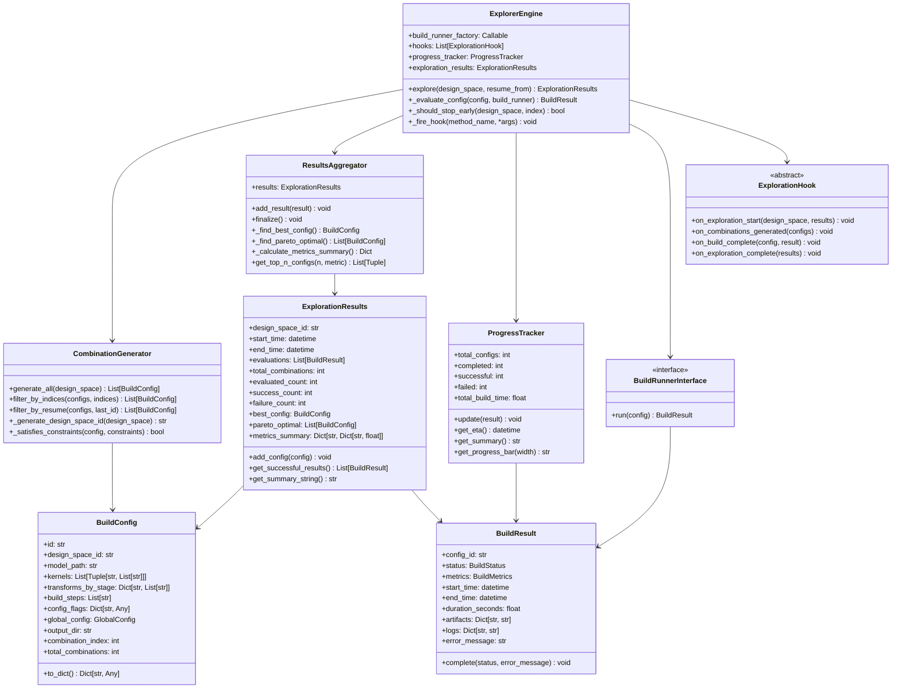
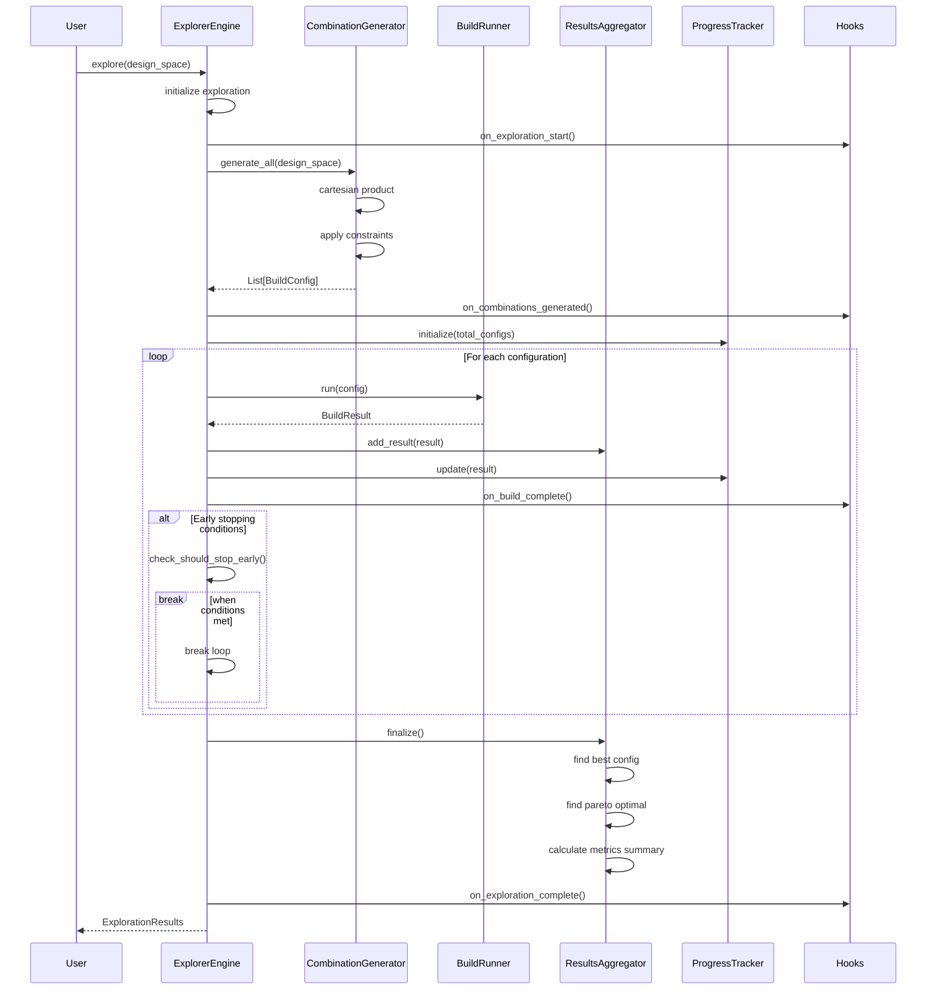
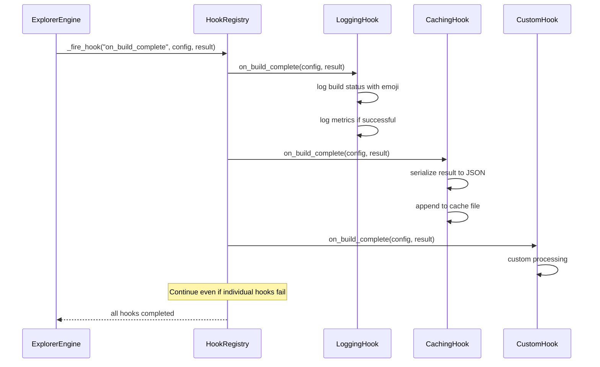
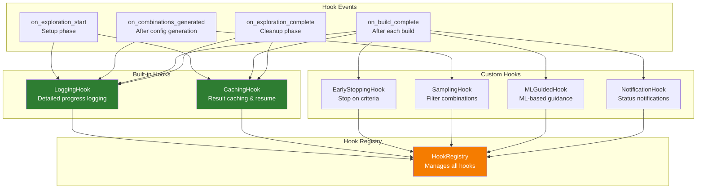
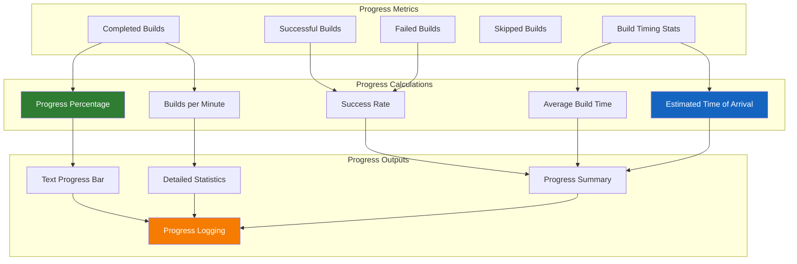
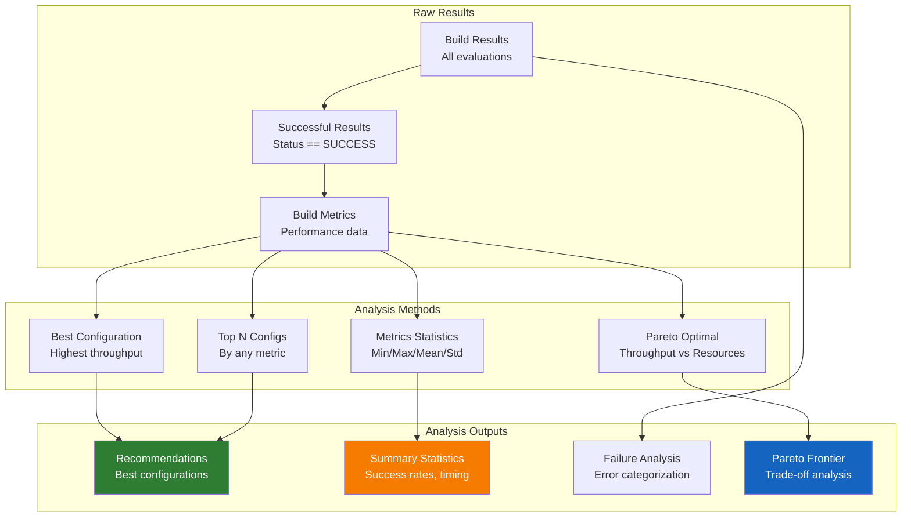

# Phase 2: Design Space Explorer - Architecture Document

## Overview

Phase 2 of the Brainsmith DSE v3 toolchain is responsible for systematically exploring design spaces created in Phase 1. It generates all valid build configurations, coordinates their execution through Phase 3, and aggregates results to identify optimal solutions. This document provides comprehensive architectural documentation with visual diagrams.

## Table of Contents

1. [High-Level Architecture](#high-level-architecture)
2. [Component Architecture](#component-architecture)
3. [Data Flow](#data-flow)
4. [Class Relationships](#class-relationships)
5. [Sequence Diagrams](#sequence-diagrams)
6. [Hook System](#hook-system)
7. [Progress Tracking](#progress-tracking)
8. [Results Analysis](#results-analysis)

## High-Level Architecture

Phase 2 serves as the orchestrator for systematic design space exploration, bridging Phase 1 (space definition) and Phase 3 (build execution).



## Component Architecture

Phase 2 consists of several key components working together to systematically explore the design space.



## Data Flow

The data flow through Phase 2 shows how design spaces are systematically explored and results aggregated.



## Class Relationships

The core data structures and their relationships define the exploration process and results.



## Sequence Diagrams

### Main Exploration Process

The sequence of operations during design space exploration.



### Hook System Execution

How hooks are fired during exploration events.



## Hook System

The extensible hook system allows injection of custom behavior at key exploration points.



## Progress Tracking

Comprehensive progress monitoring with ETA calculation and detailed statistics.



## Results Analysis

Comprehensive analysis of exploration results with optimization identification.



## Key Design Decisions

### 1. Exhaustive Strategy First
- Implementation focuses on exhaustive exploration initially
- Hook system designed to support future intelligent strategies
- Cartesian product generation with constraint filtering

### 2. Clean Phase 3 Interface
- BuildRunnerInterface abstracts execution details
- Phase 2 only coordinates, doesn't execute builds
- BuildConfig contains all information needed for execution

### 3. Comprehensive Results Analysis
- Multi-objective optimization with Pareto frontier
- Detailed metrics summarization and statistics
- Failure analysis and categorization

### 4. Extensible Hook System
- Clean separation of concerns through hooks
- Built-in hooks for common needs (logging, caching)
- Abstract base class enables custom extensions

### 5. Resume Capability
- Unique design space IDs for consistent identification
- JSONL cache format for incremental result storage
- Filter configurations for resuming from specific points

### 6. Progress Monitoring
- Real-time progress tracking with ETA calculation
- Multiple progress reporting formats (summary, detailed, bar)
- Performance metrics (builds per minute, success rates)

## Usage Examples

### Basic Exploration

```python
from brainsmith.core.phase2 import explore, MockBuildRunner
from brainsmith.core.phase1 import forge

# Create design space
design_space = forge("model.onnx", "blueprint.yaml")

# Simple exploration with mock runner
results = explore(
    design_space=design_space,
    build_runner_factory=lambda: MockBuildRunner(success_rate=0.8)
)

print(f"Best configuration: {results.best_config.id}")
print(f"Pareto optimal: {len(results.pareto_optimal)} configs")
```

### Advanced Exploration with Hooks

```python
from brainsmith.core.phase2 import (
    ExplorerEngine, 
    LoggingHook, 
    CachingHook
)

# Create explorer with hooks
hooks = [
    LoggingHook(log_level="INFO", log_file="exploration.log"),
    CachingHook(cache_dir=".cache")
]

explorer = ExplorerEngine(
    build_runner_factory=create_finn_runner,
    hooks=hooks
)

# Explore with resume capability
results = explorer.explore(
    design_space=design_space,
    resume_from="dse_abc12345_config_00050"  # Resume from specific config
)
```

### Custom Hook Implementation

```python
from brainsmith.core.phase2 import ExplorationHook

class EarlyStoppingHook(ExplorationHook):
    def __init__(self, min_throughput=1000.0, max_failures=50):
        self.min_throughput = min_throughput
        self.max_failures = max_failures
        self.failure_count = 0
        self.found_good_config = False
    
    def on_exploration_start(self, design_space, exploration_results):
        logger.info(f"Early stopping: min_throughput={self.min_throughput}")
    
    def on_combinations_generated(self, configs):
        pass
    
    def on_build_complete(self, config, result):
        if result.status == BuildStatus.FAILED:
            self.failure_count += 1
        elif result.metrics and result.metrics.throughput >= self.min_throughput:
            self.found_good_config = True
    
    def on_exploration_complete(self, exploration_results):
        logger.info(f"Early stopping stats: {self.failure_count} failures")
```

## Integration Points

### Phase 1 Integration
- Receives validated DesignSpace objects
- Uses Phase 1 data structures (GlobalConfig, BuildMetrics)
- Leverages Phase 1 combination generation methods

### Phase 3 Integration
- BuildRunnerInterface defines clean contract
- Passes self-contained BuildConfig to Phase 3
- Receives BuildResult with metrics and artifacts

### Plugin System Integration
- No direct plugin system dependencies
- Plugin validation handled in Phase 1
- Focus on exploration orchestration only

## Performance Characteristics

### Time Complexity
- **Combination Generation**: O(k × t) where k=kernels, t=transforms
- **Build Execution**: O(n × b) where n=configurations, b=build time
- **Results Analysis**: O(n log n) for Pareto frontier calculation
- **Progress Tracking**: O(1) per update

### Space Complexity
- **Configuration Storage**: O(n) where n=total configurations
- **Results Storage**: O(n) for all build results
- **Cache Storage**: O(n) for persistent caching

### Scalability
- Supports large design spaces through constraint filtering
- Resume capability for long-running explorations
- Hook system scales with exploration complexity
- Memory usage linear with result count

## Future Enhancements

### Planned Features
1. **Intelligent Sampling** - Hook to reduce evaluation count
2. **Parallel Execution** - Multiple concurrent builds
3. **Adaptive Strategies** - ML-guided exploration
4. **Real-time Visualization** - Live progress dashboards
5. **Distributed Execution** - Multi-node exploration

### Extension Points
1. **Search Strategies** - Beyond exhaustive exploration
2. **Constraint Solvers** - Advanced constraint satisfaction
3. **Result Persistence** - Database integration
4. **Notification Systems** - Real-time status updates
5. **Custom Metrics** - Domain-specific optimization criteria

## Summary

Phase 2 Design Space Explorer provides a robust, extensible framework for systematic design space exploration. Key strengths include:

- **Clean Architecture** - Clear separation between exploration coordination and build execution
- **Extensible Design** - Hook system enables custom behavior without core modifications
- **Comprehensive Analysis** - Multi-objective optimization with Pareto frontier analysis
- **Production Ready** - Resume capability, progress tracking, and robust error handling
- **Performance Focused** - Efficient algorithms and minimal memory overhead

The architecture successfully bridges Phase 1 (design space definition) and Phase 3 (build execution) while providing valuable exploration coordination, result analysis, and extensibility for future enhancements.