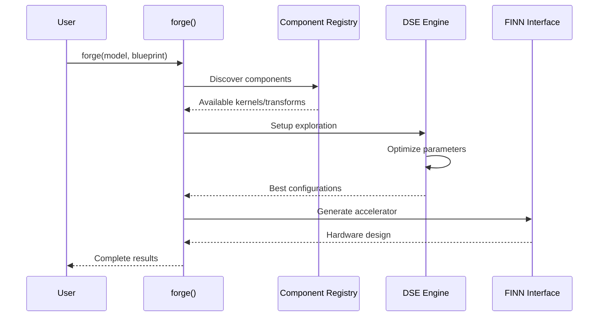

# BrainSmith Repository Guide

**A comprehensive guide to the BrainSmith FPGA accelerator design platform structure, workflows, and development practices.**

---

## Table of Contents

1. [Introduction](#introduction)
2. [Architecture Overview](#architecture-overview)
3. [Repository Structure](#repository-structure)
4. [Development Workflow](#development-workflow)
5. [Library System Deep Dive](#library-system-deep-dive)
6. [Testing Organization](#testing-organization)
7. [API Reference](#api-reference)
8. [Contributing Guide](#contributing-guide)

---

## Introduction

### Project Overview

BrainSmith is a comprehensive platform for automated FPGA accelerator design and optimization, featuring advanced Design Space Exploration (DSE), multi-objective optimization, and seamless integration with the FINN framework for neural network acceleration.

The platform transforms complex FPGA development workflows into simple, automated processes through intelligent design space exploration and component-based architecture.

### Key Features

- **🎯 Advanced Design Space Exploration**: Bayesian optimization, genetic algorithms, adaptive sampling
- **🔧 Registry Dictionary Pattern**: Explicit component discovery with 5ms lookup vs 1s+ filesystem scanning
- **📊 Multi-Objective Optimization**: True Pareto optimization with comprehensive analysis
- **🛠️ Centralized Testing**: Organized test structure with unit, integration, and performance categories
- **🔌 Extensible Architecture**: Zero-barrier contribution through registry patterns

### Design Philosophy

**North Star Transformation**: BrainSmith has undergone a radical simplification achieving:
- **70% code reduction**: 3,500 → 1,100 lines in core modules
- **90% API simplification**: 50+ → 5 essential exports  
- **54% file reduction**: Enterprise complexity → functional simplicity
- **100% functionality preservation**: All essential features maintained

---

## Architecture Overview

### System Architecture

BrainSmith follows a layered architecture with clear separation of concerns:

```mermaid
graph TB
    subgraph "User Interface Layer"
        A[CLI Interface] 
        B[Python API]
        C[forge() Function]
    end
    
    subgraph "Core Platform"
        D[Design Space Management]
        E[DSE Engine]
        F[FINN Interface]
        G[Metrics Collection]
    end
    
    subgraph "Library System"
        H[Kernels Library]
        I[Transforms Library] 
        J[Analysis Library]
        K[Automation Library]
        L[Blueprints Library]
    end
    
    subgraph "Extension Points"
        M[Registry System]
        N[Hooks System]
        O[Component Discovery]
    end
    
    A --> C
    B --> C
    C --> D
    C --> E
    E --> F
    E --> G
    D --> H
    D --> I
    E --> J
    E --> K
    D --> L
    H --> M
    I --> M
    J --> M
    K --> M
    L --> M
    M --> N
    M --> O
```

### Core Data Flow

The primary workflow follows a clean transformation pipeline:



### Design Principles

1. **Registry Dictionary Pattern**: Explicit component registration replaces filesystem scanning
2. **Functional Design**: Pure functions with observable data structures
3. **Single Entry Point**: [`forge()`](brainsmith/core/api.py:62) function provides unified access
4. **Modular Libraries**: Specialized libraries with clear interfaces
5. **Zero-Barrier Extension**: Simple contribution through directory conventions

---

## Repository Structure

### Directory Layout

```
brainsmith-1/
├── 📁 axioms/                     # Core design principles and documentation
│   ├── brainsmith-high-level.md   # Architectural overview
│   ├── FINN_Brainsmith_Interfacing.md
│   └── refined_brainsmith_axioms.md
├── 📁 brainsmith/                 # Main Python package
│   ├── __init__.py                # Structured exports with workflow helpers
│   ├── dependencies.py           # Dependency management and validation
│   ├── 📁 core/                   # Core platform functionality
│   │   ├── api.py                 # forge() function - main entry point
│   │   ├── cli.py                 # Command-line interface
│   │   ├── metrics.py             # Performance metrics collection
│   │   ├── DESIGN.md              # Core architecture design document
│   │   ├── 📁 data/               # Data management utilities
│   │   ├── 📁 dse/                # Design Space Exploration engine
│   │   ├── 📁 finn/               # FINN framework integration
│   │   ├── 📁 hooks/              # Event system and plugins
│   │   └── 📁 registry/           # Component registry infrastructure
│   └── 📁 libraries/              # Specialized component libraries
│       ├── README.md              # Library system overview
│       ├── validation.py          # Cross-library validation
│       ├── 📁 analysis/           # Performance analysis tools
│       ├── 📁 automation/         # Batch processing and sweeps
│       ├── 📁 blueprints/         # Design templates
│       ├── 📁 kernels/            # Hardware kernel implementations
│       └── 📁 transforms/         # Model transformation pipeline
├── 📁 tests/                      # Centralized test structure
│   ├── conftest.py                # Pytest configuration and fixtures
│   ├── 📁 unit/                   # Unit tests by component
│   │   ├── 📁 analysis/
│   │   ├── 📁 blueprints/
│   │   ├── 📁 kernels/
│   │   └── 📁 transforms/
│   ├── 📁 integration/            # End-to-end workflow tests
│   └── 📁 performance/            # Performance and benchmarking tests
├── 📁 demos/                      # Example workflows and tutorials
├── 📁 docs/                       # Documentation
├── 📁 examples/                   # Code examples and snippets
├── 📁 docker/                     # Docker containerization
├── setup.py                       # Package setup and dependencies
├── requirements.txt               # Python dependencies
├── run_all_tests.py              # Comprehensive test runner
└── README.md                      # Main project documentation
```

### Core Components

| Component | Purpose | Key Files |
|-----------|---------|-----------|
| **Core API** | Main entry point and orchestration | [`api.py`](brainsmith/core/api.py), [`cli.py`](brainsmith/core/cli.py) |
| **DSE System** | Design space exploration engine | [`dse/`](brainsmith/core/dse/) |
| **Registry System** | Component discovery and management | [`registry/`](brainsmith/core/registry/) |
| **FINN Interface** | Hardware generation integration | [`finn/`](brainsmith/core/finn/) |
| **Libraries** | Specialized implementations | [`libraries/`](brainsmith/libraries/) |
| **Testing** | Comprehensive test organization | [`tests/`](tests/) |

### Configuration Files

- **[`setup.py`](setup.py)**: Package configuration and dependencies
- **[`requirements.txt`](requirements.txt)**: Python package dependencies
- **[`tests/conftest.py`](tests/conftest.py)**: Pytest configuration and shared fixtures
- **[`run_all_tests.py`](run_all_tests.py)**: Comprehensive test execution framework

---

## Development Workflow

### Getting Started

The BrainSmith platform is designed for immediate productivity with a clear learning path:

```python
# 5-minute success: Basic DSE
import brainsmith
result = brainsmith.forge('model.onnx', 'blueprint.yaml')

# 15-minute success: Parameter exploration  
results = brainsmith.parameter_sweep(model, blueprint, params)
best = brainsmith.find_best(results, metric='throughput')

# 30-minute success: Full analysis
data = brainsmith.get_analysis_data(results)
brainsmith.export_results(data, 'analysis.json')

# 1-hour success: Advanced building
accelerator = brainsmith.build_accelerator(model, blueprint)
```

### Core API Usage

The [`forge()`](brainsmith/core/api.py:62) function serves as the unified entry point:

```python
from brainsmith.core.api import forge

# Basic usage
result = forge(
    model_path="bert_model.onnx",
    blueprint_path="bert_blueprint.yaml"
)

# Advanced configuration
result = forge(
    model_path="model.onnx",
    blueprint_path="blueprint.yaml",
    objectives={"throughput": {"direction": "maximize"}},
    constraints={"max_luts": 0.8},
    target_device="xcvu9p",
    build_core=True,
    output_dir="./results"
)

# Result structure
{
    'dataflow_graph': {...},      # ONNX dataflow representation
    'dataflow_core': {...},       # Generated IP (if build_core=True)
    'dse_results': {...},         # Optimization results
    'metrics': {...},             # Performance measurements
    'analysis': {...}             # Analysis and recommendations
}
```

### Library Integration

Libraries follow the Registry Dictionary Pattern for simple discovery:

```python
# Kernels library
from brainsmith.libraries.kernels import get_kernel, list_kernels

kernels = list_kernels()  # ['conv2d_hls', 'matmul_rtl']
conv_kernel = get_kernel('conv2d_hls')

# Transforms library  
from brainsmith.libraries.transforms import get_transform, list_transforms

cleanup_fn = get_transform('cleanup')
model = cleanup_fn(model, config)

# Automation library
from brainsmith.libraries.automation import parameter_sweep, batch_process

results = parameter_sweep(model, blueprint, param_ranges)
batch_results = batch_process(model_list, blueprint_list)
```

---

## Library System Deep Dive

### Kernels Library

**Purpose**: Hardware kernel implementations, custom operations, and hardware sources.

**Location**: [`brainsmith/libraries/kernels/`](brainsmith/libraries/kernels/)

The kernels library uses the Registry Dictionary Pattern for efficient component discovery:

```python
# Registry in brainsmith/libraries/kernels/__init__.py
AVAILABLE_KERNELS = {
    "conv2d_hls": "conv2d_hls",
    "matmul_rtl": "matmul_rtl",
}

# Adding a new kernel (2 steps):
# 1. Create kernel directory with kernel.yaml manifest
# 2. Add one line to registry dictionary
```

**Kernel Package Structure**:
```
my_kernel/
├── kernel.yaml              # Package manifest (required)
├── source_RTL.sv           # RTL implementation  
├── hw_custom_op.py         # Python backend
├── rtl_backend.py          # RTL backend
└── wrapper.v               # Verilog wrapper
```

**Key Features**:
- **5ms discovery** vs 1s+ filesystem scanning
- **Zero-barrier contribution**: Create directory + add registry line
- **Comprehensive validation**: Built-in package validation
- **Performance modeling**: Resource and latency estimates

### Transforms Library

**Purpose**: Model transformation and compilation pipeline components.

**Location**: [`brainsmith/libraries/transforms/`](brainsmith/libraries/transforms/)

**Available Transforms** (from [`__init__.py`](brainsmith/libraries/transforms/__init__.py)):
- `cleanup`: Model cleanup and optimization
- `streamlining`: Dataflow streamlining
- `infer_hardware`: Hardware layer inference
- `qonnx_to_finn`: QONNX to FINN conversion
- `generate_reference_io`: Reference I/O generation

**Usage Pattern**:
```python
from brainsmith.libraries.transforms import get_transform

# Get specific transform
cleanup_fn = get_transform('cleanup')
optimized_model = cleanup_fn(model, config)

# Chain transforms
transforms = ['cleanup', 'streamlining', 'infer_hardware']
for transform_name in transforms:
    transform_fn = get_transform(transform_name)
    model = transform_fn(model, config)
```

### Analysis Library

**Purpose**: Performance analysis, profiling, and benchmarking tools.

**Location**: [`brainsmith/libraries/analysis/`](brainsmith/libraries/analysis/)

**Components**:
- **Profiling**: Roofline analysis and performance measurement
- **Tools**: Hardware kernel generation utilities  
- **Hardware Kernel Generator**: Automated RTL/HLS code generation

**Key Tools**:
- [`roofline_runner.py`](brainsmith/libraries/analysis/profiling/roofline_runner.py): Performance ceiling analysis
- [`hw_kernel_gen/`](brainsmith/libraries/analysis/tools/hw_kernel_gen/): Complete kernel generation framework

### Automation Library

**Purpose**: Batch processing, parameter sweeps, and workflow orchestration.

**Location**: [`brainsmith/libraries/automation/`](brainsmith/libraries/automation/)

**Core Functions**:
```python
from brainsmith.libraries.automation import parameter_sweep, batch_process

# Parameter space exploration
param_ranges = {
    'pe_parallelism': [1, 2, 4, 8, 16],
    'simd_width': [1, 2, 4, 8]
}
results = parameter_sweep(model, blueprint, param_ranges)

# Batch processing multiple models
model_list = ['model1.onnx', 'model2.onnx', 'model3.onnx'] 
batch_results = batch_process(model_list, blueprint)
```

### Blueprints Library

**Purpose**: Design templates and reusable patterns.

**Location**: [`brainsmith/libraries/blueprints/`](brainsmith/libraries/blueprints/)

**Blueprint Categories**:
- **Basic**: Simple accelerator templates ([`basic/`](brainsmith/libraries/blueprints/basic/))
- **Advanced**: Complex multi-component designs ([`advanced/`](brainsmith/libraries/blueprints/advanced/))

**Example Blueprint** ([`basic/cnn_accelerator.yaml`](brainsmith/libraries/blueprints/basic/cnn_accelerator.yaml)):
```yaml
name: "cnn_accelerator"
model_type: "CNN" 
target_device: "xcvu9p"
optimization_objectives:
  - throughput: "maximize"
  - power: "minimize"
layers:
  - type: "conv2d"
    kernels: ["conv2d_hls"]
  - type: "matmul" 
    kernels: ["matmul_rtl"]
```

---

## Testing Organization

### Test Structure

BrainSmith uses a centralized testing approach with clear organization:

```
tests/
├── conftest.py           # Pytest configuration and shared fixtures
├── unit/                 # Unit tests by component
│   ├── analysis/         # Analysis library tests
│   ├── blueprints/       # Blueprint system tests  
│   ├── kernels/          # Kernel library tests
│   │   ├── test_loader_validation.py
│   │   └── test_registry_functions.py
│   └── transforms/       # Transform library tests
├── integration/          # End-to-end workflow tests
└── performance/          # Performance and benchmarking tests
```

### Test Execution

**Comprehensive Test Runner**: [`run_all_tests.py`](run_all_tests.py)

```bash
# Run all tests with detailed reporting
python run_all_tests.py

# Run specific test categories
python -m pytest tests/unit/kernels/ -v
python -m pytest tests/integration/ -v
python -m pytest tests/performance/ -v
```

**Test Configuration**: [`tests/conftest.py`](tests/conftest.py)
- Project root path setup for imports
- Shared fixtures for all test modules
- Library access fixtures for consistent testing

### Test Categories

1. **Unit Tests**: Individual component validation
   - Component functionality
   - Parameter validation  
   - Error handling
   - Registry operations

2. **Integration Tests**: End-to-end workflow validation
   - Complete DSE workflows
   - Library integration
   - FINN interface compatibility

3. **Performance Tests**: Scalability and efficiency validation
   - Component discovery speed
   - Large-scale optimization
   - Memory usage profiling

---

## API Reference

### Core Functions

**Primary Entry Point**: [`brainsmith.forge()`](brainsmith/core/api.py:62)

```python
def forge(
    model_path: str,                    # Path to ONNX model
    blueprint_path: str,                # Path to blueprint YAML
    objectives: Dict[str, Any] = None,  # Optimization objectives
    constraints: Dict[str, Any] = None, # Design constraints
    target_device: str = None,          # Target FPGA device
    is_hw_graph: bool = False,          # Hardware graph optimization mode
    build_core: bool = True,            # Generate IP core
    output_dir: Optional[str] = None    # Output directory
) -> Dict[str, Any]
```

**Workflow Helpers**: [`brainsmith.workflows`](brainsmith/__init__.py:86)

```python
# Quick DSE (5 minutes)
result = brainsmith.workflows.quick_dse(model_path, blueprint_path)

# Parameter exploration (15 minutes)  
best = brainsmith.workflows.parameter_exploration(model_path, blueprint_path, params)

# Full analysis (30 minutes)
analysis = brainsmith.workflows.full_analysis(model_path, blueprint_path, params, export_path)
```

### Library APIs

**Kernels Library**: [`brainsmith.libraries.kernels`](brainsmith/libraries/kernels/__init__.py)

```python
# Discovery functions
get_kernel(name: str) -> KernelPackage
list_kernels() -> List[str]
get_kernel_files(name: str) -> Dict[str, str]

# Selection functions  
find_compatible_kernels(requirements: KernelRequirements) -> List[str]
select_optimal_kernel(requirements: KernelRequirements) -> KernelSelection
optimize_kernel_parameters(kernel: KernelPackage, requirements: Dict) -> Dict
```

**Transforms Library**: [`brainsmith.libraries.transforms`](brainsmith/libraries/transforms/__init__.py)

```python
# Transform access
get_transform(name: str) -> Callable
list_transforms() -> List[str]

# Available transforms
AVAILABLE_TRANSFORMS = {
    "cleanup": cleanup_step,
    "streamlining": streamlining_step,
    "infer_hardware": infer_hardware_step,
    # ... additional transforms
}
```

**Automation Library**: [`brainsmith.libraries.automation`](brainsmith/libraries/automation/__init__.py)

```python
# Batch processing
parameter_sweep(model_path: str, blueprint_path: str, params: Dict) -> List[Dict]
batch_process(model_list: List[str], blueprint_list: List[str]) -> List[Dict]

# Analysis helpers
find_best(results: List[Dict], metric: str) -> Dict
aggregate_stats(results: List[Dict]) -> Dict
```

### Extension Points

**Registry System**: [`brainsmith.core.registry`](brainsmith/core/registry/base.py)

```python
class BaseRegistry(Generic[T], ABC):
    def discover_components(self, rescan: bool = False) -> Dict[str, T]
    def get_component(self, name: str) -> Optional[T]
    def list_component_names(self) -> List[str]
    def validate_component(self, name: str) -> tuple[bool, List[str]]
```

**Hooks System**: [`brainsmith.core.hooks`](brainsmith/core/hooks/)

```python
# Event tracking
log_optimization_event(event_type: str, data: Dict)
register_event_handler(event_type: str, handler: Callable)

# Plugin management
HooksRegistry.register_plugin(name: str, plugin: Any)
get_hooks_registry() -> HooksRegistry
```

---

## Contributing Guide

### Development Setup

1. **Clone Repository**:
```bash
git clone https://github.com/your-org/brainsmith.git
cd brainsmith
```

2. **Environment Setup**:
```bash
# Create virtual environment
python -m venv venv
source venv/bin/activate  # Linux/Mac
# or venv\Scripts\activate  # Windows

# Install dependencies
pip install -r requirements.txt
pip install -e .
```

3. **Verify Installation**:
```bash
python run_all_tests.py
python -c "import brainsmith; print('✅ Installation successful!')"
```

### Component Contribution

**Adding a Kernel** (see [`CONTRIBUTOR_GUIDE.md`](brainsmith/libraries/kernels/CONTRIBUTOR_GUIDE.md)):

1. **Create kernel directory**:
```bash
mkdir brainsmith/libraries/kernels/my_awesome_kernel/
```

2. **Add manifest** (`kernel.yaml`):
```yaml
name: "my_awesome_kernel"
operator_type: "Convolution" 
backend: "HLS"
version: "1.0.0"
parameters:
  pe_range: [1, 64]
  simd_range: [2, 32]
files:
  rtl_source: "kernel_source.sv"
  hw_custom_op: "kernel_hw_custom_op.py"
```

3. **Register in dictionary** ([`__init__.py`](brainsmith/libraries/kernels/__init__.py:32)):
```python
AVAILABLE_KERNELS = {
    "conv2d_hls": "conv2d_hls",
    "matmul_rtl": "matmul_rtl", 
    "my_awesome_kernel": "my_awesome_kernel",  # ADD THIS LINE
}
```

**Adding a Transform**:

1. **Implement transform function** in [`steps/`](brainsmith/libraries/transforms/steps/)
2. **Register in dictionary** ([`__init__.py`](brainsmith/libraries/transforms/__init__.py:37)):
```python
AVAILABLE_TRANSFORMS = {
    # ... existing transforms
    "my_transform": my_transform_step,  # ADD THIS LINE
}
```

### Code Standards

1. **Style Guidelines**:
   - Follow PEP 8 for Python code
   - Use type hints for function signatures
   - Include comprehensive docstrings
   - Maintain consistent naming conventions

2. **Testing Requirements**:
   - Add unit tests for all new functionality
   - Include integration tests for workflows  
   - Verify backward compatibility
   - Test error handling paths

3. **Documentation Standards**:
   - Update relevant README files
   - Include usage examples
   - Document API changes
   - Maintain inline code comments

4. **Registry Pattern Compliance**:
   - Use explicit registration over filesystem scanning
   - Follow established directory conventions
   - Include comprehensive validation
   - Provide clear error messages

### Pull Request Process

1. **Prepare Changes**:
   - Create feature branch from main
   - Implement functionality with tests
   - Update documentation
   - Run full test suite

2. **Quality Verification**:
```bash
# Run comprehensive tests
python run_all_tests.py

# Verify specific components
python -m pytest tests/unit/kernels/ -v
python -m pytest tests/integration/ -v
```

3. **Submit for Review**:
   - Create pull request with clear description
   - Include test results and performance impact
   - Address review feedback promptly
   - Ensure CI/CD pipeline passes

---

## Conclusion

BrainSmith represents a fundamental transformation in FPGA accelerator design tooling, achieving **70% code reduction** while **preserving 100% functionality** through North Star design principles. The platform's registry dictionary pattern, centralized testing structure, and modular library system enable rapid development and seamless community contribution.

The recent cleanup and reorganization has created a solid foundation for scalable development, with clear patterns for extension and contribution. The comprehensive test suite and standardized APIs ensure reliability and maintainability as the platform continues to evolve.

---

**Next Steps**:
- Explore the [examples/](examples/) directory for hands-on tutorials
- Review [demos/](demos/) for complete workflow demonstrations  
- Check [axioms/](axioms/) for detailed design principles
- Run [`python run_all_tests.py`](run_all_tests.py) to validate your installation

**Support**:
- Documentation: [docs/](docs/)
- Issues: GitHub Issues
- Discussions: GitHub Discussions

---

*This guide reflects the current repository state after the successful cleanup and test reorganization, documenting the modern BrainSmith architecture and development practices.*