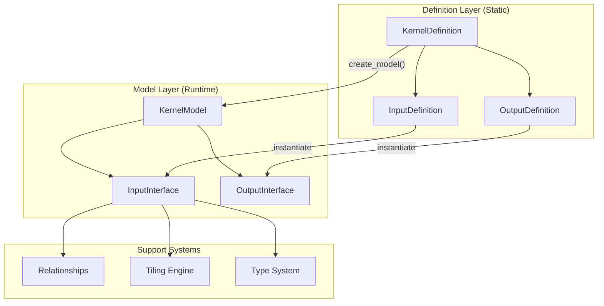
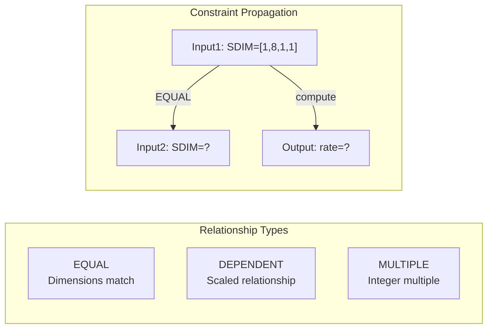
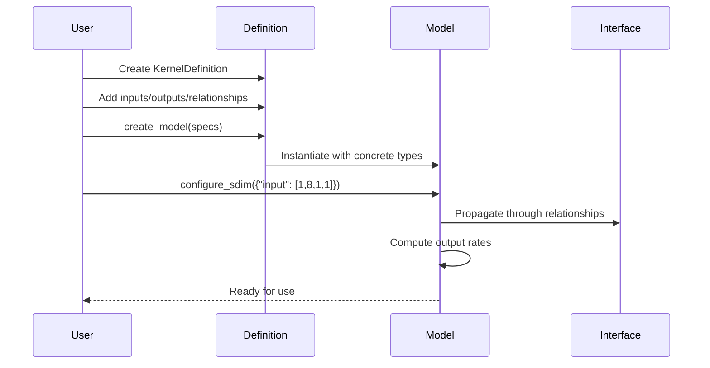
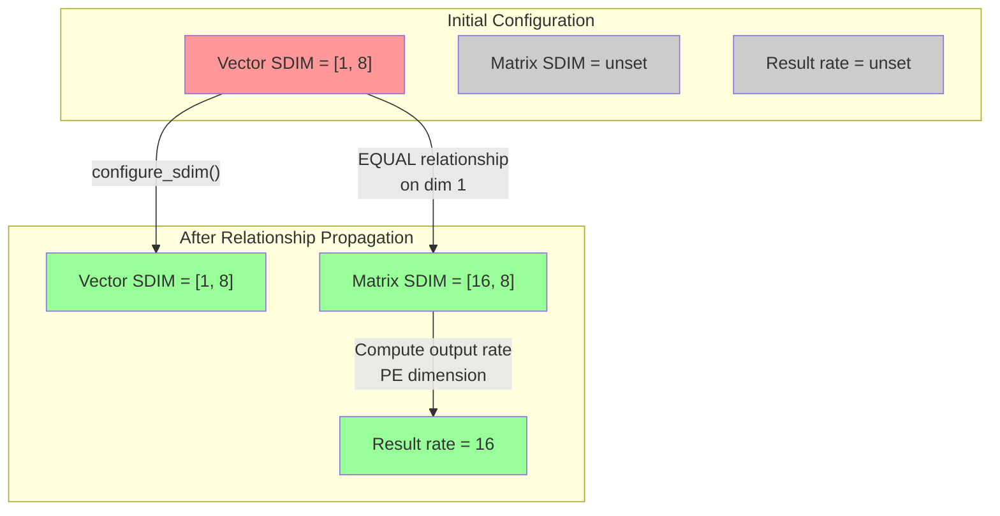

# Brainsmith Core Dataflow Modeling System


The Dataflow modeling system serves as the architectural foundation for representing hardware accelerator kernels on FPGAs. It bridges the semantic gap between high-level PyTorch neural networks and low-level RTL hardware descriptions through a type-safe abstraction layer implementing the SDIM (Streaming Dimensions) architecture.


## Hardware Kernels

### Generic Kernel Pattern


A Hardware Kernel (HW Kernel) is the hardware implementation of neural-network operators for use in dataflow-style FPGA accelerators. By feeding properly formatted RTL or HLS source code to Brainsmith’s HW Kernel Generator, key interfaces and variables will be parametrized and exposed to FINN, the backend HW compiler. 


The fundamental kernel abstraction supports N inputs producing M outputs, with behavior controlled by configuration parameters. This flexible pattern forms the basis for all specialized kernel implementations.


### Why Kernels?

Brainsmith chooses **kernels** as its fundamental abstraction because AI models naturally express computation in terms of layers and nodes—Softmax, LayerNorm, Linear, and other high-level operations. By preserving this kernel-level granularity, we maintain conceptual alignment with how ML practitioners think while enabling hardware engineers to implement each kernel in optimized RTL. This approach allows composition of complex accelerators using familiar PyTorch-style graph techniques while each kernel internally achieves maximum hardware efficiency through traditional RTL optimization. The Dataflow Model provides the framework for clean composition, predictable interfaces, and systematic construction of these optimized kernels into complete accelerator systems.

### Universal Kernel Support

A key advantage of this abstraction is its ability to handle **any arbitrary kernel**, making the system significantly more automatable than traditional approaches. Unlike frameworks that support only a fixed set of operations, Brainsmith's kernel modeling can:

- **Describe any computational pattern** through flexible interface definitions and relationships
- **Automate integration** of new kernels without modifying framework code
- **Generate bridge code** automatically through the AutoHWCustomOp pattern
- **Enable rapid innovation** by removing barriers between kernel implementation and system integration

This universality transforms hardware acceleration from a manual, operation-by-operation process to an automated flow where new kernels can be added simply by providing their RTL implementation and interface metadata.

## Core Design Philosophy

The system follows a **Definition/Model separation pattern** — a fundamental architectural choice that separates "what CAN be" (definitions/schemas) from "what IS" (models/instances). This separation enables a compiler IR for hardware accelerators where:

- **Definitions** act as reusable templates with constraints and validation rules
- **Models** represent concrete runtime instances with actual types and configurations
- **Relationships** enforce correctness at compile-time rather than runtime
- **Performance** is predictable through built-in modeling before synthesis

```
┌─────────────────────────┐         ┌─────────────────────────┐
│      DEFINITION         │         │         MODEL           │
│   "Schema & Rules"      │         │   "Runtime Instance"    │
├─────────────────────────┤         ├─────────────────────────┤
│ • Constraints           │ create  │ • Concrete types        │
│ • Relationships         │ ------> │ • Actual SDIM values    │
│ • Validation rules      │         │ • Computed metrics      │
│ • Tiling expressions    │         │ • Cached performance    │
└─────────────────────────┘         └─────────────────────────┘
```

## Data Hierarchy and Tiling System

### Motivation: Bridging ONNX Semantics to RTL Streaming

The data hierarchy bridges two fundamentally different computational paradigms:

**ONNX/ML World**: Multi-dimensional tensors with semantic meaning
- Dimensions have inherent meaning: batch, channel, height, width
- Operations understand and preserve these semantics
- Rich transformations: reshape, transpose, layout conversions
- Memory layouts matter (NCHW vs NHWC)

**RTL/Hardware World**: Pure streaming dataflow
- Data flows as bits through FIFOs
- No inherent dimensional awareness in hardware
- AXI-Stream: TDATA/TVALID/TREADY signals only
- Fixed-width processing per clock cycle

The tiling system addresses several critical challenges:

1. **Semantic Preservation**: Maintains ONNX's dimensional meaning while transforming to hardware streams. Named parameters ("CHANNELS", "SPATIAL_Y") and right-justified alignment ensure semantics flow through compilation.

2. **Memory Hierarchy Management**: FPGAs have limited on-chip memory but high bandwidth. Off-chip DRAM has large capacity but limited bandwidth (typically 10-20 GB/s). Tiling enables optimal use of both while preserving tensor structure.

3. **Deterministic Streaming**: FPGA accelerators achieve peak efficiency through continuous data streaming. The hierarchy provides compile-time known boundaries, eliminating runtime boundary detection.

4. **Dimension-Aware Parallelism**: Different hierarchy levels map to different parallelism opportunities — from coarse-grained block parallelism to fine-grained SDIM (Streaming Dimensions) control.

### The Four-Level Hierarchy

The system decomposes data into four hierarchical levels, each solving specific hardware mapping challenges:

```
┌────────────────────────────────────────────────────────────┐
│                           TENSOR                           │
│                    Full inference data                     │
│                    e.g., 512×256 matrix                    │
│  ┌─────────────────────────────────────────────────────┐   │
│  │                         BLOCK                       │   │
│  │                 Tile processed by kernel            │   │
│  │                    e.g., 64×32 tile                 │   │
│  │  ┌──────────────────────────────────────────────┐   │   │
│  │  │                    STREAM                    │   │   │
│  │  │             Data per clock cycle             │   │   │
│  │  │               e.g., 8×16 patch               │   │   │
│  │  │  ┌─┬─┬─┬─┬─┬─┬─┬─┬─┬─┬─┬─┬─┬─┬─┬─┬─┬─┐       │   │   │
│  │  │  │E│L│E│M│E│N│T│ │ │ │ │ │ │ │ │ │ │ │       │   │   │
│  │  │  │ │ │ │ │ │ │ │ │ │ │ │ │ │ │ │ │ │ │       │   │   │
│  │  │  │Individual data items (e.g., INT8) │       │   │   │
│  │  │  └─┴─┴─┴─┴─┴─┴─┴─┴─┴─┴─┴─┴─┴─┴─┴─┴─┴─┘       │   │   │
│  │  └──────────────────────────────────────────────┘   │   │
│  └─────────────────────────────────────────────────────┘   │
└────────────────────────────────────────────────────────────┘
```

#### Level 1: Tensor (Complete Data)
- **Purpose**: Represents complete computation (e.g., entire layer)
- **Storage**: Resides in off-chip DRAM
- **Challenge**: Too large for on-chip processing
- **Solution**: Decomposed into blocks that fit in BRAM

#### Level 2: Block (Working Set)
- **Purpose**: Data tile that fits in on-chip memory
- **Storage**: Buffered in BRAM/URAM
- **Size**: Typically 10s of KB to few MB
- **Trade-off**: Larger blocks = fewer DRAM accesses but more BRAM usage

#### Level 3: Stream (Pipeline Width)
- **Purpose**: Data processed per clock cycle
- **Transport**: Flows through AXI streams and datapaths
- **Width**: Matches hardware bus width (e.g., 512-bit AXI)
- **Parallelism**: Determines computational throughput

#### Level 4: Element (Atomic Unit)
- **Purpose**: Individual data items
- **Processing**: Maps to DSP slices or LUTs
- **Types**: INT8, FIXED16, etc. (via QONNX types)
- **Optimization**: Bit width affects resource usage

### Why This Hierarchy Works

1. **Natural Hardware Mapping**: Each level corresponds to a physical hardware resource with specific constraints

2. **Performance Predictability**: The hierarchy enables accurate performance modeling:
   ```
   Execution Time = (Tensor Size / Block Size) × Block Processing Time
   Block Processing Time = (Block Size / Stream Width) × Clock Period
   ```

3. **Design Space Flexibility**: Parameters at each level can be tuned independently:
   - Block size → Memory usage vs. external bandwidth
   - Stream width → Throughput vs. resource usage
   - Element type → Precision vs. area/power

4. **Composability**: Kernels with compatible block/stream interfaces can be chained efficiently

### Tiling Expression Language

The system uses intuitive list-based expressions to specify decomposition:

- `1` - Singleton dimension (size 1)
- `:` - Full dimension (no tiling)
- `32` - Literal tile size
- `"PARAM"` - Runtime parameter

Example: `[1, "CH_TILES", ":", ":"]` means singleton batch, parameterized channels, full height/width.

This expression language provides:
- **Clarity**: Explicit per-dimension tiling strategy
- **Flexibility**: Mix of fixed and parameterized tiling
- **Validation**: Type system ensures valid decompositions
- **Optimization**: Parameters can be tuned without code changes

### Semantic Bridge: From Tensors to Streams

The hierarchy implements a careful transformation that preserves ONNX semantics through hardware generation:

```
ONNX Tensor                     Streaming Hardware
[B,C,H,W] with semantics   →    AXI-Stream FIFO (just bits)
    ↓                                   ↑
Preserved via:                   Semantics implicit in:
- Named dimensions               - Compile-time configuration  
- Block alignment                - Deterministic iteration
- Tiling constraints            - Interface relationships
```

**Key Design Principle**: Semantic information doesn't flow through hardware — it's preserved in the compilation process that configures the hardware. This enables:
- Zero-overhead streaming (no runtime dimension tracking)
- Compile-time validation of all transformations
- Deterministic, high-performance execution

## SDIM (Streaming Dimensions) Architecture

SDIM replaces ambiguous scalar parallelism (iPar) with precise multi-dimensional streaming control:

```
Traditional iPar:           SDIM Approach:
┌─────────────────┐        ┌─────────────────────────────┐
│ iPar = 8        │        │ SDIM = [1, 8, 1, 1]        │
│ (Ambiguous!)    │  ───>  │ (Clear: 8 channels/cycle)   │
└─────────────────┘        └─────────────────────────────┘
```

## Component Architecture



## Key Architectural Differences

### Input vs Output Interfaces

The separation between InputInterface and OutputInterface enforces hardware reality in streaming dataflow:

```
┌─────────────────────────┐     ┌─────────────────────────┐
│    INPUT INTERFACE      │     │   OUTPUT INTERFACE      │
├─────────────────────────┤     ├─────────────────────────┤
│ • Configurable SDIM     │     │ • NO configurable SDIM  │
│ • User sets streaming   │     │ • Kernel sets rate      │
│ • configure_sdim()      │     │ • set_streaming_rate()  │
│ • Drives data flow      │     │ • Follows data flow     │
└─────────────────────────┘     └─────────────────────────┘
```

This distinction reflects hardware reality: you control how fast you consume data, but the rate at which you produce results is determined by your algorithm. Attempting to arbitrarily configure output rates would violate causality.

### The AutoHWCustomOp Bridge

The system seamlessly integrates with FINN through the AutoHWCustomOp pattern:

```python
class AutoHWCustomOp(HWCustomOp):
    """Bridge between KernelModel and FINN"""
    
    def __init__(self, onnx_node, kernel_definition):
        # KernelDefinition provides the schema
        self._kernel_def = kernel_definition
        # KernelModel created during shape inference
        self._kernel_model = None
    
    # All FINN methods delegate to KernelModel
    def get_folded_input_shape(self, ind=0):
        return self._kernel_model.get_folded_shape(...)
    
    def get_instream_width(self, ind=0):
        return self._kernel_model.get_stream_width(...)
```

This bridge enables:
- **Automatic method implementation** for all FINN requirements
- **Lazy initialization** during shape inference
- **Complete delegation** to KernelModel for calculations
- **Zero boilerplate** for kernel developers

## Relationship Constraint System

The system enforces interface compatibility through relationships:



## Usage Flow



## Design Benefits

1. **Immutability**: Definitions are reusable templates
2. **Type Safety**: Separate input/output classes prevent errors
3. **Hardware Mapping**: Direct correspondence to RTL interfaces
4. **Performance Aware**: Built-in metrics calculation
5. **Constraint Validation**: Automatic relationship enforcement

## Visual Architecture Overview

### Data Transformation Pipeline

The system transforms data through multiple levels, from high-level tensors to hardware-optimized streams:

#### Input Data Chunking


Input tensors are decomposed into blocks, then streamed with SDIM parallelism. For example, a 3D tensor (m×n×p) becomes:
- **Tensor Level**: Full m×n×p data structure
- **Block Level**: Sliced into manageable chunks (e.g., 1×n×p)
- **Stream Level**: Serialized with SDIM{i} parallel elements per cycle

#### Weight Data Chunking


Weight tensors maintain more structure during transformation, supporting multiple SDIM dimensions (SDIM{i} and SDIM{w}) for flexible parallelism.


## Concrete Example: Vector-Matrix Multiplication

A vector-matrix multiplication implementation demonstrates how SDIM dimensions work together:


### Kernel Definition

```python
# Define a vector-matrix multiplication kernel
vecmatmul_def = KernelDefinition(
    name="vector_matrix_multiply",
    
    # Input interfaces
    input_definitions=[
        InputDefinition(
            name="vector",
            datatype_constraints=[DatatypeConstraintGroup(["INT", "UINT"], 1, 8)],
            block_tiling=[1, "VEC_SIZE"],      # [batch=1, vector_length]
            stream_tiling=[1, "SIMD"]          # Stream SIMD elements per cycle
        ),
        InputDefinition(
            name="matrix",
            datatype_constraints=[DatatypeConstraintGroup(["INT", "UINT"], 1, 8)],
            block_tiling=["OUT_SIZE", "VEC_SIZE"],  # [output_dim, input_dim]
            stream_tiling=["PE", "SIMD"]            # PE×SIMD parallelism
        )
    ],
    
    # Output interface
    output_definitions=[
        OutputDefinition(
            name="result",
            datatype_constraints=[DatatypeConstraintGroup(["INT", "UINT"], 8, 32)],
            block_tiling=[1, "OUT_SIZE"]       # [batch=1, output_length]
        )
    ],
    
    # Dimension relationships
    relationships=[
        # Vector and matrix must share input dimension
        DimensionRelationship(
            interfaces=["vector", "matrix"],
            relationship_type=RelationType.EQUAL,
            dimension_indices={"vector": 1, "matrix": 1}  # VEC_SIZE dimensions
        ),
        # Matrix output dimension matches result
        DimensionRelationship(
            interfaces=["matrix", "result"],
            relationship_type=RelationType.EQUAL,
            dimension_indices={"matrix": 0, "result": 1}  # OUT_SIZE dimensions
        )
    ]
)
```

### SDIM Configuration and Propagation

```python
# Create model with concrete sizes
model = vecmatmul_def.create_model(
    type_specifications={
        "vector": DataType["INT8"],
        "matrix": DataType["INT8"],
        "result": DataType["INT32"]
    },
    shape_specifications={
        "vector": Shape([1, 512]),      # 512-element vector
        "matrix": Shape([128, 512])     # 128×512 matrix
    },
    parameter_values={
        "VEC_SIZE": 512,
        "OUT_SIZE": 128,
        "PE": 16,      # 16 processing elements
        "SIMD": 8      # 8-way SIMD per PE
    }
)

# Configure SDIM for vector input
model.configure_sdim({"vector": [1, 8]})  # Stream 8 elements per cycle
```

### SDIM Propagation Flow



### Hardware Mapping

The SDIM configuration directly maps to hardware resources:

```
┌─────────────────────────────────────────────────────────┐
│                  Vector Input FIFO                      │
│  SDIM = [1, 8] → 8 elements/cycle × 8 bits = 64 bits   │
├─────────────────────────────────────────────────────────┤
│                  Matrix Weight FIFO                     │
│  SDIM = [16, 8] → 128 elements/cycle × 8 bits = 1024   │
├─────────────────────────────────────────────────────────┤
│              Processing Element Array                   │
│  16 PEs × 8 SIMD = 128 multiply-accumulates/cycle      │
├─────────────────────────────────────────────────────────┤
│                   Output FIFO                           │
│  Rate = 16 results/cycle × 32 bits = 512 bits          │
└─────────────────────────────────────────────────────────┘
```

### Performance Analysis

```python
# Calculate streaming metrics
vector_bandwidth = model.inputs["vector"].streaming_bandwidth
# = 1 × 8 = 8 elements/cycle

matrix_bandwidth = model.inputs["matrix"].streaming_bandwidth  
# = 16 × 8 = 128 elements/cycle

# Initiation interval for processing one output vector
cycles_per_vector = 512 / 8  # 64 cycles to stream input
cycles_per_output = 128 / 16  # 8 cycles to produce all outputs

# Total cycles = max(input streaming, computation)
total_cycles = max(64, 8 * 64)  # 512 cycles

# At 250 MHz clock:
throughput_mbps = (512 * 8 + 128 * 32) * 250 / 512 / 8
# ≈ 2000 MB/s effective throughput
```

### Key Insights

1. **SDIM Propagation**: Setting vector SDIM to [1,8] automatically determines matrix SDIM as [16,8] through relationships
2. **Hardware Efficiency**: The 16×8 parallelism maps directly to DSP slice arrays
3. **FIFO Decoupling**: Input/output FIFOs enable kernels to operate at optimal rates
4. **Type Safety**: Separate input/output interfaces prevent configuration errors
5. **Performance Visibility**: Built-in metrics enable design space exploration

## Performance-Driven Design Flow

Traditional hardware design follows an iterative cycle: Design → Synthesize (hours) → Discover problems → Repeat. The kernel modeling system streamlines this through **built-in performance modeling**:

```python
# Before synthesis, explore design space
for pe in [4, 8, 16, 32]:
    for simd in [8, 16, 32]:
        model.configure_sdim({"input": [pe, simd]})
        metrics = model.calculate_performance_metrics(frequency_mhz=250)
        
        print(f"PE={pe}, SIMD={simd}:")
        print(f"  Throughput: {metrics['aggregate']['throughput_fps']} fps")
        print(f"  Bandwidth: {metrics['aggregate']['total_bandwidth_mbps']} MB/s")
        print(f"  Initiation Interval: {metrics['aggregate']['initiation_interval']} cycles")
```

This approach enables:
- **Rapid design space exploration** without synthesis
- **Early bottleneck detection** through bandwidth analysis
- **Resource estimation** before committing to implementation
- **System-level optimization** by balancing throughput across kernels

## Integration Architecture

The dataflow system creates a complete ecosystem for hardware acceleration:

```
┌─────────────────┐     ┌──────────────────┐     ┌─────────────────┐
│  PyTorch/ONNX   │────▶│ Kernel Modeling  │────▶│  FINN/RTL Gen   │
│   AI Models     │     │   Abstraction    │     │   Hardware      │
└─────────────────┘     └──────────────────┘     └─────────────────┘
         │                       │                         │
         │                       │                         │
    Preserves               Type Safety              Automatic
    Layer/Node             Performance              Integration
    Semantics              Validation               & Synthesis
```

Key integration points include:
- **PyTorch/ONNX**: Import models while preserving kernel boundaries
- **RTL Parser**: Extract interface metadata from existing RTL kernels
- **AutoHWCustomOp**: Automatic FINN integration without boilerplate
- **Code Generation**: Template-based generation of optimized implementations

## Conclusion

The Brainsmith Dataflow Modeling system represents a paradigm shift in hardware accelerator design. By introducing a kernel-centric abstraction that preserves semantic information while enabling hardware optimization, it delivers **correct-by-construction accelerators with predictable performance**.

The system's ability to handle arbitrary kernels, combined with its automated integration capabilities, transforms FPGA acceleration from a specialized, manual process to an automated, accessible flow. This approach, built on solid theoretical foundations and practical engineering, enables both hardware experts and ML practitioners to create efficient accelerators for next-generation AI workloads.