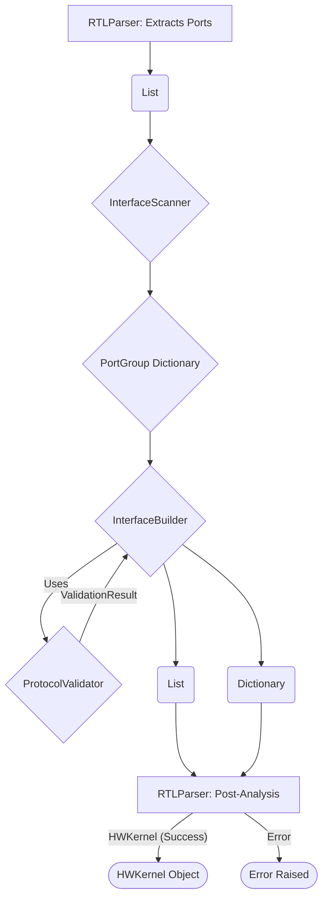

# RTL Parser Interface Analysis System

## Overview

This document describes the design and implementation of the interface analysis system integrated into the `RTLParser`. The primary goal of this system is to automatically identify, group, validate, and classify ports of a SystemVerilog module according to standard hardware interface protocols, specifically:

1.  **Global Control Signals:** Clock (`ap_clk`), reset (`ap_rst_n`), etc.
2.  **AXI4-Stream Interfaces:** Standard streaming data interfaces (`{name}_TDATA`, `{name}_TVALID`, etc.).
3.  **AXI4-Lite Interface:** A single control/configuration interface (typically prefixed with `config_`).

The system ensures that the parsed hardware kernel (`HWKernel`) adheres to specific interface requirements, such as having at least one AXI-Stream interface and no more than one AXI-Lite interface. It also flags any ports that do not belong to a recognized and valid interface.

## Components

The interface analysis system is composed of several key Python classes located in `brainsmith.tools.hw_kernel_gen.rtl_parser`:

1.  **`InterfaceScanner` (`interface_scanner.py`):**
    *   **Responsibility:** Examines the list of `Port` objects extracted from the RTL module and groups them based on naming conventions.
    *   **Logic:** Uses regular expressions and predefined signal name lists (`GLOBAL_SIGNALS`, `AXI_STREAM_SUFFIXES`, `AXI_LITE_SIGNALS`) to categorize ports into potential `PortGroup` objects.
    *   **Output:** A dictionary mapping potential interface names (e.g., "global", "config", "in0", "out1_v") to `PortGroup` objects.

2.  **`ProtocolValidator` (`protocol_validator.py`):**
    *   **Responsibility:** Validates individual `PortGroup` objects against the rules of their assigned `InterfaceType`.
    *   **Logic:**
        *   Checks for the presence of all required signals within a group.
        *   Verifies the `Direction` (Input/Output) of each port against the protocol specification.
        *   For AXI-Stream, it infers the stream direction (input/slave vs. output/master) based on standard naming conventions (`in*`, `s_*`, `*_s` for input; `out*`, `m_*`, `*_m` for output) to validate `TDATA`, `TVALID`, `TLAST`, and `TREADY` directions correctly.
    *   **Output:** A `ValidationResult` object for each `PortGroup`, indicating validity and providing error messages if applicable.

3.  **`InterfaceBuilder` (`interface_builder.py`):**
    *   **Responsibility:** Orchestrates the scanning and validation process.
    *   **Logic:**
        *   Instantiates `InterfaceScanner` and `ProtocolValidator`.
        *   Calls the scanner to get initial `PortGroup`s.
        *   Iterates through the groups, calling the validator for each.
        *   Collects successfully validated groups and transforms them into `Interface` objects.
        *   Tracks ports that belonged to groups that failed validation or were never assigned to any group.
    *   **Output:** A tuple containing:
        *   A dictionary of validated `Interface` objects, keyed by interface name.
        *   A list of `Port` objects that remain unassigned after the process.

4.  **Data Structures (`interface_types.py`, `data.py`):**
    *   **`Port` (`data.py`):** Represents a single module port with name, direction, and width.
    *   **`InterfaceType` (`interface_types.py`):** Enum defining the recognized interface types (GLOBAL_CONTROL, AXI_STREAM, AXI_LITE, UNASSIGNED).
    *   **`PortGroup` (`interface_types.py`):** A temporary container holding ports potentially belonging to a single interface *before* validation.
    *   **`ValidationResult` (`interface_types.py`):** Simple dataclass holding validation status (boolean `valid`) and an optional error `message`.
    *   **`Interface` (`interface_types.py`):** Represents a *validated* interface, containing its name, type, constituent ports, and the validation result.
    *   **`HWKernel` (`data.py`):** The main dataclass representing the parsed kernel. Updated to include:
        *   `interfaces: Dict[str, Interface]`: Stores the validated interfaces found.
        *   `unassigned_ports: List[Port]`: Stores ports not part of any valid interface.

## Logic Flow

1.  **Parsing:** The `RTLParser` (`parser.py`) first extracts all module ports into a list of `Port` objects.
2.  **Building:** An `InterfaceBuilder` instance is created.
3.  **Scanning & Validation:** The `builder.build_interfaces(ports)` method is called:
    *   The `InterfaceScanner` groups ports into `PortGroup`s based on names.
    *   The `InterfaceBuilder` iterates through these groups.
    *   For each group, the `ProtocolValidator` checks if it conforms to the rules of its potential `InterfaceType`.
    *   Valid groups are converted to `Interface` objects. Invalid groups are discarded, and their ports are added to the `unassigned_ports` list.
    *   Ports not initially grouped by the scanner are also added to `unassigned_ports`.
4.  **Storing Results:** The resulting `interfaces` dictionary and `unassigned_ports` list are stored in the `HWKernel` object.
5.  **Post-Analysis Validation (in `RTLParser`):** After `build_interfaces` returns, the `RTLParser` performs final checks:
    *   **Error on Unassigned:** If `unassigned_ports` is not empty, an error is raised, listing the unassigned ports. This enforces that all ports must belong to a valid, recognized interface.
    *   **Require AXI-Stream:** Checks if at least one `Interface` with `type == InterfaceType.AXI_STREAM` exists. Raises an error if none are found.
    *   **Allow Single AXI-Lite:** Checks if zero or one `Interface` with `type == InterfaceType.AXI_LITE` exists. Raises an error if more than one is found.

## Usage and Integration

The interface analysis is automatically performed within the `RTLParser.parse_file` method. Users of the `RTLParser` receive an `HWKernel` object where the `interfaces` attribute provides a structured view of the module's validated communication ports, and the `unassigned_ports` attribute (which should be empty if parsing was successful) indicates any issues.

## Error Handling

*   **Invalid Interface Structure:** If a group of ports resembles an interface (e.g., `in0_TDATA`, `in0_TVALID`) but fails validation (e.g., missing `in0_TREADY`, incorrect direction), the `ProtocolValidator` returns an invalid `ValidationResult`. The `InterfaceBuilder` catches this, and the ports belonging to that invalid group are added to the `unassigned_ports` list.
*   **Unassigned Ports:** If any port cannot be grouped by the `InterfaceScanner` or belongs to a group that failed validation, it ends up in `HWKernel.unassigned_ports`. The `RTLParser` raises an error if this list is non-empty after analysis.
*   **Interface Count Violations:** The `RTLParser` explicitly checks the counts of AXI-Stream (>= 1) and AXI-Lite (<= 1) interfaces after validation and raises errors if these constraints are violated.
