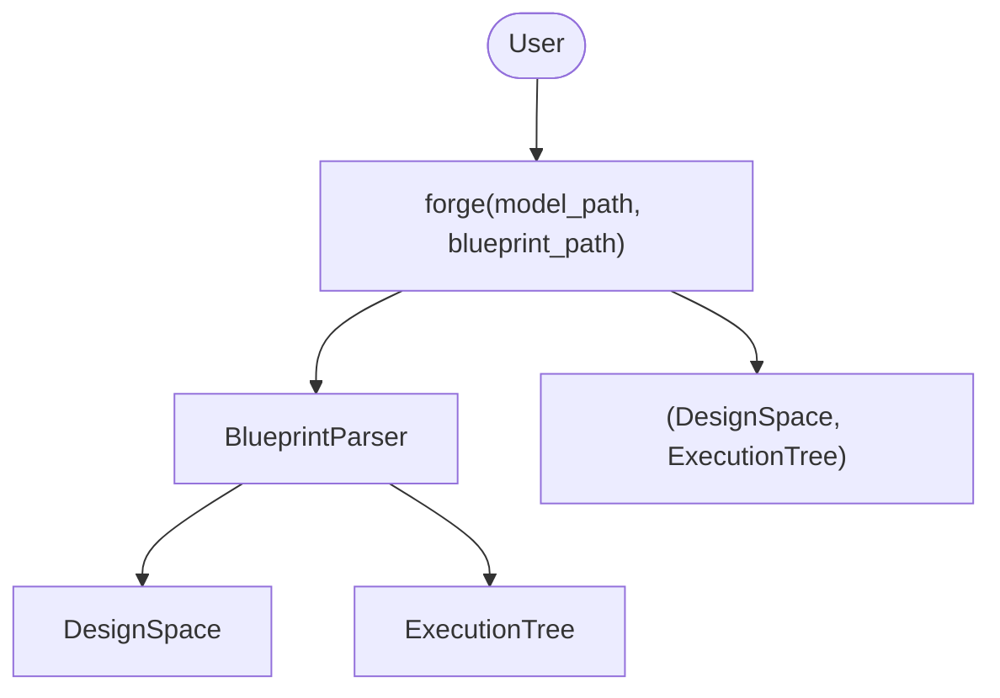
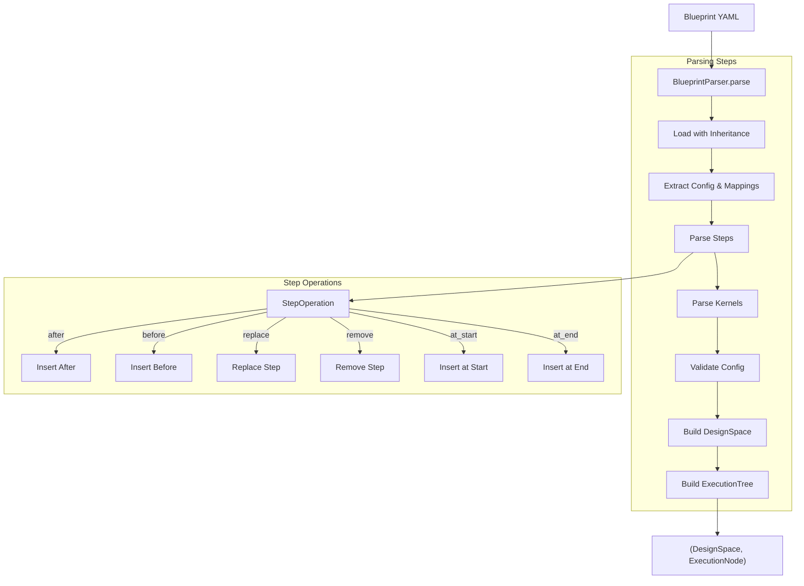
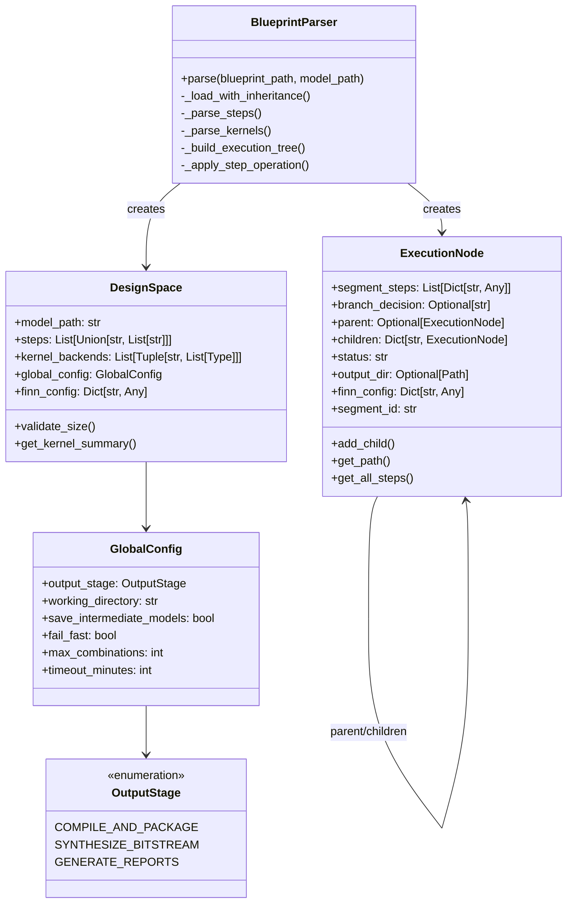
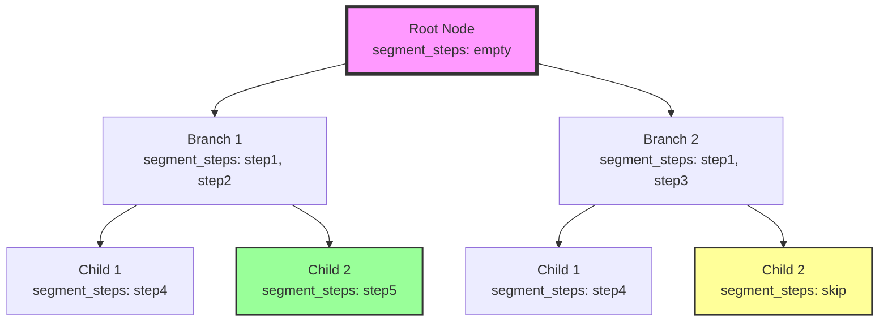
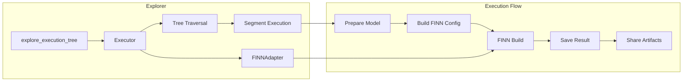
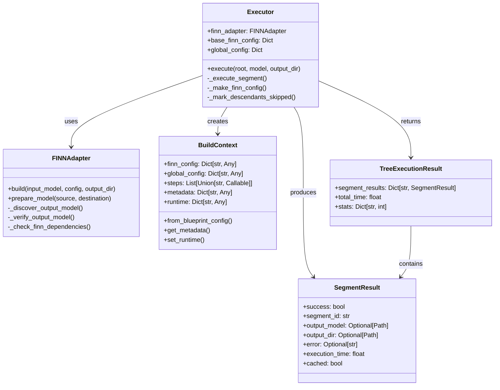
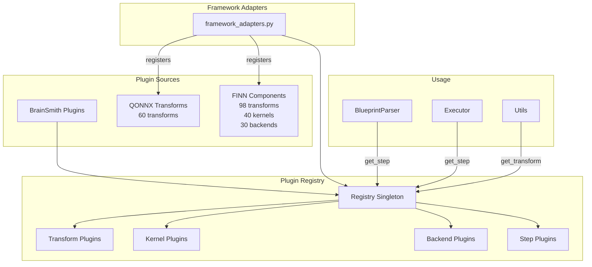
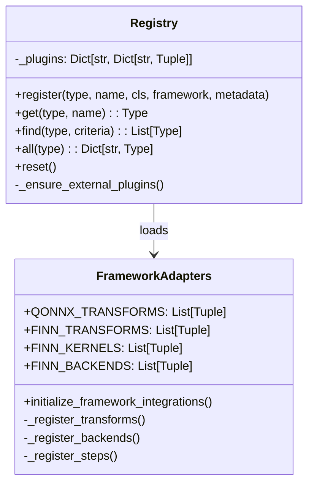
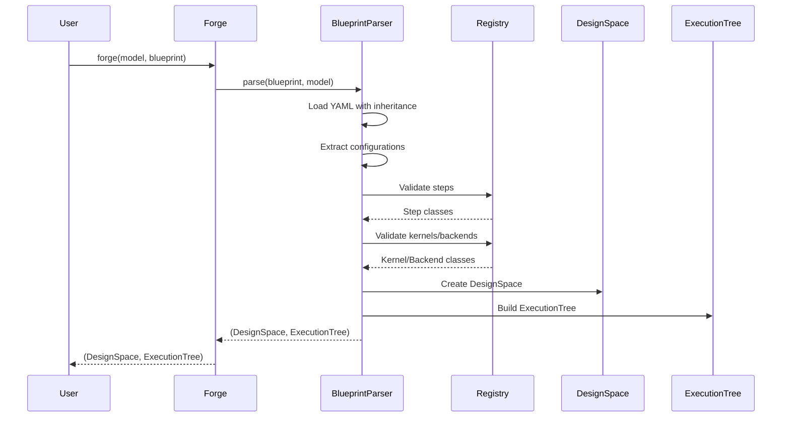
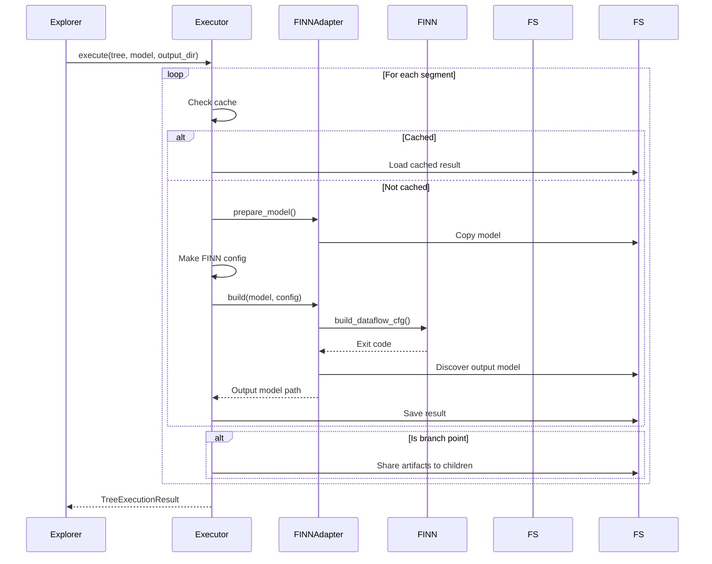

# BrainSmith Core Architecture

This document provides a detailed analysis of the BrainSmith core module architecture, showing how classes and parameters flow through the system.

## Overview

BrainSmith is a DSE (Design Space Exploration) framework for FPGA accelerator design. The core module implements a segment-based execution tree architecture that efficiently explores design spaces by sharing computation between similar design paths.

## Architecture Components

### 1. Entry Point: Forge API

The `forge` function is the main entry point that orchestrates the entire pipeline:

### 2. Blueprint Parsing Flow

The BlueprintParser handles YAML parsing, inheritance, and plugin resolution:

### 3. Core Data Structures

### 4. Execution Tree Structure

The execution tree represents the design space as a tree of segments:

### 5. Explorer Architecture

The explorer module executes the tree using FINN:

### 6. Explorer Classes Detail

### 7. Plugin System Architecture

The plugin system provides a registry for transforms, kernels, backends, and steps:

### 8. Plugin Registry Detail

## Data Flow Through the System

### 1. Blueprint to Execution Tree Flow

### 2. Tree Execution Flow

## Key Design Patterns

### 1. Segment-Based Execution
- Tree nodes represent execution segments between branch points
- Segments are executed as atomic FINN builds
- Results are cached and shared at branch points

### 2. Lazy Plugin Loading
- Plugins are registered on first access
- Framework adapters dynamically import external components
- Registry provides unified access to all plugin types

### 3. Configuration Flow
- Blueprint YAML → BlueprintParser → DesignSpace → ExecutionTree
- Global config flows through all components
- FINN config is built per-segment with inherited values

### 4. Error Handling
- Fail-fast mode stops on first error
- Non-fail-fast mode marks descendants as skipped
- ExecutionError provides context for debugging

## Performance Optimizations

1. **Prefix Sharing**: Common step sequences are executed once and shared
2. **Caching**: Completed segments are cached to disk
3. **Artifact Sharing**: Build outputs are copied to child segments at branch points
4. **Breadth-First Execution**: Enables parallel execution (future enhancement)

## Extension Points

1. **Custom Steps**: Register via `@step` decorator
2. **Custom Transforms**: Register via `@transform` decorator
3. **Custom Kernels**: Register via `@kernel` decorator with backends
4. **Custom Backends**: Register via `@backend` decorator with kernel reference

## Summary

The BrainSmith core architecture provides a clean separation of concerns:
- **Blueprint parsing** handles configuration and validation
- **Execution tree** represents the design space efficiently
- **Explorer** manages execution and result collection
- **Plugin system** provides extensibility
- **FINN adapter** isolates external dependencies

This design enables efficient design space exploration with minimal redundant computation.