# BrainSmith Forge Flow

This diagram shows the complete flow from the `forge` function through all major components, focusing on inputs and outputs.

```mermaid
flowchart TD
    %% Entry point
    User["forge(model_path: str, blueprint_path: str)"] --> Parser

    %% BlueprintParser
    Parser["BlueprintParser.parse(blueprint_path, model_path)"]
    Parser --> |"1. Load YAML"| LoadInheritance["_load_with_inheritance(blueprint_path)<br/>Returns: Dict[str, Any]"]
    
    LoadInheritance --> |"2. Extract config"| ExtractConfig["_extract_config_and_mappings(data)<br/>Returns: (GlobalConfig, finn_config: Dict)"]
    
    ExtractConfig --> |"3. Parse steps"| ParseSteps["_parse_steps(steps_data, parent_steps)<br/>Returns: List[Union[str, List[str]]]"]
    
    ParseSteps --> |"4. Parse kernels"| ParseKernels["_parse_kernels(kernels_data)<br/>Returns: List[Tuple[str, List[Type]]]"]
    
    ParseKernels --> |"5. Create DesignSpace"| CreateDS["DesignSpace(<br/>  model_path: str,<br/>  steps: List,<br/>  kernel_backends: List,<br/>  global_config: GlobalConfig,<br/>  finn_config: Dict<br/>)"]
    
    CreateDS --> |"6. Build tree"| BuildTree["_build_execution_tree(design_space)<br/>Returns: ExecutionNode"]
    
    BuildTree --> |"Returns"| ParserOutput["(DesignSpace, ExecutionNode)"]
    
    %% Forge continues
    ParserOutput --> ForgeReturn["forge returns:<br/>(DesignSpace, ExecutionNode)"]
    
    %% Explorer flow (when user calls explore)
    ForgeReturn -.-> |"User calls"| Explorer["explore_execution_tree(<br/>  tree: ExecutionNode,<br/>  model_path: Path,<br/>  output_dir: Path,<br/>  blueprint_config: Dict<br/>)"]
    
    Explorer --> |"Creates"| Executor["Executor(<br/>  finn_adapter: FINNAdapter,<br/>  finn_config: Dict,<br/>  global_config: Dict<br/>)"]
    
    Executor --> |"Calls"| Execute["executor.execute(<br/>  root: ExecutionNode,<br/>  initial_model: Path,<br/>  output_dir: Path<br/>)"]
    
    Execute --> |"For each segment"| ExecuteSegment["_execute_segment(<br/>  segment: ExecutionNode,<br/>  input_model: Path,<br/>  base_output_dir: Path<br/>)<br/>Returns: SegmentResult"]
    
    ExecuteSegment --> |"Uses"| FINNAdapter["finn_adapter.build(<br/>  input_model: Path,<br/>  config_dict: Dict,<br/>  output_dir: Path<br/>)<br/>Returns: Path (output model)"]
    
    FINNAdapter --> |"Calls"| FINN["FINN build_dataflow_cfg(<br/>  model: str,<br/>  config: DataflowBuildConfig<br/>)<br/>Returns: exit_code"]
    
    ExecuteSegment --> |"Returns"| SegmentResult["SegmentResult(<br/>  success: bool,<br/>  segment_id: str,<br/>  output_model: Path,<br/>  output_dir: Path,<br/>  execution_time: float<br/>)"]
    
    Execute --> |"Aggregates"| TreeResult["TreeExecutionResult(<br/>  segment_results: Dict[str, SegmentResult],<br/>  total_time: float<br/>)"]
    
    Explorer --> |"Returns"| TreeResult

    %% Styling
    style User fill:#e1f5fe,stroke:#01579b,stroke-width:3px
    style ForgeReturn fill:#c8e6c9,stroke:#1b5e20,stroke-width:3px
    style TreeResult fill:#c8e6c9,stroke:#1b5e20,stroke-width:3px
```

## Key Points

1. **forge()** is the entry point that creates a DesignSpace and ExecutionTree from a model and blueprint
2. **BlueprintParser** handles all parsing logic, including YAML inheritance and step operations
3. **DesignSpace** is the clean data structure holding the parsed configuration
4. **ExecutionNode** forms a tree structure representing the design space as segments
5. **explore_execution_tree()** executes the tree using the Explorer module
6. **Executor** manages the execution, creating FINN configs for each segment
7. **FINNAdapter** isolates FINN-specific operations and workarounds
8. Each segment produces a **SegmentResult**, aggregated into a **TreeExecutionResult**