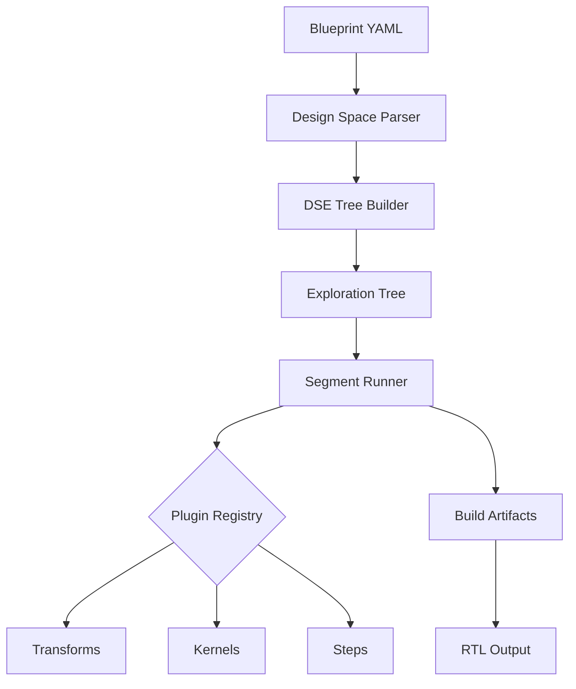
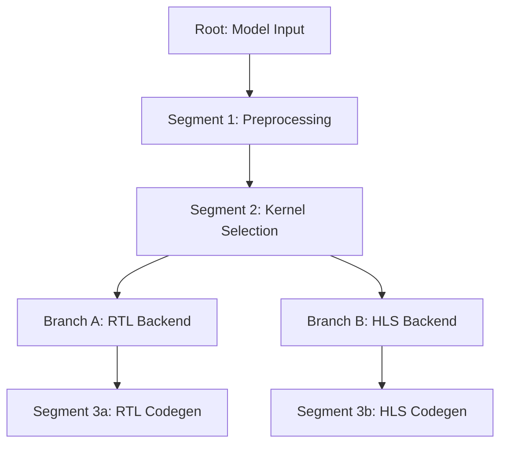
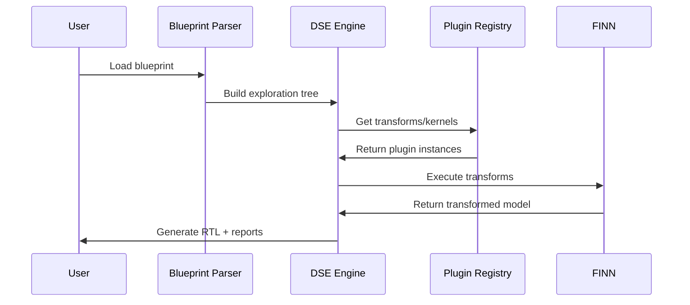
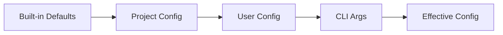

# Architecture Overview

Brainsmith's architecture is built around three core concepts: **Blueprints**, **Plugins**, and **Segment-based DSE**.

## High-Level Architecture



## Core Components

### 1. Blueprint System

Blueprints define design spaces in YAML:

```yaml
name: "My Accelerator"
design_space:
  kernels:
    - MatMul
    - Conv2d
  steps:
    - cleanup
    - qonnx_to_finn
    - step_create_dataflow_partition
```

**Key Features:**

- Inheritance support (`extends: base.yaml`)
- Dynamic step operations (insert, replace, remove)
- Parameter sweeps for exploration

**Location:** `brainsmith/core/design/`

### 2. Plugin Registry

A singleton registry manages all extensible components:

```python
from brainsmith.core.plugins import transform, kernel, step

@transform(name="MyTransform")
class MyTransform:
    def apply(self, model):
        # Transform logic
        pass

@kernel(name="MyKernel")
class MyKernel:
    # Kernel implementation
    pass
```

**Plugin Types:**

- **Transforms** - Graph transformations
- **Kernels** - Hardware operator implementations
- **Backends** - RTL/HLS implementations per kernel
- **Steps** - Build pipeline operations

**Location:** `brainsmith/core/plugins/registry.py`

### 3. Segment-Based DSE

The exploration tree is divided into segments for efficient computation reuse:



**Benefits:**

- Only changed segments re-execute
- Shared artifacts cached across branches
- Parallelizable execution (planned)

**Location:** `brainsmith/core/dse/`

## Compilation Pipeline

The standard dataflow compilation follows this pipeline:



### Pipeline Stages

1. **ONNX → QONNX** - Add quantization metadata
2. **QONNX → FINN** - Create dataflow partition
3. **Kernel Inference** - Replace ops with hardware kernels
4. **Specialization** - Configure kernel parameters
5. **Folding** - Apply parallelization strategy
6. **Bit Width Minimization** - Optimize data types
7. **Hardware Codegen** - Generate RTL/HLS
8. **IP Generation** - Create Vivado IP blocks
9. **FIFO Sizing** - Determine buffer depths
10. **Stitched IP** - Connect kernels with AXI stream
11. **RTL Simulation** - Verify correctness

## Configuration System

Pydantic-based configuration with layered overrides:



**Priority Order:**

1. CLI arguments / environment vars (highest)
2. Explicit `--config` file
3. `~/.brainsmith/config.yaml` (user)
4. `.brainsmith/config.yaml` (project)
5. Built-in defaults (lowest)

**Location:** `brainsmith/config/`

## Two-CLI Design

### `brainsmith` CLI

Application-level commands:

- `config init/show/export` - Configuration management
- `setup all` - Dependency installation
- `smith ...` - Proxy to smith CLI

### `smith` CLI

Operational commands:

- `dse model.onnx blueprint.yaml` - Run DSE
- `kernel file.sv` - Generate kernel from RTL

**Location:** `brainsmith/interface/cli.py`

## Key Patterns

### Decorator-Based Registration

```python
@transform(name="CustomTransform", framework="brainsmith")
class CustomTransform(Transformation):
    pass
```

### Framework Integration

External transforms from FINN/QONNX are wrapped:

```python
# Automatically wrapped
get_transform("finn:Streamline")  # FINN transform
get_transform("qonnx:InferShapes")  # QONNX transform
```

### Lazy Plugin Loading

Plugins are discovered on first access:

```python
# First call triggers discovery
transform_cls = get_transform("MyTransform")
```

## Next Steps

- [Plugin System](plugin-system.md) - Deep dive into plugins
