# Brainsmith Architecture Diagrams

## 1. High-Level Three-Phase Pipeline

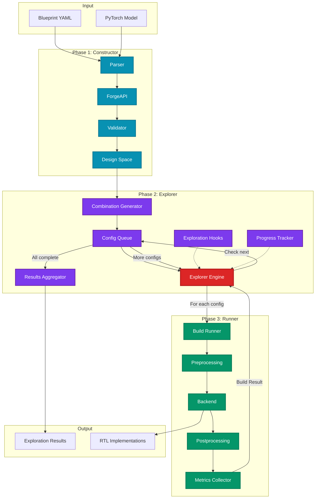

## 2. Plugin System Architecture

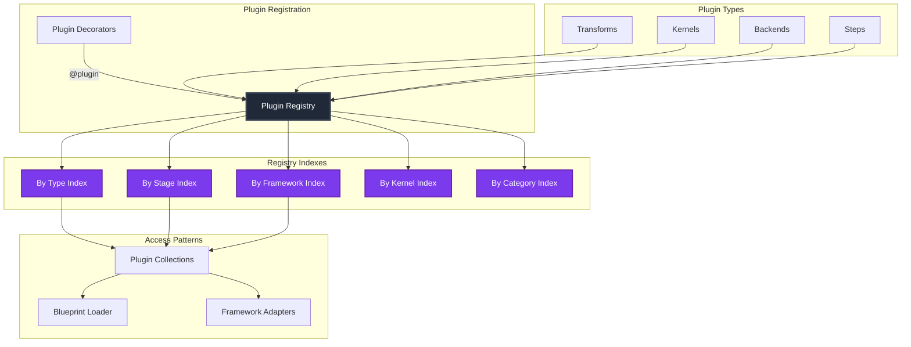

## 3. Phase 1 Data Flow

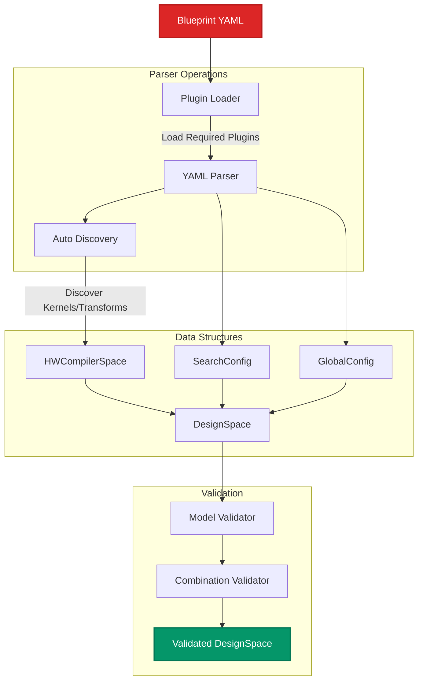

## 4. Phase 2 Exploration Strategy

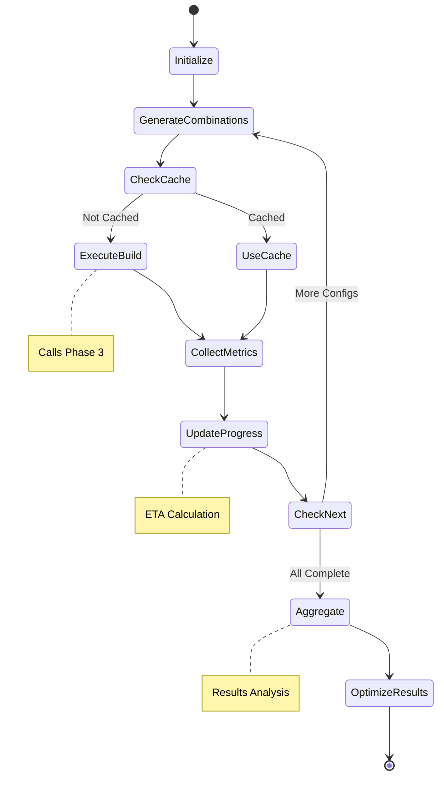

## 5. Phase 3 Build Pipeline

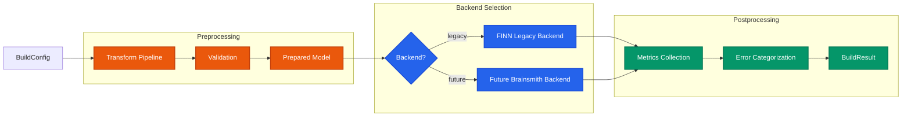

## 6. Transform Stage Organization

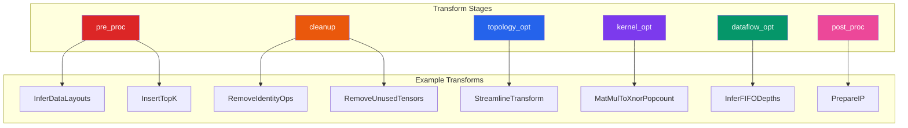

## 7. Configuration Hierarchy

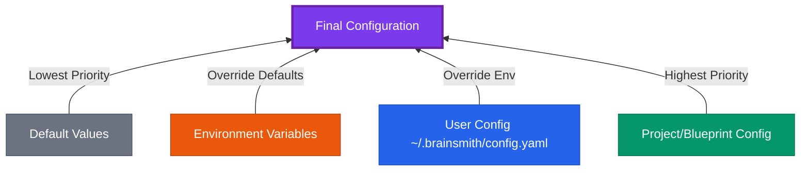

## 8. Exploration Hooks System

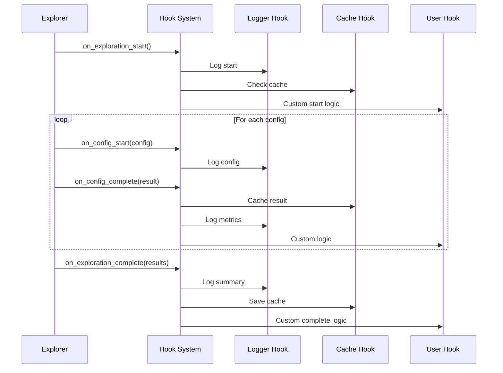

## 9. Plugin Discovery Flow

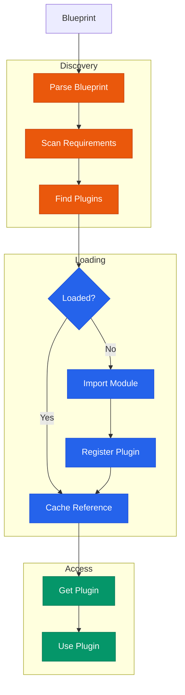

## 10. Error Handling Architecture

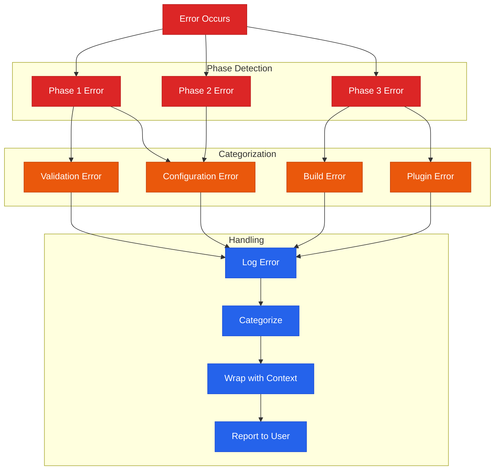

## 11. Framework Integration

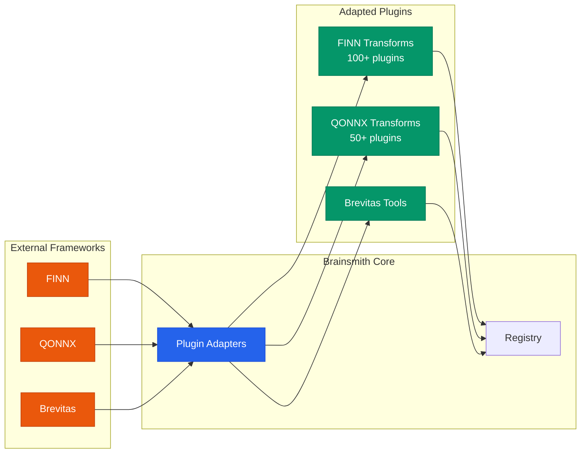

## 12. Build Metrics Collection

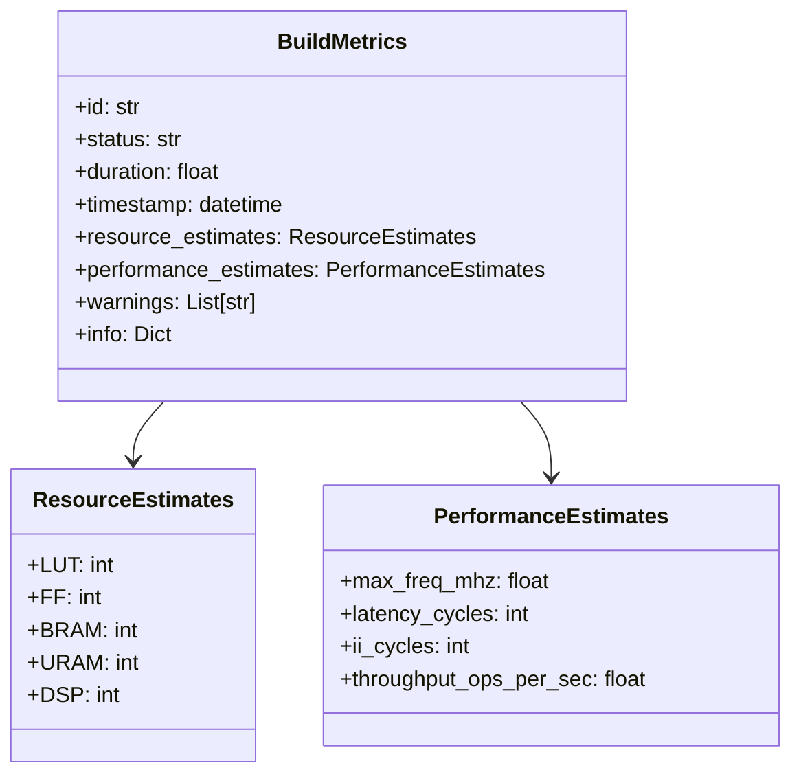

## 13. Combined Phase 2 and 3 Execution Flow

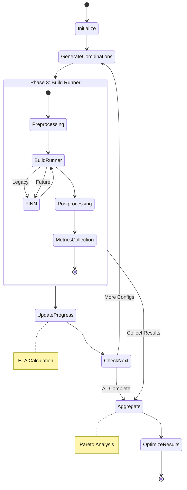

## 14. State Diagram Node Types Reference

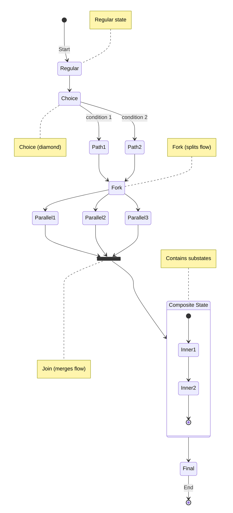

## Summary

These diagrams visualize the key architectural components of Brainsmith:

1. **Three-Phase Pipeline**: The core DSE workflow
2. **Plugin System**: Zero-discovery registration with rich metadata
3. **Data Flow**: How information moves through each phase
4. **State Machines**: Exploration process states
5. **Transform Stages**: Logical grouping of transformations
6. **Configuration**: Priority-based configuration resolution
7. **Hooks**: Extension points for customization
8. **Error Handling**: Comprehensive error categorization
9. **Framework Integration**: Clean external framework adaptation

Each diagram follows Mermaid best practices with accessibility titles, clear labeling, and appropriate diagram types for the concepts being illustrated.