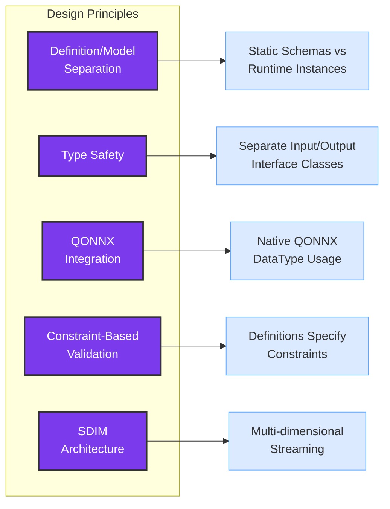
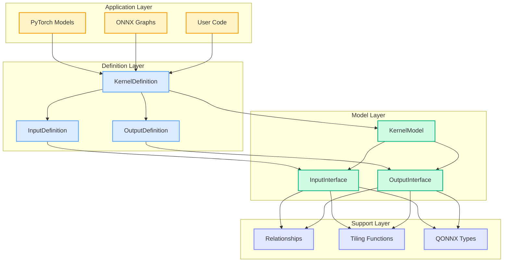
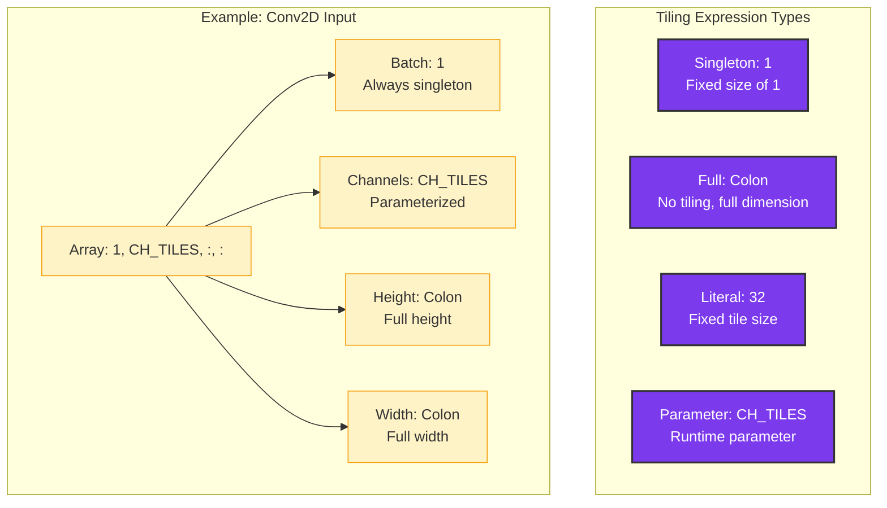
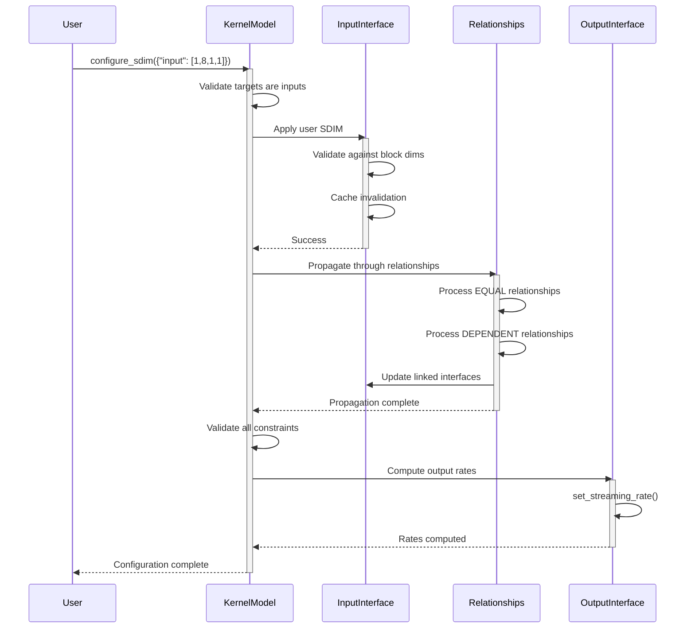
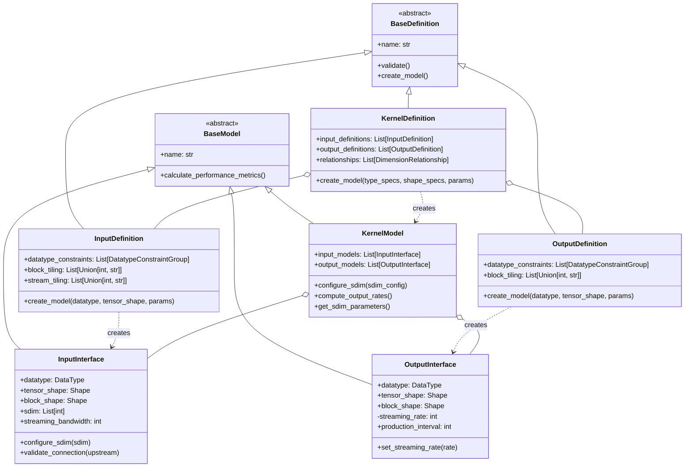
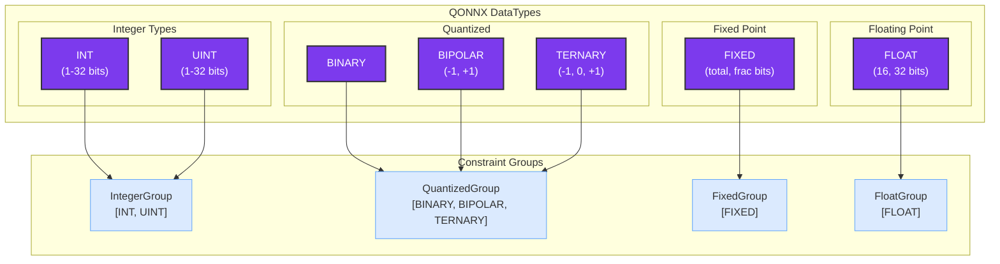
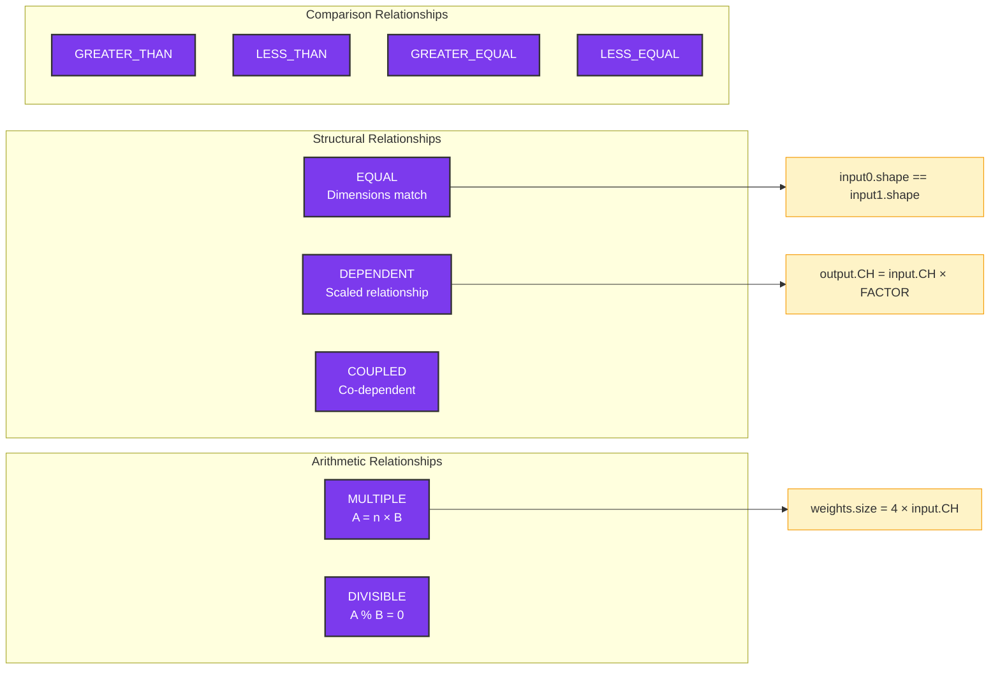
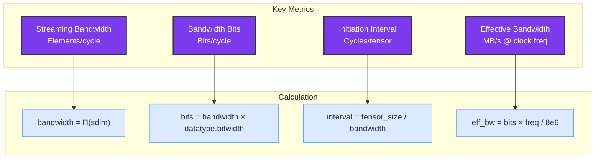

# Brainsmith Core Dataflow Architecture Guide

## Overview

The Brainsmith dataflow module provides a sophisticated abstraction layer for representing hardware accelerator kernels on FPGAs. It bridges high-level PyTorch neural networks to low-level RTL hardware descriptions through a clean, type-safe API implementing the SDIM (Streaming Dimensions) architecture.

## Table of Contents

1. [Core Concepts](#core-concepts)
2. [Architecture Layers](#architecture-layers)
3. [Data Hierarchy and Tiling](#data-hierarchy-and-tiling)
4. [SDIM System](#sdim-system)
5. [Component Architecture](#component-architecture)
6. [Type System](#type-system)
7. [Relationships and Constraints](#relationships-and-constraints)
8. [Usage Patterns](#usage-patterns)
9. [Performance Considerations](#performance-considerations)

## Core Concepts

### Design Philosophy

The dataflow module follows five key design principles:



### Definition vs Model Pattern

The system maintains a clear separation between "what CAN be" (definitions) and "what IS" (models):

```
┌─────────────────────────────────────┐     ┌─────────────────────────────────────┐
│          DEFINITION                 │     │             MODEL                   │
│  "What CAN be" - Schema & Rules    │     │   "What IS" - Runtime Instance      │
├─────────────────────────────────────┤     ├─────────────────────────────────────┤
│  • Constraints and validation       │     │  • Concrete types                   │
│  • Allowed datatype groups          │     │  • Actual SDIM values               │
│  • Tiling expressions               │     │  • Performance metrics              │
│  • Relationships                    │     │  • Cached calculations              │
│                                     │     │                                     │
│  validate() ─────────┐             │     │  calculate_performance_metrics()    │
│                      ▼             │     │                                     │
│  create_model() ─────┼─────────────┼────►│  configure_sdim()                   │
│                      │             │     │                                     │
└─────────────────────────────────────┘     └─────────────────────────────────────┘
```

## Architecture Layers

The dataflow module implements a layered architecture for clean separation of concerns:



## Data Hierarchy and Tiling

The system decomposes data into four hierarchical levels, each mapping to specific hardware concepts:

```
┌────────────────────────────────────────────────────────────┐
│                           TENSOR                           │
│                    Full inference data                     │
│                    e.g., 512×256 matrix                    │
│  ┌─────────────────────────────────────────────────────┐   │
│  │                         BLOCK                       │   │
│  │                 Tile processed by kernel            │   │
│  │                    e.g., 64×32 tile                 │   │
│  │  ┌──────────────────────────────────────────────┐   │   │
│  │  │                    STREAM                    │   │   │
│  │  │             Data per clock cycle             │   │   │
│  │  │               e.g., 8×16 patch               │   │   │
│  │  │  ┌─┬─┬─┬─┬─┬─┬─┬─┬─┬─┬─┬─┬─┬─┬─┬─┬─┬─┐       │   │   │
│  │  │  │E│L│E│M│E│N│T│ │ │ │ │ │ │ │ │ │ │ │       │   │   │
│  │  │  │ │ │ │ │ │ │ │ │ │ │ │ │ │ │ │ │ │ │       │   │   │
│  │  │  │Individual data items (e.g., INT8) │       │   │   │
│  │  │  └─┴─┴─┴─┴─┴─┴─┴─┴─┴─┴─┴─┴─┴─┴─┴─┴─┴─┘       │   │   │
│  │  └──────────────────────────────────────────────┘   │   │
│  └─────────────────────────────────────────────────────┘   │
└────────────────────────────────────────────────────────────┘
```

### Tiling Expression System

Tiling uses intuitive list-based expressions to specify how tensors decompose:



## SDIM System

SDIM (Streaming Dimensions) replaces ambiguous parallelism parameters with precise multi-dimensional control:

```
                        Traditional Approach
    ┌─────────────────────────────────────────────────────┐
    │  iPar = 8  (What does this mean? Channels? Width?) │
    │  Ambiguous, kernel-specific interpretation          │
    └─────────────────────────────────────────────────────┘
                               ▼
                         SDIM Approach
    ┌─────────────────────────────────────────────────────┐
    │  SDIM = [1, 8, 1, 1]  (Clear: 8 channels/cycle)    │
    │  Precise control over each dimension                 │
    └─────────────────────────────────────────────────────┘

    Example: Matrix-Vector Unit Processing
    ┌────────────────────────────────────────┐
    │  Tensor Shape: [1, 256, 14, 14]        │
    │  Block Shape:  [1, 64, 14, 14]         │
    │  SDIM:         [1, 8, 1, 1]            │
    │                                        │
    │  Result: Process 8 channels per cycle  │
    │  Cycles per block: 64/8 = 8            │
    └────────────────────────────────────────┘
```

### SDIM Configuration Flow



## Component Architecture

### Class Hierarchy



### Interface Differences

Key architectural difference between input and output interfaces:

```
┌─────────────────────────┐     ┌─────────────────────────┐
│    INPUT INTERFACE      │     │   OUTPUT INTERFACE      │
├─────────────────────────┤     ├─────────────────────────┤
│ • Configurable SDIM     │     │ • NO configurable SDIM  │
│ • User sets streaming   │     │ • Kernel sets rate      │
│ • configure_sdim()      │     │ • set_streaming_rate()  │
│ • Drives data flow      │     │ • Follows data flow     │
└─────────────────────────┘     └─────────────────────────┘
          │                               ▲
          │      Data Flow Direction      │
          └───────────────────────────────┘
```

## Type System

### QONNX Integration

The system uses QONNX's DataType exclusively for hardware-software consistency:



### Shape Types

```python
# Regular shape - all dimensions known
shape = Shape([1, 256, 14, 14])

# Ragged shape - CSDF phases with different sizes
ragged = RaggedShape([
    [1, 256, 14, 14],  # Phase 0
    [1, 256, 14, 12],  # Phase 1 (different width)
    [1, 256, 14, 14],  # Phase 2
])

# Shape expressions in tiling
block_tiling = [1, "CH_TILES", ":", ":"]  # Parameterized tiling
stream_tiling = [1, "SIMD", 1, 1]         # Stream subdivision
```

## Relationships and Constraints

### Relationship Types



### Constraint Propagation

```
    Initial Configuration              After Propagation
┌──────────────────────┐         ┌──────────────────────┐
│ input0: SDIM=[1,8,1,1]│         │ input0: SDIM=[1,8,1,1]│
│ input1: SDIM=unset   │   ───►  │ input1: SDIM=[1,8,1,1]│ (EQUAL)
│ input2: SDIM=unset   │         │ input2: SDIM=[1,4,1,1]│ (DEPENDENT/2)
│ output: rate=unset   │         │ output: rate=8       │ (computed)
└──────────────────────┘         └──────────────────────┘
```

## Usage Patterns

### Basic Kernel Definition

```python
# Define a simple element-wise operation kernel
kernel_def = KernelDefinition(
    name="elementwise_add",
    input_definitions=[
        InputDefinition(
            name="input0",
            datatype_constraints=[DatatypeConstraintGroup(["INT", "UINT"], 1, 32)],
            block_tiling=[1, ":", ":", ":"],  # Process full tensor
            stream_tiling=[1, "PE", 1, 1]     # PE parallel elements
        ),
        InputDefinition(
            name="input1",
            datatype_constraints=[DatatypeConstraintGroup(["INT", "UINT"], 1, 32)],
            block_tiling=[1, ":", ":", ":"],
            stream_tiling=[1, "PE", 1, 1]
        )
    ],
    output_definitions=[
        OutputDefinition(
            name="output",
            datatype_constraints=[DatatypeConstraintGroup(["INT", "UINT"], 1, 32)],
            block_tiling=[1, ":", ":", ":"]
        )
    ],
    relationships=[
        DimensionRelationship(
            interfaces=["input0", "input1"],
            relationship_type=RelationType.EQUAL
        ),
        DimensionRelationship(
            interfaces=["input0", "output"],
            relationship_type=RelationType.EQUAL
        )
    ]
)

# Create model with concrete types
model = kernel_def.create_model(
    type_specifications={
        "input0": DataType["UINT8"],
        "input1": DataType["UINT8"],
        "output": DataType["UINT8"]
    },
    shape_specifications={
        "input0": Shape([1, 256, 14, 14]),
        "input1": Shape([1, 256, 14, 14])
    },
    parameter_values={"PE": 8}
)

# Configure streaming
model.configure_sdim({"input0": [1, 8, 1, 1]})  # Process 8 channels/cycle
# input1 automatically gets [1, 8, 1, 1] due to EQUAL relationship
# output streaming rate automatically computed as 8
```

### Matrix Multiplication Kernel

```python
# More complex example with dependent relationships
matmul_def = KernelDefinition(
    name="matmul",
    input_definitions=[
        InputDefinition(
            name="activation",
            datatype_constraints=[DatatypeConstraintGroup(["INT", "UINT"], 1, 8)],
            block_tiling=[1, "TILE_K"],
            stream_tiling=[1, "SIMD"]
        ),
        InputDefinition(
            name="weights",
            datatype_constraints=[DatatypeConstraintGroup(["INT", "UINT"], 1, 8)],
            block_tiling=["TILE_M", "TILE_K"],
            stream_tiling=["PE", "SIMD"]
        )
    ],
    output_definitions=[
        OutputDefinition(
            name="output",
            datatype_constraints=[DatatypeConstraintGroup(["INT", "UINT"], 8, 32)],
            block_tiling=[1, "TILE_M"]
        )
    ],
    relationships=[
        DimensionRelationship(
            interfaces=["activation", "weights"],
            relationship_type=RelationType.DEPENDENT,
            dimension_indices={"activation": 1, "weights": 1},  # K dimensions
            parameters={"factor": 1}  # Must match
        ),
        DimensionRelationship(
            interfaces=["weights", "output"],
            relationship_type=RelationType.DEPENDENT,
            dimension_indices={"weights": 0, "output": 1},  # M dimensions
            parameters={"factor": 1}
        )
    ],
    parameters={
        "TILE_M": Parameter(default=64),
        "TILE_K": Parameter(default=64),
        "PE": Parameter(default=16),
        "SIMD": Parameter(default=8)
    }
)
```

### SDIM Parameter Discovery

```python
# The system can analyze which interfaces need configuration
sdim_params = model.get_sdim_parameters()
# Returns: {
#   "free": ["activation"],        # User must configure
#   "constrained": ["weights"],    # Will be set by relationships
#   "hidden": []                   # Not visible (internal use)
# }
```

## Performance Considerations

### Performance Metrics



### Optimization Strategies

1. **SDIM Tuning**: Balance parallelism across dimensions
2. **Block Sizing**: Match BRAM/URAM capacities
3. **Stream Width**: Align with AXI bus widths (typically 512/1024 bits)
4. **Pipeline Depth**: Consider initiation interval vs latency trade-offs

### Caching Architecture

```
┌─────────────────────────────────────────────┐
│            InputInterface                   │
├─────────────────────────────────────────────┤
│ _cached_metrics: Dict[str, Any]            │
│                                             │
│ Key Operations:                             │
│ • configure_sdim() → invalidate cache      │
│ • streaming_bandwidth → check cache first   │
│ • Lazy evaluation of expensive metrics      │
└─────────────────────────────────────────────┘
```

## Best Practices

### 1. Start with Definitions
Always design your kernel interfaces as definitions first. This enforces thinking about constraints and relationships upfront.

### 2. Use Type Groups
Prefer constraint groups over specific types in definitions:
```python
# Good: Flexible
DatatypeConstraintGroup(["INT", "UINT"], 1, 32)

# Less flexible: Fixed type
# Only use when algorithm requires specific type
```

### 3. Explicit Relationships
Document all interface dependencies through relationships. This enables automatic validation and configuration.

### 4. Parameter Naming
Use semantic parameter names that indicate their purpose:
- `PE`: Processing elements
- `SIMD`: SIMD lanes  
- `CH_TILES`: Channel tiling factor
- `TILE_M`, `TILE_K`: Matrix dimensions

### 5. Validate Early
Call `validate()` on definitions before creating models to catch errors early in the design process.

## Integration with Brainsmith

The dataflow module serves as the foundation for:

1. **RTL Parser**: Extracts metadata to create KernelDefinitions
2. **FINN Integration**: Maps to HWCustomOp through AutoHWCustomOp base class
3. **Code Generation**: Templates use definitions to generate implementation code
4. **Optimization**: Performance models guide design space exploration

This architecture enables Brainsmith to automatically generate optimized FPGA accelerators while maintaining a clean separation between algorithmic intent and hardware implementation details.