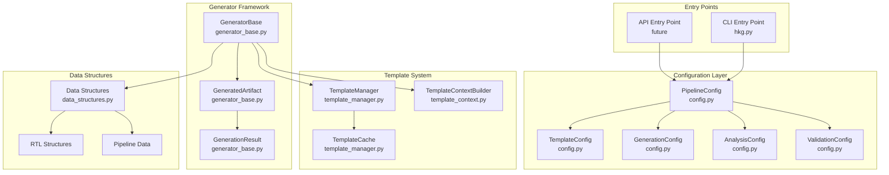
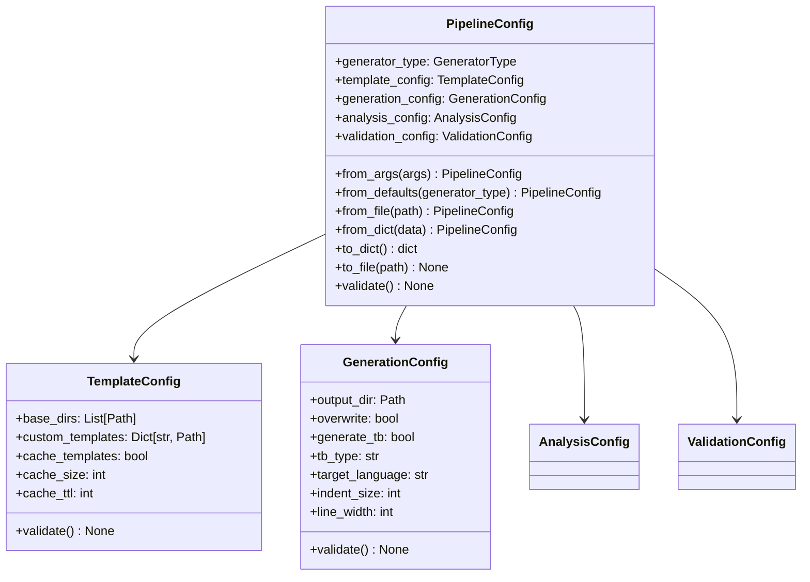
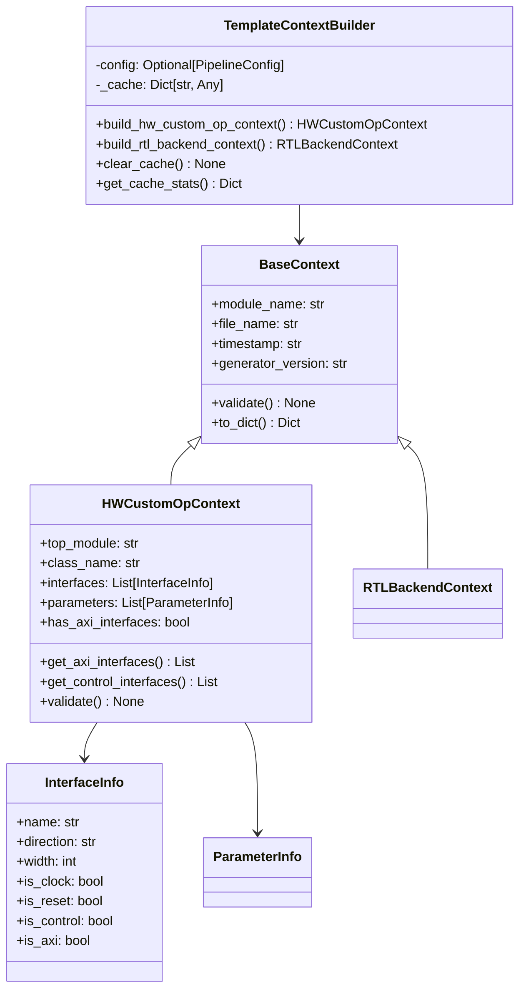
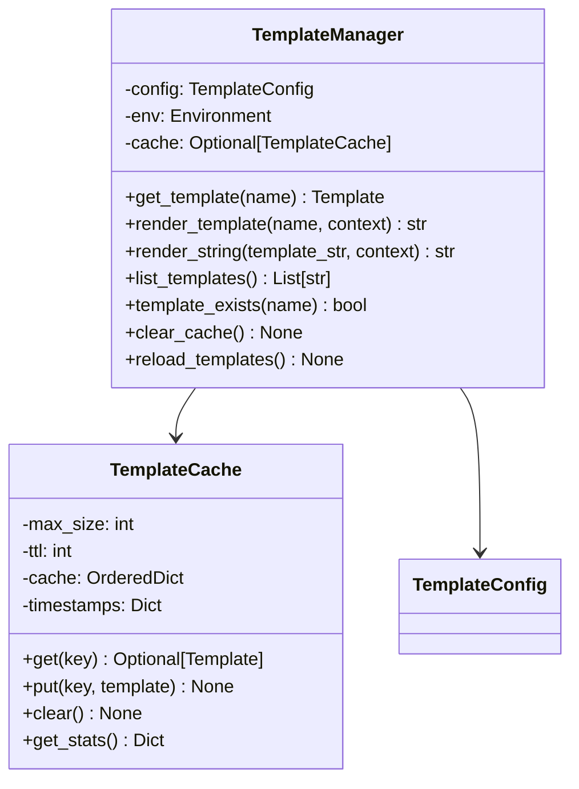
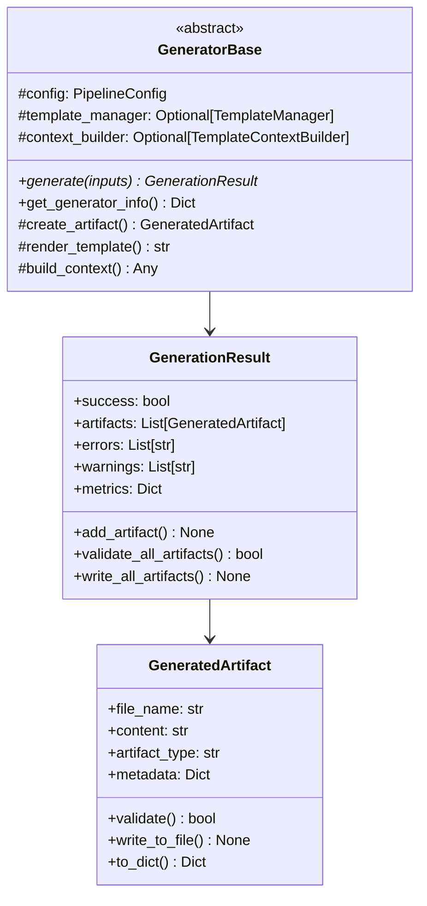
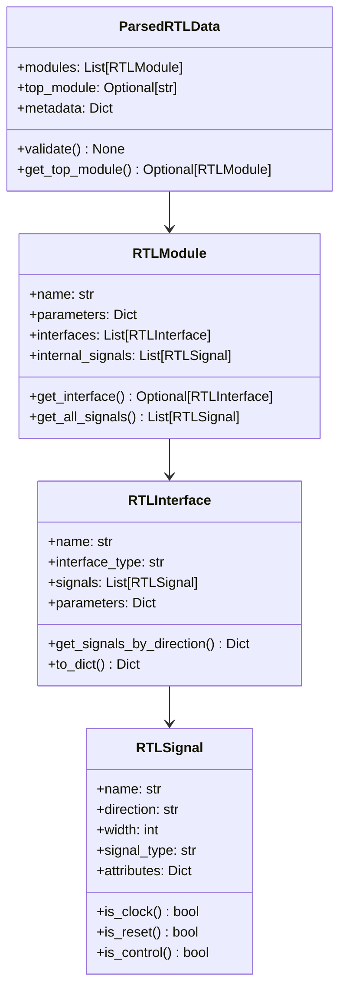
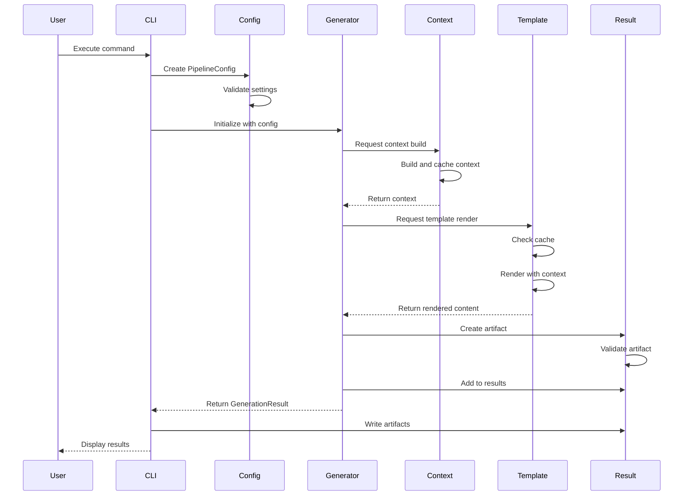
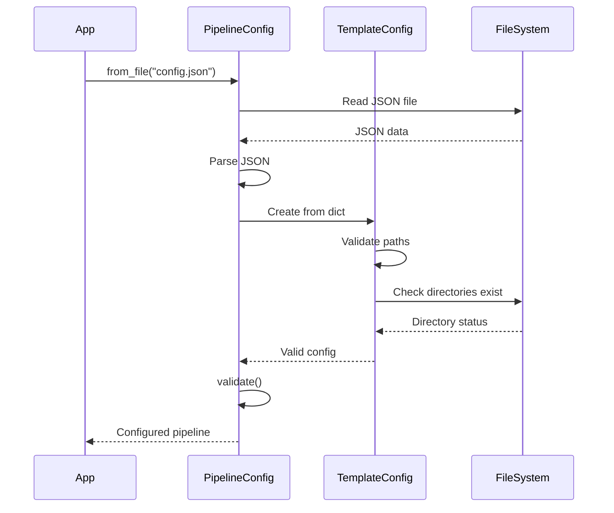
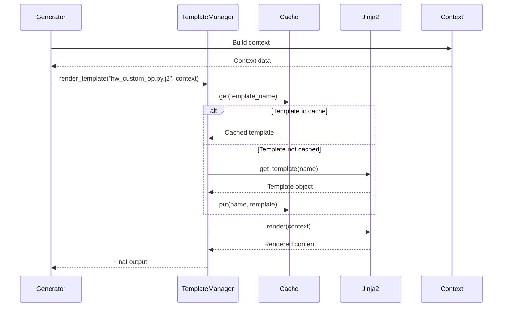
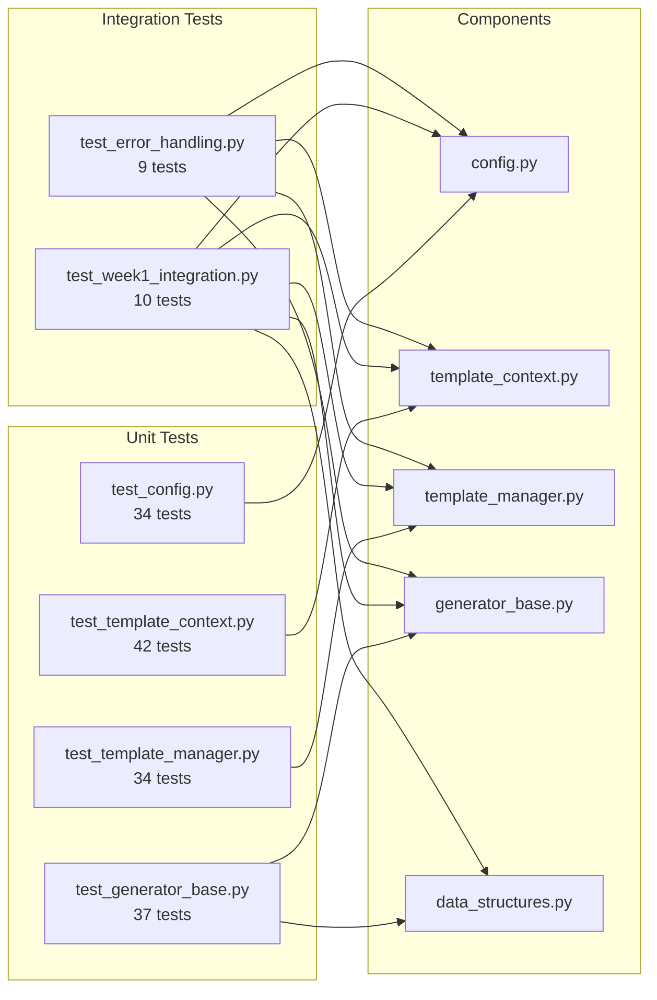

# HWKG Phase 2 Week 1: Foundation Architecture

## Table of Contents
1. [Overview](#overview)
2. [System Architecture](#system-architecture)
3. [Component Architecture](#component-architecture)
4. [Data Flow](#data-flow)
5. [Class Diagrams](#class-diagrams)
6. [Sequence Diagrams](#sequence-diagrams)
7. [Integration Points](#integration-points)
8. [File Structure](#file-structure)

## Overview

The Phase 2 Week 1 implementation establishes the foundation architecture for the Hardware Kernel Generator (HWKG) refactoring. This document provides detailed architectural views of the new system components and their interactions.

### Key Architectural Principles
- **Separation of Concerns**: Each component has a single, well-defined responsibility
- **Dependency Injection**: Components receive dependencies rather than creating them
- **Interface Segregation**: Clean interfaces between components
- **Open/Closed Principle**: Extensible for new generator types without modifying core code

## System Architecture



## Component Architecture

### 1. Configuration Framework ([`config.py`](../brainsmith/tools/hw_kernel_gen/config.py))

The configuration framework provides centralized configuration management with validation and factory methods.



**Key Features:**
- **Factory Methods**: Multiple ways to create configurations
- **Validation**: Built-in validation for all settings
- **Serialization**: JSON serialization support
- **Type Safety**: Enum-based configuration options

### 2. Template Context System ([`template_context.py`](../brainsmith/tools/hw_kernel_gen/template_context.py))

The template context system builds structured data for template rendering.



**Key Features:**
- **Context Caching**: Efficient reuse of computed contexts
- **Signal Classification**: Automatic signal type detection
- **Validation**: Context validation before use
- **Extensibility**: Easy to add new context types

### 3. Template Management ([`template_manager.py`](../brainsmith/tools/hw_kernel_gen/template_manager.py))

The template manager provides optimized Jinja2 template handling with caching.



**Key Features:**
- **LRU Caching**: Efficient template caching with size limits
- **TTL Support**: Time-based cache expiration
- **Custom Filters**: Jinja2 filter extensions
- **Template Discovery**: Automatic template finding

### 4. Generator Framework ([`generator_base.py`](../brainsmith/tools/hw_kernel_gen/generator_base.py))

The generator framework provides the abstract base for all code generators.



**Key Features:**
- **Abstract Interface**: Clean contract for generators
- **Artifact Management**: Structured output handling
- **Metrics Tracking**: Performance and result metrics
- **Validation**: Built-in artifact validation

### 5. Data Structures ([`data_structures.py`](../brainsmith/tools/hw_kernel_gen/data_structures.py))

The data structures module provides comprehensive data models for the pipeline.



## Data Flow

The following diagram shows how data flows through the Week 1 components:



## Sequence Diagrams

### Configuration Loading Sequence



### Template Rendering Sequence



## Integration Points

### 1. Configuration Integration
- **Entry Point**: [`PipelineConfig.from_args()`](../brainsmith/tools/hw_kernel_gen/config.py#L272)
- **Validation**: [`PipelineConfig.validate()`](../brainsmith/tools/hw_kernel_gen/config.py#L308)
- **Persistence**: [`PipelineConfig.to_file()`](../brainsmith/tools/hw_kernel_gen/config.py#L304)

### 2. Template System Integration
- **Manager Creation**: [`create_template_manager()`](../brainsmith/tools/hw_kernel_gen/template_manager.py#L391)
- **Context Building**: [`TemplateContextBuilder.build_hw_custom_op_context()`](../brainsmith/tools/hw_kernel_gen/template_context.py#L273)
- **Rendering**: [`TemplateManager.render_template()`](../brainsmith/tools/hw_kernel_gen/template_manager.py#L186)

### 3. Generator Integration
- **Base Class**: [`GeneratorBase`](../brainsmith/tools/hw_kernel_gen/generator_base.py#L225)
- **Result Creation**: [`create_generation_result()`](../brainsmith/tools/hw_kernel_gen/generator_base.py#L437)
- **Artifact Management**: [`GeneratedArtifact.write_to_file()`](../brainsmith/tools/hw_kernel_gen/generator_base.py#L85)

### 4. Data Structure Integration
- **RTL Parsing Output**: [`ParsedRTLData`](../brainsmith/tools/hw_kernel_gen/data_structures.py#L168)
- **Pipeline Input**: [`PipelineInputs`](../brainsmith/tools/hw_kernel_gen/data_structures.py#L223)
- **Pipeline Results**: [`PipelineResults`](../brainsmith/tools/hw_kernel_gen/data_structures.py#L266)

## File Structure

```
brainsmith/tools/hw_kernel_gen/
├── config.py                    # Configuration framework (336 lines)
│   ├── GeneratorType           # Enum for generator types
│   ├── ValidationLevel         # Enum for validation levels  
│   ├── TemplateConfig          # Template system configuration
│   ├── GenerationConfig        # Generation settings
│   ├── AnalysisConfig          # RTL analysis settings
│   ├── ValidationConfig        # Validation settings
│   └── PipelineConfig          # Main configuration class
│
├── template_context.py          # Context building (369 lines)
│   ├── BaseContext             # Base context class
│   ├── InterfaceInfo           # Interface metadata
│   ├── ParameterInfo           # Parameter metadata
│   ├── HWCustomOpContext       # HW Custom Op context
│   ├── RTLBackendContext       # RTL Backend context
│   └── TemplateContextBuilder  # Context builder with caching
│
├── template_manager.py          # Template management (406 lines)
│   ├── TemplateCache           # LRU cache implementation
│   ├── TemplateManager         # Jinja2 template manager
│   └── Factory functions       # Helper functions
│
├── generator_base.py            # Generator framework (449 lines)
│   ├── GeneratedArtifact       # Output artifact class
│   ├── GenerationResult        # Generation result container
│   ├── GeneratorBase           # Abstract generator base
│   └── Factory functions       # Helper functions
│
└── data_structures.py           # Pipeline data structures (434 lines)
    ├── RTLSignal               # Signal representation
    ├── RTLInterface            # Interface representation
    ├── RTLModule               # Module representation
    ├── ParsedRTLData           # Parser output
    ├── PipelineInputs          # Pipeline input container
    ├── PipelineResults         # Pipeline results container
    └── PipelineStage           # Pipeline stage enum
```

## Testing Architecture

The testing architecture validates all components:



## Summary

The Week 1 architecture establishes a solid foundation for the HWKG refactoring:

1. **Configuration Framework**: Centralized, validated configuration management
2. **Template System**: Optimized template handling with caching
3. **Generator Framework**: Standardized generator implementation pattern
4. **Data Structures**: Comprehensive data modeling for the pipeline
5. **Integration**: Clean interfaces between all components

This architecture supports the Phase 2 goals of eliminating code duplication, improving maintainability, and enabling extensibility for future generator types.