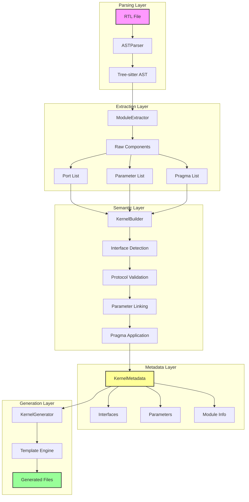
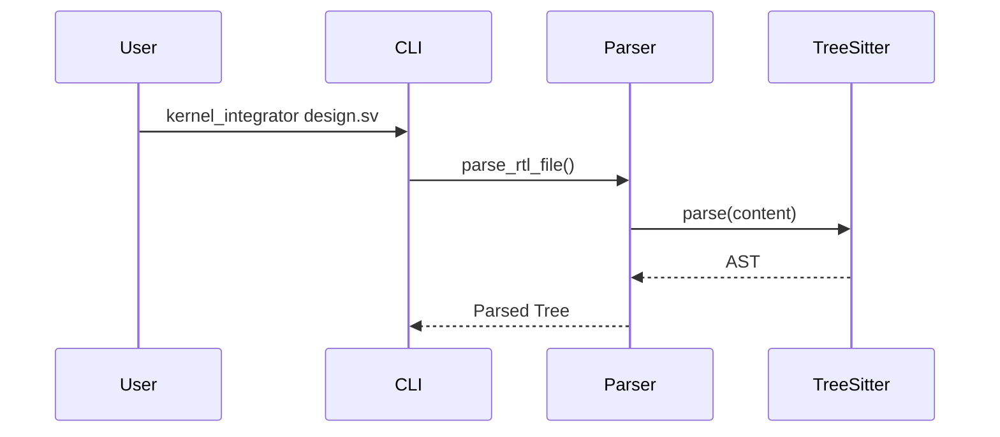
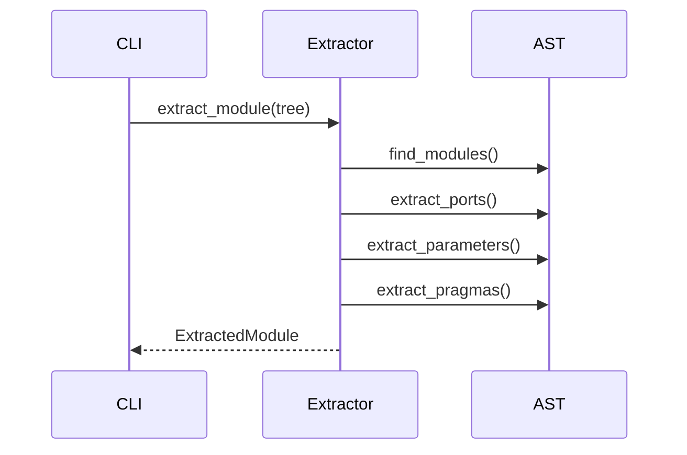
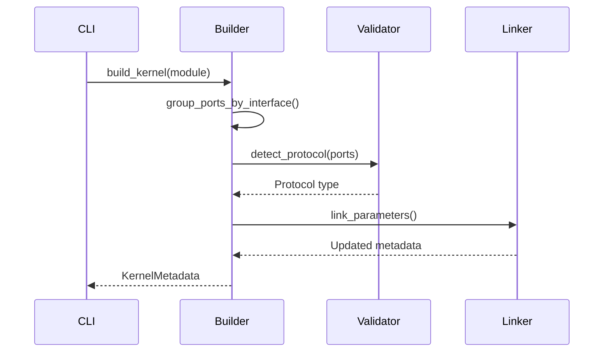

# Kernel Integrator Architecture

This document provides a deep technical dive into the Kernel Integrator's architecture, design patterns, and implementation details.

## Overview

The Kernel Integrator implements a multi-stage pipeline that transforms SystemVerilog RTL into high-level kernel metadata, which is then used to generate integration code. The architecture prioritizes:

- **Separation of Concerns**: Each component has a single, well-defined responsibility
- **Incremental Enhancement**: Each stage adds semantic information
- **Declarative Configuration**: Pragmas modify behavior without changing RTL
- **Type Safety**: Strong typing throughout with validated transformations

## Core Architecture



## Component Details

### ASTParser

The parser uses tree-sitter-verilog to build a concrete syntax tree:

```python
class ASTParser:
    def parse_rtl_file(self, file_path: Path) -> Tree:
        # Uses tree-sitter for robust parsing
        # Handles SystemVerilog 2017 syntax
        # Returns full AST for processing
```

Key features:
- Incremental parsing support
- Error recovery for partial files
- Comment preservation for pragma extraction

### ModuleExtractor

Extracts components from the AST:

```python
class ModuleExtractor:
    def extract_module(self, tree: Tree, target_module: Optional[str]) -> ExtractedModule:
        # Finds target module (or first module)
        # Extracts ports with full type information
        # Collects parameters with defaults
        # Gathers pragmas in module scope
```

The extractor handles:
- Multi-module files (via TOP_MODULE pragma)
- Complex port declarations (interfaces, arrays)
- Parameter inheritance and overrides
- Pragma association with declarations

### KernelBuilder

Transforms raw components into semantic interfaces:

```python
class KernelBuilder:
    def build_kernel(self, module: ExtractedModule) -> KernelMetadata:
        # Groups ports into interfaces
        # Detects protocols automatically
        # Links parameters to interfaces
        # Validates completeness
```

The builder implements a sophisticated pattern-matching system:

1. **Interface Detection**: Groups ports by prefix patterns
2. **Protocol Recognition**: Validates signal sets against protocols
3. **Parameter Association**: Links parameters to interface properties
4. **Semantic Enhancement**: Applies pragmas to enrich metadata

### Protocol Validator

Recognizes and validates interface protocols:

```python
class ProtocolValidator:
    SIGNAL_PATTERNS = {
        InterfaceProtocol.AXI_STREAM: {
            'required': ['tdata', 'tvalid', 'tready'],
            'optional': ['tlast', 'tkeep', 'tstrb', 'tid', 'tdest', 'tuser']
        },
        InterfaceProtocol.AXI_LITE: {
            'read_required': ['araddr', 'arvalid', 'arready', 'rdata', 'rresp', 'rvalid', 'rready'],
            'write_required': ['awaddr', 'awvalid', 'awready', 'wdata', 'wvalid', 'wready', 'bresp', 'bvalid', 'bready']
        }
    }
```

The validator:
- Supports partial AXI-Lite interfaces (read-only, write-only)
- Handles optional signals gracefully
- Provides detailed validation errors
- Maintains protocol-specific constraints

### Parameter Linker

Automatically associates parameters with interfaces:

```python
class ParameterLinker:
    def link_parameters(self, kernel_metadata: KernelMetadata) -> None:
        # Links width parameters (e.g., DATA_WIDTH → tdata width)
        # Respects pragma overrides
        # Handles complex relationships
```

Linking strategies:
1. **Name Matching**: `<INTERFACE>_WIDTH` → interface data width
2. **Signal Analysis**: Parameter used in port declaration
3. **Pragma Override**: Explicit DATATYPE_PARAM directives
4. **Global Fallback**: Unlinked parameters become kernel-level

### Pragma System

The pragma system implements a visitor pattern:

```python
class PragmaBase:
    def apply(self, metadata: KernelMetadata) -> None:
        # Modifies metadata based on pragma content
        
class DimensionPragma(PragmaBase):
    def apply(self, metadata: KernelMetadata) -> None:
        # Sets BDIM/SDIM on interfaces
        # Supports SHAPE expressions
        # Validates dimension compatibility
```

Pragma types form a hierarchy:
- **Interface Pragmas**: Modify interface properties
- **Parameter Pragmas**: Create aliases, derived values
- **Module Pragmas**: Affect module-level behavior
- **Relationship Pragmas**: Define inter-interface dependencies

## Data Flow

### 1. Parsing Phase



### 2. Extraction Phase



### 3. Building Phase



## Design Patterns

### 1. Builder Pattern
The `KernelBuilder` implements a step-by-step construction:
```python
kernel = (KernelBuilder()
    .with_module(extracted_module)
    .detect_interfaces()
    .validate_protocols()
    .link_parameters()
    .apply_pragmas()
    .build())
```

### 2. Strategy Pattern
Protocol validators implement a common interface:
```python
class ProtocolStrategy:
    def validate(self, signals: List[Signal]) -> bool
    def get_missing_signals(self, signals: List[Signal]) -> List[str]
```

### 3. Visitor Pattern
Pragmas visit and modify metadata:
```python
for pragma in pragmas:
    pragma.apply(kernel_metadata)
```

### 4. Template Method
Generation follows a consistent pattern:
```python
class GeneratorBase:
    def generate(self):
        self.prepare_context()
        self.validate_requirements()
        self.render_template()
        self.write_output()
```

## Type System

The architecture uses a rich type system:

```python
@dataclass
class KernelMetadata:
    name: str
    parameters: List[KernelParameter]
    interfaces: List[Interface]
    requirements: ValidationRequirements

@dataclass  
class Interface:
    name: str
    direction: InterfaceDirection
    protocol: InterfaceProtocol
    ports: List[Port]
    parameters: Dict[str, Any]  # Linked parameters
    metadata: InterfaceMetadata  # Pragmas applied
```

## Recent Refactoring

The codebase recently underwent consolidation:

### Before
- Multiple parameter types (InterfaceParameter, KernelParameter, DerivedParameter)
- Complex transformation layers
- Indirect template access

### After
- Unified `KernelParameter` type
- Direct metadata access in templates
- Simplified pragma application
- Cleaner separation of concerns

## Extension Points

The architecture supports extensions through:

1. **New Protocols**: Add to `ProtocolValidator.SIGNAL_PATTERNS`
2. **New Pragmas**: Extend `PragmaBase` and register
3. **New Templates**: Add Jinja2 templates for new outputs
4. **New Validation**: Extend `ValidationRequirements`

## Performance Considerations

- **Tree-sitter**: Fast incremental parsing
- **Pattern Matching**: Compiled regex for efficiency
- **Template Caching**: Jinja2 template compilation
- **Parallel Generation**: Each artifact generated independently

## Error Handling

The architecture implements defensive programming:

```python
try:
    # Parse and validate
except RTLParsingError:
    # Syntax errors in RTL
except ValidationError:
    # Semantic validation failures  
except GenerationError:
    # Template rendering issues
```

Each error includes:
- Descriptive message
- Source location (file, line)
- Suggested fixes
- Related documentation

## Future Directions

Potential architectural enhancements:

1. **Plugin System**: Dynamic pragma and protocol loading
2. **Incremental Generation**: Only regenerate changed artifacts
3. **Language Server**: IDE integration with real-time validation
4. **Multi-Language**: Support for VHDL, Chisel, etc.

The architecture's clean separation of concerns and strong typing make these extensions straightforward to implement while maintaining backward compatibility.