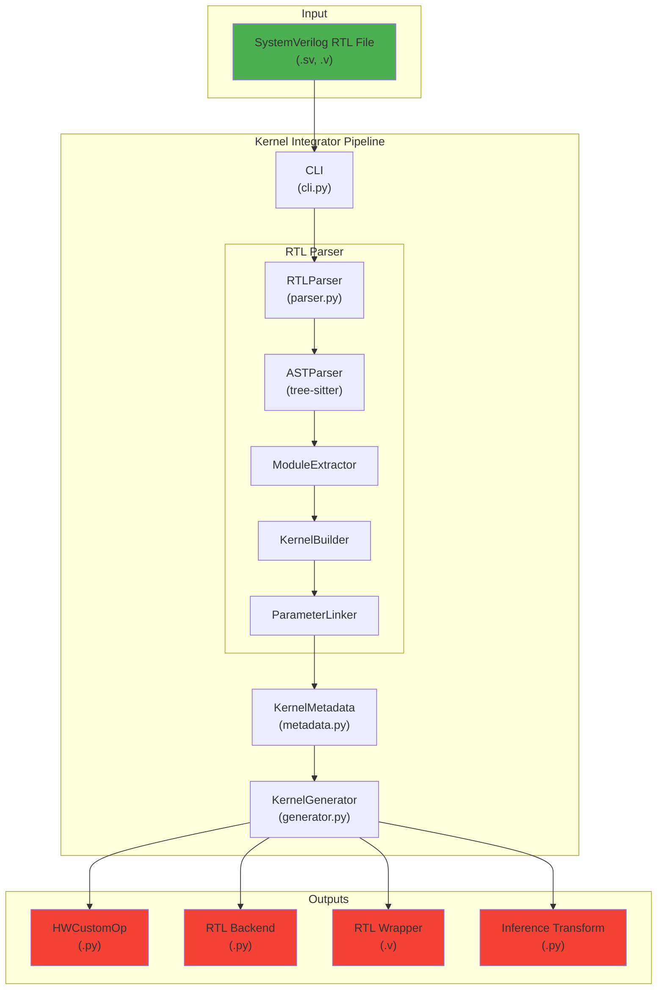
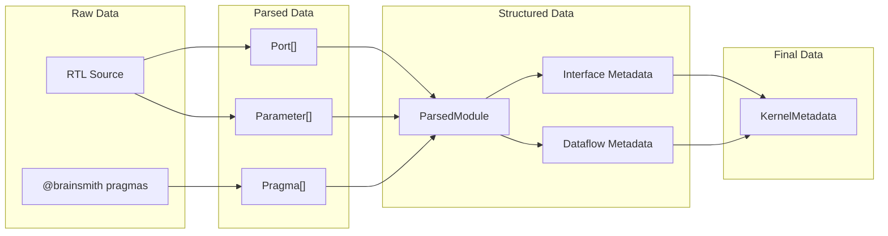
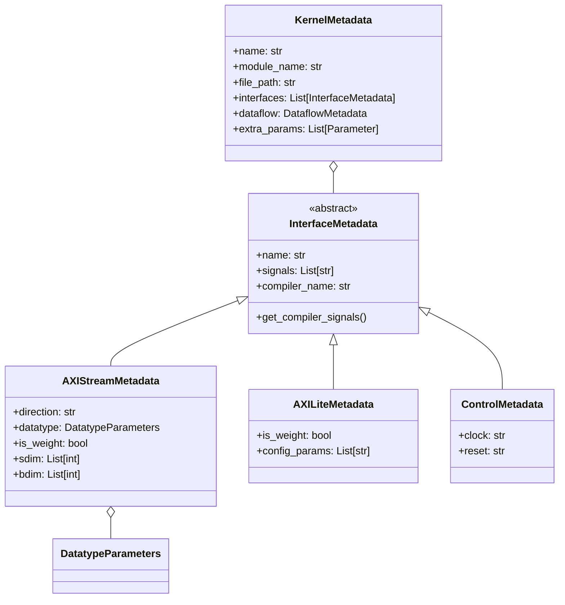
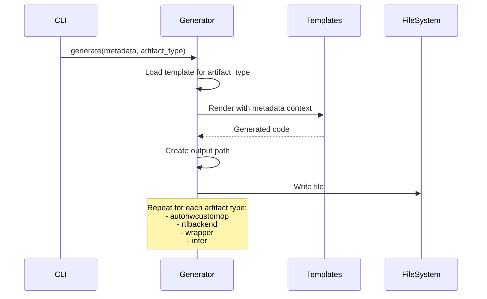
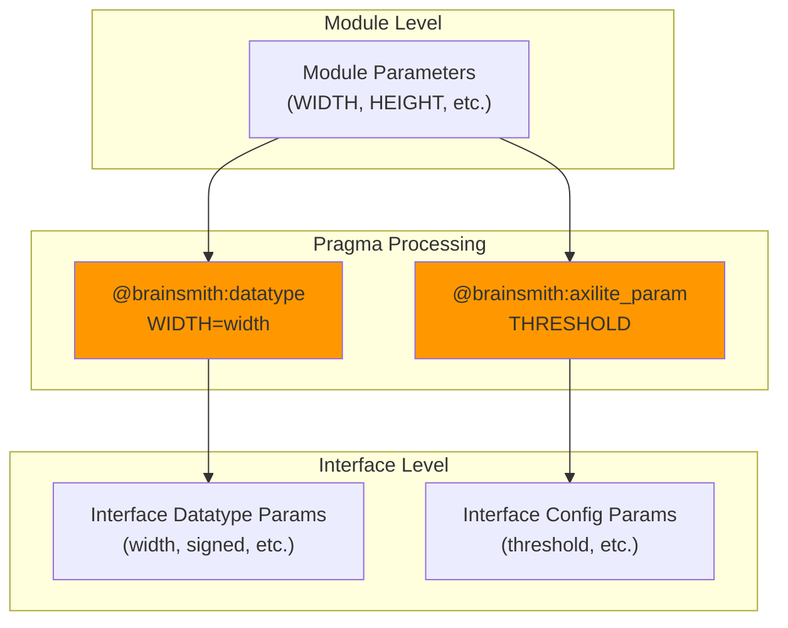
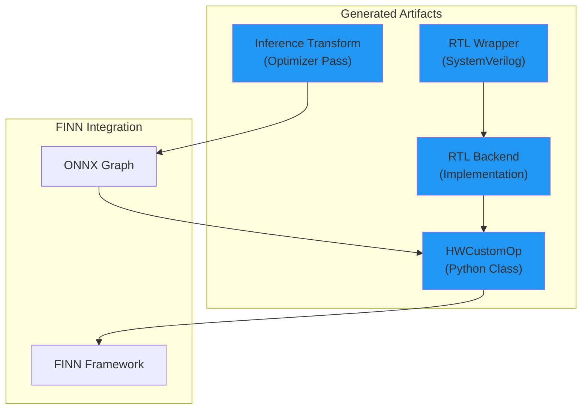

# Kernel Integrator Architecture Diagrams and Analysis

This document provides a comprehensive visual analysis of the kernel_integrator tool, including various diagrams and architectural descriptions.

## Table of Contents
1. [Overview](#overview)
2. [High-Level Architecture](#1-high-level-architecture-diagram)
3. [Data Flow](#2-data-flow-diagram)
4. [Class Hierarchy](#3-class-hierarchy-diagram)
5. [Pragma Processing](#4-pragma-processing-flow)
6. [Template Generation](#5-template-generation-flow)
7. [Interface Detection](#6-interface-detection-ascii-diagram)
8. [Parameter Linking](#7-parameter-linking-process)
9. [Processing Pipeline](#8-complete-processing-pipeline)
10. [Artifact Dependencies](#9-artifact-dependencies)
11. [Component Interaction](#10-component-interaction-matrix)

## Overview

The kernel_integrator is a tool that parses SystemVerilog RTL files and generates FINN-compatible HWCustomOp implementations. It follows a clean pipeline architecture:

```
RTL File → Parser → Metadata → Generator → Output Files
```

### Key Components

- **Entry Point & CLI**: Command-line interface for operations
- **RTL Parser System**: Tree-sitter based parser with multiple sub-components
- **Data Structures**: Core types for ports, parameters, and metadata
- **Pragma System**: Special comments that provide additional metadata
- **Code Generator**: Template-based code generation using Jinja2

## 1. High-Level Architecture Diagram



## 2. Data Flow Diagram



## 3. Class Hierarchy Diagram



## 4. Pragma Processing Flow

```
┌─────────────────────┐
│   RTL Comments      │
│ // @brainsmith ...  │
└──────────┬──────────┘
           │
           ▼
┌─────────────────────┐
│  Pragma Extraction  │
│  (find_pragmas)     │
└──────────┬──────────┘
           │
           ▼
┌─────────────────────┐
│   Pragma Parsing    │
│  (parse_pragma)     │
└──────────┬──────────┘
           │
           ▼
    ┌──────┴──────┐
    │ Pragma Type │
    └──────┬──────┘
           │
  ┌────────┼────────┬───────┬────────┐
  ▼        ▼        ▼       ▼        ▼
┌────┐  ┌────┐  ┌────┐  ┌────┐  ┌─────┐
│TOP │  │BDIM│  │TYPE│  │AXIL│  │ ... │
└────┘  └────┘  └────┘  └────┘  └─────┘
  │        │        │       │        │
  ▼        ▼        ▼       ▼        ▼
┌─────────────────────────────────────┐
│     Apply to Metadata Objects       │
└─────────────────────────────────────┘
```

## 5. Template Generation Flow



## 6. Interface Detection ASCII Diagram

```
Module Ports Analysis:
┌────────────────────────────────────────────┐
│              RTL Module                     │
├────────────────────────────────────────────┤
│ Ports:                                     │
│  ┌─────────────┐                          │
│  │ ap_clk      │ ──> Control Interface    │
│  │ ap_rst_n    │                          │
│  └─────────────┘                          │
│  ┌─────────────┐                          │
│  │ s_axis_*    │ ──> AXI-Stream Input     │
│  │ m_axis_*    │ ──> AXI-Stream Output    │
│  └─────────────┘                          │
│  ┌─────────────┐                          │
│  │ s_axilite_* │ ──> AXI-Lite Config      │
│  └─────────────┘                          │
└────────────────────────────────────────────┘
```

## 7. Parameter Linking Process



## 8. Complete Processing Pipeline

```
┌──────────────┐     ┌──────────────┐     ┌──────────────┐
│  RTL File    │────▶│    Parse     │────▶│   Extract    │
│  (.sv/.v)    │     │ (tree-sitter)│     │   Modules    │
└──────────────┘     └──────────────┘     └──────────────┘
                                                   │
                                                   ▼
┌──────────────┐     ┌──────────────┐     ┌──────────────┐
│   Generate   │◀────│    Build     │◀────│    Apply     │
│   Outputs    │     │   Metadata   │     │   Pragmas    │
└──────────────┘     └──────────────┘     └──────────────┘
        │
        ▼
┌──────────────────────────────────────────────────────┐
│                   Output Files                        │
├───────────────┬───────────────┬────────────┬────────┤
│ HWCustomOp.py │ RTLBackend.py │ Wrapper.v  │Infer.py│
└───────────────┴───────────────┴────────────┴────────┘
```

## 9. Artifact Dependencies



## 10. Component Interaction Matrix

```
┌─────────────┬────────┬────────┬──────────┬───────────┬──────────┐
│ Component   │  CLI   │ Parser │ Metadata │ Generator │ Templates│
├─────────────┼────────┼────────┼──────────┼───────────┼──────────┤
│ CLI         │   ●    │   ▶    │    ▷     │     ▶     │    ○     │
│ Parser      │   ◀    │   ●    │    ▶     │     ○     │    ○     │
│ Metadata    │   ◁    │   ◀    │    ●     │     ▶     │    ○     │
│ Generator   │   ◀    │   ○    │    ◀     │     ●     │    ▶     │
│ Templates   │   ○    │   ○    │    ○     │     ◀     │    ●     │
└─────────────┴────────┴────────┴──────────┴───────────┴──────────┘

Legend:  ● Self   ▶ Direct Use   ▷ Indirect Use   ○ No Interaction
```

## Key Design Patterns

1. **Pragma-Driven Configuration**: RTL annotations drive behavior
2. **Interface Abstraction**: Different interface types with common base
3. **Parameter Migration**: Parameters move from module to interfaces based on pragmas
4. **Compiler Name Mapping**: RTL names → standardized compiler names
5. **Template Substitution**: Parameters use `$PARAM_NAME$` placeholders

## Processing Stages Summary

### Stage 1: Parse RTL File
- Extract pragmas from comments
- Find and select target module
- Extract ports, parameters
- Build ParsedModule

### Stage 2: Build Metadata
- Create interface objects (AXI-Stream, AXI-Lite, Control)
- Apply pragmas to modify metadata
- Auto-link parameters to interfaces
- Format for compiler export (assign compiler names)

### Stage 3: Generate Outputs
- Load Jinja2 templates
- Render with KernelMetadata context
- Write output files

## Supported Pragma Types

- `TOP_MODULE`: Specify target module
- `DATATYPE_CONSTRAINT`: Constrain interface datatypes
- `WEIGHT`: Mark interfaces as weights
- `BDIM`/`SDIM`: Define block/stream dimensions
- `DATATYPE`: Map RTL params to datatype properties
- `ALIAS`: Expose params with different names
- `DERIVED_PARAMETER`: Define computed parameters
- `AXILITE_PARAM`: Mark AXI-Lite config params
- `RELATIONSHIP`: Define interface relationships

This architecture provides a clean separation of concerns with distinct parsing, metadata representation, and generation phases, making it maintainable and extensible.