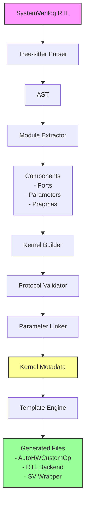

# Kernel Integrator Overview

The Kernel Integrator is a powerful tool that bridges the gap between custom SystemVerilog RTL designs and the FINN framework for FPGA-accelerated machine learning. It automates the generation of Python integration code from hardware descriptions, eliminating tedious boilerplate while preserving hardware design flexibility.

## Purpose

Hardware designers write RTL modules in SystemVerilog, while ML frameworks like FINN require Python-based operator definitions. The Kernel Integrator:

- **Parses** SystemVerilog RTL files to extract module structure
- **Interprets** special `@brainsmith` pragmas for high-level semantics
- **Generates** FINN-compatible Python classes and standardized wrappers
- **Validates** interface protocols and parameter relationships

## Architecture



## Key Concepts

### Pragmas
Special comments that provide metadata beyond RTL syntax:
```systemverilog
// @brainsmith DATATYPE s_axis_input UINT 8
// @brainsmith BDIM m_axis_output [16]
```

### Interfaces
The tool recognizes three protocol types automatically:
- **CONTROL**: Clock and reset signals (required)
- **AXI_STREAM**: Streaming data with TDATA/TVALID/TREADY
- **AXI_LITE**: Memory-mapped configuration interface

### Protocols
Interfaces are detected by naming patterns:
- `s_axis_*` → AXI-Stream slave (input)
- `m_axis_*` → AXI-Stream master (output)  
- `s_axilite_*` → AXI-Lite slave (configuration)

## Quick Start

### 1. Create RTL with Pragmas

```systemverilog
// @brainsmith DATATYPE s_axis_input UINT 8
// @brainsmith DATATYPE m_axis_output UINT 1
// @brainsmith BDIM s_axis_input [16]
// @brainsmith BDIM m_axis_output [16]

module threshold #(
    parameter DATA_WIDTH = 8,
    parameter THRESHOLD = 128
) (
    // Control signals (required)
    input wire ap_clk,
    input wire ap_rst_n,
    
    // AXI-Stream input
    input wire [DATA_WIDTH-1:0] s_axis_input_tdata,
    input wire s_axis_input_tvalid,
    output wire s_axis_input_tready,
    
    // AXI-Stream output
    output wire m_axis_output_tdata,
    output wire m_axis_output_tvalid,
    input wire m_axis_output_tready
);
    // Implementation...
endmodule
```

### 2. Run Kernel Integrator

```bash
# Generate all integration files
kernel_integrator threshold.sv

# Check parsed metadata first
kernel_integrator threshold.sv --info

# Generate in specific directory
kernel_integrator threshold.sv -o ./generated
```

### 3. Use Generated Files

The tool generates three files:

1. **threshold.py** - FINN HWCustomOp class
2. **threshold_rtl.py** - RTL backend implementation
3. **threshold_wrapper.v** - Standardized SystemVerilog wrapper

## Workflow Integration


## Why Kernel Integrator?

### Without Kernel Integrator
- Manually write HWCustomOp classes (500+ lines)
- Manually maintain parameter mappings
- Risk interface mismatches
- Duplicate logic between RTL and Python

### With Kernel Integrator
- Focus on RTL implementation
- Add pragmas for high-level intent
- Generate integration code automatically
- Maintain single source of truth

## Next Steps

- [User Guide](kernel-integrator-user-guide.md) - Detailed CLI usage and pragma reference
- [Architecture Guide](kernel-integrator-architecture.md) - Deep technical dive
- [RTL Guide](kernel-integrator-rtl-guide.md) - Writing pragma-annotated RTL

## Example Output

Running `kernel_integrator my_accelerator.sv` produces:

```
✅ Successfully generated HWCustomOp for my_accelerator
📁 Output directory: ./
⚡ Generated 3 files in 125.3ms
```

The generated HWCustomOp seamlessly integrates with FINN's dataflow, while the wrapper ensures proper interface connections during synthesis.