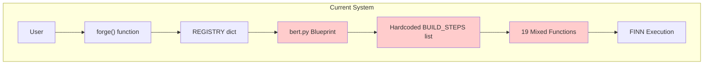
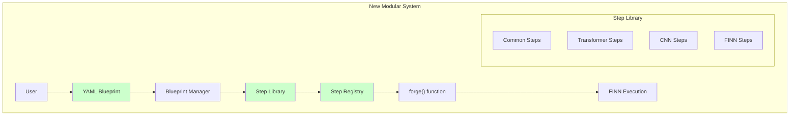
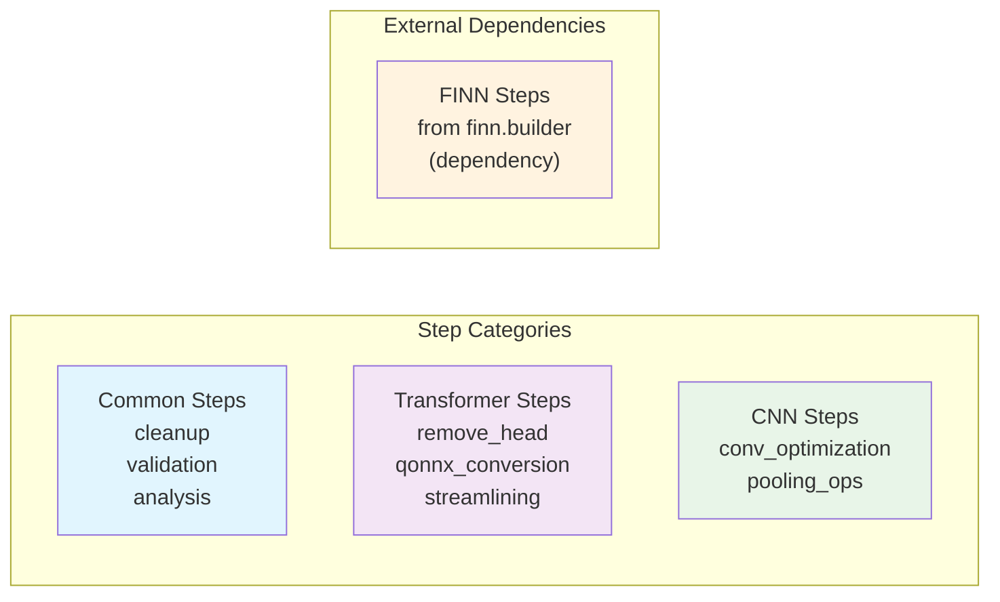
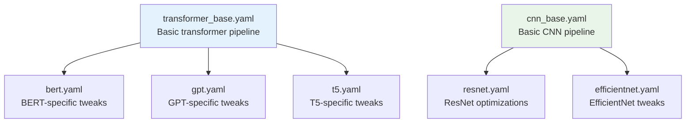
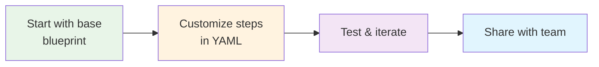
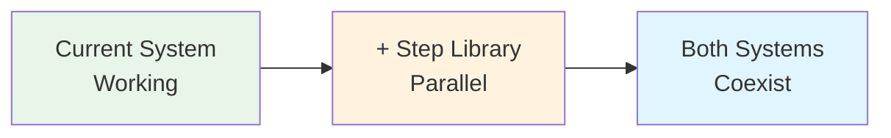
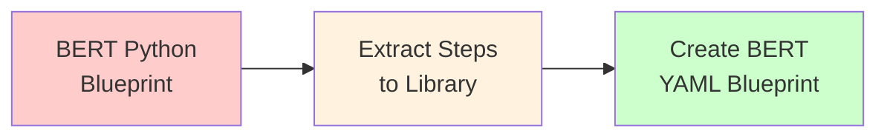
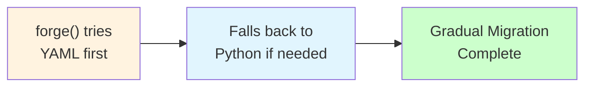

# Brainsmith Blueprint Architecture: From Monolithic to Modular

## The Problem: Current Blueprint System

Today, Brainsmith has a rigid, hardcoded blueprint system that makes it difficult to create new model pipelines or modify existing ones.

### Current Architecture



### Problems with Current Approach

**🔒 Inflexible**: Only one blueprint ("bert") with hardcoded steps
**🔧 Hard to Extend**: Adding new models requires deep FINN knowledge
**🍝 Mixed Responsibilities**: Blueprint contains both step definitions AND execution order
**🔄 Code Duplication**: Can't reuse steps across different model types
**🐛 Hard to Test**: Monolithic structure makes isolated testing difficult

## The Solution: Step Library + YAML Blueprints

Transform the blueprint system into a modular, composable architecture where:
- **Steps** are reusable building blocks stored in a central library
- **Blueprints** are simple YAML files that compose steps together
- **Users** can create new blueprints without writing Python code

### New Architecture Overview



## Core Components

### 1. Step Library: The Building Blocks

Think of steps as LEGO blocks - each one does one specific job, and you can combine them in different ways.



**Key Benefits:**
- **Reusable**: Same cleanup step works for BERT, ResNet, etc.
- **Testable**: Each step can be tested independently
- **Discoverable**: Users can list available steps by category
- **Extensible**: Add new steps without touching existing code
- **Clean Dependencies**: FINN steps remain in FINN repository, referenced directly

**Architecture Note:** FINN build steps (like `step_create_dataflow_partition`, `step_hw_codegen`) remain in the FINN repository and are imported as dependencies. Brainsmith's step library focuses on model-specific transformations and common utilities, while leveraging FINN's existing build infrastructure.

### 2. YAML Blueprints: The Recipes

Blueprints become simple configuration files that list which steps to run in what order.

**Before (Python):**
```python
BUILD_STEPS = [
    custom_step_cleanup,
    custom_step_remove_head,
    custom_step_qonnx2finn,
    # ... 16 more hardcoded functions
]
```

**After (YAML):**
```yaml
name: "bert"
description: "BERT transformer compilation"
architecture: "transformer"

build_steps:
  - "common.cleanup"
  - "transformer.remove_head"
  - "transformer.qonnx_to_finn"
  - "step_create_dataflow_partition"    # Direct FINN step
  - "step_specialize_layers"            # Direct FINN step
  - "step_hw_codegen"                   # Direct FINN step
  # ... FINN steps imported as dependencies
```

### 3. Blueprint Inheritance

Create blueprint families that build on each other:



## User Experience Transformation

### For Existing Users: Zero Disruption

The system maintains complete backward compatibility. Existing code continues to work unchanged:

```python
# This still works exactly as before
result = forge("bert", model, args)
```

Behind the scenes, the system automatically:
1. Loads the `bert.yaml` blueprint
2. Resolves step names to functions
3. Executes the pipeline

### For New Users: Much Easier

Creating a new model pipeline becomes straightforward:



**Example: Creating a MobileBERT Blueprint**
1. Copy `transformer_base.yaml`
2. Add MobileBERT-specific steps
3. Save as `mobilebert.yaml`
4. Run: `forge("mobilebert", model, args)`

No Python knowledge required!

## Migration Strategy: Smooth Transition

### Phase 1: Build Foundation (Week 1)


- Create step library infrastructure
- No changes to existing blueprints
- Zero risk to current functionality

### Phase 2: Migrate Content (Week 2)


- Move BERT steps to library
- Create equivalent YAML blueprint
- Test both produce identical results

### Phase 3: Switch Over (Week 3)


- Update `forge()` to prefer YAML blueprints
- Maintain fallback to legacy system
- Users don't notice the change

## Benefits Summary

### For Developers
- **Modularity**: Easier to maintain and test individual components
- **Reusability**: Write once, use across multiple model types
- **Extensibility**: Add new steps without touching core code
- **Clarity**: Separate concerns (step logic vs. pipeline configuration)

### For Users
- **Simplicity**: Create new pipelines with YAML instead of Python
- **Discoverability**: List available steps and their documentation
- **Flexibility**: Mix and match steps for custom workflows
- **Consistency**: Standardized interface across all model types

### For the Project
- **Maintainability**: Cleaner, more organized codebase
- **Community**: Lower barrier for contributions
- **Evolution**: Foundation for future enhancements (search strategies, optimization)
- **Stability**: Backward compatibility ensures no disruption

## Example: Real-World Usage

### Today's Workflow (Complex)
1. User wants to compile a custom transformer
2. Must understand FINN internals
3. Copy and modify `bert.py` 
4. Debug Python code issues
5. Hope it works

### Tomorrow's Workflow (Simple)
1. User wants to compile a custom transformer
2. Copy `transformer_base.yaml`
3. Edit step list in text editor
4. Run `forge("my_transformer", model, args)`
5. It just works

## Technical Implementation Highlights

### Automatic Step Discovery
The system automatically finds and loads all steps, so adding new ones is as simple as dropping a file in the right folder.

### Dependency Validation
Blueprint validation ensures all required steps are present and in the correct order.

### Error Messages
Clear, actionable error messages help users fix blueprint issues quickly.

### Testing Strategy
Each step can be tested independently, making the system more reliable.

## Conclusion

This architecture transformation takes Brainsmith from a rigid, expert-only system to a flexible, user-friendly platform. The modular design makes it easier to maintain, extend, and use, while the migration strategy ensures a smooth transition with zero disruption to existing workflows.

The step library becomes the foundation for future enhancements like automated design space exploration, while YAML blueprints make the system accessible to a much broader audience.