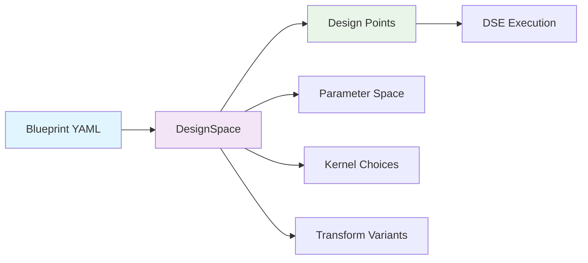
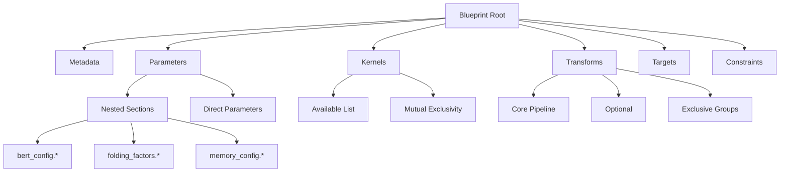
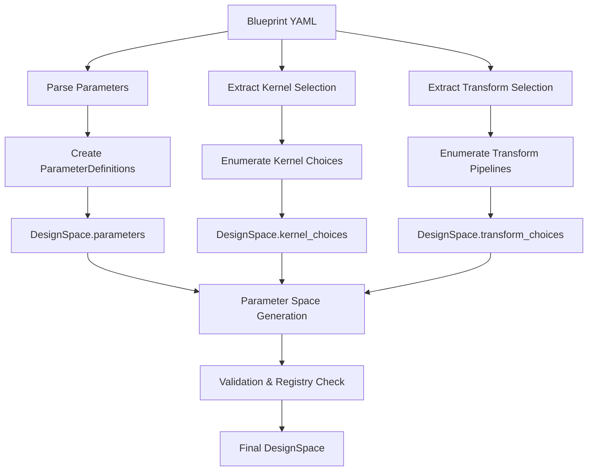

# BrainSmith Blueprint System: Design Points & DesignSpace Generation

**Complete guide to blueprint architecture, design point types, and DesignSpace generation for both blueprint authors and DSE users.**

## Table of Contents

1. [Introduction](#introduction)
2. [Blueprint Architecture](#blueprint-architecture)
3. [Design Point Types](#design-point-types)
4. [DesignSpace Generation](#designspace-generation)
5. [Blueprint Examples](#blueprint-examples)
6. [Parameter Types & Extraction](#parameter-types--extraction)
7. [Advanced Features](#advanced-features)
8. [Usage Patterns](#usage-patterns)

---

## Introduction

**Blueprints define the complete design exploration space by specifying parameters, kernel choices, and transform pipelines that generate thousands of potential accelerator configurations.**

BrainSmith blueprints serve as the bridge between high-level design intent and detailed design space exploration (DSE). A single blueprint YAML file can generate parameter spaces containing hundreds to thousands of unique design points, each representing a different accelerator configuration with specific folding factors, memory modes, kernel selections, and transform pipelines.

### Key Capabilities
• **Parameter-based exploration** - Nested parameter sections with ranges, values, and constraints
• **Kernel selection** - Multiple hardware implementation choices with mutual exclusivity
• **Transform pipelines** - Core, optional, and mutually exclusive transformation sequences
• **Constraint integration** - Resource limits, performance targets, and optimization goals



---

## Blueprint Architecture

**Blueprints follow a hierarchical YAML schema with distinct sections for metadata, parameters, kernels, transforms, and constraints.**

### Core Schema Structure

```yaml
# Metadata Section
name: "accelerator_name"
description: "Accelerator description"
category: "transformers|basic|advanced"
version: "1.0"

# Base Configuration
model_type: "bert|cnn|mobilenet"
target_platform: "zynq|zynq_ultrascale"
optimization_level: "basic|advanced|aggressive"

# Design Space Definition
parameters:
  section_name:
    description: "Section description"
    param_name:
      range: [val1, val2, val3]
      default: val1
      description: "Parameter description"

# Enhanced Kernel/Transform Selection
kernels:
  available: ["kernel1", "kernel2"]
  mutually_exclusive: [["group1_kern1", "group1_kern2"]]

transforms:
  core_pipeline: ["always_applied1", "always_applied2"]
  optional: ["optional1", "optional2"]
  mutually_exclusive: [["exclusive_group1", "exclusive_group2"]]

# Platform Configuration
fpga_part: "xczu7ev-ffvc1156-2-e"
board: "Ultra96-V2"
```

### Section Hierarchy



---

## Design Point Types

**BrainSmith generates five distinct types of design points from blueprint specifications, each contributing different dimensions to the exploration space.**

### 1. Parameter-Based Design Points

Traditional parameter sweeps across ranges and value sets defined in nested parameter sections.

**Example from BERT Blueprint:**
```yaml
parameters:
  bert_config:
    hidden_size:
      range: [256, 384, 512, 768]    # 4 choices
    num_layers:
      range: [1, 3, 6, 12]           # 4 choices
  folding_factors:
    mvau_pe:
      range: [4, 8, 16, 32]          # 4 choices
```

**Generated Parameters:**
• `bert_config.hidden_size` → [256, 384, 512, 768]
• `bert_config.num_layers` → [1, 3, 6, 12]  
• `folding_factors.mvau_pe` → [4, 8, 16, 32]

**Cartesian Product:** 4 × 4 × 4 = **64 parameter combinations**

### 2. Kernel Selection Design Points

Hardware implementation choices with mutual exclusivity constraints generating discrete kernel combinations.

**Example Configuration:**
```yaml
kernels:
  available:
    - "conv2d_hls"
    - "conv2d_rtl"
    - "matmul_rtl"
  mutually_exclusive:
    - ["conv2d_hls", "conv2d_rtl"]  # Can't use both conv2d variants
```

**Generated Kernel Choices:**
• Choice 1: `["conv2d_hls", "matmul_rtl"]`
• Choice 2: `["conv2d_rtl", "matmul_rtl"]`

**Result:** **2 kernel selection variants**

### 3. Transform Pipeline Design Points

Transform sequence variations combining core, optional, and mutually exclusive transform groups.

**Example Configuration:**
```yaml
transforms:
  core_pipeline:
    - "cleanup"
    - "streamlining"
  optional:
    - "remove_head"
  mutually_exclusive:
    - ["infer_hardware", "constrain_folding"]
```

**Generated Transform Pipelines:**
• Pipeline 1: `["cleanup", "streamlining", "infer_hardware"]`
• Pipeline 2: `["cleanup", "streamlining", "constrain_folding"]`
• Pipeline 3: `["cleanup", "streamlining", "remove_head", "infer_hardware"]`
• Pipeline 4: `["cleanup", "streamlining", "remove_head", "constrain_folding"]`

**Result:** **4 transform pipeline variants**

### 4. Constraint-Driven Design Points

Resource and performance constraint combinations that filter valid design configurations.

**Example Constraints:**
```yaml
constraints:
  resource_utilization_max:
    lut: 0.8
    dsp: 0.7
    bram: 0.6
  min_throughput_fps: 500
  max_latency_ms: 50.0
```

**Constraint Application:**
• Filter invalid parameter combinations
• Reject resource-excessive configurations
• Ensure performance requirements

### 5. Composite Design Points

**Total Design Space = Parameters × Kernels × Transforms × Constraints**

Using BERT example:
• **64 parameter combinations**
• **2 kernel choices**  
• **4 transform pipelines**
• **Constraint filtering**

**Maximum Design Points:** 64 × 2 × 4 = **512 unique configurations**

---

## DesignSpace Generation

**The [`DesignSpace.from_blueprint_data()`](brainsmith/core/dse/design_space.py:175) method transforms blueprint YAML into structured parameter spaces with comprehensive validation.**

### Generation Process Flow



### Core Implementation

```python
@classmethod
def from_blueprint_data(cls, blueprint_data: Dict[str, Any]) -> 'DesignSpace':
    """Create design space from blueprint configuration."""
    design_space = cls(blueprint_data.get('name', 'blueprint_design_space'))
    
    # Extract and add parameter definitions
    parameter_definitions = design_space._extract_blueprint_parameters(blueprint_data)
    for param_name, param_def in parameter_definitions.items():
        design_space.add_parameter(param_def)
    
    # Process kernel/transform selections
    kernel_selection, transform_selection = design_space._extract_kernel_transform_selections(blueprint_data)
    design_space.kernel_selection = kernel_selection
    design_space.transform_selection = transform_selection
    
    # Generate choice combinations
    if kernel_selection:
        design_space.kernel_choices = enumerate_kernel_combinations(kernel_selection)
    if transform_selection:
        design_space.transform_choices = enumerate_transform_pipelines(transform_selection)
    
    return design_space
```

### Parameter Extraction Logic

**Nested Section Detection:**
```python
def _is_nested_section(self, section_data: Any) -> bool:
    """Detect nested parameter sections like bert_config, folding_factors."""
    return (isinstance(section_data, dict) and
            'description' in section_data and
            len(section_data) > 1)
```

**Parameter Creation:**
```python
def _create_parameter_definition(self, param_name: str, param_config: Dict[str, Any]):
    """Create ParameterDefinition from blueprint config."""
    # Handle range-based parameters
    if 'range' in param_config:
        return ParameterDefinition(
            name=param_name,
            param_type='categorical',
            values=param_config['range'],
            default=param_config.get('default', param_config['range'][0])
        )
    
    # Handle values-based parameters  
    elif 'values' in param_config:
        return ParameterDefinition(
            name=param_name,
            param_type='categorical',
            values=param_config['values'],
            default=param_config.get('default', param_config['values'][0])
        )
```

### Choice Enumeration

**Kernel Combination Generation:**
```python
def enumerate_kernel_combinations(kernel_selection: KernelSelection) -> List[List[str]]:
    """Generate all valid kernel combinations respecting mutual exclusivity."""
    from itertools import product
    
    available = kernel_selection.available_kernels
    mutual_groups = kernel_selection.mutually_exclusive_groups
    
    # For each mutual group, select one kernel
    # Combine with non-exclusive kernels
    combinations = []
    for group_choices in product(*[group for group in mutual_groups]):
        # Add non-exclusive kernels
        combination = list(group_choices) + [k for k in available if not any(k in group for group in mutual_groups)]
        combinations.append(combination)
    
    return combinations
```

---

## Blueprint Examples

**Real-world blueprint analysis showing parameter extraction and DesignSpace generation patterns.**

### BERT Accelerator Blueprint

**Source:** [`bert_accelerator.yaml`](brainsmith/libraries/blueprints/transformers/bert_accelerator.yaml:1)

**Parameter Sections (6 major groups):**
```yaml
parameters:
  # 1. BERT Architecture (5 params)
  bert_config:
    hidden_size: [256, 384, 512, 768]          # 4 choices
    num_layers: [1, 3, 6, 12]                  # 4 choices  
    num_attention_heads: [8, 12, 16]           # 3 choices
    intermediate_size: [512, 1536, 3072]       # 3 choices
    sequence_length: [64, 128, 256, 512]       # 4 choices
  
  # 2. FINN Folding (8 params)
  folding_factors:
    mvau_pe: [4, 8, 16, 32]                    # 4 choices
    mvau_simd: [12, 24, 48]                    # 3 choices
    ff_pe_multiplier: [1, 2]                   # 2 choices
    # ... 5 more folding parameters
  
  # 3. Memory Configuration (4 params)
  memory_config:
    mvau_mem_mode: ["internal_default", "internal_decoupled", "external"]
    ram_style: ["auto", "block", "distributed"]
    # ... 2 more memory parameters
  
  # 4. Quantization (2 params)
  quantization:
    weight_width: [4, 8]                       # 2 choices
    activation_width: [4, 8]                   # 2 choices
  
  # 5. Optimization (2 params)  
  optimization:
    target_fps: [1000, 3000, 5000]            # 3 choices
    clock_period_ns: [3.33, 5.0, 10.0]        # 3 choices
```

**Generated Parameter Names:**
• `bert_config.hidden_size`
• `bert_config.num_layers`
• `bert_config.num_attention_heads`
• `folding_factors.mvau_pe`
• `folding_factors.mvau_simd`
• `memory_config.mvau_mem_mode`
• `quantization.weight_width`
• `optimization.target_fps`
• ... **21 total parameters**

**Kernel/Transform Configuration:**
```yaml
kernels:
  available: ["matmul_rtl", "conv2d_hls"]      # 2 kernels → 1 combination

transforms:
  core_pipeline: ["cleanup", "qonnx_to_finn", "streamlining"]
  optional: ["remove_head", "remove_tail"]     # 2^2 = 4 combinations
  mutually_exclusive: [["infer_hardware", "constrain_folding_and_set_pumped_compute"]]  # 2−1 = 2 choices
```

**Design Space Size:**
• **Parameter combinations:** 4×4×3×3×4×4×3×2×... ≈ **~50,000 combinations**
• **Kernel choices:** **1 combination**
• **Transform pipelines:** **4 × 2 = 8 variants**
• **Total design space:** **~400,000 unique design points**

### CNN vs MobileNet Comparison

| Feature | CNN Basic | MobileNet Advanced |
|---------|-----------|-------------------|
| **Parameter sections** | 1 (folding_factors) | 1 (folding_factors) |
| **Parameter count** | 6 parameters | 9 parameters |
| **Kernel choices** | 2 available, no exclusivity | Similar basic setup |
| **Transform complexity** | Simple core pipeline | Advanced with hooks |
| **Optimization level** | `basic` | `aggressive` |
| **Target platform** | `zynq` | `zynq_ultrascale` |
| **Design space size** | ~1,000 points | ~10,000 points |

### Minimal vs Comprehensive Patterns

**Minimal Blueprint Pattern:**
```yaml
name: "bert_minimal"
parameters: {}                    # Empty - no DSE
targets:
  throughput: 3000               # Fixed values
demo_info:
  parameter_space_size: 0        # Bypass exploration
```

**Comprehensive Blueprint Pattern:**
```yaml
name: "bert_accelerator"
parameters:
  bert_config: { ... }           # 5 architectural params
  folding_factors: { ... }       # 8 folding params  
  memory_config: { ... }         # 4 memory params
  quantization: { ... }          # 2 quantization params
  optimization: { ... }          # 2 optimization params
kernels: { ... }                 # Multiple kernel choices
transforms: { ... }             # Complex pipeline variants
```

---

## Parameter Types & Extraction

**BrainSmith supports five parameter types with specialized extraction logic for nested blueprint sections.**

### Parameter Type System

```python
class ParameterType(Enum):
    CATEGORICAL = "categorical"    # Discrete choices from list
    INTEGER = "integer"           # Integer ranges
    FLOAT = "float"              # Floating-point ranges  
    CONTINUOUS = "float"         # Alias for compatibility
    BOOLEAN = "boolean"          # True/False choices
```

### Parameter Definition Structure

```python
class ParameterDefinition:
    def __init__(self, name: str, param_type: str, 
                 values: List[Any] = None,           # For categorical
                 range_min: float = None,            # For numeric ranges
                 range_max: float = None,            # For numeric ranges
                 default: Any = None):               # Default value
```

### Extraction Patterns

#### 1. Range-Based Parameters
```yaml
mvau_pe:
  range: [4, 8, 16, 32]
  default: 8
  description: "Processing elements for MVAU layers"
```

**Extracted as:**
```python
ParameterDefinition(
    name="folding_factors.mvau_pe",
    param_type="categorical",
    values=[4, 8, 16, 32],
    default=8
)
```

#### 2. Values-Based Parameters
```yaml
memory_mode:
  values: ["internal_default", "internal_decoupled", "external"]
  default: "internal_decoupled"
```

**Extracted as:**
```python
ParameterDefinition(
    name="memory_config.memory_mode",
    param_type="categorical", 
    values=["internal_default", "internal_decoupled", "external"],
    default="internal_decoupled"
)
```

#### 3. Boolean Parameters
```yaml
runtime_writeable_weights:
  values: [0, 1]                 # Treated as boolean
  default: 0
```

#### 4. Nested Section Processing

**Detection Logic:**
```python
def _is_nested_section(self, section_data: Any) -> bool:
    """Check if section contains nested parameters."""
    return (isinstance(section_data, dict) and
            'description' in section_data and      # Has section description
            len(section_data) > 1)                 # Contains actual parameters
```

**Extraction Process:**
```python
def _extract_blueprint_parameters(self, blueprint_data: Dict[str, Any]):
    """Extract parameters with nested section handling."""
    parameter_definitions = {}
    
    for section_name, section_data in blueprint_data['parameters'].items():
        if self._is_nested_section(section_data):
            # Process nested section: bert_config, folding_factors, etc.
            for param_name, param_config in section_data.items():
                if param_name != 'description':
                    full_param_name = f"{section_name}.{param_name}"
                    param_def = self._create_parameter_definition(full_param_name, param_config)
                    parameter_definitions[full_param_name] = param_def
        else:
            # Process direct parameter
            param_def = self._create_parameter_definition(section_name, section_data)
            parameter_definitions[section_name] = param_def
    
    return parameter_definitions
```

### Parameter Space Conversion

**From ParameterDefinition to Parameter Space:**
```python
def to_parameter_space(self) -> Dict[str, List[Any]]:
    """Convert DesignSpace to DSE-compatible parameter space."""
    parameter_space = {}
    
    for param_name, param_def in self.parameters.items():
        if param_def.type == 'categorical' and param_def.values:
            parameter_space[param_name] = param_def.values
        elif param_def.type == 'boolean':
            parameter_space[param_name] = [True, False]
        elif param_def.type in ['integer', 'float']:
            # Generate discrete range values
            if param_def.range_min and param_def.range_max:
                if param_def.type == 'integer':
                    parameter_space[param_name] = list(range(
                        int(param_def.range_min), int(param_def.range_max) + 1))
                else:
                    # Float ranges with 10 discrete steps
                    step = (param_def.range_max - param_def.range_min) / 10
                    values = []
                    current = param_def.range_min
                    while current <= param_def.range_max:
                        values.append(current)
                        current += step
                    parameter_space[param_name] = values
    
    # Add kernel and transform choices
    if self.kernel_choices:
        parameter_space['kernel_selection'] = self.kernel_choices
    if self.transform_choices:
        parameter_space['transform_pipeline'] = self.transform_choices
        
    return parameter_space
```

---

## Advanced Features

**Enhanced blueprint capabilities including mutual exclusivity, hook-based organization, and constraint integration.**

### Mutual Exclusivity Handling

**Kernel-Level Mutual Exclusivity:**
```yaml
kernels:
  available:
    - "conv2d_hls"
    - "conv2d_rtl"      # Mutually exclusive with conv2d_hls
    - "matmul_rtl"      # Can be combined with either conv2d variant
  mutually_exclusive:
    - ["conv2d_hls", "conv2d_rtl"]
```

**Generated Combinations:**
```python
# Choice enumeration respects mutual exclusivity
kernel_choices = [
    ["conv2d_hls", "matmul_rtl"],     # HLS convolution + RTL matmul
    ["conv2d_rtl", "matmul_rtl"]      # RTL convolution + RTL matmul
]
```

**Transform-Level Mutual Exclusivity:**
```yaml
transforms:
  core_pipeline: ["cleanup", "streamlining"]
  optional: ["remove_head"]
  mutually_exclusive:
    - ["infer_hardware", "constrain_folding"]     # Can't use both
```

**Pipeline Generation Algorithm:**
```python
def enumerate_transform_pipelines(transform_selection: TransformSelection):
    """Generate transform pipelines with mutual exclusivity."""
    base_pipeline = transform_selection.core_pipeline
    optional = transform_selection.optional_transforms
    mutual_groups = transform_selection.mutually_exclusive_groups
    
    pipelines = []
    
    # Generate optional combinations (2^n possibilities)
    for opt_combo in powerset(optional):
        # For each mutual group, choose one transform
        for mutual_choices in product(*mutual_groups):
            pipeline = base_pipeline + list(opt_combo) + list(mutual_choices)
            pipelines.append(pipeline)
    
    return pipelines
```

### Hook-Based Transform Organization

**Prepared for 4-Hooks Architecture:**
```yaml
transforms:
  # Current: flat pipeline structure
  core_pipeline: ["cleanup", "streamlining"]
  optional: ["remove_head"]
  
  # Future: hook-specific organization
  hooks:
    preprocessing: ["model_cleanup", "input_validation"]
    transformation: ["qonnx_to_finn", "streamlining"]
    optimization: ["folding_optimization", "resource_balancing"]
    generation: ["rtl_generation", "verification_setup"]
```

**Hook Processing Logic (Prepared):**
```python
def _extract_hook_transforms(self, hooks_config: Dict[str, List[str]]):
    """Extract hook-specific transform sequences."""
    hook_transforms = {}
    for hook_name, transforms in hooks_config.items():
        hook_transforms[hook_name] = transforms
    return hook_transforms
```

### Performance Target Integration

**Multi-Objective Optimization Support:**
```yaml
targets:
  throughput:
    direction: "maximize" 
    target: "target_fps"           # Reference to parameter
    description: "Maximize inference throughput"
  power_budget_w: 15.0             # Hard constraint
  accuracy_drop_max: 0.05          # Tolerance limit
  latency_ms_max: 20.0             # Performance requirement

constraints:
  min_throughput_fps: 500          # Minimum acceptable
  max_power_w: 25.0                # Hardware limit
  resource_utilization_max:        # FPGA resource limits
    lut: 0.8
    dsp: 0.7
    bram: 0.6
```

**Constraint Application:**
```python
def apply_constraints(self, design_points: List[DesignPoint]) -> List[DesignPoint]:
    """Filter design points based on blueprint constraints."""
    valid_points = []
    constraints = self.blueprint_config.get('constraints', {})
    
    for point in design_points:
        if self._validate_constraints(point, constraints):
            valid_points.append(point)
    
    return valid_points
```

### Registry Validation

**Kernel/Transform Registry Checking:**
```python
def validate_kernel_transform_selections(self) -> Tuple[bool, List[str]]:
    """Validate selections against available registries."""
    errors = []
    
    if self.kernel_selection:
        # Check kernel availability
        try:
            from brainsmith.libraries.kernels import list_kernels
            available_kernels = list_kernels()
            
            for kernel in self.kernel_selection.available_kernels:
                if kernel not in available_kernels:
                    errors.append(f"Kernel '{kernel}' not found in registry")
        except ImportError:
            errors.append("Could not import kernel registry")
    
    if self.transform_selection:
        # Check transform availability
        try:
            from brainsmith.libraries.transforms import list_transforms
            available_transforms = list_transforms()
            
            all_transforms = (
                self.transform_selection.core_pipeline +
                self.transform_selection.optional_transforms +
                [t for group in self.transform_selection.mutually_exclusive_groups for t in group]
            )
            
            for transform in all_transforms:
                if transform not in available_transforms:
                    errors.append(f"Transform '{transform}' not found in registry")
        except ImportError:
            errors.append("Could not import transform registry")
    
    return len(errors) == 0, errors
```

---

## Usage Patterns

**Best practices and common patterns for blueprint authoring and DSE integration workflows.**

### Blueprint Authoring Guidelines

#### 1. Parameter Organization Patterns

**✅ Good: Logical Section Grouping**
```yaml
parameters:
  # Group related parameters with clear descriptions
  model_architecture:
    description: "Neural network architecture parameters"
    hidden_size: [256, 512, 768]
    num_layers: [6, 12, 24]
    
  hardware_mapping:
    description: "FPGA resource allocation parameters"
    pe_count: [8, 16, 32]
    memory_mode: ["internal", "external"]
```

**❌ Avoid: Flat Parameter Structure**
```yaml
parameters:
  # Harder to manage and understand
  hidden_size: [256, 512, 768]
  num_layers: [6, 12, 24]
  pe_count: [8, 16, 32]
  memory_mode: ["internal", "external"]
```

#### 2. Kernel Selection Patterns

**✅ Good: Clear Mutual Exclusivity**
```yaml
kernels:
  available: ["conv2d_hls", "conv2d_rtl", "matmul_optimized"]
  mutually_exclusive:
    - ["conv2d_hls", "conv2d_rtl"]       # Clear hardware choice
  operation_mappings:                    # Optional validation
    "Convolution": ["conv2d_hls", "conv2d_rtl"]
    "MatMul": ["matmul_optimized"]
```

**❌ Avoid: Ambiguous Kernel Relationships**
```yaml
kernels:
  available: ["kernel1", "kernel2", "kernel3"]  # Unclear purpose
  # No mutual exclusivity specified
```

#### 3. Transform Pipeline Design

**✅ Good: Structured Pipeline with Clear Dependencies**
```yaml
transforms:
  core_pipeline:                       # Always applied
    - "cleanup"
    - "model_validation"
    - "streamlining"
  optional:                           # Optional additions
    - "advanced_optimization"
    - "debug_instrumentation"
  mutually_exclusive:                 # Alternative strategies
    - ["infer_hardware", "manual_hardware_config"]
```

**❌ Avoid: Unclear Transform Dependencies**
```yaml
transforms:
  core_pipeline: ["transform1", "transform2"]
  optional: ["transform3", "transform4"]
  # No clear indication of what these transforms do
```

### DSE Integration Workflows

#### 1. Blueprint → DesignSpace → Exploration

```python
# 1. Load and validate blueprint
import yaml
from brainsmith.core.dse.design_space import DesignSpace

with open('blueprint.yaml', 'r') as f:
    blueprint_data = yaml.safe_load(f)

# 2. Create DesignSpace
design_space = DesignSpace.from_blueprint_data(blueprint_data)

# 3. Validate configuration
is_valid, errors = design_space.validate()
if not is_valid:
    print(f"Blueprint validation errors: {errors}")
    exit(1)

# 4. Generate parameter space
parameter_space = design_space.to_parameter_space()
print(f"Generated {len(parameter_space)} parameter types")

# 5. Sample design points for exploration
design_points = design_space.sample_points(n_samples=100, seed=42)
print(f"Sampled {len(design_points)} design points")
```

#### 2. Kernel/Transform Choice Analysis

```python
# Analyze kernel and transform choices
if design_space.kernel_choices:
    print(f"Kernel combinations: {len(design_space.kernel_choices)}")
    for i, choice in enumerate(design_space.kernel_choices):
        print(f"  Choice {i+1}: {choice}")

if design_space.transform_choices:
    print(f"Transform pipelines: {len(design_space.transform_choices)}")
    for i, pipeline in enumerate(design_space.transform_choices[:5]):  # Show first 5
        print(f"  Pipeline {i+1}: {' → '.join(pipeline)}")
```

#### 3. Design Point Filtering

```python
# Filter design points based on constraints
def filter_by_resource_budget(design_points: List[DesignPoint], 
                            max_lut_util: float = 0.8) -> List[DesignPoint]:
    """Filter design points by estimated resource utilization."""
    filtered = []
    
    for point in design_points:
        # Estimate resource usage (simplified)
        pe_count = point.get_parameter('folding_factors.mvau_pe', 8)
        hidden_size = point.get_parameter('bert_config.hidden_size', 384)
        
        estimated_lut_util = (pe_count * hidden_size) / 100000  # Rough estimate
        
        if estimated_lut_util <= max_lut_util:
            filtered.append(point)
    
    return filtered

# Apply filtering
filtered_points = filter_by_resource_budget(design_points, max_lut_util=0.7)
print(f"After filtering: {len(filtered_points)} valid design points")
```

### Common Anti-Patterns

#### 1. Parameter Explosion
**Problem:** Too many parameter combinations leading to intractable design spaces.
```yaml
# Generates 4^10 = 1,048,576 combinations
parameters:
  section1:
    param1: [1, 2, 3, 4]    # 4 choices
    param2: [1, 2, 3, 4]    # 4 choices
    # ... 8 more similar parameters
```

**Solution:** Use parameter correlation and constraints.
```yaml
parameters:
  section1:
    param_group_size: ["small", "medium", "large"]  # 3 meta-choices
    # Derive other parameters from group_size
```

#### 2. Invalid Kernel/Transform Combinations
**Problem:** Specifying kernels or transforms that don't exist in registries.

**Solution:** Always validate against registries and provide clear error messages.

#### 3. Missing Default Values
**Problem:** Parameters without defaults causing sampling issues.

**Solution:** Always specify reasonable defaults for all parameters.

---

## Summary

**BrainSmith's blueprint system provides a comprehensive framework for defining complex design exploration spaces through structured YAML configurations.**

### Key Takeaways

• **Multi-dimensional design spaces** - Parameters, kernels, transforms, and constraints combine to create rich exploration possibilities
• **Scalable parameter organization** - Nested sections and clear naming conventions support complex accelerator configurations  
• **Enhanced choice mechanisms** - Kernel selection and transform pipelines add new dimensions beyond traditional parameter sweeps
• **Validation integration** - Registry checking and constraint application ensure valid design configurations
• **Future-ready architecture** - Hook-based transform organization prepares for advanced DSE workflows

### Design Space Complexity

| Blueprint Type | Parameters | Kernel Choices | Transform Variants | Estimated Design Points |
|---------------|------------|----------------|-------------------|------------------------|
| **Minimal** | 0 | 0 | 0 | 1 (fixed config) |
| **Basic CNN** | ~10 | 2 | 4 | ~1,000 |
| **Advanced MobileNet** | ~15 | 3 | 8 | ~10,000 |
| **Comprehensive BERT** | ~25 | 2 | 8 | ~400,000 |

### Next Steps

• **Blueprint validation** - Use [`design_space.validate()`](brainsmith/core/dse/design_space.py:369) to check configurations
• **Registry integration** - Ensure kernel/transform selections match available implementations
• **Constraint refinement** - Add resource and performance constraints to filter design spaces
• **Hook preparation** - Consider future 4-hooks architecture in transform organization

---

**Change Log:**
- v1.0: Initial comprehensive documentation covering all blueprint design point types and DesignSpace generation