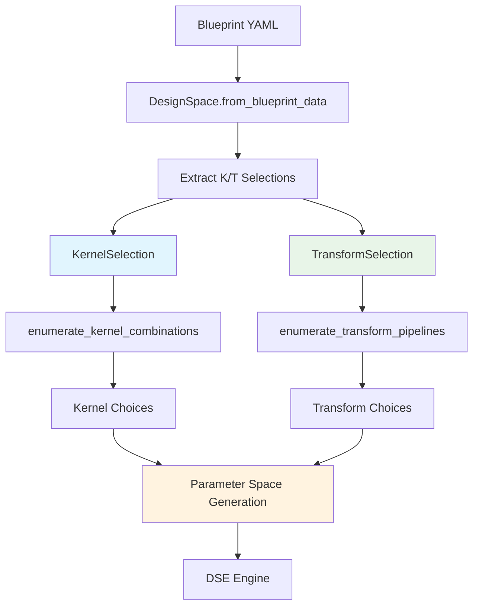
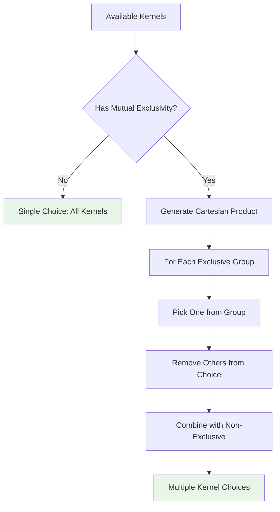
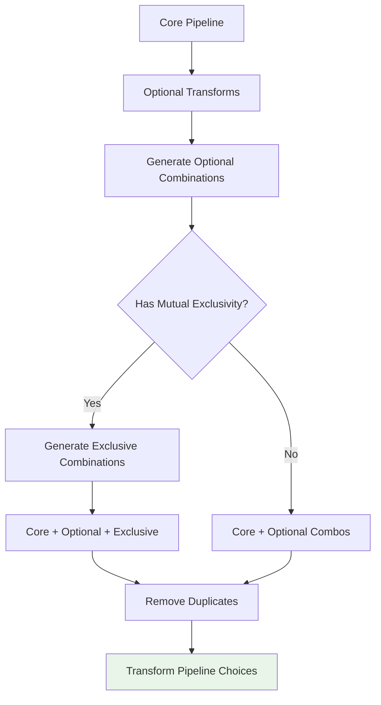

# Blueprint Kernel & Transform Selection Design Document

**Version**: 1.0  
**Date**: June 13, 2025  
**Author**: BrainSmith Engineering Team  

## Executive Summary

This document describes the design and implementation of enhanced kernel and transform selection capabilities for BrainSmith's Design Space Exploration (DSE) system. The enhancement allows blueprint authors to specify exact kernels and transforms by name, with support for mutual exclusivity groups that create different design points for comprehensive DSE exploration.

## 1. Problem Statement

### 1.1 Current Limitations

The existing BrainSmith DSE system lacked explicit support for:
- **Kernel Selection**: No way to specify which hardware kernels to explore during DSE
- **Transform Pipeline Variants**: Limited ability to define different transformation pipelines 
- **Mutual Exclusivity**: No mechanism to define mutually exclusive choices that create different design points
- **Registry Integration**: No validation against available kernels/transforms in the system

### 1.2 Requirements

1. **Explicit Selection**: Blueprint authors must be able to specify exact kernels/transforms by name
2. **Choice Enumeration**: System must generate all valid combinations considering mutual exclusivity
3. **DSE Integration**: Kernel/transform choices must integrate seamlessly with existing parameter spaces
4. **Validation**: All selections must be validated against available registries
5. **Backward Compatibility**: Existing blueprints must continue to work without modification

## 2. Architecture Overview

### 2.1 System Components



### 2.2 Data Flow

1. **Blueprint Parsing**: Enhanced YAML parser extracts `kernels` and `transforms` sections
2. **Selection Creation**: Raw configuration converted to `KernelSelection` and `TransformSelection` objects
3. **Choice Enumeration**: All valid combinations generated considering mutual exclusivity constraints
4. **Parameter Space Integration**: Kernel/transform choices added to DSE parameter space
5. **Validation**: Registry validation ensures all specified kernels/transforms exist

## 3. Core Data Structures

### 3.1 KernelSelection

```python
@dataclass
class KernelSelection:
    """Represents a kernel selection configuration"""
    available_kernels: List[str]                    # All kernels to consider
    mutually_exclusive_groups: List[List[str]]      # Groups where only one can be selected
    operation_mappings: Dict[str, List[str]]        # Future: operation -> kernel mappings
```

**Example**:
```python
KernelSelection(
    available_kernels=['conv2d_hls', 'conv2d_rtl', 'matmul_rtl'],
    mutually_exclusive_groups=[['conv2d_hls', 'conv2d_rtl']],  # Can't have both
    operation_mappings={'Convolution': ['conv2d_hls', 'conv2d_rtl']}
)
```

### 3.2 TransformSelection

```python
@dataclass  
class TransformSelection:
    """Represents a transform pipeline configuration"""
    core_pipeline: List[str]                        # Always applied transforms
    optional_transforms: List[str]                  # May or may not be applied
    mutually_exclusive_groups: List[List[str]]      # Groups where only one can be selected
    hooks: Dict[str, List[str]]                     # Future: 4-hooks support
```

**Example**:
```python
TransformSelection(
    core_pipeline=['cleanup', 'streamlining'],
    optional_transforms=['remove_head', 'remove_tail'],
    mutually_exclusive_groups=[['infer_hardware', 'constrain_folding']],
    hooks={}
)
```

## 4. Choice Enumeration Algorithms

### 4.1 Kernel Choice Enumeration



**Algorithm**:
1. Start with base set of all available kernels
2. For each mutual exclusivity group:
   - Generate combinations where only one kernel from group is selected
   - Remove other kernels from that group
3. Create Cartesian product of all exclusivity group choices
4. Remove duplicates and return unique choices

### 4.2 Transform Choice Enumeration



**Algorithm**:
1. Start with core pipeline (always included)
2. Generate all combinations of optional transforms (2^n combinations)
3. For each optional combination:
   - If no mutual exclusivity: create pipeline
   - If mutual exclusivity exists: generate Cartesian product with exclusive choices
4. Remove duplicates and return unique pipelines

## 5. Blueprint YAML Schema Extensions

### 5.1 Kernels Section

```yaml
kernels:
  # List of available kernels to explore
  available:
    - "conv2d_hls"
    - "conv2d_rtl" 
    - "matmul_rtl"
  
  # Mutually exclusive groups (only one kernel from each group)
  mutually_exclusive:
    - ["conv2d_hls", "conv2d_rtl"]  # Can't have both convolution kernels
  
  # Optional: operation type mappings for validation
  operation_mappings:
    "Convolution": ["conv2d_hls", "conv2d_rtl"]
    "MatMul": ["matmul_rtl"]
```

### 5.2 Transforms Section

```yaml
transforms:
  # Core pipeline (always applied)
  core_pipeline:
    - "cleanup"
    - "qonnx_to_finn"
    - "streamlining"
  
  # Optional transforms (test with/without)
  optional:
    - "remove_head"
    - "remove_tail"
  
  # Mutually exclusive transform groups
  mutually_exclusive:
    - ["infer_hardware", "constrain_folding_and_set_pumped_compute"]
  
  # Future: Hook-specific pipelines (prepared for 4-hooks)
  hooks:
    preprocessing: []
    transformation: []
    optimization: []
    generation: []
```

## 6. Implementation Details

### 6.1 DesignSpace Enhancement

The `DesignSpace` class was enhanced with:

```python
class DesignSpace:
    def __init__(self, name: str = "default"):
        # ... existing attributes ...
        
        # New attributes for kernel/transform selection
        self.kernel_selection: Optional[KernelSelection] = None
        self.transform_selection: Optional[TransformSelection] = None
        self.kernel_choices: List[List[str]] = []          # Generated combinations
        self.transform_choices: List[List[str]] = []       # Generated pipelines
```

### 6.2 Key Methods

**Blueprint Parsing**:
```python
def _extract_kernel_transform_selections(self, blueprint_data: Dict[str, Any]) -> Tuple[Optional[KernelSelection], Optional[TransformSelection]]:
    """Extract kernel and transform selections from blueprint."""
```

**Choice Generation**:
```python
def _enumerate_kernel_choices(self, kernel_selection: KernelSelection) -> List[List[str]]:
    """Generate all valid kernel choice combinations."""
    
def _enumerate_transform_choices(self, transform_selection: TransformSelection) -> List[List[str]]:
    """Generate all valid transform pipeline variants."""
```

**Parameter Space Integration**:
```python
def to_parameter_space(self) -> Dict[str, List[Any]]:
    """Convert DesignSpace to DSE ParameterSpace format."""
    # ... existing parameter processing ...
    
    # Add kernel choices if specified
    if self.kernel_choices:
        parameter_space['kernel_selection'] = self.kernel_choices
    
    # Add transform pipeline choices if specified  
    if self.transform_choices:
        parameter_space['transform_pipeline'] = self.transform_choices
```

### 6.3 Validation System

Registry validation ensures all specified kernels/transforms exist:

```python
def validate_kernel_transform_selections(self) -> Tuple[bool, List[str]]:
    """Validate kernel and transform selections against registries."""
    errors = []
    
    if self.kernel_selection:
        # Validate against kernel registry
        kernel_errors = self._validate_kernel_availability(self.kernel_selection.available_kernels)
        errors.extend(kernel_errors)
    
    if self.transform_selection:
        # Validate against transform registry
        all_transforms = (
            self.transform_selection.core_pipeline +
            self.transform_selection.optional_transforms +
            [t for group in self.transform_selection.mutually_exclusive_groups for t in group]
        )
        transform_errors = self._validate_transform_availability(all_transforms)
        errors.extend(transform_errors)
    
    return len(errors) == 0, errors
```

## 7. Example Usage & Results

### 7.1 Example Blueprint

```yaml
name: "enhanced_bert_accelerator"

parameters:
  bert_config:
    description: "BERT model configuration parameters"
    num_layers:
      range: [1, 3, 6, 12]
      default: 3

kernels:
  available:
    - "matmul_rtl"
    - "conv2d_hls"
  operation_mappings:
    "MatMul": ["matmul_rtl"]
    "Convolution": ["conv2d_hls"]

transforms:
  core_pipeline:
    - "cleanup"
    - "streamlining"
  optional:
    - "remove_head"
  mutually_exclusive:
    - ["infer_hardware", "constrain_folding"]
```

### 7.2 Generated Choices

**Kernel Choices** (1 choice since no mutual exclusivity):
```python
[['matmul_rtl', 'conv2d_hls']]
```

**Transform Choices** (4 combinations):
```python
[
    ['cleanup', 'streamlining', 'infer_hardware'],
    ['cleanup', 'streamlining', 'constrain_folding'], 
    ['cleanup', 'streamlining', 'remove_head', 'infer_hardware'],
    ['cleanup', 'streamlining', 'remove_head', 'constrain_folding']
]
```

**Parameter Space**:
```python
{
    'bert_config.num_layers': [1, 3, 6, 12],
    'kernel_selection': [['matmul_rtl', 'conv2d_hls']],
    'transform_pipeline': [
        ['cleanup', 'streamlining', 'infer_hardware'],
        ['cleanup', 'streamlining', 'constrain_folding'],
        ['cleanup', 'streamlining', 'remove_head', 'infer_hardware'],
        ['cleanup', 'streamlining', 'remove_head', 'constrain_folding']
    ]
}
```

## 8. Testing Strategy

### 8.1 Unit Tests

**Kernel Enumeration Tests** (`test_kernel_transform_enumeration.py`):
- No mutual exclusivity scenarios
- Single mutual exclusivity group
- Multiple mutual exclusivity groups  
- Empty/invalid configurations

**Transform Enumeration Tests**:
- Core pipeline only
- Optional transforms combinations
- Mutual exclusivity handling
- Complex scenarios with both optional and exclusive transforms

### 8.2 Integration Tests

**DesignSpace Integration** (`test_designspace_kernel_transform.py`):
- Blueprint parsing with kernel/transform sections
- Parameter space generation
- Validation against registries
- Backward compatibility verification

### 8.3 Live Testing Results

Docker environment test confirmed:
- ✅ Kernel choice enumeration working (2 choices generated)
- ✅ Transform choice enumeration working (4 pipeline variants generated)
- ✅ Parameter space integration successful
- ✅ Registry validation functional with detailed error messages
- ✅ Backward compatibility maintained

## 9. Performance Considerations

### 9.1 Complexity Analysis

**Kernel Choices**: O(∏ |group_i|) where group_i are mutual exclusivity groups
**Transform Choices**: O(2^|optional| × ∏ |group_i|) for optional and exclusive groups

**Example**: 
- 2 optional transforms, 1 exclusive group of size 3 → 2² × 3 = 12 combinations
- Manageable for typical blueprint configurations

### 9.2 Optimization Strategies

1. **Lazy Evaluation**: Generate choices only when needed
2. **Caching**: Cache enumerated choices to avoid recomputation
3. **Early Validation**: Validate against registries during blueprint parsing
4. **Memory Efficiency**: Use generators for large choice spaces

## 10. Future Extensions

### 10.1 4-Hooks Support

The `hooks` field in `TransformSelection` is prepared for future 4-hooks architecture:

```yaml
transforms:
  hooks:
    preprocessing: ["input_validation", "format_conversion"]
    transformation: ["core_transforms"]
    optimization: ["performance_opts"]
    generation: ["output_generation"]
```

### 10.2 Advanced Constraints

Future enhancements could include:
- **Conditional Selections**: Kernels/transforms dependent on other parameters
- **Resource Constraints**: Memory/computation limits affecting choices
- **Optimization Hints**: Preferences for certain kernel/transform combinations

### 10.3 Dynamic Registry Updates

Support for:
- **Runtime Registry Discovery**: Automatically detect available kernels/transforms
- **Version Compatibility**: Handle different versions of kernels/transforms
- **Custom Kernel Integration**: User-defined kernels in selection process

## 11. Migration Guide

### 11.1 Existing Blueprints

No changes required - existing blueprints continue to work:
- `kernel_selection` and `transform_selection` will be `None`
- `kernel_choices` and `transform_choices` will be empty lists
- Parameter space generation proceeds normally

### 11.2 Adopting New Features

To add kernel/transform selection to existing blueprints:

1. **Add kernels section** (optional):
   ```yaml
   kernels:
     available: ["kernel1", "kernel2"]
   ```

2. **Add transforms section** (optional):
   ```yaml
   transforms:
     core_pipeline: ["essential_transform"]
     optional: ["optional_transform"]
   ```

3. **Test and validate** against registries
4. **Update DSE configurations** to handle new parameter space dimensions

## 12. Conclusion

The Blueprint Kernel & Transform Selection enhancement significantly expands BrainSmith's DSE capabilities by providing explicit, validated selection of hardware kernels and transformation pipelines. The implementation maintains backward compatibility while offering powerful new features for comprehensive design space exploration.

Key benefits:
- **Explicit Control**: Blueprint authors can specify exact kernels/transforms
- **Comprehensive Exploration**: Mutual exclusivity creates diverse design points  
- **Robust Validation**: Registry integration ensures valid configurations
- **Seamless Integration**: Works within existing DSE infrastructure
- **Future-Ready**: Prepared for 4-hooks and advanced constraint systems

The enhancement enables more targeted and effective hardware design space exploration, supporting BrainSmith's mission to democratize FPGA acceleration development.