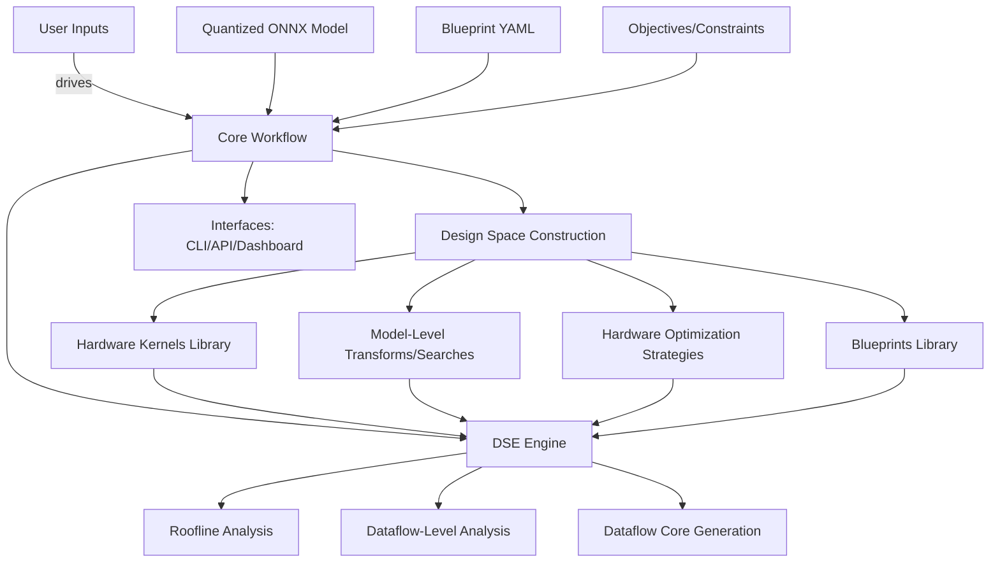
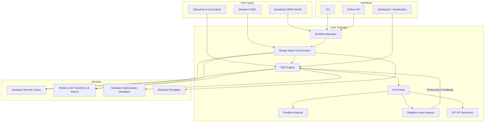

Certainly. Here’s a comprehensive architectural document for the Brainsmith toolchain, capturing all details discussed—core workflow, libraries, modularity, and blueprinting—culminating in a cohesive directory layout and a Markdown-based graph that makes architectural relationships explicit.

---

# Brainsmith Toolchain: Architectural Overview

## 1. Vision

Brainsmith is a meta-toolchain, designed to superimpose advanced design-space exploration, optimization, and modularity atop the FINN framework for neural network accelerator synthesis on FPGAs. It abstracts away complexity, exposing a high-level interface to blueprint, search, analyze, and generate optimal dataflow architectures across diverse neural network topologies.

---

## 2. Architectural Pillars

### 2.1 User Inputs

* **Quantized Model** (`model.onnx`): Pre-quantized neural net model (ONNX).
* **Blueprint** (`blueprint.yaml`): Declarative specification of design space, available kernels, transformations, and search strategies.
* **Objectives & Constraints**: Target device, hardware resource budgets, latency/throughput requirements, optimization priorities.

---

### 2.2 Workflow Overview

1. **Design Space Construction**

   * Ingest blueprint, enumerate hardware, transformation, and search possibilities.
2. **Design Space Exploration (DSE) Engine**

   * Governs search, orchestrates model transformations, hardware lowering, and optimization sweeps.
3. **Exit Points**

   * *Roofline Analysis*: Analytical, model-only profiling.
   * *Dataflow-Level Analysis*: Hardware-abstracted ONNX lowering and performance estimation.
   * *Dataflow Core Generation*: Stitched, parameterized RTL or HLS IP ready for FPGA synthesis.

---

## 3. Core Libraries

### 3.1 Hardware Kernels Library

* **Core Kernels**: Parameterizable RTL/HLS implementations (e.g., quantized ReLU, convolutions).
* **Hardware Custom Ops**: Abstract ONNX nodes mapping 1:1 to hardware kernels.
* **Infer Transformations**: Rules for transforming standard ONNX ops into hardware custom ops.

### 3.2 Model-Level Transformations & Search Library

* **Topology-Preserving Transforms**: Reshape, layout, fuse, or streamline dataflow.
* **Meta-Search Strategies**: Hierarchical, Bayesian, evolutionary, or brute-force exploration for optimal transformation sequences.

### 3.3 Hardware Optimization Strategies Library

* **Kernel Parameter Optimization**: Tuning resource allocation, tiling, unrolling, and quantization at the operator level.
* **Global Hardware Optimization**: Multi-op scheduling, memory/bandwidth balancing, cross-layer fusion.

### 3.4 Blueprints Library

* **Architecture Templates**: Baseline search blueprints for different model families (CNN, BERT, LSTM, etc.).
* **Override Mechanism**: Easily specialized or overridden by the user via YAML or Python.
* **Modular Inheritance**: Hierarchical blueprint construction for composability and reuse.

---

## 4. Directory Structure (Proposed)

```
brainsmith/
│
├── blueprints/               # Blueprint templates (YAML, Python)
│   ├── base/
│   ├── cnn/
│   ├── transformer/
│   └── ...
│
├── core/                     # Core toolchain engine
│   ├── dse_engine.py         # Meta Design Space Explorer
│   ├── design_space.py       # Design Space object & logic
│   └── workflow.py           # High-level orchestration
│
├── kernels/                  # Hardware kernel library
│   ├── rtl/
│   ├── hls/
│   └── ops/
│
├── model_transforms/         # Model-level transforms/searches
│   ├── fusions.py
│   ├── streamlining.py
│   └── layout.py
│
├── hw_optim/                 # Hardware optimization strategies
│   ├── param_opt.py
│   ├── impl_styles.py
│   └── scheduling.py
│
├── analysis/                 # Profiling and analysis tools
│   ├── roofline.py
│   ├── performance.py
│   └── reporting.py
│
├── interfaces/               # CLI, API, visualization, and integration
│   ├── cli.py
│   ├── api.py
│   └── dashboard/
│
└── docs/
    ├── architecture.md
    └── usage.md
```

---

## 5. Architecture Graph



---

## 6. Relationships and Flow

* **Blueprints** dictate which kernels, transformations, and optimization strategies are exposed for a given run, establishing the design space boundaries.
* **DSE Engine** is meta-aware: it explores the Cartesian product of all configurations described in the blueprint, invoking transformation/search/optimization libraries as needed.
* **Exit Points** are hierarchical; each deeper stage requires the successful completion of the previous.
* **Analysis/Reporting** modules provide feedback loops, enabling the user (or automated agent) to refine blueprints and objectives.

---

## 7. Modularity and Extensibility

* New hardware kernels or transformations are plugged into their respective libraries and exposed declaratively via blueprints.
* New search or optimization strategies are implemented as plug-ins; the DSE engine detects and incorporates them dynamically based on blueprint specification.
* All components are decoupled through a clearly-defined interface layer, ensuring clean separation and facilitating future backend integration.

---

## 8. Blueprint Example (YAML Snippet)

```yaml
model_type: transformer
kernels:
  - name: qlinear_conv
    impl: hls
    params: {parallelism: [1, 2, 4, 8], quant: [int4, int8]}
transforms:
  - fuse_layernorm
  - streamline
search_strategy: bayesian
objectives:
  - target_device: xcvu9p
  - max_latency: 100us
  - min_throughput: 5k img/s
```

---

**This architecture provides maximal modularity, extensibility, and clarity for users, contributors, and toolchain integrators.**
Certainly. Here’s a comprehensive architectural document for the Brainsmith toolchain, capturing all details discussed—core workflow, libraries, modularity, and blueprinting—culminating in a cohesive directory layout and a Markdown-based graph that makes architectural relationships explicit.

---

# Brainsmith Toolchain: Architectural Overview

## 1. Vision

Brainsmith is a meta-toolchain, designed to superimpose advanced design-space exploration, optimization, and modularity atop the FINN framework for neural network accelerator synthesis on FPGAs. It abstracts away complexity, exposing a high-level interface to blueprint, search, analyze, and generate optimal dataflow architectures across diverse neural network topologies.

---

## 2. Architectural Pillars

### 2.1 User Inputs

* **Quantized Model** (`model.onnx`): Pre-quantized neural net model (ONNX).
* **Blueprint** (`blueprint.yaml`): Declarative specification of design space, available kernels, transformations, and search strategies.
* **Objectives & Constraints**: Target device, hardware resource budgets, latency/throughput requirements, optimization priorities.

---

### 2.2 Workflow Overview

1. **Design Space Construction**

   * Ingest blueprint, enumerate hardware, transformation, and search possibilities.
2. **Design Space Exploration (DSE) Engine**

   * Governs search, orchestrates model transformations, hardware lowering, and optimization sweeps.
3. **Exit Points**

   * *Roofline Analysis*: Analytical, model-only profiling.
   * *Dataflow-Level Analysis*: Hardware-abstracted ONNX lowering and performance estimation.
   * *Dataflow Core Generation*: Stitched, parameterized RTL or HLS IP ready for FPGA synthesis.

---

## 3. Core Libraries

### 3.1 Hardware Kernels Library

* **Core Kernels**: Parameterizable RTL/HLS implementations (e.g., quantized ReLU, convolutions).
* **Hardware Custom Ops**: Abstract ONNX nodes mapping 1:1 to hardware kernels.
* **Infer Transformations**: Rules for transforming standard ONNX ops into hardware custom ops.

### 3.2 Model-Level Transformations & Search Library

* **Topology-Preserving Transforms**: Reshape, layout, fuse, or streamline dataflow.
* **Meta-Search Strategies**: Hierarchical, Bayesian, evolutionary, or brute-force exploration for optimal transformation sequences.

### 3.3 Hardware Optimization Strategies Library

* **Kernel Parameter Optimization**: Tuning resource allocation, tiling, unrolling, and quantization at the operator level.
* **Global Hardware Optimization**: Multi-op scheduling, memory/bandwidth balancing, cross-layer fusion.

### 3.4 Blueprints Library

* **Architecture Templates**: Baseline search blueprints for different model families (CNN, BERT, LSTM, etc.).
* **Override Mechanism**: Easily specialized or overridden by the user via YAML or Python.
* **Modular Inheritance**: Hierarchical blueprint construction for composability and reuse.

---

## 4. Architecture Graph




---

## 5. Relationships and Flow

* **Blueprints** dictate which kernels, transformations, and optimization strategies are exposed for a given run, establishing the design space boundaries.
* **DSE Engine** is meta-aware: it explores the Cartesian product of all configurations described in the blueprint, invoking transformation/search/optimization libraries as needed.
* **Exit Points** are hierarchical; each deeper stage requires the successful completion of the previous.
* **Analysis/Reporting** modules provide feedback loops, enabling the user (or automated agent) to refine blueprints and objectives.

---

## 7. Modularity and Extensibility

* New hardware kernels or transformations are plugged into their respective libraries and exposed declaratively via blueprints.
* New search or optimization strategies are implemented as plug-ins; the DSE engine detects and incorporates them dynamically based on blueprint specification.
* All components are decoupled through a clearly-defined interface layer, ensuring clean separation and facilitating future backend integration.

---

**This architecture provides maximal modularity, extensibility, and clarity for users, contributors, and toolchain integrators.**
