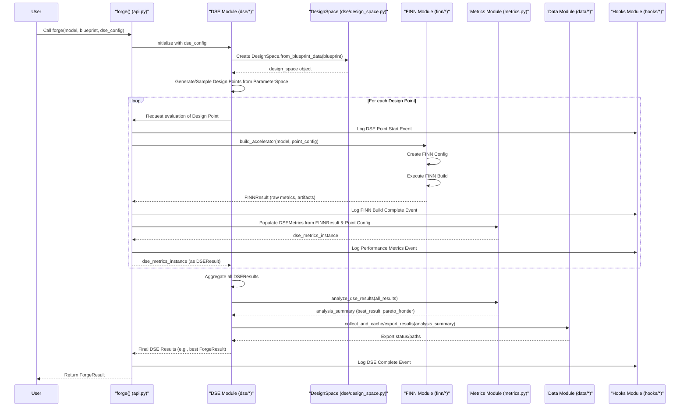
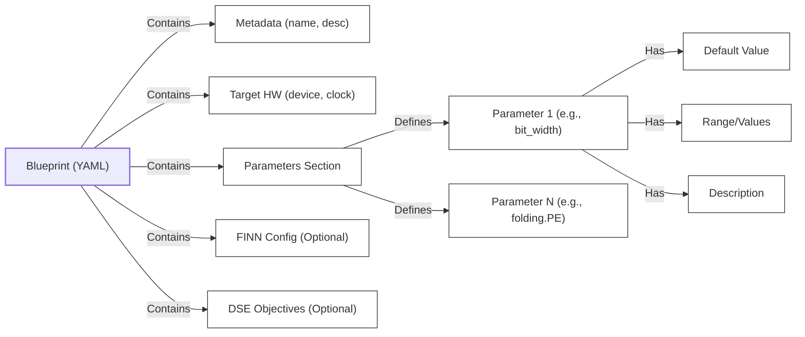
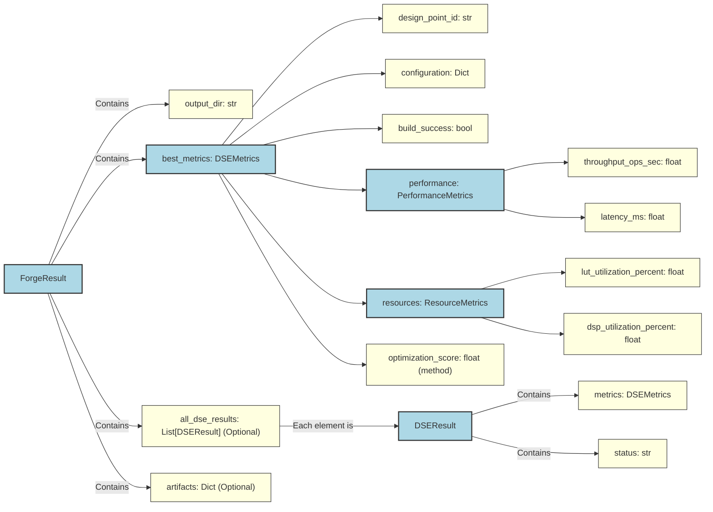

# BrainSmith Core Documentation

## 1. Introduction

**BrainSmith Core is the foundational engine for generating and exploring FPGA accelerator designs, enabling a streamlined workflow from high-level model descriptions to hardware implementations.** It provides the essential tools to define, explore, and evaluate a vast space of potential accelerator configurations, aiming to simplify and automate the complex process of hardware design.

The primary goal of BrainSmith Core is to empower users to efficiently discover optimal hardware solutions for their machine learning models. It achieves this by integrating with ONNX model formats and leveraging YAML-based "blueprints" to specify accelerator architectures, parameters, and design space exploration objectives. This approach allows for a high degree of customization and automation in the accelerator design process.

*(Source: `brainsmith/core/DESIGN.md`, `brainsmith/core/__init__.py`)*

### 1.1. What is BrainSmith Core?

BrainSmith Core is a Python-based toolkit specifically engineered for the design space exploration (DSE) and automated generation of FPGA-based hardware accelerators. It takes a machine learning model (typically in ONNX format) and a user-defined blueprint as input. The blueprint outlines the architectural choices, parameter ranges, and optimization goals. BrainSmith Core then systematically explores these choices, often by invoking backend tools like the FINN compiler, to generate and evaluate different hardware designs. The ultimate output is a set of potential accelerator implementations, along with their performance and resource metrics, allowing users to select the best fit for their needs.

*(Source: `brainsmith/core/api.py`, `brainsmith/core/dse/design_space.py`)*

### 1.2. Core Philosophy: Functions Over Frameworks

BrainSmith Core is built upon a "Functions Over Frameworks" philosophy. This means it prioritizes a lean, understandable, and composable set of core functionalities rather than a monolithic, opaque framework. The emphasis is on providing clear, well-defined functions and classes that users can understand and combine to build complex workflows. This approach promotes transparency and makes the system easier to debug, maintain, and extend. Extensibility is a key aspect, achieved through well-defined interfaces for hooks and plugins, allowing users to add custom logic or integrate new tools without modifying the core system.

*(Source: `brainsmith/core/DESIGN.md`)*

### 1.3. Key Features

*   Blueprint-Driven Design: Utilizes YAML blueprints to define accelerator architectures and DSE parameters.
*   Automated Design Space Exploration (DSE): Supports various strategies (e.g., parameter sweeps, random sampling) to explore different design points.
*   FINN Compiler Integration: Leverages the FINN compiler for transforming, optimizing, and generating hardware from ONNX models.
*   Comprehensive Metrics Collection: Gathers detailed performance (throughput, latency) and resource utilization (LUTs, DSPs, BRAMs) metrics for each design.
*   Extensible Hooks System: Allows users to inject custom logic at various stages of the DSE and build process via an event-driven mechanism.
*   Modular Architecture: Composed of distinct modules for API, DSE, FINN integration, metrics, data management, and hooks.
*   Command-Line Interface (CLI): Provides CLI access for core operations like `forge` and blueprint validation.

*(Source: `brainsmith/core/__init__.py`, `brainsmith/core/api.py`, `brainsmith/core/dse/interface.py`, `brainsmith/core/finn/interface.py`, `brainsmith/core/metrics.py`)*

### 1.4. Who is this documentation for?

This documentation is intended for:

*   Hardware Engineers and Researchers: Looking to automate the design and exploration of FPGA accelerators for machine learning models.
*   Software Engineers: Working on ML model deployment who need to understand the capabilities and interfaces for generating hardware.
*   System Architects: Evaluating different hardware solutions and needing to understand the DSE process and resulting metrics.
*   Contributors to BrainSmith: Seeking to understand the internal architecture and extend its capabilities.

A basic understanding of machine learning concepts, FPGA architecture, and Python programming will be beneficial.

## 2. Architecture

**BrainSmith Core is architected as a modular system, with distinct components responsible for API interactions, design space exploration, compiler integration, metrics handling, data management, and extensibility through hooks.** This separation of concerns promotes clarity and maintainability.

*(Source: `brainsmith/core/DESIGN.md`)*

### 2.1. High-Level Overview

The following diagram illustrates the major components of BrainSmith Core and their primary interactions during the `forge` process:

```mermaid
graph TD
    subgraph User Interaction
        CLI["CLI (`brainsmith.core.cli`)"]
        ForgeAPI["`forge()` (`brainsmith.core.api`)"]
    end

    subgraph Core Orchestration
        DSE["DSE Module (`brainsmith.core.dse`)"]
        FINN["FINN Integration (`brainsmith.core.finn`)"]
        MetricsMod["Metrics Module (`brainsmith.core.metrics`)"]
        DataMgmt["Data Management (`brainsmith.core.data`)"]
        HooksMod["Hooks & Extensibility (`brainsmith.core.hooks`)"]
    end

    Blueprint["Blueprint (YAML)"]
    ONNXModel["ONNX Model"]
    Results["Results (Metrics, Artifacts)"]

    CLI --> ForgeAPI
    ForgeAPI -- Blueprint & ONNX --> DSE
    ForgeAPI -- Blueprint & ONNX --> FINN
    
    DSE -- Uses Blueprint --> Blueprint
    DSE -- Iterates Design Points --> ForgeAPI
    DSE -- Manages --> DesignSpaceParams["DesignSpace / Parameters"]
    
    FINN -- Uses Blueprint Config --> Blueprint
    FINN -- Processes --> ONNXModel
    FINN -- Generates HW & Raw Metrics --> MetricsMod
    
    MetricsMod -- Collects & Analyzes --> DSEMetricsData["DSEMetrics"]
    MetricsMod -- Stores/Exports via --> DataMgmt
    
    DataMgmt -- Manages --> Results
    
    ForgeAPI -- Triggers Events --> HooksMod
    DSE -- Triggers Events --> HooksMod
    FINN -- Triggers Events --> HooksMod
    MetricsMod -- Triggers Events --> HooksMod
    
    ForgeAPI --> Results

    classDef user fill:#c9d,stroke:#333,stroke-width:2px;
    classDef core fill:#9cf,stroke:#333,stroke-width:2px;
    classDef data fill:#f9c,stroke:#333,stroke-width:2px;

    class CLI,ForgeAPI user;
    class DSE,FINN,MetricsMod,DataMgmt,HooksMod core;
    class Blueprint,ONNXModel,Results,DesignSpaceParams,DSEMetricsData data;
```

At its heart, the `forge()` function in `brainsmith.core.api` acts as the main orchestrator. It takes an ONNX model and a blueprint, then leverages the DSE module to explore different configurations. For each configuration (design point), it uses the FINN integration module to attempt a hardware build. The Metrics module collects and processes data from these builds, which is then managed by the Data Management module. The Hooks system allows for observation and custom actions throughout this process.

*(Source: `brainsmith/core/api.py`, `brainsmith/core/DESIGN.md`)*

### 2.2. Major Components

#### 2.2.1. Core API (`brainsmith.core.api`)
The Core API is the primary programmatic entry point into BrainSmith Core.
*   **`forge(model_path: str, blueprint_path: str, output_dir: str, dse_config: Optional[DSEConfiguration] = None, ...) -> ForgeResult`**: This is the North Star function. It orchestrates the entire process: loading the ONNX model and blueprint, performing design space exploration (if `dse_config` is provided), invoking the FINN compiler for each design point, collecting metrics, and returning the results. `ForgeResult` typically contains information about the best design found, paths to build artifacts, and DSE metrics.
*   **`validate_blueprint(blueprint_path: str) -> Tuple[bool, List[str]]`**: This function parses a given blueprint file and checks its structure and content for common errors or inconsistencies, returning a validation status and a list of any issues found.

*(Source: `brainsmith/core/api.py`)*

#### 2.2.2. Command Line Interface (`brainsmith.core.cli`)
The CLI provides command-line access to the core functionalities, making BrainSmith Core usable in scripting environments. It uses the `click` library to define commands.
*   **`brainsmith-core forge`**: Exposes the `forge()` function, allowing users to specify the model, blueprint, output_dir, and other options via command-line arguments.
*   **`brainsmith-core validate-blueprint`**: Exposes the `validate_blueprint()` function.

*(Source: `brainsmith/core/cli.py`)*

#### 2.2.3. Design Space Exploration (DSE) Module (`brainsmith.core.dse`)
This module is central to exploring different hardware configurations.
*   **Blueprints**: YAML files are the primary way users define the search space. They specify parameter ranges (e.g., bit-widths, parallelism factors), constraints, and optimization objectives (e.g., maximize throughput, minimize LUTs). *(Source: `brainsmith/libraries/blueprints/*` (examples), `brainsmith/core/dse/blueprint_functions.py`)*
*   **`DesignSpace` (`brainsmith.core.dse.design_space.py`)**: This class represents the multidimensional space of all possible design configurations as defined by a blueprint. It parses blueprint parameters (including nested ones) into `ParameterDefinition` objects. Key methods include `from_blueprint_data()` to load from a parsed blueprint, `to_parameter_space()` to get a dictionary of parameters and their possible values, and `sample_points()` for random sampling. A `DesignPoint` represents a specific configuration within this space.
*   **`DSEInterface` (`brainsmith.core.dse.interface.py`)**: This class acts as the main user-facing interface for running DSE. It takes a `DSEConfiguration` object and orchestrates the exploration process using the DSE engine. It provides methods like `explore_design_space()` and `get_pareto_frontier()`.
*   **DSE Engine (`brainsmith.core.dse.engine.py`)**: Contains the algorithmic core for DSE. It implements strategies like `parameter_sweep` (evaluating all combinations in a grid) and `batch_evaluate`. It also includes functions like `find_best_result` based on specified objectives.
*   **Key Data Structures (`brainsmith.core.dse.types.py`)**:
    *   `DSEConfiguration`: Defines how a DSE run should be performed, including the `ParameterSpace`, `SamplingStrategy` (e.g., `RANDOM`, `GRID`), `DSEObjective`s, and maximum evaluations.
    *   `DSEResult`: Stores the outcome of evaluating a single design point, including the `DSEMetrics` and build status.
    *   `DSEObjective`: Specifies a goal for the DSE, like maximizing `throughput_ops_sec` or minimizing `lut_utilization_percent`.

*(Source: `brainsmith/core/dse/*`)*
#### 2.2.4. FINN Integration Module (`brainsmith.core.finn`)
This module serves as the bridge to the FINN compiler, which is responsible for the low-level hardware generation tasks.
*   **`FINNInterface` (`brainsmith.core.finn.interface.py` wrapping `brainsmith.core.finn.finn_interface.py`)**: This class provides a simplified and abstracted interface to FINN. The core logic resides in `finn_interface.py`, which takes blueprint configurations (e.g., target device, clock period, folding parameters) and an ONNX model, translates them into a FINN `DataflowBuildConfig`, and then invokes the `build_dataflow` process from the FINN library. This process includes steps like ONNX to FINN model conversion, streamlining, HLS generation, IP stitching, and potentially synthesis and bitstream generation.
*   **4-Hooks Preparation**: The interface includes stubs and configurations (`FINNHooksConfig`, `FINNHooks`) in preparation for a future, more granular "4-hooks" FINN interface (preprocessing, transformation, optimization, generation), aiming for finer control over the FINN build flow.
*   **Key Data Structures (`brainsmith.core.finn.types.py`)**:
    *   `FINNConfig`: Represents the configuration passed to the FINN build process, derived from the blueprint.
    *   `FINNResult`: Encapsulates the outcome of a FINN build, including success status, paths to generated artifacts (like RTL or HLS files), and raw performance/resource estimates from FINN.

*(Source: `brainsmith/core/finn/interface.py`, `brainsmith/core/finn/finn_interface.py`, `brainsmith/core/finn/types.py`)*

#### 2.2.5. Metrics Module (`brainsmith.core.metrics`)
This module defines and manages the metrics used to evaluate different accelerator designs generated during DSE.
*   **`DSEMetrics`**: This is the central dataclass for storing all relevant metrics for a single design point. It aggregates:
    *   `PerformanceMetrics`: Includes `throughput_ops_sec`, `latency_ms`, `clock_frequency_mhz`, etc.
    *   `ResourceMetrics`: Includes `lut_utilization_percent`, `dsp_utilization_percent`, `bram_utilization_percent`, `estimated_power_w`, etc.
    *   Build status (`build_success`, `build_time_seconds`).
    *   The `configuration` (parameters) of the design point.
*   **Metrics Calculation and Analysis**: The module provides functions to:
    *   Calculate an overall `optimization_score` for ranking designs.
    *   Compare different `DSEMetrics` instances (`compare_metrics`).
    *   Analyze a list of DSE results to find the best performing points, calculate Pareto frontiers (`get_pareto_frontier`), and generate summary statistics (`analyze_dse_results`).
    *   Generate human-readable reports (`generate_metrics_report`).

*(Source: `brainsmith/core/metrics.py`)*

#### 2.2.6. Data Management Module (`brainsmith.core.data`)
This module handles the collection, storage, processing, and export of data generated throughout the DSE process.
*   **Collection (`brainsmith.core.data.collection.py`)**: Functions like `collect_dse_metrics` and `collect_build_metrics` gather raw data from build processes and DSE runs, structuring it into defined types.
*   **Export (`brainsmith.core.data.export.py`)**: Provides utilities to export collected metrics, summaries, Pareto frontiers, and analysis results into various formats (e.g., JSON, CSV), facilitating external analysis and reporting. Examples include `export_metrics` and `export_dse_analysis`.
*   **Management (`brainsmith.core.data.management.py`)**: Features a `DataManager` class for more sophisticated data handling, including caching of results, batch processing, and potentially data lifecycle management (e.g., `cleanup_old_cache`).
*   **Types (`brainsmith.core.data.types.py`)**: Defines various data structures like `BuildMetrics`, `PerformanceData`, `ResourceData`, `DataSummary`, and `MetricsData` to ensure consistent data representation.

*(Source: `brainsmith/core/data/*`)*

#### 2.2.7. Hooks and Extensibility Module (`brainsmith.core.hooks`)
BrainSmith Core incorporates an event-driven hooks system to allow for observation and extension of its core processes without modifying the core code.
*   **Events (`brainsmith.core.hooks.events.py`)**: The system allows various components to `log_optimization_event` at critical points (e.g., `parameter_change`, `performance_metric` reported, `dse_event` like stage completion). An `EventRegistry` manages these events.
*   **Event Handlers (`brainsmith.core.hooks.types.py`, `brainsmith.core.hooks.events.py`)**: Users can define custom `EventHandler` classes that subscribe to specific event types or all events. These handlers can then perform custom actions, such as logging to a database, triggering alerts, or performing advanced analytics. Basic handlers like `ConsoleHandler` and `MemoryHandler` are provided.
*   **Plugin System (`brainsmith.core.hooks.plugins/*`, `brainsmith.core.hooks.registry.py`)**: The architecture supports `HooksPlugin`s, which can bundle multiple event handlers and provide more complex, installable functionalities. A `HooksRegistry` is responsible for discovering and managing these plugins. While the infrastructure is present, advanced plugins are mostly illustrative examples for future development.

*(Source: `brainsmith/core/hooks/*`)*

#### 2.2.8. Registry Infrastructure (`brainsmith.core.registry`)
This module provides a foundational, generic system for creating and managing registries of components.
*   **`BaseRegistry` (`brainsmith.core.registry.base.py`)**: An abstract base class that defines a standard interface for component registries, including methods for component discovery, retrieval, validation, and health checking.
*   **`ComponentInfo` (`brainsmith.core.registry.base.py`)**: An abstract base class for objects that provide metadata about registered components.
*   This infrastructure is currently utilized by the `HooksRegistry` to manage hook plugins and handlers, ensuring a consistent approach to component management within BrainSmith.

*(Source: `brainsmith/core/registry/*`)*

### 2.3. Typical Data Flow

The following sequence diagram illustrates a simplified data flow for a typical `forge()` operation involving Design Space Exploration:



**Flow Explanation:**

1.  **Initiation**: The user calls `forge()` via the API or CLI, providing an ONNX model, a blueprint YAML, and optionally a DSE configuration.
2.  **Blueprint & Design Space Setup**: `forge()` (or the DSE module it invokes) parses the blueprint. The `DesignSpace` class is used to understand the parameters and their ranges defined in the blueprint.
3.  **DSE Loop (if active)**:
    *   The `DSEInterface` and `DSEEngine` collaborate to select or generate design points based on the `DSEConfiguration` (e.g., sweeping through a grid or random sampling).
    *   For each `DesignPoint`:
        *   The specific parameter values are applied.
        *   The `FINNInterface.build_accelerator()` method is called. This involves translating the current design point's configuration into a FINN-specific build configuration.
        *   The FINN compiler is invoked, attempting to generate the hardware. It produces raw metrics (e.g., resource estimates from HLS, cycle counts) and paths to build artifacts. This is encapsulated in a `FINNResult`.
        *   The `FINNResult` and the current `DesignPoint` configuration are used by the `MetricsModule` to create a comprehensive `DSEMetrics` object. This object standardizes metrics and may calculate derived values like an optimization score.
        *   Events (e.g., build completion, metrics available) are logged via the `HooksModule`.
        *   The `DSEMetrics` object is returned to the DSE engine as part of a `DSEResult`.
4.  **Results Aggregation & Analysis**: After all design points are evaluated (or if only a single point was run), the DSE module aggregates all `DSEResult` objects.
    *   The `MetricsModule` can then be used to perform further analysis, such as identifying the best overall result based on primary objectives or calculating the Pareto frontier for multi-objective optimization.
5.  **Data Management**: The `DataModule` can be used to save/export the collected metrics, analysis summaries, or even individual design point results.
6.  **Return Value**: The `forge()` function returns a `ForgeResult`, which typically includes the best `DSEMetrics` found, paths to the corresponding build artifacts, and potentially a summary of the DSE run.

Throughout this process, the `HooksModule` allows for various events to be captured, enabling custom logging, monitoring, or even influencing the DSE process if advanced plugins are developed.

*(Source: Synthesized from `brainsmith/core/api.py`, `brainsmith/core/dse/*`, `brainsmith/core/finn/*`, `brainsmith/core/metrics.py`, `brainsmith/core/hooks/events.py`)*
## 3. Getting Started & Usage

**This section guides you through the initial setup and basic usage patterns of BrainSmith Core, enabling you to quickly generate your first FPGA accelerator and understand how to perform design space exploration.** We'll cover using the primary `forge` function, interacting with the CLI, working with blueprints, and interpreting results.

*(Source: `brainsmith/core/api.py`, `brainsmith/core/cli.py`)*

### 3.1. Installation

(This section would typically link to a main installation guide for the entire BrainSmith project. For BrainSmith Core specifically, it's a Python package.)

BrainSmith Core is a Python package. Ensure you have Python installed (typically version 3.8+). You would usually install BrainSmith as part of a larger project setup. If installing BrainSmith Core directly (e.g., for development or specific use cases), you might use pip:

```bash
# Placeholder: Actual installation might involve a requirements.txt or setup.py
pip install brainsmith-core 
# Or if part of a larger BrainSmith suite:
# pip install brainsmith
```
Ensure that dependencies, especially the FINN compiler and its requirements (like Docker if FINN is run in a containerized environment), are correctly set up according to the main BrainSmith project documentation.

*(Source: General Python package practices; specific instructions would depend on the project's distribution method.)*

### 3.2. Basic Accelerator Generation

The most direct way to generate an FPGA accelerator is by using the `brainsmith.core.forge()` function. This function requires the path to your ONNX model and a YAML blueprint file that defines the accelerator's architecture and parameters.

**Core Concept: The `forge()` function orchestrates model processing, hardware generation via FINN, and metrics collection for a single design point or an entire DSE run.**

```python
from brainsmith.core import forge
from brainsmith.core.api import ForgeResult # For type hinting, if needed
from brainsmith.core.dse.types import DSEConfiguration # If running DSE

# Define paths to your model and blueprint
onnx_model_path = "path/to/your_model.onnx"
blueprint_path = "path/to/your_accelerator_blueprint.yaml"
output_directory = "./brainsmith_output"

# Example 1: Forging a single design point (using defaults from blueprint)
try:
    print(f"🚀 Starting accelerator forging for {onnx_model_path}...")
    # Not passing dse_config means it will use the blueprint's default parameters
    # or a single point if the blueprint defines one.
    result: ForgeResult = forge(
        model_path=onnx_model_path,
        blueprint_path=blueprint_path,
        output_dir=output_directory
    )

    if result and result.best_metrics and result.best_metrics.build_success:
        print(f"✅ Accelerator generation successful!")
        print(f"   Output directory: {result.output_dir}")
        print(f"   Design Point ID: {result.best_metrics.design_point_id}")
        print(f"   Throughput: {result.best_metrics.performance.throughput_ops_sec} ops/sec")
        print(f"   LUT Utilization: {result.best_metrics.resources.lut_utilization_percent}%")
        # Access other metrics and artifact paths from result.best_metrics or result.artifacts
    elif result and result.best_metrics:
        print(f"⚠️ Accelerator generation completed but build failed.")
        print(f"   Output directory: {result.output_dir}")
        print(f"   Error message: {result.best_metrics.error_message if hasattr(result.best_metrics, 'error_message') else 'N/A'}")
    else:
        print(f"❌ Accelerator generation failed or no result returned.")

except Exception as e:
    print(f"An error occurred during forging: {e}")

# Example 2: Forging with a simple DSE (details in DSE section)
# This requires defining a DSEConfiguration, which is covered later.
# For now, this is a conceptual placeholder.
# dse_config = DSEConfiguration(...) 
# dse_results = forge(
# model_path=onnx_model_path,
# blueprint_path=blueprint_path,
# output_dir=output_directory,
# dse_config=dse_config
# )
# print(f"DSE completed. Best throughput: {dse_results.best_result.get_objective_value('performance.throughput_ops_sec')}")

```
The `forge()` function will create the specified `output_dir` and populate it with build artifacts, logs, and metric reports from the FINN build process and BrainSmith's own metric collection. The returned `ForgeResult` object provides access to the `DSEMetrics` of the generated design (or the best design if DSE was run) and paths to important artifacts.

*(Source: `brainsmith/core/api.py`)*

### 3.3. Using the Command Line Interface (CLI)

BrainSmith Core provides a CLI for quick access to its main functions.

**Core Concept: The CLI offers a scriptable way to invoke `forge` and `validate_blueprint` without writing Python code.**

To generate an accelerator:
```bash
brainsmith-core forge \
    --model-path path/to/your_model.onnx \
    --blueprint-path path/to/your_accelerator_blueprint.yaml \
    --output-dir ./brainsmith_cli_output
```

To validate a blueprint:
```bash
brainsmith-core validate-blueprint \
    --blueprint-path path/to/your_accelerator_blueprint.yaml
```
The CLI will print status messages and the location of output files or validation results to the console. You can see all available options using `brainsmith-core forge --help` or `brainsmith-core validate-blueprint --help`.

*(Source: `brainsmith/core/cli.py`)*

### 3.4. Working with Blueprints

Blueprints are YAML files that define the target accelerator's architecture, its configurable parameters, and (optionally) DSE objectives. They are crucial for guiding BrainSmith Core.

**Core Concept: Blueprints are the user's primary means of specifying the desired hardware characteristics and the scope of design exploration.**

A typical blueprint might include sections for:
*   `name`: A descriptive name for the blueprint.
*   `description`: A brief explanation.
*   `target_device`: The FPGA part name (e.g., `U250`).
*   `clock_period`: Target clock period in nanoseconds.
*   `parameters`: This section defines the design parameters that can be varied.
    *   Parameters can be simple values, ranges, or lists of categorical choices.
    *   Nested structures can be used for organization (e.g., `bert_config.num_attention_heads`, `folding_factors.PE`).
    *   Example parameter definition:
        ```yaml
        parameters:
          target_device:
            default: "U250"
            description: "Target Xilinx FPGA device (e.g., U250, ZCU104)."
          global_bit_width:
            default: 8
            range: [4, 8, 16] # Or values: [4, 8, 16]
            description: "Global bit width for weights and activations."
          folding_factors:
            description: "Parallelization factors for different layers/operations."
            PE: # Parallelization Elements
              default: 16
              values: [8, 16, 32]
            SIMD: # Single Instruction, Multiple Data
              default: 8
              values: [4, 8, 16]
        ```
*   `finn_config` (optional): Specific configurations to be passed directly to the FINN `DataflowBuildConfig`.
*   `dse_objectives` (optional): Defines goals for DSE, e.g.:
    ```yaml
    dse_objectives:
      - name: "performance.throughput_ops_sec"
        direction: "maximize"
        weight: 0.6
      - name: "resources.lut_utilization_percent"
        direction: "minimize"
        weight: 0.4
    ```

**Blueprint Structure Overview:**


**Validation:**
Before running a potentially long `forge` process, it's good practice to validate your blueprint:
```python
from brainsmith.core.api import validate_blueprint

is_valid, errors = validate_blueprint("path/to/your_accelerator_blueprint.yaml")
if is_valid:
    print("Blueprint is valid!")
else:
    print("Blueprint validation failed:")
    for error in errors:
        print(f"  - {error}")
```
Or via CLI:
```bash
brainsmith-core validate-blueprint --blueprint-path path/to/your_accelerator_blueprint.yaml
```

*(Source: `brainsmith/core/dse/design_space.py` for parameter extraction logic, `brainsmith/core/api.py` for validation, example blueprints in `brainsmith/libraries/blueprints/`)*

### 3.5. Performing Design Space Exploration (DSE)

DSE allows BrainSmith Core to automatically explore multiple design configurations based on the parameters and objectives defined in your blueprint.

**Core Concept: DSE automates the search for optimal designs by systematically varying parameters and evaluating each resulting configuration.**

The process of setting up and running DSE involves:
1.  Ensuring your blueprint defines parameter ranges or lists of values.
2.  Creating a `DSEConfiguration` object in your Python script.
3.  Passing this configuration to the `forge()` function.

**DSE Configuration Flow:**
```mermaid
graph TD
    A[Blueprint with Parameter Ranges] --> B(Load Blueprint in Python)
    B --> C{Parse with `DesignSpace.from_blueprint_data()`}
    C --> D[Extract `ParameterSpace` via `design_space.to_parameter_space()`]
    E[Define `DSEObjective`s (e.g., Maximize Throughput)] --> F
    D --> F(Create `DSEConfiguration`)
    F -- Pass to --> G["`forge(..., dse_config=DSEConfiguration)`"]
    G --> H[DSE Process Runs]
    H --> I[Receive `ForgeResult` with DSE Summary]
    
    classDef step fill:#lightgreen,stroke:#333,stroke-width:2px;
    classDef input fill:#lightblue,stroke:#333,stroke-width:2px;
    classDef output fill:#pink,stroke:#333,stroke-width:2px;

    class A,E input;
    class B,C,D,F,G,H step;
    class I output;
```

```python
from brainsmith.core import forge
from brainsmith.core.api import ForgeResult
from brainsmith.core.dse.types import (
    DSEConfiguration, 
    DSEObjective, 
    OptimizationObjective, 
    SamplingStrategy,
    ParameterSpace # Though often derived from blueprint by DesignSpace
)
from brainsmith.core.dse.design_space import DesignSpace # To load parameters from blueprint

onnx_model_path = "path/to/your_model.onnx"
blueprint_path = "path/to/your_dse_blueprint.yaml" # Blueprint with parameter ranges
output_directory = "./brainsmith_dse_output"

# 1. Load design space from blueprint to get parameter definitions
# The DesignSpace class handles parsing parameters from the blueprint.
# The terminal output from the user's environment shows this in action.
# For DSEConfiguration, we often need the ParameterSpace representation.
import yaml
with open(blueprint_path, 'r') as f:
    blueprint_data = yaml.safe_load(f)
design_space = DesignSpace.from_blueprint_data(blueprint_data)
parameter_space_for_dse: ParameterSpace = design_space.to_parameter_space()

# 2. Define DSE Objectives (can also be partly inferred from blueprint)
objectives = [
    DSEObjective(name="performance.throughput_ops_sec", direction=OptimizationObjective.MAXIMIZE, weight=0.7),
    DSEObjective(name="resources.lut_utilization_percent", direction=OptimizationObjective.MINIMIZE, weight=0.3)
]

# 3. Create DSE Configuration
# If parameter_space is not provided, DSEInterface might try to infer it from blueprint_path.
# However, explicitly creating it from DesignSpace is clearer.
dse_config = DSEConfiguration(
    blueprint_path=blueprint_path, # Still useful for non-parameter aspects of blueprint
    parameter_space=parameter_space_for_dse,
    objectives=objectives,
    sampling_strategy=SamplingStrategy.GRID, # Or RANDOM, LHS, etc.
    max_evaluations=20 # Limit the number of points to explore
)

# 4. Run forge with DSE
try:
    print(f"🚀 Starting DSE for {onnx_model_path}...")
    dse_result_summary: ForgeResult = forge(
        model_path=onnx_model_path,
        blueprint_path=blueprint_path, # forge uses this for base config
        output_dir=output_directory,
        dse_config=dse_config
    )

    if dse_result_summary and dse_result_summary.best_metrics:
        print(f"✅ DSE completed!")
        print(f"   Best Design Point ID: {dse_result_summary.best_metrics.design_point_id}")
        print(f"   Best Throughput: {dse_result_summary.best_metrics.performance.throughput_ops_sec} ops/sec")
        print(f"   Corresponding LUTs: {dse_result_summary.best_metrics.resources.lut_utilization_percent}%")
        # Access dse_result_summary.all_dse_results for metrics of all explored points
        if dse_result_summary.all_dse_results:
             print(f"   Total points evaluated: {len(dse_result_summary.all_dse_results)}")

    else:
        print(f"❌ DSE failed or no results.")

except Exception as e:
    print(f"An error occurred during DSE: {e}")

```
The `DSEInterface` (used internally by `forge` when `dse_config` is present) will use the `parameter_space` and `sampling_strategy` to generate and evaluate multiple design points. The `output_dir` will contain subdirectories for each evaluated point, along with summary reports.

*(Source: `brainsmith/core/dse/interface.py`, `brainsmith/core/dse/types.py`, `brainsmith/core/dse/design_space.py`, `brainsmith/core/api.py`)*

### 3.6. Understanding Results and Metrics

After a `forge` run (either single point or DSE), the results are crucial for understanding the outcome.

**Core Concept: `DSEMetrics` provides a standardized structure for performance, resource, and build information, forming the basis for design evaluation.**

The `ForgeResult` object returned by `forge()` is key to accessing these results.

**Structure of `ForgeResult` and `DSEMetrics`:**


*   **Single Point Forging**: The `ForgeResult.best_metrics` (which is just the metrics for that single point) will be a `DSEMetrics` object.
    ```python
    # Assuming 'result' is the ForgeResult from a single forge call
    if result.best_metrics.build_success:
        metrics = result.best_metrics
        print(f"Throughput: {metrics.performance.throughput_ops_sec}")
        print(f"Latency: {metrics.performance.latency_ms}")
        print(f"LUTs: {metrics.resources.lut_utilization_percent}%")
        print(f"Optimization Score: {metrics.get_optimization_score()}")
    ```
*   **DSE Run**: `ForgeResult.best_metrics` will contain the `DSEMetrics` of the highest-ranking design based on the objectives. `ForgeResult.all_dse_results` (if populated by the DSE process) will be a list of `DSEResult` objects, each containing `DSEMetrics` for every evaluated point.
    ```python
    # Assuming 'dse_result_summary' is the ForgeResult from a DSE run
    if dse_result_summary.all_dse_results:
        for res_item in dse_result_summary.all_dse_results: # DSEResult items
            point_metrics = res_item.metrics # This is a DSEMetrics object
            if point_metrics.build_success:
                print(f"Point: {point_metrics.design_point_id}, Score: {point_metrics.get_optimization_score():.3f}")
    
    # Analyze further using functions from brainsmith.core.metrics
    from brainsmith.core.metrics import analyze_dse_results, get_pareto_frontier
    
    # Extract DSEMetrics from DSEResults for analysis functions
    all_metrics_objects = [r.metrics for r in dse_result_summary.all_dse_results if r.metrics]
    
    if all_metrics_objects:
        analysis = analyze_dse_results(all_metrics_objects)
        print(f"\nOverall DSE Analysis:")
        print(f"  Total runs: {analysis['total_runs']}")
        print(f"  Successful builds: {analysis['successful_builds']}")
        if analysis['best_metrics']:
             print(f"  Best Score (from analysis): {analysis['best_metrics'].get_optimization_score():.3f}")

        pareto_points = get_pareto_frontier(all_metrics_objects)
        print(f"  Pareto frontier contains {len(pareto_points)} points.")
    ```

**Output Directory Structure:**
The `output_dir` specified in `forge` will typically contain:
*   A summary report (e.g., `dse_summary.json` or `metrics_report.txt`).
*   Subdirectories for each design point evaluated (e.g., `design_0`, `design_1`, ...), containing:
    *   FINN build artifacts (logs, HLS files, RTL, bitstream if generated).
    *   Specific metrics files for that point.

*(Source: `brainsmith/core/metrics.py`, `brainsmith/core/api.py`, `brainsmith/core/data/export.py` for how data might be saved)*

### 3.7. Logging and Monitoring

BrainSmith Core uses Python's standard `logging` module. You can configure logging to control the verbosity and destination of log messages.

The **Hooks System** (`brainsmith.core.hooks`) provides a more structured way to monitor specific events during the DSE and build process.
```python
from brainsmith.core.hooks import log_optimization_event, register_event_handler, EventTypes
from brainsmith.core.hooks.types import OptimizationEvent, EventHandler
import logging

# Configure basic logging for BrainSmith
logging.basicConfig(level=logging.INFO)
logger = logging.getLogger('brainsmith') # Get the root brainsmith logger
logger.setLevel(logging.DEBUG) # More verbose for brainsmith components

# Example: A custom event handler
class MyCustomEventHandler(EventHandler):
    def should_handle(self, event: OptimizationEvent) -> bool:
        # Handle only performance metrics and DSE stage events
        return event.event_type == EventTypes.PERFORMANCE_METRIC or \
               event.event_type == EventTypes.DSE_EVENT

    def handle_event(self, event: OptimizationEvent) -> None:
        if event.event_type == EventTypes.PERFORMANCE_METRIC:
            print(f"[Custom Handler] Perf Metric: {event.data.get('metric')} = {event.data.get('value')}")
        elif event.event_type == EventTypes.DSE_EVENT:
            print(f"[Custom Handler] DSE Event: Stage '{event.data.get('stage')}', Data: {event.data}")

# Register the handler
# Note: The HooksRegistry might need to be initialized or accessed via get_hooks_registry()
# For simplicity, assuming direct registration if available at top-level hooks init
try:
    custom_handler = MyCustomEventHandler()
    register_event_handler(EventTypes.PERFORMANCE_METRIC, custom_handler) # Specific
    register_event_handler(EventTypes.DSE_EVENT, custom_handler) # Specific
    # Or for all events: register_global_handler(custom_handler)
    print("Custom event handler registered.")
except Exception as e:
    print(f"Could not register custom handler: {e}")


# During a forge call, if events are emitted, the handler would print messages.
# For example, if brainsmith.core.metrics.log_performance_metric is called internally.
# Or if brainsmith.core.hooks.log_dse_event is called.
```
By default, a `MemoryHandler` and `ConsoleHandler` (if logging is configured appropriately) might already be active, capturing events. You can retrieve events using `get_recent_events()` or `get_events_by_type()` from `brainsmith.core.hooks`.

*(Source: `brainsmith/core/hooks/events.py`, `brainsmith/core/hooks/types.py`)*
## 4. API Reference

**This section provides a detailed reference for the key public APIs, classes, and data structures within BrainSmith Core.** It is intended for users who need to interact with the core components programmatically or understand their specific functionalities in depth.

*(Source: Primarily from the Python source files in `brainsmith/core/`)*

### 4.1. `brainsmith.core.api`

The `brainsmith.core.api` module provides the main high-level entry points for using BrainSmith Core.

**Core Concept: This module offers the simplest way to initiate accelerator generation and DSE processes.**

#### Functions

*   **`forge(model_path: str, blueprint_path: str, output_dir: str, dse_config: Optional[DSEConfiguration] = None, finn_config_override: Optional[FINNConfig] = None, hooks_config: Optional[HooksConfiguration] = None, data_manager_config: Optional[DataManagerConfig] = None, existing_data_manager: Optional[DataManager] = None, existing_hooks_registry: Optional[HooksRegistry] = None) -> ForgeResult`**

    The primary function to generate an accelerator or run a Design Space Exploration.

    *   **Parameters:**
        *   `model_path (str)`: Path to the ONNX model file.
        *   `blueprint_path (str)`: Path to the YAML blueprint file.
        *   `output_dir (str)`: Directory where all outputs (logs, artifacts, reports) will be saved.
        *   `dse_config (Optional[DSEConfiguration])`: Configuration for Design Space Exploration. If `None`, a single design point (typically from blueprint defaults) is evaluated.
        *   `finn_config_override (Optional[FINNConfig])`: Allows overriding specific FINN configurations.
        *   `hooks_config (Optional[HooksConfiguration])`: Configuration for the hooks system (e.g., enabling specific handlers).
        *   `data_manager_config (Optional[DataManagerConfig])`: Configuration for the data manager.
        *   `existing_data_manager (Optional[DataManager])`: An existing `DataManager` instance to use.
        *   `existing_hooks_registry (Optional[HooksRegistry])`: An existing `HooksRegistry` instance to use.
    *   **Returns:**
        *   `ForgeResult`: An object containing the results of the forging process, including the best metrics found and paths to artifacts.
    *   **Key Operations:**
        1.  Loads and validates the blueprint.
        2.  Initializes DSE if `dse_config` is provided, using `DSEInterface`.
        3.  For each design point (or a single point):
            *   Constructs the specific design parameters.
            *   Invokes `brainsmith.core.finn.interface.build_accelerator`.
            *   Collects `DSEMetrics`.
            *   Logs events via the hooks system.
        4.  Aggregates results and returns the `ForgeResult`.

    *(Source: `brainsmith/core/api.py`)*

*   **`validate_blueprint(blueprint_path: str) -> Tuple[bool, List[str]]`**

    Validates the structure and content of a blueprint YAML file.

    *   **Parameters:**
        *   `blueprint_path (str)`: Path to the YAML blueprint file.
    *   **Returns:**
        *   `Tuple[bool, List[str]]`: A tuple where the first element is `True` if the blueprint is valid, `False` otherwise. The second element is a list of error or warning messages.
    *   **Key Operations:**
        1.  Loads the YAML file.
        2.  Checks for mandatory sections and common structural issues.
        3.  May perform basic type checking on known parameter fields.

    *(Source: `brainsmith/core/api.py`)*

#### Data Structures (Imported/Used by `api`)

*   **`ForgeResult`** (defined in `brainsmith.core.types`)
    *   `output_dir: str`: The main output directory for this forge run.
    *   `best_metrics: Optional[DSEMetrics]`: Metrics of the best design point found. For a single run, this is the metrics of that run.
    *   `all_dse_results: Optional[List[DSEResult]]`: A list of all `DSEResult` objects from a DSE run.
    *   `artifacts: Optional[Dict[str, Any]]`: A dictionary of paths or references to key build artifacts.
    *   `dse_summary: Optional[Dict[str, Any]]`: Summary statistics from the DSE run.

    *(Source: `brainsmith/core/types.py`)*

### 4.2. `brainsmith.core.metrics`

This module defines data structures for performance, resource, and build metrics, along with functions for their creation, analysis, and comparison.

**Core Concept: Provides a standardized way to represent and work with the evaluation data of accelerator designs.**

#### Key Data Structures

*   **`PerformanceMetrics(throughput_ops_sec: float = 0.0, latency_ms: float = 0.0, clock_frequency_mhz: float = 0.0, ...)`**
    *   A dataclass holding performance-related metrics.
    *   **Key Attributes:**
        *   `throughput_ops_sec (float)`: Operations per second.
        *   `latency_ms (float)`: Latency in milliseconds.
        *   `clock_frequency_mhz (float)`: Achieved clock frequency.
        *   Other metrics like `frames_per_second`, `cycles_per_inference`.

    *(Source: `brainsmith/core/metrics.py`)*

*   **`ResourceMetrics(lut_count: int = 0, lut_utilization_percent: float = 0.0, dsp_count: int = 0, ...)`**
    *   A dataclass holding resource utilization metrics.
    *   **Key Attributes:**
        *   `lut_count (int)`, `lut_utilization_percent (float)`
        *   `dsp_count (int)`, `dsp_utilization_percent (float)`
        *   `bram_18k_count (int)`, `bram_18k_utilization_percent (float)`
        *   `uram_count (int)`, `uram_utilization_percent (float)`
        *   `estimated_power_w (float)`

    *(Source: `brainsmith/core/metrics.py`)*

*   **`DSEMetrics(design_point_id: str, configuration: Dict[str, Any], performance: PerformanceMetrics, resources: ResourceMetrics, build_success: bool = False, ...)`**
    *   The central dataclass aggregating all metrics for a single evaluated design point.

    ```mermaid
    classDiagram
        DSEMetrics --|> PerformanceMetrics : Has a
        DSEMetrics --|> ResourceMetrics : Has a
        class DSEMetrics {
            +str design_point_id
            +Dict configuration
            +bool build_success
            +str error_message
            +float build_time_seconds
            +PerformanceMetrics performance
            +ResourceMetrics resources
            +Dict[str, Any] objectives_values
            +float optimization_score
            +get_optimization_score() float
            +get_objective_value(str) Any
        }
        class PerformanceMetrics {
            +float throughput_ops_sec
            +float latency_ms
            +float clock_frequency_mhz
        }
        class ResourceMetrics {
            +int lut_count
            +float lut_utilization_percent
            +int dsp_count
            +float dsp_utilization_percent
        }
    ```
    *   **Key Attributes:**
        *   `design_point_id (str)`: A unique identifier for the design point.
        *   `configuration (Dict[str, Any])`: The parameter configuration of this design point.
        *   `performance (PerformanceMetrics)`: An instance of `PerformanceMetrics`.
        *   `resources (ResourceMetrics)`: An instance of `ResourceMetrics`.
        *   `build_success (bool)`: Whether the build for this point was successful.
        *   `error_message (Optional[str])`: Error message if the build failed.
        *   `build_time_seconds (float)`: Time taken for the build.
        *   `objectives_values (Dict[str, Any])`: Stores the values of the DSE objectives for this point.
        *   `optimization_score (Optional[float])`: A calculated score based on DSE objectives and weights.
    *   **Key Methods:**
        *   `get_optimization_score() -> float`: Calculates or retrieves the optimization score.
        *   `get_objective_value(name: str) -> Any`: Retrieves the value of a specific DSE objective.

    *(Source: `brainsmith/core/metrics.py`)*

#### Key Functions

*   **`create_metrics(design_point_id: str, config_params: Dict, finn_result: FINNResult, build_time: float, dse_objectives: Optional[List[DSEObjective]] = None) -> DSEMetrics`**
    *   Constructs a `DSEMetrics` object from raw build results and configuration.
    *   Populates performance and resource fields based on `FINNResult`.
    *   Calculates the `optimization_score` if `dse_objectives` are provided.

    *(Source: `brainsmith/core/metrics.py`)*

*   **`compare_metrics(metrics1: DSEMetrics, metrics2: DSEMetrics, objectives: List[DSEObjective]) -> int`**
    *   Compares two `DSEMetrics` objects based on a list of DSE objectives.
    *   Returns `1` if `metrics1` is better, `-1` if `metrics2` is better, `0` if they are equivalent or non-dominated in a multi-objective sense (behavior might vary based on implementation details for non-dominated).

    *(Source: `brainsmith/core/metrics.py`)*

*   **`analyze_dse_results(results: List[DSEMetrics], objectives: Optional[List[DSEObjective]] = None) -> Dict[str, Any]`**
    *   Analyzes a list of `DSEMetrics` objects from a DSE run.
    *   Returns a dictionary containing summary statistics:
        *   `total_runs`, `successful_builds`, `failed_builds`.
        *   `best_metrics` (the `DSEMetrics` object with the best optimization score).
        *   `pareto_frontier` (a list of non-dominated `DSEMetrics` objects).
        *   Average/min/max for key metrics.

    *(Source: `brainsmith/core/metrics.py`)*

*   **`get_pareto_frontier(results: List[DSEMetrics], objectives: Optional[List[DSEObjective]] = None) -> List[DSEMetrics]`**
    *   Identifies and returns the Pareto-optimal set of design points from a list of results.
    *   Requires `objectives` to define what "better" means for each dimension.

    *(Source: `brainsmith/core/metrics.py`)*

*   **`generate_metrics_report(metrics_list: List[DSEMetrics], objectives: Optional[List[DSEObjective]] = None, output_format: str = "txt") -> str`**
    *   Generates a human-readable report summarizing a list of `DSEMetrics`.
    *   Can output in text or potentially other formats (e.g., CSV, JSON - though `brainsmith.core.data.export` is more specialized for file export).

    *(Source: `brainsmith/core/metrics.py`)*
### 4.3. `brainsmith.core.dse.design_space`

This module is responsible for defining and managing the design space itself, including parameters, their types, and individual design points.

**Core Concept: `DesignSpace` translates blueprint parameter definitions into a structured, explorable space.**

#### Key Classes

*   **`ParameterType(Enum)`**
    *   Enumeration for different types of parameters.
    *   **Values:** `INT`, `FLOAT`, `BOOL`, `STRING`, `CATEGORICAL`.

    *(Source: `brainsmith/core/dse/design_space.py`)*

*   **`ParameterDefinition(name: str, param_type: ParameterType, default_value: Any, value_range: Optional[List[Any]] = None, values: Optional[List[Any]] = None, description: Optional[str] = None)`**
    *   A dataclass representing the definition of a single parameter in the design space.
    *   **Attributes:**
        *   `name (str)`: The fully qualified name of the parameter (e.g., `folding.PE`).
        *   `param_type (ParameterType)`: The type of the parameter.
        *   `default_value (Any)`: The default value.
        *   `value_range (Optional[List[Any]])`: For numerical types, a list defining `[min, max, step]` or `[min, max]`.
        *   `values (Optional[List[Any]])`: For categorical or discrete numerical types, a list of possible values.
        *   `description (Optional[str])`: A human-readable description.

    *(Source: `brainsmith/core/dse/design_space.py`)*

*   **`DesignPoint(config: Dict[str, Any], design_space_id: Optional[str] = None)`**
    *   Represents a single, concrete configuration (a point) within the design space.
    *   **Attributes:**
        *   `config (Dict[str, Any])`: A dictionary where keys are parameter names and values are their specific settings for this point.
        *   `design_space_id (Optional[str])`: An identifier for the design space this point belongs to.
        *   `id (str)`: A unique hash-based ID for this specific design point configuration.

    *(Source: `brainsmith/core/dse/design_space.py`)*

*   **`DesignSpace(parameters: List[ParameterDefinition], blueprint_data: Optional[Dict[str, Any]] = None)`**
    *   The main class for representing and interacting with the entire design space defined by a blueprint.

    ```mermaid
    classDiagram
        DesignSpace "1" -- "*" ParameterDefinition : contains
        DesignSpace ..> DesignPoint : creates/samples
        class DesignSpace {
            +List~ParameterDefinition~ parameters
            +Dict blueprint_data
            +from_blueprint_data(Dict) DesignSpace
            +get_parameter_names() List~str~
            +get_parameter(str) ParameterDefinition
            +to_parameter_space() ParameterSpace
            +sample_points(int, str) List~DesignPoint~
            +create_parameter_sweep_points() List~DesignPoint~
            +_extract_blueprint_parameters(Dict, str) List~ParameterDefinition~
        }
        class ParameterDefinition {
            +str name
            +ParameterType param_type
            +Any default_value
            +List value_range
            +List values
        }
        class DesignPoint {
            +Dict config
            +str id
        }
        class ParameterType {
            <<enumeration>>
            INT
            FLOAT
            BOOL
            STRING
            CATEGORICAL
        }
    ```
    *   **Attributes:**
        *   `parameters (List[ParameterDefinition])`: A list of all parameter definitions in this space.
        *   `blueprint_data (Optional[Dict[str, Any]])`: The raw blueprint data from which this space was derived.
    *   **Key Methods:**
        *   `from_blueprint_data(cls, blueprint_data: Dict[str, Any]) -> DesignSpace`: (Static method) Creates a `DesignSpace` instance by parsing the `parameters` section of the provided blueprint data. This is the primary way to instantiate a `DesignSpace`.
        *   `get_parameter_names() -> List[str]`: Returns a list of all parameter names.
        *   `get_parameter(name: str) -> Optional[ParameterDefinition]`: Retrieves a specific parameter definition by its name.
        *   `to_parameter_space() -> ParameterSpace` (where `ParameterSpace` is `Dict[str, List[Any]]`): Converts the design space into a dictionary format suitable for DSE engines, mapping parameter names to their list of possible values. (As seen in the terminal output).
        *   `sample_points(num_points: int, strategy: str = "random") -> List[DesignPoint]`: Generates a list of `DesignPoint` instances by sampling from the design space. Strategies might include "random", "lhs" (Latin Hypercube Sampling).
        *   `create_parameter_sweep_points() -> List[DesignPoint]`: Generates all possible `DesignPoint` instances for a grid sweep (full factorial).
        *   `_extract_blueprint_parameters(cls, params_dict: Dict, prefix: str = "") -> List[ParameterDefinition]`: (Protected static method) Recursively extracts parameter definitions from the nested structure of a blueprint's `parameters` section.

    *(Source: `brainsmith/core/dse/design_space.py`)*

### 4.4. `brainsmith.core.dse.interface`

This module provides the `DSEInterface` class, which is the primary user-facing class for orchestrating Design Space Exploration runs.

**Core Concept: `DSEInterface` manages the DSE lifecycle, from configuration to execution and result aggregation.**

#### Key Classes

*   **`DSEInterface(config: DSEConfiguration, evaluation_function: Callable, data_manager: Optional[Any] = None, hooks_registry: Optional[Any] = None)`**
    *   Manages and executes a Design Space Exploration process.
    *   **Parameters (Constructor):**
        *   `config (DSEConfiguration)`: The configuration object defining the DSE run (see `brainsmith.core.dse.types`).
        *   `evaluation_function (Callable)`: A function that takes a `DesignPoint` (or its configuration dictionary) and returns `DSEResult` (or `DSEMetrics`). Typically, this is a wrapper around `forge` or a similar build-and-evaluate process.
        *   `data_manager (Optional[Any])`: An optional data manager instance for storing results.
        *   `hooks_registry (Optional[Any])`: An optional hooks registry for event logging.
    *   **Key Methods:**
        *   `explore_design_space() -> List[DSEResult]`: Runs the DSE process according to the configuration. It uses the DSE engine (`brainsmith.core.dse.engine`) to generate points and calls the `evaluation_function` for each. Returns a list of all `DSEResult` objects.
        *   `evaluate_single_point(design_point_config: Dict[str, Any]) -> DSEResult`: Evaluates a single, specific design point configuration.
        *   `get_pareto_frontier(results: Optional[List[DSEResult]] = None) -> List[DSEResult]`: Calculates and returns the Pareto frontier from the exploration results.
        *   `get_best_result(results: Optional[List[DSEResult]] = None) -> Optional[DSEResult]`: Identifies the best result based on the DSE objectives.

    *(Source: `brainsmith/core/dse/interface.py`)*

#### Key Functions (Utility)

*   **`create_dse_config_for_strategy(blueprint_path: str, strategy: SamplingStrategy, objectives: List[DSEObjective], max_evaluations: Optional[int] = None, parameter_space: Optional[ParameterSpace] = None) -> DSEConfiguration`**
    *   A helper function to quickly create a `DSEConfiguration` object.

    *(Source: `brainsmith/core/dse/interface.py`)*

*   **`run_simple_dse(blueprint_path: str, model_path: str, output_dir: str, strategy: SamplingStrategy = SamplingStrategy.GRID, max_evaluations: Optional[int] = 10, objectives: Optional[List[DSEObjective]] = None) -> ForgeResult`**
    *   A simplified wrapper to run a DSE using common defaults. It internally calls `forge`.

    *(Source: `brainsmith/core/dse/interface.py`)*

#### Data Structures (from `brainsmith.core.dse.types` used heavily by `interface`)

*   **`DSEConfiguration`**: (Referenced from `brainsmith.core.dse.types.py`)
    *   `blueprint_path: Optional[str]`
    *   `parameter_space: ParameterSpace`
    *   `objectives: List[DSEObjective]`
    *   `sampling_strategy: SamplingStrategy`
    *   `max_evaluations: Optional[int]`
    *   `batch_size: Optional[int]`
    *   `output_dir: Optional[str]`
    *   `custom_sampling_function: Optional[Callable]`

*   **`DSEResult`**: (Referenced from `brainsmith.core.dse.types.py`)
    *   `design_point_id: str`
    *   `configuration: Dict[str, Any]`
    *   `metrics: Optional[DSEMetrics]`
    *   `status: str` (e.g., "SUCCESS", "FAILURE")
    *   `error_message: Optional[str]`
    *   `build_artifacts_path: Optional[str]`

*   **`DSEObjective`**: (Referenced from `brainsmith.core.dse.types.py`)
    *   `name: str` (e.g., "performance.throughput_ops_sec")
    *   `direction: OptimizationObjective` (MAXIMIZE or MINIMIZE)
    *   `weight: float` (for multi-objective scoring)
    *   `target_value: Optional[float]`

*   **`SamplingStrategy(Enum)`**: (Referenced from `brainsmith.core.dse.types.py`)
    *   Values: `GRID`, `RANDOM`, `LHS` (Latin Hypercube), `BAYESIAN`, `CUSTOM`.

*   **`OptimizationObjective(Enum)`**: (Referenced from `brainsmith/core/dse/types.py`)
    *   Values: `MAXIMIZE`, `MINIMIZE`.

*   **`ParameterSpace`**: Type alias `Dict[str, List[Any]]`.

### 4.5. `brainsmith.core.dse.engine`

This module contains the core algorithmic logic for different DSE strategies and result processing. It's typically used internally by `DSEInterface`.

**Core Concept: The DSE engine implements the "how" of exploring the design space, generating points, and finding optimal solutions.**

#### Key Functions

*   **`parameter_sweep(parameter_space: ParameterSpace, evaluation_function: Callable, objectives: List[DSEObjective], output_dir: str, max_evaluations: Optional[int] = None) -> List[DSEResult]`**
    *   Performs a full factorial sweep (grid search) over the `parameter_space`.
    *   Calls `evaluation_function` for each generated design point.
    *   **Parameters:**
        *   `parameter_space (ParameterSpace)`: The space to sweep.
        *   `evaluation_function (Callable)`: Function to evaluate a design point config.
        *   `objectives (List[DSEObjective])`: Objectives for evaluation.
        *   `output_dir (str)`: Directory for individual point outputs.
        *   `max_evaluations (Optional[int])`: Optional limit on evaluations.
    *   **Returns:** `List[DSEResult]`

    *(Source: `brainsmith/core/dse/engine.py`)*

*   **`random_sampling(parameter_space: ParameterSpace, num_samples: int, evaluation_function: Callable, objectives: List[DSEObjective], output_dir: str) -> List[DSEResult]`**
    *   Performs random sampling of `num_samples` points from the `parameter_space`.
    *   (Other parameters similar to `parameter_sweep`)

    *(Source: `brainsmith/core/dse/engine.py`)*

*   **`batch_evaluate(design_points: List[DesignPoint], evaluation_function: Callable, objectives: List[DSEObjective], output_dir: str, batch_size: Optional[int] = None) -> List[DSEResult]`**
    *   Evaluates a pre-defined list of `design_points`, potentially in batches.
    *   Useful if points are generated by an external strategy or a custom sampler.

    *(Source: `brainsmith/core/dse/engine.py`)*

*   **`find_best_result(results: List[DSEResult], objectives: List[DSEObjective]) -> Optional[DSEResult]`**
    *   Analyzes a list of `DSEResult` objects and identifies the best one based on the provided `objectives` and their weights (implicitly using the `optimization_score` from `DSEMetrics`).

    *(Source: `brainsmith/core/dse/engine.py`)*

*   **`generate_design_points(parameter_space: ParameterSpace, strategy: SamplingStrategy, num_points: Optional[int] = None, custom_sampler: Optional[Callable] = None) -> List[DesignPoint]`**
    *   A generic function to generate design points based on the chosen strategy.
    *   This would call specific samplers (grid, random, LHS, etc.) or a `custom_sampler`.

    *(Source: `brainsmith/core/dse/engine.py`)*
### 4.6. `brainsmith.core.finn.interface`

This module provides the interface to the FINN compiler, abstracting the details of FINN build configurations and execution.

**Core Concept: Facilitates the generation of hardware accelerators by invoking the FINN compiler with appropriate configurations derived from blueprints.**

#### Key Classes

*   **`FINNInterface` (Wrapper class in `interface.py`, core logic in `finn_interface.py`)**
    *   The primary class for interacting with the FINN compiler. The `interface.py` version is a simpler wrapper around the more detailed `FINNInterface` in `finn_interface.py`.
    *   **Key Methods (exposed via `interface.py` or directly in `finn_interface.py`):**
        *   `build_accelerator(model_path: str, blueprint_config: Dict[str, Any], output_dir: str, finn_config_override: Optional[FINNConfig] = None) -> FINNResult`:
            *   Orchestrates the FINN build process for a given ONNX model and blueprint-derived configuration.
            *   **Parameters:**
                *   `model_path (str)`: Path to the ONNX model.
                *   `blueprint_config (Dict[str, Any])`: A dictionary containing configuration parameters extracted from the blueprint relevant to FINN (e.g., target device, clock, folding factors).
                *   `output_dir (str)`: Directory for FINN build outputs.
                *   `finn_config_override (Optional[FINNConfig])`: Specific FINN configurations to override those from the blueprint.
            *   **Returns:** `FINNResult` encapsulating the build status, paths to artifacts, and raw metrics.
            *   **Internal Operations (within `finn_interface.py`):**
                1.  `_create_finn_config()`: Translates `blueprint_config` and `finn_config_override` into a FINN `DataflowBuildConfig` object.
                2.  `_execute_finn_build()`: Invokes `finn.builder.build_dataflow.build_dataflow_cfg()` with the generated configuration.
                3.  Handles output parsing and error reporting.
        *   `validate_finn_config(config: FINNConfig) -> Tuple[bool, List[str]]`: Validates a `FINNConfig` object.

    *(Source: `brainsmith/core/finn/interface.py`, `brainsmith/core/finn/finn_interface.py`)*

#### Key Functions (in `interface.py`)

*   **`build_accelerator(model_path: str, blueprint_config: Dict[str, Any], output_dir: str, finn_config_override: Optional[FINNConfig] = None) -> FINNResult`**
    *   This is the top-level function in `interface.py` that most users would call. It instantiates the core `FINNInterface` (from `finn_interface.py`) and calls its `build_accelerator` method.

    *(Source: `brainsmith/core/finn/interface.py`)*

#### Data Structures (from `brainsmith.core.finn.types`)

*   **`FINNConfig`**
    *   A dataclass representing the detailed configuration for a FINN build.
    *   **Key Attributes (examples):**
        *   `model_path: str`
        *   `output_dir: str`
        *   `target_device: str` (e.g., "U250", "ZCU104")
        *   `target_fps: Optional[float]`
        *   `target_clk_ns: float`
        *   `synth_clk_period_ns: float` (alias for `target_clk_ns`)
        *   `folding_config_file: Optional[str]` (path to a JSON file detailing layer-specific folding)
        *   `generate_outputs: Optional[List[str]]` (e.g., ["estimate_network", "rtlsim_performance", "bitfile"])
        *   `verify_steps: Optional[List[str]]`
        *   `board: Optional[str]`
        *   `shell_type: Optional[str]`
        *   `extra_finn_args: Optional[Dict[str, Any]]`
        *   `custom_build_steps: Optional[List[Dict[str, Any]]]`
    *   This structure is typically populated from the blueprint and then used to create FINN's internal `DataflowBuildConfig`.

    *(Source: `brainsmith/core/finn/types.py`)*

*   **`FINNResult`**
    *   A dataclass encapsulating the results of a FINN build attempt.
    *   **Key Attributes:**
        *   `success: bool`: Whether the build was successful.
        *   `output_dir: str`: Path to the FINN output directory for this build.
        *   `metrics: Dict[str, Any]`: Raw metrics extracted from FINN's reports (e.g., resource estimates, cycle counts).
        *   `error_message: Optional[str]`: Error message if the build failed.
        *   `artifacts: Dict[str, str]`: Paths to key generated artifacts (e.g., `bitfile_path`, `report_path`).
        *   `log_file: Optional[str]`: Path to the main FINN build log.

    *(Source: `brainsmith/core/finn/types.py`)*

*   **`FINNHooksConfig` and `FINNHooks`**
    *   Dataclasses related to the planned "4-hooks" FINN interface, allowing for custom pre/post-processing scripts at different stages of the FINN flow. Currently more of a placeholder for future extension.

    *(Source: `brainsmith/core/finn/types.py`, `brainsmith/core/finn/finn_interface.py`)*


### 4.7. `brainsmith.core.data`

This module provides a comprehensive system for collecting, processing, managing, and exporting data generated during BrainSmith Core operations, especially DSE runs.

**Core Concept: Manages the lifecycle of experimental data, from raw collection to structured export and analysis caching.**

The module is structured into sub-modules: `collection`, `export`, `management`, and `types`.

#### Key Classes (from `brainsmith.core.data.management`)

*   **`DataManager(config: Optional[DataManagerConfig] = None)`**
    *   Central class for managing DSE data, including results caching, batch processing, and exporting.
    *   **Parameters (Constructor):**
        *   `config (Optional[DataManagerConfig])`: Configuration for the data manager (e.g., cache paths, export formats).
    *   **Key Methods:**
        *   `collect_and_cache(results: Union[DSEResult, List[DSEResult]], metadata: Optional[Dict] = None)`: Adds DSE results to the manager and caches them.
        *   `export_complete_analysis(output_dir: str, format: str = "json")`: Exports all managed data and analysis summaries.
        *   `process_batch_results(batch_results: List[DSEResult])`: Processes a batch of results, potentially updating summaries or triggering further analysis.
        *   `get_summary_statistics() -> Dict`: Returns summary statistics of the collected data.
        *   `load_from_cache(cache_dir: str)`: Loads previously cached data.
        *   `cleanup_old_cache(max_age_days: int)`: Removes old cached data.

    *(Source: `brainsmith/core/data/management.py`)*

#### Key Functions

*   **From `brainsmith.core.data.collection`:**
    *   `collect_build_metrics(finn_result: FINNResult, design_config: Dict) -> BuildMetrics`: Collects and structures metrics from a single FINN build.
    *   `collect_dse_metrics(dse_results: List[DSEResult], objectives: List[DSEObjective]) -> MetricsData`: Aggregates metrics from a list of DSE results.
    *   `summarize_data(metrics_list: List[DSEMetrics]) -> DataSummary`: Creates a summary from a list of metrics.
    *   `compare_results(results1: List[DSEMetrics], results2: List[DSEMetrics], objectives: List[DSEObjective]) -> ComparisonResult`: Compares two sets of DSE results.
    *   `filter_data(metrics_list: List[DSEMetrics], criteria: SelectionCriteria) -> List[DSEMetrics]`: Filters metrics based on criteria.
    *   `validate_data(metrics_data: MetricsData) -> bool`: Validates the integrity of collected metrics data.

    *(Source: `brainsmith/core/data/collection.py`)*

*   **From `brainsmith.core.data.export`:**
    *   `export_metrics(metrics: Union[DSEMetrics, List[DSEMetrics]], filepath: str, format: str = "json")`: Exports one or more `DSEMetrics` objects to a file.
    *   `export_summary(summary: DataSummary, filepath: str, format: str = "json")`: Exports a `DataSummary` object.
    *   `export_pareto_frontier(pareto_points: List[DSEMetrics], filepath: str, format: str = "json")`: Exports Pareto frontier points.
    *   `export_dse_analysis(analysis_results: Dict, filepath: str, format: str = "json")`: Exports the output of `analyze_dse_results`.

    *(Source: `brainsmith/core/data/export.py`)*

*   **From `brainsmith.core.data.management` (module-level):**
    *   `get_data_manager() -> DataManager`: Retrieves a global/default `DataManager` instance.
    *   `set_data_manager(manager: DataManager)`: Sets the global/default `DataManager`.

    *(Source: `brainsmith/core/data/management.py`)*

#### Key Data Structures (from `brainsmith.core.data.types`)

This module defines numerous dataclasses to structure the collected data. Some important ones include:

*   **`BuildMetrics`**: Detailed metrics from a single build.
*   **`PerformanceData`, `ResourceData`, `QualityData`**: Granular data components.
*   **`BuildData`**: Aggregates data related to a build.
*   **`DataSummary`**: A summary of a dataset (e.g., min, max, mean of key metrics).
*   **`ComparisonResult`**: Outcome of comparing two result sets.
*   **`SelectionCriteria`**: Defines criteria for filtering data.
*   **`TradeoffAnalysis`**: Data structure for tradeoff analysis results.
*   **`MetricsList`, `DataList`**: Typed lists for metrics and generic data.
*   **`MetricsData`**: A comprehensive container for a collection of metrics and associated metadata from a DSE run.

    ```mermaid
    classDiagram
        DataManager ..> DataManagerConfig : uses
        DataManager ..> DSEResult : processes
        DataManager ..> MetricsData : manages
        MetricsData ..> DSEMetrics : contains list of
        DataSummary ..> DSEMetrics : summarizes list of
        
        class DataManager {
            +collect_and_cache(List~DSEResult~)
            +export_complete_analysis(str, str)
            +get_summary_statistics() Dict
        }
        class DataManagerConfig {
            +str cache_directory
            +List~str~ default_export_formats
        }
        class MetricsData {
            +List~DSEMetrics~ metrics_list
            +Dict metadata
            +DataSummary summary
        }
        class DataSummary {
            +int total_points
            +int successful_points
            +Dict per_metric_stats
        }
    ```

    *(Source: `brainsmith/core/data/types.py`)*
### 4.8. `brainsmith.core.hooks`

This module implements an event-driven hooks system, allowing for extensibility and observation of BrainSmith Core operations.

**Core Concept: Enables custom actions to be triggered at various points in the DSE and build lifecycle without modifying core code.**

The module is structured into sub-modules: `events`, `registry`, `types`, and `plugins`.

#### Key Classes

*   **`OptimizationEvent` (from `brainsmith.core.hooks.types`)**
    *   Dataclass representing an event that occurred.
    *   **Attributes:**
        *   `event_type: EventTypes` (Enum: `PARAMETER_CHANGE`, `PERFORMANCE_METRIC`, `RESOURCE_METRIC`, `DSE_EVENT`, `BUILD_EVENT`, `ERROR_EVENT`, `CUSTOM_EVENT`)
        *   `timestamp: datetime`
        *   `source: str` (Name of the component that emitted the event)
        *   `data: Dict[str, Any]` (Payload of the event)
        *   `event_id: str` (Unique ID for the event)

    *(Source: `brainsmith/core/hooks/types.py`)*

*   **`EventHandler` (ABC from `brainsmith.core.hooks.types`)**
    *   Abstract Base Class for all event handlers.
    *   **Key Methods (to be implemented by subclasses):**
        *   `should_handle(self, event: OptimizationEvent) -> bool`: Determines if this handler should process the given event.
        *   `handle_event(self, event: OptimizationEvent) -> None`: Processes the event.

    *(Source: `brainsmith/core/hooks/types.py`)*

*   **`ConsoleHandler`, `MemoryHandler` (from `brainsmith.core.hooks.events`)**
    *   Concrete `EventHandler` implementations.
        *   `ConsoleHandler`: Prints event details to the console.
        *   `MemoryHandler`: Stores events in an in-memory list.

    *(Source: `brainsmith/core/hooks/events.py`)*

*   **`HooksRegistry` (from `brainsmith.core.hooks.registry`)**
    *   Manages the registration and dispatching of event handlers and plugins.
    *   Inherits from `brainsmith.core.registry.BaseRegistry`.
    *   **Key Methods:**
        *   `register_handler(event_type: Optional[EventTypes], handler: EventHandler)`: Registers a handler for a specific event type or all types if `event_type` is `None`.
        *   `unregister_handler(handler: EventHandler)`
        *   `dispatch_event(event: OptimizationEvent)`: Sends an event to all relevant registered handlers.
        *   `load_plugins(plugin_dir: Optional[str] = None)`: Discovers and loads hook plugins from a specified directory.
        *   `register_plugin(plugin: HooksPlugin)`: Manually registers a plugin instance.

    *(Source: `brainsmith/core/hooks/registry.py`)*

*   **`HooksPlugin` (ABC from `brainsmith.core.hooks.plugins.base`)**
    *   Abstract Base Class for creating plugins that can bundle multiple handlers or provide complex hook-based functionalities.
    *   **Key Methods (to be implemented by subclasses):**
        *   `name(self) -> str`: Returns the name of the plugin.
        *   `setup(self, registry: HooksRegistry) -> None`: Called when the plugin is loaded, allowing it to register handlers.

    *(Source: `brainsmith/core/hooks/plugins/base.py`)*

#### Key Functions (from `brainsmith.core.hooks.events`)

*   **`log_optimization_event(event_type: EventTypes, source: str, data: Dict[str, Any], registry: Optional[HooksRegistry] = None)`**
    *   The primary function used by BrainSmith components to emit events. It creates an `OptimizationEvent` and dispatches it via the provided or global `HooksRegistry`.

    *(Source: `brainsmith/core/hooks/events.py`)*

#### Enumerations (from `brainsmith.core.hooks.types`)

*   **`EventTypes(Enum)`**:
    *   Defines the types of events that can be dispatched.
    *   **Values:** `PARAMETER_CHANGE`, `PERFORMANCE_METRIC`, `RESOURCE_METRIC`, `DSE_EVENT` (e.g., DSE start/end, point evaluation start/end), `BUILD_EVENT` (e.g., build start/success/failure), `ERROR_EVENT`, `CUSTOM_EVENT`.

    *(Source: `brainsmith/core/hooks/types.py`)*

```mermaid
graph TD
    subgraph EventCreation["Event Creation"]
        LogFunc["log_optimization_event()"] --> OptEvent["OptimizationEvent"]
    end

    subgraph RegistryAndDispatch["Registry & Dispatch"]
        HooksReg["HooksRegistry"]
        HooksReg -- "Manages" --> Handler1["EventHandler (e.g., ConsoleHandler)"]
        HooksReg -- "Manages" --> HandlerN["EventHandler (...)"]
        HooksReg -- "Loads" --> Plugin1["HooksPlugin"]
        Plugin1 -- "Registers" --> PluginHandler["Plugin-specific EventHandler"]
        HooksReg -- "Manages" --> PluginHandler
    end
    
    OptEvent -- "Dispatched via" --> HooksReg
    HooksReg -- "Sends to relevant" --> Handler1
    HooksReg -- "Sends to relevant" --> HandlerN
    HooksReg -- "Sends to relevant" --> PluginHandler

    classDef func fill:#cde,stroke:#333;
    classDef data fill:#f9c,stroke:#333;
    classDef comp fill:#9cf,stroke:#333;

    class LogFunc func;
    class OptEvent data;
    class HooksReg, Handler1, HandlerN, Plugin1, PluginHandler comp;
```

### 4.9. `brainsmith.core.registry`

This module provides a generic base registry system used by other parts of BrainSmith Core, such as the `HooksRegistry`.

**Core Concept: Offers a reusable pattern for managing collections of named or typed items, with support for discovery and loading.**

#### Key Classes

*   **`BaseRegistry(name: str)`**
    *   A base class for creating registries.
    *   **Attributes:**
        *   `name (str)`: Name of the registry.
        *   `_registry (Dict)`: Internal dictionary to store registered items.
    *   **Key Methods:**
        *   `register(key: Any, item: Any, overwrite: bool = False)`: Registers an item with a given key.
        *   `unregister(key: Any)`: Removes an item.
        *   `get(key: Any, default: Optional[Any] = None)`: Retrieves an item.
        *   `get_all() -> Dict`: Returns all registered items.
        *   `load_from_directory(directory: str, module_prefix: Optional[str] = None, item_class_type: Optional[Type] = None)`: (Conceptual) A common pattern for registries to discover and load items (e.g., plugins, handlers) from a directory. Specific implementations vary.

    *(Source: `brainsmith/core/registry/base.py`)*

*   **`RegistryException`, `ItemNotFoundException`, `DuplicateItemException` (from `brainsmith.core.registry.exceptions`)**
    *   Custom exceptions for registry operations.

    *(Source: `brainsmith/core/registry/exceptions.py`)*

### 4.10. `brainsmith.core.types`

This module defines common, core data types and enumerations used across various BrainSmith Core modules. Many specific types are defined within their respective modules (e.g., `DSEConfiguration` in `brainsmith.core.dse.types`), but this module can house truly global or foundational types.

*(Note: As the project evolves, some types might be consolidated here or remain distributed. This section highlights any general-purpose types not extensively covered in module-specific API sections.)*

**Core Concept: Provides a centralized location for fundamental data structures and type aliases that promote consistency and clarity.**

#### Key Type Aliases / Enums (Examples - actual content may vary)

*   **`FilePath = str`**: For representing file paths.
*   **`DirectoryPath = str`**: For representing directory paths.
*   **`ConfigDict = Dict[str, Any]`**: A generic type for configuration dictionaries.
*   **`Status(Enum)`**:
    *   General status values.
    *   **Values:** `PENDING`, `RUNNING`, `SUCCESS`, `FAILURE`, `CANCELLED`.

*(Source: `brainsmith/core/types.py` - if it exists and contains such general types. Often, types are co-located with their primary users.)*

*If `brainsmith/core/types.py` is minimal or non-existent, it implies most types are defined within their specific modules (e.g., `dse/types.py`, `finn/types.py`, `data/types.py`, `hooks/types.py`), which is a common and often preferred pattern for modularity.*

### 4.11. `brainsmith.core.cli`

This module provides the command-line interface (CLI) for BrainSmith Core, allowing users to invoke core functionalities like `forge` and DSE runs from the terminal. It typically uses a library like `click` or `argparse`.

**Core Concept: Exposes BrainSmith Core's main operations as executable commands for ease of use and scripting.**

#### Key Commands (Conceptual - based on typical CLI structure)

*   **`brainsmith forge`**
    *   Builds a single accelerator design point.
    *   **Arguments/Options:**
        *   `--blueprint <path>`: Path to the blueprint YAML file. (Required)
        *   `--model <path>`: Path to the input ONNX model. (Required)
        *   `--output-dir <path>`: Directory for build outputs.
        *   `--param <key=value>`: Override specific blueprint parameters. (Repeatable)
        *   `--finn-config-override <path_to_json>`: Path to a JSON file for overriding FINN configurations.
    *   **Functionality:**
        1.  Loads the blueprint.
        2.  Applies parameter overrides.
        3.  Constructs `ForgeConfig`.
        4.  Calls `brainsmith.core.api.forge()`.

*   **`brainsmith dse`**
    *   Runs a Design Space Exploration.
    *   **Arguments/Options:**
        *   `--blueprint <path>`: Path to the blueprint YAML file. (Required)
        *   `--model <path>`: Path to the input ONNX model (if evaluation involves building).
        *   `--output-dir <path>`: Directory for DSE outputs (individual points, summary).
        *   `--strategy <name>`: DSE strategy (e.g., `grid`, `random`, `bayesian`). Default: `grid`.
        *   `--max-evaluations <int>`: Maximum number of design points to evaluate.
        *   `--objective <name:direction:weight>`: Define an objective (e.g., `throughput:maximize:1.0`). (Repeatable)
        *   `--evaluation-script <path>`: Path to a custom evaluation script (if not using internal build-and-evaluate).
    *   **Functionality:**
        1.  Loads the blueprint.
        2.  Creates `DesignSpace` and `ParameterSpace`.
        3.  Constructs `DSEConfiguration`.
        4.  Sets up the evaluation function (either internal `forge`-based or custom script).
        5.  Instantiates `DSEInterface`.
        6.  Calls `dse_interface.explore_design_space()`.

*   **`brainsmith utils` (Subcommand group - conceptual)**
    *   Could contain utility commands like:
        *   `validate-blueprint <path>`
        *   `list-parameters <blueprint_path>`
        *   `generate-report <dse_output_dir>`

*(Source: `brainsmith/core/cli.py` - specific commands and options would be defined using a CLI framework like `click`)*
## 5. Usage Examples

This section provides practical examples of how to use BrainSmith Core for common tasks like forging a single accelerator design and running a Design Space Exploration (DSE).

*(Sources: `brainsmith/core/api.py`, `brainsmith/core/dse/interface.py`, `brainsmith/core/cli.py`, `demos/bert_new/end2end_bert.py`)*

### 5.1. Forging a Single Accelerator Design (Python API)

This example demonstrates how to use the `brainsmith.core.api.forge()` function to build a single accelerator instance based on a blueprint and an ONNX model.

**Core Concept: The `forge()` API call is the primary entry point for generating a hardware accelerator from a blueprint and model for a specific design point.**

```python
import yaml
from brainsmith.core.api import forge
from brainsmith.core.types import ForgeConfig # Assuming ForgeConfig is defined here or in api
from brainsmith.core.dse.design_space import DesignSpace # For parameter extraction if needed

# --- Configuration ---
blueprint_path = "brainsmith/libraries/blueprints/transformers/bert_accelerator.yaml"
model_path = "custom_bert/bert_model.onnx" # Path to your ONNX model
output_dir_forge = "output/bert_single_forge"

# 1. Load the blueprint data
with open(blueprint_path, 'r') as f:
    blueprint_data = yaml.safe_load(f)

# 2. (Optional) Define specific parameter overrides if not using defaults
#    These would typically come from a DesignPoint in a DSE context,
#    or be manually specified for a single run.
parameter_overrides = {
    "precision.activation_bit_width": 8,
    "precision.weight_bit_width": 8,
    "folding.PE": 64,
    "folding.SIMD": 16,
    "target_device.name": "U250", # Example override
    # Add other parameters you want to override from the blueprint defaults
}

# 3. Create ForgeConfig
#    The forge_config can directly take blueprint_data and overrides.
#    Internally, it might resolve parameters against DesignSpace defaults.
forge_config = ForgeConfig(
    blueprint_data=blueprint_data,
    model_path=model_path,
    output_dir=output_dir_forge,
    parameter_overrides=parameter_overrides,
    # finn_config_override can also be provided if needed
    # finn_config_override=FINNConfig(...)
)

# 4. Call the forge API
print(f"🚀 Starting accelerator forge process for model: {model_path}")
print(f"Blueprint: {blueprint_path}")
print(f"Output directory: {output_dir_forge}")
print(f"Parameter Overrides: {parameter_overrides}")

try:
    finn_result = forge(config=forge_config)

    if finn_result.success:
        print(f"✅ Forge successful!")
        print(f"   Output artifacts in: {finn_result.output_dir}")
        print(f"   Metrics: {finn_result.metrics}")
        if finn_result.artifacts:
            print(f"   Bitfile (if generated): {finn_result.artifacts.get('bitfile_path')}")
    else:
        print(f"❌ Forge failed.")
        print(f"   Error: {finn_result.error_message}")
        if finn_result.log_file:
            print(f"   See log for details: {finn_result.log_file}")

except Exception as e:
    print(f"An unexpected error occurred during the forge process: {e}")
    # Add more robust error handling / logging as needed

```
**Key Steps:**
1.  Load blueprint YAML data.
2.  Define any parameter values that deviate from the blueprint's defaults.
3.  Create a `ForgeConfig` object, passing the blueprint data, model path, output directory, and any overrides.
4.  Call `brainsmith.core.api.forge()` with the configuration.
5.  Inspect the returned `FINNResult` object for success status, metrics, and artifact paths.

### 5.2. Running a Design Space Exploration (Python API)

This example shows how to set up and run a DSE using the `DSEInterface`.

**Core Concept: The `DSEInterface` orchestrates the exploration by generating design points from a `DesignSpace`, evaluating them (often by calling `forge`), and collecting results.**

```python
import yaml
from brainsmith.core.dse.design_space import DesignSpace
from brainsmith.core.dse.interface import DSEInterface
from brainsmith.core.dse.types import DSEConfiguration, DSEObjective, EvaluationFunction
from brainsmith.core.api import forge # Used by the default evaluation function
from brainsmith.core.types import ForgeConfig # For the evaluation function
from brainsmith.core.finn.types import FINNResult
from brainsmith.core.data.management import DataManager # To manage results

# --- DSE Configuration ---
blueprint_path_dse = "brainsmith/libraries/blueprints/transformers/bert_accelerator.yaml"
model_path_dse = "custom_bert/bert_model.onnx" # Path to your ONNX model
output_dir_dse = "output/bert_dse_run"

# 1. Load blueprint data
with open(blueprint_path_dse, 'r') as f:
    blueprint_data_dse = yaml.safe_load(f)

# 2. Create DesignSpace from blueprint
#    This extracts all parameter definitions and their ranges/values.
design_space = DesignSpace.from_blueprint_data(blueprint_data_dse)
parameter_space = design_space.to_parameter_space()

# 3. Define DSE Objectives
objectives = [
    DSEObjective(name="throughput", goal="maximize", weight=1.0),
    DSEObjective(name="latency", goal="minimize", weight=1.0),
    DSEObjective(name="uram_usage_percent", goal="minimize", weight=0.5),
    DSEObjective(name="lut_usage_percent", goal="minimize", weight=0.8),
]

# 4. Define the Evaluation Function
#    This function takes a design point (parameter configuration) and returns metrics.
#    BrainSmith can provide a default one that uses `forge`.
def my_evaluation_function(design_point_config: dict, blueprint_data: dict, model_path: str, base_output_dir: str) -> FINNResult:
    """
    Evaluates a single design point by forging it.
    `design_point_config` is a dict of {param_name: value}.
    """
    point_output_dir = f"{base_output_dir}/point_{hash(frozenset(design_point_config.items()))}" # Unique dir per point
    
    forge_config_eval = ForgeConfig(
        blueprint_data=blueprint_data,
        model_path=model_path,
        output_dir=point_output_dir,
        parameter_overrides=design_point_config 
    )
    print(f"Evaluating point: {design_point_config} in {point_output_dir}")
    try:
        result = forge(config=forge_config_eval)
        # Potentially extract/normalize metrics further from result.metrics if needed
        return result
    except Exception as e:
        print(f"Error evaluating point {design_point_config}: {e}")
        return FINNResult(success=False, output_dir=point_output_dir, metrics={}, error_message=str(e))

# Wrap it for DSEInterface
eval_func_wrapper: EvaluationFunction = lambda dp_config: my_evaluation_function(
    dp_config, 
    blueprint_data_dse, 
    model_path_dse,
    output_dir_dse
)

# 5. Create DSEConfiguration
dse_config = DSEConfiguration(
    blueprint_data=blueprint_data_dse,
    design_space=design_space, # Pass the DesignSpace object
    objectives=objectives,
    output_dir=output_dir_dse,
    # Optional: Specify sampling strategy and number of points
    sampling_strategy="random", # or "grid", "lhs", etc.
    num_samples=10, # For random/lhs sampling
    # Optional: Pass custom FINN config overrides for all points
    # finn_config_override=FINNConfig(...) 
)

# 6. Initialize DSEInterface and DataManager
data_manager = DataManager() # Use default config or provide one
dse_interface = DSEInterface(
    config=dse_config,
    evaluation_function=eval_func_wrapper,
    data_manager=data_manager
)

# 7. Run DSE
print(f"🚀 Starting Design Space Exploration...")
try:
    dse_results_summary = dse_interface.explore_design_space()

    print(f"✅ DSE run completed.")
    print(f"   Total points evaluated: {dse_results_summary.total_points_evaluated}")
    print(f"   Successful points: {dse_results_summary.successful_points}")
    if dse_results_summary.best_point:
        print(f"   Best point ID: {dse_results_summary.best_point.id}")
        print(f"   Best point config: {dse_results_summary.best_point.config}")
        print(f"   Best point metrics: {dse_results_summary.best_point.metrics}")
    
    # Export results using DataManager
    data_manager.export_complete_analysis(output_dir=f"{output_dir_dse}/analysis_export", format="json")
    print(f"   Full DSE analysis exported to: {output_dir_dse}/analysis_export")

except Exception as e:
    print(f"An unexpected error occurred during DSE: {e}")

```
**Key Steps:**
1.  Load blueprint data.
2.  Create a `DesignSpace` from the blueprint to define the searchable parameters and their values/ranges.
3.  Define `DSEObjective`s to guide the exploration.
4.  Provide an `EvaluationFunction` that takes a design point configuration (a dictionary of parameter names to values) and returns metrics (typically by calling `forge` and processing its `FINNResult`).
5.  Create a `DSEConfiguration` object, including the `DesignSpace`, objectives, output directory, and sampling strategy.
6.  Instantiate `DSEInterface` with the configuration, evaluation function, and a `DataManager`.
7.  Call `dse_interface.explore_design_space()` to start the DSE process.
8.  The `DataManager` can then be used to access, analyze, and export the collected results.

### 5.3. Using the Command Line Interface (CLI)

BrainSmith Core also provides a CLI for common operations.

*(Note: The exact commands and options might vary based on the final CLI implementation in `brainsmith/core/cli.py`.)*

**Example 1: Forging a single design**
```bash
# Forge with default parameters from blueprint
brainsmith forge \
    --blueprint brainsmith/libraries/blueprints/transformers/bert_accelerator.yaml \
    --model custom_bert/bert_model.onnx \
    --output-dir output/bert_cli_forge_defaults

# Forge with overridden parameters
brainsmith forge \
    --blueprint brainsmith/libraries/blueprints/transformers/bert_accelerator.yaml \
    --model custom_bert/bert_model.onnx \
    --output-dir output/bert_cli_forge_overrides \
    --param "precision.activation_bit_width=4" \
    --param "folding.PE=128" \
    --param "target_device.name=U280"
```

**Example 2: Running a Design Space Exploration**
```bash
# Run DSE with random sampling for 20 points
brainsmith dse \
    --blueprint brainsmith/libraries/blueprints/transformers/bert_accelerator.yaml \
    --model custom_bert/bert_model.onnx \
    --output-dir output/bert_cli_dse_random \
    --strategy "random" \
    --max-evaluations 20 \
    --objective "throughput:maximize:1.0" \
    --objective "lut_usage_percent:minimize:0.7"

# Run DSE with grid search (evaluates all points if --max-evaluations is not set or is large enough)
brainsmith dse \
    --blueprint brainsmith/libraries/blueprints/basic/cnn_accelerator.yaml \
    --model path/to/your/cnn_model.onnx \
    --output-dir output/cnn_cli_dse_grid \
    --strategy "grid" \
    --objective "latency:minimize:1.0"
```
These CLI commands abstract the Python API calls, making it easier to script and automate BrainSmith Core workflows. Refer to `brainsmith --help`, `brainsmith forge --help`, and `brainsmith dse --help` for detailed CLI options.
## 6. Error Handling and Logging

BrainSmith Core incorporates mechanisms for error reporting and logging to aid in debugging and monitoring DSE and build processes.

**Core Concept: Consistent error reporting via result objects and a flexible logging system (potentially integrated with the Hooks system) provide visibility into the framework's operations.**

*(Sources: `brainsmith/core/finn/types.py` (FINNResult), `brainsmith/core/dse/types.py` (DSEResult), `brainsmith/core/hooks/events.py`, `brainsmith/core/hooks/types.py` (ErrorEvent), general Python logging practices.)*

### 6.1. Error Reporting in Results

*   **`FINNResult`**:
    *   Returned by `brainsmith.core.api.forge()` and individual build steps.
    *   `success: bool`: Indicates if the FINN build process completed without critical errors.
    *   `error_message: Optional[str]`: Contains a summary of the error if `success` is `False`.
    *   `log_file: Optional[str]`: Path to the detailed FINN build log, crucial for diagnosing build failures.
    *   *(Source: `brainsmith/core/finn/types.py`)*

*   **`DSEResult`**:
    *   Represents the outcome of evaluating a single `DesignPoint`.
    *   `point_id: str`: Identifier for the design point.
    *   `status: str`: (e.g., "SUCCESS", "FAILURE", "INVALID_PARAMETERS")
    *   `metrics: Optional[Dict[str, Any]]`: Collected performance/resource metrics if successful.
    *   `error_info: Optional[Dict[str, Any]]`: Contains error details if the evaluation failed (e.g., `{"type": "BuildError", "message": "FINN build failed", "details": "See FINN log..."}`).
    *   `log_files: Optional[Dict[str, str]]`: Paths to relevant log files for this point's evaluation.
    *   *(Source: `brainsmith/core/dse/types.py`)*

*   **`DSESummary`**:
    *   Aggregates results from a DSE run.
    *   `failed_points: int`: Number of points that failed evaluation.
    *   May include a list or summary of common errors encountered.
    *   *(Source: `brainsmith/core/dse/types.py`)*

### 6.2. Logging Mechanisms

BrainSmith Core aims to use standard Python `logging` module practices, allowing users to configure log levels and handlers as needed.

*   **Standard Python `logging`**:
    *   Modules typically obtain a logger instance: `logger = logging.getLogger(__name__)`.
    *   Log messages are emitted at various levels: `DEBUG`, `INFO`, `WARNING`, `ERROR`, `CRITICAL`.
    *   Users can configure the root logger or specific BrainSmith loggers to control output format, destination (console, file), and verbosity.

    ```python
    import logging

    # Example: Basic configuration to see INFO and above from BrainSmith
    # logging.basicConfig(level=logging.INFO) 
    # logging.getLogger("brainsmith").setLevel(logging.DEBUG) # More detailed for brainsmith
    # logging.getLogger("finn.util.basic").setLevel(logging.WARNING) # Quieten FINN logs

    # In BrainSmith code:
    # logger = logging.getLogger("brainsmith.core.dse.engine")
    # logger.info(f"Starting DSE with strategy: {self.config.sampling_strategy}")
    # try:
    #   ...
    # except Exception as e:
    #   logger.error(f"Error during point evaluation: {e}", exc_info=True)
    ```

*   **Integration with Hooks System**:
    *   The `brainsmith.core.hooks` system can be used for more structured event-based logging or for triggering actions on errors.
    *   `EventTypes.ERROR_EVENT`: Can be dispatched when significant errors occur.
        ```python
        from brainsmith.core.hooks.events import log_optimization_event
        from brainsmith.core.hooks.types import EventTypes

        # log_optimization_event(
        #     event_type=EventTypes.ERROR_EVENT,
        #     source="DSEEngine",
        #     data={"error_type": "BuildFailure", "message": str(e), "point_id": current_point.id}
        # )
        ```
    *   Custom `EventHandler` implementations (like `ConsoleHandler` or a `FileLoggingHandler`) can subscribe to these error events.

### 6.3. Common Failure Points and Debugging

*   **Blueprint Validation Errors**:
    *   Indicated by `BlueprintValidationException` during `DesignSpace` creation or `DSEConfiguration`.
    *   Check blueprint YAML syntax and parameter definitions.
*   **FINN Build Failures**:
    *   `FINNResult.success == False`.
    *   **Action**: Always check the `FINNResult.log_file` (often `finn_build.log` or similar in the point's output directory). This log contains detailed output from the FINN compiler.
    *   Common causes: Invalid ONNX model, unsupported layers, resource exhaustion on target, toolchain errors.
*   **Parameter Combination Issues**:
    *   Some parameter combinations might be inherently invalid (e.g., requesting more PEs than fit with a given bit-width).
    *   The evaluation function (or FINN itself) might fail for such points.
    *   `DSEResult.status == "FAILURE"` with relevant `error_info`.
*   **Environment/Dependency Issues**:
    *   Ensure all dependencies (FINN, Vitis, etc.) are correctly installed and configured in the environment (especially within Docker).
    *   Check Docker logs if running containerized.

### 6.4. Best Practices for Users

1.  **Configure Logging**: Set up Python's `logging` to a desired level of detail and output (e.g., to a file for long DSE runs).
    ```python
    # At the start of your script
    import logging
    logging.basicConfig(
        level=logging.INFO,
        format='%(asctime)s - %(name)s - %(levelname)s - %(message)s',
        handlers=[
            logging.FileHandler("brainsmith_run.log"),
            logging.StreamHandler() # To also see logs on console
        ]
    )
    # Optionally set specific log levels for verbose libraries
    logging.getLogger("finn").setLevel(logging.WARNING)
    ```
2.  **Check Result Objects**: Always inspect the `success` flag and `error_message`/`error_info` fields in `FINNResult` and `DSEResult`.
3.  **Examine Log Files**: For build failures or unexpected behavior during point evaluation, the primary source of truth is often the detailed log file(s) indicated in the result objects or standard output.
4.  **Incremental Testing**: When defining a new blueprint or complex DSE, start by forging a single, simple design point to ensure the basic flow and toolchain are working.
5.  **Utilize Hooks for Monitoring**: For advanced users, custom `EventHandler`s can be registered to monitor `ERROR_EVENT`s or other events for custom logging or alerting.
## 7. Extensibility and Plugins

BrainSmith Core is designed with extensibility in mind, primarily through its hooks system and a more general plugin architecture. This allows users and developers to add custom functionality, integrate new tools, or modify existing behaviors without altering the core codebase.

**Core Concept: The hooks system provides fine-grained interception points, while a plugin architecture allows for packaging and discovery of broader custom functionalities like new DSE strategies or evaluation methods.**

*(Sources: `brainsmith/core/hooks/registry.py`, `brainsmith/core/hooks/plugins/base.py`, `brainsmith/core/hooks/plugins/examples.py`, `brainsmith/core/registry/base.py`)*

### 7.1. The Hooks System as a Foundation

As detailed in Section 4.8 (`brainsmith.core.hooks`), the hooks system is the primary mechanism for event-driven extensibility.
*   **Events (`OptimizationEvent`, `EventTypes`)**: Define specific points in the BrainSmith lifecycle (e.g., DSE start/end, point evaluation, build completion, errors).
*   **Handlers (`EventHandler`)**: Custom classes that can subscribe to specific event types and execute code when those events are dispatched.
*   **Registry (`HooksRegistry`)**: Manages the registration of handlers and the dispatch of events.

Plugins often use the hooks system to integrate their functionality. For example, a plugin for custom metric reporting would register an `EventHandler` for `DSE_EVENT` (specifically, point evaluation completion) or `PERFORMANCE_METRIC`/`RESOURCE_METRIC` events.

### 7.2. Plugin Architecture

Beyond individual event handlers, BrainSmith Core can support a more formal plugin architecture.

*   **`HooksPlugin` (ABC from `brainsmith.core.hooks.plugins.base`)**:
    *   This is the base class for creating hook-based plugins.
    *   **Key Methods:**
        *   `name(self) -> str`: A unique name for the plugin.
        *   `setup(self, registry: HooksRegistry) -> None`: This method is called when the plugin is loaded. It's where the plugin should register its `EventHandler`s with the provided `HooksRegistry`.
    *   Plugins can bundle multiple related `EventHandler`s.
    *   *(Source: `brainsmith/core/hooks/plugins/base.py`)*

*   **Plugin Discovery and Loading**:
    *   The `HooksRegistry` (and potentially other future registries for different plugin types) can have a `load_plugins(plugin_dir: Optional[str] = None)` method.
    *   This method would scan a specified directory (or a default plugin directory) for Python modules or packages that define `HooksPlugin` subclasses.
    *   It would then instantiate and register these plugins.
    *   This allows for a "drop-in" style of adding functionality.
    *   *(Source: `brainsmith/core/hooks/registry.py`)*

```python
# Example: brainsmith/core/hooks/plugins/examples.py (Conceptual)

from brainsmith.core.hooks.types import OptimizationEvent, EventTypes, EventHandler
from brainsmith.core.hooks.plugins.base import HooksPlugin
from brainsmith.core.hooks.registry import HooksRegistry

class MyCustomMetricLogger(EventHandler):
    def should_handle(self, event: OptimizationEvent) -> bool:
        return event.event_type == EventTypes.DSE_EVENT and event.data.get("stage") == "evaluate_point_end"

    def handle_event(self, event: OptimizationEvent) -> None:
        point_id = event.data.get("point_id")
        metrics = event.data.get("metrics")
        if point_id and metrics:
            print(f"[MyCustomPlugin] Point {point_id} evaluated. Metrics: {metrics.get('throughput', 'N/A')}")

class MyReportingPlugin(HooksPlugin):
    def name(self) -> str:
        return "MyReportingPlugin"

    def setup(self, registry: HooksRegistry) -> None:
        # Register one or more handlers
        registry.register_handler(event_type=EventTypes.DSE_EVENT, handler=MyCustomMetricLogger())
        print(f"Plugin '{self.name()}' setup complete and handler registered.")

# To use this plugin, it would be discovered and loaded by HooksRegistry,
# or manually registered:
# from brainsmith.core.hooks.registry import get_hooks_registry
# registry = get_hooks_registry()
# registry.register_plugin(MyReportingPlugin())
# registry.dispatch_event(...) # Later, when events occur
```

### 7.3. Types of Extensibility

BrainSmith Core's architecture can support various types of plugins or extensions:

1.  **Custom Event Handlers/Loggers**:
    *   As shown above, for custom logging, metrics reporting, or triggering external actions based on BrainSmith events.
    *   Implemented via `EventHandler` and potentially packaged in `HooksPlugin`.

2.  **New DSE Strategies**:
    *   The `DSEEngine` could be designed to discover and use different sampling or search strategy implementations.
    *   A strategy plugin might define a class that adheres to a `BaseStrategy` interface, providing methods like `generate_initial_points()` and `suggest_next_points()`.
    *   A separate `StrategyRegistry` (inheriting from `BaseRegistry`) could manage these.

3.  **Custom Evaluation Functions**:
    *   While users can pass any Python callable as an evaluation function to `DSEInterface`, a plugin mechanism could allow for named, discoverable evaluation functions.
    *   This would be useful for standard evaluation procedures beyond the default `forge`-based one (e.g., interfacing with a different simulator, querying a database of pre-computed results).

4.  **New Data Exporters/Importers**:
    *   The `brainsmith.core.data.export` module could be extended with plugins for new export formats (e.g., to specific database schemas, custom visualization tools).
    *   Similarly, for importing data from various sources.

5.  **Custom Blueprint Functions/Macros**:
    *   The blueprint processing itself (`brainsmith.core.dse.blueprint_functions`) could be made extensible, allowing users to define custom functions or macros that can be referenced within blueprint YAML files to dynamically generate parameter values or structures.

### 7.4. Developing a Plugin

1.  **Identify Extension Point**: Determine which part of BrainSmith Core you want to extend (hooks, DSE strategy, evaluation, etc.).
2.  **Implement the Interface**:
    *   For hooks, create a class inheriting from `EventHandler` and/or `HooksPlugin`.
    *   For other types, implement the relevant base class or interface (e.g., `BaseStrategy`).
3.  **Package (Optional)**: Group related extensions into a Python package.
4.  **Registration**:
    *   If using `HooksPlugin`, the `setup` method handles handler registration.
    *   For manual registration, use the appropriate registry's `register` method.
    *   For auto-discovery, place the plugin in a designated plugin directory.
5.  **Configuration (if needed)**: Plugins might require their own configuration, which could be loaded from separate files or sections in the main blueprint.

BrainSmith's extensibility aims to provide a flexible framework that can adapt to diverse user needs and integrate with a growing ecosystem of tools for hardware design and optimization.
## 8. Troubleshooting / FAQ

This section addresses common issues and questions that may arise when using BrainSmith Core.

**Core Concept: Provides quick solutions and guidance for common problems, directing users to logs and best practices for diagnosis.**

*(Sources: General knowledge of FINN, DSE, and typical software framework issues; Sections 5 & 6 of this document.)*

---

**Q: My Docker setup seems to have issues. What should I check?**
**A:**
1.  **Docker Installation**: Ensure Docker is correctly installed and the Docker daemon is running.
2.  **Image Build**: If you built a custom Docker image, check for errors during the `docker build` process.
3.  **`run-docker.sh` script**: Verify the script has execute permissions (`chmod +x run-docker.sh`) and that paths within the script (e.g., to mount volumes) are correct for your system.
4.  **Resource Allocation**: Ensure Docker has sufficient resources (CPU, memory, disk space) allocated, especially if FINN builds are running inside.
5.  **Port Conflicts**: If the Docker container exposes ports, ensure they are not already in use on your host.
6.  **Container Logs**: Use `docker logs <container_id_or_name>` to check for runtime errors if the container exits unexpectedly.

---

**Q: The `forge()` process is failing. How do I debug this?**
**A:**
1.  **Check `FINNResult`**: The `forge()` function returns a `FINNResult` object. Inspect its `success` attribute. If `False`, check `error_message` for a high-level error and `log_file` for the path to the detailed FINN build log.
    ```python
    result = forge(config=my_forge_config)
    if not result.success:
        print(f"Forge failed: {result.error_message}")
        print(f"See log: {result.log_file}")
        # Then, open and inspect the content of result.log_file
    ```
2.  **Examine the FINN Log**: The log file specified in `FINNResult.log_file` (often `finn_build.log` or similar within the point's output directory) is crucial. It contains detailed output from all FINN build steps, including HLS synthesis, Vivado implementation, etc. Look for `ERROR:` or `CRITICAL:` messages.
3.  **ONNX Model Issues**:
    *   Ensure your ONNX model is compatible with FINN (e.g., layers are supported, model is cleaned and simplified).
    *   Try running the model through FINN's `cleanup` and `streamline` transformations independently first.
4.  **Blueprint Parameter Sanity**: Are the parameters in your blueprint (or overrides) sensible for the model and target? Extremely small bit-widths or overly aggressive folding factors can cause issues.
5.  **Toolchain Errors**: The FINN log might indicate errors from underlying tools like Vivado HLS or Vivado. These often point to specific Verilog/VHDL issues, resource limitations, or unsupported constructs.
6.  **Environment**: Ensure all FINN and Xilinx toolchain dependencies are correctly installed and their paths are set up in the environment where BrainSmith (and FINN) is running.

---

**Q: My Design Space Exploration (DSE) run is taking too long or evaluating too many points.**
**A:**
1.  **Sampling Strategy**:
    *   If using `"grid"` search, the number of points is the product of the number of options for each parameter. This can grow very large.
    *   Consider using `"random"` or `"lhs"` (Latin Hypercube Sampling) with `num_samples` in `DSEConfiguration` to limit the number of points.
    *   For more advanced exploration, consider Bayesian optimization or other intelligent search strategies if available/plugged in.
2.  **Parameter Space Size**: Review your blueprint's `parameters` section. Do all parameters need to be explored over such wide ranges or with such fine granularity? Pruning the design space can significantly reduce DSE time.
3.  **Evaluation Time per Point**: If each point evaluation (e.g., a full FINN build) is slow, this will naturally make the DSE slow.
    *   Can you use faster build strategies in FINN (e.g., skipping certain reports, estimate-only modes if supported by your evaluation)?
    *   Is your evaluation function efficient?
4.  **Parallel Execution**: If your `DSEEngine` or a custom setup supports parallel evaluation of design points, ensure it's configured to use available resources effectively. (Note: The current `DSEInterface` example is sequential).

---

**Q: All or most of my DSE points are failing.**
**A:**
1.  **Test a Single Point First**: Before running a large DSE, try to `forge()` a single, representative design point (perhaps using default blueprint parameters or a known-good configuration). If this fails, address that issue first.
2.  **Common Parameter Issue**: There might be a fundamental issue with one or more parameter definitions or a common setting in your blueprint that makes most combinations invalid or unbuildable.
3.  **Evaluation Function Errors**: If you're using a custom evaluation function, ensure it's robust and correctly handles potential errors from the tasks it performs (like calling `forge`). Add detailed logging within your evaluation function.
4.  **Check DSE Logs**: Look at the `DSEResult.error_info` and `log_files` for several failed points. Are the errors similar? This can point to a common cause. Also, check the main BrainSmith logs (see Section 6.4).

---

**Q: How do I interpret the metrics from `forge()` or DSE?**
**A:**
*   The `FINNResult.metrics` (and `DSEResult.metrics`) dictionary contains key-value pairs. Common keys include:
    *   `throughput_fps` (or similar for throughput)
    *   `latency_cycles`, `latency_seconds`
    *   `resource_uram`, `resource_bram`, `resource_lut`, `resource_dsp` (and their percentage usage variants like `uram_usage_percent`)
    *   `fmax_mhz` (achieved clock frequency)
*   The exact metric names and their units depend on what FINN reports and how they are extracted/processed by BrainSmith. Refer to FINN documentation and the `finn_result_to_metrics` function (if used) in `brainsmith.core.finn.interface` for specifics.
*   For DSE, the `DSESummary.best_point` will highlight the point that performed best according to your defined `DSEObjective`s. The `DataManager` can be used to export all collected data for further analysis.

---

**Q: My blueprint YAML is not loading or causing errors.**
**A:**
1.  **YAML Syntax**: Ensure your blueprint is valid YAML. Use a YAML linter or online validator. Pay attention to indentation, colons, hyphens, and quoting.
2.  **Required Sections**: Check if all required top-level sections (e.g., `name`, `version`, `parameters`, `finn_config`, `dse_objectives` as per your design) are present.
3.  **Parameter Definitions**:
    *   Ensure each parameter has a `default` value.
    *   For `type: INT` or `type: FLOAT`, if `values` is not provided, `value_range` (e.g., `[min, max, step]` or `[min, max]`) should be.
    *   For `type: CATEGORICAL` or `type: STRING` (if discrete), `values` should be a list.
    *   Check for typos in parameter names or types.
4.  **BrainSmith Validation**: BrainSmith Core may perform its own validation on the blueprint structure. Error messages from `DesignSpace.from_blueprint_data()` or `DSEConfiguration` initialization should indicate the problem.

---

**Q: How do I add a custom event handler using the Hooks system?**
**A:**
1.  Create a class that inherits from `brainsmith.core.hooks.types.EventHandler`.
2.  Implement `should_handle(self, event: OptimizationEvent) -> bool` to return `True` for events your handler is interested in.
3.  Implement `handle_event(self, event: OptimizationEvent) -> None` to perform your custom action.
4.  Get the global hooks registry: `from brainsmith.core.hooks.registry import get_hooks_registry; registry = get_hooks_registry()`.
5.  Register your handler: `registry.register_handler(event_type=EventTypes.YOUR_EVENT_TYPE_OR_NONE, handler=YourHandlerInstance())`.
    See Section 4.8 and 7.2 for more details and plugin examples.

---

**Q: Where should I put my custom plugins for auto-discovery?**
**A:**
*   The plugin discovery mechanism (e.g., in `HooksRegistry.load_plugins()`) will typically look in a predefined directory or a directory specified by an environment variable.
*   Consult the documentation for `load_plugins` or the specific registry you are targeting to find the expected location(s). A common practice is to have a `plugins` subdirectory within the user's BrainSmith project or a system-wide plugin directory.

---

**Q: What version of FINN is BrainSmith Core compatible with?**
**A:**
*   This depends on the specific version of BrainSmith Core. Ideally, this information would be in the `README.md`, `requirements.txt`, or `setup.py` of the BrainSmith project. The Dockerfile used to build the execution environment is also a key indicator.
*   The `brainsmith.core.finn.interface` module is tailored to interact with a certain range of FINN versions. Significant changes in FINN's API or build process might require updates to this interface.

---

**Q: I'm getting Python `ImportError` for BrainSmith modules or dependencies.**
**A:**
1.  **Virtual Environment**: Ensure you are working within the correct Python virtual environment where BrainSmith Core and its dependencies were installed.
2.  **Installation**: Verify that BrainSmith Core was installed correctly (e.g., `pip install .` from the project root, or `pip install brainsmith` if it's a package).
3.  **PYTHONPATH**: If you are running from a directory outside the main project and not using an installed package, ensure your `PYTHONPATH` environment variable includes the necessary directories.
4.  **Docker**: If using Docker, ensure the Python environment inside the container is correctly set up and that your working directory within the container has access to the modules.
## 9. Conclusion

BrainSmith Core provides a powerful and flexible framework for automating the generation and exploration of hardware accelerators, particularly those based on the FINN compiler. By leveraging a blueprint-driven approach, it decouples the high-level architectural specification from the low-level implementation details, enabling rapid Design Space Exploration and the generation of diverse hardware designs from a common source.

**Core Takeaway: BrainSmith Core streamlines the complex process of hardware accelerator design by combining declarative configuration, automated build flows, and systematic exploration, empowering designers to efficiently find optimal solutions.**

Key strengths of BrainSmith Core include:

*   **Blueprint-Driven Design**: Human-readable YAML blueprints define the accelerator architecture, parameters, and DSE objectives, making designs easy to understand, modify, and version control.
*   **Automated Forging**: The `forge` API automates the entire process of generating a hardware accelerator from an ONNX model and a blueprint, leveraging FINN for the underlying compilation and build.
*   **Systematic Design Space Exploration**: The DSE components (`DesignSpace`, `DSEInterface`, `DSEEngine`) allow for comprehensive exploration of different parameter combinations, guided by user-defined objectives and strategies.
*   **Data Management and Analysis**: Structured collection and management of DSE results, along with export capabilities, facilitate analysis and decision-making.
*   **Extensibility**: The hooks system and plugin architecture allow for customization and integration of new functionalities, such as custom logging, new DSE strategies, or alternative evaluation methods.
*   **Modularity**: The codebase is organized into distinct modules with clear responsibilities, promoting maintainability and a separation of concerns.

By providing these capabilities, BrainSmith Core aims to significantly accelerate the hardware design cycle, reduce manual effort, and enable the discovery of high-performance, resource-efficient accelerator designs tailored to specific applications and constraints. It serves as a robust foundation for further research and development in automated hardware generation and co-design.
## 10. Glossary

This glossary defines key terms and acronyms used throughout the BrainSmith Core documentation.

---

*   **API (Application Programming Interface)**: A set of functions, protocols, and tools for building software and applications. In BrainSmith Core, this primarily refers to the Python functions and classes users interact with.

*   **Artifacts**: Output files generated during the hardware build process, such as bitfiles, HLS reports, synthesis reports, etc.

*   **Blueprint (Blueprint YAML)**: A YAML file that defines the architecture, configurable parameters, DSE objectives, and other settings for an accelerator design within BrainSmith Core. It serves as the primary input for the `forge` and DSE processes.

*   **CLI (Command Line Interface)**: A text-based interface used to interact with software. BrainSmith Core provides a CLI for operations like `forge` and `dse`.

*   **Configuration (Config)**: A set of parameters and settings that define how a process or component behaves. Examples include `ForgeConfig`, `DSEConfiguration`, `FINNConfig`.

*   **Dataflow Architecture**: A hardware architecture where data "flows" through a series of processing elements, common in FPGAs for stream processing. FINN specializes in generating such architectures.

*   **Design Point**: A specific, concrete configuration of an accelerator, defined by a unique set of values for all its parameters within the design space.

*   **Design Space**: The multi-dimensional space of all possible design points, where each dimension corresponds to a configurable parameter of the accelerator.

*   **Design Space Exploration (DSE)**: The process of systematically or heuristically searching the design space to find optimal or near-optimal design points according to one or more objectives (e.g., maximizing throughput, minimizing latency/resources).

*   **DSE Engine (`DSEEngine`)**: The component within BrainSmith Core responsible for implementing specific DSE strategies (e.g., grid search, random sampling, Bayesian optimization) to generate and suggest design points for evaluation.

*   **DSE Interface (`DSEInterface`)**: The primary user-facing class for setting up and running a Design Space Exploration. It orchestrates the DSE process using a `DSEEngine`, `DesignSpace`, and an evaluation function.

*   **Evaluation Function**: A function provided to the DSE framework that takes a design point configuration, evaluates its performance and resource usage (often by building and simulating/estimating the accelerator), and returns metrics.

*   **FINN**: An open-source compiler from Xilinx Research Labs that generates dataflow-style hardware accelerators for FPGAs from quantized neural network descriptions (typically ONNX). BrainSmith Core uses FINN as its primary backend for accelerator generation.

*   **Folding**: A hardware optimization technique where multiple logical operations are "folded" onto a smaller number of physical processing elements (PEs), trading off parallelism/throughput for resource savings. Controlled by parameters like `PE` and `SIMD` in FINN.

*   **Forge**: The BrainSmith Core process of building a single accelerator design point based on a blueprint, an ONNX model, and specific parameter configurations. Invoked via the `brainsmith.core.api.forge()` function or `brainsmith forge` CLI command.

*   **FPGA (Field-Programmable Gate Array)**: An integrated circuit designed to be configured by a customer or a designer after manufacturing – hence "field-programmable".

*   **HLS (High-Level Synthesis)**: An automated design process that interprets an algorithmic description of a desired behavior (typically in C, C++, or SystemC) and creates digital hardware (e.g., RTL) that implements that behavior. Vivado HLS is used by FINN.

*   **Hooks System**: An event-driven mechanism in BrainSmith Core that allows custom code (handlers) to be executed at specific points (events) in the framework's lifecycle, enabling extensibility and observation.

*   **LHS (Latin Hypercube Sampling)**: A statistical method for generating a sample of plausible collections of parameter values from a multidimensional distribution. It's often more efficient than random sampling for covering the parameter space.

*   **Metrics**: Quantitative measurements of an accelerator's performance (e.g., throughput, latency) and resource utilization (e.g., LUTs, DSPs, BRAMs, URAMs).

*   **ONNX (Open Neural Network Exchange)**: An open format built to represent machine learning models. FINN consumes ONNX models as input.

*   **Parameter**: A configurable aspect of an accelerator design, defined in the blueprint (e.g., bit-width, number of PEs, buffer depth).

*   **Parameter Space**: A representation (often a dictionary) mapping each parameter name to its list of possible discrete values. Derived from `DesignSpace` and used by DSE engines.

*   **PE (Processing Element)**: A fundamental computation unit in a dataflow accelerator. The number of PEs is a common design parameter.

*   **Plugin**: A software component that adds a specific feature or functionality to an existing system. BrainSmith Core supports plugins, particularly through its hooks system.

*   **Quantization**: The process of reducing the number of bits used to represent a number, typically applied to weights and activations in neural networks to reduce model size and computational complexity for hardware implementation.

*   **Registry**: A central store or manager for a collection of items, such as event handlers or plugins. BrainSmith Core uses registries (e.g., `HooksRegistry`) for managing extensible components.

*   **RTL (Register Transfer Level)**: A design abstraction which models a synchronous digital circuit in terms of the flow of digital signals (data) between hardware registers, and the logical operations performed on those signals.

*   **SIMD (Single Instruction, Multiple Data)**: A type of parallel processing where a single instruction operates on multiple data elements simultaneously. A common parameter in FINN for vectorization.

*   **Target Device**: The specific FPGA device or platform for which the accelerator is being built (e.g., Xilinx Alveo U250, Zynq ZCU104).

*   **YAML (YAML Ain't Markup Language)**: A human-readable data serialization language, often used for configuration files. BrainSmith blueprints are written in YAML.

---
## 11. Future Work / Roadmap

BrainSmith Core is an evolving framework. This section outlines potential future directions, enhancements, and areas for development. The actual roadmap will be determined by project priorities and community contributions.

---

**Core Concept: BrainSmith Core aims to continuously improve its capabilities in accelerator generation, DSE, usability, and integration with the broader hardware and ML ecosystem.**

### 11.1. Enhanced DSE Strategies

*   **Advanced Search Algorithms**:
    *   Integration of more sophisticated DSE strategies beyond grid search and random sampling, such as:
        *   Bayesian Optimization
        *   Evolutionary Algorithms (e.g., NSGA-II)
        *   Reinforcement Learning-based approaches
    *   Support for multi-objective optimization with complex trade-offs.
*   **Constraint Handling**: More explicit support for defining and handling constraints between parameters within the `DesignSpace` or `DSEEngine`.
*   **Early Rejection/Pruning**: Smarter mechanisms to prune unpromising regions of the design space early, based on predictive models or heuristics.
*   **Distributed DSE**: Support for distributing DSE evaluations across multiple machines or a cluster to accelerate the exploration process.

### 11.2. Broader Backend and Tool Support

*   **Beyond FINN**:
    *   Developing interfaces for other hardware generation backends (e.g., Vitis HLS directly for some components, other HLS tools, or even RTL-level generators).
    *   Abstracting the `ForgeResult` and `ForgeConfig` to be less FINN-centric if other backends are incorporated.
*   **Wider Range of Target Platforms**:
    *   Easier integration of new FPGA boards and SoCs, potentially through a more structured target device definition system.
    *   Support for ASIC targets or other specialized hardware.
*   **Simulation Integration**: Tighter integration with various simulation tools (cycle-accurate simulators, RTL simulators) for more accurate performance and power estimation during DSE.

### 11.3. Improved Blueprint Functionality

*   **Advanced Parameter Types**: Support for more complex parameter types or interdependencies directly within the blueprint (e.g., conditional parameters, derived parameters).
*   **Blueprint Macros/Functions**: Enhanced capabilities for defining reusable functions or macros within blueprints to reduce redundancy and enable more complex configurations (extending `brainsmith.core.dse.blueprint_functions`).
*   **Visual Blueprint Editor**: A GUI tool for creating and editing blueprints, potentially visualizing the design space.
*   **Blueprint Validation Schemas**: More rigorous JSON Schema or similar validation for blueprints to catch errors early.

### 11.4. Usability and Developer Experience

*   **Enhanced CLI**: More utility commands, better output formatting, and interactive modes for the CLI.
*   **Richer Visualization**: Integration of tools or libraries for visualizing DSE results, Pareto fronts, and design trade-offs (e.g., with Plotly, Bokeh, or custom web interfaces).
*   **Simplified Plugin Development**: Streamlined APIs and more examples for developing and registering plugins.
*   **Comprehensive Test Suite**: Continued expansion of unit, integration, and end-to-end tests.
*   **Documentation**: More tutorials, examples, and in-depth guides for advanced use cases.

### 11.5. Machine Learning and AI Integration

*   **Surrogate Models for Evaluation**: Training ML models (surrogate models) to predict performance/resource metrics quickly, reducing the need for full builds/simulations for every design point during DSE.
*   **AI-Driven Design**: Using AI techniques to learn from past DSE runs and suggest promising architectural patterns or parameter settings.
*   **Hardware-Software Co-design**: Extending BrainSmith to consider software aspects (e.g., driver code, runtime scheduling) in conjunction with hardware design.

### 11.6. Community and Ecosystem

*   **Plugin Repository**: A community-driven repository for sharing and discovering BrainSmith plugins (e.g., new DSE strategies, evaluation functions for specific models/tasks, data visualizers).
*   **Standardized Blueprint Library**: Expanding the library of pre-defined blueprints for common models and applications.
*   **Integration with MLOps Platforms**: Connecting BrainSmith Core with MLOps tools for managing models, experiments, and deployments.

---

Contributions and suggestions for future development are welcome and can be discussed through the project's designated communication channels (e.g., GitHub issues, mailing list).