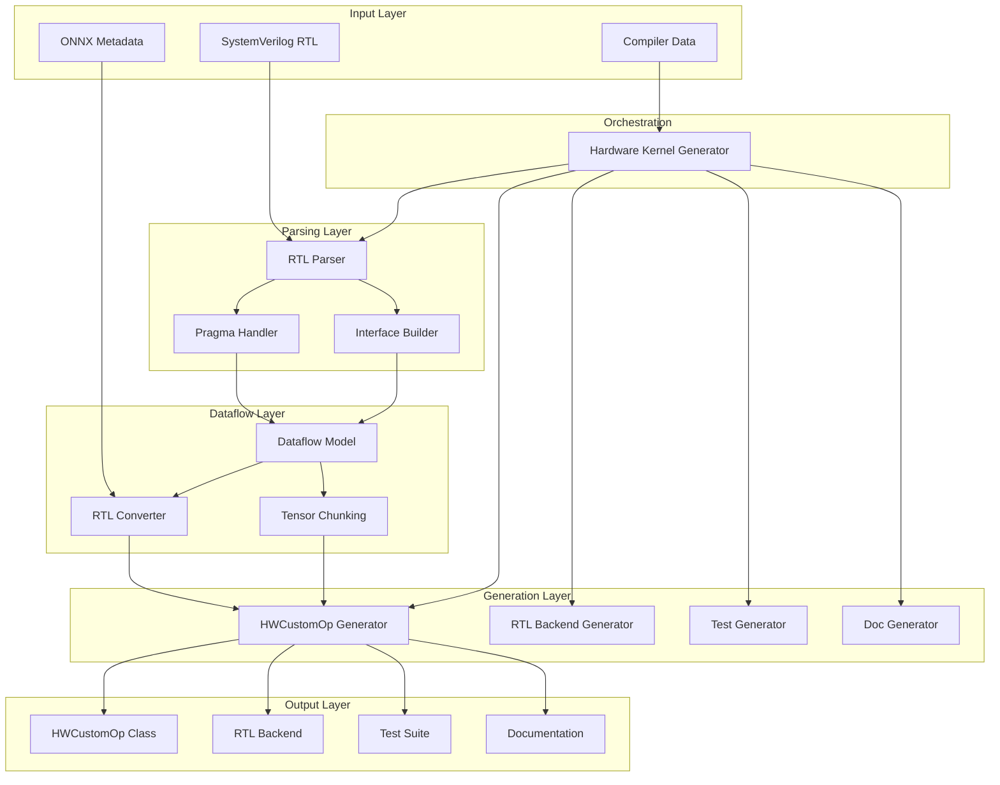
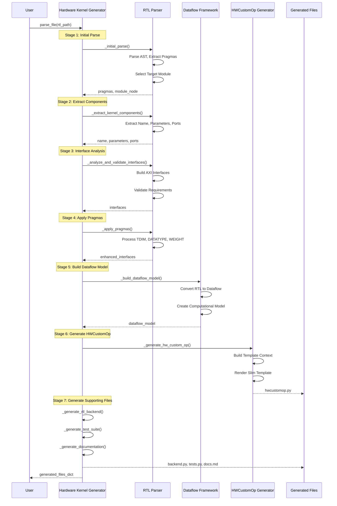
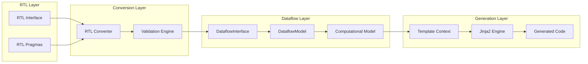

# Brainsmith Hardware Kernel Generator - System Architecture

## Overview

The Brainsmith Hardware Kernel Generator (HWKG) is a sophisticated code generation framework that automatically creates FINN-compatible HWCustomOp classes from SystemVerilog RTL descriptions. The system transforms RTL hardware specifications into Python classes that integrate seamlessly with the FINN quantized neural network compilation flow.

## Architecture Principles

### 1. Interface-Wise Dataflow Modeling
The system is built around the concept of **Interface-Wise Dataflow Modeling**, which provides:
- Unified computational models for all interface types (INPUT, OUTPUT, WEIGHT, CONFIG)
- Automatic tensor chunking and parallelism optimization
- Mathematical relationships between interfaces and parallelism parameters
- Resource estimation based on interface configurations

### 2. Multi-Stage Processing Pipeline
The architecture follows a clear 8-stage processing pipeline:
1. **RTL Parsing** - SystemVerilog AST analysis
2. **Interface Detection** - AXI protocol identification
3. **Pragma Processing** - Enhanced TDIM pragma integration
4. **Dataflow Conversion** - RTL to dataflow model transformation
5. **HWCustomOp Generation** - Python class generation
6. **RTL Backend Generation** - Synthesis backend creation
7. **Test Suite Generation** - Validation framework creation
8. **Documentation Generation** - Automated documentation

### 3. Separation of Concerns
Each component has a clearly defined responsibility:
- **RTL Parser**: Hardware specification understanding
- **HWCustomOp Generator**: Code generation and templating
- **Dataflow Framework**: Mathematical modeling and optimization
- **Hardware Kernel Generator**: Orchestration and coordination

## System Components

### Core Components Diagram



### Detailed Processing Flow



## Key Architectural Components

### 1. RTL Parser (`rtl_parser/`)

**Purpose**: Parse SystemVerilog files and extract hardware specifications

**Architecture**:
- **Parser Core** (`parser.py`): Tree-sitter based SystemVerilog parsing
- **Interface Builder** (`interface_builder.py`): AXI protocol detection and grouping
- **Pragma Handler** (`pragma.py`): Enhanced TDIM pragma processing
- **Data Structures** (`data.py`): Hardware kernel representation

**Key Features**:
- Multi-stage parsing pipeline (parse → extract → analyze → apply)
- Robust error handling with detailed syntax error reporting
- Support for ANSI-style port declarations
- Enhanced TDIM pragma integration with parameter validation

**Data Flow**:
```
SystemVerilog → AST → Modules → Interfaces → Pragmas → HWKernel
```

### 2. Dataflow Framework (`dataflow/core/`)

**Purpose**: Provide unified computational modeling for interface relationships

**Architecture**:
- **DataflowModel** (`dataflow_model.py`): Core mathematical relationships
- **DataflowInterface** (`dataflow_interface.py`): Interface abstraction
- **TensorChunking** (`tensor_chunking.py`): Dimension and parallelism optimization
- **AutoHWCustomOp** (`auto_hw_custom_op.py`): Base class for generated HWCustomOps

**Key Features**:
- Unified initiation interval calculations (cII, eII, L)
- Automatic parallelism bounds computation
- Resource estimation algorithms
- Interface-aware constraint validation

**Mathematical Model**:
```
cII_i = ∏(tDim_i / sDim_i)
eII_i = cII_i × max_weight_cycles
L = eII_bottleneck × ∏(qDim_bottleneck)
```

### 3. HWCustomOp Generator (`generators/`)

**Purpose**: Generate slim, production-ready Python classes for FINN integration

**Architecture**:
- **Code Generator** (`hw_custom_op_generator.py`): Template-based generation
- **Template Context Builder**: Interface metadata extraction
- **Jinja2 Integration**: Dynamic template rendering

**Key Features**:
- 68% code reduction through base class inheritance
- Enhanced TDIM pragma support
- Automatic interface type classification
- Production-quality generated code

**Generated Code Structure**:
```python
class AutoThresholdingHWCustomOp(AutoHWCustomOp):
    def __init__(self, onnx_node):
        super().__init__(onnx_node, self.get_interface_metadata())
    
    def get_interface_metadata(self):
        # Auto-generated interface specifications
    
    def get_nodeattr_types(self):
        # Auto-generated attribute definitions
```

### 4. Hardware Kernel Generator (`hkg.py`)

**Purpose**: Orchestrate the complete generation pipeline

**Architecture**:
- **Pipeline Orchestrator**: Coordinate multi-stage processing
- **Component Integration**: Bridge RTL parsing and dataflow modeling
- **File Generation Manager**: Coordinate multiple output generators

**Key Features**:
- Clean separation between orchestration and generation
- Lazy initialization of generator components
- Comprehensive error handling and logging
- Support for both single-file and package generation

## Interface-Wise Dataflow Modeling Framework

### Core Concepts

#### 1. DataflowInterface Abstraction
Each hardware interface (AXI-Stream, AXI-Lite) is represented as a DataflowInterface with:
- **qDim**: Quantization dimensions (how many values per tensor element)
- **tDim**: Tensor dimensions (logical shape of data)
- **sDim**: Stream dimensions (parallelism configuration)
- **dtype**: Data type with constraints
- **interface_type**: INPUT, OUTPUT, WEIGHT, CONFIG, CONTROL

#### 2. Unified Computational Model
Mathematical relationships between interfaces enable:
- **Initiation Interval Calculation**: Performance prediction
- **Resource Estimation**: BRAM, LUT, DSP usage
- **Parallelism Optimization**: Automatic parameter tuning

#### 3. Enhanced TDIM Pragma Integration
Advanced pragma processing provides:
- **Parameter Validation**: Compile-time constraint checking
- **Expression Evaluation**: Dynamic dimension calculation
- **Chunking Strategy Generation**: Automatic optimization

### Integration Architecture



## Performance Optimizations

### 1. Template Optimization
- **Slim Templates**: 154 → 138 lines average output
- **Base Class Inheritance**: 68% code reduction
- **Lazy Initialization**: Components loaded on demand

### 2. Parsing Efficiency
- **Single-Pass Processing**: Minimize RTL re-parsing
- **Cached Results**: Reuse parsed components
- **Incremental Validation**: Early error detection

### 3. Generation Speed
- **Template Caching**: Compiled Jinja2 templates
- **Parallel Processing**: Independent file generation
- **Optimized Data Structures**: Efficient memory usage

## Error Handling Strategy

### 1. Hierarchical Error Propagation
```
SyntaxError → ParserError → HardwareKernelGeneratorError
```

### 2. Validation Framework
- **Multi-Level Validation**: Syntax, semantic, constraint validation
- **Severity Classification**: ERROR, WARNING, INFO
- **Context-Rich Messages**: Detailed error information

### 3. Recovery Mechanisms
- **Graceful Degradation**: Continue with reduced functionality
- **Default Value Injection**: Sensible fallbacks
- **User Guidance**: Actionable error messages

## Configuration and Extensibility

### 1. Pragma System
Extensible pragma framework supports:
- **Custom Pragma Types**: Domain-specific extensions
- **Validation Rules**: Constraint enforcement
- **Application Logic**: Metadata modification

### 2. Template System
Flexible template architecture enables:
- **Custom Templates**: Domain-specific code generation
- **Template Inheritance**: Shared functionality
- **Dynamic Content**: Context-driven generation

### 3. Generator Framework
Pluggable generator system allows:
- **Custom Generators**: Specialized output formats
- **Pipeline Extension**: Additional processing stages
- **Tool Integration**: External tool connectivity

## Testing Strategy

### 1. Unit Testing
- **Component Isolation**: Individual module testing
- **Mock Dependencies**: Controlled test environments
- **Edge Case Coverage**: Boundary condition testing

### 2. Integration Testing
- **End-to-End Pipelines**: Complete workflow testing
- **Cross-Component**: Interface validation
- **Performance Testing**: Scalability verification

### 3. Validation Testing
- **Generated Code Quality**: Output verification
- **FINN Integration**: Compatibility testing
- **Resource Accuracy**: Estimation validation

## Future Architecture Considerations

### 1. Scalability Enhancements
- **Distributed Processing**: Multi-core utilization
- **Incremental Compilation**: Delta-based regeneration
- **Caching Strategies**: Persistent intermediate results

### 2. Tool Integration
- **IDE Extensions**: Development environment integration
- **CI/CD Integration**: Automated generation pipelines
- **Version Control**: Source tracking and management

### 3. Domain Extensions
- **Protocol Support**: Beyond AXI (Avalon, Wishbone)
- **Language Support**: VHDL parsing capability
- **Target Platforms**: Beyond FINN (Vitis, OneAPI)

## Conclusion

The Brainsmith Hardware Kernel Generator represents a sophisticated, well-architected system for automated hardware-software integration. Its modular design, comprehensive error handling, and extensible framework make it suitable for production use while maintaining flexibility for future enhancements.

The Interface-Wise Dataflow Modeling Framework provides a solid mathematical foundation for hardware abstraction, enabling automated optimization and resource estimation. The multi-stage processing pipeline ensures robust handling of complex RTL specifications while generating production-quality output code.