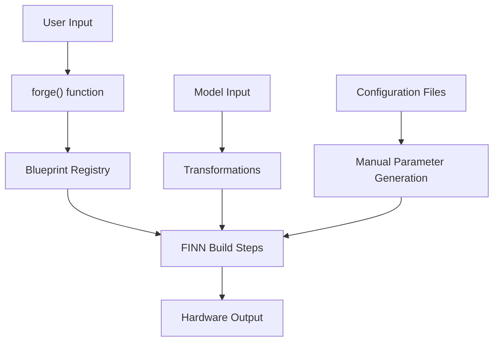
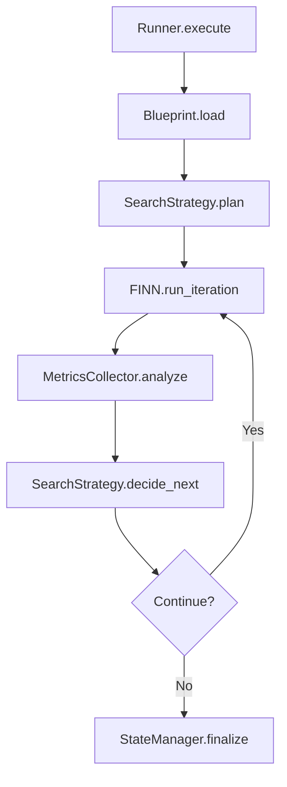

# Brainsmith Framework Refactoring Analysis and Plan

## Executive Summary

This document analyzes the current Brainsmith framework implementation and proposes a comprehensive refactoring plan to create a robust, extensible runner with an intuitive blueprint system. The focus is on improving core architecture, code health, and user experience while maintaining backward compatibility.

## Current Architecture Analysis

### Core Components



### Existing Strengths

1. **Functional Core**: The [`forge()`](brainsmith/core/hw_compiler.py:23) function provides a working interface to FINN
2. **Model-Specific Optimizations**: BERT blueprint includes sophisticated custom transformations
3. **Test Infrastructure**: Comprehensive end-to-end testing framework
4. **Custom Operations**: Well-structured custom FPGA dataflow operations

## Critical Issues Identified

### 1. Rigid Blueprint System

**Current State:**
- Single blueprint ("bert") in hardcoded [`REGISTRY`](brainsmith/blueprints/__init__.py:6-8)
- Monolithic [`BUILD_STEPS`](brainsmith/blueprints/bert.py:380-402) list with no composition
- No inheritance, extension, or plugin capabilities
- Blueprint creation requires deep FINN expertise

**Impact:**
- Difficult to add new model architectures
- Code duplication across similar models
- High barrier to entry for new users

### 2. Monolithic `forge()` Function

**Current Issues in [`hw_compiler.py`](brainsmith/core/hw_compiler.py:23-89):**

```python
def forge(blueprint, model, args):
    # Issues:
    # 1. Single function handles too many responsibilities
    # 2. Direct file system operations mixed with business logic
    # 3. No error recovery or state management
    # 4. Hardcoded configuration handling
    # 5. No extensibility for iterative FINN runs
```

**Specific Problems:**
- **Mixed Responsibilities**: Directory creation, model preprocessing, FINN configuration, and output handling in one function
- **Error Handling**: Basic exception propagation with no recovery strategies
- **State Management**: No intermediate checkpointing or resumption capabilities
- **Configuration**: Hardcoded parameter mapping from args to FINN config
- **Iterative Execution**: No support for iterative FINN runs with different start/stop steps based on search strategies

### 3. Configuration Management Complexity

**Current Issues:**
- Manual folding parameter generation in [`gen_initial_folding.py`](demos/bert/gen_initial_folding.py)
- Hardcoded values scattered throughout demos and blueprints
- No validation or consistency checking
- Complex interdependencies between parameters

### 4. Code Health Issues

**Identified Problems:**
1. **TODOs and Incomplete Features**: Multiple TODO comments indicating unfinished functionality
2. **Magic Numbers**: Hardcoded values without constants or configuration
3. **Tight Coupling**: Direct dependencies between unrelated modules
4. **Inconsistent Error Handling**: Mix of exceptions, print statements, and silent failures
5. **Limited Documentation**: Missing docstrings and architectural documentation

## Refactoring Plan

### Phase 1: Core Architecture Refactoring

#### 1.1 Restructure `forge()` Function for Iterative FINN Execution

**Current Structure Issues:**
```python
def forge(blueprint, model, args):
    # 89 lines of mixed responsibilities
    # Single FINN run with no iteration capability
    # No metrics collection or search strategy guidance
```

**Proposed New Architecture:**



**New Core Classes:**

```python
class BrainsmithRunner:
    """Main orchestrator for iterative FINN builds with search strategies."""
    
    def __init__(self, config_manager, state_manager, metrics_collector):
        self.config_manager = config_manager
        self.state_manager = state_manager
        self.metrics_collector = metrics_collector
    
    def execute(self, blueprint_name: str, model, config: dict) -> BuildResult:
        """Execute iterative build with search strategy guidance."""
        pass

class Blueprint:
    """Represents a search and optimization strategy for an architecture."""
    
    def __init__(self, name: str, architecture: str, search_strategy: SearchStrategy):
        self.name = name
        self.architecture = architecture  # e.g., "transformer", "cnn", "rnn"
        self.search_strategy = search_strategy
    
    def get_initial_config(self, model_info: ModelInfo) -> Dict[str, Any]:
        """Generate initial configuration based on model analysis."""
        pass
    
    def get_next_iteration(self, metrics: BuildMetrics, history: List[BuildResult]) -> IterationPlan:
        """Determine next iteration parameters based on results."""
        pass

class SearchStrategy:
    """Defines how to explore the design space for an architecture."""
    
    def plan_initial_run(self, model_info: ModelInfo) -> IterationPlan:
        """Plan the first FINN run."""
        pass
    
    def plan_next_iteration(self, current_metrics: BuildMetrics, history: List[BuildResult]) -> IterationPlan:
        """Plan next iteration based on previous results."""
        pass
    
    def is_search_complete(self, metrics: BuildMetrics, history: List[BuildResult]) -> bool:
        """Determine if search strategy is satisfied."""
        pass

class IterationPlan:
    """Represents a single FINN build iteration plan."""
    
    def __init__(self, start_step: str, stop_step: str, config_overrides: dict):
        self.start_step = start_step
        self.stop_step = stop_step
        self.config_overrides = config_overrides
        
class FINNRunner:
    """Wrapper for executing FINN builds with custom and standard steps."""
    
    def run_iteration(self, model, plan: IterationPlan, blueprint: ArchitectureBlueprint,
                     base_config: dict) -> BuildResult:
        """Execute a single FINN iteration with the blueprint's custom steps."""
        # Get the steps for this iteration phase
        steps = blueprint.get_steps_for_phase(plan.phase)
        
        # Create FINN config with custom steps
        finn_config = self._build_finn_config(base_config, plan.config_overrides, steps)
        
        # Execute FINN build with custom steps
        return self._execute_finn_build(model, finn_config, plan.start_step, plan.stop_step)
```

#### 1.2 Step Library Architecture with Configuration-Based Blueprints

**Centralized Step Library Structure:**

```
brainsmith/
├── steps/
│   ├── __init__.py
│   ├── common/                 # General-purpose steps
│   │   ├── cleanup.py
│   │   ├── validation.py
│   │   └── optimization.py
│   ├── transformer/            # Transformer-specific steps
│   │   ├── __init__.py
│   │   ├── qonnx_conversion.py
│   │   ├── streamlining.py
│   │   ├── head_tail_surgery.py
│   │   └── attention_ops.py
│   ├── cnn/                    # CNN-specific steps
│   │   ├── __init__.py
│   │   ├── convolution_ops.py
│   │   └── pooling_ops.py
│   ├── rnn/                    # RNN-specific steps
│   │   └── recurrent_ops.py
│   └── finn/                   # Standard FINN step wrappers
│       ├── __init__.py
│       └── standard_steps.py
```

**Step Library Implementation:**

```python
# brainsmith/steps/__init__.py
class StepRegistry:
    """Central registry for all build steps."""
    
    def __init__(self):
        self._steps: Dict[str, callable] = {}
        self._step_metadata: Dict[str, StepMetadata] = {}
        self._load_all_steps()
    
    def register_step(self, name: str, func: callable, metadata: StepMetadata):
        """Register a step in the library."""
        self._steps[name] = func
        self._step_metadata[name] = metadata
    
    def get_step(self, name: str) -> callable:
        """Get a step by name."""
        if name not in self._steps:
            raise StepNotFoundError(f"Step '{name}' not found in library")
        return self._steps[name]
    
    def list_steps(self, category: str = None, architecture: str = None) -> List[str]:
        """List available steps, optionally filtered by category or architecture."""
        pass
    
    def validate_step_sequence(self, steps: List[str]) -> ValidationResult:
        """Validate that a sequence of steps is compatible."""
        pass

@dataclass
class StepMetadata:
    """Metadata describing a build step."""
    name: str
    category: str  # "common", "transformer", "cnn", "rnn", "finn"
    architecture: Optional[str]  # Target architecture
    dependencies: List[str]  # Required previous steps
    conflicts: List[str]  # Incompatible steps
    description: str
    parameters: Dict[str, Any]  # Step-specific parameters

# Global step registry instance
STEP_REGISTRY = StepRegistry()

# Decorator for registering steps
def register_step(name: str, category: str, architecture: str = None,
                 dependencies: List[str] = None, conflicts: List[str] = None,
                 description: str = ""):
    """Decorator to register a step in the library."""
    def decorator(func):
        metadata = StepMetadata(
            name=name,
            category=category,
            architecture=architecture,
            dependencies=dependencies or [],
            conflicts=conflicts or [],
            description=description,
            parameters={}
        )
        STEP_REGISTRY.register_step(name, func, metadata)
        return func
    return decorator
```

**Step Implementations:**

```python
# brainsmith/steps/transformer/qonnx_conversion.py
from brainsmith.steps import register_step

@register_step(
    name="transformer.qonnx_to_finn",
    category="transformer",
    architecture="transformer",
    dependencies=["common.cleanup", "transformer.remove_head"],
    description="Convert QONNX to FINN with transformer-specific handling"
)
def custom_step_qonnx2finn(model, cfg):
    """BERT custom step for converting between QONNX and FINN-ONNX"""
    # Existing implementation from bert.py
    pass

@register_step(
    name="transformer.remove_head",
    category="transformer",
    architecture="transformer",
    description="Remove transformer head for hardware optimization"
)
def custom_step_remove_head(model, cfg):
    """Remove all nodes up to the first LayerNormalisation Node"""
    # Existing implementation from bert.py
    pass

# brainsmith/steps/common/cleanup.py
@register_step(
    name="common.cleanup",
    category="common",
    description="General model cleanup and optimization"
)
def custom_step_cleanup(model, cfg):
    """Common cleanup steps for all model types"""
    # Existing implementation from bert.py
    pass

# brainsmith/steps/finn/standard_steps.py
@register_step(
    name="finn.create_dataflow_partition",
    category="finn",
    description="Standard FINN dataflow partition creation"
)
def step_create_dataflow_partition(model, cfg):
    """Wrapper for standard FINN step."""
    from finn.builder.build_dataflow_steps import step_create_dataflow_partition
    return step_create_dataflow_partition(model, cfg)
```

**Pure Configuration Blueprints:**

```yaml
# blueprints/transformer_conservative.yaml
name: "transformer_conservative"
description: "Conservative search strategy for transformer architectures"
architecture: "transformer"

# Simple list of steps from the library
build_steps:
  - "common.cleanup"
  - "transformer.remove_head"
  - "transformer.remove_tail"
  - "transformer.qonnx_to_finn"
  - "transformer.generate_reference_io"
  - "transformer.streamlining"
  - "transformer.infer_hardware"
  - "finn.create_dataflow_partition"
  - "finn.specialize_layers"
  - "finn.target_fps_parallelization"
  - "finn.apply_folding_config"
  - "finn.minimize_bit_width"
  - "finn.generate_estimate_reports"
  - "finn.hw_codegen"
  - "finn.hw_ipgen"
  - "finn.measure_rtlsim_performance"
  - "finn.set_fifo_depths"
  - "finn.create_stitched_ip"
  - "transformer.shell_metadata_handover"

search_strategy:
  type: "conservative_exploration"
  parameters:
    initial_folding_factor: 0.5
    max_iterations: 5
    convergence_threshold: 0.95
    
  optimization_goals:
    primary: "resource_utilization"
    secondary: "timing_closure"
    
  iteration_phases:
    initial_analysis:
      start_step: "common.cleanup"
      stop_step: "finn.generate_estimate_reports"
      
    refinement:
      start_step: "finn.apply_folding_config"
      stop_step: "finn.measure_rtlsim_performance"
      
    finalization:
      start_step: "finn.set_fifo_depths"
      stop_step: "transformer.shell_metadata_handover"

# blueprints/cnn_edge_optimized.yaml
name: "cnn_edge_optimized"
description: "Edge-optimized search for CNN architectures"
architecture: "cnn"

build_steps:
  - "common.cleanup"
  - "cnn.conv_optimization"
  - "cnn.pooling_optimization"
  - "finn.create_dataflow_partition"
  - "finn.specialize_layers"
  - "finn.apply_folding_config"
  - "finn.hw_codegen"
  - "finn.create_stitched_ip"

search_strategy:
  type: "pareto_frontier"
  parameters:
    objectives: ["latency", "power", "accuracy"]
    sample_points: 20

# blueprints/minimal_test.yaml
name: "minimal_test"
description: "Minimal blueprint for testing"
architecture: "any"

build_steps:
  - "common.cleanup"
  - "finn.create_dataflow_partition"
  - "finn.generate_estimate_reports"

search_strategy:
  type: "single_run"
  parameters: {}
```

**Simplified Blueprint System:**

```python
class Blueprint:
    """Pure configuration-based blueprint using step library."""
    
    def __init__(self, config: dict):
        self.name = config['name']
        self.description = config['description']
        self.architecture = config['architecture']
        self.build_steps = config['build_steps']
        self.search_strategy = SearchStrategy.from_config(config['search_strategy'])
    
    def validate(self) -> ValidationResult:
        """Validate blueprint configuration."""
        # Check all steps exist in library
        return STEP_REGISTRY.validate_step_sequence(self.build_steps)
    
    def get_steps_for_phase(self, phase: str) -> List[callable]:
        """Get executable steps for an iteration phase."""
        phase_config = self.search_strategy.iteration_phases[phase]
        start_idx = self.build_steps.index(phase_config['start_step'])
        stop_idx = self.build_steps.index(phase_config['stop_step']) + 1
        
        step_names = self.build_steps[start_idx:stop_idx]
        return [STEP_REGISTRY.get_step(name) for name in step_names]
```

**Blueprint Manager with Custom Step Support:**

```python
class BlueprintManager:
    """Manages blueprint discovery, loading, and inheritance with custom steps."""
    
    def __init__(self, blueprint_dirs: List[Path]):
        self.blueprint_dirs = blueprint_dirs
        self.loaded_blueprints: Dict[str, ArchitectureBlueprint] = {}
        self.step_registries: Dict[str, Dict[str, callable]] = {}
    
    def discover_blueprints(self) -> List[str]:
        """Discover all available blueprints."""
        pass
    
    def load_blueprint(self, name: str) -> ArchitectureBlueprint:
        """Load blueprint with inheritance resolution and custom steps."""
        blueprint_config = self._load_config(name)
        
        # Handle inheritance
        if 'extends' in blueprint_config:
            base_blueprint = self.load_blueprint(blueprint_config['extends'])
            blueprint_config = self._merge_configs(base_blueprint.config, blueprint_config)
        
        # Create blueprint instance
        blueprint = self._create_blueprint_instance(blueprint_config)
        
        # Load custom steps
        if 'build_steps' in blueprint_config and 'module' in blueprint_config['build_steps']:
            blueprint.load_custom_steps(blueprint_config['build_steps']['module'])
        
        return blueprint
    
    def validate_blueprint(self, blueprint: ArchitectureBlueprint) -> ValidationResult:
        """Validate blueprint configuration and custom step availability."""
        validation_result = ValidationResult()
        
        # Validate that all custom steps are available
        for step_name in blueprint.build_steps:
            if step_name not in blueprint._step_registry:
                if not step_name.startswith('step_'):  # Standard FINN steps
                    validation_result.add_error(f"Custom step '{step_name}' not found")
        
        return validation_result
    
    def register_custom_step_module(self, architecture: str, module_name: str):
        """Register a module containing custom steps for an architecture."""
        pass
```

#### 1.3 Configuration Management System

**Unified Configuration Schema:**

```python
@dataclass
class BuildConfig:
    """Unified configuration for Brainsmith builds."""
    
    # Target hardware configuration
    target_config: TargetConfig
    
    # Search strategy configuration
    search_config: SearchConfig
    
    # FINN pipeline configuration
    finn_config: FINNConfig
    
    # Output configuration
    output_config: OutputConfig
    
    def validate(self) -> ValidationResult:
        """Validate entire configuration for consistency."""
        pass
    
    def merge_overrides(self, overrides: dict) -> 'BuildConfig':
        """Apply configuration overrides with validation."""
        pass

class ConfigManager:
    """Manages configuration loading, validation, and templates."""
    
    def load_from_file(self, path: Path) -> BuildConfig:
        """Load configuration from YAML/JSON file."""
        pass
    
    def generate_from_model(self, model, blueprint: Blueprint) -> BuildConfig:
        """Generate configuration based on model analysis."""
        pass
    
    def validate_config(self, config: BuildConfig, blueprint: Blueprint) -> ValidationResult:
        """Validate configuration against blueprint schema."""
        pass
```

### Phase 2: Enhanced Error Handling and State Management

#### 2.1 Robust Error Handling

**Error Classification System:**

```python
class BrainsmithError(Exception):
    """Base exception for all Brainsmith errors."""
    
    def __init__(self, message: str, recoverable: bool = False, context: dict = None):
        super().__init__(message)
        self.recoverable = recoverable
        self.context = context or {}

class ConfigurationError(BrainsmithError):
    """Errors related to configuration validation."""
    pass

class SearchStrategyError(BrainsmithError):
    """Errors during search strategy execution."""
    pass

class FINNExecutionError(BrainsmithError):
    """Errors during FINN pipeline execution."""
    pass

class ErrorHandler:
    """Centralized error handling with recovery strategies."""
    
    def handle_error(self, error: BrainsmithError, context: BuildContext) -> RecoveryAction:
        """Handle error with appropriate recovery strategy."""
        pass
    
    def suggest_fixes(self, error: BrainsmithError) -> List[str]:
        """Suggest potential fixes for common errors."""
        pass
```

#### 2.2 Build State Management

**Checkpointing System:**

```python
class BuildState:
    """Represents the complete state of an iterative build."""
    
    def __init__(self, build_id: str, blueprint: Blueprint, config: BuildConfig):
        self.build_id = build_id
        self.blueprint = blueprint
        self.config = config
        self.completed_iterations: List[BuildResult] = []
        self.current_iteration: Optional[IterationPlan] = None
        self.search_state: Dict[str, Any] = {}
    
    def can_resume_from(self, iteration_id: str) -> bool:
        """Check if build can be resumed from given iteration."""
        pass

class StateManager:
    """Manages build state persistence and recovery."""
    
    def save_iteration_checkpoint(self, state: BuildState, iteration_result: BuildResult):
        """Save build state after each iteration."""
        pass
    
    def load_checkpoint(self, build_id: str) -> Optional[BuildState]:
        """Load build state from checkpoint."""
        pass
    
    def cleanup_checkpoints(self, build_id: str, keep_final: bool = True):
        """Clean up intermediate checkpoints."""
        pass
```

### Phase 3: User Experience Improvements

#### 3.1 Unified CLI Interface

**New CLI Structure:**

```bash
# Main command with subcommands
brainsmith build --blueprint transformer_conservative --model model.onnx
brainsmith blueprint list --architecture transformer
brainsmith blueprint validate transformer_aggressive
brainsmith resume --build-id abc123 --from-iteration 3
brainsmith interactive --model model.onnx
```

**CLI Implementation:**

```python
class BrainsmithCLI:
    """Unified command-line interface for Brainsmith."""
    
    def __init__(self):
        self.runner = BrainsmithRunner()
        self.blueprint_manager = BlueprintManager()
    
    def cmd_build(self, args):
        """Execute an iterative build with search strategy."""
        pass
    
    def cmd_blueprint_list(self, args):
        """List available blueprints by architecture."""
        pass
    
    def cmd_interactive(self, args):
        """Start interactive mode for guided optimization."""
        pass
```

#### 3.2 Interactive Mode

The interactive mode provides a guided experience for exploring different optimization strategies:

**Key Features:**

1. **Model Analysis**: Automatic detection of architecture type and key characteristics
2. **Strategy Selection**: Present appropriate blueprints based on model analysis
3. **Real-time Progress**: Show iteration progress and intermediate results
4. **Results Comparison**: Interactive comparison of different optimization results
5. **Configuration Export**: Generate reproducible configuration files

**Interactive Flow:**
```
Welcome to Brainsmith Interactive Mode!

Model Analysis:
✓ Architecture: Transformer (BERT-like)
✓ Parameters: 110M
✓ Sequence length: 128
✓ Precision: INT8

Recommended strategies:
1. transformer_conservative (Safe exploration)
2. transformer_balanced (Moderate optimization)
3. transformer_aggressive (Maximum performance)

[Real-time progress with metrics visualization]
[Results comparison and selection]
[Configuration export and documentation]
```

#### 3.3 Improved Backward Compatibility

**Legacy API Wrapper:**

```python
def forge(blueprint: str, model, args) -> str:
    """
    Legacy forge function wrapper for backward compatibility.
    
    This function maintains the original API while delegating to the new
    iterative architecture internally.
    """
    # Convert legacy args to new configuration format
    config = _convert_legacy_args(args)
    
    # Create runner with default managers
    runner = BrainsmithRunner.create_default()
    
    # Execute build with single iteration for compatibility
    result = runner.execute_single_iteration(blueprint, model, config)
    
    # Return legacy format result
    return result.output_dir
```

## Code Health Improvements

### 1. Consistent Error Handling

**Before:**
```python
# Mixed error handling patterns
if not os.path.exists(file):
    print(f"Error: File not found")
    return None

raise RuntimeError(f"Blueprint {blueprint} not found")
```

**After:**
```python
# Consistent exception hierarchy
if not config_file.exists():
    raise ConfigurationError(
        f"Configuration file not found: {config_file}",
        recoverable=True,
        context={"suggestion": "Check file path or use --generate-config"}
    )
```

### 2. Configuration Constants

**Before:**
```python
# Magic numbers scattered throughout code
df_cfg = build_cfg.DataflowBuildConfig(
    synth_clk_period_ns=3.33,  # What does this represent?
    fifosim_n_inferences=2,    # Why 2?
)
```

**After:**
```python
# Centralized configuration constants
class DefaultValues:
    """Default values for common configuration parameters."""
    
    # Clock period for V80 board (nanoseconds)
    V80_SYNTH_CLK_PERIOD_NS = 3.33
    
    # Number of inferences for FIFO simulation
    DEFAULT_FIFOSIM_INFERENCES = 2

@dataclass
class HardwareConfig:
    synth_clk_period_ns: float = DefaultValues.V80_SYNTH_CLK_PERIOD_NS
    
    def __post_init__(self):
        if self.synth_clk_period_ns <= 0:
            raise ConfigurationError("Clock period must be positive")
```

### 3. Improved Documentation

**Before:**
```python
def custom_step_qonnx2finn(model, cfg):
    """BERT custom step for converting between QONNX and FINN-ONNX"""
```

**After:**
```python
def custom_step_qonnx2finn(model: ModelWrapper, cfg: BuildConfig) -> ModelWrapper:
    """
    Convert QONNX model to FINN-ONNX format with BERT-specific optimizations.
    
    This step handles the complex conversion process required for BERT models,
    particularly around SoftMax operations which require special handling.
    
    Args:
        model: Input QONNX model
        cfg: Build configuration containing conversion parameters
        
    Returns:
        Converted FINN-ONNX model
        
    Raises:
        ConversionError: If model conversion fails
        ValidationError: If resulting model is invalid
    """
```

## Implementation Roadmap

### Phase 1: Foundation (Weeks 1-4)
1. **Week 1-2**: Implement core architecture classes (Runner, Blueprint, SearchStrategy)
2. **Week 3**: Create iterative FINN execution framework
3. **Week 4**: Implement blueprint loading and validation

### Phase 2: Migration (Weeks 5-8)
1. **Week 5-6**: Migrate existing BERT blueprint to new search strategy system
2. **Week 7**: Implement backward compatibility layer
3. **Week 8**: Add error handling and state management

### Phase 3: Enhancement (Weeks 9-12)
1. **Week 9-10**: Implement CLI interface and interactive mode
2. **Week 11**: Add advanced features (resumption, cleanup, metrics)
3. **Week 12**: Documentation and comprehensive testing

### Code Health (Ongoing)
- Continuous refactoring of existing code
- Addition of comprehensive logging
- Improvement of error messages and documentation
- Performance optimization

## Success Metrics

1. **Extensibility**: New search strategies can be defined with YAML configuration
2. **Architecture Support**: Easy addition of new architecture blueprints
3. **Reliability**: Build failures are recoverable with clear error messages
4. **Usability**: Interactive mode guides users through optimization process
5. **Performance**: Iterative optimization finds better solutions than single runs
6. **Backward Compatibility**: Existing code continues to work without changes

## Risk Mitigation

1. **Backward Compatibility**: Maintain legacy `forge()` API wrapper
2. **Performance**: Benchmark iterative execution overhead
3. **Testing**: Comprehensive regression testing suite
4. **Migration**: Gradual migration with feature flags
5. **Documentation**: Clear migration guide for users and developers

This refactoring plan transforms Brainsmith into a robust, extensible framework for iterative FINN optimization while maintaining simplicity for basic use cases and providing advanced capabilities for power users.