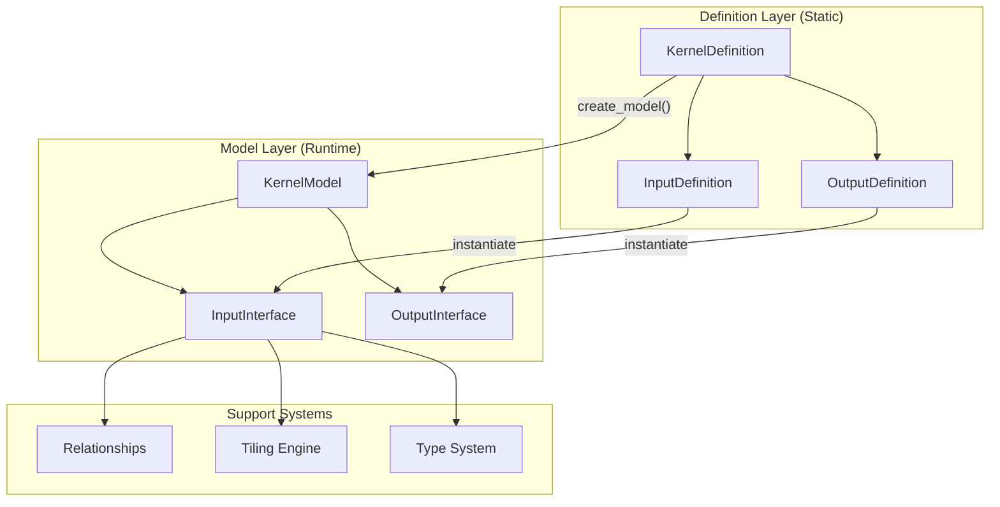
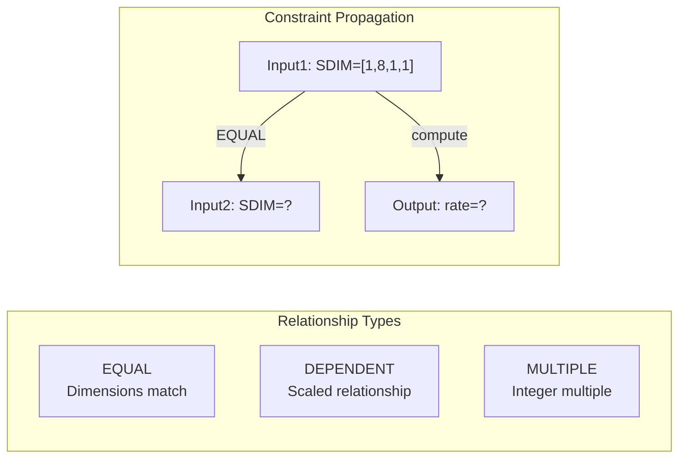
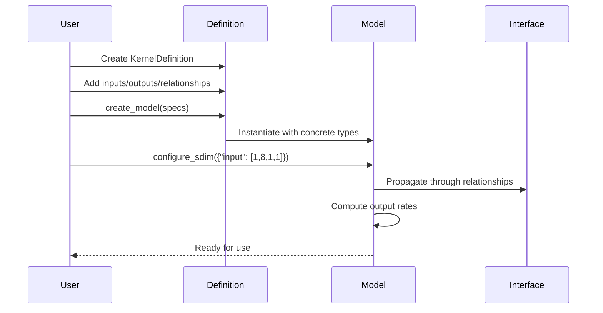
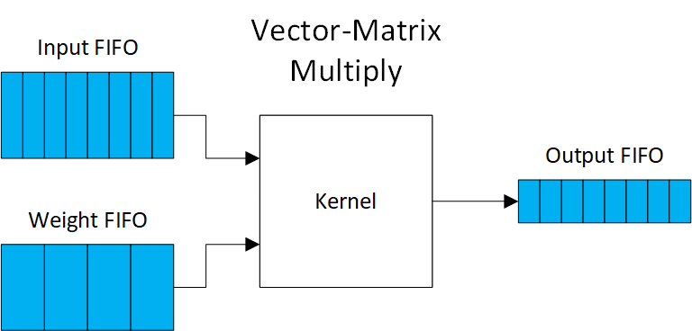
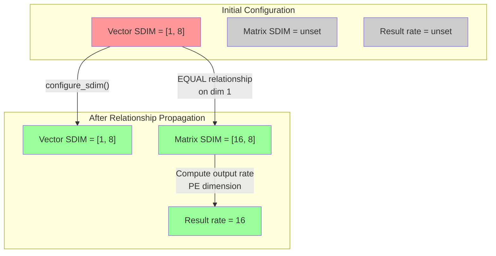

## Core Design Philosophy

The system follows a **Definition/Model separation pattern** — a fundamental architectural choice that separates "what CAN be" (definitions/schemas) from "what IS" (models/instances). This separation enables a compiler IR for hardware accelerators where:

- **Definitions** act as reusable templates with constraints and validation rules
- **Models** represent concrete runtime instances with actual types and configurations
- **Relationships** enforce correctness at compile-time rather than runtime
- **Performance** is predictable through built-in modeling before synthesis

```
┌─────────────────────────┐         ┌─────────────────────────┐
│      DEFINITION         │         │         MODEL           │
│   "Schema & Rules"      │         │   "Runtime Instance"    │
├─────────────────────────┤         ├─────────────────────────┤
│ • Constraints           │ create  │ • Concrete types        │
│ • Relationships         │ ------> │ • Actual SDIM values    │
│ • Validation rules      │         │ • Computed metrics      │
│ • Tiling expressions    │         │ • Cached performance    │
└─────────────────────────┘         └─────────────────────────┘
```

## Data Hierarchy and Tiling System

### Motivation: Bridging ONNX Semantics to RTL Streaming

The data hierarchy bridges two fundamentally different computational paradigms:

**ONNX/ML World**: Multi-dimensional tensors with semantic meaning
- Dimensions have inherent meaning: batch, channel, height, width
- Operations understand and preserve these semantics
- Rich transformations: reshape, transpose, layout conversions
- Memory layouts matter (NCHW vs NHWC)

**RTL/Hardware World**: Pure streaming dataflow
- Data flows as bits through FIFOs
- No inherent dimensional awareness in hardware
- AXI-Stream: TDATA/TVALID/TREADY signals only
- Fixed-width processing per clock cycle

The tiling system addresses several critical challenges:

1. **Semantic Preservation**: Maintains ONNX's dimensional meaning while transforming to hardware streams. Named parameters ("CHANNELS", "SPATIAL_Y") and right-justified alignment ensure semantics flow through compilation.

2. **Memory Hierarchy Management**: FPGAs have limited on-chip memory but high bandwidth. Off-chip DRAM has large capacity but limited bandwidth (typically 10-20 GB/s). Tiling enables optimal use of both while preserving tensor structure.

3. **Deterministic Streaming**: FPGA accelerators achieve peak efficiency through continuous data streaming. The hierarchy provides compile-time known boundaries, eliminating runtime boundary detection.

4. **Dimension-Aware Parallelism**: Different hierarchy levels map to different parallelism opportunities — from coarse-grained block parallelism to fine-grained SDIM (Streaming Dimensions) control.

### The Four-Level Hierarchy

The system decomposes data into four hierarchical levels, each solving specific hardware mapping challenges:

```
┌────────────────────────────────────────────────────────────┐
│                           TENSOR                           │
│                    Full inference data                     │
│                    e.g., 512×256 matrix                    │
│  ┌─────────────────────────────────────────────────────┐   │
│  │                         BLOCK                       │   │
│  │                 Tile processed by kernel            │   │
│  │                    e.g., 64×32 tile                 │   │
│  │  ┌──────────────────────────────────────────────┐   │   │
│  │  │                    STREAM                    │   │   │
│  │  │             Data per clock cycle             │   │   │
│  │  │               e.g., 8×16 patch               │   │   │
│  │  │  ┌─┬─┬─┬─┬─┬─┬─┬─┬─┬─┬─┬─┬─┬─┬─┬─┬─┬─┐       │   │   │
│  │  │  │E│L│E│M│E│N│T│ │ │ │ │ │ │ │ │ │ │ │       │   │   │
│  │  │  │ │ │ │ │ │ │ │ │ │ │ │ │ │ │ │ │ │ │       │   │   │
│  │  │  │Individual data items (e.g., INT8) │       │   │   │
│  │  │  └─┴─┴─┴─┴─┴─┴─┴─┴─┴─┴─┴─┴─┴─┴─┴─┴─┴─┘       │   │   │
│  │  └──────────────────────────────────────────────┘   │   │
│  └─────────────────────────────────────────────────────┘   │
└────────────────────────────────────────────────────────────┘
```

#### Level 1: Tensor (Complete Data)
- **Purpose**: Represents complete computation (e.g., entire layer)
- **Storage**: Resides in off-chip DRAM
- **Challenge**: Too large for on-chip processing
- **Solution**: Decomposed into blocks that fit in BRAM

#### Level 2: Block (Working Set)
- **Purpose**: Data tile that fits in on-chip memory
- **Storage**: Buffered in BRAM/URAM
- **Size**: Typically 10s of KB to few MB
- **Trade-off**: Larger blocks = fewer DRAM accesses but more BRAM usage

#### Level 3: Stream (Pipeline Width)
- **Purpose**: Data processed per clock cycle
- **Transport**: Flows through AXI streams and datapaths
- **Width**: Matches hardware bus width (e.g., 512-bit AXI)
- **Parallelism**: Determines computational throughput

#### Level 4: Element (Atomic Unit)
- **Purpose**: Individual data items
- **Processing**: Maps to DSP slices or LUTs
- **Types**: INT8, FIXED16, etc. (via QONNX types)
- **Optimization**: Bit width affects resource usage

### Why This Hierarchy Works

1. **Natural Hardware Mapping**: Each level corresponds to a physical hardware resource with specific constraints

2. **Performance Predictability**: The hierarchy enables accurate performance modeling:
   ```
   Execution Time = (Tensor Size / Block Size) × Block Processing Time
   Block Processing Time = (Block Size / Stream Width) × Clock Period
   ```

3. **Design Space Flexibility**: Parameters at each level can be tuned independently:
   - Block size → Memory usage vs. external bandwidth
   - Stream width → Throughput vs. resource usage
   - Element type → Precision vs. area/power

4. **Composability**: Kernels with compatible block/stream interfaces can be chained efficiently

### Tiling Expression Language

The system uses intuitive list-based expressions to specify decomposition:

- `1` - Singleton dimension (size 1)
- `:` - Full dimension (no tiling)
- `32` - Literal tile size
- `"PARAM"` - Runtime parameter

Example: `[1, "CH_TILES", ":", ":"]` means singleton batch, parameterized channels, full height/width.

This expression language provides:
- **Clarity**: Explicit per-dimension tiling strategy
- **Flexibility**: Mix of fixed and parameterized tiling
- **Validation**: Type system ensures valid decompositions
- **Optimization**: Parameters can be tuned without code changes

### Semantic Bridge: From Tensors to Streams

The hierarchy implements a careful transformation that preserves ONNX semantics through hardware generation:

```
ONNX Tensor                     Streaming Hardware
[B,C,H,W] with semantics   →    AXI-Stream FIFO (just bits)
    ↓                                   ↑
Preserved via:                   Semantics implicit in:
- Named dimensions               - Compile-time configuration  
- Block alignment                - Deterministic iteration
- Tiling constraints            - Interface relationships
```

**Key Design Principle**: Semantic information doesn't flow through hardware — it's preserved in the compilation process that configures the hardware. This enables:
- Zero-overhead streaming (no runtime dimension tracking)
- Compile-time validation of all transformations
- Deterministic, high-performance execution

## SDIM (Streaming Dimensions) Architecture

SDIM replaces ambiguous scalar parallelism (iPar) with precise multi-dimensional streaming control:

```
Traditional iPar:           SDIM Approach:
┌─────────────────┐        ┌─────────────────────────────┐
│ iPar = 8        │        │ SDIM = [1, 8, 1, 1]        │
│ (Ambiguous!)    │  ───>  │ (Clear: 8 channels/cycle)   │
└─────────────────┘        └─────────────────────────────┘
```

## Component Architecture



## Key Architectural Differences

### Input vs Output Interfaces

The separation between InputInterface and OutputInterface enforces hardware reality in streaming dataflow:

```
┌─────────────────────────┐     ┌─────────────────────────┐
│    INPUT INTERFACE      │     │   OUTPUT INTERFACE      │
├─────────────────────────┤     ├─────────────────────────┤
│ • Configurable SDIM     │     │ • NO configurable SDIM  │
│ • User sets streaming   │     │ • Kernel sets rate      │
│ • configure_sdim()      │     │ • set_streaming_rate()  │
│ • Drives data flow      │     │ • Follows data flow     │
└─────────────────────────┘     └─────────────────────────┘
```

This distinction reflects hardware reality: you control how fast you consume data, but the rate at which you produce results is determined by your algorithm. Attempting to arbitrarily configure output rates would violate causality.

### The AutoHWCustomOp Bridge

The system seamlessly integrates with FINN through the AutoHWCustomOp pattern:

```python
class AutoHWCustomOp(HWCustomOp):
    """Bridge between KernelModel and FINN"""
    
    def __init__(self, onnx_node, kernel_definition):
        # KernelDefinition provides the schema
        self._kernel_def = kernel_definition
        # KernelModel created during shape inference
        self._kernel_model = None
    
    # All FINN methods delegate to KernelModel
    def get_folded_input_shape(self, ind=0):
        return self._kernel_model.get_folded_shape(...)
    
    def get_instream_width(self, ind=0):
        return self._kernel_model.get_stream_width(...)
```

This bridge enables:
- **Automatic method implementation** for all FINN requirements
- **Lazy initialization** during shape inference
- **Complete delegation** to KernelModel for calculations
- **Zero boilerplate** for kernel developers

## Relationship Constraint System

The system enforces interface compatibility through relationships:



## Usage Flow



## Design Benefits

1. **Immutability**: Definitions are reusable templates
2. **Type Safety**: Separate input/output classes prevent errors
3. **Hardware Mapping**: Direct correspondence to RTL interfaces
4. **Performance Aware**: Built-in metrics calculation
5. **Constraint Validation**: Automatic relationship enforcement

## Visual Architecture Overview

### Data Transformation Pipeline

The system transforms data through multiple levels, from high-level tensors to hardware-optimized streams:

#### Input Data Chunking


Input tensors are decomposed into blocks, then streamed with SDIM parallelism. For example, a 3D tensor (m×n×p) becomes:
- **Tensor Level**: Full m×n×p data structure
- **Block Level**: Sliced into manageable chunks (e.g., 1×n×p)
- **Stream Level**: Serialized with SDIM{i} parallel elements per cycle

#### Weight Data Chunking


Weight tensors maintain more structure during transformation, supporting multiple SDIM dimensions (SDIM{i} and SDIM{w}) for flexible parallelism.


## Concrete Example: Vector-Matrix Multiplication

A vector-matrix multiplication implementation demonstrates how SDIM dimensions work together:



### Kernel Definition

```python
# Define a vector-matrix multiplication kernel
vecmatmul_def = KernelDefinition(
    name="vector_matrix_multiply",
    
    # Input interfaces
    input_definitions=[
        InputDefinition(
            name="vector",
            datatype_constraints=[DatatypeConstraintGroup(["INT", "UINT"], 1, 8)],
            block_tiling=[1, "VEC_SIZE"],      # [batch=1, vector_length]
            stream_tiling=[1, "SIMD"]          # Stream SIMD elements per cycle
        ),
        InputDefinition(
            name="matrix",
            datatype_constraints=[DatatypeConstraintGroup(["INT", "UINT"], 1, 8)],
            block_tiling=["OUT_SIZE", "VEC_SIZE"],  # [output_dim, input_dim]
            stream_tiling=["PE", "SIMD"]            # PE×SIMD parallelism
        )
    ],
    
    # Output interface
    output_definitions=[
        OutputDefinition(
            name="result",
            datatype_constraints=[DatatypeConstraintGroup(["INT", "UINT"], 8, 32)],
            block_tiling=[1, "OUT_SIZE"]       # [batch=1, output_length]
        )
    ],
    
    # Dimension relationships
    relationships=[
        # Vector and matrix must share input dimension
        DimensionRelationship(
            interfaces=["vector", "matrix"],
            relationship_type=RelationType.EQUAL,
            dimension_indices={"vector": 1, "matrix": 1}  # VEC_SIZE dimensions
        ),
        # Matrix output dimension matches result
        DimensionRelationship(
            interfaces=["matrix", "result"],
            relationship_type=RelationType.EQUAL,
            dimension_indices={"matrix": 0, "result": 1}  # OUT_SIZE dimensions
        )
    ]
)
```

### SDIM Configuration and Propagation

```python
# Create model with concrete sizes
model = vecmatmul_def.create_model(
    type_specifications={
        "vector": DataType["INT8"],
        "matrix": DataType["INT8"],
        "result": DataType["INT32"]
    },
    shape_specifications={
        "vector": Shape([1, 512]),      # 512-element vector
        "matrix": Shape([128, 512])     # 128×512 matrix
    },
    parameter_values={
        "VEC_SIZE": 512,
        "OUT_SIZE": 128,
        "PE": 16,      # 16 processing elements
        "SIMD": 8      # 8-way SIMD per PE
    }
)

# Configure SDIM for vector input
model.configure_sdim({"vector": [1, 8]})  # Stream 8 elements per cycle
```

### SDIM Propagation Flow



### Hardware Mapping

The SDIM configuration directly maps to hardware resources:

```
┌─────────────────────────────────────────────────────────┐
│                  Vector Input FIFO                      │
│  SDIM = [1, 8] → 8 elements/cycle × 8 bits = 64 bits   │
├─────────────────────────────────────────────────────────┤
│                  Matrix Weight FIFO                     │
│  SDIM = [16, 8] → 128 elements/cycle × 8 bits = 1024   │
├─────────────────────────────────────────────────────────┤
│              Processing Element Array                   │
│  16 PEs × 8 SIMD = 128 multiply-accumulates/cycle      │
├─────────────────────────────────────────────────────────┤
│                   Output FIFO                           │
│  Rate = 16 results/cycle × 32 bits = 512 bits          │
└─────────────────────────────────────────────────────────┘
```

### Performance Analysis

```python
# Calculate streaming metrics
vector_bandwidth = model.inputs["vector"].streaming_bandwidth
# = 1 × 8 = 8 elements/cycle

matrix_bandwidth = model.inputs["matrix"].streaming_bandwidth  
# = 16 × 8 = 128 elements/cycle

# Initiation interval for processing one output vector
cycles_per_vector = 512 / 8  # 64 cycles to stream input
cycles_per_output = 128 / 16  # 8 cycles to produce all outputs

# Total cycles = max(input streaming, computation)
total_cycles = max(64, 8 * 64)  # 512 cycles

# At 250 MHz clock:
throughput_mbps = (512 * 8 + 128 * 32) * 250 / 512 / 8
# ≈ 2000 MB/s effective throughput
```

### Key Insights

1. **SDIM Propagation**: Setting vector SDIM to [1,8] automatically determines matrix SDIM as [16,8] through relationships
2. **Hardware Efficiency**: The 16×8 parallelism maps directly to DSP slice arrays
3. **FIFO Decoupling**: Input/output FIFOs enable kernels to operate at optimal rates
4. **Type Safety**: Separate input/output interfaces prevent configuration errors
5. **Performance Visibility**: Built-in metrics enable design space exploration

## Performance-Driven Design Flow

Traditional hardware design follows an iterative cycle: Design → Synthesize (hours) → Discover problems → Repeat. The kernel modeling system streamlines this through **built-in performance modeling**:

```python
# Before synthesis, explore design space
for pe in [4, 8, 16, 32]:
    for simd in [8, 16, 32]:
        model.configure_sdim({"input": [pe, simd]})
        metrics = model.calculate_performance_metrics(frequency_mhz=250)
        
        print(f"PE={pe}, SIMD={simd}:")
        print(f"  Throughput: {metrics['aggregate']['throughput_fps']} fps")
        print(f"  Bandwidth: {metrics['aggregate']['total_bandwidth_mbps']} MB/s")
        print(f"  Initiation Interval: {metrics['aggregate']['initiation_interval']} cycles")
```

This approach enables:
- **Rapid design space exploration** without synthesis
- **Early bottleneck detection** through bandwidth analysis
- **Resource estimation** before committing to implementation
- **System-level optimization** by balancing throughput across kernels

## Integration Architecture

The dataflow system creates a complete ecosystem for hardware acceleration:

```
┌─────────────────┐     ┌──────────────────┐     ┌─────────────────┐
│  PyTorch/ONNX   │────▶│ Kernel Modeling  │────▶│  FINN/RTL Gen   │
│   AI Models     │     │   Abstraction    │     │   Hardware      │
└─────────────────┘     └──────────────────┘     └─────────────────┘
         │                       │                         │
         │                       │                         │
    Preserves               Type Safety              Automatic
    Layer/Node             Performance              Integration
    Semantics              Validation               & Synthesis
```

Key integration points include:
- **PyTorch/ONNX**: Import models while preserving kernel boundaries
- **RTL Parser**: Extract interface metadata from existing RTL kernels
- **AutoHWCustomOp**: Automatic FINN integration without boilerplate
- **Code Generation**: Template-based generation of optimized implementations

## Kernel API

The kernel modeling API provides a comprehensive framework for defining and instantiating hardware accelerators. This section covers the complete API surface and usage patterns.

### Creating Kernel Definitions

```python
from brainsmith.core.dataflow import (
    KernelDefinition, InputDefinition, OutputDefinition,
    DatatypeConstraintGroup, RelationType
)

# Create a kernel definition
kernel_def = KernelDefinition(name="my_kernel")

# Add inputs
kernel_def.add_input(InputDefinition(
    name="data_in",
    datatype_constraints=[DatatypeConstraintGroup("INT", 8, 16)],
    block_tiling=[1, "CHANNELS", ":", ":"],
    stream_tiling=[1, "SIMD", 1, 1]
))

# Add outputs
kernel_def.add_output(OutputDefinition(
    name="data_out",
    datatype_constraints=[DatatypeConstraintGroup("INT", 8, 32)],
    block_tiling=[1, "CHANNELS", ":", ":"]
))

# Define relationships
kernel_def.add_relationship("data_in", "data_out", RelationType.EQUAL)
```

### Datatype Constraints

The system uses QONNX's type system with constraint groups:

```python
# Integer types with bit width range
int_constraint = DatatypeConstraintGroup("INT", min_width=8, max_width=16)
uint_constraint = DatatypeConstraintGroup("UINT", min_width=8, max_width=32)

# Fixed-point types
fixed_constraint = DatatypeConstraintGroup("FIXED", min_width=16, max_width=16)

# Multiple allowed types
input_def = InputDefinition(
    name="flexible_input",
    datatype_constraints=[int_constraint, uint_constraint, fixed_constraint]
)
```

### Creating Runtime Models

Transform definitions into runtime instances with concrete specifications:

```python
from qonnx.core.datatype import DataType

# Specify concrete types and shapes
model = kernel_def.create_model(
    input_specs={
        "data_in": ((1, 256, 224, 224), DataType["INT8"])
    },
    output_specs={
        "data_out": ((1, 256, 224, 224), DataType["INT16"])
    },
    parameter_binding={
        "CHANNELS": 64,
        "SIMD": 8
    }
)
```

### SDIM Configuration

Configure multi-dimensional streaming for inputs:

```python
# Uniform configuration
model.configure_sdim({"data_in": 8})  # All dimensions get SDIM=8

# Per-dimension configuration
model.configure_sdim({"data_in": [1, 8, 1, 1]})  # Only dim 1 streams 8

# Sparse configuration
model.configure_sdim({"data_in": {1: 8, 3: 4}})  # Dims 1 and 3 only

# Get current configuration
sdim_state = model.get_sdim_state()
# {'data_in': (1, 8, 1, 1)}
```

### Performance Analysis

Built-in performance metrics calculation:

```python
# Calculate metrics at specific frequency
metrics = model.calculate_performance_metrics(frequency_mhz=250.0)

print(f"Throughput: {metrics['aggregate']['throughput_fps']:.1f} fps")
print(f"Total bandwidth: {metrics['aggregate']['total_bandwidth_mbps']:.1f} MB/s")

# Per-interface metrics
for name, inp_metrics in metrics['inputs'].items():
    print(f"{name}: {inp_metrics['bandwidth_bits']} bits/cycle")
```

### Parameter Collection

Extract all parameters for code generation:

```python
# Get parameters with usage context
params = kernel_def.get_required_parameters()
# Result: {
#     'CHANNELS': 'data_in_block_tiling_and_data_out_block_tiling',
#     'SIMD': 'data_in_stream_tiling'
# }

# Use for FINN node attribute generation
for param, context in params.items():
    print(f"Parameter {param} used in {context}")
```

## Interface Definitions

### InputDefinition

Complete specification for input interfaces:

```python
InputDefinition(
    name: str,                              # Unique interface name
    datatype_constraints: List[DatatypeConstraintGroup],  # Allowed types
    block_tiling: Optional[List[Union[int, str]]],       # Block decomposition
    stream_tiling: Optional[List[Union[int, str]]],      # Stream decomposition
    optional: bool = False,                 # Optional input
    is_weight: bool = False                 # Mark weight inputs
)
```

Key methods:
- `create_model()`: Instantiate with concrete types
- `validates_datatype()`: Check type compatibility
- `get_tiling_parameters()`: Extract parameter names
- `derive_block_dims()`: Calculate block dimensions
- `derive_stream_dims()`: Calculate stream dimensions

### OutputDefinition

Similar to InputDefinition but without stream configuration:

```python
OutputDefinition(
    name: str,
    datatype_constraints: List[DatatypeConstraintGroup],
    block_tiling: Optional[List[Union[int, str]]],
    # No stream_tiling - computed by kernel
)
```

### Weight Interfaces

Special handling for constant parameters:

```python
# Mark as weight for FINN optimization
weight_input = InputDefinition(
    name="conv_weights",
    is_weight=True,
    datatype_constraints=[DatatypeConstraintGroup("FIXED", 8, 8)],
    block_tiling=["OUT_CH", "IN_CH", 3, 3],
    stream_tiling=["PE", "SIMD", 1, 1]
)

# Query weight status
has_weights = kernel_def.has_weights()
weight_inputs = kernel_def.get_weight_inputs()
regular_inputs = kernel_def.get_regular_inputs()
```

## Tiling System

### Expression Language

Four types of tiling expressions:

```python
# 1. Singleton - always size 1
block_tiling = [1, "CHANNELS", ":", ":"]  # Batch dimension = 1

# 2. Full dimension - no tiling
block_tiling = [":", ":", ":", ":"]  # Process full tensor

# 3. Literal value - fixed size
block_tiling = [1, 64, 14, 14]  # Fixed tile sizes

# 4. Parameter - runtime configurable
block_tiling = ["BATCH", "CHANNELS", "TILE_H", "TILE_W"]
```

### Common Patterns

```python
# Pattern 1: Element-wise operations
InputDefinition(
    name="input",
    block_tiling=[":", ":"],          # Full tensor
    stream_tiling=[1, "SIMD"]         # Stream SIMD elements
)

# Pattern 2: Channel-parallel convolution
InputDefinition(
    name="input",
    block_tiling=[1, "CH_TILES", ":", ":"],    # Tile channels only
    stream_tiling=[1, "SIMD", 1, 1]            # Stream within tiles
)

# Pattern 3: Spatial tiling for large images
InputDefinition(
    name="input",
    block_tiling=[1, ":", "TILE_H", "TILE_W"],  # Tile spatially
    stream_tiling=[1, "PE", 1, 1]               # Process channels in parallel
)

# Pattern 4: Matrix multiplication
InputDefinition(
    name="matrix_a",
    block_tiling=["TILE_M", "TILE_K"],          # Tile both dimensions
    stream_tiling=["STREAM_M", "STREAM_K"]      # Stream within tiles
)
```

### Tiling Strategy API

Advanced control over tiling behavior:

```python
from brainsmith.core.dataflow import TilingStrategy, TilingSpec

# Create custom tiling strategy
strategy = TilingStrategy(
    block_spec=TilingSpec([1, "CHANNELS", 16, 16]),
    stream_spec=TilingSpec([1, "SIMD", 1, 1])
)

# Apply to tensor shape
result = strategy.apply_block_tiling(
    tensor_shape=[32, 256, 224, 224],
    parameters={"CHANNELS": 64, "SIMD": 8}
)
# result.block_dims = [1, 64, 16, 16]
```

## Relationships and Constraints

### Relationship Types

```python
from brainsmith.core.dataflow import RelationType

# EQUAL - dimensions must match exactly
kernel_def.add_relationship(
    "input1", "input2", 
    RelationType.EQUAL
)

# DEPENDENT - target depends on source
kernel_def.add_relationship(
    "input", "output",
    RelationType.DEPENDENT,
    source_dim=1, target_dim=1,
    dependency_type="copy"  # or "scaled", "min"
)

# MULTIPLE - target is multiple of source
kernel_def.add_relationship(
    "input", "output",
    RelationType.MULTIPLE,
    factor=2  # output 2x larger
)
```

### Dimension-Specific Constraints

```python
# Matrix multiplication: A columns = B rows
kernel_def.add_relationship(
    "matrix_a", "matrix_b",
    RelationType.EQUAL,
    source_dim=1,  # A's column dimension
    target_dim=0   # B's row dimension
)

# Convolution: input channels = weight input channels
kernel_def.add_relationship(
    "input", "weights",
    RelationType.EQUAL,
    source_dim=1,  # Input channel dimension
    target_dim=1   # Weight input channel dimension
)
```

### Constraint Propagation

SDIM values propagate through relationships:

```python
# Configure one input
model.configure_sdim({"input1": [1, 8, 1, 1]})

# EQUAL relationship propagates to input2
# input2 automatically gets SDIM = [1, 8, 1, 1]

# DEPENDENT relationship can scale values
# If factor=2, dependent dim gets 2x the source value
```

## Runtime Models

### InputInterface

Runtime representation with streaming configuration:

```python
# Properties
interface.tensor_dims    # Full tensor shape
interface.block_dims     # Block decomposition
interface.datatype      # Concrete QONNX type
interface.sdim          # Streaming dimensions

# Performance metrics
interface.streaming_bandwidth  # Elements per cycle
interface.bandwidth_bits      # Bits per cycle
interface.initiation_interval # Cycles to process tensor

# Methods
interface.calculate_performance_metrics()
interface.effective_bandwidth(freq_mhz)
```

### OutputInterface

Simplified interface without SDIM configuration:

```python
# Properties
interface.streaming_rate     # Elements per cycle (set by kernel)
interface.production_interval # Cycles to produce output

# Setting rate (kernel only)
interface.set_streaming_rate(64)  # 64 elements/cycle
```

### KernelModel

Complete runtime kernel representation:

```python
# Access interfaces
input_model = model.get_input_model("data_in")
output_model = model.get_output_model("data_out")

# Performance characteristics
model.clock_freq_mhz = 250.0
model.pipeline_depth = 12
model.actual_efficiency = 0.85

# Calculate metrics
ii = model.initiation_interval()
fps = model.throughput_fps()

# Clear performance cache after changes
model.clear_cache()
```

## Integration

### FINN HWCustomOp Integration

Generate FINN-compatible node attributes:

```python
class MyKernelHWCustomOp(HWCustomOp):
    def get_nodeattr_types(self):
        # Extract from kernel definition
        params = self._kernel_def.get_required_parameters()
        
        attrs = {
            # Datatypes from interfaces
            "inputDataType": ('s', False, 'INT8'),
            "outputDataType": ('s', False, 'INT32'),
        }
        
        # Add tiling parameters
        for param in params:
            attrs[param] = ('i', False, 1)  # Integer attribute
            
        return attrs
```

### RTL Parser Integration

Extract kernel definitions from SystemVerilog:

```verilog
// @brainsmith INTERFACE input TYPE=stream SHAPE=[BATCH, CHANNELS, H, W]
// @brainsmith BDIM input SHAPE=[1, CH_TILES, :, :]
// @brainsmith SDIM input SHAPE=[1, SIMD, 1, 1]
module my_kernel #(
    parameter CH_TILES = 64,
    parameter SIMD = 8
) (
    // AXI Stream interfaces
    input [SIMD*8-1:0] s_axis_input_tdata,
    // ...
);
```

### Template Generation

Use kernel definitions for code generation:

```python
# Generate from definition
template_context = {
    'kernel_name': kernel_def.name,
    'inputs': [],
    'outputs': [],
    'parameters': {}
}

for inp in kernel_def.input_definitions:
    template_context['inputs'].append({
        'name': inp.name,
        'is_weight': inp.is_weight,
        'tiling_params': inp.get_tiling_parameters()
    })

# Generate code from templates
rendered = template.render(template_context)
```

## Best Practices

### 1. Clear Parameter Names

Use semantic parameter names that indicate purpose:

```python
# Good - clear meaning
block_tiling = ["BATCH_SIZE", "IN_CHANNELS", "TILE_HEIGHT", "TILE_WIDTH"]

# Poor - generic names
block_tiling = ["N", "C", "H", "W"]
```

### 2. Validate Early

Check constraints before runtime:

```python
# Validate definition
errors = kernel_def.validate()
if errors:
    for error in errors:
        print(f"Error: {error}")

# Validate parameters
missing = set(kernel_def.get_required_parameters()) - set(params)
if missing:
    raise ValueError(f"Missing parameters: {missing}")
```

### 3. Document Relationships

Add descriptions to complex constraints:

```python
kernel_def.add_relationship(
    "input", "weights",
    RelationType.DEPENDENT,
    source_dim=1,
    target_dim=1,
    description="Input and weight channel dimensions must match for valid convolution"
)
```

### 4. Performance-Driven Design

Use metrics to guide optimization:

```python
# Explore design space
best_config = None
best_fps = 0

for simd in [4, 8, 16, 32]:
    model.configure_sdim({"input": simd})
    fps = model.throughput_fps()
    
    if fps > best_fps:
        best_fps = fps
        best_config = simd
        
print(f"Optimal SIMD: {best_config} ({best_fps:.1f} fps)")
```

### 5. Memory Efficiency

Balance block size with memory constraints:

```python
# Calculate memory usage
def block_memory_bytes(block_dims, datatype):
    elements = 1
    for dim in block_dims:
        elements *= dim
    return elements * datatype.bitwidth() // 8

# Choose block size within BRAM budget
bram_budget = 256 * 1024  # 256KB
block_size = block_memory_bytes([1, 64, 14, 14], DataType["INT8"])
assert block_size <= bram_budget
```

## Examples

### Complete Example: 2D Convolution

```python
from brainsmith.core.dataflow import *
from qonnx.core.datatype import DataType

# Define convolution kernel
conv_def = KernelDefinition(name="conv2d")

# Input feature map
conv_def.add_input(InputDefinition(
    name="input",
    datatype_constraints=[DatatypeConstraintGroup("FIXED", 8, 8)],
    block_tiling=[1, "IN_CH", "TILE_H", "TILE_W"],
    stream_tiling=[1, "SIMD", 1, 1]
))

# Convolution weights
conv_def.add_input(InputDefinition(
    name="weights",
    datatype_constraints=[DatatypeConstraintGroup("FIXED", 8, 8)],
    block_tiling=["OUT_CH", "IN_CH", 3, 3],  # 3x3 kernels
    stream_tiling=["PE", "SIMD", 1, 1],
    is_weight=True
))

# Output feature map
conv_def.add_output(OutputDefinition(
    name="output",
    datatype_constraints=[DatatypeConstraintGroup("FIXED", 16, 16)],
    block_tiling=[1, "OUT_CH", "TILE_H", "TILE_W"]
))

# Channel dimensions must match
conv_def.add_relationship(
    "input", "weights",
    RelationType.EQUAL,
    source_dim=1, target_dim=1,
    description="Input channels = weight input channels"
)

# Create runtime model
model = conv_def.create_model(
    input_specs={
        "input": ((1, 64, 224, 224), DataType["FIXED<8,4>"]),
        "weights": ((128, 64, 3, 3), DataType["FIXED<8,4>"])
    },
    output_specs={
        "output": ((1, 128, 222, 222), DataType["FIXED<16,8>"])
    },
    parameter_binding={
        "IN_CH": 64, "OUT_CH": 128,
        "TILE_H": 14, "TILE_W": 14,
        "PE": 16, "SIMD": 8
    }
)

# Configure streaming
model.configure_sdim({
    "input": [1, 8, 1, 1],     # 8 channels per cycle
    "weights": [16, 8, 1, 1]   # 16 PEs × 8 channels
})

# Analyze performance
metrics = model.calculate_performance_metrics(250.0)
print(f"Conv2D Throughput: {metrics['aggregate']['throughput_fps']:.1f} fps")
```

### Design Space Exploration

```python
def explore_conv_design_space(conv_def, input_shape, weight_shape):
    """Find optimal configuration for convolution kernel"""
    
    results = []
    
    # Parameter ranges
    pe_values = [4, 8, 16, 32]
    simd_values = [4, 8, 16]
    tile_sizes = [7, 14, 28]
    
    for pe in pe_values:
        for simd in simd_values:
            for tile_h in tile_sizes:
                try:
                    # Create model with parameters
                    model = conv_def.create_model(
                        input_specs={
                            "input": (input_shape, DataType["INT8"]),
                            "weights": (weight_shape, DataType["INT8"])
                        },
                        output_specs={
                            "output": (output_shape, DataType["INT32"])
                        },
                        parameter_binding={
                            "PE": pe, "SIMD": simd,
                            "TILE_H": tile_h, "TILE_W": tile_h
                        }
                    )
                    
                    # Configure SDIM
                    model.configure_sdim({
                        "input": [1, simd, 1, 1],
                        "weights": [pe, simd, 1, 1]
                    })
                    
                    # Calculate metrics
                    metrics = model.calculate_performance_metrics(200.0)
                    
                    results.append({
                        'pe': pe,
                        'simd': simd,
                        'tile_size': tile_h,
                        'fps': metrics['aggregate']['throughput_fps'],
                        'bandwidth_mbps': metrics['aggregate']['total_bandwidth_mbps']
                    })
                    
                except ValueError:
                    # Skip invalid configurations
                    continue
    
    # Find optimal
    best = max(results, key=lambda x: x['fps'])
    return best, results
```

## Conclusion

The Brainsmith kernel modeling API provides a comprehensive framework for hardware accelerator design that is both powerful and accessible. By combining:

- **Type-safe abstractions** that prevent errors
- **Performance modeling** that enables exploration
- **Automatic integration** that reduces boilerplate
- **Flexible tiling** that optimizes for hardware

The system enables rapid development of efficient FPGA accelerators while maintaining the correctness guarantees essential for production deployment. Whether implementing simple element-wise operations or complex tensor computations, the kernel modeling framework provides the tools needed for success.