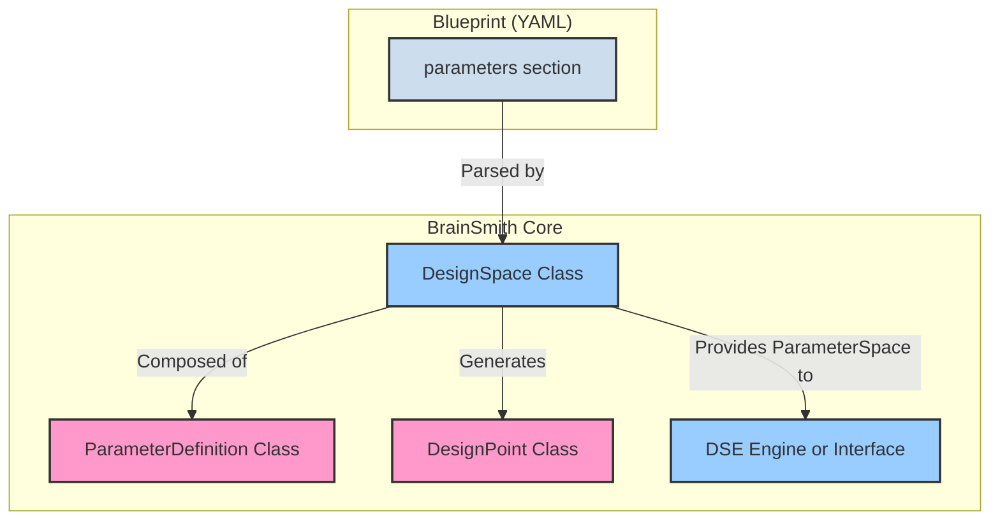
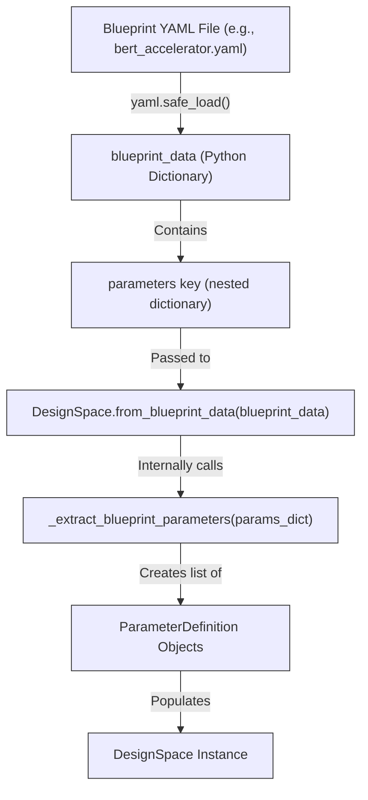
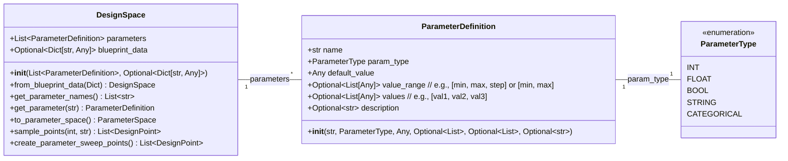
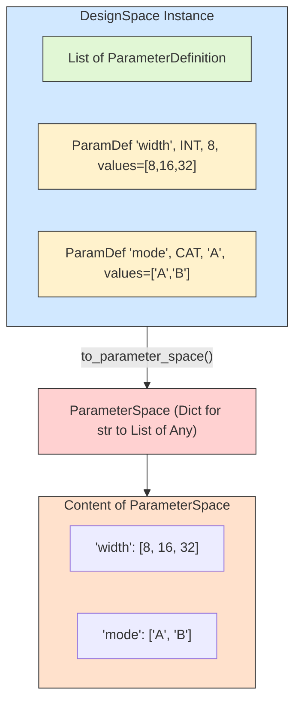
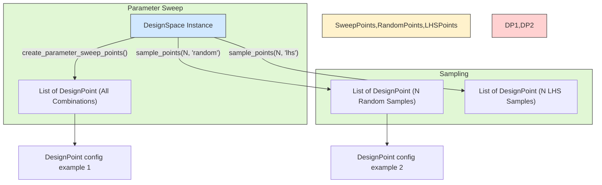
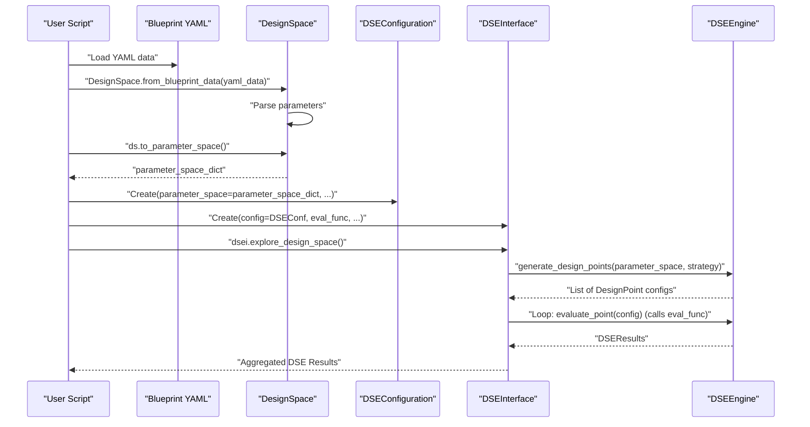
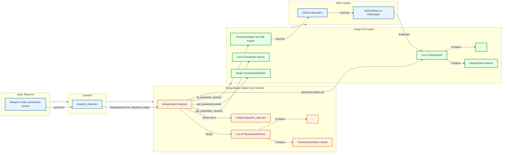

# Deep Dive: The `DesignSpace` in BrainSmith Core

**The `DesignSpace` class (`brainsmith.core.dse.design_space.DesignSpace`) is a cornerstone of BrainSmith's Design Space Exploration (DSE) capabilities, responsible for interpreting hardware parameter definitions from blueprints and providing a structured representation of all possible design configurations.** This document provides a detailed analysis of its instantiation, internal structure, attributes, and how it's utilized within the BrainSmith Core ecosystem.

*(Source: `brainsmith/core/dse/design_space.py`)*

## 1. Core Concepts: Defining the Searchable Realm

Before diving into the `DesignSpace` class itself, let's clarify the fundamental concepts it embodies:

*   **Parameter:** A configurable aspect of a hardware accelerator, such as the bit-width of an operation, the number of processing elements (PEs), or the depth of a buffer. Each parameter has a name, a type (integer, float, categorical, etc.), a default value, and a defined set of allowed values or a range.
*   **Design Space:** The multi-dimensional space formed by all possible combinations of all defined parameters. Each dimension corresponds to a parameter, and the extent of that dimension is defined by the parameter's allowed values.
*   **Design Point:** A single, concrete configuration within the design space. It represents one specific set of values for all parameters, effectively a unique hardware design candidate.
*   **Blueprint:** A YAML file that, among other things, contains a `parameters` section. This section is the source from which `DesignSpace` derives its structure.

**Overall Role of `DesignSpace`:**

The `DesignSpace` class acts as the bridge between the human-readable blueprint definition and the programmatic structures needed by the DSE framework.

## 2. Instantiation: From Blueprint to `DesignSpace` Object

The primary way to create a `DesignSpace` instance is by using its static factory method `from_blueprint_data()`. This method takes the parsed Python dictionary representation of a blueprint YAML file.

**Instantiation Flow:**


**Code Example:**
```python
import yaml
from brainsmith.core.dse.design_space import DesignSpace

# Path to your blueprint file
blueprint_path = 'brainsmith/libraries/blueprints/transformers/bert_accelerator.yaml' # Example path

# 1. Load blueprint YAML into a Python dictionary
with open(blueprint_path, 'r') as f:
    blueprint_data = yaml.safe_load(f)

# 2. Instantiate DesignSpace using the factory method
#    This focuses on the 'parameters' section within blueprint_data.
if 'parameters' in blueprint_data:
    design_space_instance = DesignSpace.from_blueprint_data(blueprint_data)
    print(f"DesignSpace instantiated with {len(design_space_instance.parameters)} parameters.")
else:
    print("Blueprint does not contain a 'parameters' section.")
    design_space_instance = DesignSpace(parameters=[], blueprint_data=blueprint_data)


# The design_space_instance now holds a structured representation of parameters.
```
The `_extract_blueprint_parameters` method is crucial here. It recursively traverses the (potentially nested) `parameters` dictionary in the blueprint, creating `ParameterDefinition` objects for each leaf node that represents a configurable parameter. Parameter names are constructed using dot notation for nested structures (e.g., `folding.PE`, `precision.weights`).

*(Source: `brainsmith/core/dse/design_space.py DesignSpace.from_blueprint_data`, `DesignSpace._extract_blueprint_parameters`)*

## 3. Internal Structure and Attributes

A `DesignSpace` object primarily holds a list of `ParameterDefinition` objects and a reference to the original blueprint data.

**Class Diagram for `DesignSpace` and `ParameterDefinition`:**


*   **`parameters: List[ParameterDefinition]`**:
    This is the core attribute. It's a list where each element is an instance of `ParameterDefinition`.
    *   **`ParameterDefinition` Attributes:**
        *   `name (str)`: The unique, fully qualified name of the parameter (e.g., `core.data_width`, `memory.buffer_depth.input_buffer`).
        *   `param_type (ParameterType)`: An enum (`INT`, `FLOAT`, `BOOL`, `STRING`, `CATEGORICAL`) indicating the type of the parameter. This influences how its values are interpreted and sampled.
        *   `default_value (Any)`: The default value for this parameter, used if no specific value is provided for a design point or if the parameter is not part of a sweep.
        *   `value_range (Optional[List[Any]])`: Used for numerical parameters (`INT`, `FLOAT`) to define a continuous or stepped range.
            *   Example: `[16, 64, 16]` could mean min 16, max 64, step 16 (i.e., 16, 32, 48, 64).
            *   Example: `[0.1, 0.9]` could mean min 0.1, max 0.9 (for float, step might be implicit or handled by sampler).
        *   `values (Optional[List[Any]])`: Used for `CATEGORICAL` parameters or for discrete numerical parameters to explicitly list all allowed values.
            *   Example: `["U250", "ZCU104"]` for a target device.
            *   Example: `[8, 16, 32]` for a specific bit-width.
        *   `description (Optional[str])`: A human-readable description of the parameter, often sourced from the blueprint.

*   **`blueprint_data: Optional[Dict[str, Any]]`**:
    A reference to the original Python dictionary loaded from the blueprint YAML. This can be useful for accessing other parts of the blueprint (e.g., `finn_config`, `dse_objectives`) that are not directly part of the parameter definitions but are related to the overall design process.

*(Source: `brainsmith/core/dse/design_space.py DesignSpace.__init__`, `ParameterDefinition.__init__`)*

## 4. Key Functionality and Usage

The `DesignSpace` class provides several methods to interact with the defined parameters and to generate design points for exploration.

### 4.1. Parameter Access

*   **`get_parameter_names() -> List[str]`**: Returns a flat list of all fully qualified parameter names.
    ```python
    # Assuming design_space_instance is available
    param_names = design_space_instance.get_parameter_names()
    # print(f"Available parameter names: {param_names[:5]}") # Print first 5
    ```
*   **`get_parameter(name: str) -> Optional[ParameterDefinition]`**: Retrieves a specific `ParameterDefinition` object by its name.
    ```python
    # Assuming design_space_instance is available
    # bit_width_param_def = design_space_instance.get_parameter("precision.activation_bit_width")
    # if bit_width_param_def:
    #     print(f"Default for activation_bit_width: {bit_width_param_def.default_value}")
    ```

### 4.2. Conversion to `ParameterSpace` for DSE Engines

A crucial method is `to_parameter_space()`, which transforms the list of `ParameterDefinition` objects into a `ParameterSpace` (a type alias for `Dict[str, List[Any]]`). This dictionary format maps each parameter name to a list of its concrete, enumerable values. This format is often directly consumable by DSE engines or sampling libraries.

**Transformation from `DesignSpace` to `ParameterSpace`:**


**Code Example:**
```python
# Assuming design_space_instance is available
parameter_space_for_engine = design_space_instance.to_parameter_space()

# print("Parameter space for DSE engine:")
# for param_name, possible_values in list(parameter_space_for_engine.items())[:3]: # Print first 3
#     print(f"  {param_name}: {possible_values}")
```
This method intelligently expands ranges (e.g., `value_range = [10, 30, 10]` becomes `[10, 20, 30]`) and uses explicit `values` lists directly.

*(Source: `brainsmith/core/dse/design_space.py DesignSpace.to_parameter_space`)*

### 4.3. Generating Design Points

`DesignSpace` can generate `DesignPoint` objects, which represent specific configurations.

*   **`DesignPoint(config: Dict[str, Any], ...)`**:
    Each `DesignPoint` holds a `config` dictionary (mapping parameter names to their chosen values for that point) and has a unique `id`.

*   **`create_parameter_sweep_points() -> List[DesignPoint]`**:
    Generates all possible combinations of parameter values (a full factorial or grid search). This can result in a very large number of points if there are many parameters or many values per parameter.

*   **`sample_points(num_points: int, strategy: str = "random") -> List[DesignPoint]`**:
    Generates a specified `num_points` by sampling from the design space.
    *   `strategy="random"`: Simple random sampling for each parameter from its allowed values.
    *   `strategy="lhs"`: (If implemented) Latin Hypercube Sampling, which provides better coverage of the parameter space with fewer points than random sampling.
    *   Other strategies could be added.

**Design Point Generation Flow:**


**Code Example:**
```python
# Assuming design_space_instance is available

# Generate all points for a sweep (use with caution for large spaces)
# sweep_design_points = design_space_instance.create_parameter_sweep_points()
# print(f"Generated {len(sweep_design_points)} points for a full sweep.")
# if sweep_design_points:
#     print(f"First sweep point config: {sweep_design_points[0].config}")

# Sample a few random points
num_samples = 5
random_design_points = design_space_instance.sample_points(num_points=num_samples, strategy="random")
# print(f"\nGenerated {len(random_design_points)} random design points:")
# for i, dp in enumerate(random_design_points):
#     print(f"  Sample {i+1} ID: {dp.id}, Config: {dp.config}")
```

*(Source: `brainsmith/core/dse/design_space.py DesignSpace.create_parameter_sweep_points`, `DesignSpace.sample_points`, `DesignPoint`)*

### 4.4. Interaction with the DSE Workflow

The `DesignSpace` (or more commonly, the `ParameterSpace` derived from it) is a critical input to the DSE process, typically managed by `DSEInterface` and `DSEEngine`.

**Role of `DesignSpace` in DSE Setup:**

1.  A `DesignSpace` is created from the blueprint.
2.  `to_parameter_space()` is called to get the dictionary format.
3.  This `ParameterSpace` is passed to `DSEConfiguration`.
4.  `DSEInterface` uses this configuration. Its internal `DSEEngine` then uses the `ParameterSpace` and the chosen `SamplingStrategy` to generate design point configurations to be evaluated.

While `DSEEngine` might directly consume the `ParameterSpace` dictionary, the `DesignSpace` object itself can still be useful for retrieving detailed `ParameterDefinition`s if needed during advanced DSE strategies or for richer logging.

## 5. Advanced Topics

*   **Handling Nested Parameters:** As mentioned, `DesignSpace` flattens nested parameter structures from the blueprint into a list of `ParameterDefinition`s with dot-separated names (e.g., `memory.bank_0.size`). This makes each parameter uniquely addressable while preserving its hierarchical origin conceptually.
*   **Parameter Validation/Constraints:** Currently, `DesignSpace` primarily focuses on defining the parameters and their allowed values based on the blueprint. Complex inter-parameter constraints (e.g., "if param A is X, then param B must be Y") are generally not enforced at the `DesignSpace` level itself but would typically be handled by:
    1.  The evaluation function (which might deem such points invalid).
    2.  More advanced DSE strategies or constraint solvers that operate on the generated points.
    3.  Future enhancements to the blueprint specification and `DesignSpace` parsing.

## 6. Summary Diagram: `DesignSpace` Ecosystem

This diagram provides a holistic view of `DesignSpace` and its key interactions:



## 7. Conclusion

The `DesignSpace` class is a fundamental component in BrainSmith Core, providing the essential bridge between a declarative blueprint and the algorithmic needs of design space exploration. By parsing parameter definitions, offering structured access to them, and facilitating the generation of concrete design points, it enables systematic and automated exploration of potential hardware accelerator configurations. Its clear separation of concerns and well-defined interface make it a vital part of the DSE workflow.