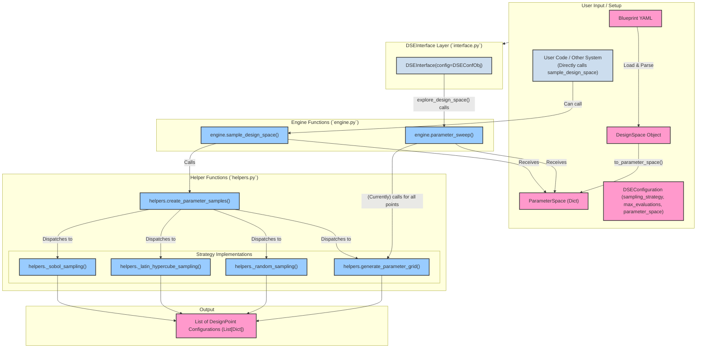
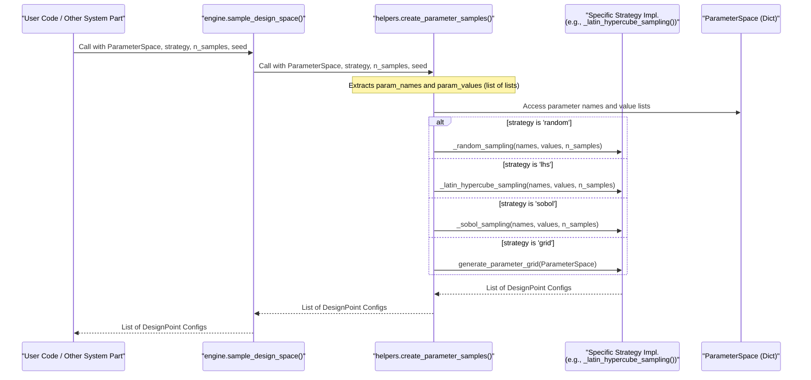

# Deep Dive: DSE Point Generation in BrainSmith Core

*(Sources: `brainsmith/core/dse/engine.py`, `brainsmith/core/dse/helpers.py`, `brainsmith/core/dse/types.py`, `brainsmith/core/dse/interface.py`)*

## 1. Introduction: Generating Design Candidates for DSE

**Core Concept: BrainSmith Core's Design Space Exploration (DSE) point generation relies on a set of functions within the `engine` and `helpers` modules to create diverse sets of hardware parameter configurations (design points) from a defined `ParameterSpace`, enabling systematic or stochastic exploration before evaluation.**

### 1.1. What is DSE Point Generation?

In the context of BrainSmith Core, DSE point generation is the crucial step of translating a defined, abstract design space into a concrete list of candidate hardware configurations. Each "design point" is a specific combination of values for all configurable parameters of an accelerator (e.g., processing element counts, bit-widths, buffer sizes). The primary responsibility of the point generation mechanism is to produce these lists of design points, which are then passed to an evaluation stage (typically involving hardware synthesis and simulation or estimation via `brainsmith.core.api.forge`).

This process is fundamental to DSE, as the quality and diversity of the generated points directly impact the ability to find optimal or near-optimal hardware designs.

### 1.2. Key Functions and Modules Involved

The generation of design points is not managed by a single "DSE Engine" class but rather through a collection of functions and types primarily located in:

*   **`brainsmith.core.dse.engine.py`**:
    *   `parameter_sweep()`: The main DSE loop function that orchestrates the generation (currently full grid) and evaluation of points.
    *   `sample_design_space()`: A function specifically for generating a list of sampled design points using various strategies, without immediate evaluation.
*   **`brainsmith.core.dse.helpers.py`**:
    *   `create_parameter_samples()`: The core dispatcher that, based on a strategy string, calls specific internal functions to implement different sampling algorithms (random, LHS, Sobol) or grid generation.
    *   `generate_parameter_grid()`: Implements full factorial (grid) generation using `itertools.product`.
    *   Internal functions like `_random_sampling()`, `_latin_hypercube_sampling()`, `_sobol_sampling()`.
*   **`brainsmith.core.dse.types.py`**:
    *   `DSEConfiguration`: A dataclass holding DSE settings, including the `sampling_strategy` (an enum) and the `parameter_space`.
    *   `SamplingStrategy`: An enum defining available strategies (`RANDOM`, `GRID`, `LATIN_HYPERCUBE`, `SOBOL`).
    *   `ParameterSpace` (type alias for `Dict[str, List[Any]]`): The standard input format for point generation functions.
*   **`brainsmith.core.dse.interface.py`**:
    *   `DSEInterface`: The primary user-facing class that utilizes functions from `engine.py` to run the DSE process. It sets up `DSEConfiguration`.

### 1.3. Core Objective

The core objective of these DSE point generation mechanisms is to provide flexible and effective ways to select or construct design points from the vast `ParameterSpace`. This enables designers to explore trade-offs, discover high-performing configurations, and automate the search for hardware accelerators tailored to specific needs, whether through exhaustive sweeps or more targeted sampling.

## 2. Fundamental Concepts for Point Generation

Understanding the following concepts is key to grasping how BrainSmith Core generates design points for DSE.

### 2.1. `ParameterSpace` (from `brainsmith.core.dse.types.ParameterSpace`)

The `ParameterSpace` is the primary input data structure for all point generation functions in BrainSmith Core. It is a Python dictionary where:
*   **Keys** are `str` representing the fully qualified names of the hardware parameters (e.g., `core.pe_count`, `memory.buffer_depth`).
*   **Values** are `List[Any]` representing all possible discrete, enumerable values that the corresponding parameter can take.

**Core Takeaway: The `ParameterSpace` dictionary, typically derived from a `DesignSpace` object, provides the concrete, itemized lists of values for each parameter that point generation algorithms will combine or sample from.**

*(Source: `brainsmith/core/dse/types.py`)*

```python
# Example ParameterSpace structure
parameter_space_example = {
    "folding.PE": [16, 32, 64],
    "folding.SIMD": [4, 8, 16],
    "precision.activation_bits": [4, 8],
    "target_device": ["ZCU104", "U250"]
}
```
This structure is typically generated by calling the `to_parameter_space()` method on a `brainsmith.core.dse.design_space.DesignSpace` instance, which itself is usually created from a blueprint YAML file. The `DesignSpace` object handles the parsing of parameter definitions (ranges, choices, etc.) and their conversion into these enumerated lists.

### 2.2. `SamplingStrategy` Enum (from `brainsmith.core.dse.types.SamplingStrategy`)

The `SamplingStrategy` enum defines the set of recognized algorithms that can be used to generate design points, particularly when using the `engine.sample_design_space()` function (which calls `helpers.create_parameter_samples()`).

*(Source: `brainsmith/core/dse/types.py`)*

```python
from brainsmith.core.dse.types import SamplingStrategy

# Available strategies
# SamplingStrategy.RANDOM
# SamplingStrategy.GRID
# SamplingStrategy.LATIN_HYPERCUBE # (lhs)
# SamplingStrategy.SOBOL
```
The choice of strategy is typically specified in the `DSEConfiguration` object and passed as a string to `helpers.create_parameter_samples()`.

### 2.3. Design Point Configuration (`Dict[str, Any]`)

The output of any point generation function is a list, where each element represents a single, complete design point. This design point is a Python dictionary:
*   **Keys** are `str` (the parameter names).
*   **Values** are `Any` (the specific value chosen for that parameter for this particular design point).

```python
# Example of a single Design Point Configuration
design_point_config_example = {
    "folding.PE": 32,
    "folding.SIMD": 8,
    "precision.activation_bits": 4,
    "target_device": "ZCU104"
}

# Point generation functions return a list of such dictionaries
# list_of_design_points = [design_point_config_1, design_point_config_2, ...]
```
These configuration dictionaries are then used by the evaluation part of the DSE process (e.g., passed to `brainsmith.core.api.forge()`).
## 3. Architecture of Point Generation

**Core Takeaway: BrainSmith Core's DSE point generation is architected as a set of cooperating functions across `interface.py`, `engine.py`, and `helpers.py`, rather than a monolithic class. `DSEInterface` orchestrates the process, `engine.py` functions manage DSE loops and direct sampling calls, and `helpers.py` contains the specific algorithms for generating or sampling points from a `ParameterSpace`.**

The generation of design points is a collaborative effort between several modules:

### 3.1. Orchestration via `DSEInterface` and `engine.parameter_sweep`

The primary user-facing entry point for a full DSE run is the `DSEInterface` class (from `brainsmith.core.dse.interface.py`).

*   **`DSEInterface.explore_design_space()`**:
    *   This method is typically called by the user to start a DSE.
    *   It takes a `model_path` and an optional list of `stages`.
    *   Crucially, it uses its `self.config` (a `DSEConfiguration` object) which contains the `parameter_space` and other DSE settings.
    *   It then calls `brainsmith.core.dse.engine.parameter_sweep()` to execute the exploration.

*   **`engine.parameter_sweep()`**:
    *   This function (from `brainsmith.core.dse.engine.py`) is the main DSE loop.
    *   It receives the `model_path`, `blueprint_path` (or `blueprint_data`), the `parameters` (which is the `ParameterSpace` dictionary), and the `DSEConfiguration`.
    *   **Point Generation within `parameter_sweep`**:
        *   It calls `helpers.generate_parameter_grid(parameters)` to create an exhaustive list of all possible design point combinations from the provided `ParameterSpace`.
        *   It then iterates through this complete list of combinations, evaluating each one either sequentially (`_run_sequential_sweep`) or in parallel (`_run_parallel_sweep`) by calling `_evaluate_single_configuration` (which uses `brainsmith.core.api.forge`).
    *   **Note on Sampling Strategies in `parameter_sweep`**: As currently implemented (based on the direct call to `generate_parameter_grid`), the `parameter_sweep` function itself performs a full grid search. The `sampling_strategy` and `max_evaluations` fields from `DSEConfiguration` might not directly limit or alter the *generation* of points to a sampled subset *within this specific function*. `DSEInterface` does call `helpers.optimize_parameter_selection` which might adjust `n_samples` or strategy for other contexts, but `parameter_sweep` appears to proceed with a full grid of the input `ParameterSpace`.

### 3.2. Explicit Sampling via `engine.sample_design_space`

For scenarios where a user wants to generate a list of sampled design points *without* immediately evaluating them, or wants to use a specific sampling strategy for a limited number of points, the `brainsmith.core.dse.engine.sample_design_space()` function is available.

*   **`engine.sample_design_space()`**:
    *   Inputs: `parameters` (`ParameterSpace`), `strategy` (string, e.g., 'random', 'lhs'), `n_samples` (int), `seed` (Optional[int]).
    *   It directly calls `helpers.create_parameter_samples()` to do the actual work.
    *   Returns: A `List[Dict[str, Any]]` (list of design point configurations).

This function provides a more direct interface to the sampling capabilities.

### 3.3. The `helpers.create_parameter_samples` Dispatcher

This function (from `brainsmith.core.dse.helpers.py`) is the heart of the strategy-based point generation.

*   **`helpers.create_parameter_samples()`**:
    *   Inputs: `parameters` (`ParameterSpace`), `strategy` (string), `n_samples` (int), `seed` (Optional[int]).
    *   It acts as a dispatcher based on the `strategy` string:
        *   If `strategy == 'grid'`: It calls `helpers.generate_parameter_grid(parameters)`. In this case, `n_samples` is effectively ignored, and all combinations are returned.
        *   If `strategy == 'random'`: It calls `helpers._random_sampling(param_names, param_values, n_samples)`.
        *   If `strategy == 'lhs'`: It calls `helpers._latin_hypercube_sampling(param_names, param_values, n_samples)`.
        *   If `strategy == 'sobol'`: It calls `helpers._sobol_sampling(param_names, param_values, n_samples)`.
        *   If the strategy is unknown, it defaults to random sampling with a warning.
    *   It first extracts `param_names` and `param_values` (list of lists) from the input `ParameterSpace` dictionary to pass to the internal sampling functions.

### 3.4. Overall Functional Flow Diagram

This diagram illustrates the relationships and flow between the key components involved in DSE point generation.


This architecture emphasizes a functional approach, with `helpers.create_parameter_samples` serving as the central hub for different point generation algorithms, operating on a well-defined `ParameterSpace` data structure. The `engine.parameter_sweep` function currently leverages only the grid generation aspect for its main DSE loop.
## 4. Implemented Point Generation Strategies (in `helpers.py`)

**Core Takeaway: BrainSmith Core implements its point generation strategies as distinct functions within `brainsmith.core.dse.helpers.py`. These functions are invoked by the `create_parameter_samples` dispatcher and operate on a `ParameterSpace` dictionary, where each parameter maps to an explicit list of its possible values.**

The actual algorithms for generating or sampling design points reside in `brainsmith.core.dse.helpers.py`. The `create_parameter_samples` function acts as a router to these implementations based on the chosen strategy.

*(Source: `brainsmith/core/dse/helpers.py`)*

### 4.1. Grid Generation (`generate_parameter_grid`)

*   **Strategy Name**: `grid` (as recognized by `create_parameter_samples` and `SamplingStrategy.GRID`)
*   **Function**: `brainsmith.core.dse.helpers.generate_parameter_grid(parameters: Dict[str, List[Any]]) -> List[Dict[str, Any]]`
*   **Explanation**: This strategy performs an exhaustive, full factorial exploration of the design space. It generates every possible unique combination of parameter values.
*   **Input**:
    *   `parameters`: A `ParameterSpace` dictionary (e.g., `{'param_A': [1, 2], 'param_B': ['x', 'y']}`).
*   **Mechanism**:
    *   It extracts parameter names and their corresponding lists of values.
    *   It then uses `itertools.product(*param_values)` to compute the Cartesian product of these value lists.
    *   Each resulting tuple from the product is converted into a dictionary mapping parameter names to their chosen values for that combination.
*   **Output**: A list of dictionaries, where each dictionary is a unique design point configuration.
*   **Usage**:
    *   Called directly by `engine.parameter_sweep()` for its main DSE loop.
    *   Called by `helpers.create_parameter_samples()` if `strategy='grid'`.
    *   The `n_samples` argument to `create_parameter_samples` is effectively ignored when 'grid' strategy is chosen, as it always returns all combinations.

```python
# Conceptual usage within create_parameter_samples
# if strategy == 'grid':
#     return generate_parameter_grid(parameters)

# Example of generate_parameter_grid
import itertools

def generate_parameter_grid_example(parameters: dict):
    if not parameters:
        return [{}]
    param_names = list(parameters.keys())
    param_values = list(parameters.values())
    
    combinations = []
    for combination_tuple in itertools.product(*param_values):
        param_dict = dict(zip(param_names, combination_tuple))
        combinations.append(param_dict)
    return combinations

params = {'pe_count': [1, 2], 'simd': [10, 20]}
grid_points = generate_parameter_grid_example(params)
# grid_points would be:
# [
#   {'pe_count': 1, 'simd': 10}, 
#   {'pe_count': 1, 'simd': 20},
#   {'pe_count': 2, 'simd': 10},
#   {'pe_count': 2, 'simd': 20}
# ]
```

### 4.2. Random Sampling (`_random_sampling`)

*   **Strategy Name**: `random` (as recognized by `create_parameter_samples` and `SamplingStrategy.RANDOM`)
*   **Function**: `brainsmith.core.dse.helpers._random_sampling(param_names: List[str], param_values: List[List[Any]], n_samples: int) -> List[Dict[str, Any]]`
*   **Explanation**: This strategy generates `n_samples` design points. For each point, and for each parameter, a value is chosen uniformly at random from that parameter's list of allowed values.
*   **Input**:
    *   `param_names`: List of parameter names.
    *   `param_values`: List of lists, where each inner list contains the possible values for the corresponding parameter.
    *   `n_samples`: The desired number of design points to generate.
*   **Mechanism**:
    *   It loops `n_samples` times.
    *   In each iteration, it constructs a new design point dictionary.
    *   For each parameter (iterating through `param_names` and `param_values` simultaneously), it uses `random.choice(values)` to pick one value from the list of allowed values for that parameter.
*   **Output**: A list of `n_samples` design point configurations. Note that with pure random sampling, duplicate points are possible if `n_samples` is large relative to the space size or if parameter value lists are small.

```python
# Conceptual usage within create_parameter_samples
# elif strategy == 'random':
#     return _random_sampling(param_names, param_values, n_samples)

# Example of _random_sampling (simplified)
import random

def _random_sampling_example(param_names: list, param_values: list, n_samples: int):
    samples = []
    for _ in range(n_samples):
        sample_config = {}
        for name, values_for_param in zip(param_names, param_values):
            sample_config[name] = random.choice(values_for_param)
        samples.append(sample_config)
    return samples

names = ['pe_count', 'simd']
values = [[1, 2, 3, 4], [10, 20, 30]]
random_points = _random_sampling_example(names, values, n_samples=2)
# random_points could be (e.g.):
# [
#   {'pe_count': 3, 'simd': 10},
#   {'pe_count': 1, 'simd': 30}
# ]
```

### 4.3. Latin Hypercube Sampling (`_latin_hypercube_sampling`)

*   **Strategy Name**: `lhs` (as recognized by `create_parameter_samples` and `SamplingStrategy.LATIN_HYPERCUBE`)
*   **Function**: `brainsmith.core.dse.helpers._latin_hypercube_sampling(param_names: List[str], param_values: List[List[Any]], n_samples: int) -> List[Dict[str, Any]]`
*   **Explanation**: Latin Hypercube Sampling (LHS) is a stratified sampling technique that aims to provide more uniform coverage of the parameter space compared to pure random sampling, especially for a given number of samples. It divides each parameter's range into `n_samples` strata and ensures that each stratum is sampled exactly once.
*   **Input**:
    *   `param_names`: List of parameter names.
    *   `param_values`: List of lists of allowed values.
    *   `n_samples`: The desired number of design points.
*   **Mechanism**:
    1.  It uses `scipy.stats.qmc.LatinHypercube(d=n_dims, seed=...)` to create an LHS sampler, where `d` is the number of parameters (dimensions).
    2.  It calls `sampler.random(n=n_samples)` to get `n_samples` points in a normalized `d`-dimensional hypercube (each coordinate between 0 and 1).
    3.  For each generated LHS point (which is an array of `d` normalized values):
        *   It iterates through each dimension `i` (corresponding to `param_names[i]` and `param_values[i]`).
        *   The normalized value `lhs_sample[i]` (from 0 to 1) is scaled to an index into the list `param_values[i]`: `idx = int(lhs_sample[i] * len(values))`.
        *   The index is clamped to ensure it's valid: `min(idx, len(values) - 1)`.
        *   The parameter value `values[idx]` is selected for the current design point configuration.
*   **Output**: A list of `n_samples` design point configurations, designed for better space coverage.
*   **Dependencies**: `numpy`, `scipy.stats.qmc`.

```python
# Conceptual usage within create_parameter_samples
# elif strategy == 'lhs':
#     return _latin_hypercube_sampling(param_names, param_values, n_samples)

# Simplified conceptual flow for one LHS sample point
# Assume lhs_sample_vector = [0.25, 0.8] for 2 params
# param_values = [[10,20,30,40], ['a','b','c','d','e']]

# Param 1: idx = int(0.25 * 4) = 1. Value = param_values[0][1] = 20
# Param 2: idx = int(0.8 * 5) = 4. Value = param_values[1][4] = 'e'
# Resulting point: {'param1': 20, 'param2': 'e'}
```

### 4.4. Sobol Sampling (`_sobol_sampling`)

*   **Strategy Name**: `sobol` (as recognized by `create_parameter_samples` and `SamplingStrategy.SOBOL`)
*   **Function**: `brainsmith.core.dse.helpers._sobol_sampling(param_names: List[str], param_values: List[List[Any]], n_samples: int) -> List[Dict[str, Any]]`
*   **Explanation**: Sobol sequence sampling is a quasi-random low-discrepancy sequence method. Like LHS, it aims to cover the parameter space more uniformly than pseudo-random numbers, which is beneficial for numerical integration and exploration.
*   **Input**:
    *   `param_names`: List of parameter names.
    *   `param_values`: List of lists of allowed values.
    *   `n_samples`: The desired number of design points.
*   **Mechanism**:
    1.  It uses `scipy.stats.qmc.Sobol(d=n_dims, seed=...)` to create a Sobol sequence generator.
    2.  It calls `sampler.random(n=n_samples)` to get `n_samples` points.
    3.  The mapping from normalized Sobol samples to discrete parameter values is identical to the LHS mechanism: scale the [0,1) value to an index into the parameter's value list.
*   **Output**: A list of `n_samples` design point configurations, generated using a low-discrepancy sequence.
*   **Dependencies**: `numpy`, `scipy.stats.qmc`.

```python
# Conceptual usage within create_parameter_samples
# elif strategy == 'sobol':
#     return _sobol_sampling(param_names, param_values, n_samples)

# Mapping mechanism is similar to LHS:
# Normalized sobol_sample_vector -> indices -> discrete values
```
These functions form the core toolkit for generating design points based on different exploration needs, from exhaustive sweeps to various forms of intelligent sampling.
## 5. Workflow: Point Generation in Action

**Core Takeaway: Design points are typically generated either as part of a full sweep within `engine.parameter_sweep` (currently always using grid generation) or explicitly via `engine.sample_design_space` which allows for various sampling strategies.**

This section illustrates the typical workflows for how design points are generated and used within BrainSmith Core.

### 5.1. Scenario 1: Full Sweep via `DSEInterface` and `engine.parameter_sweep`

This is the most common workflow when a user initiates a complete Design Space Exploration run.

1.  **Setup `DSEConfiguration`**: The user (or a higher-level script) prepares a `DSEConfiguration` object. This includes:
    *   `parameter_space`: A `Dict[str, List[Any]]` (the `ParameterSpace`) defining all parameters and their enumerated possible values. This is typically obtained from `DesignSpace.to_parameter_space()`.
    *   `blueprint_path`: Path to the blueprint YAML.
    *   Other settings like `objectives`, `max_parallel`, etc.
    *   The `sampling_strategy` and `max_evaluations` are set in `DSEConfiguration`, but as noted, `engine.parameter_sweep` currently defaults to a full grid generation.

2.  **Instantiate `DSEInterface`**:
    ```python
    from brainsmith.core.dse.interface import DSEInterface
    from brainsmith.core.dse.types import DSEConfiguration, DSEObjective, OptimizationObjective, ParameterSpace
    
    # Assume parameter_space_dict is populated
    parameter_space_dict: ParameterSpace = {
        "param_A": [1, 2, 3],
        "param_B": ["low", "high"]
    }
    
    objectives = [DSEObjective(name="performance.throughput", direction=OptimizationObjective.MAXIMIZE)]
    
    config = DSEConfiguration(
        blueprint_path="path/to/blueprint.yaml",
        parameter_space=parameter_space_dict,
        objectives=objectives,
        max_parallel=4 
        # sampling_strategy and max_evaluations might be set but 
        # parameter_sweep currently generates a full grid.
    )
    dse_runner = DSEInterface(config)
    ```

3.  **Call `explore_design_space()`**:
    ```python
    # Assume model_path is defined
    model_path = "path/to/model.onnx"
    dse_results_collection = dse_runner.explore_design_space(model_path=model_path)
    ```

4.  **Internal Call to `engine.parameter_sweep()`**:
    *   `DSEInterface.explore_design_space()` calls `brainsmith.core.dse.engine.parameter_sweep()`, passing the `model_path`, `blueprint_path`, `parameter_space` from the configuration, and the `config` object itself.

5.  **Point Generation in `engine.parameter_sweep()`**:
    *   `engine.parameter_sweep()` calls `helpers.generate_parameter_grid(parameters=parameter_space_dict)`.
    *   This generates *all* combinations. For the example above, it would produce:
        ```
        [
            {'param_A': 1, 'param_B': 'low'}, {'param_A': 1, 'param_B': 'high'},
            {'param_A': 2, 'param_B': 'low'}, {'param_A': 2, 'param_B': 'high'},
            {'param_A': 3, 'param_B': 'low'}, {'param_A': 3, 'param_B': 'high'}
        ]
        ```

6.  **Evaluation**: `engine.parameter_sweep()` then iterates through this list of generated design point configurations, calling `_evaluate_single_configuration` for each (which in turn calls `brainsmith.core.api.forge`).

### 5.2. Scenario 2: Explicit Sampling via `engine.sample_design_space`

This workflow is used when one needs to generate a list of design points using a specific sampling strategy without immediately triggering a full DSE evaluation loop. This might be for preliminary analysis, custom evaluation loops, or integration with external optimization tools.

1.  **Prepare `ParameterSpace`**: As before, a `ParameterSpace` dictionary is required.
    ```python
    parameter_space_dict: ParameterSpace = {
        "param_A": [1, 2, 3, 4, 5, 6, 7, 8, 9, 10],
        "param_B": [100, 200, 300, 400, 500],
        "param_C": ["cat", "dog", "mouse", "lion", "tiger"]
    }
    ```

2.  **Call `engine.sample_design_space()`**:
    ```python
    from brainsmith.core.dse.engine import sample_design_space
    
    num_samples_to_generate = 5
    selected_strategy = "lhs" # or "random", "sobol", "grid"
    
    sampled_points = sample_design_space(
        parameters=parameter_space_dict,
        strategy=selected_strategy,
        n_samples=num_samples_to_generate,
        seed=42 # Optional, for reproducibility
    )
    
    # print(f"Generated {len(sampled_points)} points using {selected_strategy} strategy:")
    # for i, point in enumerate(sampled_points):
    #     print(f"  Point {i+1}: {point}")
    ```

3.  **Internal Call to `helpers.create_parameter_samples()`**:
    *   `engine.sample_design_space()` directly calls `brainsmith.core.dse.helpers.create_parameter_samples()`, passing along the `parameters`, `strategy`, `n_samples`, and `seed`.

4.  **Strategy Dispatch and Execution in `helpers.create_parameter_samples()`**:
    *   `helpers.create_parameter_samples()` looks at the `strategy` string.
    *   If `strategy == "lhs"`, it calls `helpers._latin_hypercube_sampling(...)`.
    *   `_latin_hypercube_sampling` uses `scipy.stats.qmc.LatinHypercube` to generate `num_samples_to_generate` (e.g., 5) design point configurations from `parameter_space_dict`.

5.  **Return Sampled Points**: The list of generated design point configurations is returned to the caller. These points can then be used as needed (e.g., for evaluation, analysis, or as input to another process).

### 5.3. Sequence Diagram (Focus on `engine.sample_design_space`)

This diagram details the call sequence when using `engine.sample_design_space` for explicit point generation.


This highlights the two main pathways for point generation: integrated within a full DSE sweep (currently grid-based) or as a standalone, strategy-driven sampling operation.
## 6. Extensibility: Adding New Sampling Strategies

**Core Takeaway: New sampling strategies can be added to BrainSmith Core by implementing a new sampling function within `helpers.py` and updating the `create_parameter_samples` dispatcher and potentially the `SamplingStrategy` enum in `types.py`.**

The functional design of point generation in BrainSmith Core, centered around `helpers.create_parameter_samples`, allows for straightforward extension with new sampling algorithms.

*(Sources: `brainsmith/core/dse/helpers.py`, `brainsmith/core/dse/types.py`)*

### 6.1. Implementing the New Sampling Function

1.  **Create the Function**: Define a new Python function within `brainsmith.core.dse.helpers.py`. This function should generally follow the signature of existing internal sampling functions like `_random_sampling` or `_latin_hypercube_sampling`.
    *   **Inputs**:
        *   `param_names: List[str]`: A list of parameter names.
        *   `param_values: List[List[Any]]`: A list of lists, where each inner list contains the enumerated possible values for the corresponding parameter in `param_names`.
        *   `n_samples: int`: The desired number of samples to generate.
        *   Optionally, `seed: Optional[int]` if the algorithm is stochastic and needs a random seed for reproducibility.
    *   **Output**:
        *   `List[Dict[str, Any]]`: A list of design point configurations. Each configuration is a dictionary mapping parameter names to their chosen values for that sample.

2.  **Implement Logic**: Inside this function, implement the core logic of your new sampling strategy. This might involve:
    *   Using external libraries (e.g., for advanced statistical sampling, Bayesian optimization, evolutionary algorithms – though stateful algorithms would require more significant architectural changes, see Section 7.2).
    *   Custom algorithms for selecting values from `param_values` based on `n_samples`.

### 6.2. Modifying `helpers.create_parameter_samples`

Once the new sampling function is implemented (e.g., `_my_custom_sampling`), it needs to be integrated into the `helpers.create_parameter_samples` dispatcher:

1.  **Add a New Strategy String**: Decide on a string identifier for your new strategy (e.g., `"my_custom_strategy"`).
2.  **Update Conditional Logic**: Add a new `elif` block to `create_parameter_samples` to recognize this string and call your new function:

    ```python
    # In brainsmith/core/dse/helpers.py
    
    # ... (other imports and functions) ...
    
    # def _my_custom_sampling(param_names: List[str], param_values: List[List[Any]], n_samples: int, seed: Optional[int] = None) -> List[Dict[str, Any]]:
    #     # ... your implementation ...
    #     samples = [] 
    #     # ... logic to populate samples ...
    #     return samples

    def create_parameter_samples(
        parameters: Dict[str, List[Any]],
        strategy: str = 'random',
        n_samples: int = 10,
        seed: Optional[int] = None
    ) -> List[Dict[str, Any]]:
        if seed is not None:
            random.seed(seed)
            np.random.seed(seed) # If using numpy for randomness
        
        param_names = list(parameters.keys())
        param_values = list(parameters.values())
        
        if strategy == 'grid':
            return generate_parameter_grid(parameters)
        elif strategy == 'random':
            return _random_sampling(param_names, param_values, n_samples)
        elif strategy == 'lhs':
            return _latin_hypercube_sampling(param_names, param_values, n_samples)
        elif strategy == 'sobol':
            return _sobol_sampling(param_names, param_values, n_samples)
        # Add your new strategy here
        # elif strategy == 'my_custom_strategy': 
        #     return _my_custom_sampling(param_names, param_values, n_samples, seed=seed) # Pass seed if needed
        else:
            logger.warning(f"Strategy '{strategy}' not available, using random sampling")
            return _random_sampling(param_names, param_values, n_samples)
    ```

### 6.3. Updating `SamplingStrategy` Enum (Optional but Recommended)

For better type safety, discoverability, and to make the strategy formally recognized by the system (e.g., for configuration UIs or validation), add your new strategy string to the `SamplingStrategy` enum in `brainsmith.core.dse.types.py`:

```python
# In brainsmith/core/dse/types.py
from enum import Enum

class SamplingStrategy(Enum):
    RANDOM = "random"
    GRID = "grid"
    LATIN_HYPERCUBE = "lhs"
    SOBOL = "sobol"
    # MY_CUSTOM_STRATEGY = "my_custom_strategy" # Add new strategy
```
This allows users to specify `SamplingStrategy.MY_CUSTOM_STRATEGY` in `DSEConfiguration` if the system is set up to pass the enum member's value.

### 6.4. Example: Skeleton of a Custom Strategy

Let's imagine a hypothetical "ReverseOrderStrategy" that simply takes the first `n_samples` combinations from the grid but reverses the order of values for the first parameter.

1.  **Implement `_reverse_order_sampling` in `helpers.py`**:
    ```python
    # In brainsmith/core/dse/helpers.py

    def _reverse_order_sampling(param_names: List[str], param_values: List[List[Any]], n_samples: int, seed: Optional[int] = None) -> List[Dict[str, Any]]:
        if not param_names or not param_values:
            return []

        # Create a temporary modified ParameterSpace for grid generation
        temp_params = dict(zip(param_names, param_values))
        
        # Reverse order of values for the first parameter, if possible
        first_param_name = param_names[0]
        original_first_param_values = list(temp_params[first_param_name]) # Make a copy
        temp_params[first_param_name] = list(reversed(original_first_param_values))

        all_combinations = generate_parameter_grid(temp_params)
        
        # Restore original values for the first parameter in the output if needed,
        # or ensure the reversed order is intended. For this example, we use the reversed.
        
        return all_combinations[:n_samples] # Return up to n_samples
    ```

2.  **Update `create_parameter_samples` in `helpers.py`**:
    ```python
    # ...
    elif strategy == 'sobol':
        return _sobol_sampling(param_names, param_values, n_samples)
    elif strategy == 'reverse_order': # New strategy identifier
        return _reverse_order_sampling(param_names, param_values, n_samples, seed=seed)
    else:
    # ...
    ```

3.  **Update `SamplingStrategy` enum in `types.py` (optional)**:
    ```python
    # In brainsmith/core/dse/types.py
    class SamplingStrategy(Enum):
        # ... existing strategies ...
        SOBOL = "sobol"
        REVERSE_ORDER = "reverse_order" 
    ```

This structured approach ensures that new sampling methods can be integrated cleanly into the existing DSE framework.
## 7. Advanced Topics and Considerations

**Core Takeaway: While the current point generation system is flexible for stateless sampling, supporting adaptive strategies or fully utilizing `max_evaluations` in sweeps would require further architectural enhancements.**

Several advanced topics and considerations arise when working with or extending BrainSmith Core's DSE point generation.

### 7.1. Interaction with `DSEConfiguration.max_evaluations` and `sampling_strategy`

*   **For `engine.sample_design_space()`**:
    *   The `n_samples` parameter (which would typically be derived from `DSEConfiguration.max_evaluations` by the caller) directly controls the number of points generated by sampling strategies like 'random', 'lhs', and 'sobol'.
    *   If `strategy='grid'`, `n_samples` is ignored by `helpers.create_parameter_samples`, and all points are generated by `helpers.generate_parameter_grid`.
*   **For `engine.parameter_sweep()` (as called by `DSEInterface.explore_design_space()`)**:
    *   Currently, `engine.parameter_sweep` calls `helpers.generate_parameter_grid` internally, meaning it always generates points for a full factorial design based on the input `ParameterSpace`.
    *   The `DSEConfiguration.sampling_strategy` and `DSEConfiguration.max_evaluations` fields, while present, do not appear to directly modify this grid generation behavior *within* `parameter_sweep`.
    *   `DSEInterface` *does* call `helpers.optimize_parameter_selection(self.config.parameter_space, self.config.max_evaluations, 'auto')` (or a user-specified strategy) in `explore_design_space` (lines 73-80 of `interface.py`). However, the output of this (`strategy`, `n_samples`) is logged but not explicitly shown to be passed to or used by `engine.parameter_sweep` to alter its point generation.
    *   **Implication**: If a user sets `sampling_strategy` to 'lhs' and `max_evaluations` to 50 in `DSEConfiguration`, the `parameter_sweep` function, as currently structured, would still generate all grid points. The `max_evaluations` might implicitly act as a cap if the evaluation loop were to be stopped early, but the point *generation* itself is exhaustive.
    *   To fully respect `max_evaluations` and `sampling_strategy` within the main `DSEInterface.explore_design_space()` flow, `engine.parameter_sweep` would need to be modified to call `engine.sample_design_space` (or `helpers.create_parameter_samples`) using these configuration values, instead of always defaulting to `helpers.generate_parameter_grid`.

### 7.2. Stateful and Adaptive Strategies

The current point generation mechanism, based on functions in `helpers.py` called by `create_parameter_samples`, is inherently **stateless** for each call. This means each invocation generates points based only on its immediate inputs (`ParameterSpace`, `n_samples`, `strategy`, `seed`) without knowledge of previous calls or evaluation results.

This is suitable for strategies like grid, random, LHS, and Sobol, but poses a challenge for **adaptive strategies** such as:
*   Bayesian Optimization
*   Evolutionary Algorithms
*   Reinforcement Learning-based search

These strategies require:
1.  **State**: Maintaining an internal model or population across iterations.
2.  **Feedback Loop**: Receiving evaluation results of previously suggested points to inform the generation of subsequent points.

To support such strategies effectively, the architecture would likely need to evolve:
*   **Class-based Strategy Pattern**: Introduce a `BaseStrategy` abstract class with methods like:
    *   `suggest_points(n_points: int) -> List[ParameterSet]`
    *   `report_results(results: List[DSEResult]) -> None`
*   **Modified DSE Loop**: The `DSEInterface` or a new "adaptive DSE engine" component would manage the iterative process:
    1.  Ask the strategy instance to `suggest_points`.
    2.  Evaluate these points.
    3.  Feed the `DSEResult` objects back to the strategy instance via `report_results`.
    4.  Repeat until a budget (`max_evaluations`) is exhausted or convergence criteria are met.

This would be a more significant architectural shift than simply adding a new stateless sampling function to `helpers.py`.

### 7.3. The `helpers.optimize_parameter_selection` Function

The `brainsmith.core.dse.helpers.optimize_parameter_selection` function provides logic to recommend a sampling strategy and number of samples based on the total size of the parameter space and the `max_evaluations` budget.

*   **Logic**:
    *   If `strategy == 'auto'`:
        *   If `space_size <= max_evaluations`, recommends 'grid'.
        *   Otherwise, it uses heuristics based on `n_params` and `max_evaluations` to suggest 'lhs', 'sobol', or 'random'.
    *   If a specific strategy is provided, it generally respects it, adjusting `n_samples` to be `max_evaluations` (or `space_size` for 'grid' if smaller).
*   **Usage**:
    *   As mentioned, `DSEInterface.explore_design_space()` calls this function. The key area for future enhancement would be to ensure these recommendations are consistently used to drive the point generation in the main DSE sweep if it's not intended to be an exhaustive grid search.

## 8. Conclusion

**Core Takeaway: BrainSmith Core's DSE point generation provides a functional and extensible foundation for creating design candidates using various standard strategies. While currently geared towards stateless sampling and full grid sweeps in its main DSE loop, its modularity in `helpers.py` allows for easy addition of new stateless samplers, and the overall structure hints at potential pathways for incorporating more advanced, adaptive exploration techniques in the future.**

The DSE point generation mechanism in BrainSmith Core, primarily through functions in `engine.py` and `helpers.py`, plays a vital role in the Design Space Exploration process. It effectively translates a `ParameterSpace` (derived from a `DesignSpace`) into a concrete set of design point configurations ready for evaluation.

Key strengths include:
*   **Clear separation of concerns**: `helpers.py` focuses on sampling algorithms, `engine.py` on DSE loops and direct sampling invocation, and `interface.py` on user interaction and configuration.
*   **Support for standard strategies**: Grid, Random, Latin Hypercube, and Sobol sampling are available via `helpers.create_parameter_samples`.
*   **Extensibility for stateless samplers**: New stateless sampling functions can be readily added to `helpers.py`.

Areas for potential future evolution could involve:
*   Tighter integration of `DSEConfiguration`'s `sampling_strategy` and `max_evaluations` into the main `engine.parameter_sweep` logic to allow sampled sweeps directly through `DSEInterface`.
*   Architectural enhancements to natively support stateful, adaptive DSE strategies, potentially through a class-based strategy pattern and a revised DSE iteration loop.

Overall, the current system provides a robust and understandable framework for generating the candidate designs that fuel the search for optimal hardware accelerators.