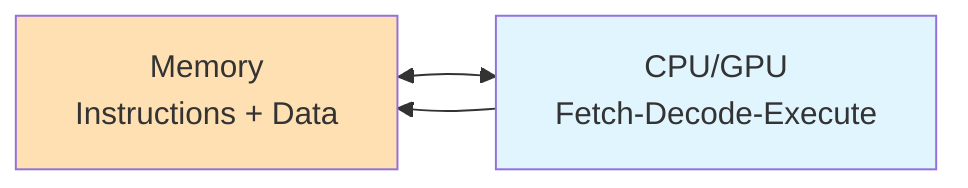
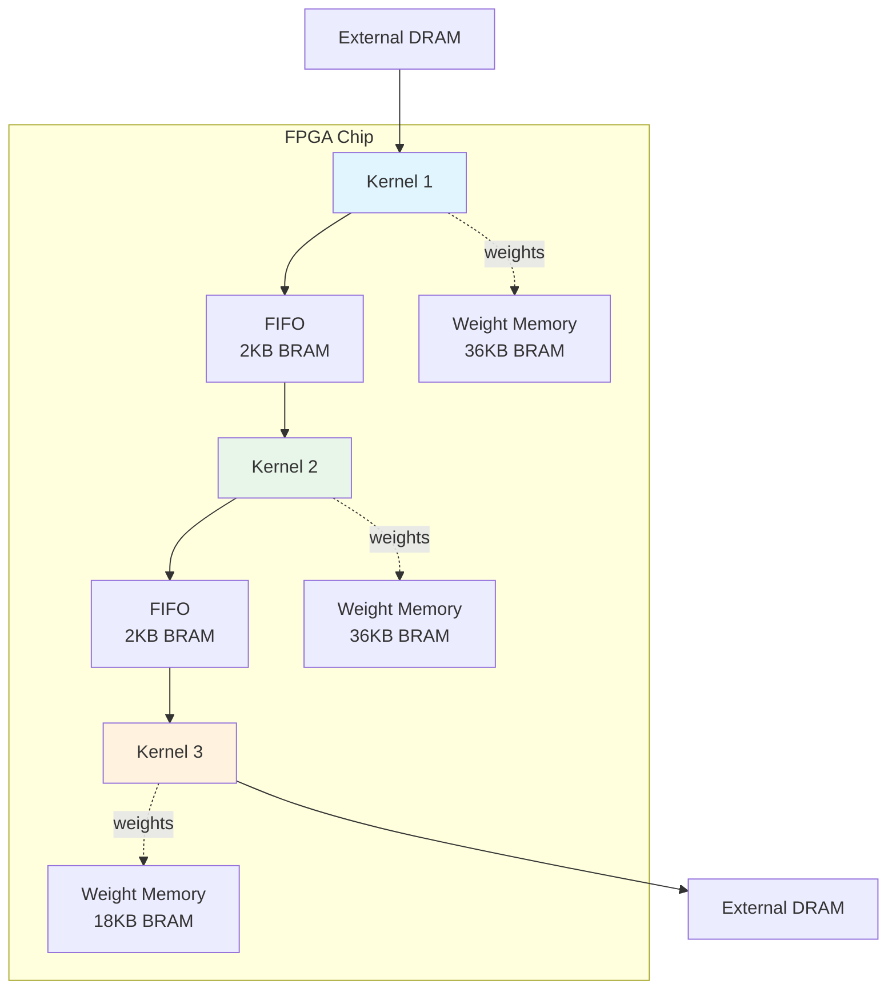
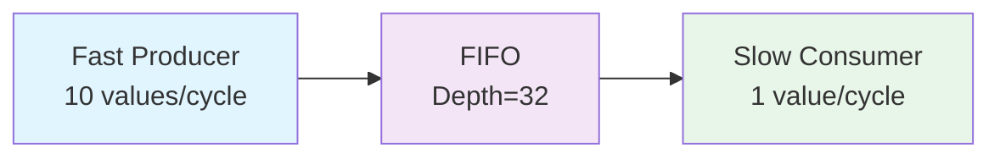

# Dataflow Accelerators

Dataflow accelerators implement neural networks as **streaming hardware pipelines** where data flows continuously through specialized processing elements. Unlike traditional von Neumann architectures (CPUs, GPUs) that fetch instructions and data from memory, dataflow accelerators embed computation directly in hardware with dedicated on-chip buffers, achieving high throughput with low latency and energy consumption.

## Von Neumann vs Dataflow

### Traditional Architecture (CPU/GPU)



**Characteristics**:
- **Sequential**: Fetch instruction → decode → execute → write back
- **Memory-bound**: Every operation requires memory access
- **General-purpose**: Same hardware executes any program
- **Energy-intensive**: Constant instruction fetching and data movement

**Neural Network Execution**:
```python
# Pseudocode for von Neumann execution
for layer in network:
    weights = fetch_from_memory(layer.weights)
    inputs = fetch_from_memory(layer.inputs)
    outputs = compute(inputs, weights)  # Execute instruction
    store_to_memory(layer.outputs, outputs)
```

Every operation incurs memory access overhead.

### Dataflow Architecture (FPGA)


**Characteristics**:
- **Pipelined**: All layers execute concurrently
- **Streaming**: Data flows through without external memory access
- **Specialized**: Each kernel implements one specific operation
- **Energy-efficient**: No instruction fetching, minimal data movement

**Neural Network Execution**:
- Data enters input stream
- Each kernel processes its layer in parallel
- FIFOs buffer between stages
- Output emerges after pipeline fills

---

## Why Dataflow for Neural Networks?

### 1. Predictable Data Flow

Neural network inference follows a **fixed computation graph**:
```
Input → Conv → ReLU → Pool → FC → Softmax → Output
```

Unlike general-purpose programs with branches and loops, neural networks have:
- **Static topology**: Graph structure doesn't change at runtime
- **Regular access patterns**: Predictable data movement
- **No control flow**: No if/else or dynamic loops (except for batch processing)

This predictability enables aggressive spatial specialization—embed the entire computation graph as hardware.

### 2. Pipeline Parallelism

In a dataflow pipeline, **all layers execute simultaneously**:

```
Time:  T0    T1    T2    T3    T4    T5    T6
       ───────────────────────────────────────
Layer1: [X0] → [X1] → [X2] → [X3] → [X4] → [X5]
Layer2:       → [X0] → [X1] → [X2] → [X3] → [X4]
Layer3:              → [X0] → [X1] → [X2] → [X3]
```

**Benefits**:
- **Throughput**: Process one input per cycle after pipeline fills
- **Latency hiding**: Long operations don't block the pipeline
- **Resource efficiency**: Every kernel is active every cycle

**Contrast with sequential execution**:
```
Time:  T0    T1    T2    T3    T4    T5
       ───────────────────────────────────
Layer1: [X0] ────────────────────┐
Layer2:                          [X0] ─────────┐
Layer3:                                        [X0] ───
```
Throughput is 3× slower.

### 3. On-Chip Memory Hierarchy

Dataflow accelerators use **on-chip FIFOs and BRAMs** instead of external DRAM:



**Benefits**:
- **Low latency**: On-chip BRAM access in 1-2 cycles vs. 100+ for DRAM
- **High bandwidth**: Parallel BRAM banks provide GB/s aggregate bandwidth
- **Energy efficiency**: 100-1000× less energy than DRAM access

**Key Insight**: For inference, **weights are constant**. Load once, reuse indefinitely from on-chip memory.

### 4. Bit-Level Precision

FPGAs support **arbitrary bit-widths** (not limited to 8/16/32-bit):

```python
# Traditional GPU: 8-bit integer minimum
weight = int8  # 8 bits

# FPGA: Any precision
weight = ap_int<3>  # 3 bits (saves 62% resources!)
activation = ap_uint<5>  # 5 bits
```

**Impact on Quantized Networks**:
- 2-bit weights → 4× memory savings → 4× more weights on-chip
- 4-bit activations → narrower datapaths → less logic
- Ternary weights {-1, 0, 1} → replace multipliers with MUXes

**Resource Savings**:
```
DSP48 blocks (18×18 multiplier):
- 8-bit × 8-bit: 1 DSP block
- 4-bit × 4-bit: 0.25 DSP blocks (pack 4 multipliers)
- 2-bit × 2-bit: Use LUTs instead of DSPs
```

---

## AXI-Stream Protocol

Dataflow kernels communicate via **AXI-Stream**, a handshake-based streaming protocol:

### Basic Signals

```verilog
// AXI-Stream interface
input  wire [WIDTH-1:0] s_axis_tdata,   // Data payload
input  wire             s_axis_tvalid,  // Data valid
output wire             s_axis_tready,  // Ready to receive

output wire [WIDTH-1:0] m_axis_tdata,   // Data payload
output wire             m_axis_tvalid,  // Data valid
input  wire             m_axis_tready   // Downstream ready
```

### Handshake Protocol

Transfer occurs when **both TVALID and TREADY are high**:

```
Clock:     __/‾‾\__/‾‾\__/‾‾\__/‾‾\__/‾‾\__
TVALID:    ________/‾‾‾‾‾‾‾‾‾‾‾‾‾‾‾‾‾‾\_____
TDATA:     ────────< D0 >< D1 >< D2 >─────
TREADY:    ‾‾‾‾\________/‾‾‾‾‾‾‾‾‾‾‾‾‾‾‾‾‾
Transfer:           ^     ^     ^
                   (wait) (D1)  (D2)
```

**Backpressure**: When `TREADY=0`, upstream must stall and hold `TDATA`.

**Key Properties**:
- **Elastic**: Automatically handles speed mismatches
- **Composable**: Kernels connect like LEGO blocks
- **No deadlocks**: FIFOs between stages prevent pipeline stalls

### FIFO Buffering

FIFOs decouple producer/consumer rates:



**FIFO Sizing**:
- Too small → pipeline stalls (backpressure propagates)
- Too large → wastes BRAM resources
- Optimal → absorbs burst mismatches without stalls

Brainsmith's `step_set_fifo_depths` automatically calculates optimal depths based on kernel latencies.

---

## Memory Hierarchy

Dataflow accelerators use a **three-tier memory hierarchy**:

### Tier 1: Registers (Flip-Flops)

**Purpose**: Pipeline stages, control logic
**Capacity**: 100s-1000s of bits per kernel
**Latency**: 0 cycles (combinational logic + register)
**Bandwidth**: Unlimited (internal wiring)

### Tier 2: On-Chip Memory (BRAM/UltraRAM)

**Purpose**: Weights, intermediate buffers, FIFOs
**Capacity**: MBs per chip (e.g., 28 MB on ZCU104)
**Latency**: 1-2 cycles
**Bandwidth**: 100s GB/s aggregate (many independent banks)

**Example - Weight Storage**:
```
MVAU kernel with 256×256 matrix, 8-bit weights:
Weight memory = 256 × 256 × 8 bits = 512 Kbits = 64 KB
BRAMs needed = 64 KB / 36 Kbit per BRAM ≈ 15 BRAMs
```

### Tier 3: External Memory (DRAM)

**Purpose**: Input/output data, large models that don't fit on-chip
**Capacity**: GBs
**Latency**: 100+ cycles
**Bandwidth**: ~10 GB/s (shared across entire chip)

**Access Pattern**:
- Load inputs once at pipeline start
- Stream through on-chip dataflow accelerator
- Write outputs once at pipeline end

**Goal**: Minimize external memory accesses. Ideal accelerator reads input once, writes output once.

---

## Dataflow Graph Construction

Brainsmith constructs dataflow accelerators by:

### 1. Kernel Inference

Convert ONNX operations to hardware kernels:

```
ONNX Graph:
  Gemm → ReLU → LayerNormalization

Hardware Kernels:
  MVAU → Thresholding → LayerNorm
```

Each ONNX node becomes a hardware kernel instance.

### 2. Streaming Transformation

Insert FIFOs and reshape operations for AXI-Stream compatibility:

```
MVAU[out_shape=(1,256)] → Thresholding[in_shape=(1,256)]
                ↓
MVAU[out_shape=(1,256)] → FIFO[depth=64] → Thresholding[in_shape=(1,256)]
```

### 3. Folding Configuration

Set parallelization parameters (PE, SIMD) based on resource constraints:

```python
# Auto-configure PE/SIMD to meet target FPS
model = model.transform(SetFolding(target_fps=60))
```

### 4. IP Generation

Generate Vivado IP blocks for each kernel:

```
MVAU_0.sv → Vivado HLS → mvau_0_ip/
Thresholding_0.sv → Vivado IP Packager → thresholding_0_ip/
```

### 5. Top-Level Assembly

Instantiate and connect all kernels in a top-level Verilog module:

```verilog
module dataflow_accelerator (
    input clk,
    input rst,
    // AXI interfaces
    ...
);
    // Instantiate kernels
    mvau_0 mvau_inst (...);
    fifo_0 fifo_inst (...);
    thresholding_0 thresh_inst (...);

    // Connect streams
    assign fifo_inst.s_axis_tdata = mvau_inst.m_axis_tdata;
    assign thresh_inst.s_axis_tdata = fifo_inst.m_axis_tdata;
    ...
endmodule
```

---

## Performance Characteristics

### Latency

**Definition**: Time from input arrival to output availability

```
Latency = Pipeline_Depth + Σ(Kernel_Cycles)
```

**Example**:
```
3-layer network:
- MVAU: 100 cycles
- Threshold: 10 cycles
- LayerNorm: 50 cycles
- Pipeline depth: 5 stages

Latency = 5 + 100 + 10 + 50 = 165 cycles
At 200 MHz: 165 / 200e6 = 0.825 µs
```

### Throughput

**Definition**: Rate at which outputs are produced

```
Throughput = 1 / Slowest_Kernel_Cycles (after pipeline fills)
```

**Example**:
```
Bottleneck kernel takes 100 cycles
Clock frequency: 200 MHz

Throughput = 200 MHz / 100 cycles = 2 M inferences/second
```

**Key Insight**: In a balanced pipeline, all kernels should have similar cycle counts. Unbalanced pipelines waste resources (fast kernels sit idle).

### Resource Utilization

```
Total Resources = Σ(Kernel_Resources) + Interconnect + FIFOs

Kernel Resources ∝ PE × SIMD × Bit-Width
```

**Trade-off**:
- Increase PE/SIMD → Higher throughput, more resources
- Decrease PE/SIMD → Lower resources, lower throughput

**Target**: Utilize 70-80% of FPGA resources for best performance/area ratio.

### Energy Efficiency

**Why FPGAs Excel**:
- **No instruction fetch**: Save instruction cache energy
- **No data movement**: On-chip memory vs. DRAM (100-1000× less energy)
- **Bit-level optimization**: 4-bit operations use 4× less energy than 16-bit
- **Spatial architecture**: Dedicated datapaths vs. shared ALUs

**Typical Results**:
- **GPU**: 0.1-1 TOPS/W (8-bit)
- **FPGA Dataflow**: 1-10 TOPS/W (2-8 bit)
- **ASIC**: 10-100 TOPS/W (fixed function)

---

## Limitations and Challenges

### 1. Limited On-Chip Memory

**Problem**: Large models don't fit on-chip
- ResNet-50: ~25 MB weights
- ZCU104 BRAM: ~28 MB

**Solutions**:
- **Weight streaming**: Load weights from DRAM per layer (slower)
- **Model compression**: Quantization, pruning, low-rank factorization
- **Layer fusion**: Merge adjacent layers to reduce intermediate storage

### 2. Fixed Pipeline Topology

**Problem**: Dynamic networks (RNNs with variable length) don't map well

**Workaround**:
- Unroll RNNs for fixed maximum sequence length
- Use reconfigurable regions (partial reconfiguration)

### 3. Development Complexity

**Problem**: Hardware design requires specialized expertise

**Mitigation**:
- **HLS**: Write in C++ instead of Verilog
- **Brainsmith**: Automate kernel selection and configuration
- **Reusable IP**: Build library of proven kernels

---

## Design Patterns

### Pattern 1: Wide-Shallow vs. Narrow-Deep

**Wide-Shallow**: Maximize PE/SIMD, minimize reuse
```
PE=256, SIMD=256 → Few cycles, many resources
```

**Narrow-Deep**: Minimize PE/SIMD, maximize reuse
```
PE=1, SIMD=1 → Many cycles, few resources
```

**Best Practice**: Start narrow, widen until resource budget exhausted or throughput target met.

### Pattern 2: Kernel Fusion

**Problem**: Small kernels (element-wise ops) have high interconnect overhead

**Solution**: Fuse adjacent operations into single kernel
```
ReLU + BatchNorm + Scale → Single "ActivationBlock" kernel
```

### Pattern 3: Double Buffering

**Problem**: Weight loading stalls pipeline

**Solution**: Double buffer weights, load next layer while current executes
```
BRAM_A: Active weights for Layer N
BRAM_B: Loading weights for Layer N+1
Swap on layer boundary
```

---

## Summary

Dataflow accelerators achieve high performance and energy efficiency by:

- **Spatial specialization**: Embed computation in hardware
- **Pipeline parallelism**: All layers execute concurrently
- **On-chip memory**: Minimize external memory accesses
- **AXI-Stream protocol**: Elastic, composable communication
- **Bit-level precision**: Arbitrary bit-widths for quantized networks

This architecture is ideal for neural network inference, where:
- Computation graphs are static and predictable
- Weights are constant (load once, reuse indefinitely)
- Throughput matters more than latency for many applications

Brainsmith automates the construction of dataflow accelerators, handling kernel selection, FIFO sizing, parallelization, and IP generation, making FPGA acceleration accessible without deep hardware expertise.

## Next Steps

- [Kernels](../3-reference/kernels.md) - Understand the building blocks of dataflow accelerators
- [Design Space Exploration](../2-core-systems/design-space-exploration.md) - Optimize dataflow configurations
- [Quick Start](../../getting-started.md#quick-start) - Build your first dataflow accelerator
