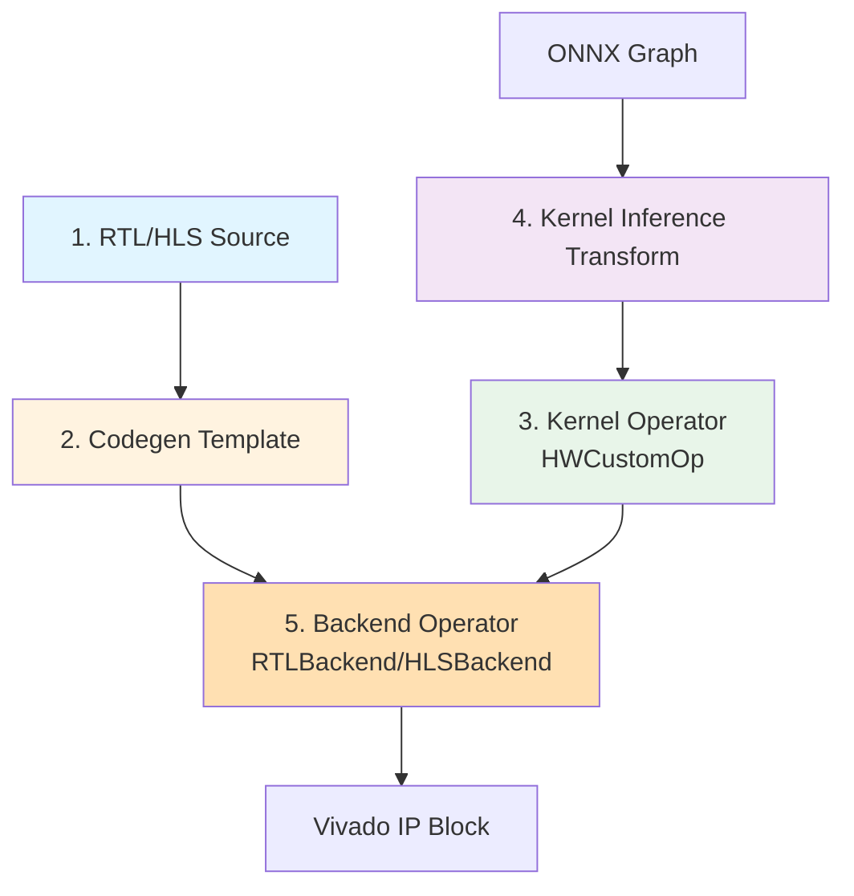

# Kernel Architecture

Kernels are **parameterized hardware implementations of neural network operations**. They are the fundamental building blocks from which Brainsmith constructs dataflow accelerators, with each kernel implementing a specific layer type (matrix multiplication, convolution, normalization, etc.) as a synthesizable hardware module.

!!! tip "Looking for kernel specifications?"
    This guide covers kernel **architecture** and **creation**. For detailed specifications of individual kernels, see the [Kernel Reference](../../kernels/index.md).

## Why Layer-Level Kernels?

Brain smith uses layer-level kernels rather than fine-grained operations for three key reasons:

### 1. Preserve Design Space

AI models are designed and expressed in terms of layers/operations in frameworks like PyTorch and ONNX. Preserving this granularity enables natural extension from AI frameworks while maintaining semantic meaning through the hardware compilation pipeline.

### 2. Prevent Exponential Explosion

Decomposing layers into individual primitive operations (add, multiply, shift) would create thousands of tiny hardware blocks. While theoretically interesting, this exponentially explodes the design space exploration problem, making it computationally intractable to find good configurations.

### 3. Enable Hand Optimization

Hardware engineers can design kernels hand-optimized at the layer scale without requiring deep knowledge of the full AI model. This allows for hand-optimized performance that fully generated designs lack, while maintaining flexibility by composing the final accelerator through Brainsmith's automated dataflow construction.

---

## Kernel Architecture

Each kernel consists of five components that work together to enable hardware generation:



### 1. RTL/HLS Source Code

Hardware implementations of neural network operations with standardized interfaces:

**Interface Requirements**:
- **Control**: Clock and reset (optional second clock for double-pumped designs)
- **Input/Output**: AXI-Stream for activations and weights (minimum 1 input + 1 output)
- **Config**: Optional single AXI-Lite interface for runtime configuration

**Backend Types**:
- **RTL (SystemVerilog)**: Maximum control, hand-optimized timing, RTL-only simulation
- **HLS (Vitis HLS)**: Faster development, C++ simulation, automatic RTL generation

**Examples**:
- RTL: [`thresholding.sv`](https://github.com/Xilinx/finn/blob/main/finn-rtllib/thresholding/hdl/thresholding.sv)
- HLS: `brainsmith/kernels/layernorm/layernorm.hpp`

### 2. Codegen Template

Runtime code generation templates that bridge high-level kernel operators with hardware implementations:

**RTL Templates**: Verilog (not SystemVerilog) with string substitution for parameters
```verilog
// thresholding_template_wrapper.v
module $TOP_MODULE_NAME$ (
    .PE($PE$),
    .NumChannels($NUM_CHANNELS$),
    ...
);
```

**HLS Templates**: Structured templates with function overrides
```python
# Generalized template in templates.py
def generate_hls_kernel(op, backend):
    return render_template(
        "kernel_template.cpp",
        pe=op.get_nodeattr("PE"),
        ...
    )
```

Templates enable FINN to programmatically configure and instantiate hardware blocks with layer-specific parameters.

### 3. Kernel Operator (HWCustomOp)

An ONNX node subclass that defines the kernel's interface and behavior:

```python
from finn.custom_op.fpgadataflow.hwcustomop import HWCustomOp

class LayerNorm(HWCustomOp):
    """Layer normalization kernel operator."""

    op_type = "FuncLayerNorm"

    def get_nodeattr_types(self):
        """Define hardware attributes."""
        return {
            "PE": ("i", True, 1),
            "NumChannels": ("i", True, 0),
            "Epsilon": ("f", False, 1e-5),
            ...
        }

    def infer_node_datatype(self, model):
        """Infer data types for all tensors."""
        ...

    def get_exp_cycles(self):
        """Estimate execution cycles."""
        num_channels = self.get_nodeattr("NumChannels")
        pe = self.get_nodeattr("PE")
        return num_channels / pe
```

The kernel operator:
- Defines hardware attributes (PE, SIMD, etc.)
- Manages execution modes (rtlsim, cppsim, synthesize)
- Provides performance estimation methods
- Handles FIFO depth calculations

### 4. Kernel Inference Transform

Detection and conversion logic that replaces ONNX operations with kernel instances:

```python
@transformation
class InferLayerNorm(Transformation):
    """Convert ONNX LayerNormalization to FuncLayerNorm kernel."""

    def apply(self, model):
        for node in model.graph.node:
            if node.op_type != "FuncLayerNorm":
                continue

            # Validate compatibility
            if not self._is_valid_for_hardware(node, model):
                continue

            # Extract parameters
            num_channels = get_channel_count(node, model)
            epsilon = get_node_attr_or_default(node, "epsilon", 1e-5)

            # Create kernel instance
            kernel_node = make_hw_custom_op(
                "FuncLayerNorm",
                NumChannels=num_channels,
                Epsilon=epsilon,
                PE=1,  # Default, will be set by folding config
            )

            # Replace in graph
            model.graph.node.remove(node)
            model.graph.node.append(kernel_node)

        return model
```

Inference transforms:
1. **Pattern match** compatible ONNX ops
2. **Validate** hardware requirements (datatypes, shapes)
3. **Convert** to configured kernel instances

### 5. Backend Operator

Language-specific code generator inheriting from RTLBackend or HLSBackend:

```python
from finn.custom_op.fpgadataflow.hlsbackend import HLSBackend

class LayerNorm_HLS(HLSBackend, LayerNorm):
    """HLS backend for LayerNorm kernel."""

    def get_nodeattr_types(self):
        base_attrs = super().get_nodeattr_types()
        return {**base_attrs, "UseDSP": ("i", False, 0)}

    def generate_params(self, model, path):
        """Generate C++ header with configuration."""
        code = f"""
        #define PE {self.get_nodeattr("PE")}
        #define NumChannels {self.get_nodeattr("NumChannels")}
        """
        with open(path / "params.hpp", "w") as f:
            f.write(code)

    def execute_node(self, context, graph):
        """Generate HLS project and synthesize."""
        # Create HLS project
        # Run C simulation (cppsim mode)
        # Synthesize to RTL (if requested)
        # Run RTL simulation (rtlsim mode)
        ...
```

Backends:
- **HLSBackend**: Generates C++ with pragmas → Vitis HLS → RTL + IP
- **RTLBackend**: Uses pre-written Verilog → Vivado IP Packager → IP

---

## Parallelization Parameters

Kernels expose parallelization parameters that trade off throughput vs. resource usage:

### PE (Processing Elements)

**What**: Number of parallel computational units

**Example - MVAU (Matrix-Vector-Activation Unit)**:
```
Input: [BatchSize, InChannels]
Weights: [OutChannels, InChannels]
Output: [BatchSize, OutChannels]

PE = OutChannels / Folding
```

**Impact**:
- `PE = 1`: Process 1 output channel per cycle (minimum resources, slowest)
- `PE = OutChannels`: Process all output channels in parallel (maximum resources, fastest)
- `PE = 8`: Process 8 output channels per cycle (balanced)

**Resource Tradeoff**:
- Higher PE → More DSP blocks, BRAMs, LUTs
- Lower PE → Fewer resources, more cycles

### SIMD (Single Instruction Multiple Data)

**What**: Number of parallel operations per PE

**Example - MVAU**:
```
For each output channel, compute dot product:
sum(input[i] * weight[i]) for i in InChannels

SIMD = InChannels / Folding
```

**Impact**:
- `SIMD = 1`: Process 1 weight per cycle per PE
- `SIMD = InChannels`: Process all weights in parallel per PE
- `SIMD = 16`: Process 16 weights per cycle per PE

**Resource Tradeoff**:
- Higher SIMD → More multipliers (DSPs), wider datapaths
- Lower SIMD → Narrower datapaths, more cycles per output

### Folding

**What**: Inverse of parallelization—how many times the computation is folded/reused

```python
Folding = Max / Parallelization

# Example
OutChannels = 128
PE = 16
Folding = 128 / 16 = 8  # Reuse each PE 8 times
```

**Design Strategy**:
1. Start with `PE=1, SIMD=1` (minimum resources)
2. Increase SIMD first (cheaper in terms of resources)
3. Increase PE to meet throughput targets
4. Use divisors of channel counts for efficiency

---

## Performance Modeling

Brainsmith estimates kernel performance without full synthesis:

### Cycle Estimation

Each kernel implements `get_exp_cycles()` to estimate execution time:

```python
class MVAU(HWCustomOp):
    def get_exp_cycles(self):
        batch_size = self.get_input_dataflow_batch()
        num_inp_vec = self.get_nodeattr("NumInputVectors")
        pe = self.get_nodeattr("PE")
        simd = self.get_nodeattr("SIMD")

        in_channels = num_inp_vec[0]
        out_channels = num_inp_vec[1]

        # Cycles = (InChannels / SIMD) * (OutChannels / PE) * BatchSize
        return (in_channels // simd) * (out_channels // pe) * batch_size
```

**Total Accelerator Latency**:
```
Total Cycles = sum(kernel.get_exp_cycles() for kernel in dataflow_graph)
Latency = Total Cycles / Clock Frequency
```

### Resource Estimation

Kernels provide resource usage estimates:

```python
class MVAU_HLS(HLSBackend):
    def get_resource_estimation(self):
        pe = self.get_nodeattr("PE")
        simd = self.get_nodeattr("SIMD")
        mw = self.get_weight_datatype().bitwidth()
        ma = self.get_input_datatype(0).bitwidth()

        # DSP blocks for multiply-accumulate
        dsps = pe * simd if self.get_nodeattr("UseDSP") else 0

        # BRAM blocks for weight storage
        weight_bits = pe * simd * mw * num_weight_sets
        brams = weight_bits / (36 * 1024)  # 36Kb BRAM

        # LUTs for control logic
        luts = 500 * pe  # Empirical approximation

        return {"DSP": dsps, "BRAM": brams, "LUT": luts, "FF": luts * 2}
```

**Limitations**:
- Estimates are **approximations** based on heuristics
- Actual resource usage depends on tool optimization
- Post-synthesis reports provide ground truth

### Throughput Calculation

```python
def calculate_throughput(model, clock_mhz):
    """Calculate frames per second."""
    total_cycles = sum(kernel.get_exp_cycles() for kernel in model.graph.node)
    fps = (clock_mhz * 1e6) / total_cycles
    return fps
```

---

## HLS vs RTL Backends

### HLS (High-Level Synthesis)

**Pros**:
- Faster development (write in C++)
- C++ simulation (10-100× faster than RTL sim)
- Easier to modify and experiment
- Automatic pipelining and optimization

**Cons**:
- Less control over micro-architecture
- HLS tools may produce suboptimal RTL
- Longer synthesis times
- Black-box generated RTL (harder to debug)

**Best For**:
- Rapid prototyping
- Complex algorithms (softmax, layer norm)
- When C++ simulation speed matters
- Early design space exploration

### RTL (Register-Transfer Level)

**Pros**:
- Complete control over hardware
- Hand-optimized timing and resources
- Predictable behavior
- Reusable IP blocks

**Cons**:
- Slower development
- RTL simulation only (slower)
- Requires hardware design expertise
- More effort to modify

**Best For**:
- Performance-critical kernels (MVAU, convolution)
- When resource usage must be minimized
- Production designs requiring validation
- Reusing proven IP

### Example: Layer Norm

```yaml
# Blueprint with backend choice
design_space:
  kernels:
    - LayerNorm: [LayerNorm_hls, LayerNorm_rtl]
```

**LayerNorm_HLS**:
- Development time: 1-2 days
- C++ simulation: 50 ms per layer
- Resource usage: ~500 LUTs (HLS overhead)

**LayerNorm_RTL**:
- Development time: 1-2 weeks
- RTL simulation: 5 seconds per layer (100× slower)
- Resource usage: ~300 LUTs (hand-optimized)

**Decision**: Use HLS for initial design, switch to RTL if resources are constrained.

---

## Design Point API

Brainsmith kernels expose a modern design point API for configuration:

```python
from brainsmith.registry import get_kernel

# Get kernel
MVAU = get_kernel('MVAU')

# Build design space
kernel_inst.build_design_space(model)

# Navigate design space
point = kernel_inst.design_point

# Configure parallelization
point = point.with_input_stream(0, pe=16)  # Input stream parallelism
point = point.with_input_stream(1, simd=32)  # Weight stream parallelism

# Apply configuration
kernel_inst.apply_design_point(point)
```

This API provides:
- **Immutable navigation**: Design points are immutable, preventing accidental mutation
- **Type safety**: Invalid configurations rejected at API level
- **DSE integration**: Design points compose naturally with design space exploration

---

## Kernel Examples

### MVAU (Matrix-Vector-Activation Unit)

**Operation**: Matrix-vector multiply with activation
```
Y = activation(W × X + b)
```

**Parameters**:
- `PE`: Output channel parallelism
- `SIMD`: Input channel parallelism
- `MW`: Weight bit-width
- `MH`: Activation bit-width

**Backends**: MVAU_hls, MVAU_rtl

### ConvolutionInputGenerator (Sliding Window)

**Operation**: Extract sliding windows from input feature maps

**Parameters**:
- `SIMD`: Parallel pixel processing
- `ConvKernelDim`: Kernel size (3×3, 5×5, etc.)
- `IFMDim`: Input feature map dimensions

**Backends**: ConvolutionInputGenerator_rtl

### Thresholding

**Operation**: Multi-threshold activation function
```
Y[i] = max(j : X[i] >= thresholds[j])
```

**Parameters**:
- `PE`: Channel parallelism
- `NumSteps`: Number of thresholds

**Backends**: Thresholding_hls, Thresholding_rtl

---

## Creating Custom Kernels

### Step 1: Implement Hardware

Choose HLS or RTL and implement the operation:

**HLS Example**:
```cpp
// my_kernel.hpp
template<unsigned PE, unsigned SIMD>
void MyKernel(
    hls::stream<ap_uint<SIMD*8>> &in,
    hls::stream<ap_uint<PE*8>> &out
) {
    #pragma HLS INTERFACE axis port=in
    #pragma HLS INTERFACE axis port=out
    #pragma HLS INTERFACE ap_ctrl_none port=return

    // Implementation
}
```

**RTL Example**:
```systemverilog
// my_kernel.sv
module my_kernel #(
    parameter PE = 1,
    parameter SIMD = 1
) (
    input wire clk,
    input wire rst,
    // AXI-Stream interfaces
    ...
);
```

### Step 2: Create Kernel Operator

```python
from brainsmith.registry import kernel
from brainsmith.dataflow import HWCustomOp

@kernel
class MyKernel(HWCustomOp):
    op_type = "MyKernel"

    def get_nodeattr_types(self):
        return {
            "PE": ("i", True, 1),
            "SIMD": ("i", True, 1),
        }

    def get_exp_cycles(self):
        # Performance model
        return self.get_nodeattr("NumElements") // self.get_nodeattr("PE")
```

### Step 3: Create Backend

```python
from brainsmith.registry import backend
from finn.custom_op.fpgadataflow.hlsbackend import HLSBackend

@backend(target_kernel='MyKernel', language='hls')
class MyKernel_HLS(HLSBackend, MyKernel):
    def generate_params(self, model, path):
        # Generate C++ configuration
        ...

    def execute_node(self, context, graph):
        # Run HLS synthesis
        ...
```

### Step 4: Register in Project

```python
# project/kernels/__init__.py
from .my_kernel import MyKernel, MyKernel_HLS
```

The component registry will automatically discover and register your kernel.

---

## Summary

Kernels are Brainsmith's fundamental abstraction for hardware operations:

- **Layer-level granularity** preserves design space while enabling hand optimization
- **5-component architecture** separates concerns (hardware, codegen, inference, backend)
- **Parallelization parameters** (PE, SIMD) trade throughput vs. resources
- **Performance modeling** enables fast design space exploration without full synthesis
- **HLS vs RTL** trade development speed vs. resource efficiency
- **Component registry** enables seamless integration of custom kernels

Understanding kernels is essential for extending Brainsmith with new operations and optimizing accelerator performance.

## Next Steps

- [Dataflow Accelerators](../1-foundations/dataflow-accelerators.md) - See how kernels compose into accelerators
- [Design Space Exploration](../2-core-systems/design-space-exploration.md) - Understand how DSE explores kernel configurations
- [Component Registry](../2-core-systems/component-registry.md) - Learn how to register custom kernels

---

## See Also

### Kernel Specifications

For detailed specifications of individual kernels:

- [Kernel Reference Index](../../kernels/index.md) - Complete kernel catalog organized by namespace
- [AddStreams](../../kernels/addstreams.md) - Example of fully documented kernel
- [ElementwiseBinary](../../kernels/elementwise_binary.md) - Polymorphic binary operations
- [Thresholding](../../kernels/thresholding.md) - Multi-threshold activation

### Related Guides

- [Design Space Exploration](../2-core-systems/design-space-exploration.md) - Kernel parameter optimization
- [Kernel Modeling](../2-core-systems/kernel-modeling.md) - Design point configuration
- [Component Registry](../2-core-systems/component-registry.md) - Kernel discovery and registration
