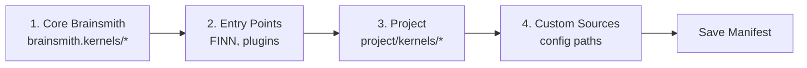

# Component Registry

The Component Registry is Brainsmith's extensibility foundation, enabling seamless integration of custom kernels, optimization transforms, and build steps. It provides automatic discovery, lazy loading, and intelligent caching to support a plugin architecture where new hardware operations can be added without modifying core code.

## Architecture Overview

```mermaid
graph TB
    subgraph "Component Sources"
        Core[Brainsmith Core<br/>brainsmith.*]
        FINN[FINN/QONNX<br/>finn.*, qonnx.*]
        Project[Project Components<br/>project/kernels/]
        Custom[Custom Plugins<br/>External Packages]
    end

    subgraph "Registry"
        Discovery[Discovery System]
        Cache[Component Manifest<br/>.brainsmith/manifest.json]
        Lookup[Lookup API<br/>get_kernel(), get_backend()]
    end

    Core --> Discovery
    FINN --> Discovery
    Project --> Discovery
    Custom --> Discovery

    Discovery --> Cache
    Cache --> Lookup
    Lookup --> |Lazy Load| Components[Component Classes]

    style Core fill:#e1f5ff
    style FINN fill:#fff3e0
    style Project fill:#e8f5e9
    style Custom fill:#f3e5f5
```

## Key Concepts

### Component Types

Brainsmith recognizes three component types:

- **Kernels** (`@kernel`) - Hardware implementations of neural network operations
- **Backends** (`@backend`) - Language-specific code generators (HLS, RTL, Chisel)
- **Steps** (`@step`) - Build pipeline transformations and optimizations

### Source Classification

Components are automatically classified by **source** based on where they're defined:

| Source | Module Prefix | Priority | Description |
|--------|--------------|----------|-------------|
| `brainsmith` | `brainsmith.*` | 1 | Core built-in components |
| `finn` | `finn.*`, `qonnx.*` | 2 | FINN/QONNX framework components |
| `project` | (project root) | 3 | User-defined project components |
| `custom` | (any other) | 4 | Ephemeral, non-cached components |

**Source detection** uses:
1. Module prefix matching (`brainsmith.*` → `brainsmith` source)
2. Discovery context (components loaded during project discovery)
3. Explicit `source_context()` for external packages

### Discovery System

Discovery happens in four phases:



**First Run**: Full discovery scans all sources (~500ms) → saves manifest
**Subsequent Runs**: Load from cached manifest (~50ms, 10x faster)

### Lazy Loading

Components are loaded **on-demand** to minimize startup time:

```python
discover_components()  # Loads metadata only, not actual classes

# First use triggers import
MyKernel = get_kernel('MVAU')  # Imports brainsmith.kernels.mvau
```

### Manifest Caching

The registry caches discovered components to `.brainsmith/component_manifest.json`. The manifest is **automatically invalidated** if:
- Any component source file is modified
- Package `__init__.py` files change
- Configuration changes (e.g., `source_module_prefixes`)
- Manifest version is incompatible

## Registration

### Basic Registration

Use decorators to register components:

```python
from brainsmith.registry import kernel, backend, step
from brainsmith.dataflow import HWCustomOp

@kernel
class MyKernel(HWCustomOp):
    """Custom hardware kernel."""
    op_type = "MyKernel"

    def infer_node(self, model):
        # Implementation
        pass

@backend(target_kernel='MyKernel', language='hls')
class MyKernelHLS:
    """HLS backend for MyKernel."""

    @staticmethod
    def get_nodeattr_types():
        return {}

@step
def my_preprocessing_step(model, config):
    """Custom preprocessing step."""
    return model
```

### Project Structure

Project components mirror Brainsmith's structure:

```
project_dir/
├── kernels/
│   ├── __init__.py      # Import your kernels
│   ├── my_kernel.py     # Kernel implementation
│   └── my_kernel_hls.py # Backend implementation
└── steps/
    ├── __init__.py      # Import your steps
    └── my_step.py       # Step implementation
```

Components in `project_dir/kernels/` and `project_dir/steps/` are **automatically discovered** during Phase 3.

## Usage

### Discovery and Lookup

```python
from brainsmith.registry import discover_components, get_kernel, get_backend

# Discover all available components
discover_components()

# Look up components
MyKernel = get_kernel('MyKernel')
backend_cls = get_backend('MyKernel', language='hls')

# Use in your code
node = MyKernel(...)
```

### Source-Qualified Lookup

When multiple sources provide the same kernel name, use source qualification:

```python
# Explicit source
kernel = get_kernel('brainsmith:MVAU')    # Brainsmith's implementation
kernel = get_kernel('project:MVAU')       # Your custom implementation

# Auto-resolved by priority (brainsmith > finn > project > custom)
kernel = get_kernel('MVAU')  # Returns highest priority source
```

## Plugin Architecture

### Entry Points

External packages can register components via Python entry points:

```python
# setup.py or pyproject.toml
[project.entry-points."brainsmith.components"]
my_package = "my_package.integration:register_components"
```

```python
# my_package/integration.py
from brainsmith.registry import kernel, source_context

def register_components():
    """Entry point for component registration."""
    with source_context('my_package'):
        from .kernels import MyKernel
```

### Configuration

Configure component sources in `brainsmith.yaml` or `~/brainsmith.yaml`:

```yaml
# Enable component caching
cache_components: true

# Module prefix → source name mapping
source_module_prefixes:
  "brainsmith.": "brainsmith"
  "finn.": "finn"
  "qonnx.": "finn"
  "my_company.": "my_company"

# Additional component source paths
component_sources:
  my_company: "/path/to/my_company/package"
```

## Design Decisions

### Why Lazy Loading?

Importing all components at startup would add ~2-3 seconds to every CLI invocation. Lazy loading defers imports until first use, keeping startup times under 100ms while maintaining full component availability.

### Why Source Classification?

Source classification enables:
- **Priority Resolution**: Resolve `get_kernel('MVAU')` to the right implementation when multiple sources provide it
- **Selective Caching**: Cache stable components (`brainsmith`, `finn`, `project`) but not ephemeral ones (`custom`)
- **Debugging**: Know where a component came from (`brainsmith:MVAU` vs `project:MVAU`)

### Why Manifest Caching?

Discovery involves scanning directories, importing modules, and introspecting classes—expensive operations repeated on every run. Caching discovered metadata reduces discovery time by 10x (500ms → 50ms) while automatic invalidation ensures the cache stays current.

### Why Decorators?

Decorator-based registration is:
- **Declarative**: Component metadata lives with the component definition
- **Automatic**: No manual registration calls needed
- **Inspectable**: Decorators can validate component structure at registration time

## Extension Points

The registry supports several extension mechanisms:

### 1. Project Components
Drop components in `project_dir/kernels/` or `project_dir/steps/` → automatic discovery

### 2. Entry Points
Define `brainsmith.components` entry point → loaded during Phase 2

### 3. Custom Source Paths
Add paths to `component_sources` config → scanned during Phase 4

### 4. Direct Import
Import component modules directly → decorators handle registration immediately

## Testing Patterns

### Isolating Tests

```python
import pytest
from brainsmith.registry import reset_registry, discover_components

@pytest.fixture(autouse=True)
def reset_component_registry():
    """Reset registry before each test."""
    reset_registry()
    discover_components()
```

### Test-Only Components

```python
# tests/support/test_kernels.py
from brainsmith.registry import kernel

@kernel
class TestKernel(HWCustomOp):
    """Temporary kernel for testing."""
    pass  # Registers as 'custom' (not cached)

# tests/test_something.py
def test_my_feature():
    reset_registry()
    from tests.support.test_kernels import TestKernel
    # Use TestKernel
    reset_registry()  # Clean up
```

## Best Practices

### ✓ Do

- Call `discover_components()` before first registry use
- Keep components in proper source namespace (`brainsmith`, `project`) to enable caching
- Use `reset_registry()` in tests to isolate state
- Use source-qualified names (`brainsmith:MVAU`) when disambiguation is needed

### ✗ Avoid

- Defining components in `custom` source for production code (not cached)
- Generic component names (`Custom`, `MyKernel`) that risk collisions
- Registry lookups at module level (causes circular imports)
- Manually managing the component manifest

## Troubleshooting

**Component Not Found**
```
KeyError: "Kernel 'MyKernel' not found."
```
→ Call `discover_components()` before lookup
→ Check component is registered with `@kernel` decorator
→ Try `discover_components(force_refresh=True)` to rebuild cache

**Wrong Source Classification**
```
# Component registers as 'custom' instead of 'project'
```
→ Verify module path matches `source_module_prefixes` in config
→ Use `source_context('project')` during import if needed

**Manifest Out of Date**
```
# Changes not reflected after editing component file
```
→ Manifest auto-invalidates on file modification
→ Force refresh with `discover_components(force_refresh=True)`


## Summary

The Component Registry provides:
- **Automatic Discovery** across multiple sources (core, FINN, project, plugins)
- **Lazy Loading** for fast startup times
- **Intelligent Caching** with automatic invalidation
- **Source Classification** for priority-based resolution
- **Plugin Architecture** via entry points and configuration

This architecture makes Brainsmith **extensible by design**—new kernels, transforms, and build steps integrate seamlessly without modifying core code.

## Next Steps

- [Kernels](../3-reference/kernels.md) - Learn how to create custom hardware kernels
- [Design Space Exploration](design-space-exploration.md) - See how registered components enable DSE
- [CLI Reference](../3-reference/cli.md) - Commands for managing components
