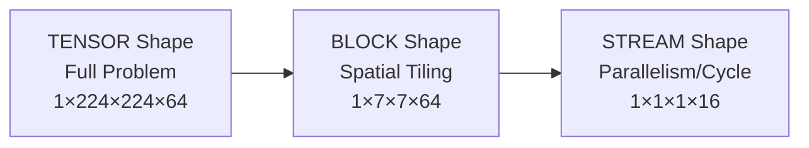
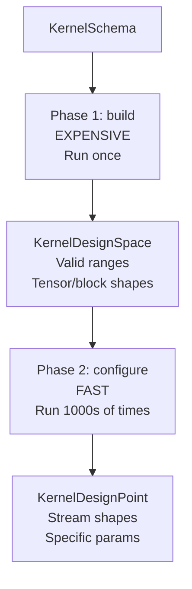

# Kernel Modeling

Brainsmith models hardware kernels using a **schema-based system** that separates structure definition from implementation. This enables automatic design space exploration, validation, and configuration while maintaining compatibility with FINN's compilation pipeline.

## Why Schema-Based Modeling?

Traditional FPGA kernel development hardcodes shapes, datatypes, and parallelization parameters. Every configuration change requires manual updates across multiple files. Brainsmith's modeling system solves this by:

1. **Declarative Schemas**: Define kernel structure once, explore thousands of configurations automatically
2. **Shape Hierarchy**: Model the three-tier reality of hardware parallelism (tensor → block → stream)
3. **Type Safety**: Validate datatypes and shapes before expensive synthesis
4. **Immutable Design Points**: Prevent accidental mutations during exploration

Think of it as a type system for hardware kernels—catching configuration errors at design time instead of discovering them hours later during synthesis.


## Core Principles

### Principle 1: Schemas Define STRUCTURE, Not STORAGE

Schemas describe **what a kernel needs** (inputs, outputs, constraints), not **where it's stored** (ONNX nodeattrs).

```python
# Schema defines structure
ADDSTREAMS_SCHEMA = KernelSchema(
    inputs=[
        InputSchema(name="input0", stream_tiling=["PE"]),
        InputSchema(name="input1", stream_tiling=["PE"]),
    ],
    outputs=[
        OutputSchema(name="output", stream_tiling=[("input0", -1)]),
    ]
)

# Storage is auto-generated from schema
nodeattrs = schema.build_nodeattr_registry()
# → {"PE": ("i", False, 1), "input0Datatype": ("s", False, ""), ...}
```

**Why?** Separating structure from storage enables schema reuse, validation, and automatic persistence layer generation.

### Principle 2: Three-Tier Shape Hierarchy

Hardware kernels process data at three different granularities:



- **TENSOR**: The complete problem (from ONNX graph)
- **BLOCK**: Spatial tiling of the problem (how we decompose it)
- **STREAM**: Elements processed per clock cycle (hardware parallelism)

**Example - Matrix Multiply:**
```
TENSOR:  [128, 768]  # Full input matrix
BLOCK:   [32, 768]   # Process 32 rows at a time
STREAM:  [1, 64]     # SIMD=64 parallel multiply-accumulate per cycle
```

Each level affects different aspects:
- TENSOR determines accuracy and functionality
- BLOCK determines memory footprint and latency
- STREAM determines throughput and resource usage

### Principle 3: Two-Phase Construction

Kernel models are built in two phases to optimize design space exploration:



**Phase 1: build()** - Run once per kernel
- Extract tensor shapes from ONNX graph
- Resolve block shapes from templates
- Compute valid parallelization ranges (divisor sets)
- Validate structural constraints

**Phase 2: configure()** - Run thousands of times during DSE
- Resolve stream shapes for specific parameters
- Validate optimization constraints
- Return immutable design point

**Why?** Exploring 1000 configurations would be too slow if we rebuilt everything from scratch each time. Caching the design space makes exploration tractable.

### Principle 4: Immutable Design Points

Design points are immutable snapshots—navigation returns new instances instead of mutating:

```python
# Immutable navigation
point1 = design_space.configure({"PE": 1, "SIMD": 64})
point2 = point1.with_input_stream(0, 32)  # Returns NEW point

assert point1.config["PE"] == 1   # Original unchanged
assert point2.config["PE"] == 32  # New point has new value
```

**Why?** Immutability prevents bugs during parallel exploration and enables safe caching.


## Schema Building Blocks

### InputSchema and OutputSchema

Schemas define interface structure using three specifications:

```python
InputSchema(
    name="input",
    block_tiling=[FULL_DIM, FULL_DIM, FULL_DIM, FULL_DIM],  # Copy all dims
    stream_tiling=["SIMD"],                                  # Param in last dim
    datatype=None,                                           # Use ONNX graph
    required_layout="NHWC"                                   # Layout requirement
)
```

**Key fields:**
- `name`: Interface identifier
- `block_tiling`: Template for block shape (resolved from tensor shape)
- `stream_tiling`: Template for stream shape (resolved from block shape + params)
- `datatype`: Datatype specification (None = use graph, or derivation function)
- `required_layout`: Layout requirement (preprocessing enforces this)

### Tiling Templates

Templates use a union type system to specify dimensions flexibly:

```python
# FULL_SHAPE: Rank-agnostic (works with any tensor rank)
block_tiling=FULL_SHAPE  # Expands to [FULL_DIM, FULL_DIM, ...] matching tensor rank

# List of DimSpecs: Explicit per-dimension specification
stream_tiling=[1, 1, 1, "PE"]  # Singletons + parameter

# Tuple shorthand: Derive from another interface
stream_tiling=[("input", -1)]  # Copy last stream dim from input
```

Templates are **resolved at runtime** using the actual tensor shape and parameters.

### DimSpec: Dimension Specification

DimSpec is a union type supporting multiple specification styles:

| Type | Example | Meaning |
|------|---------|---------|
| `int` (1 only) | `1` | Singleton dimension |
| `str` | `"PE"` | Parameter name to look up |
| `tuple` | `("input", -1)` | Derive from interface (last dimension) |
| `tuple` | `("input", -1, BLOCK)` | Derive with explicit hierarchy |
| `Callable` | `custom_dim_fn` | Custom computation function |
| `FULL_DIM` | `FULL_DIM` | Copy full dimension from reference |

**Examples:**

```python
# Static dimensions
block_tiling=[1, 1, FULL_DIM, FULL_DIM]  # Batch=1, spatial=full

# Parameterized dimensions
stream_tiling=["SIMD", "PE"]  # Both are parameters

# Derived dimensions (shorthand)
stream_tiling=[("input0", -1)]  # Match input0's last stream dim

# Mixed specifications
stream_tiling=[1, 1, ("input", -2), "PE"]  # Singleton, derived, parameter
```

### DatatypeSpec: Datatype Specification

DatatypeSpec is a union type for flexible datatype handling:

| Type | Example | Meaning |
|------|---------|---------|
| `None` | `None` | Use datatype from ONNX graph |
| `BaseDataType` | `DataType["INT8"]` | Fixed datatype |
| `str` | `"input"` | Copy datatype from interface |
| `VALUE_OPTIMIZED` | `VALUE_OPTIMIZED` | Optimize from tensor values |
| `Callable` | `add_datatype("input0", "input1")` | Custom derivation |

**Examples:**

```python
# Use ONNX graph datatype (default)
datatype=None

# Fixed datatype
datatype=DataType["INT8"]

# Derive from input (shorthand)
datatype="input"

# Compute from operation semantics
datatype=add_datatype("input0", "input1")  # INT8 + INT8 → INT9
```

The `add_datatype()` helper automatically computes the output datatype by analyzing value ranges to prevent overflow.

### KernelSchema

The complete kernel definition:

```python
KernelSchema(
    name="AddStreams",
    inputs=[...],                  # List of InputSchema
    outputs=[...],                 # List of OutputSchema
    internal_datatypes={...},      # Internal computation datatypes
    kernel_params={...},           # Algorithm parameters (epsilon, etc.)
    dse_dimensions={...},          # Explorable dimensions (ram_style, etc.)
    constraints=[...],             # Validation rules
    attribute_mapping={...}        # ONNX attr → kernel param mapping
)
```


## Two-Phase Construction in Detail

### Phase 1: Building the Design Space

The `DesignSpaceBuilder` constructs a `KernelDesignSpace` from schema + ONNX context:

```python
# Build context encapsulates all dependencies
context = BuildContext(
    schema=kernel_schema,
    model_w=model_wrapper,
    node_inputs=["input_tensor_0", "input_tensor_1"],
    node_outputs=["output_tensor"],
    param_getter=self.get_nodeattr,
    param_setter=self.set_nodeattr,
)

# Build design space (expensive, once per kernel)
design_space = DesignSpaceBuilder().build(context)
```

**What gets built:**

1. **Extract tensor shapes** from ModelWrapper
   ```python
   tensor_shape = model_w.get_tensor_shape("input_tensor_0")
   # → (1, 224, 224, 64)
   ```

2. **Resolve block shapes** from block_tiling templates
   ```python
   block_tiling = [FULL_DIM, 7, 7, FULL_DIM]
   block_shape = resolve_template(block_tiling, tensor_shape)
   # → (1, 7, 7, 64)
   ```

3. **Derive datatypes** using DatatypeSpec resolvers
   ```python
   # Input: Use graph datatype
   input_dt = model_w.get_tensor_datatype("input_tensor_0")  # INT8

   # Output: Compute from operation
   output_dt = add_datatype("input0", "input1")  # INT8+INT8 → INT9
   ```

4. **Compute valid dimension ranges**
   ```python
   # For stream_tiling=["PE"], compute divisors of last dimension
   PE_values = divisors(64)  # → [1, 2, 4, 8, 16, 32, 64]
   dimensions = {"PE": OrderedDimension("PE", PE_values)}
   ```

5. **Validate structural constraints**
   ```python
   for constraint in structural_constraints:
       if error := constraint.check(design_space_context):
           raise ValidationError(error)
   ```

**Result:** `KernelDesignSpace` with all constant properties cached.

### Phase 2: Configuring a Design Point

The `KernelDesignSpace` creates `KernelDesignPoint` instances via `configure()`:

```python
# Configure with specific parameters (fast, 1000s of times)
point = design_space.configure({"PE": 16, "SIMD": 64})
```

**What gets configured:**

1. **Resolve stream shapes** from stream_tiling templates + params
   ```python
   stream_tiling = [1, 1, 1, "PE"]
   stream_shape = resolve_template(
       stream_tiling,
       block_shape=(1, 7, 7, 64),
       params={"PE": 16}
   )
   # → (1, 1, 1, 16)
   ```

2. **Validate optimization constraints**
   ```python
   for constraint in optimization_constraints:
       if error := constraint.check(config_context):
           raise ValidationError(error)
   ```

3. **Create immutable design point** (flyweight pattern)
   ```python
   return KernelDesignPoint(
       design_space=self,      # Reference to parent
       config={"PE": 16, "SIMD": 64},
       inputs={...},           # Configured interfaces
       outputs={...}
   )
   ```

**Result:** Immutable `KernelDesignPoint` ready for hardware generation or performance estimation.


## Design Space Exploration

### Dimension Types

Brainsmith distinguishes between **ordered** and **discrete** dimensions:

**OrderedDimension** - For numeric sequences with natural ordering:
```python
OrderedDimension("PE", values=(1, 2, 4, 8, 16, 32, 64), default=1)
```
- Supports navigation: `step_up()`, `step_down()`, `at_percentage()`
- Used for: PE, SIMD, bit-widths, depths
- Automatically created for tiling parameters (from divisor sets)

**frozenset** - For discrete categorical choices:
```python
{"distributed", "block", "ultra"}  # RAM style options
```
- Supports membership testing only
- Used for: ram_style, res_type, algorithm choices
- Specified via `dse_dimensions` in schema

### Navigation API

#### Dimension-Based Navigation

Direct manipulation of named dimensions:

```python
# Set specific value
point = point.with_dimension("PE", 16)

# Navigate to extremes
point = point.with_min("PE")      # PE=1
point = point.with_max("SIMD")    # SIMD=max_valid_value

# Percentage-based indexing
point = point.with_percentage("PE", 0.5)  # Midpoint

# Step navigation
point = point.with_step_up("SIMD", n=2)    # Two steps higher
point = point.with_step_down("PE", n=1)    # One step lower
```

#### Interface-Based Navigation

Recommended for stream parallelism (abstracts parameter names):

```python
# Set input stream parallelism (auto-resolves parameter name)
point = point.with_input_stream(0, 32)  # Set first input's PE/SIMD to 32

# Set output stream parallelism
point = point.with_output_stream(0, 16)

# Percentage-based
point = point.with_input_stream_percentage(0, 0.75)  # 75% of valid range
```

**Why interface-based?** Different kernels use different parameter names (PE, SIMD, MW, MH). Interface-based navigation works across all kernels without knowing the specific parameter name.

### Iteration and Sweeping

Explore multiple configurations systematically:

```python
# Sweep through all valid values
for point in base_point.sweep_dimension("PE"):
    latency = estimate_latency(point)
    print(f"PE={point.config['PE']}: {latency} cycles")

# Sweep percentage points (decile sweep)
for point in base_point.sweep_percentage("SIMD", [0.0, 0.25, 0.5, 0.75, 1.0]):
    evaluate(point)

# Sweep input stream (interface-based)
for point in base_point.sweep_input_stream(0):  # All valid PE values
    throughput = estimate_throughput(point)
```


## Constraint System

Constraints validate kernel configurations at two phases:

### Structural Constraints (Phase 1)

Evaluated **once** during `build()` to determine backend compatibility:

```python
constraints=[
    # Datatype validation
    DatatypeInteger(("input0", "input1")),
    DatatypeFloat(("weights",)),

    # Shape validation (TENSOR/BLOCK hierarchy)
    ShapesEqual(("input0", "input1"), hierarchy=ShapeHierarchy.TENSOR),
    DimensionEquals("input0", -1, 64, hierarchy=ShapeHierarchy.TENSOR),

    # ONNX requirements
    IsDynamic(("input0", "input1")),  # Must be dynamic tensors
    HasLayout("input0", "NHWC"),       # Must have NHWC layout
]
```

**Purpose:** Ensure kernel can be implemented with the given tensor properties.

### Optimization Constraints (Phase 2)

Evaluated **per-configuration** during `configure()` to bound optimization space:

```python
constraints=[
    # Stream shape validation
    ShapesEqual(("input0", "input1"), hierarchy=ShapeHierarchy.STREAM),

    # Divisibility requirements
    DimensionDivisible("output", -1, "PE", hierarchy=ShapeHierarchy.BLOCK),

    # Custom logic
    CustomConstraint(lambda ctx:
        None if ctx.get_param("PE") * ctx.get_param("SIMD") <= 2048
        else "PE × SIMD must not exceed 2048"
    ),
]
```

**Purpose:** Validate stream shapes and parameter combinations for specific configurations.

### Automatic Phase Detection

Constraints automatically determine their evaluation phase:

- Constraints with `hierarchy=STREAM` → optimization constraints
- All other constraints → structural constraints

You can override this by setting `evaluation_phase` explicitly.


## Complete Example: AddStreams Kernel

Let's walk through a complete kernel definition for element-wise addition:

### Step 1: Define Schema

```python
from brainsmith.dataflow import KernelSchema, InputSchema, OutputSchema, FULL_SHAPE
from brainsmith.dataflow import IsDynamic, DatatypeInteger, ShapesEqual
from brainsmith.dataflow.spec_helpers import add_datatype

ADDSTREAMS_SCHEMA = KernelSchema(
    name="AddStreams",

    # Two inputs with identical structure
    inputs=[
        InputSchema(
            name="input0",
            block_tiling=FULL_SHAPE,      # Rank-agnostic: match tensor rank
            stream_tiling=["PE"],         # Parallelism in last dimension
            required_layout="NHWC",
        ),
        InputSchema(
            name="input1",
            block_tiling=FULL_SHAPE,      # Same as input0
            stream_tiling=["PE"],         # Same parallelism
            required_layout="NHWC",
        ),
    ],

    # Output with derived datatype
    outputs=[
        OutputSchema(
            name="output",
            block_tiling=FULL_SHAPE,
            stream_tiling=[("input0", -1)],  # Match input0 stream dim
            datatype=add_datatype("input0", "input1"),  # INT8+INT8→INT9
            required_layout="NHWC",
        )
    ],

    # Validation constraints
    constraints=[
        IsDynamic(("input0", "input1")),           # Must be dynamic
        DatatypeInteger(("input0", "input1")),     # Must be integer
        ShapesEqual(("input0", "input1")),         # Must have same shape
    ]
)
```

### Step 2: Create Kernel Operator

```python
from brainsmith.dataflow import KernelOp
from brainsmith.registry import kernel

@kernel(description="Element-wise addition of two streams")
class AddStreams(KernelOp):
    @classmethod
    def build_schema(cls, node, model):
        return ADDSTREAMS_SCHEMA

    def execute_node(self, context, graph):
        # CPU execution for validation
        input0 = context[self.onnx_node.input[0]]
        input1 = context[self.onnx_node.input[1]]
        output = input0 + input1
        context[self.onnx_node.output[0]] = output
```

### Step 3: Runtime Flow

When FINN encounters an AddStreams node:

```python
# 1. FINN creates operator instance
op = AddStreams(onnx_node)

# 2. Build design space (first call to method with model_w)
op.infer_node_datatype(model_w)
```

**What happens internally:**

```python
# Phase 1: Build (expensive, once)
context = BuildContext(
    schema=ADDSTREAMS_SCHEMA,
    model_w=model_w,
    node_inputs=["tensor_A", "tensor_B"],
    node_outputs=["tensor_C"],
    ...
)

design_space = DesignSpaceBuilder().build(context)
# Extracted:
#   inputs["input0"].tensor_shape = (1, 224, 224, 64)
#   inputs["input0"].block_shape = (1, 224, 224, 64)  # FULL_SHAPE
#   dimensions = {"PE": OrderedDimension("PE", (1, 2, 4, 8, 16, 32, 64))}

# Phase 2: Configure (fast, current parameters)
design_point = design_space.configure({"PE": 1})  # Default PE=1
# Resolved:
#   inputs["input0"].stream_shape = (1, 1, 1, 1)
#   outputs["output"].stream_shape = (1, 1, 1, 1)
#   outputs["output"].datatype = INT9  # add_datatype computed this
```

### Step 4: Design Space Exploration

Now we can explore different parallelization configurations:

```python
# Baseline configuration
base = op.design_point

# Explore PE values
for point in base.sweep_dimension("PE"):
    cycles = point.tensor_shape[0] * point.tensor_shape[1] * point.tensor_shape[2] * point.block_folding_factor
    throughput = point.streaming_bandwidth * clock_freq
    print(f"PE={point.config['PE']}: {cycles} cycles, {throughput} MB/s")

# Or navigate directly
point_pe16 = base.with_input_stream(0, 16)  # PE=16
```


## Summary

Brainsmith's kernel modeling system provides:

1. **Declarative Schemas**: Define structure once, explore automatically
2. **Shape Hierarchy**: Model the reality of hardware parallelism (TENSOR → BLOCK → STREAM)
3. **Union Type System**: Flexible specifications (literals, parameters, derivations, functions)
4. **Two-Phase Construction**: Build expensive models once, configure cheaply thousands of times
5. **Immutable Design Points**: Safe parallel exploration without mutation bugs
6. **Unified Constraints**: Single abstraction for validation across all phases
7. **Navigation API**: Ergonomic DSE with dimension-based and interface-based methods

**Key Insights:**

- Schemas define **what**, builders determine **how**, operators provide **where**
- Shape hierarchy reflects hardware reality: not all dimensions are equal
- Two-phase construction makes DSE tractable by caching constant properties
- Union types provide both simplicity (for common cases) and power (for complex cases)
- Immutability + flyweight pattern = safe + efficient exploration

## Next Steps

- [Kernels](../3-reference/kernels.md) - See how schemas integrate with full kernel architecture
- [Design Space Exploration](design-space-exploration.md) - Understand how DSE orchestrates modeling system
- [Component Registry](component-registry.md) - Learn how kernels are discovered and registered
