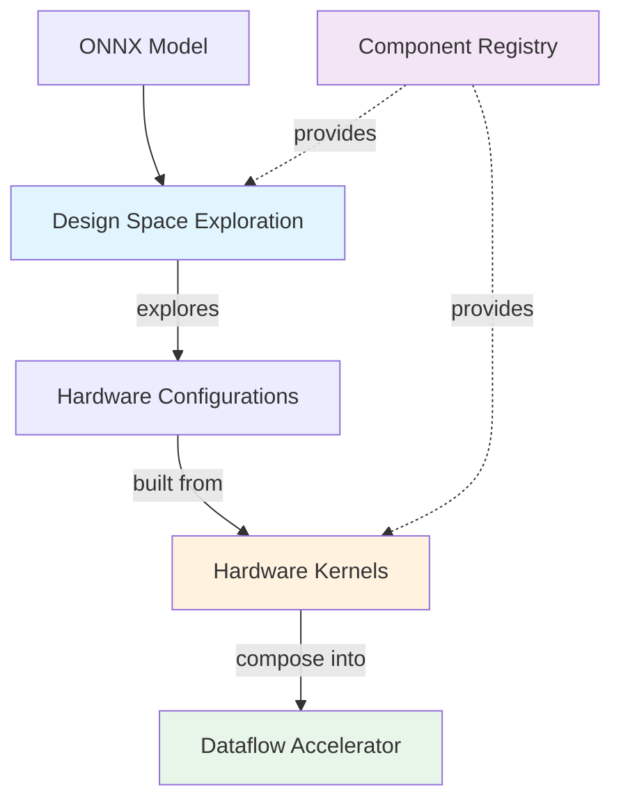

# Developer Guide

This guide provides comprehensive documentation for working with Brainsmith, from foundational concepts to implementation reference. Follow the learning path below, or jump directly to specific topics.

## The Big Picture

Brainsmith transforms quantized neural networks into optimized FPGA accelerators through four interconnected architectural components:



## Learning Path

### 1. Foundations

Start here if you're new to FPGA acceleration or dataflow architectures. These guides build your mental model from first principles.

#### [Understanding Kernels](1-foundations/understanding-kernels.md)
**Level**: Beginner
**Prerequisites**: Basic neural networks, what FPGAs are

Learn hardware acceleration concepts from the ground up: why FPGAs, spatial vs temporal computing, parallelism tradeoffs, shape hierarchies, and design spaces. Uses extensive analogies and no-code explanations.

**Key concepts**: Hardware kernels, PE/SIMD parallelization, resource tradeoffs, design spaces

#### [Dataflow Accelerators](1-foundations/dataflow-accelerators.md)
**Level**: Intermediate
**Prerequisites**: Basic digital logic, FPGA concepts

Understand how dataflow architectures work: von Neumann vs dataflow execution, AXI-Stream protocol, memory hierarchy, pipeline execution, and performance characteristics. Tutorial-style with diagrams.

**Key concepts**: Layer-level parallelism, streaming interfaces, on-chip memory, pipeline execution


### 2. Core Systems

Dive deep into the three major subsystems that power Brainsmith. Read these when you need to understand how things work internally or when extending Brainsmith.

#### [Design Space Exploration](2-core-systems/design-space-exploration.md)
**Level**: Intermediate
**Prerequisites**: Basic Brainsmith workflow

Learn how Brainsmith efficiently explores hardware configurations: execution tree architecture, segment-based optimization, blueprint integration, and caching strategies. Includes performance impact analysis.

**Key concepts**: Execution trees, segment reuse, branch points, tiered exploration

#### [Kernel Modeling](2-core-systems/kernel-modeling.md)
**Level**: Advanced
**Prerequisites**: Deep Brainsmith knowledge, Python type systems

Master the schema-based kernel modeling system: three-tier shape hierarchy (TENSOR/BLOCK/STREAM), two-phase construction, union type system, constraints, and the complete design space exploration API.

**Key concepts**: Schema-based modeling, immutable design points, navigation APIs, constraint validation

#### [Component Registry](2-core-systems/component-registry.md)
**Level**: Advanced
**Prerequisites**: Python packaging, plugin systems

Understand Brainsmith's extensibility foundation: component discovery, lazy loading, source classification, plugin architecture, and manifest caching. Learn how to add custom kernels and transforms.

**Key concepts**: Plugin architecture, entry points, discovery system, source classification


### 3. Reference

Lookup documentation for specific implementation tasks. These are the most frequently accessed docs during active development.

#### [Kernels](3-reference/kernels.md)
**Level**: Advanced
**Audience**: Developers creating hardware kernels

Complete reference on kernel architecture: the 5-component structure (RTL/HLS, codegen, kernel op, inference, backend), parallelization parameters (PE/SIMD/folding), performance modeling, HLS vs RTL tradeoffs, and how to create custom kernels.

**Use when**: Creating new hardware operations, optimizing kernel implementations

#### [Blueprints](3-reference/blueprints.md)
**Level**: All users
**Audience**: Anyone defining design spaces

Complete schema reference for Blueprint YAML files: field definitions, kernel specifications, step operations, inheritance rules, and execution semantics. This is a technical reference document for Blueprint authors.

**Use when**: Writing design space configurations, debugging blueprint syntax

#### [CLI Reference](3-reference/cli.md)
**Level**: All users
**Audience**: Anyone using Brainsmith operationally

Comprehensive CLI reference covering both `brainsmith` and `smith` commands: configuration management, project setup, operational commands, environment variables, and usage patterns.

**Use when**: Running Brainsmith commands, setting up projects, managing configuration


## Common Workflows

### Creating a New Accelerator

```bash
# 1. Prepare your quantized ONNX model
# (export from Brevitas/PyTorch)

# 2. Create a blueprint
cat > my_blueprint.yaml <<EOF
name: "My Accelerator"
clock_ns: 5.0
output: "estimates"

design_space:
  kernels:
    - MVAU
    - Thresholding
  steps:
    - streamline
    - qonnx_to_finn
    - step_create_dataflow_partition
EOF

# 3. Run DSE
smith dfc model.onnx my_blueprint.yaml --output-dir ./results

# 4. Analyze results
cat results/final_output/report/estimate_reports.json
```

### Iterating on Designs

```bash
# Start with estimates
smith dfc model.onnx blueprint.yaml --output estimates

# Generate RTL
smith dfc model.onnx blueprint.yaml --output rtl

# Full synthesis (takes hours)
smith dfc model.onnx blueprint.yaml --output bitfile
```


## How to Navigate This Guide

**By Experience Level:**

- **Beginner**: Start with [Understanding Kernels](1-foundations/understanding-kernels.md)
- **Intermediate**: Jump to [Dataflow Accelerators](1-foundations/dataflow-accelerators.md) or [Design Space Exploration](2-core-systems/design-space-exploration.md)
- **Advanced**: Explore [Kernel Modeling](2-core-systems/kernel-modeling.md) or [Component Registry](2-core-systems/component-registry.md)

**By Task:**

- **Writing blueprints**: [Blueprints](3-reference/blueprints.md)
- **Running commands**: [CLI Reference](3-reference/cli.md)
- **Creating kernels**: [Kernels](3-reference/kernels.md) + [Kernel Modeling](2-core-systems/kernel-modeling.md)
- **Optimizing designs**: [Design Space Exploration](2-core-systems/design-space-exploration.md)
- **Extending Brainsmith**: [Component Registry](2-core-systems/component-registry.md)

**By System:**

- **DSE**: [Design Space Exploration](2-core-systems/design-space-exploration.md)
- **Kernel System**: [Understanding Kernels](1-foundations/understanding-kernels.md) → [Kernels](3-reference/kernels.md) → [Kernel Modeling](2-core-systems/kernel-modeling.md)
- **Dataflow Architecture**: [Dataflow Accelerators](1-foundations/dataflow-accelerators.md)
- **Extensibility**: [Component Registry](2-core-systems/component-registry.md)
