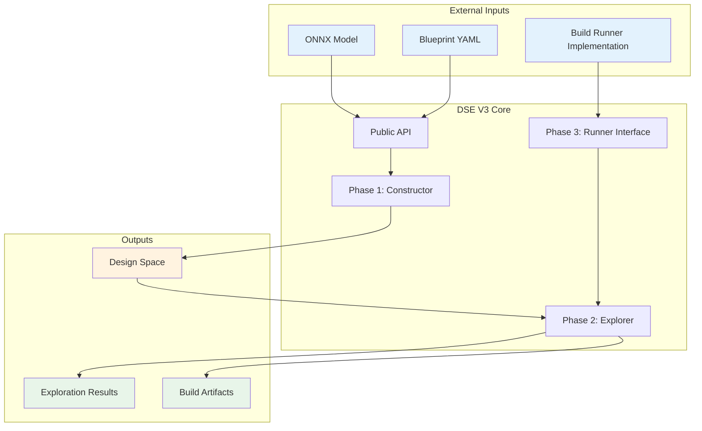
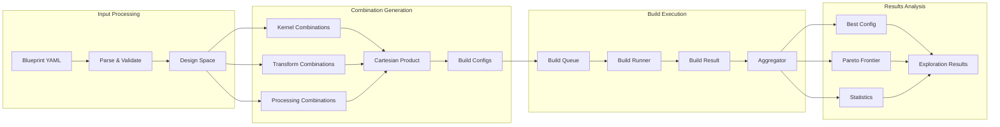
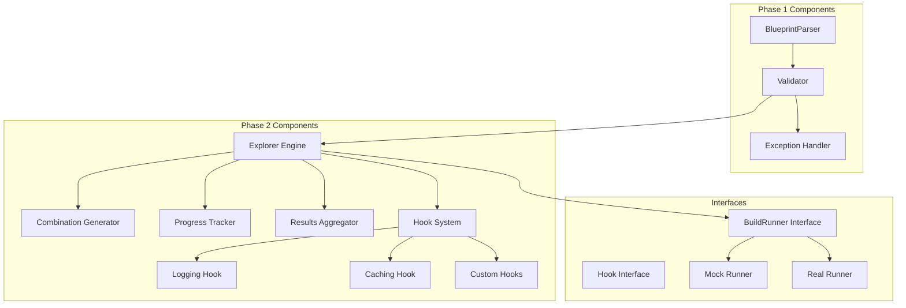
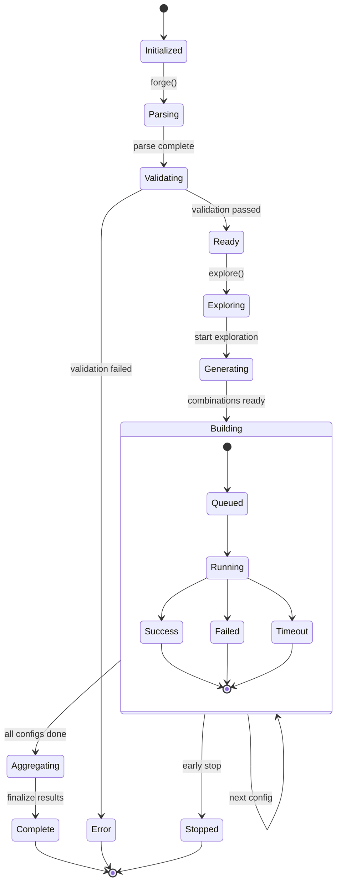
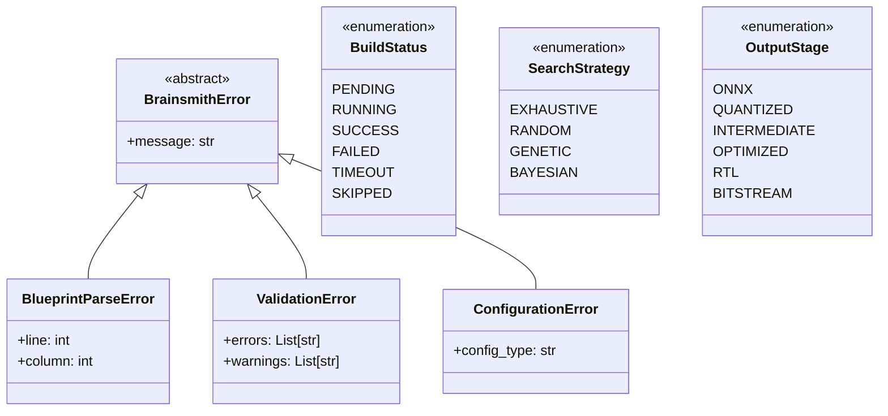
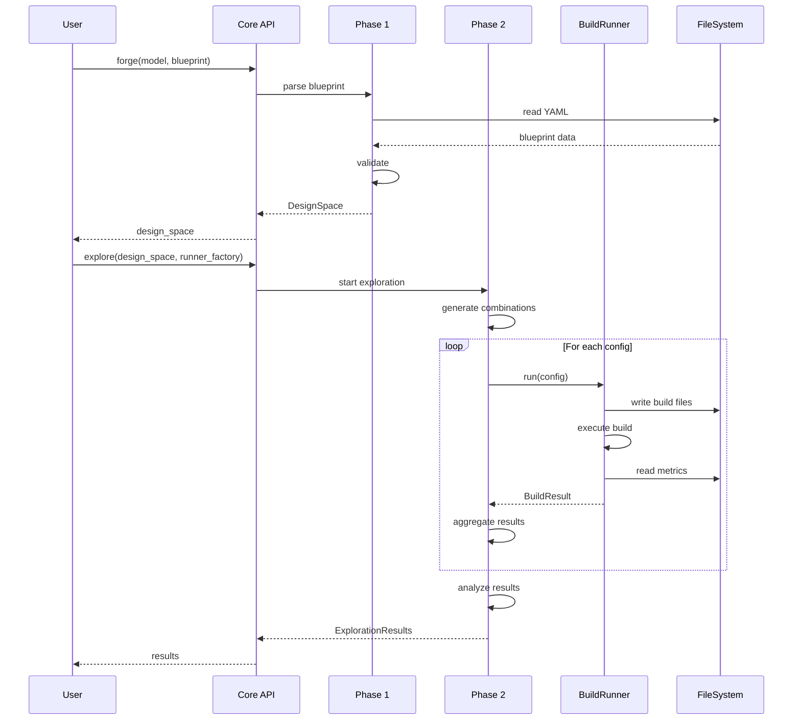
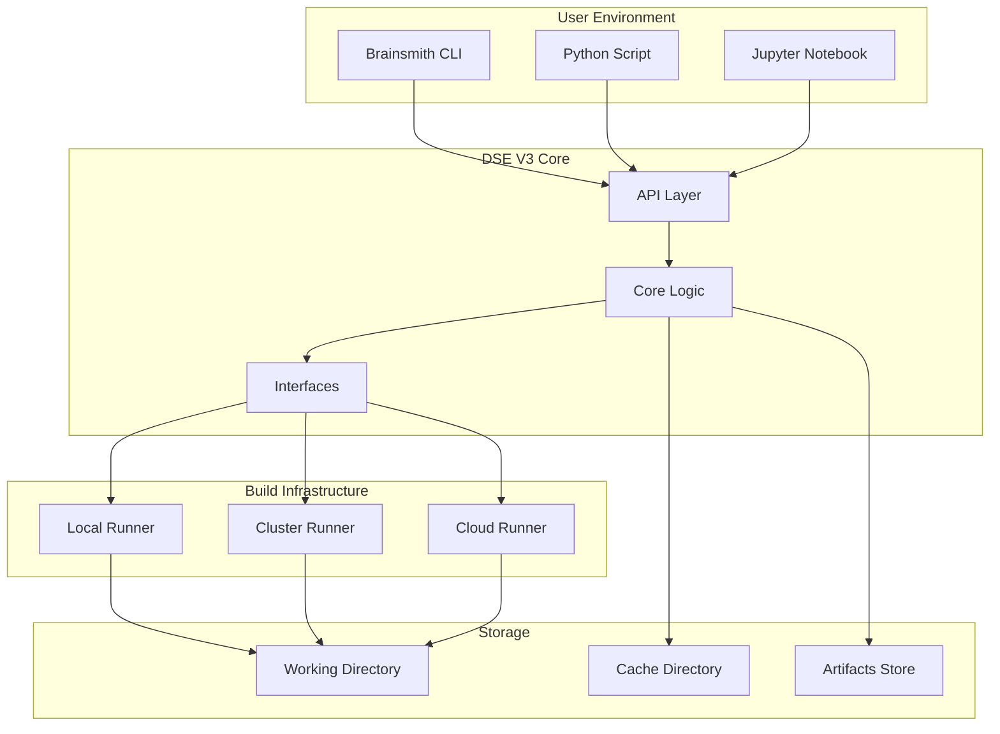
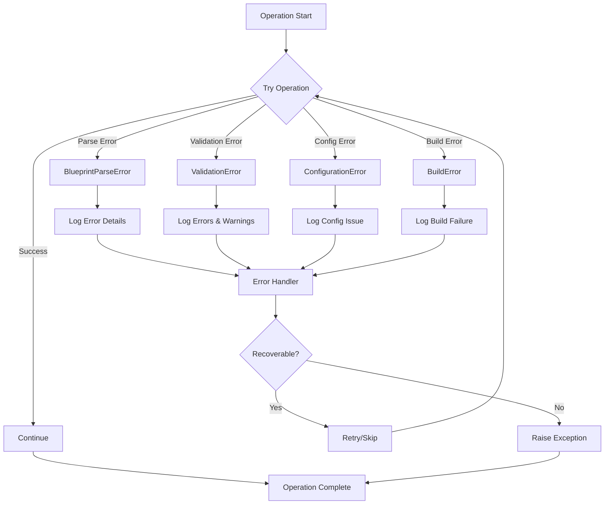
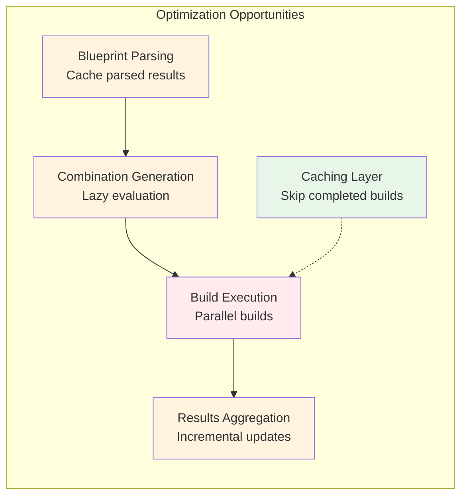

# DSE V3 Architecture Diagrams

## System Context Diagram

## Data Flow Diagram

## Component Interaction Diagram

## State Machine Diagram

## Class Hierarchy Diagram

## Sequence Diagram: Complete Workflow

## Deployment Diagram

## Error Handling Flow

## Performance Optimization Points

These diagrams provide different perspectives on the DSE V3 architecture, helping to understand:
- System boundaries and interactions
- Data flow through the system
- Component relationships
- State transitions
- Error handling strategies
- Deployment options
- Performance optimization points