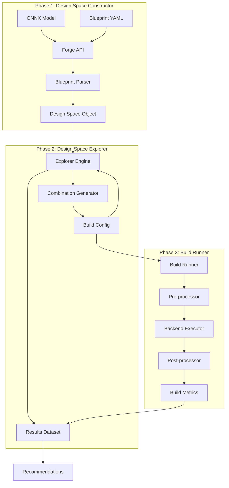

# Brainsmith Core V3 Architecture Design

## Executive Summary

This design proposes a fundamentally restructured Brainsmith Core architecture that emphasizes clean separation of concerns, extensibility through well-defined interfaces, and elegant simplicity. The new architecture consists of three distinct phases: Design Space Constructor, Design Space Explorer, and Build Runner, each with clear responsibilities and minimal coupling.

## Design Principles

1. **Separation of Concerns**: Each component has a single, well-defined responsibility
2. **Extensibility**: Hook-based architecture enables future enhancements without core modifications
3. **Simplicity**: Minimal abstractions, straightforward data flow
4. **Explicit over Implicit**: Clear configuration and behavior, no hidden magic
5. **Data-Driven**: Rich data structures guide the entire process

## High-Level Architecture



## Core Data Structures

### 1. Design Space Object
```python
@dataclass
class DesignSpace:
    """Complete definition of the exploration space"""
    model: ModelInfo                    # ONNX model metadata
    hw_compiler_space: HWCompilerSpace   # FINN-specific configurations
    processing_space: ProcessingSpace    # Pre/post processing options
    search_config: SearchConfig          # How to explore the space
    global_config: GlobalConfig          # Fixed parameters for all runs
```

### 2. Build Config
```python
@dataclass
class BuildConfig:
    """Configuration for a single build run"""
    id: str                              # Unique identifier
    hw_compiler_config: HWCompilerConfig # Specific FINN settings
    processing_config: ProcessingConfig  # Specific pre/post settings
    metadata: Dict[str, Any]             # Additional context
```

### 3. Build Result
```python
@dataclass
class BuildResult:
    """Result from a single build run"""
    config_id: str                       # Links back to BuildConfig
    metrics: BuildMetrics                # Performance and resource metrics
    artifacts: BuildArtifacts            # Generated files, reports
    status: BuildStatus                  # Success, failure, partial
    logs: BuildLogs                      # Detailed execution logs
```

## Phase 1: Design Space Constructor

### Purpose
Transform user inputs (ONNX model + Blueprint) into a complete, validated Design Space object ready for exploration.

### Components

#### 1.1 Forge API
```python
def forge(model_path: str, blueprint_path: str) -> DesignSpace:
    """Main entry point for design space construction"""
    # Load and validate inputs
    # Parse blueprint
    # Construct design space
    # Return validated DesignSpace object
```

#### 1.2 Blueprint Parser
Parses Blueprint YAML into structured components:

```yaml
# Example Blueprint Structure
version: "3.0"

hw_compiler:
  kernels:
    - {type: "matmul", variants: ["rtl", "hls"]}
    - {type: "conv", variants: ["standard", "depthwise"]}
  transforms:
    - {type: "quantization", options: [8, 4]}
  build_steps: ["synthesize", "place_route"]
  config_flags:
    target_device: "U250"

processing:
  preprocessing:
    - {type: "normalization", enabled: [true, false]}
  postprocessing:
    - {type: "accuracy_analysis", enabled: [true]}

search:
  strategy: "exhaustive"  # Only supported initially
  constraints:
    max_resource_utilization: 0.8
  
global:
  output_stage: "rtl"  # dataflow_graph, rtl, stitched_ip
  working_directory: "./builds"
```

#### 1.3 Design Space Validator
- Validates ONNX model compatibility
- Checks blueprint syntax and semantics
- Ensures design space is explorable
- Reports warnings for large search spaces

### Data Flow
1. User provides ONNX model and Blueprint YAML
2. Forge API loads and validates inputs
3. Blueprint Parser extracts all configuration spaces
4. Design Space object constructed with all variations
5. Validator ensures consistency and feasibility

## Phase 2: Design Space Explorer

### Purpose
Systematically explore the design space by generating build configurations, managing the exploration process, and collecting results.

### Components

#### 2.1 Explorer Engine
```python
class ExplorerEngine:
    def explore(self, design_space: DesignSpace) -> ExplorationResults:
        """Main exploration loop"""
        # Generate all combinations (initially)
        # For each combination:
        #   - Create BuildConfig
        #   - Submit to BuildRunner
        #   - Collect results
        # Return aggregated results
```

#### 2.2 Combination Generator
```python
class CombinationGenerator:
    def generate_all(self, design_space: DesignSpace) -> List[BuildConfig]:
        """Generate all valid combinations from design space"""
        # Cartesian product of all options
        # Apply constraints
        # Return valid BuildConfigs
```

#### 2.3 Results Aggregator
```python
class ResultsAggregator:
    def __init__(self):
        self.results: List[BuildResult] = []
    
    def add_result(self, result: BuildResult):
        """Add a build result to the dataset"""
        
    def get_recommendations(self) -> Recommendations:
        """Analyze results and provide recommendations"""
```

### Extensibility Hooks
```python
class ExplorationHook(ABC):
    """Base class for exploration extensions"""
    
    @abstractmethod
    def on_exploration_start(self, design_space: DesignSpace):
        """Called before exploration begins"""
    
    @abstractmethod
    def on_combination_generated(self, config: BuildConfig):
        """Called for each generated combination"""
    
    @abstractmethod
    def on_build_complete(self, result: BuildResult):
        """Called after each build completes"""
    
    @abstractmethod
    def on_exploration_complete(self, results: ExplorationResults):
        """Called after all exploration completes"""
```

### Future Extension Points
- **Smart Sampling**: Hook to filter combinations before evaluation
- **Adaptive Exploration**: Hook to modify exploration based on results
- **Early Termination**: Hook to stop exploration based on criteria
- **ML-Guided Search**: Hook to use ML models for guidance

## Phase 3: Build Runner

### Purpose
Execute individual builds with proper pre/post processing, backend execution, and metrics collection.

### Components

#### 3.1 Build Runner
```python
class BuildRunner:
    def __init__(self, backend: BackendExecutor):
        self.backend = backend
    
    def run(self, config: BuildConfig) -> BuildResult:
        """Execute a single build"""
        # Apply preprocessing
        # Execute backend with config
        # Apply postprocessing
        # Collect metrics
        # Return BuildResult
```

#### 3.2 Preprocessing Pipeline
```python
class PreprocessingPipeline:
    def __init__(self, steps: List[PreprocessStep]):
        self.steps = steps
    
    def execute(self, config: BuildConfig) -> ProcessedConfig:
        """Apply all preprocessing steps"""
        # Model transformations
        # Configuration adjustments
        # Environment setup
```

#### 3.3 Backend Executor
```python
class BackendExecutor(ABC):
    """Abstract base for backend execution"""
    
    @abstractmethod
    def execute(self, config: ProcessedConfig) -> BackendResult:
        """Run the backend compilation/synthesis"""

class FINNBackend(BackendExecutor):
    """FINN-specific implementation"""
    
    def execute(self, config: ProcessedConfig) -> BackendResult:
        # Prepare FINN workflow
        # Execute FINN build
        # Collect FINN outputs
```

#### 3.4 Postprocessing Pipeline
```python
class PostprocessingPipeline:
    def __init__(self, analyzers: List[Analyzer]):
        self.analyzers = analyzers
    
    def analyze(self, backend_result: BackendResult) -> AnalysisResults:
        """Run all analysis steps"""
        # Performance analysis
        # Resource utilization
        # Quality metrics
        # Custom analyses
```

### Metrics Collection
```python
@dataclass
class BuildMetrics:
    """Combined performance and resource metrics"""
    # Performance metrics
    throughput: float          # inferences/second
    latency: float            # microseconds
    clock_frequency: float    # MHz
    
    # Resource metrics
    lut_utilization: float
    dsp_utilization: float
    bram_utilization: float
    total_power: float
    
    # Additional metrics
    accuracy: float           # Model accuracy if evaluated
    custom: Dict[str, Any]    # Extensible for custom metrics
```

## Integration Example

```python
# User code
from brainsmith.core import forge, explore, recommend

# Phase 1: Construct design space
design_space = forge(
    model_path="bert_base.onnx",
    blueprint_path="bert_exploration.yaml"
)

# Phase 2: Explore the space
results = explore(design_space)

# Phase 3: Get recommendations
recommendations = recommend(results)
print(f"Best configuration: {recommendations.best}")
print(f"Pareto optimal set: {recommendations.pareto_set}")
```

## Key Benefits

### 1. **Clear Separation of Concerns**
- Design Space Constructor: What to explore
- Design Space Explorer: How to explore
- Build Runner: How to evaluate

### 2. **Extensibility**
- Hook system for future enhancements
- Plugin architecture for custom behaviors
- Clean interfaces for backend additions

### 3. **Simplicity**
- Straightforward data flow
- Minimal abstractions
- Clear phase boundaries

### 4. **Flexibility**
- Supports multiple backends
- Configurable pre/post processing
- Extensible metrics collection

### 5. **Future-Ready**
- Hooks for intelligent search strategies
- Support for ML-guided exploration
- Clean integration points

## Migration Path

1. **Phase 1**: Implement new data structures alongside existing code
2. **Phase 2**: Port blueprint parsing to new system
3. **Phase 3**: Implement exhaustive exploration
4. **Phase 4**: Add FINN backend support
5. **Phase 5**: Migrate existing functionality
6. **Phase 6**: Deprecate old system

## Next Steps

1. Review and refine this high-level design
2. Detail Phase 1 implementation
3. Define exact data structure schemas
4. Plan incremental implementation approach