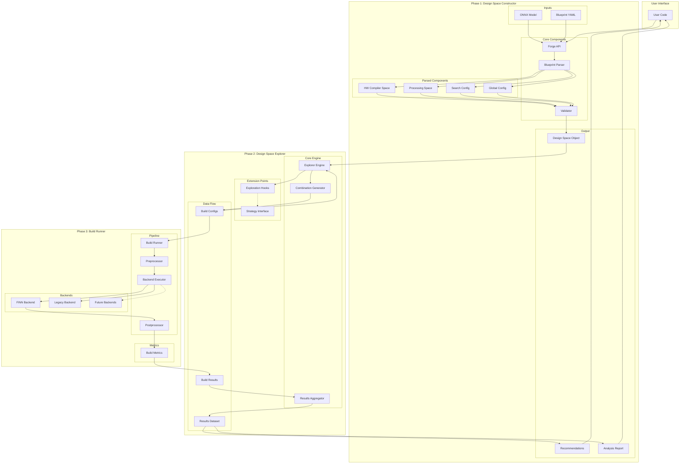
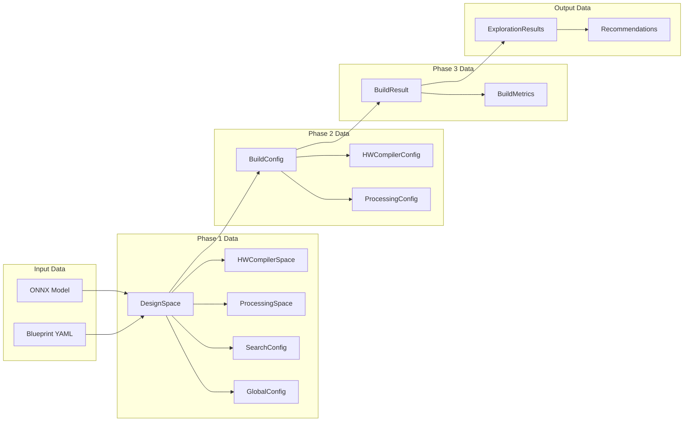
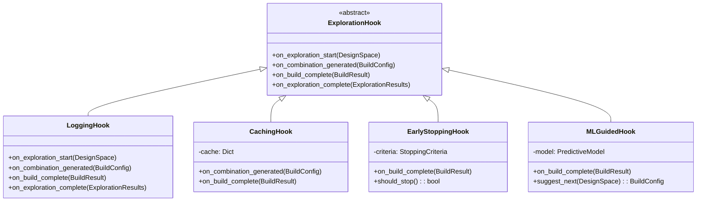
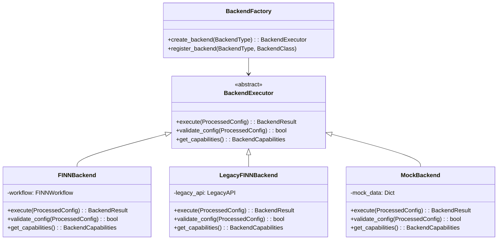

# Brainsmith Core V3 - Detailed Architecture Visualization

## Component Interaction Diagram



## Data Structure Flow



## Hook System Architecture



## Backend Integration Pattern



## Example Blueprint Structure

```yaml
# bert_exploration.yaml
version: "3.0"

hw_compiler:
  kernels:
    matmul:
      variants: ["rtl_optimized", "hls_balanced"]
      parameters:
        precision: [8, 4]
    
    attention:
      variants: ["standard", "flash_attention"]
      parameters:
        head_dim: [64, 32]
    
    layernorm:
      variants: ["streaming", "parallel"]
  
  transforms:
    quantization:
      strategies: ["symmetric", "asymmetric"]
      bits: [8, 4]
    
    folding:
      strategies: ["layer_wise", "operator_wise"]
    
    memory_optimization:
      enabled: [true, false]
  
  build_steps:
    - synthesize
    - optimize
    - place_route
  
  config_flags:
    target_device: "U250"
    clock_target: 300  # MHz

processing:
  preprocessing:
    model_optimization:
      graph_optimization: [true, false]
      constant_folding: [true]
    
    input_processing:
      normalization: ["standard", "none"]
  
  postprocessing:
    analysis:
      performance_profiling: true
      resource_analysis: true
      accuracy_validation: true
    
    reporting:
      formats: ["json", "html"]

search:
  strategy: "exhaustive"
  
  constraints:
    max_lut_utilization: 0.85
    min_throughput: 1000  # inferences/sec
    max_latency: 10  # milliseconds
  
  early_stopping:
    enabled: false  # For future use
    criteria: "convergence"

global:
  output_stage: "rtl"
  working_directory: "./exploration_builds"
  cache_results: true
  parallel_builds: 4
  
  reporting:
    save_all_results: true
    generate_pareto_plot: true
```