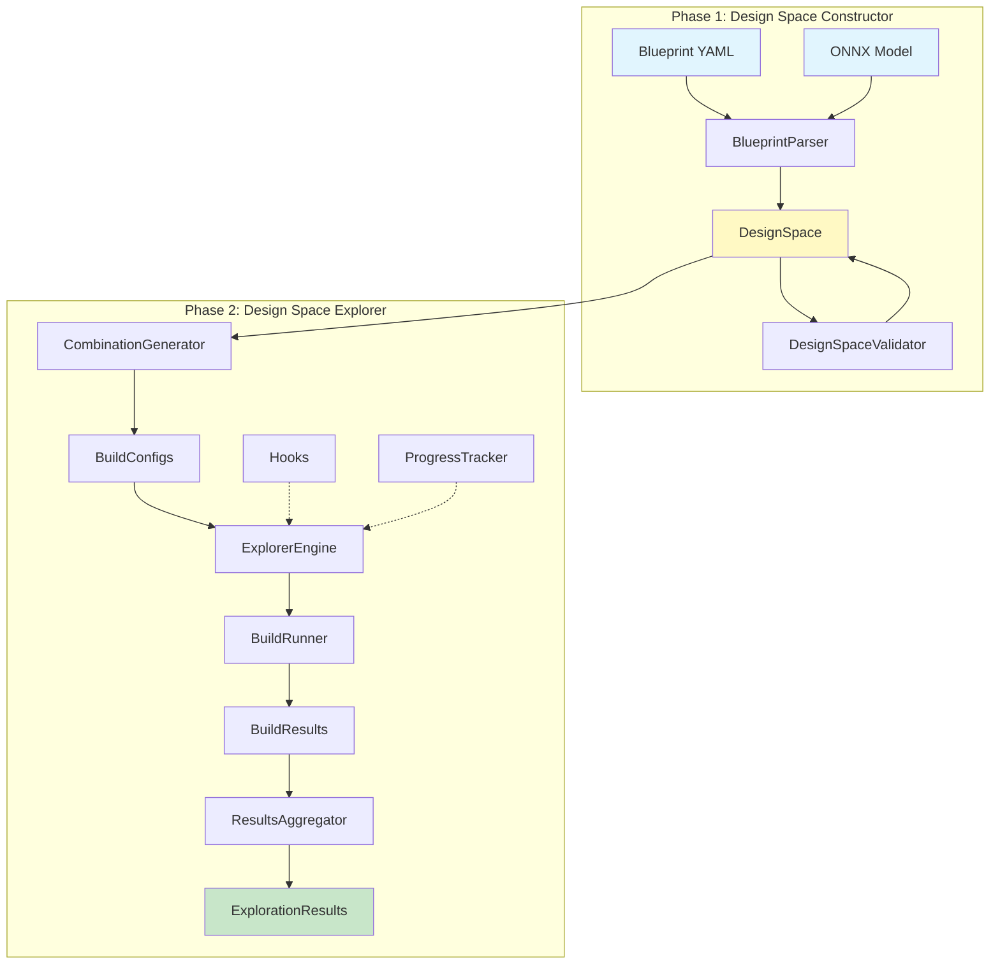
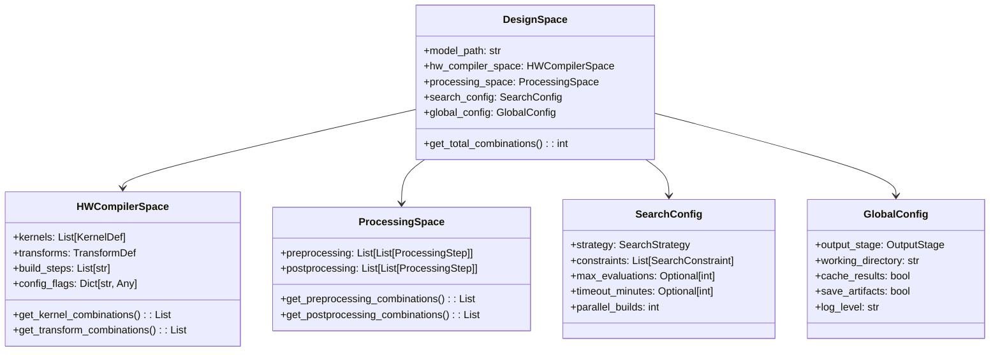
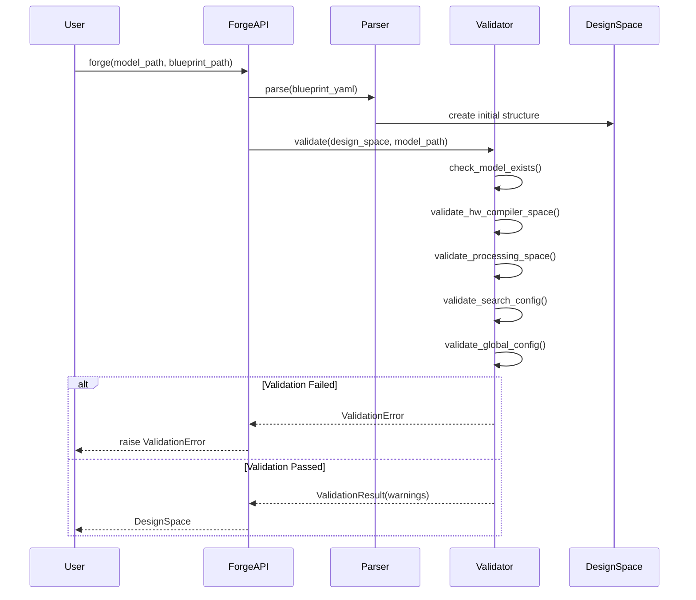
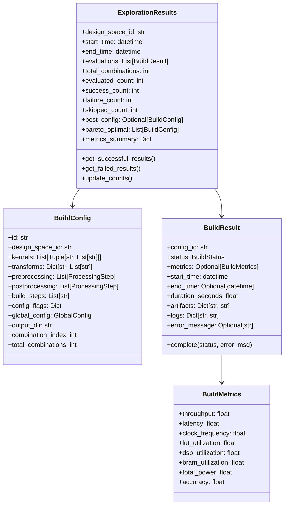
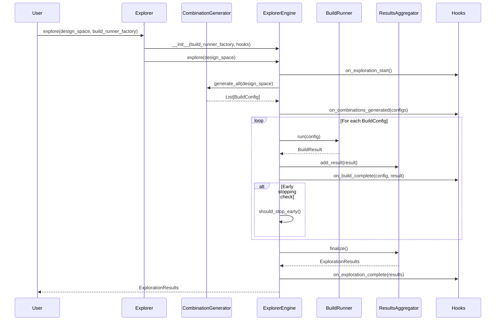
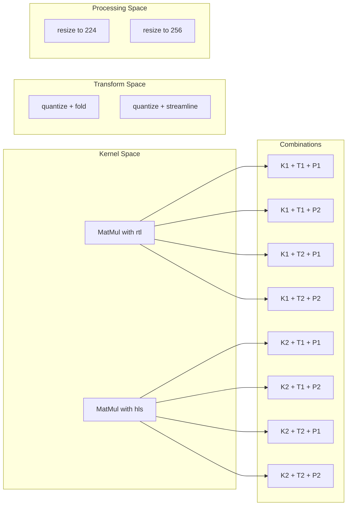
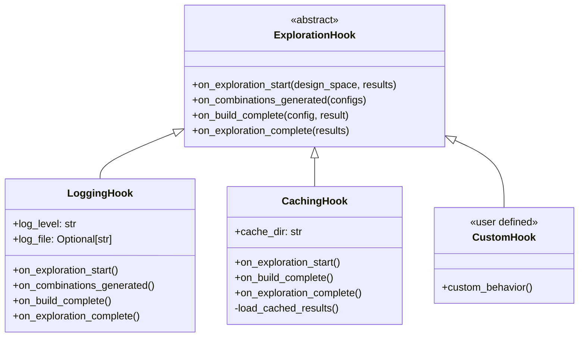
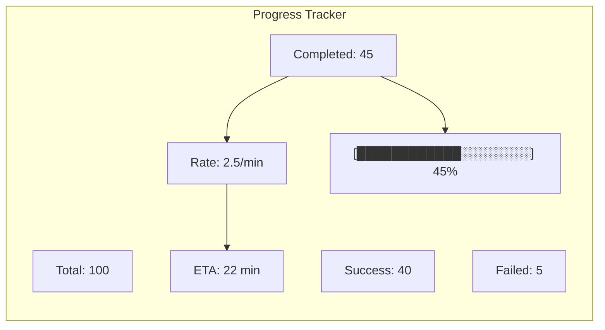

# DSE V3 Combined Design Document

## Overview

The Design Space Explorer (DSE) V3 is a complete rewrite of Brainsmith's design space exploration system, focusing on simplicity, extensibility, and clear separation of concerns. This document covers the implemented Phase 1 (Design Space Constructor) and Phase 2 (Design Space Explorer).

## Architecture Overview



## Phase 1: Design Space Constructor

### Purpose
Parse and validate Blueprint V3 YAML files to construct a well-defined design space for exploration.

### Core Components

#### 1. Data Structures



#### 2. Blueprint Parser

The parser supports flexible kernel and transform specifications:

```yaml
# Simple kernel
kernels:
  - MatMul

# Kernel with backends
kernels:
  - [MatMul, [rtl, hls]]

# Mutually exclusive kernels
kernels:
  - [LayerNorm, RMSNorm]

# Optional kernel (can be skipped)
kernels:
  - [~, Transpose]

# Flat transforms
transforms:
  - quantize
  - fold

# Phase-based transforms
transforms:
  pre_quantization:
    - fold
    - ~streamline  # optional
  quantization:
    - quantize
  post_quantization:
    - pack
```

#### 3. Validation Flow



### Phase 1 API

```python
from brainsmith.core_v3 import forge

# Main API function
design_space = forge(
    model_path="model.onnx",
    blueprint_path="blueprint.yaml"
)

# Returns a validated DesignSpace ready for exploration
print(f"Total combinations: {design_space.get_total_combinations()}")
```

## Phase 2: Design Space Explorer

### Purpose
Systematically explore the design space by generating all valid configurations, executing builds, and analyzing results.

### Core Components

#### 1. Data Structures



#### 2. Exploration Flow



#### 3. Combination Generation

The combination generator creates the Cartesian product of all options:



#### 4. Hook System



#### 5. Progress Tracking



### Phase 2 API

```python
from brainsmith.core_v3 import forge, explore
from brainsmith.core_v3.phase2 import MockBuildRunner, LoggingHook, CachingHook

# Get design space from Phase 1
design_space = forge("model.onnx", "blueprint.yaml")

# Create build runner factory
def build_runner_factory():
    return MockBuildRunner(success_rate=0.9)

# Set up hooks
hooks = [
    LoggingHook(log_level="INFO", log_file="exploration.log"),
    CachingHook(cache_dir=".cache")
]

# Run exploration
results = explore(
    design_space,
    build_runner_factory,
    hooks=hooks,
    resume_from=None  # Or provide config_id to resume
)

# Analyze results
print(results.get_summary_string())
print(f"Best config: {results.best_config}")
print(f"Pareto optimal: {len(results.pareto_optimal)} configs")
```

## Global Configuration System

DSE V3 includes a hierarchical global configuration system that allows users to set defaults and limits at multiple levels:

### Configuration Priority (Highest to Lowest)
1. **Blueprint/project** configuration (in blueprint YAML)
2. **User** configuration (`~/.brainsmith/config.yaml`)
3. **Environment** variables (`BRAINSMITH_MAX_COMBINATIONS`, `BRAINSMITH_TIMEOUT_MINUTES`)
4. **Built-in defaults** (embedded in code)

### Configuration Options

#### max_combinations
- **Purpose**: Maximum allowed design space combinations to prevent accidental creation of huge design spaces
- **Default**: 100,000 combinations
- **Blueprint override**: Set in `global.max_combinations`
- **Environment**: `BRAINSMITH_MAX_COMBINATIONS=500000`

#### timeout_minutes
- **Purpose**: Default timeout for DSE jobs
- **Default**: 60 minutes
- **Blueprint override**: Set in `search.timeout_minutes` or `global.timeout_minutes`
- **Environment**: `BRAINSMITH_TIMEOUT_MINUTES=120`

### Usage Examples

#### Blueprint Configuration
```yaml
version: "3.0"
global:
  max_combinations: 500000  # Override global default
  timeout_minutes: 120      # Override global default
search:
  timeout_minutes: 90       # Takes precedence over global.timeout_minutes
```

#### User Configuration (`~/.brainsmith/config.yaml`)
```yaml
# Global defaults for this user
max_combinations: 1000000
timeout_minutes: 240
```

#### Environment Variables
```bash
export BRAINSMITH_MAX_COMBINATIONS=2000000
export BRAINSMITH_TIMEOUT_MINUTES=480
```

### Validation and Error Handling

When a design space exceeds the max_combinations limit, validation fails with a helpful error message:

```
Design space has 150,000 combinations, exceeding maximum of 100,000. 
You can increase this limit by setting max_combinations in the blueprint's 
global section, or in ~/.brainsmith/config.yaml, or via 
BRAINSMITH_MAX_COMBINATIONS environment variable.
```

## Key Design Decisions

### 1. Clean Phase Separation
- Phase 1: Blueprint parsing and validation
- Phase 2: Design space exploration
- Phase 3: Build execution (future)

### 2. Explicit Configuration
- All options explicitly defined in blueprints
- No hidden defaults or magic behavior
- Clear validation with helpful error messages

### 3. Flexible Kernel/Transform Specification
- Support for simple lists, backends, mutually exclusive options
- Optional elements with `~` syntax
- Phase-based transform organization

### 4. Hook-Based Extensibility
- Clean interface for extending behavior
- Built-in hooks for common needs (logging, caching)
- Hooks fired at key lifecycle points

### 5. Hierarchical Configuration
- Global library defaults with user and project overrides
- Environment variable support for CI/CD environments
- Clear priority order from specific to general

### 6. Comprehensive Testing
- 110+ tests covering all functionality
- Unit tests for components
- Integration tests for workflows
- Test-driven development approach

## Directory Structure

```
brainsmith/core_v3/
├── __init__.py           # Public API (forge, explore)
├── phase1/               # Design Space Constructor
│   ├── __init__.py
│   ├── data_structures.py
│   ├── exceptions.py
│   ├── parser.py
│   ├── validator.py
│   └── forge.py
├── phase2/               # Design Space Explorer
│   ├── __init__.py
│   ├── data_structures.py
│   ├── combination_generator.py
│   ├── explorer.py
│   ├── results_aggregator.py
│   ├── hooks.py
│   ├── progress.py
│   └── interfaces.py
└── tests/
    ├── fixtures/
    ├── unit/
    │   ├── phase1/
    │   └── phase2/
    └── integration/
```

## Usage Example

```python
# Complete workflow
from brainsmith.core_v3 import forge, explore
from my_build_runner import RealBuildRunner

# 1. Parse blueprint
design_space = forge("bert.onnx", "bert_blueprint.yaml")
print(f"Design space has {design_space.get_total_combinations()} configurations")

# 2. Explore design space
results = explore(design_space, lambda: RealBuildRunner())

# 3. Analyze results
print(f"Explored {results.evaluated_count} configurations")
print(f"Success rate: {results.success_count / results.evaluated_count * 100:.1f}%")
print(f"Best throughput: {results.best_config} ")

# 4. Get Pareto optimal configurations
for config in results.pareto_optimal:
    metrics = results.get_result(config.id).metrics
    print(f"Config {config.id}: {metrics.throughput} GOPS, {metrics.lut_utilization:.1%} LUT")
```

## Future Enhancements

### Phase 3: Build Runner
- Real build execution with preprocessing/postprocessing
- Integration with backend compilers (FINN, Vitis)
- Artifact management and caching

### Advanced Features
- Parallel build execution
- Smart search strategies (genetic algorithms, Bayesian optimization)
- Constraint-based pruning
- Multi-objective optimization enhancements

## Conclusion

DSE V3 provides a clean, extensible foundation for design space exploration in Brainsmith. The architecture emphasizes simplicity, testability, and clear separation of concerns while providing the flexibility needed for future enhancements.