# Phase 2: Design Space Explorer - Design Document

## Table of Contents
1. [Overview](#overview)
2. [Architecture](#architecture)
3. [Core Components](#core-components)
4. [Data Flow](#data-flow)
5. [Hook System](#hook-system)
6. [Exploration Process](#exploration-process)
7. [Result Analysis](#result-analysis)
8. [Integration Points](#integration-points)
9. [Design Rationale](#design-rationale)

## Overview

The Design Space Explorer (Phase 2) systematically explores the configuration space defined by Phase 1, executing builds through Phase 3, and collecting results for analysis. It serves as the orchestration layer that bridges configuration definition with actual hardware compilation.

### Key Responsibilities
- Generate all valid configurations from the design space
- Execute builds in a controlled manner
- Track progress and support resumability
- Aggregate and analyze results
- Provide extensibility through hooks

## Architecture

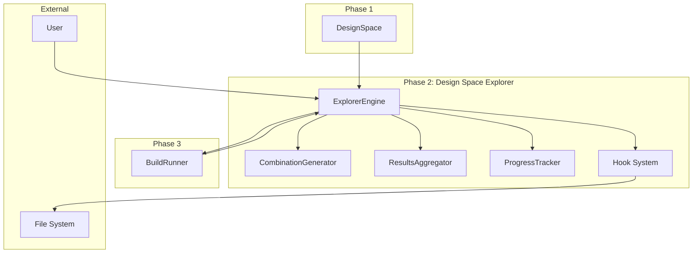

### Component Relationships

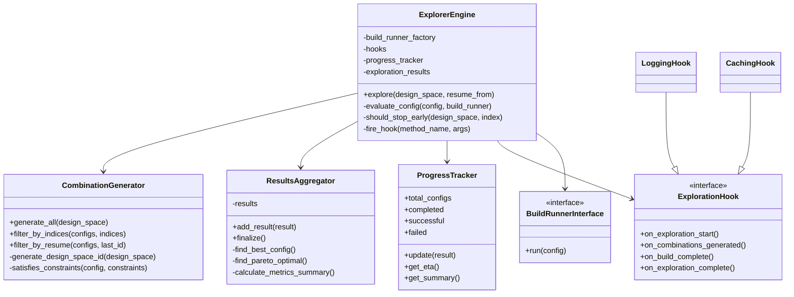

## Core Components

### 1. ExplorerEngine

The central orchestrator that manages the entire exploration process.

```python
class ExplorerEngine:
    """
    Main engine for design space exploration.
    
    Responsibilities:
    - Coordinate all exploration activities
    - Manage build execution
    - Fire hooks at appropriate points
    - Handle early stopping conditions
    """
```

**Key Methods:**
- `explore()`: Main entry point for exploration
- `_evaluate_config()`: Execute a single build safely
- `_should_stop_early()`: Check stopping conditions
- `_fire_hook()`: Invoke hook methods with error handling

### 2. CombinationGenerator

Generates all valid configurations from the design space using cartesian products while preserving transform stage information.

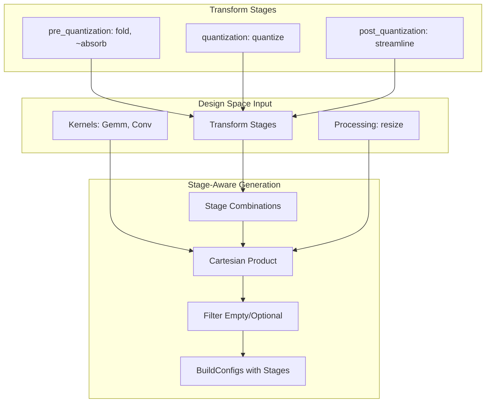

**Enhanced Generation Logic:**
1. Extract kernel combinations (with backends)
2. **Extract transform combinations by stage** (preserving execution order)
3. Extract processing step combinations
4. Generate cartesian product across all components
5. Filter empty/skipped elements while maintaining stage structure
6. Create BuildConfig objects with stage-organized transforms
7. Apply pre-build constraints

### 3. Data Structures

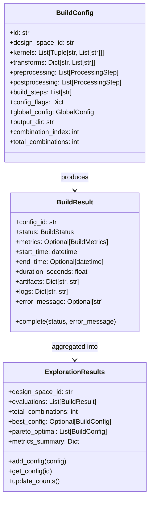

## Data Flow

### Exploration Lifecycle

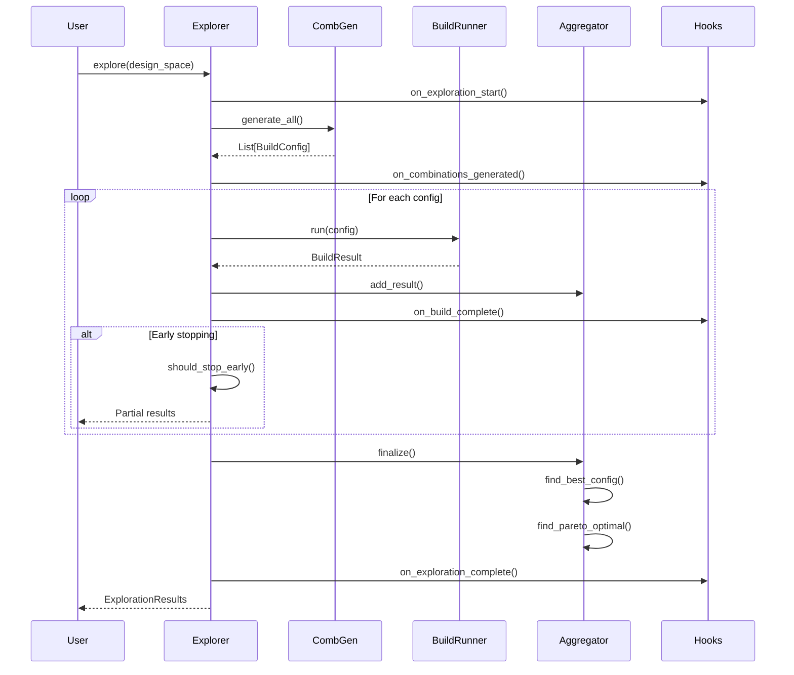

### Build Execution Flow

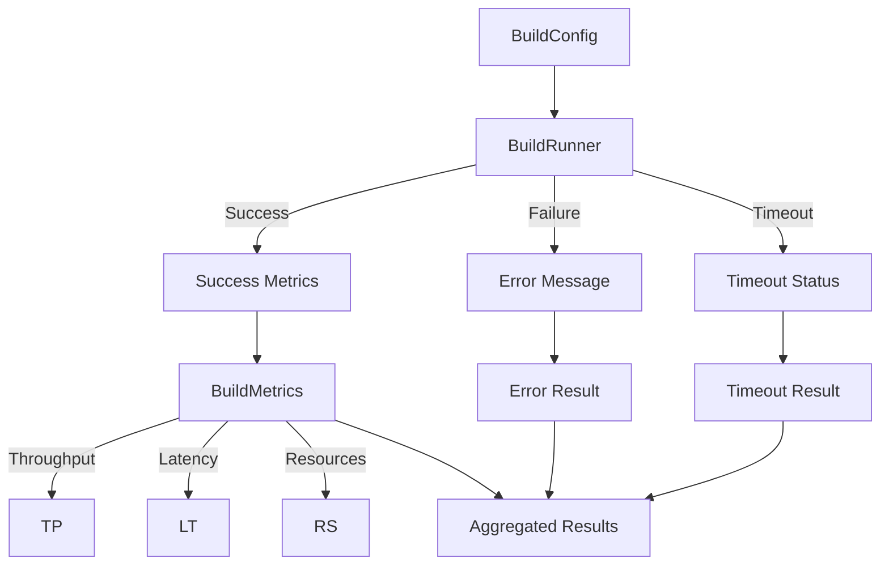

## Hook System

The hook system provides extensibility without modifying core logic.

### Hook Lifecycle

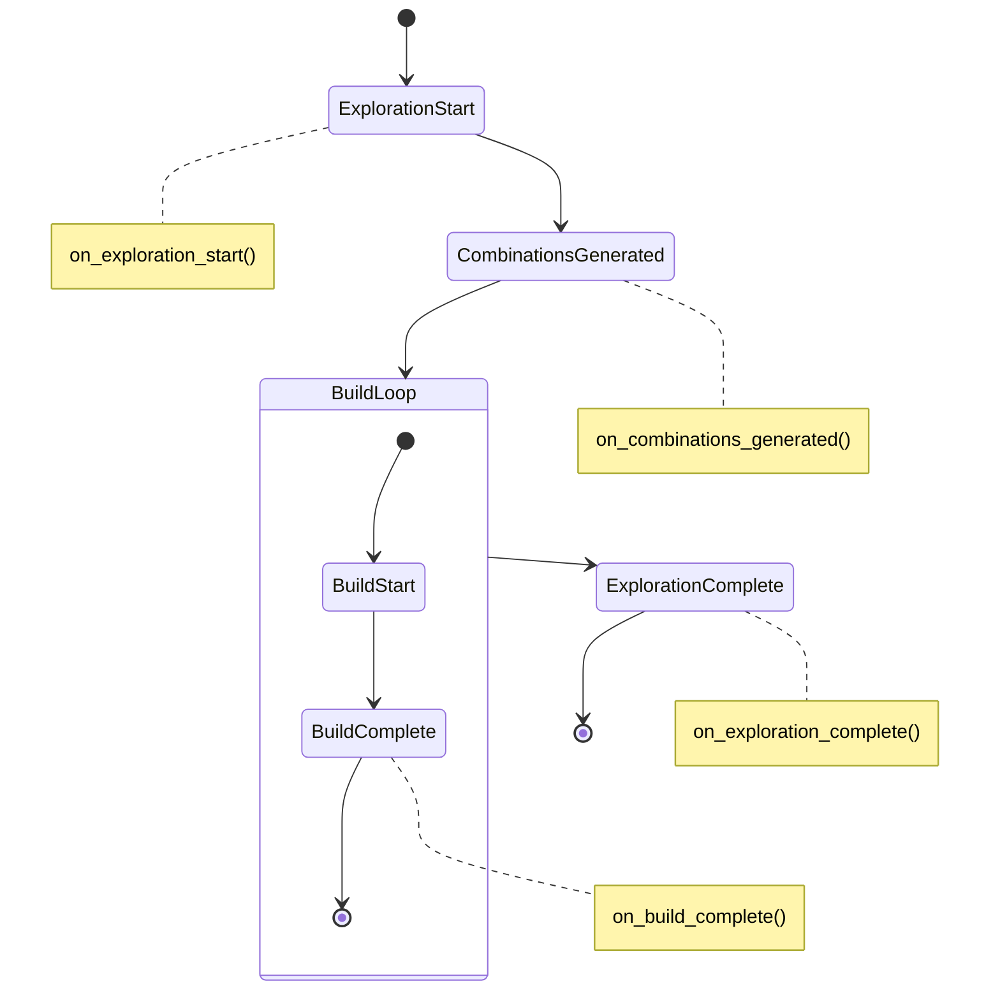

### Built-in Hooks

#### LoggingHook
Provides detailed logging throughout exploration:

```
================================================================================
DESIGN SPACE EXPLORATION STARTED
================================================================================
Model: /path/to/model.onnx
Design Space ID: dse_a1b2c3d4
Search Strategy: exhaustive
Total Combinations: 100
================================================================================

✅ Build config_001 (1/100): success | Throughput: 1234.56 | Latency: 10.23μs
❌ Build config_002 (2/100): failed | Error: Timing constraints not met
```

#### CachingHook
Enables resume functionality:

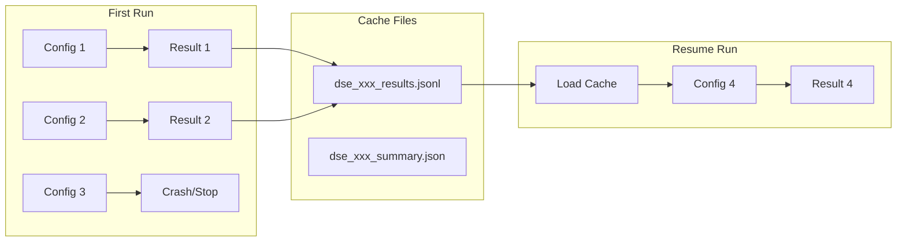

## Exploration Process

### 1. Combination Generation

Transform stages are preserved during combination generation to maintain execution order:

```python
# Example: 2 kernels with backends, transforms organized by stage
kernels = [("Gemm", ["rtl", "hls"]), ("Conv", ["hls"])]
transforms = {
    "pre_quantization": ["fold", "~absorb_transpose"],  # optional absorb
    "quantization": ["quantize"],
    "post_quantization": ["streamline"]
}

# Generates BuildConfigs with transforms organized by stage:
# Config 1: 
#   Kernels: Gemm[rtl], Conv[hls]
#   Transforms: {
#     "pre_quantization": ["fold", "absorb_transpose"],
#     "quantization": ["quantize"],
#     "post_quantization": ["streamline"]
#   }
# Config 2: 
#   Kernels: Gemm[rtl], Conv[hls]
#   Transforms: {
#     "pre_quantization": ["fold"],  # without optional absorb_transpose
#     "quantization": ["quantize"],
#     "post_quantization": ["streamline"]
#   }
# ... etc
```

This ensures transforms are executed in the correct order during Phase 3 build execution.

### 2. Progress Tracking

```
Progress: 45/100 (45.0%) | Success: 40 (88.9%) | Failed: 5 | Skipped: 0
Elapsed: 15.3m | Avg build: 20.4s | ETA: 18.7m (14:35:20)
```

### 3. Early Stopping

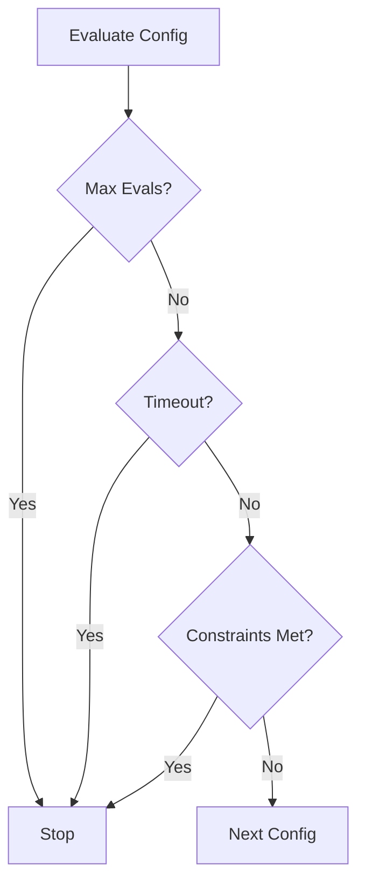

## Result Analysis

### 1. Best Configuration
Selected based on primary metric (throughput):

```python
best_config = max(successful_results, key=lambda r: r.metrics.throughput)
```

### 2. Pareto Frontier
Multi-objective optimization (throughput vs resources):

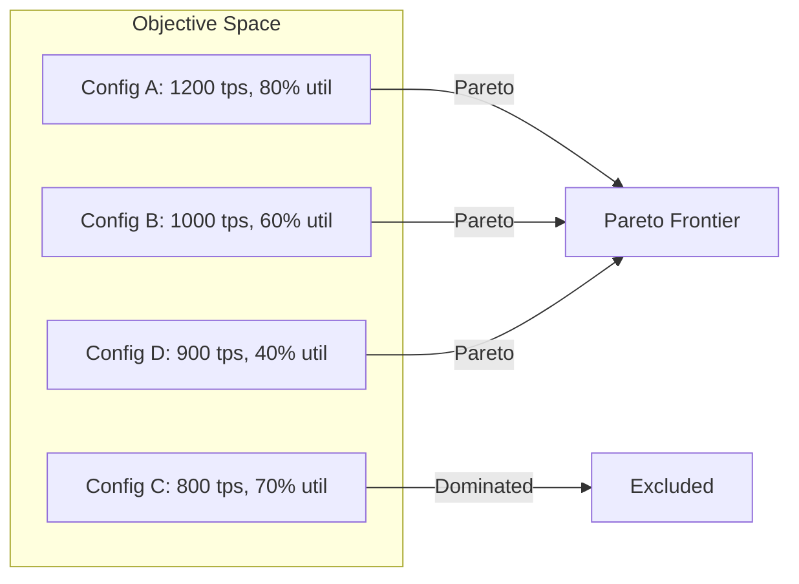

### 3. Metrics Summary

```python
{
    "throughput": {
        "min": 500.0,
        "max": 1500.0,
        "mean": 1000.0,
        "std": 250.0
    },
    "latency": {
        "min": 5.0,
        "max": 20.0,
        "mean": 12.5,
        "std": 3.5
    },
    # ... other metrics
}
```

## Integration Points

### Phase 1 Integration

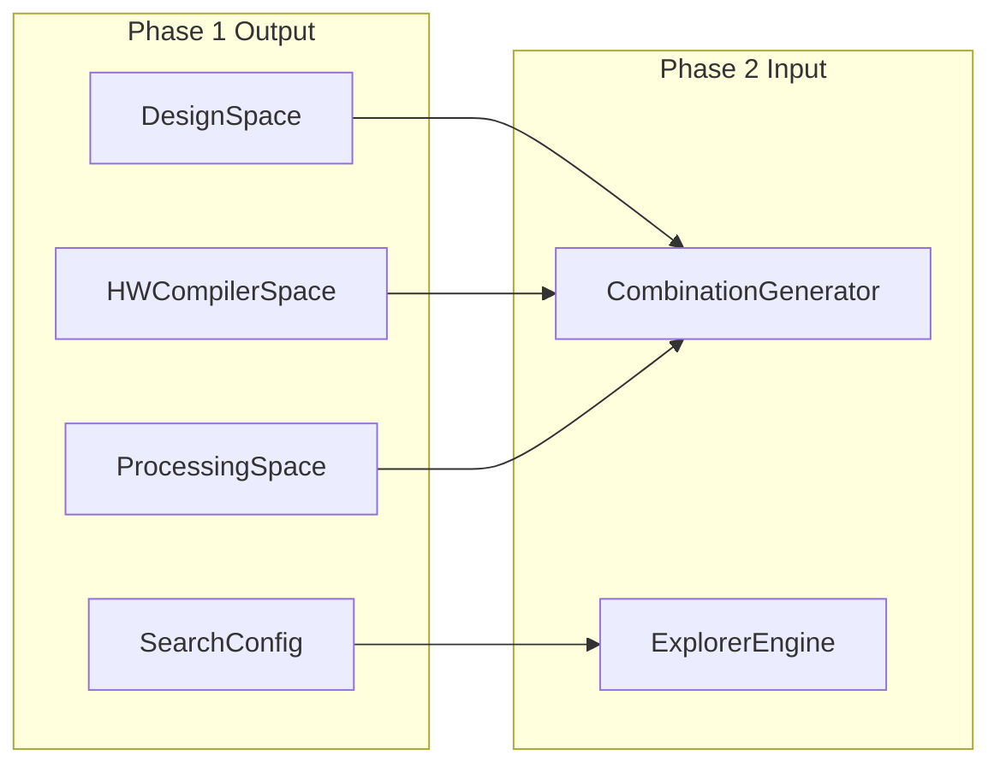

### Phase 3 Integration

Phase 3 receives BuildConfigs with transforms organized by stages, enabling proper execution order:

```python
class BuildRunnerInterface(ABC):
    @abstractmethod
    def run(self, config: BuildConfig) -> BuildResult:
        """Execute build and return results."""
        pass

# Phase 3 implements this interface
class FINNBuildRunner(BuildRunnerInterface):
    def run(self, config: BuildConfig) -> BuildResult:
        # Execute transforms in stage order
        for stage_name in ["pre_quantization", "quantization", "post_quantization"]:
            stage_transforms = config.transforms.get(stage_name, [])
            for transform in stage_transforms:
                self._apply_transform(transform)
        
        # Continue with hardware compilation...
        pass
```

**Benefits of Stage-Based Execution:**
- **Correct Transform Order**: Transforms execute in their intended phases
- **Clear Pipeline Structure**: Each stage has a specific purpose in the compilation flow
- **Better Error Handling**: Stage-specific error reporting and recovery
- **Debugging Support**: Can halt execution at specific stages for analysis

## Design Rationale

### 1. Separation of Concerns
- **CombinationGenerator**: Only generates configs, no execution
- **ExplorerEngine**: Only orchestrates, no result analysis
- **ResultsAggregator**: Only analyzes, no exploration logic

### 2. Extensibility Through Hooks
- No modification of core logic needed
- Multiple hooks can be composed
- Hooks are isolated from each other

### 3. Stateless Design
- Each exploration is independent
- Supports parallel execution
- Easier testing and debugging

### 4. Resume Support
- Built-in fault tolerance
- Minimal overhead when not used
- Transparent to exploration logic

### 5. Mock Build Runner
- Enables testing without Phase 3
- Predictable behavior for unit tests
- Configurable success rates and metrics

### 6. Transform Stage Organization
- **Execution Order Preservation**: Transforms maintain their intended phases (pre_quantization → quantization → post_quantization)
- **Blueprint Fidelity**: Direct mapping from blueprint configuration to build execution
- **Clear Separation**: Each stage has distinct responsibilities in the compilation pipeline
- **Enhanced Debugging**: Stage-specific logging and error reporting
- **Future Extensibility**: Easy to add stage-specific optimizations or conditional execution

## Error Handling

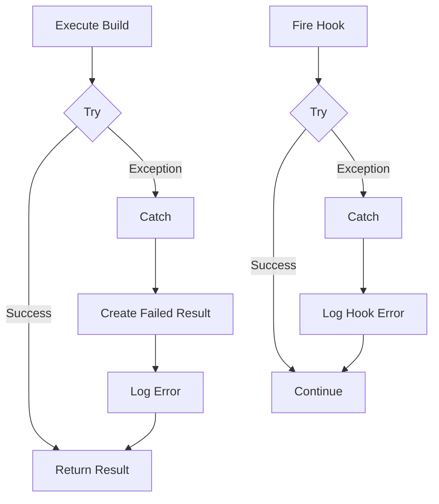

## Performance Considerations

### 1. Memory Usage
- Configs generated on-demand (generator pattern possible)
- Results stored incrementally
- Cache files use line-delimited JSON

### 2. Scalability
- O(n) exploration time (n = combinations)
- Constant memory per configuration
- Linear scaling with parallel builds

### 3. Optimization Opportunities
- Parallel build execution
- Distributed exploration
- Smart sampling strategies
- Constraint-based pruning

## Output Directory Structure

Phase 2 creates an intelligent directory structure for organizing exploration outputs:

```
{working_directory}/
└── {design_space_id}/                    # Root for this exploration
    ├── exploration_summary.json          # Overall exploration results
    ├── exploration_cache.jsonl           # Hook data (from CachingHook)
    ├── exploration_log.txt              # Exploration-level logs
    ├── pareto_configs.json              # Pareto-optimal configurations
    └── builds/                          # Individual build directories
        ├── config_0/                    # Dynamic padding based on total
        ├── config_1/                    # e.g., config_01 for 100 total
        └── config_N/                    # config_001 for 1000 total
```

### Key Features

1. **Dynamic Padding**: Directory names use the minimum digits needed
   - 10 configs: `config_0` to `config_9`
   - 100 configs: `config_00` to `config_99`
   - 1000 configs: `config_000` to `config_999`

2. **Phase Separation**: 
   - Phase 2 creates the directory structure and passes paths via `BuildConfig.output_dir`
   - Phase 3 creates actual build artifacts within its assigned directory

3. **Exploration-Level Data**: All exploration-wide data (hooks, summaries) stays in the parent directory

## Summary

Phase 2 provides a robust, extensible exploration engine that:
- ✅ Systematically explores all configurations
- ✅ Provides progress tracking and resumability
- ✅ Enables custom behavior through hooks
- ✅ Analyzes results for optimal configurations
- ✅ Integrates cleanly with Phases 1 and 3
- ✅ Organizes outputs in a scalable directory structure

The design prioritizes simplicity, extensibility, and reliability while avoiding premature optimization and unnecessary complexity.