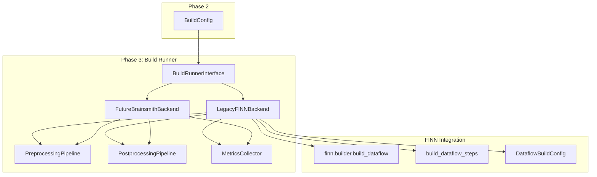
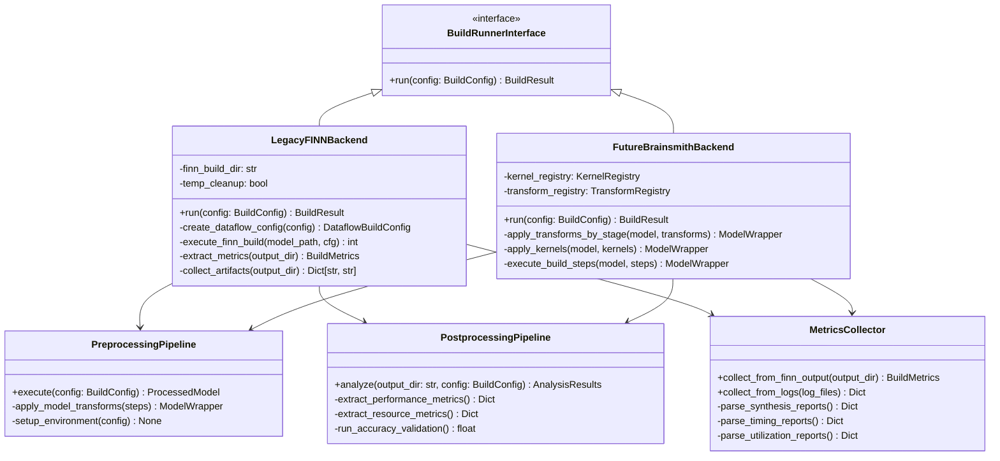
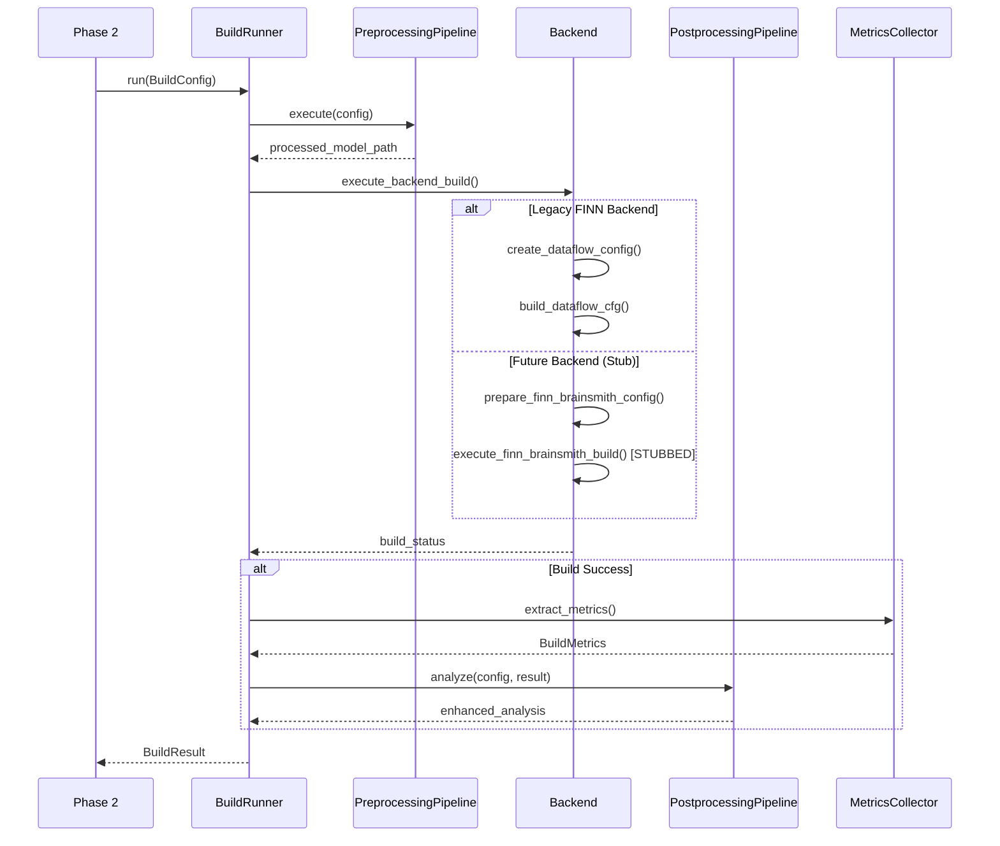
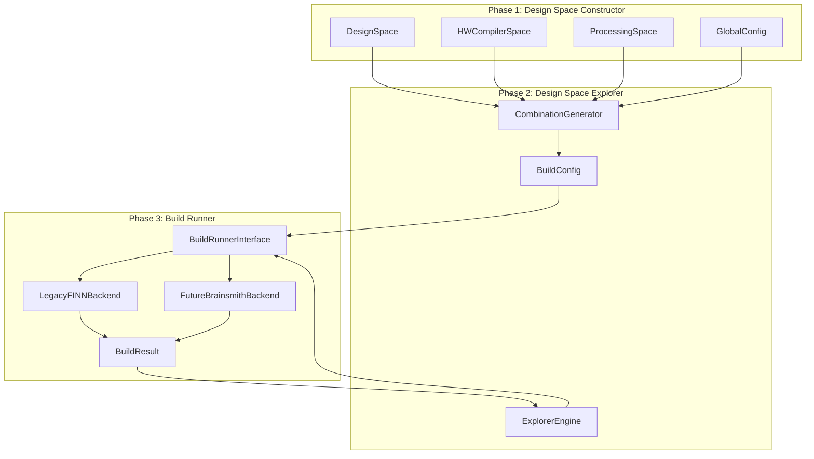

# Phase 3: Build Runner - Design Document

## Table of Contents
1. [Overview](#overview)
2. [Architecture](#architecture)
3. [Backend Interfaces](#backend-interfaces)
4. [Legacy FINN Backend](#legacy-finn-backend)
5. [Future FINN-Brainsmith Backend](#future-finn-brainsmith-backend)
6. [Build Pipeline](#build-pipeline)
7. [Metrics Collection](#metrics-collection)
8. [Error Handling](#error-handling)
9. [Integration with Phases 1 & 2](#integration-with-phases-1--2)

## Overview

Phase 3 implements the actual build execution for design space exploration. It provides two backend implementations:

1. **Legacy FINN Backend**: Uses the existing FINN builder interface (`finn.builder.build_dataflow`) with explicit build steps
2. **Future FINN-Brainsmith Backend**: Direct integration using kernels and transforms from the design space

### Key Responsibilities
- Execute hardware compilation using appropriate backends
- Collect performance and resource metrics
- Handle preprocessing and postprocessing steps
- Provide standardized result format
- Support resume and caching capabilities

## Architecture



### Component Relationships



## Backend Interfaces

### Base Interface

```python
from abc import ABC, abstractmethod
from typing import Optional
from datetime import datetime
from enum import Enum

class BuildStatus(Enum):
    SUCCESS = "success"
    FAILED = "failed"
    TIMEOUT = "timeout"
    SKIPPED = "skipped"

@dataclass
class BuildMetrics:
    """Standardized build metrics across all backends."""
    # Performance metrics
    throughput: Optional[float] = None          # inferences/second
    latency: Optional[float] = None             # microseconds
    clock_frequency: Optional[float] = None     # MHz
    
    # Resource metrics  
    lut_utilization: Optional[float] = None     # 0.0 to 1.0
    dsp_utilization: Optional[float] = None     # 0.0 to 1.0
    bram_utilization: Optional[float] = None    # 0.0 to 1.0
    uram_utilization: Optional[float] = None    # 0.0 to 1.0
    total_power: Optional[float] = None         # watts
    
    # Quality metrics
    accuracy: Optional[float] = None            # 0.0 to 1.0
    
    # Raw metrics for debugging/analysis
    raw_metrics: Dict[str, Any] = field(default_factory=dict)

@dataclass
class BuildResult:
    """Result from a single build execution."""
    config_id: str
    status: BuildStatus
    metrics: Optional[BuildMetrics] = None
    start_time: datetime = field(default_factory=datetime.now)
    end_time: Optional[datetime] = None
    duration_seconds: float = 0.0
    artifacts: Dict[str, str] = field(default_factory=dict)  # artifact_name -> file_path
    logs: Dict[str, str] = field(default_factory=dict)      # log_name -> content_or_path
    error_message: Optional[str] = None
    
    def complete(self, status: BuildStatus, error_message: Optional[str] = None):
        """Mark build as complete."""
        self.end_time = datetime.now()
        self.duration_seconds = (self.end_time - self.start_time).total_seconds()
        self.status = status
        self.error_message = error_message

class BuildRunnerInterface(ABC):
    """Abstract interface for build execution backends."""
    
    @abstractmethod
    def run(self, config: BuildConfig) -> BuildResult:
        """Execute build and return results."""
        pass
        
    @abstractmethod
    def get_backend_name(self) -> str:
        """Return human-readable backend name."""
        pass
        
    @abstractmethod
    def get_supported_output_stages(self) -> List[OutputStage]:
        """Return list of supported output stages."""
        pass
```

## Legacy FINN Backend

The Legacy FINN Backend integrates with the existing FINN builder infrastructure using explicit build steps.

### Implementation

```python
import os
import tempfile
import shutil
from pathlib import Path
from finn.builder.build_dataflow import build_dataflow_cfg
from finn.builder.build_dataflow_config import DataflowBuildConfig, DataflowOutputType

class LegacyFINNBackend(BuildRunnerInterface):
    """Backend using existing FINN builder with explicit build steps."""
    
    def __init__(self, 
                 finn_build_dir: Optional[str] = None,
                 temp_cleanup: bool = True,
                 preserve_intermediate: bool = False):
        self.finn_build_dir = finn_build_dir or tempfile.mkdtemp(prefix="finn_build_")
        self.temp_cleanup = temp_cleanup
        self.preserve_intermediate = preserve_intermediate
        
    def get_backend_name(self) -> str:
        return "FINN Legacy Builder"
        
    def get_supported_output_stages(self) -> List[OutputStage]:
        return [OutputStage.RTL, OutputStage.STITCHED_IP]
    
    def run(self, config: BuildConfig) -> BuildResult:
        """Execute build using FINN's build_dataflow infrastructure."""
        result = BuildResult(config_id=config.id)
        
        try:
            # Create output directory
            os.makedirs(config.output_dir, exist_ok=True)
            
            # Set FINN_BUILD_DIR environment variable
            os.environ["FINN_BUILD_DIR"] = self.finn_build_dir
            
            # Run preprocessing if needed
            processed_model_path = self._preprocess_model(config)
            
            # Create FINN DataflowBuildConfig from BuildConfig
            finn_config = self._create_dataflow_config(config)
            
            # Execute FINN build
            build_exit_code = self._execute_finn_build(processed_model_path, finn_config)
            
            if build_exit_code == 0:
                # Collect metrics and artifacts
                result.metrics = self._extract_metrics(config.output_dir)
                result.artifacts = self._collect_artifacts(config.output_dir)
                
                # Run postprocessing
                self._postprocess_results(config, result)
                
                result.complete(BuildStatus.SUCCESS)
            else:
                result.complete(BuildStatus.FAILED, f"FINN build failed with exit code {build_exit_code}")
                
        except Exception as e:
            result.complete(BuildStatus.FAILED, f"Build execution error: {str(e)}")
        finally:
            # Cleanup temporary files if requested
            if self.temp_cleanup and self.finn_build_dir.startswith("/tmp"):
                shutil.rmtree(self.finn_build_dir, ignore_errors=True)
                
        return result
    
    def _preprocess_model(self, config: BuildConfig) -> str:
        """Apply preprocessing steps to the model."""
        # Use shared preprocessing pipeline
        pipeline = PreprocessingPipeline()
        return pipeline.execute(config)
    
    def _create_dataflow_config(self, config: BuildConfig) -> DataflowBuildConfig:
        """Convert BuildConfig to FINN DataflowBuildConfig."""
        
        # Map output stage to FINN outputs
        output_mapping = {
            OutputStage.RTL: [DataflowOutputType.ESTIMATE_REPORTS, DataflowOutputType.RTLSIM_PERFORMANCE],
            OutputStage.STITCHED_IP: [DataflowOutputType.STITCHED_IP, DataflowOutputType.ESTIMATE_REPORTS],
        }
        generate_outputs = output_mapping.get(config.global_config.output_stage, 
                                            [DataflowOutputType.ESTIMATE_REPORTS])
        
        # Extract clock period from config flags
        synth_clk_period_ns = config.config_flags.get("target_clock_ns", 10.0)
        
        # Create base FINN config
        finn_config = DataflowBuildConfig(
            output_dir=config.output_dir,
            synth_clk_period_ns=synth_clk_period_ns,
            generate_outputs=generate_outputs,
            
            # Map build steps from config
            steps=config.build_steps,
            
            # Basic settings
            save_intermediate_models=self.preserve_intermediate,
            verbose=False,
            enable_build_pdb_debug=False,
            
            # Performance settings from config flags
            target_fps=config.config_flags.get("target_fps"),
            board=config.config_flags.get("target_device"),
            
            # FIFO and optimization settings
            auto_fifo_depths=config.config_flags.get("auto_fifo_depths", True),
            minimize_bit_width=config.config_flags.get("minimize_bit_width", True),
            
            # Verification disabled for DSE (too slow)
            verify_steps=None,
        )
        
        return finn_config
    
    def _execute_finn_build(self, model_path: str, finn_config: DataflowBuildConfig) -> int:
        """Execute FINN build_dataflow_cfg and return exit code."""
        try:
            return build_dataflow_cfg(model_path, finn_config)
        except Exception as e:
            print(f"FINN build failed: {e}")
            return -1
    
    def _extract_metrics(self, output_dir: str) -> BuildMetrics:
        """Extract metrics from FINN build outputs."""
        metrics = BuildMetrics()
        
        # Try to load estimate reports
        try:
            estimate_file = os.path.join(output_dir, "estimate_layer_resources_hls.json")
            if os.path.exists(estimate_file):
                with open(estimate_file, 'r') as f:
                    estimates = json.load(f)
                    
                # Extract resource utilization
                total_resources = estimates.get("total", {})
                metrics.lut_utilization = self._extract_utilization(total_resources, "LUT")
                metrics.dsp_utilization = self._extract_utilization(total_resources, "DSP")
                metrics.bram_utilization = self._extract_utilization(total_resources, "BRAM_18K")
                
        except Exception as e:
            print(f"Failed to extract resource estimates: {e}")
        
        # Try to load performance data
        try:
            perf_file = os.path.join(output_dir, "rtlsim_performance.json")
            if os.path.exists(perf_file):
                with open(perf_file, 'r') as f:
                    perf_data = json.load(f)
                    
                # Extract throughput and latency
                metrics.throughput = perf_data.get("throughput_fps")
                metrics.latency = perf_data.get("latency_cycles") 
                metrics.clock_frequency = perf_data.get("fclk_mhz")
                
        except Exception as e:
            print(f"Failed to extract performance metrics: {e}")
        
        # Try to load synthesis timing data
        try:
            timing_file = os.path.join(output_dir, "time_per_step.json")
            if os.path.exists(timing_file):
                with open(timing_file, 'r') as f:
                    timing_data = json.load(f)
                    metrics.raw_metrics["build_times"] = timing_data
                    
        except Exception as e:
            print(f"Failed to extract timing data: {e}")
            
        return metrics
    
    def _extract_utilization(self, resources: Dict, resource_type: str) -> Optional[float]:
        """Extract utilization percentage for a resource type."""
        try:
            used = resources.get(resource_type, 0)
            # For estimates, we don't have device totals, so return raw count
            # This would need device-specific logic for true utilization
            return float(used) if used > 0 else None
        except:
            return None
    
    def _collect_artifacts(self, output_dir: str) -> Dict[str, str]:
        """Collect important build artifacts."""
        artifacts = {}
        
        # Common FINN artifacts
        artifact_patterns = {
            "stitched_ip": "stitched_ip/finn_design.xpr",
            "estimate_reports": "estimate_layer_resources_hls.json", 
            "performance_data": "rtlsim_performance.json",
            "build_log": "build_dataflow.log",
            "timing_summary": "time_per_step.json",
            "intermediate_models": "intermediate_models/",
        }
        
        for artifact_name, pattern in artifact_patterns.items():
            artifact_path = os.path.join(output_dir, pattern)
            if os.path.exists(artifact_path):
                artifacts[artifact_name] = artifact_path
                
        return artifacts
    
    def _postprocess_results(self, config: BuildConfig, result: BuildResult):
        """Apply postprocessing steps."""
        # Use shared postprocessing pipeline
        pipeline = PostprocessingPipeline()
        pipeline.analyze(config, result)
```

## Future FINN-Brainsmith Backend

The Future backend is a robust stub that passes kernel and transform specifications to a future FINN-Brainsmith interface. Since the final API is not yet defined, this backend focuses on proper data marshaling and interface preparation.

### Implementation

```python
class FutureBrainsmithBackend(BuildRunnerInterface):
    """Future backend stub for FINN-Brainsmith direct integration."""
    
    def __init__(self, 
                 mock_success_rate: float = 0.9,
                 mock_build_time_range: Tuple[float, float] = (10.0, 60.0)):
        self.mock_success_rate = mock_success_rate
        self.mock_build_time_range = mock_build_time_range
        
    def get_backend_name(self) -> str:
        return "FINN-Brainsmith Direct (Stub)"
        
    def get_supported_output_stages(self) -> List[OutputStage]:
        return [OutputStage.DATAFLOW_GRAPH, OutputStage.RTL, OutputStage.STITCHED_IP]
    
    def run(self, config: BuildConfig) -> BuildResult:
        """Execute build using future FINN-Brainsmith interface (stubbed)."""
        result = BuildResult(config_id=config.id)
        
        try:
            # Create output directory
            os.makedirs(config.output_dir, exist_ok=True)
            
            # Apply preprocessing (same as legacy backend)
            processed_model_path = self._preprocess_model(config)
            
            # Prepare data for future FINN-Brainsmith interface
            finn_brainsmith_config = self._prepare_finn_brainsmith_config(config)
            
            # Execute future FINN-Brainsmith build (stubbed)
            build_success = self._execute_finn_brainsmith_build(
                processed_model_path, 
                finn_brainsmith_config
            )
            
            if build_success:
                # Generate mock metrics and artifacts
                result.metrics = self._generate_mock_metrics(config)
                result.artifacts = self._generate_mock_artifacts(config.output_dir)
                
                # Apply postprocessing (same as legacy backend)
                self._postprocess_results(config, result)
                
                result.complete(BuildStatus.SUCCESS)
            else:
                result.complete(BuildStatus.FAILED, "FINN-Brainsmith build failed (mock failure)")
                
        except Exception as e:
            result.complete(BuildStatus.FAILED, f"Build execution error: {str(e)}")
            
        return result
    
    def _prepare_finn_brainsmith_config(self, config: BuildConfig) -> Dict[str, Any]:
        """Prepare configuration for future FINN-Brainsmith interface."""
        
        # This is where we marshal the BuildConfig data into the format
        # that the future FINN-Brainsmith interface will expect
        finn_config = {
            "model_path": config.model_path,
            "output_dir": config.output_dir,
            
            # Kernel specifications (passed as-is to future interface)
            "kernels": [
                {
                    "name": kernel_name,
                    "backends": backends,
                    "optional": kernel_name.startswith("~")
                }
                for kernel_name, backends in config.kernels
            ],
            
            # Transform specifications organized by stage (passed as-is)
            "transform_stages": config.transforms,
            
            # Global configuration
            "output_stage": config.global_config.output_stage.value,
            "working_directory": config.global_config.working_directory,
            "target_device": config.config_flags.get("target_device"),
            "target_clock_ns": config.config_flags.get("target_clock_ns", 10.0),
            
            # Build configuration
            "build_steps": config.build_steps,
            "config_flags": config.config_flags,
            
            # Metadata
            "design_space_id": config.design_space_id,
            "combination_index": config.combination_index,
        }
        
        return finn_config
    
    def _execute_finn_brainsmith_build(self, model_path: str, config: Dict[str, Any]) -> bool:
        """Execute future FINN-Brainsmith build (stubbed implementation)."""
        
        # Log the configuration that would be passed to future interface
        print(f"[STUB] Future FINN-Brainsmith build would be called with:")
        print(f"  Model: {model_path}")
        print(f"  Kernels: {len(config['kernels'])} configured")
        print(f"  Transform stages: {list(config['transform_stages'].keys())}")
        print(f"  Output stage: {config['output_stage']}")
        print(f"  Target device: {config.get('target_device', 'default')}")
        
        # Save configuration for future reference
        config_file = os.path.join(config["output_dir"], "finn_brainsmith_config.json")
        with open(config_file, 'w') as f:
            json.dump(config, f, indent=2)
        
        # Simulate build execution time
        import time
        import random
        build_time = random.uniform(*self.mock_build_time_range)
        time.sleep(min(build_time, 2.0))  # Cap sleep for testing
        
        # Simulate success/failure based on mock rate
        return random.random() < self.mock_success_rate
    
    def _generate_mock_metrics(self, config: BuildConfig) -> BuildMetrics:
        """Generate realistic mock metrics for testing."""
        import random
        
        # Generate metrics that correlate with configuration complexity
        num_kernels = len(config.kernels)
        num_transforms = sum(len(transforms) for transforms in config.transforms.values())
        complexity_factor = (num_kernels + num_transforms) / 10.0
        
        metrics = BuildMetrics(
            # Performance metrics (inverse correlation with complexity)
            throughput=random.uniform(800, 1200) / (1 + complexity_factor * 0.1),
            latency=random.uniform(5, 15) * (1 + complexity_factor * 0.1),
            clock_frequency=random.uniform(200, 400),
            
            # Resource metrics (positive correlation with complexity)
            lut_utilization=min(0.95, random.uniform(0.3, 0.7) * (1 + complexity_factor * 0.1)),
            dsp_utilization=min(0.95, random.uniform(0.2, 0.6) * (1 + complexity_factor * 0.1)),
            bram_utilization=min(0.95, random.uniform(0.1, 0.5) * (1 + complexity_factor * 0.1)),
            uram_utilization=random.uniform(0.0, 0.3) if random.random() > 0.5 else None,
            
            # Power and accuracy
            total_power=random.uniform(5, 25),
            accuracy=random.uniform(0.85, 0.99),
            
            # Raw metrics for debugging
            raw_metrics={
                "mock_build": True,
                "complexity_factor": complexity_factor,
                "kernel_count": num_kernels,
                "transform_count": num_transforms
            }
        )
        
        return metrics
    
    def _generate_mock_artifacts(self, output_dir: str) -> Dict[str, str]:
        """Generate mock artifacts for testing."""
        artifacts = {}
        
        # Create mock artifact files
        mock_files = {
            "design_summary": "design_summary.json",
            "kernel_mapping": "kernel_mapping.json", 
            "transform_log": "transform_execution.log",
            "performance_report": "performance_analysis.json",
            "resource_report": "resource_utilization.json"
        }
        
        for artifact_name, filename in mock_files.items():
            filepath = os.path.join(output_dir, filename)
            
            # Create mock file content
            if filename.endswith(".json"):
                mock_content = {
                    "artifact_type": artifact_name,
                    "generated_by": "FINN-Brainsmith Backend (Stub)",
                    "timestamp": datetime.now().isoformat(),
                    "mock_data": True
                }
                with open(filepath, 'w') as f:
                    json.dump(mock_content, f, indent=2)
            else:
                with open(filepath, 'w') as f:
                    f.write(f"Mock {artifact_name} log file\n")
                    f.write(f"Generated by FINN-Brainsmith Backend (Stub)\n")
            
            artifacts[artifact_name] = filepath
        
        return artifacts
```

## Shared Processing Pipelines

Both backends use identical preprocessing and postprocessing pipelines to ensure consistency.

### Preprocessing Pipeline

```python
class PreprocessingPipeline:
    """Shared preprocessing pipeline for all backends."""
    
    def execute(self, config: BuildConfig) -> str:
        """Execute preprocessing steps and return processed model path."""
        
        # Create preprocessing output directory
        preprocess_dir = os.path.join(config.output_dir, "preprocessing")
        os.makedirs(preprocess_dir, exist_ok=True)
        
        # Start with original model
        current_model_path = config.model_path
        
        # Apply each preprocessing step
        for step in config.preprocessing:
            if step.enabled:
                try:
                    current_model_path = self._apply_preprocessing_step(
                        step, current_model_path, preprocess_dir
                    )
                except Exception as e:
                    print(f"Preprocessing step {step.name} failed: {e}")
                    # Continue with previous model on failure
        
        # Copy final processed model to standard location
        processed_model_path = os.path.join(config.output_dir, "processed_model.onnx")
        shutil.copy2(current_model_path, processed_model_path)
        
        return processed_model_path
    
    def _apply_preprocessing_step(self, step: ProcessingStep, model_path: str, output_dir: str) -> str:
        """Apply a single preprocessing step."""
        
        if step.name == "graph_optimization":
            return self._optimize_graph(model_path, step.parameters, output_dir)
        elif step.name == "input_normalization":
            return self._normalize_inputs(model_path, step.parameters, output_dir)
        elif step.name == "model_quantization":
            return self._quantize_model(model_path, step.parameters, output_dir)
        else:
            print(f"Unknown preprocessing step: {step.name}")
            return model_path
    
    def _optimize_graph(self, model_path: str, params: Dict, output_dir: str) -> str:
        """Apply graph optimizations."""
        # Example implementation
        if params.get("enabled", True):
            print(f"Applying graph optimization with passes: {params.get('passes', [])}")
            # In real implementation, would apply ONNX graph optimizations
            optimized_path = os.path.join(output_dir, "optimized_model.onnx")
            shutil.copy2(model_path, optimized_path)
            return optimized_path
        return model_path
    
    def _normalize_inputs(self, model_path: str, params: Dict, output_dir: str) -> str:
        """Apply input normalization."""
        method = params.get("method", "none")
        if method != "none":
            print(f"Applying input normalization: {method}")
            # In real implementation, would modify model to include normalization
            normalized_path = os.path.join(output_dir, "normalized_model.onnx")
            shutil.copy2(model_path, normalized_path)
            return normalized_path
        return model_path
    
    def _quantize_model(self, model_path: str, params: Dict, output_dir: str) -> str:
        """Apply model quantization."""
        if params.get("enabled", False):
            print(f"Applying quantization: {params.get('method', 'dynamic')}")
            # In real implementation, would apply quantization
            quantized_path = os.path.join(output_dir, "quantized_model.onnx")
            shutil.copy2(model_path, quantized_path)
            return quantized_path
        return model_path

### Postprocessing Pipeline

```python
class PostprocessingPipeline:
    """Shared postprocessing pipeline for all backends."""
    
    def analyze(self, config: BuildConfig, result: BuildResult):
        """Execute all postprocessing steps."""
        
        # Create postprocessing output directory
        postprocess_dir = os.path.join(config.output_dir, "postprocessing")
        os.makedirs(postprocess_dir, exist_ok=True)
        
        # Apply each postprocessing step
        for step in config.postprocessing:
            if step.enabled:
                try:
                    self._apply_postprocessing_step(step, config, result, postprocess_dir)
                except Exception as e:
                    print(f"Postprocessing step {step.name} failed: {e}")
    
    def _apply_postprocessing_step(self, step: ProcessingStep, config: BuildConfig, 
                                 result: BuildResult, output_dir: str):
        """Apply a single postprocessing step."""
        
        if step.name == "performance_analysis":
            self._analyze_performance(config, result, step.parameters, output_dir)
        elif step.name == "accuracy_validation":
            self._validate_accuracy(config, result, step.parameters, output_dir)
        elif step.name == "resource_analysis":
            self._analyze_resources(config, result, step.parameters, output_dir)
        else:
            print(f"Unknown postprocessing step: {step.name}")
    
    def _analyze_performance(self, config: BuildConfig, result: BuildResult, 
                           params: Dict, output_dir: str):
        """Enhanced performance analysis."""
        if params.get("enabled", True):
            print("Running enhanced performance analysis")
            
            # Extract additional performance metrics
            analysis_results = {
                "config_id": config.id,
                "throughput_analysis": {
                    "measured": result.metrics.throughput if result.metrics else None,
                    "target": config.config_flags.get("target_fps"),
                    "meets_target": False  # Would calculate based on actual values
                },
                "latency_analysis": {
                    "measured": result.metrics.latency if result.metrics else None,
                    "breakdown": {}  # Would include per-layer latency if available
                }
            }
            
            # Save analysis results
            analysis_file = os.path.join(output_dir, "performance_analysis.json")
            with open(analysis_file, 'w') as f:
                json.dump(analysis_results, f, indent=2)
    
    def _validate_accuracy(self, config: BuildConfig, result: BuildResult, 
                          params: Dict, output_dir: str):
        """Run accuracy validation if datasets available."""
        if params.get("enabled", False):
            dataset_size = params.get("dataset_size", 100)
            print(f"Running accuracy validation with {dataset_size} samples")
            
            # In real implementation, would run inference and compare outputs
            mock_accuracy = 0.95  # Mock result
            
            # Update result metrics
            if result.metrics:
                result.metrics.accuracy = mock_accuracy
            
            # Save validation results
            validation_results = {
                "config_id": config.id,
                "dataset_size": dataset_size,
                "accuracy": mock_accuracy,
                "validation_method": params.get("method", "top1")
            }
            
            validation_file = os.path.join(output_dir, "accuracy_validation.json")
            with open(validation_file, 'w') as f:
                json.dump(validation_results, f, indent=2)
    
    def _analyze_resources(self, config: BuildConfig, result: BuildResult, 
                         params: Dict, output_dir: str):
        """Detailed resource utilization analysis."""
        if params.get("enabled", True) and result.metrics:
            print("Running detailed resource analysis")
            
            resource_analysis = {
                "config_id": config.id,
                "utilization_summary": {
                    "lut": result.metrics.lut_utilization,
                    "dsp": result.metrics.dsp_utilization,
                    "bram": result.metrics.bram_utilization,
                    "uram": result.metrics.uram_utilization
                },
                "efficiency_metrics": {
                    "performance_per_lut": (result.metrics.throughput / result.metrics.lut_utilization 
                                          if result.metrics.lut_utilization and result.metrics.throughput else None),
                    "power_efficiency": (result.metrics.throughput / result.metrics.total_power 
                                       if result.metrics.total_power and result.metrics.throughput else None)
                }
            }
            
            resource_file = os.path.join(output_dir, "resource_analysis.json")
            with open(resource_file, 'w') as f:
                json.dump(resource_analysis, f, indent=2)
```

## Build Pipeline

### Execution Flow



### Directory Structure

Each build creates a standardized directory structure:

```
{config.output_dir}/           # From Phase 2: /path/to/exploration/builds/config_001/
├── build.log                  # Phase 3 build log
├── config.json               # Serialized BuildConfig for reference
├── model.onnx                # Input model (copied)
├── processed_model.onnx       # After preprocessing
├── final_model.onnx          # Final compiled model
├── metrics.json              # Extracted BuildMetrics
├── artifacts/                # Backend-specific artifacts
│   ├── estimate_reports.json
│   ├── rtlsim_performance.json
│   ├── stitched_ip/
│   └── intermediate_models/
├── preprocessing_logs/        # Preprocessing step logs
├── postprocessing_logs/      # Postprocessing step logs
└── backend_specific/         # Backend-specific outputs
    ├── finn_build_dir/       # For Legacy FINN backend
    └── brainsmith_outputs/   # For Future backend
```

## Metrics Collection

### Standardized Metrics Extraction

```python
class MetricsCollector:
    """Collect and standardize metrics from different backends."""
    
    def collect_from_finn_output(self, output_dir: str) -> BuildMetrics:
        """Extract metrics from FINN build outputs."""
        metrics = BuildMetrics()
        
        # Resource estimates
        self._extract_resource_estimates(output_dir, metrics)
        
        # Performance data  
        self._extract_performance_data(output_dir, metrics)
        
        # Synthesis results (if available)
        self._extract_synthesis_results(output_dir, metrics)
        
        return metrics
    
    def _extract_resource_estimates(self, output_dir: str, metrics: BuildMetrics):
        """Extract resource utilization estimates."""
        estimate_files = [
            "estimate_layer_resources_hls.json",
            "estimate_layer_resources.json",
            "post_synth_resources.json"
        ]
        
        for filename in estimate_files:
            filepath = os.path.join(output_dir, filename)
            if os.path.exists(filepath):
                try:
                    with open(filepath, 'r') as f:
                        data = json.load(f)
                        self._parse_resource_data(data, metrics)
                        break
                except Exception as e:
                    print(f"Failed to parse {filename}: {e}")
    
    def _extract_performance_data(self, output_dir: str, metrics: BuildMetrics):
        """Extract performance metrics."""
        perf_files = [
            "rtlsim_performance.json",
            "performance_summary.json"
        ]
        
        for filename in perf_files:
            filepath = os.path.join(output_dir, filename)
            if os.path.exists(filepath):
                try:
                    with open(filepath, 'r') as f:
                        data = json.load(f)
                        self._parse_performance_data(data, metrics)
                        break
                except Exception as e:
                    print(f"Failed to parse {filename}: {e}")
    
    def _parse_resource_data(self, data: Dict, metrics: BuildMetrics):
        """Parse resource utilization data."""
        if "total" in data:
            total = data["total"]
            # Extract actual utilization values
            metrics.lut_utilization = self._safe_float(total.get("LUT"))
            metrics.dsp_utilization = self._safe_float(total.get("DSP"))
            metrics.bram_utilization = self._safe_float(total.get("BRAM_18K"))
            metrics.uram_utilization = self._safe_float(total.get("URAM"))
            
    def _parse_performance_data(self, data: Dict, metrics: BuildMetrics):
        """Parse performance metrics."""
        metrics.throughput = self._safe_float(data.get("throughput_fps"))
        metrics.latency = self._safe_float(data.get("latency_cycles"))
        metrics.clock_frequency = self._safe_float(data.get("fclk_mhz"))
        
    def _safe_float(self, value) -> Optional[float]:
        """Safely convert value to float."""
        try:
            return float(value) if value is not None else None
        except (ValueError, TypeError):
            return None
```

## Error Handling

### Comprehensive Error Management

```python
class BuildErrorHandler:
    """Handle and categorize build errors."""
    
    ERROR_CATEGORIES = {
        "model_load": "Failed to load input model",
        "preprocessing": "Preprocessing step failed", 
        "transform": "Transform application failed",
        "kernel": "Kernel application failed",
        "synthesis": "Hardware synthesis failed",
        "timing": "Timing constraints not met",
        "resource": "Resource constraints exceeded",
        "postprocessing": "Postprocessing failed",
        "metrics": "Metrics extraction failed"
    }
    
    def categorize_error(self, error_message: str, logs: Dict[str, str]) -> str:
        """Categorize error based on message and logs."""
        error_lower = error_message.lower()
        
        # Check for specific error patterns
        if "timing" in error_lower or "slack" in error_lower:
            return "timing"
        elif "resource" in error_lower or "utilization" in error_lower:
            return "resource"
        elif "synthesis" in error_lower or "vivado" in error_lower:
            return "synthesis"
        elif "transform" in error_lower:
            return "transform"
        elif "kernel" in error_lower:
            return "kernel"
        elif "preprocess" in error_lower:
            return "preprocessing"
        elif "postprocess" in error_lower:
            return "postprocessing"
        else:
            return "unknown"
    
    def generate_error_report(self, config: BuildConfig, error: str, logs: Dict[str, str]) -> str:
        """Generate detailed error report."""
        category = self.categorize_error(error, logs)
        
        report = f"""
Build Error Report
==================
Config ID: {config.id}
Error Category: {category}
Error Message: {error}

Configuration Summary:
- Model: {config.model_path}
- Kernels: {len(config.kernels)} configured
- Transforms: {config.transforms}
- Output Stage: {config.global_config.output_stage}

Troubleshooting Suggestions:
{self._get_troubleshooting_tips(category)}

Logs:
{self._format_logs(logs)}
"""
        return report
    
    def _get_troubleshooting_tips(self, category: str) -> str:
        """Get troubleshooting tips for error category."""
        tips = {
            "timing": "- Reduce target clock frequency\n- Increase pipeline depth\n- Check critical path",
            "resource": "- Reduce parallelization (PE/SIMD)\n- Use different memory types\n- Check device capacity",
            "synthesis": "- Check Vivado/HLS installation\n- Verify tool versions\n- Check synthesis directives",
            "transform": "- Verify transform order\n- Check model compatibility\n- Review transform parameters",
            "kernel": "- Verify kernel availability\n- Check backend compatibility\n- Review kernel parameters"
        }
        return tips.get(category, "- Check logs for specific error details\n- Verify tool installation")
```

## Integration with Phases 1 & 2

### Data Flow Integration



### BuildConfig Structure (From Phase 2)

Phase 3 uses the existing `BuildConfig` structure from Phase 2 without modification:

```python
@dataclass 
class BuildConfig:
    """BuildConfig from Phase 2 - used as-is by Phase 3."""
    
    # Core identification
    id: str
    design_space_id: str
    
    # Hardware compiler configuration
    kernels: List[Tuple[str, List[str]]]  # (kernel_name, [backends])
    transforms: Dict[str, List[str]]      # stage -> transform_list  
    build_steps: List[str]
    config_flags: Dict[str, Any]
    
    # Processing steps (defined in Phase 1, passed through Phase 2)
    preprocessing: List[ProcessingStep]
    postprocessing: List[ProcessingStep]
    
    # Global configuration
    global_config: GlobalConfig
    
    # Output configuration
    output_dir: str
    
    # Metadata
    combination_index: int
    total_combinations: int
    
    # Model information  
    model_path: str  # Added by Phase 2 from DesignSpace

def create_build_runner_factory(backend_type: str = "auto") -> Callable[[], BuildRunnerInterface]:
    """Factory function for creating build runners."""
    
    def factory() -> BuildRunnerInterface:
        if backend_type == "legacy_finn":
            return LegacyFINNBackend()
        elif backend_type == "future_brainsmith":
            return FutureBrainsmithBackend()
        elif backend_type == "auto":
            # Auto-select based on configuration
            # For now, default to legacy FINN
            return LegacyFINNBackend()
        else:
            raise ValueError(f"Unknown backend type: {backend_type}")
    
    return factory
```

### API Integration

```python
# Example usage from Phase 2
from brainsmith.core_v3 import forge, explore
from brainsmith.core_v3.phase3 import create_build_runner_factory

# Phase 1: Create design space
design_space = forge("model.onnx", "blueprint.yaml")

# Phase 2 & 3: Explore with build execution
build_runner_factory = create_build_runner_factory("legacy_finn")

results = explore(
    design_space, 
    build_runner_factory,
    hooks=[LoggingHook(), CachingHook()]
)

# Analyze results
print(f"Completed {results.evaluated_count} builds")
print(f"Success rate: {results.success_count / results.evaluated_count:.1%}")
print(f"Best config: {results.best_config.id}")
```

## Summary

Phase 3 provides a clean, extensible build execution framework that:

✅ **Dual Backend Support**: 
- **Legacy FINN Backend**: Direct integration with existing `finn.builder.build_dataflow` 
- **Future Backend**: Robust stub that marshals data for future FINN-Brainsmith interface

✅ **Shared Processing Pipelines**: 
- Identical preprocessing and postprocessing across all backends
- Consistent data flow and analysis regardless of backend choice

✅ **Data Marshaling**: 
- Legacy backend converts `BuildConfig` to FINN `DataflowBuildConfig`  
- Future backend prepares kernel/transform specifications for future interface
- No application of transforms/kernels in Phase 3 - just data passing

✅ **Standardized Interface**: 
- Consistent `BuildResult` and `BuildMetrics` across backends
- Clean separation between backend logic and result processing

✅ **Robust Stub Design**: 
- Future backend generates realistic mock metrics for testing
- Saves configuration files for future interface development
- Maintains interface contracts while awaiting final implementation

✅ **Pipeline Integration**: 
- Uses existing Phase 2 `BuildConfig` structure without modification
- Seamless integration with Phase 2's directory management
- Preserves transform stage organization from Phase 1 blueprints

✅ **Comprehensive Error Handling**: 
- Detailed error categorization and troubleshooting guidance
- Consistent error reporting across backends

The design prioritizes **Prime Directive PD-1** by enabling immediate use of existing FINN infrastructure while providing a clean migration path to future Brainsmith-native implementations. The future backend serves as a robust interface stub that enables end-to-end testing while awaiting the final FINN-Brainsmith API definition.