# Phase 3: Build Runner - Design Document

## Table of Contents
1. [Overview](#overview)
2. [Architecture](#architecture)
3. [Core Components](#core-components)
4. [Data Flow](#data-flow)
5. [Backend System](#backend-system)
6. [Pipeline System](#pipeline-system)
7. [Metrics and Error Handling](#metrics-and-error-handling)
8. [Integration Points](#integration-points)
9. [Design Rationale](#design-rationale)

## Overview

The Build Runner (Phase 3) executes individual build configurations received from Phase 2, managing the actual hardware compilation process through a BuildRunner orchestrator and multiple backend implementations. The BuildRunner orchestrator coordinates preprocessing, backend execution, and postprocessing to provide a unified interface for different compilation targets with consistent pipeline execution.

### Key Responsibilities
- Orchestrate the complete build lifecycle through BuildRunner
- Execute builds through appropriate backends with preprocessed models
- Apply shared preprocessing and postprocessing pipelines
- Collect and standardize metrics
- Handle errors with detailed categorization
- Support multiple output stages (RTL, STITCHED_IP, etc.)

## Architecture

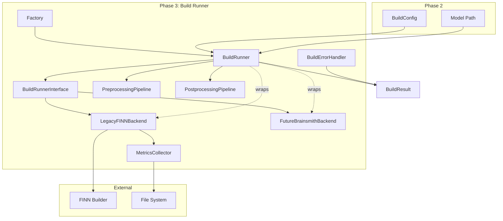

### Component Relationships

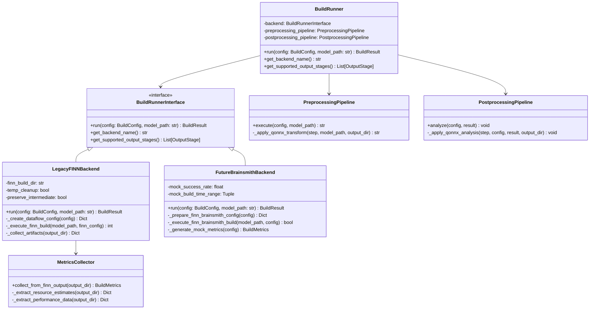

## Core Components

### 0. BuildRunner (NEW - Orchestrator)

The central orchestrator that manages the complete build lifecycle, introduced to separate preprocessing and postprocessing from backend implementations.

```python
class BuildRunner:
    """
    Orchestrator that manages the complete build lifecycle.
    
    Key Benefits:
    - Separates preprocessing/postprocessing from backend implementations
    - Provides consistent behavior across all backends
    - Simplifies backend implementations
    - Improves testability and maintainability
    """
    
    def __init__(self, backend: BuildRunnerInterface):
        self.backend = backend
        self.preprocessing_pipeline = PreprocessingPipeline()
        self.postprocessing_pipeline = PostprocessingPipeline()
    
    def run(self, config: BuildConfig, model_path: str) -> BuildResult:
        """Execute complete build lifecycle."""
        # 1. Preprocessing
        processed_model_path = self.preprocessing_pipeline.execute(config, model_path)
        
        # 2. Backend execution with preprocessed model
        result = self.backend.run(config, processed_model_path)
        
        # 3. Postprocessing (only if successful)
        if result.is_successful():
            self.postprocessing_pipeline.analyze(config, result)
            
        return result
```

### 1. BuildRunnerInterface

The abstract interface that all backends must implement.

```python
class BuildRunnerInterface(ABC):
    """
    Abstract interface for build execution backends.
    
    Responsibilities:
    - Define contract for build execution
    - Declare backend capabilities
    - Ensure consistent result format
    """
    
    @abstractmethod
    def run(self, config: BuildConfig, model_path: str) -> BuildResult:
        """Execute build with preprocessed model and return results."""
        pass
        
    @abstractmethod
    def get_backend_name(self) -> str:
        """Return human-readable backend name."""
        pass
        
    @abstractmethod
    def get_supported_output_stages(self) -> List[OutputStage]:
        """Return list of supported output stages."""
        pass
```

### 2. Data Structures

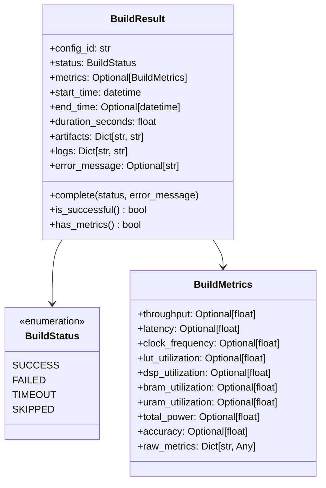

## Data Flow

### Build Execution Lifecycle

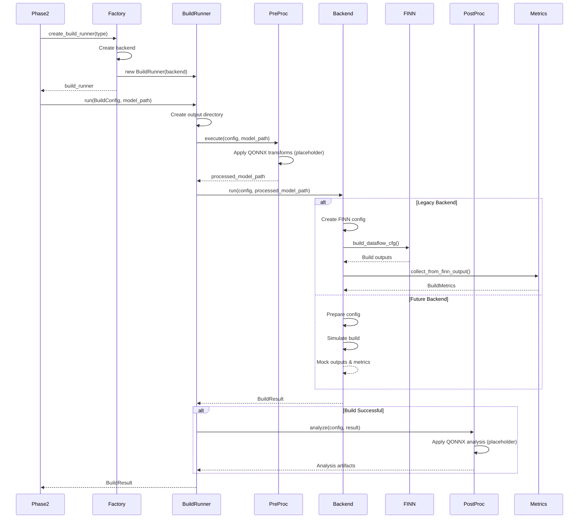

### Error Handling Flow

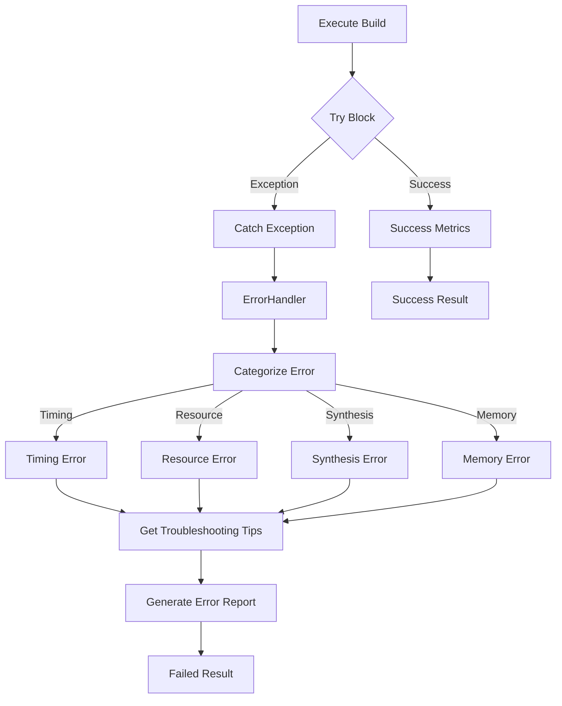

## Backend System

### Legacy FINN Backend

Integrates with existing FINN builder infrastructure using explicit build steps.

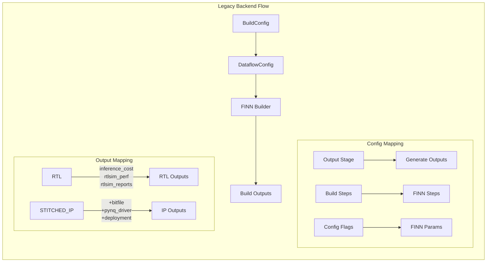

**Key Features:**
- Maps BuildConfig to FINN DataflowBuildConfig format
- Manages FINN_BUILD_DIR environment variable
- Collects artifacts from known FINN output locations
- Handles cleanup of temporary files

### Future FINN-Brainsmith Backend (Stub)

Robust stub implementation for future direct integration.

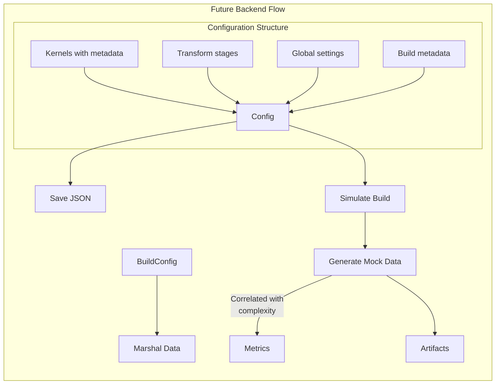

**Key Features:**
- Marshals kernels and transforms for future API
- Generates realistic mock metrics based on complexity
- Saves configuration for interface development
- Configurable success rate for testing

## Pipeline System

### Preprocessing Pipeline

Shared preprocessing steps applied before build execution. The pipeline provides simple handling logic that expects QONNX transforms and uses placeholder implementations.

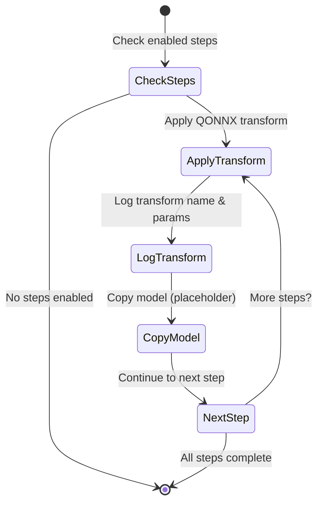

### Postprocessing Pipeline

Analysis steps applied after build completion. The pipeline provides simple handling logic that expects QONNX analysis transforms and uses placeholder implementations.

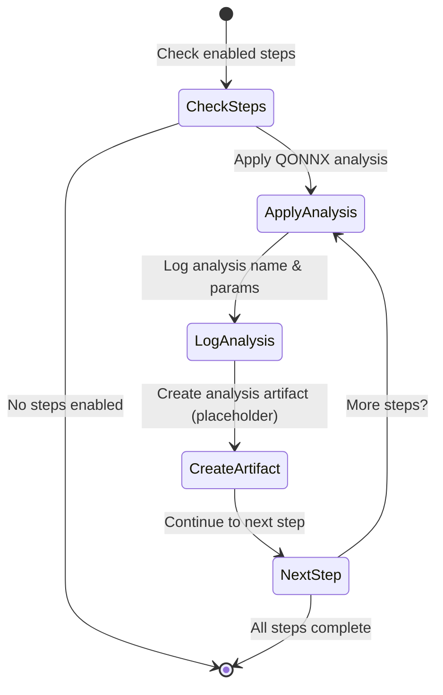

## Metrics and Error Handling

### Metrics Collection

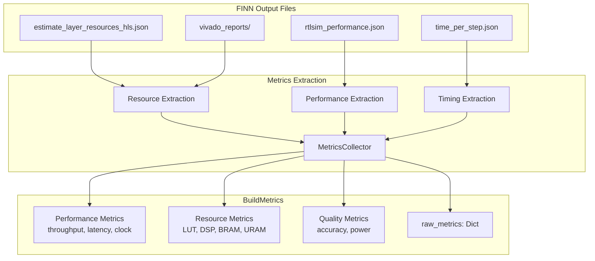

### Error Categorization

```python
ERROR_CATEGORIES = {
    "timing": {
        "patterns": ["timing", "clock", "constraint", "slack"],
        "tips": [
            "Reduce clock frequency",
            "Increase folding factors",
            "Enable retiming optimizations"
        ]
    },
    "resource": {
        "patterns": ["utilization", "exceeded", "insufficient"],
        "tips": [
            "Increase folding to reduce parallelism",
            "Use different kernel implementations",
            "Target larger FPGA device"
        ]
    },
    "synthesis": {
        "patterns": ["synthesis", "vivado", "error"],
        "tips": [
            "Check RTL syntax",
            "Verify all IP cores are available",
            "Check license availability"
        ]
    }
}
```

## Integration Points

### Phase 2 Integration

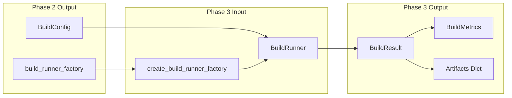

### FINN Integration

Phase 3 provides two integration paths:

```python
# Legacy Integration
class LegacyFINNBackend:
    def _create_dataflow_config(self, config: BuildConfig) -> Dict:
        """Convert to FINN DataflowBuildConfig format."""
        return {
            "output_dir": config.output_dir,
            "synth_clk_period_ns": config.config_flags.get("clock_period_ns", 10.0),
            "board": config.config_flags.get("board", "Pynq-Z1"),
            "steps": config.build_steps,
            "generate_outputs": self._map_output_stage(config.global_config.output_stage)
        }

# Future Integration (Stub)
class FutureBrainsmithBackend:
    def _prepare_finn_brainsmith_config(self, config: BuildConfig) -> Dict:
        """Marshal data for future FINN-Brainsmith API."""
        return {
            "kernels": [
                {
                    "name": kernel[0],
                    "parameters": kernel[1],
                    "metadata": {"index": i, "type": "hw_kernel"}
                }
                for i, kernel in enumerate(config.kernels)
            ],
            "transform_stages": config.transforms,
            "output_stage": config.global_config.output_stage.value,
            # ... additional configuration
        }
```

## Design Rationale

### 1. Dual Backend Architecture
- **Legacy Support**: Maintains compatibility with existing FINN infrastructure
- **Future Ready**: Stub implementation allows interface development without breaking changes
- **Clean Abstraction**: Interface ensures backends are interchangeable

### 2. Simplified Pipeline System
- **QONNX Transform Focused**: Pipelines expect QONNX transforms and provide handling logic
- **Placeholder Implementation**: Simple placeholder transforms for development and testing
- **Consistency**: Same pipeline execution regardless of backend
- **Modularity**: Each step is independent and optional
- **Future Ready**: Framework ready for real QONNX transform implementations

### 3. Comprehensive Metrics
- **Standardization**: All backends produce same metric structure
- **Flexibility**: Optional fields handle backend differences
- **Raw Data**: Preserves original metrics for debugging

### 4. Error Categorization
- **Actionable**: Each category has specific troubleshooting tips
- **Pattern-Based**: Automatic categorization from error messages
- **Detailed Reports**: Include configuration context for debugging

### 5. Factory Pattern
- **Late Binding**: Backend selection at runtime
- **Clean API**: Phase 2 doesn't need backend details
- **Testability**: Easy to inject mock backends

### 6. Robust Stub Implementation
- **Interface Development**: Allows API design without implementation
- **Realistic Testing**: Mock data correlates with complexity
- **Configuration Capture**: Saves all data for future use

## Performance Considerations

### 1. Resource Management
- Temporary file cleanup after builds
- Streaming file parsing for large outputs
- Lazy artifact collection

### 2. Scalability
- O(1) memory per build configuration
- Independent build execution
- No shared state between builds

### 3. Optimization Opportunities
- Parallel preprocessing steps
- Cached preprocessing results
- Incremental metrics extraction

## Output Structure

Phase 3 creates organized outputs within its assigned directory:

```
{config_output_dir}/                      # From BuildConfig.output_dir
├── preprocessing/                        # Preprocessing outputs
│   ├── graph_optimization.onnx
│   ├── input_normalization.onnx
│   └── quantize_model.onnx
├── finn_config.json                      # Backend configuration
├── finn_brainsmith_config.json          # Future backend config
├── build_dataflow.log                   # Build logs
├── report/                              # FINN reports
│   ├── estimate_layer_resources_hls.json
│   └── rtlsim_performance.json
├── postprocessing/                      # Analysis results
│   ├── performance_analysis.json
│   ├── resource_analysis.json
│   └── accuracy_validation.json
└── artifacts/                           # Build artifacts
    ├── stitched_ip/
    ├── rtl/
    └── deployment/
```

## Summary

Phase 3 provides a robust, extensible build execution system that:
- ✅ Executes builds through multiple backend implementations
- ✅ Applies consistent preprocessing and postprocessing
- ✅ Collects standardized metrics from diverse sources
- ✅ Handles errors with detailed categorization and tips
- ✅ Supports current FINN and future direct integration
- ✅ Integrates cleanly with Phase 2's exploration engine

The design prioritizes flexibility, maintainability, and future extensibility while providing immediate value through the legacy FINN integration and comprehensive testing support through the stub implementation.