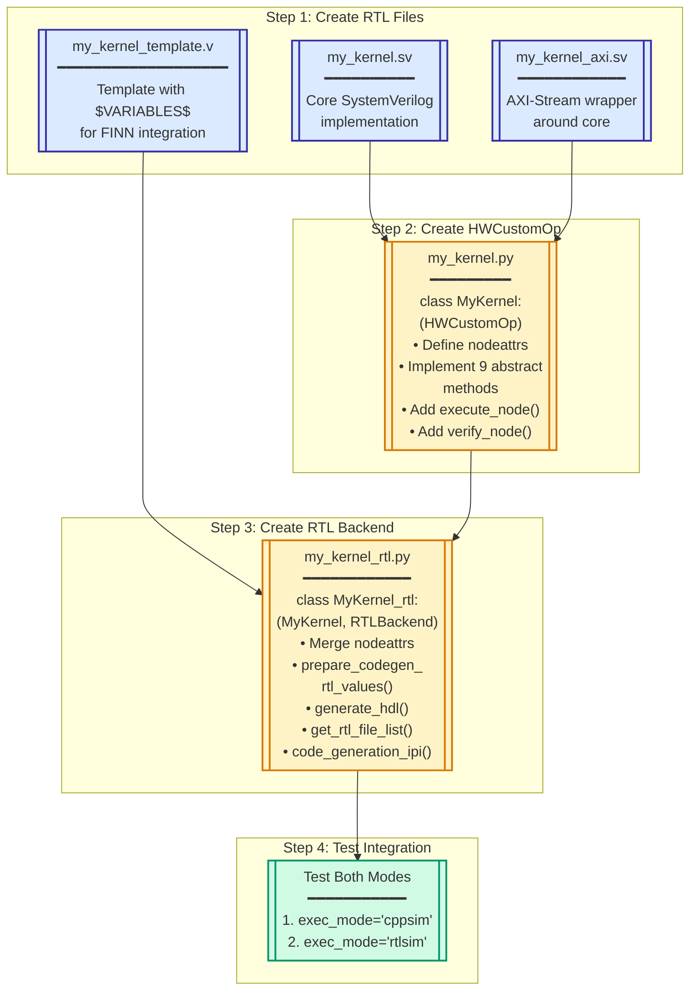
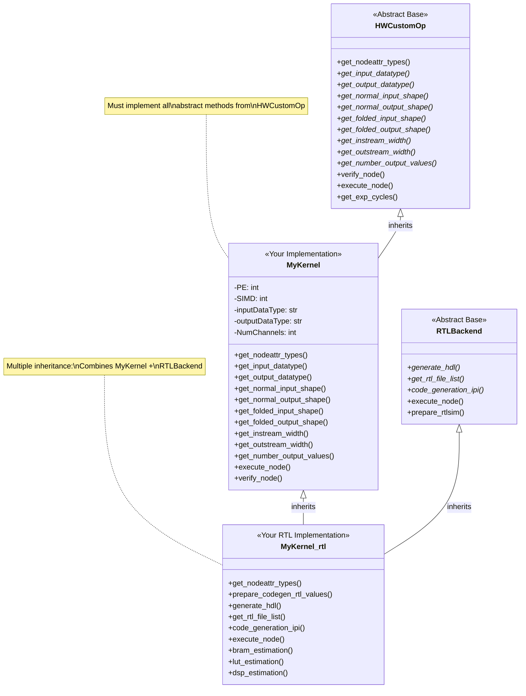
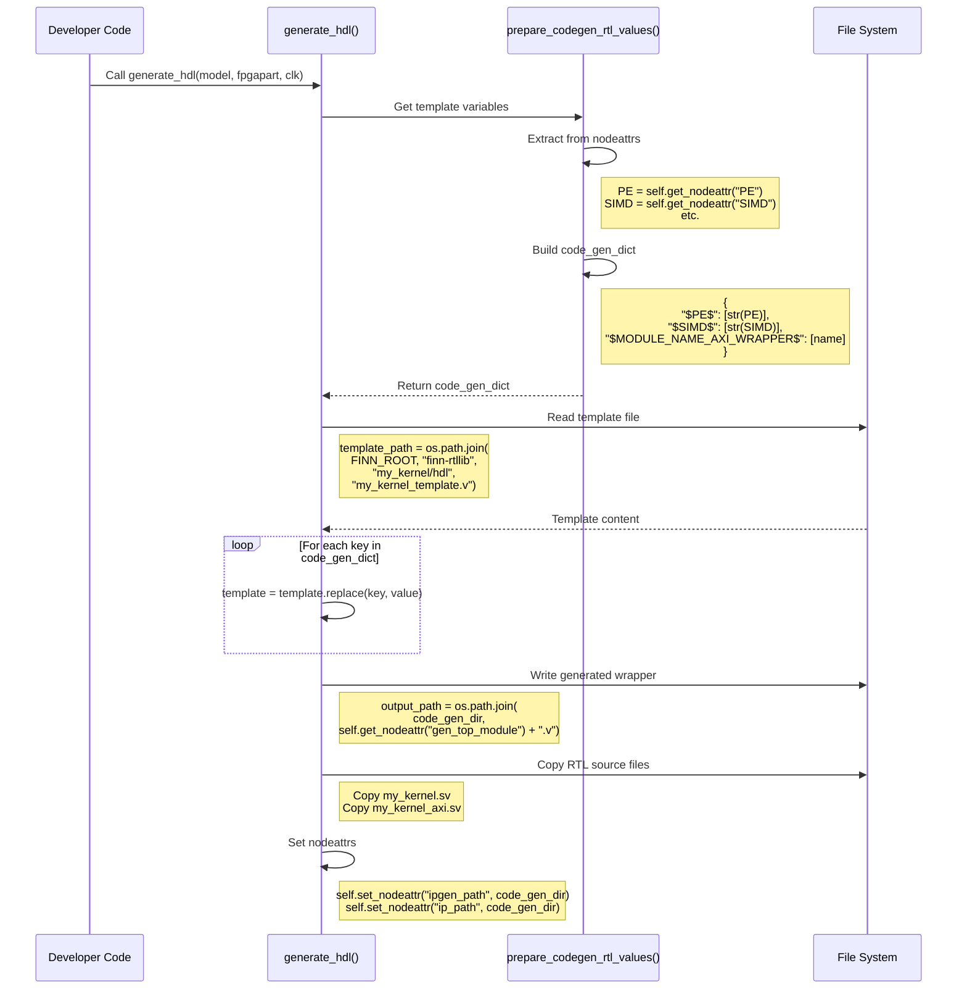
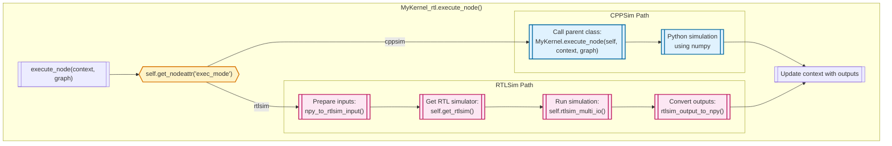
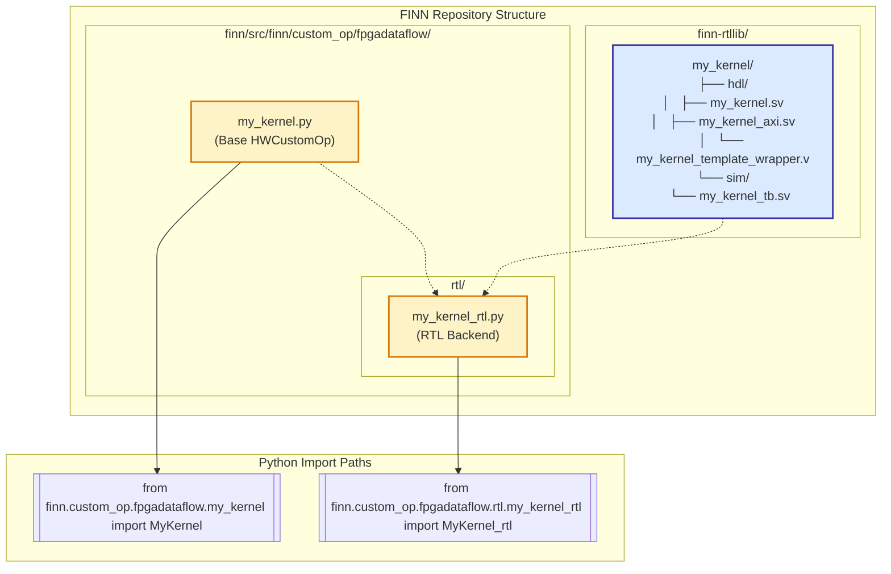

# FINN Manual RTL Integration Guide (Without Kernel Integrator)

## Overview

This guide shows how to manually integrate RTL kernels into FINN by creating the necessary Python files yourself, without using the Kernel Integrator automation.

## ASCII Art: Manual Integration File Structure

```
MANUAL FINN RTL INTEGRATION - FILE REQUIREMENTS
═══════════════════════════════════════════════

DEVELOPER MUST CREATE ALL FILES:
────────────────────────────────

┌─── RTL Source Files ─────────────────────────────────────────────────┐
│                                                                       │
│  finn-rtllib/my_kernel/hdl/                                          │
│  ├── my_kernel.sv              # Core RTL logic                      │
│  ├── my_kernel_axi.sv          # AXI wrapper                         │
│  └── my_kernel_template_wrapper.v  # Template with $VARIABLES$       │
│                                                                       │
└───────────────────────────────────────────────────────────────────────┘
                                 +
┌─── Python Integration Files ─────────────────────────────────────────┐
│                                                                       │
│  finn/src/finn/custom_op/fpgadataflow/                              │
│  ├── my_kernel.py              # Base HWCustomOp implementation      │
│  │   └── class MyKernel(HWCustomOp):                                │
│  │       ├── get_nodeattr_types()     # Define all attributes       │
│  │       ├── get_input_datatype()     # Return FINN DataType        │
│  │       ├── get_output_datatype()    # Return FINN DataType        │
│  │       ├── get_normal_input_shape() # Unfolded shape              │
│  │       ├── get_normal_output_shape()# Unfolded shape              │
│  │       ├── get_folded_input_shape() # With parallelization        │
│  │       ├── get_folded_output_shape()# With parallelization        │
│  │       ├── get_instream_width()     # Bits per cycle              │
│  │       ├── get_outstream_width()    # Bits per cycle              │
│  │       ├── get_number_output_values() # Total outputs             │
│  │       ├── execute_node()           # Python simulation           │
│  │       ├── verify_node()            # Validation                  │
│  │       └── get_exp_cycles()         # Performance estimate        │
│  │                                                                   │
│  └── rtl/my_kernel_rtl.py      # RTL backend implementation         │
│      └── class MyKernel_rtl(MyKernel, RTLBackend):                 │
│          ├── get_nodeattr_types()     # Merge parent attrs          │
│          ├── prepare_codegen_rtl_values() # Create template dict    │
│          ├── generate_hdl()           # Process templates           │
│          ├── get_rtl_file_list()      # Return all RTL files       │
│          ├── code_generation_ipi()    # TCL for Vivado              │
│          ├── execute_node()           # cppsim/rtlsim routing      │
│          ├── bram_estimation()        # Resource estimates          │
│          ├── lut_estimation()         # Resource estimates          │
│          └── dsp_estimation()         # Resource estimates          │
│                                                                       │
└───────────────────────────────────────────────────────────────────────┘

INHERITANCE STRUCTURE:
═════════════════════

    CustomOp (QONNX)
         │
         └──> HWCustomOp (FINN Abstract Base)
                  │
                  └──> MyKernel (Your Base Implementation)
                           │
                           └──> MyKernel_rtl (Your RTL Implementation)
                                     │
                                     └──> Also inherits from RTLBackend

KEY IMPLEMENTATION PATTERNS:
════════════════════════════

1. Nodeattr Definition:
   my_attrs = {
       "PE": ("i", True, 0),              # Processing elements
       "SIMD": ("i", True, 0),            # Input parallelism
       "inputDataType": ("s", True, ""),  # FINN DataType string
       "outputDataType": ("s", True, ""), # FINN DataType string
       "NumChannels": ("i", True, 0),     # Total channels
   }

2. Template Variable Mapping:
   code_gen_dict = {
       "$MODULE_NAME_AXI_WRAPPER$": [self.get_verilog_top_module_name()],
       "$PE$": [str(self.get_nodeattr("PE"))],
       "$SIMD$": [str(self.get_nodeattr("SIMD"))],
       "$ACTIVATION_WIDTH$": [str(idt.bitwidth())],
   }

3. File List Pattern:
   return [
       rtllib_dir + "my_kernel.sv",
       rtllib_dir + "my_kernel_axi.sv", 
       code_gen_dir + self.get_nodeattr("gen_top_module") + ".v"
   ]
```

## Mermaid Diagrams

### 1. Manual Integration Workflow



### 2. Class Implementation Details



### 3. Template Processing Implementation



### 4. Execution Mode Routing



### 5. Required Method Implementation Guide

```mermaid
%%{init: {'theme':'default'}}%%
flowchart LR
    accTitle: FINN Required Method Implementation
    accDescr: What each abstract method should return

    subgraph Shape["Shape Methods"]
        direction TB
        NIS[["get_normal_input_shape()<br/>━━━━━━━━━━━━━━━<br/>Return: (N, C, H, W)<br/>Example: (1, 128, 32, 32)"]]
        NOS[["get_normal_output_shape()<br/>━━━━━━━━━━━━━━━━<br/>Return: (N, C', H', W')<br/>Example: (1, 256, 32, 32)"]]
        FIS[["get_folded_input_shape()<br/>━━━━━━━━━━━━━━━━<br/>Fold by SIMD:<br/>(N, C//SIMD, H, W, SIMD)<br/>Example: (1, 16, 32, 32, 8)"]]
        FOS[["get_folded_output_shape()<br/>━━━━━━━━━━━━━━━━━<br/>Fold by PE:<br/>(N, C'//PE, H', W', PE)<br/>Example: (1, 16, 32, 32, 16)"]]
    end

    subgraph DataType["DataType Methods"]
        direction TB
        IDT[["get_input_datatype()<br/>━━━━━━━━━━━━━<br/>Return: DataType object<br/>Example: DataType['INT8']"]]
        ODT[["get_output_datatype()<br/>━━━━━━━━━━━━━━<br/>Return: DataType object<br/>Example: DataType['INT16']"]]
    end

    subgraph Stream["Stream Methods"]
        direction TB
        ISW[["get_instream_width()<br/>━━━━━━━━━━━━━<br/>Return: SIMD * input_bits<br/>Example: 8 * 8 = 64"]]
        OSW[["get_outstream_width()<br/>━━━━━━━━━━━━━━<br/>Return: PE * output_bits<br/>Example: 16 * 16 = 256"]]
    end

    subgraph Other["Other Methods"]
        NOV[["get_number_output_values()<br/>━━━━━━━━━━━━━━━━━━<br/>Return: Total outputs<br/>np.prod(output_shape)"]]
    end

    Shape -.-> DataType
    DataType -.-> Stream
    Stream -.-> Other
```



### 6. File Organization Pattern



## Implementation Examples

### Example 1: Base HWCustomOp Implementation

```python
# my_kernel.py
from finn.custom_op.fpgadataflow.hwcustomop import HWCustomOp
from qonnx.core.datatype import DataType
import numpy as np

class MyKernel(HWCustomOp):
    def __init__(self, onnx_node, **kwargs):
        super().__init__(onnx_node, **kwargs)
    
    def get_nodeattr_types(self):
        my_attrs = {
            "PE": ("i", True, 0),
            "SIMD": ("i", True, 0),
            "NumChannels": ("i", True, 0),
            "inputDataType": ("s", True, ""),
            "outputDataType": ("s", True, ""),
        }
        my_attrs.update(super().get_nodeattr_types())
        return my_attrs
    
    def get_input_datatype(self, ind=0):
        return DataType[self.get_nodeattr("inputDataType")]
    
    def get_output_datatype(self, ind=0):
        return DataType[self.get_nodeattr("outputDataType")]
    
    def get_normal_input_shape(self, ind=0):
        channels = self.get_nodeattr("NumChannels")
        return (1, channels, 1, 1)  # Example shape
    
    def get_normal_output_shape(self, ind=0):
        channels = self.get_nodeattr("NumChannels")
        return (1, channels, 1, 1)  # Example shape
    
    def get_folded_input_shape(self, ind=0):
        normal = self.get_normal_input_shape()
        simd = self.get_nodeattr("SIMD")
        # Fold last dimension by SIMD
        return (normal[0], normal[1]//simd, normal[2], normal[3], simd)
    
    def get_folded_output_shape(self, ind=0):
        normal = self.get_normal_output_shape()
        pe = self.get_nodeattr("PE")
        # Fold channel dimension by PE
        return (normal[0], normal[1]//pe, normal[2], normal[3], pe)
    
    def get_instream_width(self, ind=0):
        simd = self.get_nodeattr("SIMD")
        idt = self.get_input_datatype()
        return simd * idt.bitwidth()
    
    def get_outstream_width(self, ind=0):
        pe = self.get_nodeattr("PE")
        odt = self.get_output_datatype()
        return pe * odt.bitwidth()
    
    def get_number_output_values(self):
        return np.prod(self.get_normal_output_shape())
    
    def execute_node(self, context, graph):
        # Python simulation implementation
        pass
```

### Example 2: RTL Backend Implementation

```python
# rtl/my_kernel_rtl.py
from finn.custom_op.fpgadataflow.rtlbackend import RTLBackend
from finn.custom_op.fpgadataflow.my_kernel import MyKernel
import os

class MyKernel_rtl(MyKernel, RTLBackend):
    def __init__(self, onnx_node, **kwargs):
        super().__init__(onnx_node, **kwargs)
    
    def get_nodeattr_types(self):
        my_attrs = {}
        my_attrs.update(MyKernel.get_nodeattr_types(self))
        my_attrs.update(RTLBackend.get_nodeattr_types(self))
        return my_attrs
    
    def prepare_codegen_rtl_values(self, model):
        code_gen_dict = {}
        
        # Get parameters
        pe = self.get_nodeattr("PE")
        simd = self.get_nodeattr("SIMD")
        idt = self.get_input_datatype()
        odt = self.get_output_datatype()
        
        # Create template mappings
        code_gen_dict["$MODULE_NAME_AXI_WRAPPER$"] = [self.get_verilog_top_module_name()]
        code_gen_dict["$PE$"] = [str(pe)]
        code_gen_dict["$SIMD$"] = [str(simd)]
        code_gen_dict["$ACTIVATION_WIDTH$"] = [str(idt.bitwidth())]
        code_gen_dict["$OUTPUT_WIDTH$"] = [str(odt.bitwidth())]
        
        return code_gen_dict
    
    def generate_hdl(self, model, fpgapart, clk):
        # Get template variables
        code_gen_dict = self.prepare_codegen_rtl_values(model)
        code_gen_dir = self.get_nodeattr("code_gen_dir_ipgen")
        
        # Read template
        template_path = os.path.join(
            os.environ["FINN_ROOT"],
            "finn-rtllib/my_kernel/hdl/my_kernel_template_wrapper.v"
        )
        with open(template_path, "r") as f:
            template = f.read()
        
        # Replace variables
        for key, value in code_gen_dict.items():
            template = template.replace(key, "\n".join(value))
        
        # Write generated file
        gen_file = os.path.join(
            code_gen_dir,
            self.get_verilog_top_module_name() + ".v"
        )
        with open(gen_file, "w") as f:
            f.write(template)
        
        # Copy source files
        rtl_dir = os.path.join(os.environ["FINN_ROOT"], "finn-rtllib/my_kernel/hdl/")
        for f in ["my_kernel.sv", "my_kernel_axi.sv"]:
            shutil.copy(os.path.join(rtl_dir, f), code_gen_dir)
        
        # Set attributes
        self.set_nodeattr("gen_top_module", code_gen_dict["$MODULE_NAME_AXI_WRAPPER$"][0])
        self.set_nodeattr("ipgen_path", code_gen_dir)
        self.set_nodeattr("ip_path", code_gen_dir)
    
    def get_rtl_file_list(self, abspath=False):
        if abspath:
            code_gen_dir = self.get_nodeattr("code_gen_dir_ipgen") + "/"
            rtllib_dir = os.path.join(os.environ["FINN_ROOT"], "finn-rtllib/my_kernel/hdl/")
        else:
            code_gen_dir = ""
            rtllib_dir = ""
        
        return [
            rtllib_dir + "my_kernel.sv",
            rtllib_dir + "my_kernel_axi.sv",
            code_gen_dir + self.get_nodeattr("gen_top_module") + ".v"
        ]
    
    def code_generation_ipi(self):
        # Generate TCL commands for Vivado
        cmd = []
        for f in self.get_rtl_file_list(abspath=True):
            cmd.append(f"add_files -norecurse {f}")
        
        top = self.get_verilog_top_module_name()
        cmd.append(f"create_bd_cell -type module -reference {top} {top}_0")
        
        return cmd
    
    def execute_node(self, context, graph):
        mode = self.get_nodeattr("exec_mode")
        if mode == "cppsim":
            # Delegate to parent class
            MyKernel.execute_node(self, context, graph)
        elif mode == "rtlsim":
            # Use RTLBackend's rtlsim implementation
            RTLBackend.execute_node(self, context, graph)
```

## Lines of Code Reality Check

To understand the manual integration burden, here's the actual code required for three FINN kernels:

| Kernel | Python Code | RTL Code | Total LOC | Complexity |
|--------|-------------|----------|-----------|------------|
| **Thresholding** | 645 lines | 587 lines | **1,232 lines** | Binary search through threshold values |
| **FMPadding** | 270 lines | 483 lines | **753 lines** | Data movement and buffering |

### Breakdown by Component

| Component | MVAU | Thresholding | FMPadding |
|-----------|------|--------------|-----------|
| HWCustomOp base class | 796 | 193 | 106 |
| RTLBackend implementation | 269 | 388 | 132 |
| Infer transform | 233 | 64 | 32 |
| SystemVerilog RTL | 3,086 | 587 | 483 |

## Thresholding Deep Dive: Where Do 1,232 Lines Go?

### Component-Level Analysis

| Component | File | Lines of Code | Purpose |
|-----------|------|---------------|---------|
| **Python: HWCustomOp Base** | `thresholding.py` | 193 | Base class with core logic |
| **Python: RTL Backend** | `thresholding_rtl.py` | 388 | RTL generation & integration |
| **Python: Infer Transform** | `convert_to_hw_layers.py` | 64 | ONNX → FINN conversion |
| **Python Total** | | **645** | |
| **RTL: Core Logic** | `thresholding.sv` | 252 | Binary search implementation |
| **RTL: AXI Wrapper** | `thresholding_axi.sv` | 122 | AXI-Stream + AXI-Lite interface |
| **RTL: AXI-Lite Interface** | `axilite_if.v` | 146 | Configuration interface module |
| **RTL: Template** | `thresholding_template_wrapper.v` | 67 | Wrapper with $VARIABLES$ |
| **RTL Total** | | **587** | |
| **Grand Total** | | **1,232** | |

### Method-Level Breakdown (Python)

| Class | Key Methods | Approx. Lines | Complexity |
|-------|-------------|---------------|------------|
| **Thresholding** | `get_nodeattr_types()` | 15 | Define attributes |
| | `make_shape_compatible_op()` | 20 | Shape operations |
| | `infer_node_datatype()` | 25 | Type inference |
| | `get_folded_*_shape()` | 30 | Folding calculations |
| | `generate_params()` | 35 | Threshold generation |
| | `execute_node()` | 40 | Python simulation |
| **Thresholding_rtl** | `prepare_codegen_rtl_values()` | 120 | Template variable prep |
| | `generate_hdl()` | 35 | Template processing |
| | `get_pe_mem_geometries()` | 30 | Memory estimation |
| | `execute_node()` | 85 | Dual-mode execution |
| | `get_rtl_file_list()` | 15 | File management |

### What Each Component Does

| Component | Responsibility | Why It's Needed |
|-----------|----------------|-----------------|
| **Base HWCustomOp** | Shape inference, folding, datatypes | FINN graph integration |
| **RTL Backend** | HDL generation, template processing | Synthesis flow |
| **Infer Transform** | ONNX MultiThreshold → FINN node | Import path |
| **Core RTL** | Actual threshold comparison logic | Hardware implementation |
| **AXI Wrapper** | Protocol adapters | FINN interface standards |
| **Template** | Parameterizable wrapper | Instance-specific generation |

### Manual Integration Burden

| Task | Lines to Write | Complexity | Error-Prone? |
|------|----------------|------------|--------------|
| Shape calculations | ~50 | High (folding math) | Very |
| Template variables | ~120 | Medium (string mapping) | Yes |
| Dual execution modes | ~85 | High (two code paths) | Yes |
| File organization | ~15 | Low (but easy to mess up) | Yes |
| Method contracts | ~200 | High (must match base class) | Very |
| **Total Manual Work** | **470+ lines** | **Complex & interconnected** | **Extremely** |

### With Kernel Integrator

| Task | What You Do | What KI Does |
|------|-------------|--------------|
| RTL implementation | Write 252 lines of SystemVerilog | - |
| Integration | Add ~15 pragma annotations | Generate 980 lines |
| Testing | Verify functionality | Ensure FINN compliance |
| Maintenance | Update RTL/pragmas | Regenerate everything |
| **Total Work** | **~267 lines + pragmas** | **965 lines generated** |

### Key Insights

1. **Even "simple" operations are complex**: FMPadding (just adding zeros!) requires 753 lines
2. **Python/RTL split varies**: 30-52% Python depending on computational complexity
3. **Manual integration means writing 1000+ lines** for any non-trivial operation
4. **Every line must be kept in sync** when RTL parameters change

## Summary

Manual FINN RTL integration requires creating:

1. **RTL files** in `finn-rtllib/` following FINN conventions
2. **Base HWCustomOp class** implementing all abstract methods
3. **RTL backend class** with multiple inheritance and template processing

The key is understanding FINN's inheritance structure and implementing all required methods correctly. This manual approach gives you full control but requires deep understanding of FINN's architecture.