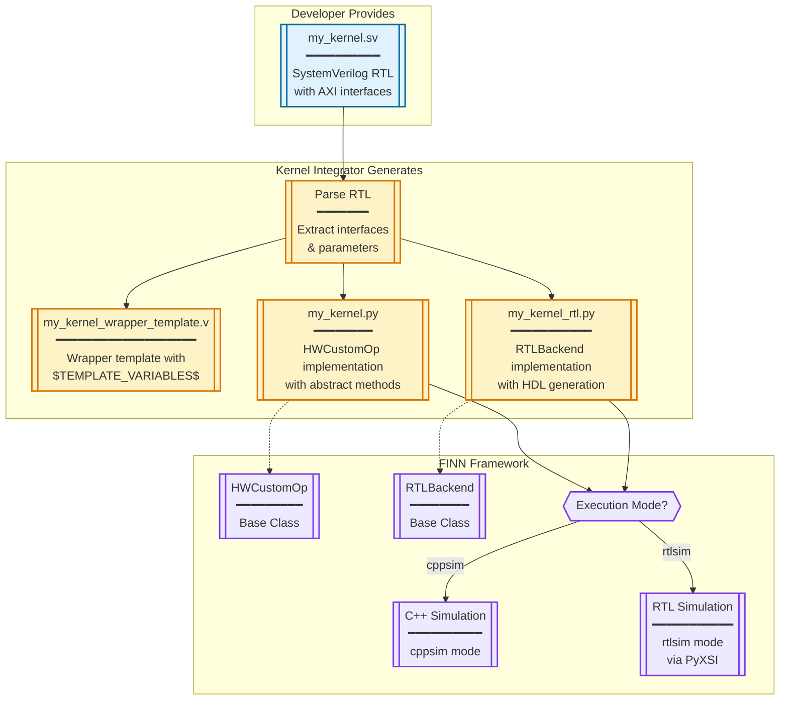
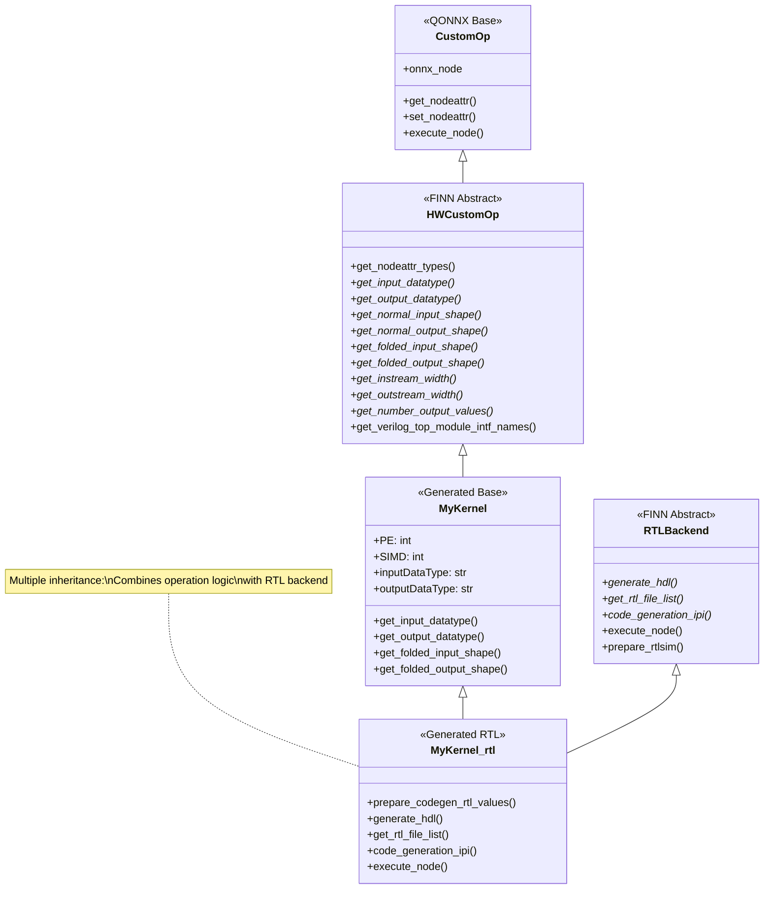
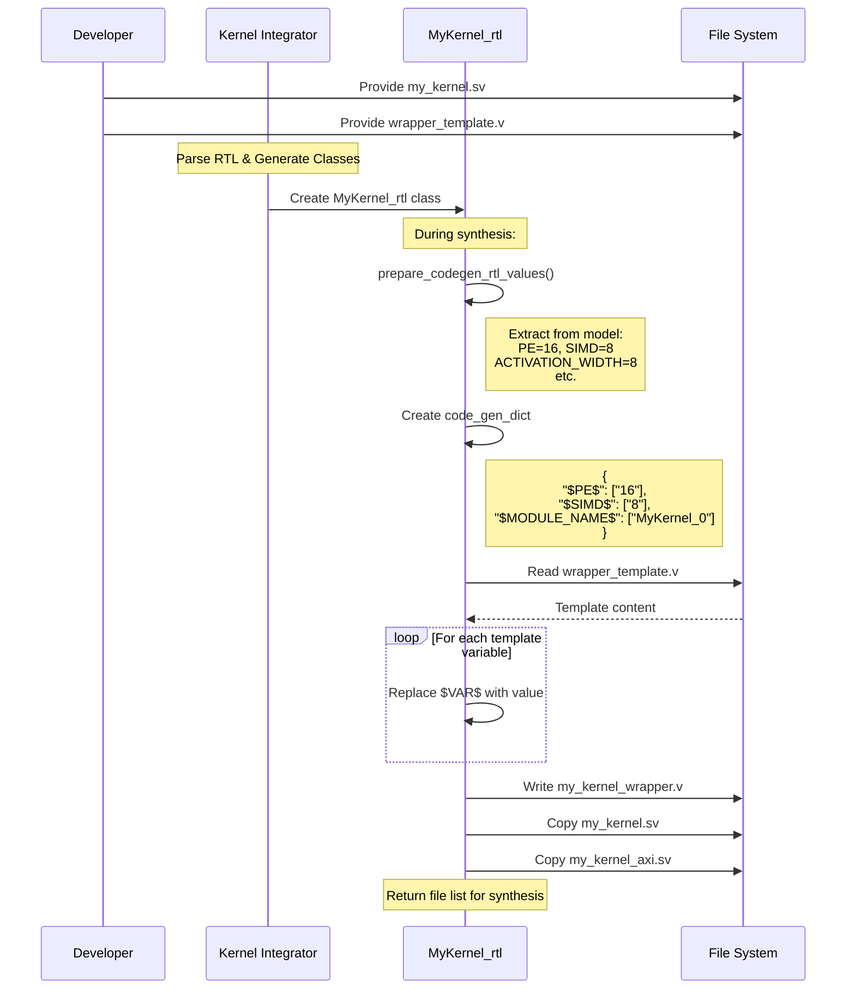
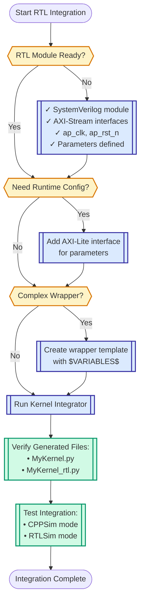

# FINN RTL Integration Developer Guide - Visual Reference

## ASCII Art: FINN RTL Integration File Structure

```
FINN RTL KERNEL INTEGRATION - DEVELOPER FILE REQUIREMENTS
═══════════════════════════════════════════════════════

┌─────────────────────────────────────────────────────────────────────┐
│                        DEVELOPER PROVIDES                             │
├─────────────────────────────────────────────────────────────────────┤
│                                                                       │
│  SystemVerilog RTL Module                                            │
│  └── my_kernel.sv                                                    │
│      ├── AXI-Stream interfaces (s_axis_*, m_axis_*)                 │
│      ├── Optional AXI-Lite (s_axilite_*)                            │
│      └── Standard control (ap_clk, ap_rst_n)                        │
│                                                                       │
└─────────────────────────────────────────────────────────────────────┘
                                 │
                                 ▼
┌─────────────────────────────────────────────────────────────────────┐
│                      FINN GENERATES (via KI)                          │
├─────────────────────────────────────────────────────────────────────┤
│                                                                       │
│  1. Wrapper Template                                                  │
│     └── my_kernel_wrapper_template.v                                 │
│         └── Contains $TEMPLATE_VARIABLES$                            │
│                                                                       │
│  2. HWCustomOp Implementation                                         │
│     └── MyKernel_HWCustomOp.py                                      │
│         ├── class MyKernel(HWCustomOp)                              │
│         ├── get_nodeattr_types()                                     │
│         ├── get_input_datatype()                                     │
│         ├── get_output_datatype()                                    │
│         ├── get_normal_*_shape()                                     │
│         ├── get_folded_*_shape()                                     │
│         ├── get_*stream_width()                                      │
│         └── execute_node() → cppsim                                 │
│                                                                       │
│  3. RTLBackend Implementation                                         │
│     └── MyKernel_rtl.py                                             │
│         ├── class MyKernel_rtl(MyKernel, RTLBackend)               │
│         ├── prepare_codegen_rtl_values()                            │
│         ├── generate_hdl()                                          │
│         ├── get_rtl_file_list()                                     │
│         ├── code_generation_ipi()                                   │
│         └── execute_node() → rtlsim                                 │
│                                                                       │
│  4. Generated Wrapper (at synthesis time)                            │
│     └── my_kernel_wrapper.v                                         │
│         └── Template with substituted values                        │
│                                                                       │
└─────────────────────────────────────────────────────────────────────┘

FILE ORGANIZATION IN FINN PROJECT:
══════════════════════════════════

finn-rtllib/                          finn/src/finn/custom_op/
├── my_kernel/                        └── fpgadataflow/
│   ├── hdl/                              ├── my_kernel.py (base)
│   │   ├── my_kernel.sv                  └── rtl/
│   │   ├── my_kernel_axi.sv                  └── my_kernel_rtl.py
│   │   └── my_kernel_wrapper_template.v
│   └── sim/
│       └── my_kernel_tb.sv

TEMPLATE VARIABLE MAPPING:
═════════════════════════

RTL Parameters          →  Template Variables      →  FINN Nodeattrs
──────────────────────────────────────────────────────────────────
parameter PE = 16       →  $PE$                   →  "PE": ("i", True, 0)
parameter SIMD = 8      →  $SIMD$                 →  "SIMD": ("i", True, 0)
parameter WIDTH = 8     →  $ACTIVATION_WIDTH$     →  "inputDataType": ("s", True, "")
parameter DEPTH = 1024  →  $DEPTH$                →  "depth": ("i", False, 32)
```

## Mermaid Diagrams

### 1. Overall Integration Flow



### 2. File Generation Detail

```mermaid
%%{init: {'theme':'default'}}%%
flowchart LR
    accTitle: FINN RTL File Generation
    accDescr: Detailed view of which files are created and their relationships

    subgraph Input["Input Files"]
        direction TB
        SV[["my_kernel.sv<br/>━━━━━━━━━━━<br/>module my_kernel #(<br/>  parameter PE = 16,<br/>  parameter SIMD = 8<br/>)(<br/>  input s_axis_tdata,<br/>  output m_axis_tdata<br/>);"]]
        
        TPL[["wrapper_template.v<br/>━━━━━━━━━━━<br/>module $MODULE_NAME$ #(<br/>  parameter PE = $PE$,<br/>  parameter SIMD = $SIMD$<br/>)(...)"]]
    end

    subgraph Generated["Generated Python Classes"]
        direction TB
        HW[["MyKernel(HWCustomOp)<br/>━━━━━━━━━━━━━━<br/>• get_nodeattr_types()<br/>• get_input_datatype()<br/>• get_output_datatype()<br/>• get_folded_shapes()<br/>• execute_node()"]]
        
        RTL[["MyKernel_rtl(MyKernel, RTLBackend)<br/>━━━━━━━━━━━━━━━━━━━━<br/>• prepare_codegen_rtl_values()<br/>• generate_hdl()<br/>• get_rtl_file_list()<br/>• code_generation_ipi()"]]
    end

    subgraph Runtime["Runtime Generated"]
        VWrapper[["my_kernel_wrapper.v<br/>━━━━━━━━━━━<br/>module MyKernel_0 #(<br/>  parameter PE = 16,<br/>  parameter SIMD = 8<br/>)(...)"]]
    end

    SV --> HW
    SV --> RTL
    TPL --> RTL
    RTL -->|generate_hdl()| VWrapper

    classDef input fill:#dbeafe,stroke:#3730a3,stroke-width:2px
    classDef gen fill:#fef3c7,stroke:#d97706,stroke-width:2px
    classDef runtime fill:#d1fae5,stroke:#059669,stroke-width:2px
    
    class SV,TPL input
    class HW,RTL gen
    class VWrapper runtime
```

### 3. Class Inheritance Structure



### 4. Template Processing Flow



### 5. Developer Checklist



## The Impedance Mismatch Problem

### Three Worlds That Must Communicate

| RTL World | FINN World | ML World |
|:---:|:---:|:---:|
| Wires & bits | Streams & folding | Tensors & graphs |
| Clock cycles | PE/SIMD params | Layers & batches |
| `logic [7:0]` | `DataType.INT8` | `numpy.int8` |
| Valid/Ready | Stream width | Forward pass |
| Fixed parallelism | Time-multiplexed | Dynamic shapes |

**The Challenge**: Make these three fundamentally different computational models work together seamlessly.

## Summary

The only file a developer must provide for FINN RTL integration is:

1. **SystemVerilog RTL Module** with standard interfaces (AXI-Stream, optional AXI-Lite)

The Kernel Integrator then generates everything else:
- Wrapper template with $VARIABLE$ placeholders
- HWCustomOp Python class implementation
- RTLBackend Python class implementation
- All boilerplate for shape inference, execution modes, and IP integration

## Quick Reference: Required RTL Interface Conventions

### Standard Control Signals
```systemverilog
input  logic ap_clk,
input  logic ap_rst_n    // Active low reset
```

### AXI-Stream Input
```systemverilog
output logic        s_axis_tready,
input  logic        s_axis_tvalid,
input  logic [W-1:0] s_axis_tdata
```

### AXI-Stream Output
```systemverilog
input  logic        m_axis_tready,
output logic        m_axis_tvalid,
output logic [W-1:0] m_axis_tdata
```

### Optional AXI-Lite (for runtime configuration)
```systemverilog
// Write address channel
input  logic        s_axilite_AWVALID,
output logic        s_axilite_AWREADY,
input  logic [A-1:0] s_axilite_AWADDR,

// Write data channel
input  logic        s_axilite_WVALID,
output logic        s_axilite_WREADY,
input  logic [31:0] s_axilite_WDATA,
input  logic [3:0]  s_axilite_WSTRB,

// Write response channel
output logic        s_axilite_BVALID,
input  logic        s_axilite_BREADY,
output logic [1:0]  s_axilite_BRESP,

// Read address channel
input  logic        s_axilite_ARVALID,
output logic        s_axilite_ARREADY,
input  logic [A-1:0] s_axilite_ARADDR,

// Read data channel
output logic        s_axilite_RVALID,
input  logic        s_axilite_RREADY,
output logic [31:0] s_axilite_RDATA,
output logic [1:0]  s_axilite_RRESP
```