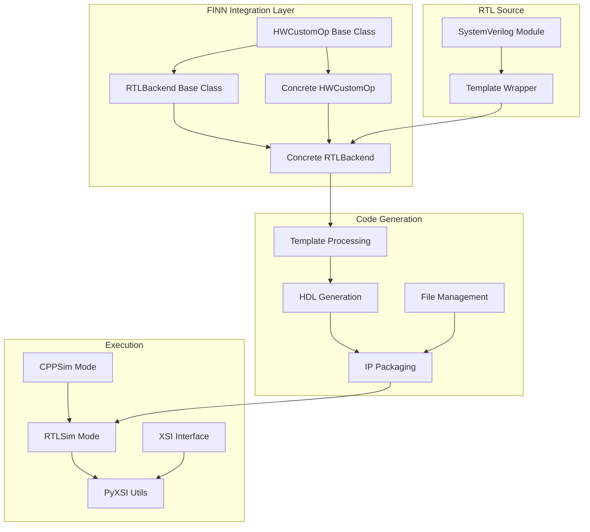

# FINN RTL Kernel Integration System Analysis

## Executive Summary

This document provides a comprehensive analysis of how FINN integrates RTL kernels through its HWCustomOp and RTLBackend framework. The analysis covers the complete pipeline from SystemVerilog source files to executable FINN nodes, including template processing, code generation, and runtime execution.

## Architecture Overview



## 1. HWCustomOp Base Class

The `HWCustomOp` class is the foundation for all FINN hardware custom operations. It inherits from QONNX's `CustomOp` and provides:

### Core Attributes (nodeattr)
```python
{
    # Backend configuration
    "backend": ("s", True, "fpgadataflow"),
    "preferred_impl_style": ("s", False, "", {"", "hls", "rtl"}),
    "exec_mode": ("s", False, "", {"", "rtlsim", "cppsim"}),
    
    # Code generation paths
    "code_gen_dir_ipgen": ("s", False, ""),
    "ipgen_path": ("s", False, ""),
    "ip_path": ("s", False, ""),
    "ip_vlnv": ("s", False, ""),
    
    # Performance tracking
    "cycles_rtlsim": ("i", False, 0),
    "cycles_estimate": ("i", False, 0),
    "rtlsim_so": ("s", False, ""),
    
    # FPGA placement
    "slr": ("i", False, -1),
    "mem_port": ("s", False, ""),
    "partition_id": ("i", False, 0),
    "device_id": ("i", False, 0),
    
    # FIFO configuration
    "inFIFODepths": ("ints", False, [2]),
    "outFIFODepths": ("ints", False, [2]),
}
```

### Abstract Methods (Must Implement)
```python
@abstractmethod
def get_number_output_values(self)
def get_input_datatype(self, ind=0)
def get_output_datatype(self, ind=0)
def get_normal_input_shape(self, ind=0)
def get_normal_output_shape(self, ind=0)
def get_folded_input_shape(self, ind=0)
def get_folded_output_shape(self, ind=0)
def get_instream_width(self, ind=0)
def get_outstream_width(self, ind=0)
```

### Interface Generation
The base class provides standard AXI interface naming through `get_verilog_top_module_intf_names()`:
- Clock: `ap_clk`
- Reset: `ap_rst_n`
- Input streams: `in0_V`, `in1_V`, etc.
- Output streams: `out0_V`
- Optional: AXI-Lite, AXI-MM interfaces

## 2. RTLBackend Base Class

The `RTLBackend` provides RTL-specific functionality:

### Core Methods
```python
@abstractmethod
def generate_hdl(self, model, fpgapart, clk)
    # Generate HDL from templates

@abstractmethod  
def get_rtl_file_list(self, abspath=False)
    # Return list of RTL files

@abstractmethod
def code_generation_ipi(self)
    # Generate TCL for IP integration

def execute_node(self, context, graph)
    # Standard execution delegating to base class or RTL sim
```

### Execution Flow
1. **CPPSim Mode**: Delegates to base HWCustomOp implementation
2. **RTLSim Mode**: 
   - Prepares input data using `npy_to_rtlsim_input`
   - Runs RTL simulation via PyXSI
   - Converts output using `rtlsim_output_to_npy`

## 3. Template Processing System

FINN uses a template-based approach for generating Verilog wrappers:

### Template Variables
Templates use `$VARIABLE_NAME$` placeholders that get replaced during code generation:

```verilog
module $MODULE_NAME_AXI_WRAPPER$ #(
    parameter PE = $PE$,
    parameter SIMD = $SIMD$,
    parameter ACTIVATION_WIDTH = $ACTIVATION_WIDTH$,
    parameter WEIGHT_WIDTH = $WEIGHT_WIDTH$
)
```

### Template Processing Pipeline
```python
def generate_hdl(self, model, fpgapart, clk):
    # 1. Prepare code generation dictionary
    code_gen_dict = self.prepare_codegen_rtl_values(model)
    
    # 2. Load template file
    with open(template_path, "r") as f:
        template_wrapper = f.read()
    
    # 3. Replace template variables
    for key in code_gen_dict:
        template_wrapper = template_wrapper.replace(key, code_gen_dict[key])
    
    # 4. Write generated file
    with open(output_path, "w") as f:
        f.write(template_wrapper)
```

## 4. Common Template Variables

### Module Identification
- `$MODULE_NAME_AXI_WRAPPER$`: Top-level wrapper name
- `$TOP_MODULE_NAME$`: Internal module name

### Datatype Parameters
- `$ACTIVATION_WIDTH$`: Input data bitwidth
- `$WEIGHT_WIDTH$`: Weight bitwidth  
- `$ACCU_WIDTH$`: Accumulator bitwidth
- `$SIGNED_ACTIVATIONS$`: Signedness flag

### Parallelization
- `$PE$`: Processing elements (output parallelism)
- `$SIMD$`: SIMD width (input parallelism)
- `$MW$`, `$MH$`: Matrix dimensions

### Configuration
- `$USE_AXILITE$`: Enable AXI-Lite interface
- `$RAM_STYLE$`: Memory implementation style
- `$DEEP_PIPELINE$`: Pipeline depth control

## 5. RTL File Organization

### Typical RTL Module Structure
```
finn-rtllib/
├── <module_name>/
│   ├── hdl/
│   │   ├── <module>.sv          # Core logic
│   │   ├── <module>_axi.sv      # AXI wrapper
│   │   └── <module>_template_wrapper.v  # Template
│   └── sim/
│       └── <module>_tb.sv       # Testbench
```

### File List Generation
```python
def get_rtl_file_list(self, abspath=False):
    rtllib_dir = os.path.join(os.environ["FINN_ROOT"], 
                             "finn-rtllib/<module>/hdl/")
    return [
        rtllib_dir + "core_module.sv",
        rtllib_dir + "axi_wrapper.sv",
        code_gen_dir + "generated_wrapper.v"
    ]
```

## 6. Multiple Inheritance Pattern

RTL implementations use multiple inheritance to combine kernel-specific logic with RTL backend:

```python
class Thresholding_rtl(Thresholding, RTLBackend):
    def __init__(self, onnx_node, **kwargs):
        super().__init__(onnx_node, **kwargs)
    
    def get_nodeattr_types(self):
        # Merge attributes from all parent classes
        my_attrs = {...}
        my_attrs.update(Thresholding.get_nodeattr_types(self))
        my_attrs.update(RTLBackend.get_nodeattr_types(self))
        return my_attrs
```

## 7. Execution Modes

### CPPSim Execution
- Uses C++ reference implementation
- Fast but less accurate
- Delegates to base class `execute_node`

### RTLSim Execution  
- Uses Vivado XSim via PyXSI interface
- Cycle-accurate simulation
- Custom execution flow:
  1. Convert numpy inputs to RTL format
  2. Initialize XSI simulation object
  3. Run simulation with AXI-Stream handshaking
  4. Convert RTL outputs back to numpy

## 8. Resource Estimation

RTL backends can provide accurate resource estimates:

```python
def bram_estimation(self):
    # Based on memory configuration
    
def lut_estimation(self):
    # Based on logic complexity
    
def dsp_estimation(self, fpgapart):
    # Based on arithmetic operations
    
def uram_estimation(self):
    # For UltraScale+ devices
```

## 9. Special Features

### Runtime Writeable Weights
Some operations support AXI-Lite interfaces for runtime parameter updates:
```python
if self.get_nodeattr("runtime_writeable_weights"):
    code_gen_dict["$USE_AXILITE$"] = "1"
```

### Implementation Style Selection
Operations can have multiple RTL implementations:
- Default
- Parallel (advanced parallelization)
- Vivado (using Vivado IP cores)

### Dynamic Configuration
Some modules support runtime configuration via AXI-Lite for parameters like:
- Convolution dimensions
- Padding values
- Stride/dilation

## 10. IP Integration (IPI)

RTL backends generate TCL commands for Vivado IP Integrator:

```python
def code_generation_ipi(self):
    commands = []
    # Add RTL files
    for f in self.get_rtl_file_list():
        commands.append(f"add_files -norecurse {f}")
    
    # Create module reference
    top = self.get_verilog_top_module_name()
    commands.append(f"create_bd_cell -type module -reference {top} {top}_0")
    
    return commands
```

## Key Insights for Kernel Integrator

1. **Template Variables**: Must match FINN's `$VARIABLE_NAME$` convention
2. **Multiple Inheritance**: RTL implementations inherit from both operation class and RTLBackend
3. **Nodeattr Merging**: Attributes from all parent classes must be properly merged
4. **File Organization**: RTL files should follow FINN's directory structure
5. **Interface Naming**: Must follow FINN's AXI interface naming conventions
6. **Execution Modes**: Support both cppsim and rtlsim modes
7. **Resource Estimation**: Implement estimation methods for synthesis planning
8. **IPI Commands**: Generate proper TCL for Vivado integration

## Recommendations for KI Enhancement

1. **Template Preprocessing**: Add support for FINN's template variable format
2. **Multiple Inheritance Generation**: Automatically generate proper class hierarchy
3. **Nodeattr Management**: Parse and generate complete nodeattr dictionaries
4. **File Path Management**: Handle FINN_ROOT relative paths correctly
5. **Execution Mode Support**: Generate both cppsim and rtlsim execution paths
6. **Resource Estimation**: Generate estimation methods based on RTL analysis
7. **IPI Generation**: Create proper TCL command generation methods